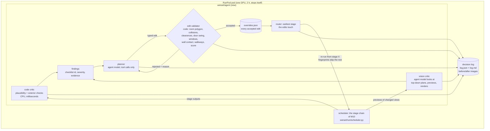

# Milestone 11 – an AI orchestrator that checks and fixes the whole pipeline inside the pod

Goal (user, 9 Oct 2026): the real02 results are bad. The exterior does not look like a real building on a real
site, and furniture placement is not logical (wrong facing, pieces floating in the middle of rooms, blocked
walkways, odd combinations). Today the pipeline is a fixed chain of stages (`wenart/run/stages.py`) with strict
rules and small AI calls (Qwen3-VL-8B, two passes, temperature 0). Nothing looks at the result as a whole, and
nothing sends a bad result back to the stage that caused it.

Milestone 11 adds an **agent**: a large open-weight vision-language model on the pod that runs the stages as typed
tools, checks every output against common sense, fixes what it finds through validated edits, and loops until the
critic is satisfied or the budget ends. The old fixed chain stays as `--no-orchestrator`.

Note on the file name: the user asked for the design in `docs/milestone10.md`, but that file is the Milestone 10
spec (815 lines, done). This design is `docs/milestone11.md`.

Status: **approved by the user on 9 Oct 2026 (D1–D8, §15)**; build in progress (steps 3–5, contracts §17).

## 1. Diagnosis of real02 (step 0, CPU, 9 Oct 2026)

Inputs: the committed real02 results of pod F1b (`results/final/real02/`, `results/furniture/real02/`,
`results/renders/real02/`) and the code that made them. Three review agents (exterior; furniture; rooms, materials,
cameras) checked every cause in the code and the data. "Fixed" = a plain bug, fixed now with a CPU test that fails
on the old code (commits `5cf5047`, `ad86494` and the furniture commit). Every fix shows only after the next pod
re-runs real02. Note: the committed exterior images are older than commit `6a5e19a` (stair shafts), so they still
show the white boxes above the ridge.

### 1.1 Exterior ("not a real building on a real site")

| # | What is wrong | Image | Stage | Code | Cause | Plain bug | Status |
|---|---|---|---|---|---|---|---|
| E1 | The ground looks like water; the plane's edge and the HDRI's own ground show ("lake shore") | ext_1–5 | build (site) | `site.py` `ground_extent`, `MARGIN_M=30`; `exterior.py` `CLIP_END=500` | the grass plane ended 30 m from the building | yes | **fixed**: flat ground to 1000 m, clip 3000 m |
| E2 | Plants stand through the roof | ext_1, 2, 5 | decor → build | `build.py` checked furniture only; the decor placer ignores the attic slope | 1.6 m plants in slots where the sloped ceiling is 0.87 m | yes | **fixed** in the build (not built, listed); the decor placer must respect the slope (step 4) |
| E3 | Grey discs float above the roof | ext_3, 4 | decor → build | `blender/furniture.py` hangs a light under the slope only without `center[2]` | ceiling lights at the flat-ceiling height 3.31 m where the slope is 1.45 m | yes | **fixed**: hung under the slope |
| E4 | White boxes above the ridge | ext_3–5 | shell (stairs) | `shell.plan_stairs` | top-floor stair shafts | yes | fixed in M10 (`6a5e19a`), not re-rendered |
| E5 | Orange band on the terrace | ext_5 | build (floors) | `shell.floor_material` | the roof terrace got the interior oak floor + unverified stripes | yes | **fixed**: terraces take the exterior paving; stripes → decision D3 |
| E6 | The roof covers only part; gable walls rise like parapets | ext_1–5 | sheets → roof | `sheets/to_building.py:312–321` cuts roof openings from the label "Teras"; `roof.py:670` | the two terraces remove the whole steep slope at both ends, the outer attic walls become assumed 1.0 m parapets; the section (vector) shows the roof closed there; nothing checks text against the section | design (trust order) | decision D5 |
| E7 | Front and back slopes too steep; attic rooms very low (bathroom 1.45 m) | ext_1, 4 | roof | `roof.py` `mansard_ends`, `_profile_tiers` | the uncut sides use the 40° lower slope up to the ridge; the plan's closed break line is not used there | design | step 5 |
| E8 | Doors and windows above the roof underside ("wooden triangles") | ext_3, 4 | openings | `build.py` `openings_through_roof` only warns | attic opening heights are an assumed 2.1 m default, not drawn | partly | step 5: clip assumed heights at the roof, or a dormer |
| E9 | Basement windows buried; thin plinth and trenches | ext_1–5 | site | `site.py` `light_wells` | the section draws ground at ±0.00; the 7.19 m basement window (sill −2.10 m) gets an assumed 0.8 m light well | no (data) | decision D6 |
| E10 | Long blank facades, no plinth, slab band or cornice | ext_1–4 | data / looks | `facade.faces` empty | the plans really have few openings on the side walls; the facade is one plain render material | no | step 5: facade looks from the brief |
| E11 | No path, steps or entrance; no plot, fence, trees | ext_1–4 | site | – | no site plan; nothing is inferred | no | step 5 |
| E12 | Grass shiny at low angles | ext_1–4 | materials | `materials.py` (Grass004) | suspected: specular on a flat plane | suspected | step 5: matte ground |
| E13 | Sky does not match the sun | all | lighting | `materials.py:851`, `lighting.py:277` | HDRI with its own low sun and ground; and the world turn used the compass azimuth while the lamp used the building frame | yes (frame) | **fixed** (frame); sky-only HDRI or physical sky: step 5 |
| E14 | Cameras stiff | all | cameras | `exterior.py` `plan_exterior` | 4 corners exactly on the 45° diagonals at 12 m, 32 mm, one aerial view | no | step 5: 30/60° toward the main facade, frontal entrance view |

### 1.2 Furniture ("wrong facing, floating pieces, odd combinations")

Root cause: 107 of 226 drawn pieces had no front (`front_deg` null). Then the builder turns them by rotation only,
so they face −Y or +X whatever the room says; in each mirrored twin pair one of the two is backwards.
Checked and **not** bugs: front = rotation − 90 in every stage file; library models' forward axis
(`catalog.reorient_rotation_deg`); mirrored blocks on the generic DXF path (full transform).

| # | What is wrong | Image | Stage | Code | Cause | Plain bug | Status |
|---|---|---|---|---|---|---|---|
| U1 | All 8 washbasins face the wall | banyo_* | ingest | `generic/symbols.py` `_block_item` | pieces typed by block name never got the drawn-front rules; corner pieces got no wall rule | yes | **fixed**: block pieces take the unique drawn front; new corner rule for long-back types |
| U2 | Toilets turned 90° | banyo_1 | ingest | same | same | yes | **fixed** |
| U3 | Master bed reversed (headboard in the room) | e_yatak_odasi_1–3 | ingest | same | `YATAK` block without front; pillows and lamps are at the east wall | yes | **fixed** |
| U4 | Wardrobes face the wall; the "wall-like board" beside the bed is a wardrobe back | e_yatak_odasi_2/3, yatak_odasi_3 | ingest + AI | `recognition/symbols.py` `_front`; `generic/core.py` | both AI passes agreed on a front into the wall; the twin's passes disagreed | yes | **fixed**: an AI front into a wall is refused (geometry beats AI); corner rule |
| U5 | Twin bedrooms get different bed fronts | yatak_odasi_3 | ingest | pillow rule | equal pillow counts: a tie picked the first side | yes | **fixed**: a tie gives no pillow front, the wall rule decides |
| U6 | Shallow pieces (≤ 0.5 m) got no wall front | – | ingest | `front_candidates` | short sides counted as touching the wall behind | yes | **fixed** (`near_wall_sides`) |
| U7 | Added dining chairs face away from the table | salon_2/3 | completion | `complete.py` `companion_problems` | the model gave every chair rotation 0; the check measured distance only | yes | **fixed**: `placer.face_host` turns companions to their host |
| U8 | Kitchen floor covered by a giant striped block; no counters | mutfak_1–3 | ingest + build | `symbols.py:1757`; `blender/proxies.py` | the whole U-shaped counter run + sink + hob = one 4.6 × 2.9 m "unknown" cluster (78 entities) built as a 0.8 m box; the double sink was typed `fridge` | partly | **fixed** (render): an unknown box that holds other pieces is drawn flat; splitting the run: step 4 |
| U9 | Giant striped boxes in the play room | oyun_1–3 | ingest + build | same | a rug / zone outline (4.5 × 3.0 m) read as one piece; round table + 2 chairs read as one piece | partly | **fixed** (flat); group splitting: step 4 |
| U10 | Huge striped dining table + 7 extra chairs | salon_1–3 | ingest + completion | `symbols.py` `named_instances`; `schemas.py:247` | one block `masa` = table + 10 chairs typed as one 3.35 × 1.57 m table; completion then asked for 8 more chairs | design | step 4: split a named block that fails its size table; no chairs for an unverified table |
| U11 | Palms read as floor lamps; a pouf read as a second sofa ("sofas in a row") | salon | AI typing | recognition | the AI typed by size without the outline shape | design | the agent re-types on the plan crop (step 3) |
| U12 | A `kitchen_counter` inside a bedroom wardrobe | e_yatak_odasi | ingest | `counter_rule` | 5 strokes of the wardrobe block read as counter legs | design (tested rule) | step 4: no counter rule on a block's own strokes |
| U13 | Added armchair 1 cm behind a sofa back, facing it | oyun_1/2 | placer | `schemas.CLEARANCE_TYPES` | seats have no front clearance | design | step 4 |
| U14 | TV unit and console stuck at the window behind the seating | salon_1/2 | completion | `schemas.py:228` | the TV wall (f_L-1_005, untyped) was not seen; the room plan demands a TV unit | design | step 4: functional groups (TV faces the main sofa) |
| U15 | Bed + nightstand read as one double bed, then 2 more nightstands added | yatak_odasi_3 | ingest | `split_composite` | touching pieces stay one cluster | design | step 4 |
| U16 | Twin rooms differ (bench vs striped box) | L1 koridor | AI | – | the AI passes disagree in one twin | design | step 3: twins take the agreed twin's type and front |
| U17 | 58 drawn pieces untyped (striped boxes) | many | recognition | two-pass rule | the two passes disagree or do not answer | design | new rule: the agent infers the type, code checks it (§5) |

### 1.3 Rooms, materials, cameras

| # | What is wrong | Image | Stage | Code | Cause | Plain bug | Status |
|---|---|---|---|---|---|---|---|
| M1 | Black/beige checkerboard marble, full height, in every bathroom and kitchen | banyo_*, mutfak_* | style | `vocabulary.py` `tiles_light → Tiles074` | the default "light tiles" asset is a dark marble checkerboard (mean luminance 0.13, gain clamped) | yes | **fixed**: procedural light ceramic 60 × 30 cm |
| M2 | Kitchens tiled to full height, tiled floor | mutfak_*, açık mutfak | build | `shell.py:138` `WET_ROOM_TYPES` includes kitchen | kitchens are treated as wet rooms | design | step 5: style walls + splashback behind counters, the brief's floor |
| M3 | Red/white stripes on 20 floors and 58 pieces in the final images | most | build | `shell.floor_material`, `materials.py:671` | unverified marker, mainly area label vs polygon > 3 % (corridors include the stair hall; open kitchen 8.5 m² label on 52 m²); generic labels use 8 % | design | decisions D3, D4 |
| M4 | Kitchen cameras low, looking at a "floor" | mutfak_1–3 | cameras | `camsearch.py:765–822` | caused by U8 (no free point; 3 views from one fallback point) | follows U8 | U8 fixed; a fallback point gives 1 view (step 3 camera tools) |
| M5 | Cameras inside a stair, views of a bare wall | oda_*, oda_2_1 | cameras | `camsearch.py:800–822` | unlabelled stair cores ("Oda") filled by the stair; a tested M10 rule keeps 2 views | design | step 3: a stair core gets no view (the hall shows it) |
| M6 | A door leaf fills ¼ of the frame | banyo_*, e_yatak_odasi_1 | cameras | `camsearch.py:170, 327` | the score rewards seeing doors; corner point next to the door | design | step 3: penalty for one large element near the lens |
| M7 | Some rooms rendered twice | L1 koridor, L0 oda, açık mutfak | ingest | `ingest/twins.py` | 3 twin pairs not paired (suspected: one piece or opening does not mirror) | suspected | step 3 |
| M8 | Unlabelled stair cores named "Oda" (room) | L0 oda | ingest | `generic/rooms.py:64` | placeholder label | design | step 4: a face filled by a stair is a stair room |
| M9 | Debug image: the drawing in a corner of a blank page | debug/one_building_dwg_p1.jpg | ingest | `debug_image.py` | a stray HATCH 318 m off the sheet set the window; the file was also from an older run | yes | **fixed** (window, stale-file warning) |
| M10 | Ceiling heights, attic slopes | L1 | – | – | checked against the section: consistent | no | – |

### 1.4 What this says about the design

- Most "illogical" results are **not** random AI errors. They are rules that never looked at the room as a
  whole: a piece without a front faces −Y, a cluster of 78 strokes becomes one box, a disagreement between two
  passes becomes a striped box, a text label cuts the roof that the section draws closed.
- No stage could see its own result. The vision check only lists mismatches with the JSON; nobody asks "does a
  bed with its headboard in the middle of the room make sense?".
- The fixes above remove the worst plain bugs; the agent and a better layout engine (§3–§6) are what remove the
  rest.

## 2. Architecture



Parts:

| Part | Where | What it does |
|---|---|---|
| Stage runner | `wenart/run/scheduler.py` (exists; its class is already called `Orchestrator`) | runs the stage chain; stage fingerprints already make a re-run from stage X cheap. New: `run_project(p, from_stage, to_stage)` for one project and a stage range |
| Agent loop | `wenart/agent/loop.py` (new; class `AgentLoop`, to avoid a clash with the scheduler's `Orchestrator`) | rounds, budget, stop rules, routing |
| Tool API | `wenart/agent/tools.py` | typed tools: name, JSON schema in and out, handler, the stage it touches |
| Edits | `wenart/agent/edits.py` | the edit types (§3.2), their validators, `overrides.json` |
| Code critic | `wenart/agent/critic_code.py` + `wenart/furniture/plausibility.py` | the checklists of §4 as code: every item it can measure |
| Vision critic | `wenart/agent/critic_vision.py` | the checklist items only an image shows, asked per room / per view with a strict schema |
| Model client | `wenart/agent/model.py` | OpenAI-compatible client of the vLLM server (tool calls, JSON schema), and `MockModel` (scripted answers) for the CPU tests |
| Log | `wenart/agent/log.py` | `outputs/<p>/orchestrator/log.json`, `log.md`, `images/` |
| CLI | `python -m wenart.agent run <p> --rounds 4 --deadline …` and `python -m wenart.run pod … [--no-orchestrator]` | orchestrated is the default; `--no-orchestrator` is the M10 chain, unchanged (golden stage list test) |

The agent never edits the building JSON or a `.blend` file directly. Every accepted edit is one entry in
`outputs/<p>/orchestrator/overrides.json`. A new CPU step `apply_overrides` reads it after `layout`/`decor`
(furniture, room types, materials) and the build reads it for cameras, exterior and lighting. So a re-run is
deterministic, the overrides are part of the stage fingerprints, and `--no-orchestrator` ignores them.

## 3. Tool API

All tools take and return JSON. The model sees their JSON schemas (OpenAI `tools` format through vLLM). The model
writes no code and runs no shell commands; a tool call that does not match its schema is rejected with the schema
error, and that counts against the round's call budget.

### 3.1 Read tools (no side effects)

| Tool | Input | Output |
|---|---|---|
| `building_summary` | `level?` | levels, rooms (type, name, area, status, ceiling), counts, open conflicts |
| `room` | `room_id` | polygon, walls with ids, doors (width, hinge, swing polygon), windows (sill, head), pieces (id, type, footprint, `front_deg`, against-wall, source, labels, checks) |
| `room_topdown` | `room_id`, `annotate` | PNG made on the CPU: room, pieces with front arrows, door swings, window bands, walkways, failed checks in red |
| `plan_crop` | `room_id` or `piece_id` | the source plan crop (what the drawing shows) |
| `plausibility` | `room_id` or `building` | score 0–100 and the violations of §4 (code) |
| `view` | `view_id` | preview or final render, plan crop with the camera cone, visible elements |
| `exterior_summary` | – | outline, levels and grade, roof (type, pitch, ridge, eaves), openings per facade, site, sun, exterior cameras |
| `catalog` | `type`, `style?`, `size?` | library models with real sizes and style tags |
| `stage_status` | `stage?` | status, seconds, notes of the stages |

### 3.2 Edit tools (validated by code before they are accepted)

| Tool | Input | Code checks before acceptance | Re-run from |
|---|---|---|---|
| `move_piece` | `piece_id`, `center` or `snap_wall_id` + `offset` | inside the room, no overlap, clearances, door swing, window band, walkway, drawn-piece lock (§5) | `refit` |
| `rotate_piece` | `piece_id`, `front_deg` | as above + the front faces free space (not a wall) | `refit` |
| `resize_piece` | `piece_id`, `size` | the size is within the type's real product sizes (schemas size table) + as above | `refit` |
| `change_type` | `piece_id`, `type` | the type is allowed in the room type and fits the footprint (size table) | `refit` |
| `swap_model` | `piece_id`, `asset_id` | the asset is of the piece's type and style family, scale caps of M4 | `refit` |
| `add_piece` / `add_group` | `room_id`, `type` or group (`dining_set`, `bed_set`, `living_set`, `desk_set`, `kitchen_run`), anchor | layout engine places it (§6); all placer checks; no second anchor piece | `refit` |
| `remove_piece` | `piece_id`, `reason` | `added_by_ai`: always allowed; drawn: only with a clear-error reason (§5) and the plan crop as evidence | `refit` |
| `relayout_room` | `room_id`, `constraints` | layout engine (§6) re-places the AI pieces; the drawn pieces stay locked | `layout` |
| `set_room_type` | `room_id`, `type`, `reason` | the type fits area, fixtures and doors | `layout` |
| `set_camera` / `add_camera` / `remove_camera` | `view_id`, position, target, lens | inside the room (interior) or outside the site boundary at 1.5–1.7 m (exterior), not inside a piece, ≥ 0.6 m from a door leaf | `build` (that view only) |
| `set_material` | `slot` (walls, floor, wet walls, kitchen walls, facade, roof, ground, frames …), `look_id` | the look exists in the vocabulary; style family of the brief | `build` |
| `set_exterior` | roof type / pitch / eaves, ground, site items, sun azimuth/elevation | roof covers the outline, site is outside the building, sun above horizon | `build` |
| `correct_geometry` | `kind` (close gap, merge duplicate wall, fix opening on wall), ids, `evidence` | only a clear error: gap ≤ 0.15 m, duplicate within 0.02 m, opening ≤ 0.10 m off its wall; logged as `corrected_by_ai` | `pipeline_final` |
| `rerun_stage` | `stage`, `settings` (white list per stage, e.g. camera policy, samples, completion on/off) | the setting is on the white list | that stage |
| `finish` | `verdict`, `open_findings` | – | – |

Every edit tool returns `{accepted, failed_checks, score_before, score_after, overrides_id}`. An edit is
rejected when it fails a hard check, or when it lowers the room's plausibility score. The model sees the reason
and may try again (at most 3 tries per finding).

## 4. Critic checklists

Severity: **critical** (the image is wrong: a missing roof, a bed in the middle of a room, a blocked door),
**major** (clearly odd: sofa facing a wall, chairs not at the table), **minor** (taste). Each item says whether
code measures it (C), the vision critic judges it (V) or both.

### 4.1 Building and exterior

| Id | Check | How |
|---|---|---|
| X1 | outer walls closed on every level; levels stacked on slabs; no floating parts | C |
| X2 | roof covers the whole outline (overhang 0.3–0.8 m), its type matches the section / outline; no wall rises above the roof except gables and parapets; nothing pokes through the roof (stair shafts, decor) | C + V |
| X3 | windows and doors on the facades in plausible places; no long blank facade on a habitable room; entrance door at grade with steps or a ramp when the floor is above grade | C + V |
| X4 | ground and site: textured ground (grass, paving), a path to the entrance, the plot boundary; basement below grade when the section says so | C + V |
| X5 | believable scale: storey heights 2.6–3.3 m, door 2.0–2.2 m, window sill 0.8–1.1 m | C |
| X6 | exterior cameras: eye level 1.5–1.7 m, outside the building, 3/4 corner view with two facades, the whole building in frame, verticals straight; one frontal view of the entrance facade | C + V |
| X7 | sky and sun: sun 25–50° above the horizon, from the side of the main facade, shadows visible; sky matches the lighting mood | C + V |
| X8 | facade, roof, frame materials follow the brief (`dark bronze window frames` → dark bronze frames) | C |

### 4.2 Rooms

| Id | Check | How |
|---|---|---|
| R1 | room type fits area, fixtures and doors (a room with a bathtub is a bathroom; a 3 m² room is not a bedroom) | C + V |
| R2 | ceiling height plausible; attic slopes follow the roof | C |
| R3 | every door opens into free space; door swing clear | C |
| R4 | finishes fit the room: tiles in wet rooms, a backsplash (not full-height tiles) in kitchens, the brief's colours elsewhere | C + V |
| R5 | lighting: no black rooms, no blown windows | C (existing metering) |

### 4.3 Furniture

| Id | Check | How |
|---|---|---|
| F1 | right type for the room (no kitchen counter in a bedroom; no dining table in a bathroom) | C + V |
| F2 | real size: within the type's product sizes; height plausible | C |
| F3 | back to the wall where it belongs: bed headboard, sofa (unless it faces a group in an open room), wardrobe, kitchen run, TV unit, bookshelf, dresser, desk (wall or window) | C |
| F4 | fronts face the right way: sofa → TV unit / coffee table; armchairs → the coffee table; dining chairs → the table; desk → window or wall; bed foot → free space | C + V |
| F5 | groups belong together: dining table + chairs (count by table size), bed + 2 nightstands (single bed: 1), sofa + coffee table (+ TV unit), desk + chair | C |
| F6 | clearances: 0.6 m in front of wardrobes, 0.9 m walkway, 0.7 m beside a bed, 0.75 m behind dining chairs | C (existing placer) |
| F7 | no blocked door or window (taller than the sill) | C (existing placer) |
| F8 | no floating piece: a piece that is not against a wall is part of a group (sofa facing a TV, island in a kitchen) | C |
| F9 | nothing odd in the image: a piece through a wall, a giant box, a piece on the roof, duplicated pieces | V |

### 4.4 Views and renders

| Id | Check | How |
|---|---|---|
| V1 | camera inside the room, not inside a piece, not pressed against a door leaf; eye height 1.2–1.6 m; the room's main group in frame | C + V |
| V2 | the render matches the building JSON (the M5 check, now one pass of the agent model + the object-index pass as code) | C + V |
| V3 | no debug markers (stripes) in final images (decision D3) | C |
| V4 | polish changed no geometry (the M5 gate, unchanged) | C |

## 5. Rules the validator enforces (from the new CLAUDE.md wording)

- Walls, openings and room outlines from DWG/PDF vectors are locked. Only `correct_geometry` changes them, only for
  the clear errors it lists, with the evidence.
- Drawn fixed equipment (stairs, kitchen runs, island, appliances, sanitary ware): type, place, orientation and
  footprint locked; only a clear drawing error may be fixed (`adjusted_by_ai`, reason, evidence).
- Drawn furniture: kept by default. The agent may rotate (front), move it ≤ 0.3 m or snap its back onto a wall
  (≤ 1.2 m, pod G2b), resize to a
  real product size, change the type within the room type, or fix a clear drawing error (e.g. a rug outline read as
  a piece, a cushion read as a sofa, a table footprint that includes its chairs). Each change keeps `drawn_type`,
  `drawn_footprint`, `drawn_front_deg` and gets `adjusted_by_ai: {reason, round, model}`.
- AI pieces (`added_by_ai`) may be moved, swapped or removed freely, always through the placer checks.
- Every inferred item (`inferred: true`) is listed in the report.

## 6. Better layout engine (step 4)

The agent is only as good as its tools. `wenart/furniture/` gets:

| Feature | What | Where |
|---|---|---|
| Wall snapping | snap a piece's back edge to the nearest wall segment (parallel, 0.02 m gap), skipping doors and window bands | `placer.snap_to_wall` (exists in part: `_snap_to_segment`) |
| Front/back rules per type | table per type: `back: wall | free | group`, `front_to: tv_unit | table | window | free`, side rules | `schemas.ORIENTATION_RULES` |
| Functional groups | dining set, bed set, living set, desk set, kitchen run: anchor + members with relative offsets and facing; placed as one unit, then checked | `wenart/furniture/groups.py` (new) |
| Circulation | a walkway graph from every door to every other door and to each piece's use side; 0.9 m main, 0.6 m secondary | `placer.walkway_*` (exists in part) |
| Door swings, window clearances | exist (`DoorZone.swing`, `WindowZone.band`); used by every edit | – |
| Plausibility score | 100 minus weighted violations of §4.3 per room; the critic, the edit validator and the tests use the same function | `wenart/furniture/plausibility.py` (new) |
| Untyped drawn pieces | an unknown footprint that contains other pieces is a rug or a group outline; one that matches a type's size table and position rule gets that type as `inferred` (the agent confirms it on the plan crop) | `wenart/furniture/infer.py` (new) |

## 7. Exterior (step 5)

| Item | Today (§1.1) | Target |
|---|---|---|
| Roof | E6, E7, E8 | a roof from the outline (hip / gable / mansard by the section, else hip), overhang 0.5 m, eaves and gutters, nothing through it |
| Ground and site | E1 (fixed), E11, E12 | grass with a texture, paving around the house, a path to each entrance, a low fence or hedge at the plot boundary (a plot of outline + 6 m when no site plan), a few trees |
| Grade | E9 | the basement below grade when the section's ground line says so (light wells for its windows), else the ground at the lowest floor |
| Facade | E10 | facade, plinth, frame and roof materials from the brief (`style.exterior`), window frames in the brief's colour |
| Cameras | E14 | 2 corner views at 1.6 m eye height and 3/4 angle (two facades), 1 frontal view of the entrance, 1 high view; lens 24–28 mm, straight verticals (shift), building fills 60–80 % of the width |
| Sun and sky | E13 | sun 35° up, 45° to the main facade, HDRI sky of the mood; shadows on the ground |

## 8. The feedback loop

```
round 0  stage chain up to render, previews only (960×540, 32 samples, no polish)
round k  1. code critic: plausibility of every room, exterior checks          (CPU, seconds)
         2. vision critic: per room the top-down image + its previews;
            per exterior view; strict JSON findings                          (GPU, ~3–6 s per call)
         3. planner: findings → tool calls (≤ 40 per round), validated
         4. router: earliest stage the accepted edits touch → re-run from it;
            render only the views whose scene changed (previews)
         5. stop when: no critical/major finding left, or no edit accepted
            in this round, or max rounds (4), or the time budget (below)
final    full renders (1920×1080, 128 samples), gate, polish, final check
         (agent model, one pass + object-index code check)
         → findings go back once more if they are critical and time allows
           (only the changed views are rendered again)
report   report.md with the agent section: rounds, findings, edits, open items
```

Routing of findings to stages:

| Finding source | Example | Goes back to |
|---|---|---|
| recognition | drawn sink typed fridge; a rug read as a box; room type wrong | `change_type` / `set_room_type` overrides → `layout` |
| fit | wrong model, wrong size, model rotated | `swap_model` / `resize_piece` → `refit` |
| layout / completion / decor | facing, floating, missing group, blocked door | edits → `refit` (or `layout` for `relayout_room`) |
| shell / exterior | roof, grade, facade, site | `set_exterior` / `correct_geometry` → `build` / `pipeline_final` |
| materials / lighting | full-height tiles in a kitchen, wrong frame colour | `set_material` → `build` |
| camera | view of a bare wall, camera behind a door leaf | camera edits → `build` (that view) |
| polish | the polish added an object | `rerun_stage polish` with a lower strength, else Cycles |

Time budget: the loop stops when `now + estimate(final stages) > deadline − 20 min` (the user's rule: stop at
least 20 min before the 2 h deadline). Estimates come from `wenart/run/plan.py` (measured per stage).

## 9. Decision log

`outputs/<p>/orchestrator/log.json` (schema `wenart/schema/agent_log.schema.json`), one entry per event:

```json
{"seq": 42, "round": 2, "t": "2026-10-10T08:12:31Z", "kind": "edit",
 "model": "<model id>", "revision": "<sha>", "call_id": "r2-c17", "pass": 1,
 "checklist": "F4", "severity": "major", "target": "f_L-1_017",
 "finding": "corner sofa faces the window wall; the TV unit f_L-1_005 is behind it",
 "evidence": {"images": ["images/r2_topdown_r_L-1_salon.png"], "metrics": {"front_hits": "wall w_L-1_012"}},
 "tool": "rotate_piece", "args": {"piece_id": "f_L-1_017", "front_deg": 180},
 "validation": {"accepted": true, "failed_checks": [], "score_before": 61, "score_after": 78},
 "label": "adjusted_by_ai", "reason": "sofa must face the TV unit",
 "before": "images/r2_f_L-1_017_before.png", "after": "images/r2_f_L-1_017_after.png",
 "rerun_from": "refit"}
```

`kind`: `check`, `finding`, `edit`, `rejected_edit`, `rerun`, `render`, `stop`. `log.md` is the same as tables per
round with the before/after images side by side. Every changed piece gets in the building JSON:
`source` (`from_documents` / `added_by_ai`), `adjusted_by_ai: {reason, round, log_seq}` when changed, and
`inferred: true` when its type or placement was inferred.

## 10. Test plan

CPU (`pytest -m "not gpu"`, with `MockModel` that replays scripted tool calls):

| Test | What it proves |
|---|---|
| tool schemas | every tool's input/output schema is valid JSON Schema; a bad call is rejected with the error |
| edit validators | per edit type a passing and a failing case (outside room, overlap, door swing, window, walkway, drawn lock, score drop) |
| plausibility | hand-made rooms: bed in the middle → F3 critical; bed headboard on a wall → no F3; sofa facing a wall → F4; table without chairs → F5; dining chairs facing away → F4 |
| real02 regression | `results/furniture/real02/building_final.json`: the critic finds the known problems of §1 (≥ the listed counts); after the scripted edits the room scores rise and no hard check fails |
| loop | stops at max rounds, at the deadline, when no edit is accepted, when no finding is left; routing picks the earliest stage |
| overrides | applying twice = once; fingerprints change with overrides; `--no-orchestrator` ignores them |
| log | every edit has a validation, reason, model, round; log.md renders |
| fallback | `python -m wenart.run pod --no-orchestrator` gives the M10 stage list (golden) |
| exterior | roof covers outline, nothing above the roof, ground material textured, cameras outside the building at eye level |

GPU (`pytest -m gpu`, on the pods):

| Test | What it proves |
|---|---|
| model serves | vLLM starts with the agent model; one tool call and one JSON-schema answer are valid |
| critic smoke | the vision critic flags a planted error (a bed rotated 180°, a sofa facing a wall) in a preview |
| loop on synthetic-01 | ends with no critical finding, log written, every accepted edit validated |
| real02 | after the loop: plausibility up for every furnished room, no critical exterior finding, report lists every inferred item |

## 11. Model choice (checked 9 Oct 2026 on Hugging Face, PyPI, vLLM v0.30.0 source and the vLLM recipes)

`docs.vllm.ai` and `recipes.vllm.ai` were blocked here; the same pages were read as raw files on GitHub. Speeds
marked (S) are from third-party snippets only; (est.) are estimates.

| Model (HF id, revision) | Licence | Size | Vision | Weights | Tool calling in vLLM 0.30.0 | Fits next to Cycles on 96 GB |
|---|---|---|---|---|---|---|
| **`Qwen/Qwen3.8-27B-FP8`** @`017b9c7af6b5689d5dd426a76e0bc077eb5ca20a` (pick) | Apache-2.0 | 27.8B dense | yes | 28.7 GiB (official FP8) | `--enable-auto-tool-choice --tool-call-parser qwen3_coder --reasoning-parser qwen3` (strict tool schemas supported) | yes, ≈ 50 GB with KV cache |
| `Qwen/Qwen3.6-35B-A3B-FP8` @`95a723d08a9490559dae23d0cff1d9466213d989` (fallback, faster) | Apache-2.0 | 36B, 3B active | yes | 37.5 GB | same flags | yes, ≈ 55 GB |
| `google/gemma-4-31B-it` @`842da3794eaa0b77d5f08bae87a17459d91ff475` (other family, optional second opinion) | Apache-2.0 | 30.7B | yes | 62.5 GB bf16 (no official FP8) | `gemma4` parser, no strict tool schemas | yes, tight |
| Qwen3-VL-32B / 30B-A3B | Apache-2.0 | 33B / 31B-A3B | yes | 35 / 32 GB FP8 | `hermes` | yes, older generation |
| GLM-4.6V (108B), Qwen3.5-122B, Mistral Small 4 (119B) | MIT / Apache / Apache | 108–125B | yes | ≥ 79 GB | yes | **no** (no room for Cycles) |
| gpt-oss-20b / 120b | Apache-2.0 | 21B / 117B | **no** | 14 / 65 GB | `openai` | text only: would need a second model for vision |
| Qwen3.8-Flash-Next | qwen-community-1.0 (**flag**) | 180B | yes | ≥ 250 GB | – | no |

Why the pick: one model for both agent and critic, a vision-language model of the newest Qwen generation, Apache-2.0,
an official FP8 checkpoint, verified on Blackwell (sm_120) in the vLLM recipe, and better agent and vision scores
than the 27B/35B alternatives on its model card (OSWorld-Verified 84.3 vs 63.9 for Qwen3.6-27B; multimodal tool
use ClawEval-MM 57.4 vs 42.6). vLLM 0.30.0 (our pinned version) already supports it; 0.31.0 is not needed.

Serving (to be confirmed on the model-check pod):

```
vllm serve Qwen/Qwen3.8-27B-FP8 --revision 017b9c7af6b5689d5dd426a76e0bc077eb5ca20a \
  --enable-auto-tool-choice --tool-call-parser qwen3_coder --reasoning-parser qwen3 \
  --max-model-len 32768 --max-num-seqs 4 --limit-mm-per-prompt '{"image":4}' --gpu-memory-utilization 0.55
```

- Structured output: in vLLM 0.30.0 a forced tool call (`tool_choice="required"`) and a JSON-schema
  `response_format` cannot be combined in one request. The agent uses `tool_choice="auto"` with `strict: true`
  tools; the critic uses `response_format` (JSON schema) with no tools. Both are validated again in our code.
- Thinking: off for critic calls (`enable_thinking: false`), low effort for the planner. Temperature 0 as today;
  the model card recommends sampling, so the model-check pod tests temperature 0 for repetition loops.
- Optional speed-up: MTP speculative decoding (`--speculative-config '{"method":"mtp","num_speculative_tokens":5}'`);
  tested on the model-check pod, kept only if it works with strict tool calls.

VRAM plan, RTX PRO 6000 (96 GB) (est.):

| Item | GB |
|---|---|
| Agent model weights (FP8) | 29 |
| KV cache (4 × 32k tokens; only 16 of 64 layers keep a full KV cache) | 16 |
| Vision encoder, CUDA graphs, activations | 5 |
| **vLLM (`--gpu-memory-utilization 0.55`)** | **≈ 53** |
| Blender Cycles (scene + render) at the same time | 10–20 |
| Free | ≈ 23 |

The agent server stays up while Blender renders (no swap). For the polish and gate stages (≈ 22 GB) the server is
put to sleep (`--enable-sleep-mode`, `POST /sleep?level=1`, weights to CPU RAM) or stopped, then woken. On 48 GB
GPUs the agent runs alone and swaps with Blender (sleep mode); 32 GB and below: not supported in M11.

Speed (est.): ≈ 40–50 tokens/s per stream without MTP; a vision critique (one 1920×1080 image + 2k text tokens,
≈ 400 output tokens, no thinking) ≈ 6–10 s; a planner step ≈ 10–40 s. Measured on the model-check pod (G1).

The Qwen3-VL-8B + GLM-4.6V-Flash pair stays for `--no-orchestrator` and for the recognition questions that have no
code check (two passes there, as today).

## 12. Time and cost per project, pods

Estimates on an RTX PRO 6000 (≈ $2.5/h measured in M10); measured on pod G1 before the full runs.

| Part | real02 (19 rooms, 47 views) | real01 / synthetic-01 (≈ 6–10 rooms) |
|---|---|---|
| Setup (venvs, downloads, agent model ≈ 31 GB at 1.1 GB/s) | 20 min | 20 min (shared on one pod) |
| Stage chain to the previews (round 0) | 15 min | 6–8 min |
| One round: code critic (s), vision critic (≈ 19 rooms × 2–3 images × 6–10 s ≈ 5 min), planner (≈ 3 min), re-run + previews (≈ 4 min) | ≈ 12 min | ≈ 6 min |
| Rounds (max 4; usually 2–3) | 25–45 min | 12–24 min |
| Final: full renders, gate, polish, final check, report | 25 min | 10–15 min |
| **Total** | **85–105 min** | **30–50 min each** |

| Pod | What | GPU time | Cost (est.) |
|---|---|---|---|
| G1 | model check: serve the pick and the fallback, tool calls, critic on real02 previews with planted errors, speed, VRAM next to a Cycles render, temperature 0, MTP; GPU tests of the agent | ≈ 45 min | ≈ $2 |
| G2 | real02 orchestrated (base + the Açık mutfak variant), GPU tests | ≤ 115 min | ≤ $5.2 (**over $5 worst case: needs your OK**, `--over-5-ok`) |
| G3 | real01 + synthetic-01 orchestrated, old pipeline for the before/after where missing, GPU tests | ≤ 115 min | ≤ $5.2 (**needs your OK**) |
| **M11 total** | | ≈ 4.6 h | **≈ $12** (spent so far $65.68 of $100 → ≈ $78) |

All within the limits ($5/GPU-hour, $30/day, 2 h per pod, one pod at a time). Today (9 Oct, UTC) $28.08 of the $30 daily cap is spent
(`scripts/gpu_run.py status`), so the M11 pods start on 10 Oct at the earliest; G2 and G3 on one day ≈ $10.5. Each pod has the watchdog and
self-stop of `scripts/pod_entry.sh`; the agent loop stops itself 20 min before the deadline.

## 13. Order of work after your OK

| Step | What | Where it runs |
|---|---|---|
| 3 | agent core with `MockModel`: tools, edits + validators, overrides, loop, router, log; `--no-orchestrator` | CPU, here |
| 4 | layout engine: wall snapping, orientation rules, groups, circulation, group splitting, type inference, plausibility | CPU, here (parallel with 3) |
| 5 | exterior: roof from outline and break line, grade, site, facade looks, cameras, sky | CPU, here (parallel with 3; Blender CPU test renders) |
| 6 | pods G1, then G2, G3 | RunPod |
| 7 | report: before/after per project, AI decisions, rounds, minutes, cost; `docs/progress.md` | here |

Commit, push and `docs/progress.md` after each step.

## 14. Risks

| Risk | Mitigation |
|---|---|
| The agent "fixes" correct drawn data | locked geometry and drawn-piece rules in the validator (§5); every change logged with evidence; the report lists them |
| Loops that do not converge (edit A undoes edit B) | an edit must not lower the room score; the same piece is edited at most 3 times; stop when a round accepts nothing |
| Vision critic hallucinates findings | a vision finding needs a code-checkable target (piece id, view id); findings the code contradicts are dropped and logged |
| The model at temperature 0 repeats itself | tested on G1; `presence_penalty` or a low temperature with a fixed seed as fallback (logged) |
| Time: real02 needs a whole pod | rounds cut by the time budget; the final stages are reserved first |
| 27B model too slow | fallback `Qwen3.6-35B-A3B-FP8` (3B active, ≈ 3–4× faster), same code path |

## 15. Decisions for the user

| # | Question | Recommendation |
|---|---|---|
| D1 | The new `CLAUDE.md` wording (§16) | OK as written; I edit `CLAUDE.md` only after your OK |
| D2 | Agent + critic model `Qwen/Qwen3.8-27B-FP8` (Apache-2.0), fallback `Qwen/Qwen3.6-35B-A3B-FP8` | yes |
| D3 | Unverified stripes in the final images | take them out of final images; show them in the debug top-down images and a "review" contact sheet, list every item in the report |
| D4 | Room area label vs measured area (18 of real02's rooms are unverified at 3 %) | compare with the polygon minus the stair opening; 8 % tolerance (as the generic label check); beyond that the agent decides and logs it |
| D5 | real02 attic ends: the plan labels a 22 m² "Teras" per dwelling, but the section draws the roof closed there | you know the building: is it a roof terrace cut into the mansard roof (today's build), or a closed roof? |
| D6 | real02 basement: the section draws the ground at ±0.00, so the 7 m wide basement windows are buried | is there a sunken garden / open court in front of the basement? If yes, the site gets one |
| D7 | Pods G2 and G3: worst case 115 min × ≈ $2.6/h ≈ $5.2 each (over the $5 single-action line) | OK to run them with `--over-5-ok` |
| D8 | The Qwen3-VL-8B + GLM-4.6V-Flash pair | keep for `--no-orchestrator` and for the recognition questions without a code check; orchestrated runs use the agent model alone, checked by code |

## 16. `CLAUDE.md` wording (approved 9 Oct 2026, committed in `d602269`; replaced "Furniture rules" and "No-hallucination rules")

### Furniture rules (new wording)
- Fixed equipment drawn in the documents (stairs, kitchen counter runs, kitchen island and appliances, sanitary
  ware) is treated like walls: same type, position, orientation and footprint as drawn. Style changes only the
  look. The AI may fix only a clear drawing error (e.g. a front that faces the wall), logged as `adjusted_by_ai`.
- Drawn furniture is kept by default. The AI may correct its orientation, snap it to a wall, change its size to a
  real product size, change its type within the room type's types, and fix clear drawing errors (a rug outline
  read as a piece, a cushion read as a sofa, a table footprint that includes its chairs). Every change keeps
  `drawn_type`, `drawn_footprint`, `drawn_front_deg`, `drawn_height` and is labelled `adjusted_by_ai` with the
  reason. A drawn piece is removed only when it is clearly not furniture (logged with the plan crop as evidence).
  With `keep` or `furnished_rooms_keep_size` only the look, the orientation and clear errors change.
- Footprint clear but type unclear → the AI infers the type from size, room and neighbours, marks it `inferred`
  and lists it in the report. It never stays an unexplained box.
- Rooms with drawn furniture: with `furnished_rooms: complete` (default) the AI adds the pieces the room type
  misses (`added_by_ai`, `completes_room: true`); never a second anchor piece. Small decor if the brief allows it
  (default: yes).
- Rooms with no furniture in the documents: the AI furnishes them in the project style (default).
- Every placement or edit passes the code checks before it is accepted: inside the room, no collisions, real
  clearances and walkways, door swings free, windows free, backs to walls where the type needs it, fronts facing
  their group.
- Every piece is labelled `from_documents` (with evidence), `added_by_ai` or `adjusted_by_ai` (with the reason).

### Evidence and inference rules (new wording, replaces "No-hallucination rules")
- Source geometry (DWG/DXF entities, vector PDF paths) is the anchor for walls, openings, room outlines and
  levels. The AI may override it only for a clear error (e.g. a 5 cm gap in an outer wall, a duplicated wall, a
  door off its wall); it logs the reason and the evidence, and the item is marked `corrected_by_ai`.
- Trust order when sources disagree: vector geometry > OCR text and dimensions > AI vision. Conflicts: prefer
  DWG > vector PDF > scan > photo, and list every conflict in the report.
- Where the documents are silent, unclear or illogical, the AI infers, completes and corrects: furniture type,
  orientation and placement, missing exterior parts (roof, ground, site), cameras, materials, lighting. Each such
  item is marked `inferred` (or `adjusted_by_ai`) and listed in the report.
- Missing scale or open outer walls: the AI tries to infer them first (dimension text, door widths, stair treads,
  typical room sizes, closing small gaps) and marks them `inferred`. "needs review" only for real blockers: no
  usable geometry at all, or inferences that contradict each other.
- Every wall, door, window, room, furniture piece, label and dimension in the building JSON carries evidence:
  file, page, layer/entity id or pixel box, method (vector / ocr / ai / inferred), confidence; AI changes also
  carry the model, the round and the reason.
- AI calls: temperature 0, typed tools and strict JSON schemas. Every AI edit is checked by code before it is
  accepted. A critique loop with code validation replaces the "two passes must agree" rule; two independent passes
  stay only where no code check exists (e.g. reading a label that no geometry confirms).
- Everything is logged: every check, finding, edit, rejected edit and reason goes to
  `outputs/<p>/orchestrator/log.json` and `log.md` with before/after images. Nothing changes silently.
- AI polish must not change geometry: compare edge and depth maps before/after and reject changed results. A
  final vision check compares every render with the building JSON and the source plan; its findings go back to
  the stage that caused them.
- Save a debug image per page with detected elements drawn over the original, colored by method and confidence.

## 17. Contracts of the build (frozen 9 Oct 2026; only the lead edits this section)

The user's answer of 9 Oct 2026: "OK to D1–D8". D5 and D6 were questions about the building; they become brief
options with an evidence-based default and stay on the open list of the report:

- D5 `roof_terraces: auto | cut | closed` (default `auto`: a terrace is cut into the roof when the plan of that
  level draws it as a room with a door to it, as real02's attic does; else the roof stays closed; either way the
  conflict with the section is listed).
- D6 `site.front_court: auto | yes | no` (default `auto`: a sunken court, marked `inferred`, in front of a basement
  window whose sill lies more than 1.0 m below the ground; else the M10 light well).
- D3 `markers_in_final: false` (default): the unverified stripes are left out of every render; the debug top-down
  images and the report list the items. D4: a room's area label is compared with the polygon minus its stair
  openings, 8 % tolerance.

### 17.1 Tracks and file ownership

| Track | Owns (only this track edits) | Tests |
|---|---|---|
| A agent core (§2, §3, §8–§11) | `wenart/agent/**` (new), `wenart/run/**`, `wenart/vision_check/check.yaml`, `wenart/report/**`, `scripts/jobs/*.sh`, `scripts/pod_setup_*.sh` | `tests/test_agent_*.py`, `tests/test_run_*.py`, `tests/test_report*.py`, `tests/gpu/test_agent.py` |
| B layout engine (§6, D4) | `wenart/furniture/**`, `wenart/ingest/**`, `wenart/recognition/**` | the matching `tests/test_*.py` |
| C exterior, rooms, cameras (§7, D3, D5, D6, M2, M5, M6) | `wenart/blender/**`, `wenart/style/**`, `wenart/sheets/**`, `wenart/brief.py`, `wenart/defaults.yaml`, `wenart/vision_check/exterior.py` | the matching `tests/test_*.py` |
| Lead | `CLAUDE.md`, `docs/**`, `wenart/schema/building.schema.json`, the stub signatures below | `tests/test_m11_contracts.py` |

A track that needs a change in another track's files writes it down in its report; the lead decides.

### 17.2 Interfaces (stub modules committed by the lead; signatures frozen)

| Module (owner) | Functions | Used by |
|---|---|---|
| `wenart/furniture/plausibility.py` (B) | `CHECKS`; `score_room(building, room_id) -> {room_id, score, violations}`; `score_building(building) -> {rooms, mean, counts}` | A (code critic, validator), tests |
| `wenart/furniture/edit_ops.py` (B) | `EDIT_OPS`, `EDIT_SCHEMAS`; `apply_edit(building, edit, *, catalog=None) -> {accepted, failed_checks, score_before, score_after, building, changed_ids, rerun_from, message}` | A (edit tools) |
| `wenart/furniture/groups.py` (B) | `GROUPS`; `place_group(building, room_id, group, anchor=None) -> {ok, pieces, failed, reason}` | B (`add_group`), A |
| `wenart/furniture/infer.py` (B) | `infer_types(building) -> [proposal]`; `apply_inferences(building, proposals) -> building` | B (pipeline), A (agent confirms on the plan crop) |
| `wenart/blender/exterior_checks.py` (C) | `CAMERA_/EXTERIOR_/MATERIAL_OVERRIDE_SCHEMA`; `check_exterior`, `check_views`, `validate_camera_override`, `validate_exterior_override`, `validate_material_override` | A |

`Violation = {check, severity, target, room_id, message, metrics}` everywhere.

### 17.3 Data between the tracks

- `building["agent_overrides"] = {"cameras": [...], "exterior": {...}, "materials": {...}, "round": n}` (schema
  `agent_overrides`). Track C's build reads it; without it the build is unchanged (the `--no-orchestrator` path).
  Camera entry: `{action: set | add | remove, view_id, kind: interior | exterior, room_id, position [x, y, z],
  target [x, y, z], lens_mm, reason}`. Exterior: `{roof: {type, pitch_deg, overhang_m}, ground: look_id,
  site: {path, fence, trees, front_court}, sun: {azimuth_deg, elevation_deg}}` (every key optional). Materials:
  `{slot: look_id}` on top of `style.json`.
- `outputs/<p>/orchestrator/overrides.json` (A): `{"project", "edits": [{"seq", "round", "tool", "args",
  "result"}]}`; `python -m wenart.agent apply <out>` replays the accepted furniture edits through
  `edit_ops.apply_edit` on `building_decor.json` and writes `building_agent.json` (with `agent_overrides`);
  `refit` reads `building_agent.json` when it exists (A owns the stage change).
- Labels (schema): `adjusted_by_ai {reason, round, log_seq, model, changed}`, `inferred: true`, evidence method
  `inferred`, `drawn_front_deg`, `corrected_by_ai` on rooms.
- The agent model (A, `check.yaml models.agent`): `Qwen/Qwen3.8-27B-FP8` @`017b9c7af6b5689d5dd426a76e0bc077eb5ca20a`;
  fallback `models.agent_fast`: `Qwen/Qwen3.6-35B-A3B-FP8` @`95a723d08a9490559dae23d0cff1d9466213d989`.


## 18. As built (9 Oct 2026, steps 3–5)

Three tracks built in parallel git worktrees and were merged into `opus_branch_05` (A `8a102c4`, B `60e8028`,
C `232143a`, merge fixes `20b103c` and later). A container restart stopped all three mid-way; the worktrees
survived and the tracks resumed.

### 18.1 Track A – agent core (`wenart/agent/`)

| Part | As built |
|---|---|
| Model client | `model.py`: planner calls with strict tools (`tool_choice: auto`), critic calls with a JSON-schema `response_format` and thinking off; temperature 0, seed 0, ≤ 4 images; `MockModel` replays scripts |
| Tools | `tools.py`: 9 read tools, 10 furniture edits (`edit_ops.apply_edit`), camera / material / exterior edits (`exterior_checks` validators), `correct_geometry` (**record-only**: logged and reported, not applied, because applying needs `pipeline_final` and would drop the furniture rounds), `rerun_stage` (white list), `finish`; ≤ 3 edits per target per round |
| Top-down images | `topdown.py` (matplotlib): fronts, ids, door swings, window bands, failed checks in red |
| Overrides | `overrides.py`, `python -m wenart.agent apply`: replays accepted edits on `building_decor.json` → `building_agent.json` with `agent_overrides`; idempotent; edits that no longer pass are listed `not_replayed` |
| Critics | `critic_code.py`, `critic_vision.py`, `prompts.py`; a vision finding is dropped (and logged) when its target id does not exist, its image does not exist, it repeats a code finding, or code contradicts it |
| Loop | `loop.py` `AgentLoop`: §8 as specified; `layout` and `build` routes restart at `agent_apply` → refit → build (`relayout_room` runs inside `apply_edit`); a round whose edits the refit refuses is rolled back |
| Log | `log.py`, `log.schema.json`: `orchestrator/log.json`, `log.md`, `images/` |
| Run | orchestrated is the default of `python -m wenart.run pod`; `--no-orchestrator` and the smoke profile run the M10 chain unchanged; new stages `agent_apply`, `agent_previews`, `agent`; one agent server session; the server sleeps during gate/polish below 80 GB |
| Model config | `check.yaml models.agent` / `agent_fast` (§11); per-model GPU share and image limit in `servers.py`; download with the pinned revision in the pod setup |
| Report | "AI orchestrator" section (`wenart/report/agent.py`); before/after table hook `orchestrator/compare.json` |
| Pod G1 | `scripts/jobs/agent_check.sh` + `wenart/agent/podcheck.py` |

D8 as built: recognition and layout keep the Qwen3-VL-8B/GLM pair; the final check of an orchestrated run uses the
agent model alone (one pass + the object-index code check).

### 18.2 Track B – layout engine (`wenart/furniture/`, `wenart/ingest/`)

| Part | As built |
|---|---|
| Plausibility | F1–F9, R1–R4, ≈ 10 ms per room; returns the score and an unfloored `penalty` (edits are judged on the penalty) |
| Orientation rules | `schemas.ORIENTATION_RULES`; armchairs get a 0.45 m front clearance |
| Groups, snapping | `groups.place_group` (5 groups), `placer.snap_to_wall` |
| Edit ops | strict `EDIT_SCHEMAS` (reason required); labels per CLAUDE.md; the refit's locked check accepts `adjusted_by_ai` drawn pieces within the CLAUDE.md allowances |
| Inference | `infer.py` + pipeline hook: size, room and neighbours → type (`inferred`), rug outlines and inner details not built |
| Splitting at ingest | tables split from their chairs, kitchen runs into counters + appliances, no counter rule on block strokes, no chairs for an unverified table, missing twin pieces copied, stair-filled faces labelled "Merdiven" |
| D4 | area label vs polygon minus the stair, 8 % |

real02 re-ingest (CPU, committed answers): drawn pieces 154 → 210; built unknown pieces 56 → 38; built drawn
pieces without a front 77 → 64; kitchen counters 2 (both in bedrooms) → 12 (all in kitchens); tables 2 unverified
→ 4 + 36 chairs; twin pairs 16 → 19; unverified rooms 20 → 14; 20 inferred pieces; 4 questions without an answer
(new candidates; asked again on the pod).

Not done: bed + nightstand and desk + chair splitting (U15), the play room's round table + chairs (U9), three twin
causes (M7), `relayout_room` is a placer repair, not a new design.

### 18.3 Track C – exterior, rooms, cameras (`wenart/blender/`, `wenart/style/`, `wenart/sheets/`)

| Part | As built |
|---|---|
| Exterior checks | `exterior_checks.py`: X1–X8, V1, V3, three strict override schemas and validators; on the committed F1b scene they find E3, E4, no frontal view, sun on the back facade, HDRI sky, blank facades, stripes, cameras in stairs |
| Overrides in the build | `wenart/blender/overrides.py`: cameras, exterior, materials; without overrides the build plan is unchanged (test) |
| D3 | `markers_in_final` (default false): no stripes in any render; `build.py --markers` for debug; `unverified_items` in the manifest |
| D5 | `roof_terraces: auto` cuts real02's terraces (rooms with doors); the conflict with the section is listed |
| D6 | `site_options.front_court` (the brief key `site` already means full/ground): real02 gets 3 inferred sunken courts |
| Roof (E7), openings (E8) | lower slope to the plan's break line, then a hip top (section ridge kept); assumed opening heights clipped under the roof |
| Site (E11, E12) | plot = outline + 6 m, paths, steps, hedge with gaps, trees clear of windows, paths and sightlines; matte ground |
| Facade (E10) | `facade.py`: plinth, slab bands, coping, window surrounds by style |
| Sky (E13) | exterior views under Blender 5.2's physical sky (`MULTIPLE_SCATTERING`), sun lamp matched; interiors keep the HDRI |
| Cameras (E14, M4–M6) | corners 30° off the facade, 26 mm, building ≈ 70 % of the width, frontal entrance view, aerial kept; no view from inside a stair core; a fallback point gives one view; `edge_near` penalty; doors count only beyond the near distance |
| Kitchens (M2) | style walls + 0.6 m splashback behind counter runs |
| Bug found | step 0's `proxies.py` imported shapely, which Blender's Python lacks: every Blender build with an unknown piece would have crashed on the pod; now pure Python with a test |

CPU test renders of real02 (untextured, 16 samples) show the hip-topped mansard, plinth and slab band, paths,
hedges, trees, sunken courts and the physical sky.

## 19. Pods

### 19.1 Pod G1 – agent model check (9 Oct 2026, `3n5gzxuuv9c8sc`, RTX PRO 6000 Server, 22 min, $0.91)

Results: `results/agent_check/g1/`. Exit 1 because of one GPU test (below); every model check passed.

| Check | `Qwen3.8-27B-FP8` (agent) | with MTP | `Qwen3.6-35B-A3B-FP8` (agent_fast) |
|---|---|---|---|
| Server ready | 190 s | 130 s | 110 s |
| VRAM of the server (0.55 share) | 52.1 GB | 52.4 GB | 52.6 GB |
| Tokens/s, 1 stream / 4 streams | 45.9 / 167 | 70.8 / 281 | 181 / 593 |
| Tool call (planner tools, strict) | ok | ok | ok |
| JSON-schema critic answer | ok (2 kept, 0 dropped) | not tested | ok (8 kept) |
| Temperature 0, 1,000-token answer | no loop | – | no loop |
| Cycles render of a real02 view next to the server | ok, 57 s, peak 65.9 GB, 15 critic calls during it all ok | – | – |
| Sleep / wake | ok (52.9 → 1.3 GB → back) | – | ok |
| Planted errors on real02 (bed turned 180°, sofa facing its wall) | bed found, sofa missed | – | neither found (12 findings each, mostly noise) |

Decisions: the 27B stays the agent and critic (the 35B-A3B is 3× faster but missed both planted errors). MTP stays
off for now (1.5× faster, but not tested with JSON-schema answers).

GPU tests: 2 passed (serving, planted-error critic), 1 failed: `test_the_loop_on_synthetic_01` ended with 3 critical
R3 findings (doors swinging into drawn pieces) and vision F9 findings. Causes and fixes:
- R3 used the half disc around the door (both hinge sides at once). Now each hinge side is checked: critical only
  when both are blocked, minor when one side is free (the leaf is built closed); synthetic-01 then has no
  critical finding (test `test_a_door_blocked_on_one_hinge_side_only_is_minor`).
- The test re-renders nothing, so its vision critic judged the stale previews again; it now asserts on the code
  findings only (the full runs re-render).

### 19.2 Pod G2 – real02 orchestrated (9 Oct 2026, `btnscgoqhc2una`, RTX PRO 6000 Server, 105 min, $4.34)

The whole chain ran (base + Açık mutfak variant, 47 + 6 views; polish on). Seen in the images (`runs/`, committed
with G2b): no stripes, light tiles, kitchens with counter runs, upper cabinets and splashbacks, beds and wardrobes
with their backs on walls, an exterior on a plot with a closed hip-topped mansard, hedges, trees and a physical sky.
Still wrong: grey boxes of untyped pieces (salon, kitchen, play room), an attic bathroom view of mostly ceiling,
corridor views of console tops.

The agent did little, for four reasons, all fixed before G2b:

| # | What happened | Cause | Fix |
|---|---|---|---|
| 1 | 1 round: 8 tool calls, all in one room (r_L-1_salon), then `finish` | one planner session for 252 findings | one planner session per room (worst room first), ≤ 12 calls per room, ≤ 120 per round (`loop.plan`) |
| 2 | the one accepted edit (a floor lamp 0.3 m off a window) was refused by the refit and the round rolled back; the loop stopped | `locked._agent_problems` treated every `UNCHANGEABLE_TYPES` piece (floor lamps too) as fixed equipment; `edit_ops` uses `FIXED_TYPES` | the lock check uses `FIXED_TYPES`; other unchangeable types keep their type but move ≤ 0.3 m (test) |
| 3 | the final stages took ≈ 60 min (build 7, render 9, controls 3.5, gate 16, polish 19 min) and the final check found no time (`expected` timed out) | `est_final` gave ≈ 27 min on this GPU | `EST_FINAL_FACTOR = 2.2` (measured); `RUN_POLISH=off` turns gate + polish off for a run |
| 4 | 7 of 8 edits were rejected | drawn-piece lock (≤ 0.3 m), score drops, overlaps: the validator worked as designed | – |

Also seen: the recognition passes exited 2 with 2 answers stale (two crops changed between the first pipeline run
and `pipeline_final`); those 2 pieces stay untyped (open item).

### 19.3 Pod G2b – real02 orchestrated again, polish off (9 Oct 2026, `9hlndobqs3awg5`, 67 min, $2.80)

2 rounds, 12 edits accepted, 99 rejected; the final check (agent model, one pass) ran this time. Accepted edits (all
with a reason, labelled `adjusted_by_ai`): a 40 m² lounge retyped `other` → `living`; two 0.10 m² details inside the
kitchen counter run and a misread 1.34 m² outline removed; armchairs turned to face the sofa group; an oversized
drawn bed resized to 2.0 × 1.6 m (room score 50 → 87); console tables snapped to walls; a floor lamp moved off a
window. Rejections: the 0.3 m drawn-piece limit 45, a type not allowed in the room 14, no free place on the wall 10.

Again the refit refused round 2 and the whole round (7 edits) was rolled back, so the loop stopped early (67 of
115 min used). GPU tests: 4 failures. Causes and fixes (all with CPU tests):

| # | What happened | Cause | Fix |
|---|---|---|---|
| 1 | refit refused round 2 | the locked check wanted every room byte-equal; the agent's `set_room_type` changed one | a room whose only change is its type, with the agent's reason, passes |
| 2 | one refused edit rolled back the whole round and stopped the loop | rollback was per round | `rollback_locked`: the scheduler runs the locked check first and rolls back only the edits it names |
| 3 | 45 edits refused at 0.3 m (e.g. sofas 0.8–1.1 m off a wall) | the design's 0.3 m limit; CLAUDE.md says "snap it to a wall" without a distance | a wall snap may move a drawn piece ≤ 1.2 m (`schemas.WALL_SNAP_MAX_M`, both validators); a free move stays ≤ 0.3 m |
| 4 | GPU test: attic bathroom camera 0.05 m from an object ("a view of mostly ceiling") | a ceiling light hung flush under a 1.45 m slope, at eye height | a ceiling light whose bottom would be under 2.0 m is not built (listed) |
| 5 | GPU test: a 5.5 × 0.6 m wall unit missing from the index pass | the step-0 rule drew it flat because it holds a small piece | only holders whose both sides are ≥ 1.0 m are drawn flat |
| 6 | GPU test: terrace view depth 192 m > 60 m | the ground now reaches the horizon | open-sky rooms use the exterior clip end (test) |
| 7 | GPU test: skirting in kitchens | M2 decision (kitchens get style walls) | test updated |
| 8 | GPU test: a library sofa in `oyun_1` absent from the index pass | not found yet | open |

The real02 results in `results/` are now the G2b ones (M10's images are kept in `results/compare/real02/m10/`).

### 19.4 Pod G3 – real01 + synthetic-01 orchestrated, polish off (10 Oct 2026, `3lbakukg3jg7qo`, 55 min, $2.29)

| Project | Rounds | Edits accepted / rejected | Stop | Accepted edits |
|---|---|---|---|---|
| real01 | 4 | 5 / 31 | no edit accepted | TV unit snapped to the wall facing the sofa (room score 80 → 90); a drawn box that duplicated the sofa removed (the M10 striped box of the drawing room; 90 → 100); the sofa turned to face the coffee table; a drawn nightstand snapped to its wall (81 → 94); an AI nightstand moved off the door walkway |
| synthetic-01 | 2 | 1 / 30 | no edit accepted | an AI bench moved out of a wardrobe's free zone |

Compared with M10 (`results/compare/<p>/m10/`): no checkerboard tiles, no striped boxes, a round coffee table on a
rug where M10 had a striped box, the stair room with 1 view instead of 3.

GPU tests: 2 failures (`test_every_model_answered_its_calls`, `test_style_photo_test` of synthetic-01): the tests
read `CHECK_MODELS=qwen glm`, while an orchestrated run checks with the agent model alone (D8). The agent read the
style test photo correctly (walls `plaster_charcoal`, floor `concrete_polished`). Fix: the scheduler gives the GPU
tests the run's check models (test). real01 passed only because answers of an older run were on the volume.

### 19.5 Pod G2c – real02 orchestrated with the G2b fixes (10 Oct 2026, `c5hsyi78s9z975`, 52 min, $2.14)

3 rounds, 18 edits accepted, 125 rejected (findings: critical 7 → 6, major 119 → 109). Among the accepted edits: a
dashed circular play-area outline and a curtain strip removed in the play room, which was retyped `living`; armchairs
turned to the sofa group; lone AI chairs and a floating AI tall cabinet removed; a second oversized bed resized;
flat panels of the attic toilet and washbasin swapped for library models; an unknown 0.62 × 0.60 m box in the counter
run typed `sink_kitchen`.

The run ended badly: the refit refused that last edit (`f_L-1b_006: fixed equipment changed its type`) in round 3,
failed again after the round's rollback (the edit was of round 2), and the project ended without final renders (the
GPU tests then had no project). Fixes (tests):

| # | Cause | Fix |
|---|---|---|
| 1 | the locked check treated a not-built drawn `unknown` as fixed equipment; `edit_ops` lets the agent type it (CLAUDE.md: never an unexplained box) | an unbuilt `unknown` may be typed; other not-built pieces stay |
| 2 | the partial rollback looked at the current round only | it looks at every accepted edit the locked check names |
| 3 | a refit that failed after the round's rollback ended the project | then every agent edit is rolled back and the project goes on with the M10 result |

### 19.6 Pod G2d – real02 orchestrated, complete (10 Oct 2026, `rx88jd2u31clb6`, 81 min, $3.37)

4 rounds (stop: max rounds), 20 edits accepted, 177 rejected, no refit failure; then full renders, the agent's
final check (one pass) and the report. Findings: critical 6 → 6, major 120 → 117 (the rounds fix some and the
critic finds new ones in the changed views). GPU tests: 37 of 39 pass. The 2 failures:
- `test_ai_decor_is_built`: a ceiling light under the 1.35 m slope of the attic bathroom is not built on purpose
  (§19.3 #4) and listed in `furniture.not_built`; the test read only `decor_skipped`. Fixed in the test.
- `test_index_pass_contains_every_visible_proxy`: the play room's library sofa `f_L1_012` is 0.26 m beside camera
  `oyun_3`; the camera model sees 2.4 % of its fitted box at the frame edge, the smaller library mesh is outside the
  frame. The M10 tolerance case (edge of a fitted box); **open**.

## 20. Report (step 7)

### 20.1 Before / after

Side-by-side sheets (M10 left, M11 right): `results/compare/<p>/before_after_*.jpg`. M10's images are kept in
`results/compare/<p>/m10/`; M11's are the committed `results/final/<p>/` (real02: G2d; real01, synthetic-01: G3).

| Project | M10 (before) | M11 (after) |
|---|---|---|
| real02 exterior | ground like water with an edge, plants and lights through the roof, stair shafts above the ridge, a roof cut away at both ends, orange stripes on the terrace, stiff 45° cameras | ground to the horizon, plot with hedge, paths, trees and sunken courts, closed mansard with a hip top, plinth and slab bands, paved terraces, physical sky, 30° corner views and a frontal entrance view |
| real02 interiors | red stripes on 20 floors and 58 boxes, black/beige checkerboard bathrooms and kitchen, kitchen = one giant box, washbasins and wardrobes facing walls, the master bed reversed, a 3.35 m table block + 7 extra chairs | no stripes, light tiles, kitchens with counter runs, upper cabinets and splashbacks, beds and wardrobes with their backs on walls, tables split from their chairs; still some grey boxes (untyped pieces the agent could not type), one corridor view of a bare wall |
| real01 | checkerboard bathroom and kitchen, a striped box in the drawing room, 3 views of the stair room | light tiles, the striped box gone (it duplicated the sofa: removed by the agent), TV unit facing the sofa, a round coffee table on a rug, 1 view of the stair room |
| synthetic-01 | as M10 | light tiles, no stripes; 1 agent edit |

### 20.2 The agent's decisions

Every decision is in `results/agent/<p>/log.md` / `log.json` (finding, tool, arguments, reason, validation,
before/after images); every changed piece carries `adjusted_by_ai` in `building_final.json`.

| Project (pod) | Rounds | Accepted / rejected edits | Kinds of accepted edits | Agent minutes |
|---|---|---|---|---|
| real02 (G2d) | 4 | 20 / 177 | moves and wall snaps, turns to face the group, removal of misread outlines, details and lone AI pieces, room retype (lounge → living), unknown → kitchen sink, oversized beds resized, library swaps for flat panels | 36 |
| real01 (G3) | 4 | 5 / 31 | TV unit to the wall facing the sofa, duplicate sofa box removed, sofa turned, nightstands snapped | 8 |
| synthetic-01 (G3) | 2 | 1 / 30 | AI bench moved out of a wardrobe's free zone | 6 |

Rejections by the validator (real02, all pods): mostly the drawn-piece rules (0.3 m / 1.2 m), types not allowed in the
room type, no free place on the wall, a lower plausibility score. Nothing was applied without passing them.

### 20.3 Time and cost

| Pod | What | Minutes | Cost |
|---|---|---|---|
| G1 | agent model check | 22 | $0.91 |
| G2 | real02 orchestrated (polish on) | 105 | $4.34 |
| G2b | real02 after the G2 fixes | 67 | $2.80 |
| G3 | real01 + synthetic-01 | 55 | $2.29 |
| G2c | real02 after the G2b fixes | 52 | $2.14 |
| G2d | real02, complete | 81 | $3.37 |
| **M11** | | **382** | **$15.85** (plan §12: ≈ $12) |

PoC total: $81.53 of $100. No pod is running.

### 20.4 Open items

| # | Item |
|---|---|
| 1 | Grey boxes remain in real02 (living room, kitchen, play room): untyped drawn pieces whose types the room-type rules refuse (14 such rejections in G2b alone); a wider type list per room or a "keep as decor / not built" decision by the agent would remove them |
| 2 | The planner's per-room budget (12 calls) and 4 rounds leave real02's 117 major findings mostly open; most are F3/F4/F6 of drawn pieces the 0.3 / 1.2 m rules lock |
| 3 | GPU test `test_index_pass_contains_every_visible_proxy` (real02, one camera 0.26 m beside a sofa) |
| 4 | `correct_geometry` is record-only (§18.1) |
| 5 | Polish off in the orchestrated runs (time); the gate + polish need 35 min on real02 |
| 6 | Not built in track B: bed + nightstand and desk + chair splitting (U15), the play room's round table + chairs (U9), three twin causes (M7) |
| 7 | 2 recognition answers stale on real02 (crops changed between the two pipeline runs) |
| 8 | Exterior: low-poly trees and plain hedges (look), D5/D6 defaults kept |

### 19.7 real03 – D Blok ground-floor core (10 Oct 2026, `hl7t5rqh3uugo9`, 42 min, $1.74)

Input: `projects/real03/tekkat.dwg` (the user's file). Its flats are empty external-reference blocks, so only the core
is drawn; the walls are inferred from the five labelled room outlines (`wenart/ingest/generic/outlines.py`, all 30
walls `inferred`, `unverified`). Style: real02's brief (user's choice). Run ok, every GPU test green; 14 interior
views, no exterior view.

Agent: 4 rounds, 11 edits accepted, 46 rejected. It removed AI-added furniture that does not belong in a stair room
(armchair, bookshelf, a chair, a dining table), a sliver box in the hall, snapped a console to the wall and resized a
table. Left open: 2 critical (the floor hall renders nearly black), 6 major.

What the run shows (to fix):

| # | What | Cause | Fix |
|---|---|---|---|
| 1 | "kitchen counter" and "kitchen island" in the two stair rooms | the AI typed the stair flights' projection lines (layer `IZ-2`) as kitchen pieces; the stair blocks are empty | stair rooms take no kitchen types (type check against the room); the agent may retype or remove a drawn fixed piece that its room type does not allow (a clear error, CLAUDE.md) — today `drawn_lock` refused it 16 times |
| 2 | desk, bookshelf, dining table, chairs in the stair rooms and the entrance lobby | "YANGIN / KAT MERDİVENİ" and "RÜZGARLIK" are typed `other`, so the layout furnished them | label rules: `... MERDİVEN...` → stair room, `RÜZGARLIK` / `HOL` → hall (no furnishing beyond a console) |
| 3 | the 47 m² floor hall nearly black (critical R5, not fixed) | no window, the assumed ceiling light is too weak for a long corridor, and the agent has no lighting tool | a `set_lighting` tool (room light strength / extra lights) and the dark-room rule scaling with room length |
| 4 | no exterior view | — (the core alone; not investigated) | check after #1–#3 |

### 19.8 real03 – the whole ground floor (10 Oct 2026, follow-up of §19.7)

The user saw only the core rendered ("only the outside areas recognized, no living space"). §19.7 was wrong about the
cause: the flats **are** in `tekkat.dwg`. What hid them, and the fixes (CPU, before the pod):

| # | What hid or broke the flats | Fix |
|---|---|---|
| 1 | LibreDWG 0.14 `dwg2dxf` left 13 blocks out of the DXF (the four flat plans, their texts, the stair, column and axis blocks): `dxf_blocks_write` passes its BLOCK_HEADER loop index to `dxf_block_write`, which advances it past the attributes of every INSERT it writes, so the next block headers were skipped. `dwgread` showed the entities (`num_owned: 59` for `xref_1+1_B_PLAN`) | a one-line patch (`int j = i;`) applied after the pinned checkout in `scripts/pod_setup_recognition.sh` and `scripts/cloud-setup.sh`; version string `0.14 d9468ae p1` (the pod rebuilds once). `dxf2dwg` is untouched (the synthetic DWG hashes stay) |
| 2 | Every flat is a clipped block reference (XCLIP): the A2 block holds three flats and shows one; unclipped, two hidden flats overlapped the A3 flat | `dxf_generic` reads the XCLIP boundary (`ezdxf.xclip`, nested boundaries intersected): strokes and texts outside are left out, crossing ones cut; a closed outline less than 20 % inside belongs to the hidden part (its sliver cut a hole in the shared wall) |
| 3 | The flat walls are closed outlines on the wall layer: one around the flat, one per room; no hatch, no face pairs | new wall primitive `ring` (`walls._ring_walls`): the closed wall-layer outlines of one block instance filled even-odd, when one holds another and the band is 0.05–0.60 m on average |
| 4 | The core walls are reinforced concrete: layer `MYD - BA` and hatch `MYD - B-H` | `BA`, `B-H`, `BETONARME`, `PERDE` as the last word of a layer name are wall layers |
| 5 | 1 cm slits at wall corners (walls cut from the 10 mm raster) joined a bedroom and its hall | faces are made with a 15 mm gap closing (`topology.SLIT_CLOSE_M`); a free-standing wall stub inside the building no longer opens the outer loop (`rooms.drop_inner_pieces`) |
| 6 | Open balconies (railing only) outside the outer walls but in the hull of the building stopped the project (`needs_review`) | a balcony label outside the walls is an open balcony: recorded in site, not a review reason |
| 7 | Texts of the services layer `____MEK_MEKANİK ÇALIŞMA` ("SUBSTATİON", "Hava Bacası") named the floor hall and a living room | texts on services layers (`MEKANİK`, `ELEKTRİK`, `TESİSAT`, `HVAC`, ...) are no room labels |
| 8 | Room types: `YAŞAMA` was `other`, the stair rooms and shafts were furnished | `yaşama`/`oturma` → living, `rüzgarlık` → hall, `ODA-01` → bedroom; new room types `stair` (`MERDİVEN`) and `shaft` (`ŞAFT`, `BACA`, `ASANSÖR`), never furnished, no decor, hall materials |
| 9 | An open hall + living room is one face; the first label named it | the label with the largest printed net area names the face |
| 10 | Living rooms whose sofa, table and kitchen blocks touch were one 5–13 m "unknown" cluster (a grey box, the kitchens lost) | an oversized cluster is split like a composite (named blocks by instance: sinks, hobs, fridges); what stays larger than 4.5 m is recorded and not built |

The three fixes of §19.7: (1) drawn fixed equipment in a room that never holds it (`schemas.misplaced_fixed`: kitchen or
sanitary pieces in a stair room, a shaft or on a balcony, kitchen pieces in a bedroom) is a clear reading error: the
agent may change its type or remove it with a reason, never move it (`edit_ops`, `locked`, prompt rule 2); (2) the
label rules of row 8; (3) a room longer than 5 m and twice as long as wide gets one ceiling light per 3 m
(`lighting.area_light_plans`, each up to 150 W), and the agent's new `set_lighting` tool (room light power x 0.5–3,
a room with a factor gets lights even with daylight; `agent_overrides.lighting`).

Ingest of `tekkat.dwg` before → after (CPU): 30 inferred walls, 5 rooms (core only) → 158 walls (vector, `ring` and
concrete), 55 faces: 8 flats (4 × 1+1 B, 2 × 1+1 A1, 1+1 A2, 2+1 A3) with their living rooms, bedrooms, baths and
halls, the floor hall, the wind lobby and the two stair rooms; status `ok`.
