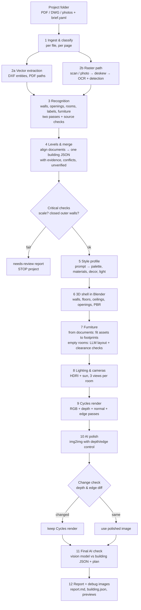

# WenArt_RUN – PoC plan (Milestone 0)

Date: 1 October 2026. Status: **approved by the user on 3 Oct 2026**, together with the changes recorded in
`docs/milestone5.md` §0 and `docs/milestone6.md` §0 (decisions: `docs/progress.md`, "Decisions of 3 Oct 2026").

This plan is written for a beginner. Each section says what we will do, what we
chose, and why. Links point to official sources; anything we could not verify is
marked **UNVERIFIED**.

## 0. Assumptions (your blank fields, filled with defaults)

| Field | Default we assume | Change it in |
|---|---|---|
| Your Mac | MacBook Air M2, 16 GB RAM (only used for the chat; no GPU work) | – |
| PoC budget | $200 of RunPod credit (raised from $100 on 10 Oct 2026) | `CLAUDE.md` |
| GPU limits | max $5.00 per GPU-hour (was $1.00 until 3 Oct 2026), $10 per day, 2 h per pod run, one pod at a time | `CLAUDE.md`, `scripts/gpu_run.py` |
| Typical projects | Residential flats and small buildings in Turkey, 1+1 to 4+1, 1–3 floors | – |
| Test projects | `projects/<name>/` (one folder per project); 3 synthetic ones are generated by the smoke test | `projects/` |
| "Photos" means | Phone photos of paper plans (in scope). Photos of real rooms: out of scope for the PoC; see §4.5 for the recommendation | `brief.yaml` |
| Default style | "Scandinavian, light oak floor, white walls, linen textiles, warm daylight" | `wenart/defaults.yaml` |
| Empty rooms | Furnish them with AI in the project style | `brief.yaml: empty_rooms` |
| Small decor in documented rooms | Yes (cushions, plants, books only; never furniture) | `brief.yaml: decor` |
| Renders | 3 views per room, 1920×1080, Cycles | `brief.yaml: render` |
| Ceiling height fallback | 2.70 m when no section/elevation gives it (flagged in the report) | `brief.yaml: ceiling_height` |
| 3D model files | Nice to have: textured, furnished `.blend` and `.glb` per project | – |
| Your level | Beginner in Linux and Python; every step is explained | – |
| Report language | English | – |

## 1. Reality check (what is realistic, what is hard)

1. **Vector inputs (DWG, vector PDF) are the strong path.** Walls, doors, windows,
   room labels and furniture blocks can be read exactly; ±5 cm is realistic.
2. **Scans and phone photos are the hard path.** Expect wall detection to be good
   on clean scans, but doors, windows and furniture symbols are often confused.
   ±3 % needs a clear scale source (dimension text or area labels). Expect many
   "unverified" items on bad scans, by design.
3. **Furniture symbol recognition on scans is the hardest recognition task.**
   A sofa and a bed look alike at low resolution; orientation (headboard, sofa back)
   is often ambiguous. Two independent passes plus "unverified" marking will leave
   some pieces unresolved; we will not guess.
4. **Merging several documents into one building** needs alignment (scale, rotation,
   offset). It works well when outer walls and the stair core are visible on every
   floor; balconies, split levels and different drawing scales make it harder.
5. **Furniture that matches the drawn footprint:** CC0 libraries have few pieces per
   type, so we fit (scale) library models to footprints and use image-to-3D
   generation only as a fallback (slower, less predictable). Non-uniform scaling
   above ~15 % looks wrong; we cap it and report it.
6. **AI polish is risky by nature.** Diffusion models move edges. Our check (depth
   and edge comparison) will reject some polished images; those renders stay as
   Cycles output. That is the intended behaviour, not a bug.
7. **The final AI render check finds gross errors** (missing door, extra window,
   moved bed), not centimetre errors. Geometry tolerances are checked numerically
   from the building JSON, not by a vision model.
8. **Time and cost are dominated by first-time model downloads** (≈40–80 GB into the
   Network Volume) and by Cycles renders (≈1–3 min per 1920×1080 view on an RTX 4090).
   A 6-room flat with 3 views per room ≈ 18 renders ≈ 30–60 GPU minutes.
9. **Licenses:** some of the best image models are non-commercial (FLUX.1-dev
   family). We pick Apache/MIT models where quality allows and flag the rest.
10. **DWG conversion has no perfect open-source answer.** LibreDWG (GPL) handles most
    files; ODA File Converter is free but closed-source with usage terms. We test
    both on your files in Milestone 2 and record which one wins.

## 2. Approach: 3D-first vs image-first vs hybrid

| | (A) 3D-first | (B) AI-image-first | (C) Hybrid |
|---|---|---|---|
| Shell | exact walls/openings from documents in Blender | simple shell, or only a plan image | exact shell in Blender |
| Furniture | real 3D models fitted to drawn footprints | painted by the image model from a prompt/segmentation | real 3D models from documents; image model only for look |
| Materials | PBR textures (CC0 libraries) | painted by the image model | PBR + optional AI polish |
| Geometry fidelity | exact, measurable | not guaranteed; furniture drifts, doors vanish | exact, if polish is gated |
| Consistency across views/rooms | high (same 3D scene) | low (each image is new) | high |
| Photoreal quality | good with Cycles, slightly "CG" | highest "wow", least honest | good + small polish |
| Traceability (evidence per element) | full | impossible for painted content | full |
| GPU cost | renders (minutes/view) | seconds/image | renders + seconds |
| Risk | asset library coverage, material look | hallucination, no measurable checks | polish gate rejects some images |

**Pick: (A) 3D-first, with the hybrid's polish step kept but strictly gated.**
Reason: documented furniture must appear with the same type, position, orientation
and size as drawn, and every element must be traceable. Only a real 3D scene gives
that. Image-first cannot keep a bed exactly where the plan shows it, and it cannot
produce evidence. The polish step (C) adds realism (soft shadows, fabric detail,
color grading) but is only accepted if the depth and edge maps before and after
match; otherwise the Cycles render is used as is.

## 3. Pipeline stages



The building JSON schema (with evidence fields) is in `wenart/schema/building.schema.json`;
a small example is in `docs/examples/building.example.json`. Key ideas:

- every wall, opening, room, furniture piece and page carries `evidence[]`
  with `file`, `page`, `layer`/`entity` or `pixel_box`, `method` (vector/ocr/ai/derived),
  `model`, `pass`, `confidence`, raw `text`;
- `status: verified | unverified` on every element; `unverified[]` lists them;
- `furniture[].source: from_documents | added_by_ai`;
- `conflicts[]` lists every disagreement and how it was resolved (DWG > vector PDF > scan > photo);
- `status: ok | needs_review` at the top stops the project when scale or closed outer walls are missing.

Example (shortened):

```json
{"id": "f_L0_001", "room_id": "r_L0_salon", "type": "sofa", "type_raw": "KANEPE_3LU",
 "source": "from_documents", "footprint": {"center": [3.2, 3.6], "size": [2.2, 0.9], "rotation_deg": 0},
 "front_deg": 270, "status": "verified",
 "evidence": [{"file": "zemin_kat.dwg", "layer": "MOBILYA", "entity": "INSERT:5C1",
               "block": "KANEPE_3LU", "method": "vector", "confidence": 1.0}]}
```

## 4. Options per stage and our picks

Verified on 1 Oct 2026 against GitHub READMEs / LICENSE files, PyPI and the RunPod docs
source. Hugging Face pages were **blocked** in this cloud session, so model-card-only facts
(exact VRAM tables, "last updated" dates) come from search snippets and are marked (S).
"Commercial" = licence allows commercial use later. VRAM = bf16 weights unless stated.

### 4.1 Document classification (floor plan / furniture plan / section / photo / other)

| Option | Licence | Commercial | VRAM | Speed | Quality | Last update | Link |
|---|---|---|---|---|---|---|---|
| **Qwen3-VL-8B-Instruct** (pick) | Apache-2.0 | yes | ~16–19 GB | ~2–5 s/page on 24 GB GPU | best open VLM at this size; native boxes | Oct 2025 | https://github.com/QwenLM/Qwen3-VL |
| GLM-4.6V-Flash (9B) (second pass) | MIT (weights, S) | yes | ~18 GB | similar | strong grounding | Dec 2025 | https://github.com/zai-org/GLM-V |
| Text-layer heuristics via pdfplumber + Docling (pre-filter) | MIT | yes | CPU | ms/page | finds "PLAN", "KESİT", scale text; no vision | 2026 | https://github.com/docling-project/docling |

Pick: cheap CPU heuristics first (page has text layer? contains "KAT PLANI", "KESİT", "GÖRÜNÜŞ"?),
then Qwen3-VL-8B with a fixed JSON schema; GLM-4.6V-Flash is the independent second opinion.

**Bake-off result (1 Oct 2026, `results/bakeoff/summary.md`, 3 synthetic scan/photo pages, RTX PRO 4000 24 GB, fp8 weights,
8192 context):** both models classify every page, read the level title, the scale note and all room labels correctly
(100 % on all four tasks, scan and phone photo alike); Qwen3-VL-8B ≈ 5.1 s per call, GLM-4.6V-Flash ≈ 5.6 s. Pick confirmed.

### 4.2 Recognition and OCR (walls, openings, labels, dimensions, furniture and fixture symbols)

| Option | Licence | Commercial | VRAM | Speed | Quality | Last update | Link |
|---|---|---|---|---|---|---|---|
| **Vector path (DXF / PDF paths)** (pick, trust level 1) | ezdxf MIT, pdfplumber MIT, pypdfium2 Apache/BSD | yes | CPU | fast | exact | ezdxf 1.4.4 May 2026; pdfplumber 0.11.10; pypdfium2 5.13.0 | https://pypi.org/project/ezdxf https://pypi.org/project/pdfplumber https://pypi.org/project/pypdfium2 |
| **PaddleOCR 3.7 (PP-OCRv5 latin model, Turkish listed)** (pick, trust level 2) | Apache-2.0 | yes | ~2 GB | ~0.5 s/page | good on printed Turkish, boxes | Jun 2026 | https://github.com/PaddlePaddle/PaddleOCR |
| Tesseract 5 + `tur` (cross-check) | Apache-2.0 | yes | CPU | ~1–3 s/page | weak on rotated dimension text | – | https://github.com/tesseract-ocr/tesseract |
| **Qwen3-VL-8B + GLM-4.6V-Flash two-pass symbol detection** (pick, trust level 3) | Apache-2.0 / MIT | yes | 16–18 GB each (run one at a time) | ~5–15 s/page | best semantic understanding of furniture symbols | 2025 | see 4.1 |
| Florence-2-large / OWLv2 / Grounding DINO 1.0 (box proposals) | MIT / Apache-2.0 / Apache-2.0 | yes | <2 GB / ~2 GB / ~2 GB | fast | generic objects; weak on plan symbols | 2024 | https://github.com/IDEA-Research/GroundingDINO |
| SAM 2.1 (wall / room masks on scans) | Apache-2.0 | yes | ~2–4 GB | fast | good masks, needs prompts | Sep 2024 | https://github.com/facebookresearch/sam2 |
| Fine-tuned D-FINE / RF-DETR (Nano–Large) on **our synthetic DXF renders** (Milestone 7 option) | Apache-2.0 | yes | ~4 GB | very fast | best for a fixed symbol set | 2025–2026 | https://github.com/Peterande/D-FINE https://github.com/roboflow/rf-detr |
| dots.ocr (layout + text for scans) | MIT | yes | ~6 GB | fast | good layout JSON | 2025 | https://github.com/rednote-hilab/dots.ocr |
| Not picked: Ultralytics YOLO (AGPL-3.0), YOLO-World (GPL-3.0), MinerU VLM weights (AGPL-3.0), Surya / Chandra (OpenRAIL revenue caps), Nanonets-OCR2 and Qwen2.5-VL-3B (research licence), Llama 3.2/4 Vision (EU restriction) | | | | | | | |
| Datasets: CubiCasa5k, FloorPlanCAD = CC BY-NC (evaluation only); ResPlan = CC BY 4.0 (usable); Raster2Seq (MIT, SIGGRAPH 2026) checkpoints for raster vectorisation | | | | | | | https://github.com/m-agour/ResPlan https://github.com/Cornell-VAILab/Raster2Seq |

Realistic accuracy on scans (literature on CubiCasa5k, S): walls ~0.9+ IoU, doors ~0.85, windows ~0.2–0.9
depending on method. That is why windows and furniture on scans will often be "unverified".

**Bake-off result (1 Oct 2026, `results/bakeoff/summary.md`):** PaddleOCR PP-OCRv5 (`lang="tr"`) reads 73 % of the room
labels and 65 % of all texts on the synthetic scans and photo; Tesseract 5 `tur` reads 20 % / 48 % (furniture lines inside
rooms break its line segmentation). PaddleOCR stays the primary OCR, Tesseract the cross-check. Symbol detection by the two
VLMs on the full page is unusable as run: 0–1 % recall (Qwen returns no boxes on two pages, GLM a hallucinated grid; two
near-hits with IoU 0.46–0.58). Cause: the 1:100 plan covers ~20 % of the A3 sheet, so after the 1600 px downscale a door is
~15 px wide. Next step (Milestone 3): crop to the drawing extents and tile per room at full resolution before the symbol pass,
and keep the fine-tuned detector (D-FINE / RF-DETR on synthetic renders, §4.2) as the planned fallback. The two-pass
agreement logic works (0 verified symbols, all 71 proposals `unverified`, nothing guessed).

### 4.3 DWG conversion

| Option | Licence | Commercial | Headless Linux | Reliability | Last update | Link |
|---|---|---|---|---|---|---|
| **GNU LibreDWG `dwg2dxf`** (pick) | GPL-3.0 (used as a separate command, our code stays MIT) | yes | yes | reads all DWG versions, DXF export "~90 % coverage", 0.14.x is beta with known DXF-writer bugs → every output is audited with `ezdxf.recover` | 0.14.1 Jul 2026 | https://github.com/LibreDWG/libredwg |
| ezdwg (Rust core, read-only DWG) (fallback) | MIT | yes | yes | new, "growing entity coverage" | 0.12.9 Sep 2026 | https://pypi.org/project/ezdwg |
| ODA File Converter | freeware; ODA FAQ: non-members may use it for **non-commercial** use only | **no** (without ODA membership) | needs Xvfb | best fidelity | 27.x | https://www.opendesign.com (blocked here, S) |

Pick: LibreDWG first, ezdwg as fallback, failures → `needs review`. ODA only as a manual rescue tool on your Mac, never in the pipeline.

**Milestone 7 (3 Oct 2026):** LibreDWG **0.14** (tag commit d9468ae; there is no 0.14.1), GPL-3.0, built from source
(static, cmake/ninja) on the pod and in the session, called as a separate program (`dwg2dxf` without `--as`, which
empties the modelspace of other DWG versions), binaries never distributed. ezdwg is dropped (units always metres,
inserts and dimensions exploded). A DWG with 0 modelspace entities after conversion is `needs review`; dimensions
are measured from geometry because `dxf2dwg` loses rotated-dimension angles (docs/milestone7.md §5).

### 4.4 PDF handling

| Option | Licence | Commercial | Note |
|---|---|---|---|
| **pdfplumber** (paths, chars with rotation matrix) + **pypdfium2** (fast rasterising, path segments) (pick) | MIT / Apache-2.0+BSD-3 | yes | pure Python; fine for plan sheets |
| pdftocairo (poppler-utils) for 200–300 dpi page images | GPL (separate command) | yes | |
| PyMuPDF | **AGPL-3.0** or paid | flagged, not used | best API, but copyleft |

### 4.5 Phone photos of plans and photos of real rooms

Photos of paper plans: OpenCV (Apache-2.0) page detection + perspective correction, then the scan path.
Photos of real rooms (out of scope for the PoC): we compared **AI virtual staging** (paint furniture into the photo
with an image model) vs **3D reconstruction** (recover room geometry from photos). Recommendation for later: virtual
staging only as a separate "marketing" output; it cannot feed the measurable building JSON. 3D reconstruction from
a few phone photos is still unreliable for cm-level walls; plans stay the source of truth.

### 4.6 3D shell

| Option | Licence | Commercial | Note |
|---|---|---|---|
| **Blender 5.2 LTS, direct `bpy` from the building JSON** (pick) | GPL-3.0 (renders are ours) | yes | shapely polygons → extruded walls, floor, ceiling; boolean openings; glTF/`.blend` export |
| IfcOpenShell 0.9.0 → IFC → Blender | LGPL-3.0 | yes | extra schema layer, nothing gained for rendering; optional exporter later |
| Infinigen Indoors procedural rooms | BSD-3 | yes | pins Blender 4.2 / Python 3.11; too heavy to adopt now; its constraint ideas are reused |

Blender 5.2.2 Linux build: `https://download.blender.org/release/Blender5.2/blender-5.2.2-linux-x64.tar.xz`
(sha256 `84098912789dc450e95697c4184fb8a90acbe5111c2ba4aede3fecb57806a168`, from the Flathub manifest; Blender's
own site was blocked here → re-check in Milestone 1). Cycles GPU: `compute_device_type = 'OPTIX'`, NVIDIA driver ≥ 575 (S).

### 4.7 Furniture layout for rooms the documents leave empty

| Option | Licence | Commercial | Note |
|---|---|---|---|
| **Qwen3-VL-8B (already loaded) proposes a JSON layout; deterministic shapely placer checks collisions, wall contact, door swing and window clearances (Holodeck-style constraints + backtracking)** (pick) | Apache-2.0 | yes | one model for vision and layout; temperature 0; two passes |
| gpt-oss-20b as independent second proposer | Apache-2.0 | yes | 16 GB, structured outputs; harmony format |
| Qwen3-30B-A3B-Instruct-2507 (AWQ) | Apache-2.0 | yes | stronger reasoning, needs 4-bit to fit 24 GB |
| Learned models on 3D-FRONT (ATISS, DiffuScene, InstructScene) | data licence research-only | **no** | not used |
| Holodeck / LayoutVLM / I-Design code | Apache-2.0 / unverified / unverified | partly | pattern reused, Unity/NeRF stacks not adopted |

### 4.8 Furniture assets matched to drawn types and footprints

| Option | Licence | Commercial | VRAM | Speed | Quality | Last update | Link |
|---|---|---|---|---|---|---|---|
| **Poly Haven models** (pick, first choice) | CC0 | yes | – | API download | high, PBR, few hundred models | 2026 | https://github.com/Poly-Haven/Public-API |
| **Objaverse 1.0 filtered to CC0 / CC-BY, LVIS furniture classes** (pick, second) | per object | yes with attribution | – | bulk download | mixed quality and scale | 2023 | https://github.com/allenai/objaverse-xl |
| BlenderKit CC0 / Royalty-Free | mixed | yes | – | API key | large catalogue | 2026 | https://github.com/BlenderKit/BlenderKit |
| **TRELLIS.2-4B image-to-3D** (pick, generative fallback for types with no library match) | MIT | yes | ≥24 GB | 3–17 s/object (H100), slower on 24 GB cards | PBR GLB | Jun 2026 | https://github.com/microsoft/TRELLIS.2 |
| 3DTopia-XL / Step1X-3D | Apache-2.0 | yes | n/a / 27 GB | slow | PBR / textured | 2025 | https://github.com/3DTopia/3DTopia-XL |
| Hunyuan3D-2.1 / Omni (bbox control would fit footprints perfectly) | Tencent community licence, **EU/UK/South Korea excluded** | flagged | 10–29 GB | fast | best | 2025 | https://github.com/Tencent-Hunyuan/Hunyuan3D-2.1 |
| SAM 3D Objects | SAM licence (commercial ok) | yes | ~32 GB (S) | 10–30 s | Gaussian splats, awkward for Blender | Jun 2026 | https://github.com/facebookresearch/sam-3d-objects |
| Not usable: 3D-FUTURE/3D-FRONT, HSSD, ShapeNet (non-commercial) | | | | | | | |

Fitting rule: pick the asset of the right type whose bounding box ratio is closest to the drawn footprint,
scale it to the footprint (non-uniform scale capped at 15 %, else next asset or TRELLIS.2), rotate to `front_deg`.
Every fit is logged (asset id, licence, scale factors).

**Measured on 1 Oct 2026 (Milestone 4, `results/furniture/`):** Poly Haven has 31 usable CC0 furniture models for
13 of our types (none for wardrobes, kitchen blocks, sanitary ware, appliances); with the 15 % non-uniform and
0.75–1.30 mean-scale rule about half of the drawn pieces get a library model, the rest the parametric mesh
(`wenart/blender/parametric.py`, exact footprint). Qwen3-VL-8B (vLLM, fp8, structured output) proposes a layout
for an empty room in ≈ 4–7 s per pass; the shapely checks and repairs run in milliseconds. Objaverse and TRELLIS.2
were not run yet; they are the way to close the coverage gap.

**Milestone 7 (3 Oct 2026):** Objaverse 1.0 (Hugging Face `allenai/objaverse` @21e4e14) is an ODC-By 1.0 database;
only objects with licence CC0 or CC-BY 4.0 are used (NC, ND, SA, free-standard and unknown are refused). The
per-object licences are declared by the uploaders on Sketchfab and nobody verifies them: **flag for commercial use**.
Every CC-BY model is credited (title, author, link, licence, changes) in `ATTRIBUTION.md` next to every image that
shows it; `catalog_objaverse.json` and `results/library/**` are ODC-By, not MIT. Library models carry style tags; a
model is used only when it fits the project's style family (else the parametric mesh). The Poly Haven style tags
come from the API `/info` tags and the M6 renders (3 Oct 2026; thumbnails were blocked by the proxy). TRELLIS.2 is
**not built in M7** (generated shapes have no documented provenance) and waits for your OK.

**Milestone 8 (4 Oct 2026, your OK of 4 Oct):** every (type, style family) pair still without an accepted model gets
generated candidates (`wenart/assets/generate.py`, pins in `generate.yaml`, setup `scripts/pod_setup_trellis.sh`):
a Z-Image-Turbo product photo on white, then TRELLIS.2 image → textured GLB (~200k faces, 2048 px PBR textures),
labelled `source: generated` and judged like any library model. Checked on Hugging Face / GitHub:

| Model / code | Revision | Licence | What for |
|---|---|---|---|
| `Tongyi-MAI/Z-Image-Turbo` | `f332072aa78be7aecdf3ee76d5c247082da564a6` | Apache-2.0 | text-to-image input photo (1024², 8 steps, guidance 0) |
| `microsoft/TRELLIS.2-4B` | `af44b45f2e35a493886929c6d786e563ec68364d` | MIT | image → 3D (flow models, shape/texture decoders) |
| `microsoft/TRELLIS-image-large` (`ckpts/ss_dec_conv3d_16l8_fp16` only) | `25e0d31ffbebe4b5a97464dd851910efc3002d96` | MIT | sparse-structure decoder named by TRELLIS.2's `pipeline.json` |
| `facebook/dinov3-vitl16-pretrain-lvd1689m` | `ea8dc2863c51be0a264bab82070e3e8836b02d51` | DINOv3 License (custom, **gated: manual approval**) | TRELLIS.2's image condition (no alternative) |
| `ZhengPeng7/BiRefNet` | `e2bf8e4460fc8fa32bba5ea4d94b3233d367b0e4` | MIT | background removal; replaces `briaai/RMBG-2.0` of `pipeline.json` (gated, non-commercial) |
| TRELLIS.2 code (incl. o-voxel) | `75fbf0183001ed9876c8dbb35de6b68552ee08bd` | MIT | pipeline, GLB export |
| CuMesh / FlexGEMM | `12289e10` / `6dd94a85` | MIT | mesh clean-up, UV unwrap / sparse convolution |
| nvdiffrast v0.4.0 / nvdiffrec renderutils | `253ac4fc` / `b296927c` | NVIDIA Source Code License (**non-commercial**) | UV-space texture baking in `to_glb` / previews only (optional) |
| flash-attn 2.8.3, else xformers 0.0.33.post2 | release wheels | BSD-3-Clause | attention backend (TRELLIS.2's sparse attention has no SDPA path) |

### 4.9 Materials and HDRIs

| Option | Licence | Commercial | Note |
|---|---|---|---|
| **ambientCG + Poly Haven PBR sets** (pick) | CC0 | yes | ambientCG API v2 `full_json`; Poly Haven `/assets`, `/files/{id}` |
| MatSynth (4k CC0 materials) | per item, mostly CC0 | yes | for a material-retrieval index |
| Material Anything (mesh → PBR maps) | MIT | yes | optional for untextured assets |
| AI material generation (CHORD) | research-only | **no** | not used |
| **Poly Haven HDRIs** (pick) | CC0 | yes | |

### 4.10 Lighting and cameras

Rule-based (no AI): HDRI from the style profile (warm daylight), sun through windows, interior fill from windows,
cameras at 1.4 m height, 24 mm equivalent, placed in the free area of the room polygon looking at the longest wall,
at a window and from the door. Three views per room.

**Milestone 6 (`docs/milestone6.md` §4–§5):** full runs use searched cameras: a numpy ray caster scores candidate
positions on a 0.5 m grid (plus room corners) every 30° by furniture, opening, floor and depth shares with penalties for
near, single-element, bare-wall, window and ceiling coverage; height 1.25 m, pitch 0 and lens shift `shift_y = −0.10`
(straight verticals, the floor in the frame); 3 views for rooms ≥ 6 m², 2 for 3–6 m², 1 below; blocked candidates only
when nothing else exists. The M5 rule set stays as `camera_policy: m5` (default of the library and the build CLI).
Lighting: rooms with glass/floor < 0.08 get an assumed, camera-invisible ceiling area light; windowless rooms put their
light at the pole of inaccessibility; a second save at EV − k pulls blown window panes (EXR passes unchanged).
Measured on the M6 runs: median object share of the frame 0.16 → 0.30 (synthetic-01) and 0.06 → 0.16 (synthetic-03),
views with < 10 % objects 8 → 3 and 32 → 18, no view metered at the +8 EV limit (M5: 4), no view with blown windows
(M5: 19 with > 5 % clipped window pixels).

### 4.11 Cycles rendering

Blender 5.2 LTS Cycles, OptiX, 1920×1080, 256–512 samples + OpenImageDenoise, passes: RGB, depth, normal, object
index (for the change check). ~1–3 min per view on RTX A5000 / 4090.

**Measured on 1 Oct 2026 (Milestone 3, `results/renders/`):** Cycles with OptiX renders a 1920×1080 view at 128 samples
with OIDN in 4.4–6.2 s on an RTX PRO 4000 and ≈ 8 s on an L4 (scenes of 130–240 objects, box-projected 2K textures);
the scene build takes ≈ 30 s per project. A full project (10 rooms, 30 views) is therefore ≈ 4 min of GPU, far below
the 1–3 min per view estimated above, so 256–512 samples are affordable. Albedo maps from photo-based CC0 sets must be
normalised to the intended colour (Poly Haven's white plaster averages 0.24 linear): the material builder records the gain.

### 4.12 AI polish (gated)

| Option | Licence | Commercial | VRAM | Speed | Quality | Last update | Link |
|---|---|---|---|---|---|---|---|
| **Z-Image-Turbo + Z-Image-Turbo-Fun-Controlnet-Union-2.1 (one control per call: depth, canny or geometry edges)** (pick) | Apache-2.0 | yes | 27.2 GB bf16 weights; ≈ 18 GiB resident without the text encoder, peak 22.5 GiB with the gate (measured) | 3.8 s per forward at 1920×1088 on an RTX PRO 4500 (measured); 1–4 forwards per polish | strong, 8 steps | Nov 2025 / 2026 | https://github.com/Tongyi-MAI/Z-Image https://github.com/aigc-apps/VideoX-Fun |
| SDXL + xinsir controlnet-union-sdxl-1.0 (fallback) | OpenRAIL++-M / Apache-2.0 | yes | ~10 GB | fast | older look, 1024 px tiles | 2024 | https://github.com/xinsir6/ControlNetPlus |
| Qwen-Image-Edit-2511 + Fun-Controlnet-Union | Apache-2.0 | yes | 40 GB bf16 (needs offload or 4-bit) | slow | best Apache editor | Dec 2025 | https://github.com/QwenLM/Qwen-Image |
| FLUX.1-Depth-dev / Canny-dev, FLUX.2-dev, Qwen-Image-2.1 | non-commercial | **no** | | | | | flagged, not used |
| FLUX.2 [klein] 4B | Apache-2.0 | yes | ~8–13 GB | fast | no official depth/canny control | Jan 2026 | https://github.com/black-forest-labs/flux2 |

Change check (rule 7), as built in Milestone 5 (`docs/milestone5.md` §0, §4): one control image per call
(diffusers 0.40.0 has a single `control_image`; default depth from the Cycles Z pass, canny and geometry edges
measured in the sweep); img2img with control through the ControlNet pipeline's `sigmas`/`latents` arguments
(no diffusers pipeline takes both `strength` and a control image); bf16 weights 27.2 GB, so the text encoder
runs first and is freed, transformer + ControlNet + VAE stay resident (≈ 18 GiB; no CPU offload: the ControlNet
shares the transformer's embedders). The gate compares the Cycles render with the polished one: recall of the
reference geometry edges within 3 px and new straight lines on bare walls/floors, Depth Anything V2 **Small**
(`depth-anything/Depth-Anything-V2-Small-hf`, Apache-2.0; Base/Large are CC-BY-NC, DA3 is not in transformers
and its PyPI package pins numpy<2) relative depth after a scale/shift fit, SAM 2.1 masks on both images
(IoU of the two, so SAM's own errors cancel), CIELAB colour and the chroma of white walls, DINOv2 features
(logged). Window panes get the Cycles pixels back after every polish. Thresholds are calibrated on the
synthetic projects with benign and small/large negative controls (`results/gate/`).

**Measured on 2 Oct 2026 (Milestone 5, `results/final/`, `results/gate/`):** the gate accepts every harmless
change (JPEG, noise, blur, ±0.3 EV) and rejects 94 % of deliberate geometry and colour changes; 44 of the 87
synthetic views end polished (ladder 0.375 geometry → 0.25 canny → 0.125 depth), the others stay Cycles,
mostly because Depth Anything V2 Small is unstable on large flat surfaces of small rooms. At the strengths
the gate accepts, the two vision judges see little difference between polished and Cycles images; at 0.5
the polish starts to change furniture. Realism gains are more likely on the Cycles side.

### 4.13 Final render check

Built in Milestone 5 (`docs/milestone5.md` §5): the expected elements of every view come from the Cycles
object-index pass, cross-checked against the building JSON projected into the camera with a depth test (the
camera's frustum lists of `cameras.py` missed about a third of the visible elements). Qwen3-VL-8B (pass 1) and
GLM-4.6V-Flash (pass 2) answer a strict per-view schema (present / different / absent / unsure per element,
extras, door and window counts) with a sentinel decoy element; only answers both models agree on are
confirmed, a failed call is `not_computed`, never "absent". A polished image is rejected when it loses an
element or gains a door, window or furniture piece that its Cycles render does not have. Every view gets a
crop of the source plan page with the camera and its view cone drawn, shown next to the render in the report;
removal, insertion and type-swap controls calibrate the check. Findings are listed, never auto-fixed.

### 4.14 Serving and runtime

vLLM 0.30.0 (Apache-2.0) with structured outputs (`xgrammar`), temperature 0, seed 0, same GPU type and version
for both passes. Checked 1 Oct 2026 (Milestone 1): vLLM 0.30.0 pins `torch==2.13.0`, `transformers>=5.10.4`,
`xgrammar>=0.2.1`; the base image ships torch 2.9.1, so vLLM gets its own venv on the volume (`/workspace/venv-vllm`)
in Milestone 2 (the RunPod base image provides CUDA 12.8.1).

## 5. RunPod setup

| Item | Choice | Why |
|---|---|---|
| API | **REST v2 `https://api.runpod.io/v2`** (v1 `rest.runpod.io/v1` is retired on 15 Nov 2026; GraphQL early 2027) | current, documented OpenAPI at `api.runpod.io/v2/openapi.json` |
| Datacenter | **EU-RO-1** (Secure Cloud, STANDARD network volumes, S3-compatible API available) | large DC, Europe. Checked 1 Oct 2026: RTX A5000 / 4090 / A6000 had no stock in any volume-capable EU DC; EU-RO-1 had RTX PRO 4000 (24 GB, $0.57), RTX PRO 4500 (32 GB, $0.72) and L4 (24 GB, $0.49). Stock changes hourly; the runner picks live from `GPU_PRIORITY` in `scripts/gpu_run.py` |
| Network Volume | 120 GB STANDARD in EU-RO-1 ≈ $8.40/month ($0.07/GB/month); grown to 250 GB on 9 Oct 2026 (M10, ≈ $17.50/month) | models ≈ 60 GB, venv + Blender ≈ 15 GB, assets ≈ 10 GB, projects/outputs ≈ 10 GB |
| GPU (default, quick tests + recognition + renders) | **RTX A5000 24 GB, Secure ≈ $0.27/h (S)**; has RT cores (Ampere) | cheapest 24 GB card with RT cores; fits Qwen3-VL-8B, Z-Image, Cycles |
| GPU (faster renders / TRELLIS.2) | RTX 4090 24 GB ≈ $0.74/h (S); RTX A6000 48 GB ≈ $0.53/h (S) when 24 GB is too tight | RT cores, more VRAM |
| GPU (fine-tuning, Milestone 7 only) | RTX A6000 48 GB ≈ $0.53/h; spot/interruptible via console if REST v2 has no field (UNVERIFIED) | |
| Base image | `runpod/pytorch:1.4.0-cu1281-torch291-ubuntu2404` (CUDA 12.8.1, Ubuntu 24.04, SSH + nginx + rsync, runpodctl injected by RunPod) | official, current (30 Sep 2026) |
| Container disk | 30 GB (wiped on stop) | pip temp, logs; everything persistent is in /workspace |
| Secrets | `hf_token` → pods get `HF_TOKEN={{ RUNPOD_SECRET_hf_token }}` | never printed |
| Reaching pods from a cloud session | HTTPS only: job status and small results through a token-protected file server on port 8000 → `https://<POD_ID>-8000.proxy.runpod.net`; pod logs via `GET /v2/pods/{id}/logs`; full outputs stay on the volume (S3 API `s3api-eu-ro-1.runpod.io` as optional second path) | SSH is not possible through the session proxy |
| Reaching pods from your Mac (later) | `ssh root@<ip> -p <port>` + rsync (`22/tcp` exposed, `startSsh: true`) | |
| Self-shutdown | the pod's start command runs `( sleep 7200; runpodctl pod stop $RUNPOD_POD_ID ) &` as a watchdog, and the job script calls `runpodctl pod stop $RUNPOD_POD_ID` at the end; both tested in Milestone 1 | rule: never rely on the session |
| Prices | read live from `GET /v2/catalog/gpus` before every run; the runner refuses anything above $5.00/h (and, without your OK, a pod whose worst case is over $5) | the table above is from search snippets |

**Measured on 1 Oct 2026 (Milestone 2):** the STANDARD Network Volume in EU-RO-1 writes small files at a few MB/s: a
`pip install vllm` onto it ran for 55 minutes without finishing, while the same install takes 3 minutes on the pod's container
disk. Rule from now on: venvs, build trees and the Hugging Face cache live on the container disk (`/opt/wenart`, rebuilt per pod,
the runner gives such pods `--disk 80`); the volume keeps the repo, outputs, results, Blender and the pip wheel cache. Model
downloads on the pod run at ≈ 1.1 GB/s (17.5 GB in 14 s), so re-downloading per pod costs seconds, not minutes. Blackwell
pods (RTX PRO 4000/4500, sm_120) need the CUDA 12.9 PaddlePaddle wheel and `VLLM_USE_FLASHINFER_SAMPLER=0`; on 24 GB cards
both VLMs run with `--quantization fp8 --max-model-len 8192`.

## 6. Cost estimate for the whole PoC

| Item | Estimate |
|---|---|
| Network Volume, 120 GB, ~2 months | ≈ $17 |
| Milestone 1: runner + setup + smoke tests (A5000) | 2–3 h ≈ $1 |
| Milestone 2: recognition bake-off (3 VLM/OCR candidates on sample pages) + tests | 4–6 h ≈ $2 |
| Milestones 3–4: shell, materials, furniture fitting, TRELLIS.2 tests | 4–6 h ≈ $2–4 |
| Milestone 5: Cycles renders + polish tuning (A5000 / 4090) | 8–10 h ≈ $3–7 |
| Milestone 6: 3+ full project runs | 3–5 h ≈ $2–4 (as run: 4 pods, 3.6 h, $2.61) |
| Buffer for failed runs | ≈ $5 |
| **Total without fine-tuning** | **≈ $35–45 of your $100** |
| Milestone 7 (optional LoRA on Qwen3-VL-8B, A6000, ~4 h) | ≈ $3–5 |

## 7. Milestones and test projects

- Synthetic test projects (generated by code, ground truth known): `synthetic-01` (2 floors: ground floor DXF with
  furniture blocks in 3 of 5 rooms, first floor vector PDF, plus a rasterised "scan" of it; brief "Scandinavian style"),
  `synthetic-02` (1 floor, scan only + a perspective-distorted "phone photo"; no brief → defaults),
  `synthetic-03` (3 floors as one multi-page PDF + a separate furniture plan DWG; one room label with "24,50 m²" area text;
  two style prompts for the consistency test).
- Milestone 6 added `synthetic-04` (3rd-floor flat drawn as DXF + vector PDF of the same level, two L-shaped rooms, an
  armchair at 45°, Japandi brief) and `synthetic-05` (notched outline, floor-plan DXF without furniture + a furniture-plan
  DXF, en-suite, study, a style photo, `polish: false`) (`docs/synthetic.md`).
- Confidential projects: this repository is **public**, so a confidential project is never committed and never
  placed under `projects/` (the pod also runs `git clean -fdx` there). You upload a project folder straight to the network volume with
  the RunPod S3 API under a neutral alias (`real-01`, …) and run it with `PRIVATE_PROJECTS=real-01`; outputs stay on the
  volume, only an allow-listed summary (final report, previews, contact sheets) reaches the session (`docs/intake.md`).
  DWG files are not read: export DXF (or a vector PDF) from the CAD program.
- One command per pod runs every stage of every project (`scripts/jobs/full.sh` → `python -m wenart.run pod`).
- Decision of 3 Oct 2026: for now your projects are **not confidential**: they go into `projects/<name>/` and are
  committed to this public repository like the synthetic ones (no S3 key needed). The private upload path stays
  ready for confidential projects later.
- Milestones 1–7 as in your brief; after each one: commit, push, `docs/progress.md`.

## 8. Licence flags (summary)

Not used because of licence: FLUX.1-dev family, FLUX.2-dev, Qwen-Image-2.1 (non-commercial); Hunyuan3D (EU/UK/KR
excluded); Llama 3.2/4 Vision (EU); Ultralytics YOLO, MinerU weights, PyMuPDF (AGPL); YOLO-World (GPL);
ODA File Converter (non-commercial for non-members); 3D-FRONT/FUTURE, HSSD, ShapeNet, CubiCasa5k, FloorPlanCAD
(non-commercial datasets, evaluation only). Custom-but-commercial licences we accept with a flag: SAM 3 (not needed),
Gemma 3 (not needed), Stability Community Licence (not needed).

GPL tools we call as separate programs (allowed, our code is not derived from them): Blender, LibreDWG, poppler.


Milestone 5 models (all checked on Hugging Face, 2 Oct 2026): Z-Image-Turbo (Apache-2.0; its text encoder is
Qwen3-4B, Apache-2.0; its VAE is byte-identical to the FLUX.1-schnell VAE, Apache-2.0, not the FLUX.1-dev
licence), Z-Image-Turbo-Fun-Controlnet-Union-2.1 (Apache-2.0; the 591-byte diffusers config comes from a
personal repo without a licence and is vendored as architecture metadata), Depth-Anything-V2-Small-hf,
SAM 2.1 hiera-large, DINOv2-base (Apache-2.0), Qwen3-VL-8B-Instruct (Apache-2.0), GLM-4.6V-Flash (MIT).
Not used: Depth Anything V2 Base/Large and DA3-LARGE/GIANT (CC-BY-NC), DINOv3 (custom gated licence).

Milestone 6: no new models. New textures from Poly Haven (CC0): `oak_veneer_01`, `walnut_veneer`, `rough_linen`;
procedural tiles and bedding are our own code.

Milestone 7 models (checked on Hugging Face, 3 Oct 2026): OWLv2 `google/owlv2-base-patch16-ensemble` @cfd3195
(Apache-2.0) as the added-object detector. Surveyed, not used: Grounding DINO base (Apache-2.0), Florence-2-large
(MIT). TRELLIS.2 not used (see §4.8). Data: Objaverse 1.0 (ODC-By 1.0; objects CC0 / CC-BY 4.0 only, uploader-
declared — flagged). Tools: LibreDWG 0.14 (GPL-3.0, separate program).

Milestone 9 (docs/milestone9.md, 4 Oct 2026): no new model. The library keeps up to 20 models per furniture and
decor type (M8: 12 / 16). New decor sources: Amazon Berkeley Objects table lamps (LAMP below 0.95 m), vases (VASE)
and wall mirrors (HOME_MIRROR), all CC BY 4.0 with the M8 credit line; Objaverse sanitary and kitchen objects with
flat material colours (uploader licences, flagged as in M8); generated vases, bowls and small plants (TRELLIS.2's
`512` pipeline of the pinned code, 1024 px textures; `generated (TRELLIS.2-4B, MIT)` as in M8). The AI decor
(`wenart/furniture/decor_ai.py`) uses the layout's Qwen3-VL-8B (Apache-2.0) through the same vLLM server. The 3D
files of the results (`<p>.blend`, `<p>.glb`) carry the models' credits in the results' `ATTRIBUTION.md`; the
Objaverse ODC-By notice and the CC BY credits apply to them as to the images.

Milestone 8 generation (checked 4 Oct 2026, table in §4.8): TRELLIS.2-4B, TRELLIS-image-large decoder, BiRefNet,
CuMesh, FlexGEMM (MIT), Z-Image-Turbo (Apache-2.0), flash-attn / xformers (BSD-3). **Flagged:** DINOv3 ViT-L/16
(custom DINOv3 License: commercial use allowed, trade-control clauses; gated, the HF account of the pod's token
needs Meta's manual approval; M5 had avoided it, TRELLIS.2 cannot run without it); nvdiffrast and nvdiffrec (NVIDIA
Source Code License, research/evaluation only: fine for this PoC, nvdiffrast's UV rasterizer must be replaced before
commercial use). RMBG-2.0 (named by TRELLIS.2, non-commercial) is not used. Generated models are recorded as
`generated (TRELLIS.2-4B, MIT)` with prompt, seed and image hash.

## 9. Sources

RunPod docs source: https://github.com/runpod/docs (api-reference-v2, pods/manage-pods.mdx, pods/templates/secrets.mdx,
storage/network-volumes.mdx, storage/s3-api.mdx, pods/pricing.mdx, get-started/credentials.mdx);
runpodctl: https://github.com/runpod/runpodctl (v2.14.0); images: https://hub.docker.com/r/runpod/pytorch/tags;
vLLM docs: https://github.com/vllm-project/vllm/tree/main/docs; model repos as linked in §4;
Claude Code cloud environments: https://code.claude.com/docs/en/cloud-environments.
