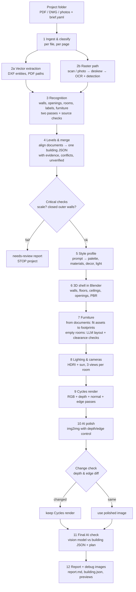

# WenArt_RUN – PoC plan (Milestone 0)

Date: 1 October 2026. Status: **draft for your OK**. Nothing has been spent on GPUs.

This plan is written for a beginner. Each section says what we will do, what we
chose, and why. Links point to official sources; anything we could not verify is
marked **UNVERIFIED**.

## 0. Assumptions (your blank fields, filled with defaults)

| Field | Default we assume | Change it in |
|---|---|---|
| Your Mac | MacBook Air M2, 16 GB RAM (only used for the chat; no GPU work) | – |
| PoC budget | $100 of RunPod credit | `CLAUDE.md` |
| GPU limits | max $1.00 per GPU-hour, $10 per day, 2 h per pod run, one pod at a time | `CLAUDE.md`, `scripts/gpu_run.py` |
| Typical projects | Residential flats and small buildings in Turkey, 1+1 to 4+1, 1–3 floors | – |
| Test projects | `projects/<name>/` (one folder per project); 3 synthetic ones are generated by the smoke test | `projects/` |
| "Photos" means | Phone photos of paper plans (in scope). Photos of real rooms: out of scope for the PoC; see §4.5 for the recommendation | `brief.yaml` |
| Default style | "Scandinavian, light oak floor, white walls, linen textiles, warm daylight" | `wenart/defaults.yaml` |
| Empty rooms | Furnish them with AI in the project style | `brief.yaml: empty_rooms` |
| Small decor in documented rooms | Yes (cushions, plants, books only; never furniture) | `brief.yaml: decor` |
| Renders | 3 views per room, 1920×1080, Cycles | `brief.yaml: render` |
| Ceiling height fallback | 2.70 m when no section/elevation gives it (flagged in the report) | `brief.yaml: ceiling_height` |
| 3D model files | Nice to have: textured, furnished `.blend` and `.glb` per project | – |
| Your level | Beginner in Linux and Python; every step is explained | – |
| Report language | English | – |

## 1. Reality check (what is realistic, what is hard)

1. **Vector inputs (DWG, vector PDF) are the strong path.** Walls, doors, windows,
   room labels and furniture blocks can be read exactly; ±5 cm is realistic.
2. **Scans and phone photos are the hard path.** Expect wall detection to be good
   on clean scans, but doors, windows and furniture symbols are often confused.
   ±3 % needs a clear scale source (dimension text or area labels). Expect many
   "unverified" items on bad scans, by design.
3. **Furniture symbol recognition on scans is the hardest recognition task.**
   A sofa and a bed look alike at low resolution; orientation (headboard, sofa back)
   is often ambiguous. Two independent passes plus "unverified" marking will leave
   some pieces unresolved; we will not guess.
4. **Merging several documents into one building** needs alignment (scale, rotation,
   offset). It works well when outer walls and the stair core are visible on every
   floor; balconies, split levels and different drawing scales make it harder.
5. **Furniture that matches the drawn footprint:** CC0 libraries have few pieces per
   type, so we fit (scale) library models to footprints and use image-to-3D
   generation only as a fallback (slower, less predictable). Non-uniform scaling
   above ~15 % looks wrong; we cap it and report it.
6. **AI polish is risky by nature.** Diffusion models move edges. Our check (depth
   and edge comparison) will reject some polished images; those renders stay as
   Cycles output. That is the intended behaviour, not a bug.
7. **The final AI render check finds gross errors** (missing door, extra window,
   moved bed), not centimetre errors. Geometry tolerances are checked numerically
   from the building JSON, not by a vision model.
8. **Time and cost are dominated by first-time model downloads** (≈40–80 GB into the
   Network Volume) and by Cycles renders (≈1–3 min per 1920×1080 view on an RTX 4090).
   A 6-room flat with 3 views per room ≈ 18 renders ≈ 30–60 GPU minutes.
9. **Licenses:** some of the best image models are non-commercial (FLUX.1-dev
   family). We pick Apache/MIT models where quality allows and flag the rest.
10. **DWG conversion has no perfect open-source answer.** LibreDWG (GPL) handles most
    files; ODA File Converter is free but closed-source with usage terms. We test
    both on your files in Milestone 2 and record which one wins.

## 2. Approach: 3D-first vs image-first vs hybrid

| | (A) 3D-first | (B) AI-image-first | (C) Hybrid |
|---|---|---|---|
| Shell | exact walls/openings from documents in Blender | simple shell, or only a plan image | exact shell in Blender |
| Furniture | real 3D models fitted to drawn footprints | painted by the image model from a prompt/segmentation | real 3D models from documents; image model only for look |
| Materials | PBR textures (CC0 libraries) | painted by the image model | PBR + optional AI polish |
| Geometry fidelity | exact, measurable | not guaranteed; furniture drifts, doors vanish | exact, if polish is gated |
| Consistency across views/rooms | high (same 3D scene) | low (each image is new) | high |
| Photoreal quality | good with Cycles, slightly "CG" | highest "wow", least honest | good + small polish |
| Traceability (evidence per element) | full | impossible for painted content | full |
| GPU cost | renders (minutes/view) | seconds/image | renders + seconds |
| Risk | asset library coverage, material look | hallucination, no measurable checks | polish gate rejects some images |

**Pick: (A) 3D-first, with the hybrid's polish step kept but strictly gated.**
Reason: documented furniture must appear with the same type, position, orientation
and size as drawn, and every element must be traceable. Only a real 3D scene gives
that. Image-first cannot keep a bed exactly where the plan shows it, and it cannot
produce evidence. The polish step (C) adds realism (soft shadows, fabric detail,
color grading) but is only accepted if the depth and edge maps before and after
match; otherwise the Cycles render is used as is.

## 3. Pipeline stages



The building JSON schema (with evidence fields) is in `wenart/schema/building.schema.json`;
a small example is in `docs/examples/building.example.json`. Key ideas:

- every wall, opening, room, furniture piece and page carries `evidence[]`
  with `file`, `page`, `layer`/`entity` or `pixel_box`, `method` (vector/ocr/ai/derived),
  `model`, `pass`, `confidence`, raw `text`;
- `status: verified | unverified` on every element; `unverified[]` lists them;
- `furniture[].source: from_documents | added_by_ai`;
- `conflicts[]` lists every disagreement and how it was resolved (DWG > vector PDF > scan > photo);
- `status: ok | needs_review` at the top stops the project when scale or closed outer walls are missing.

Example (shortened):

```json
{"id": "f_L0_001", "room_id": "r_L0_salon", "type": "sofa", "type_raw": "KANEPE_3LU",
 "source": "from_documents", "footprint": {"center": [3.2, 3.6], "size": [2.2, 0.9], "rotation_deg": 0},
 "front_deg": 270, "status": "verified",
 "evidence": [{"file": "zemin_kat.dwg", "layer": "MOBILYA", "entity": "INSERT:5C1",
               "block": "KANEPE_3LU", "method": "vector", "confidence": 1.0}]}
```

