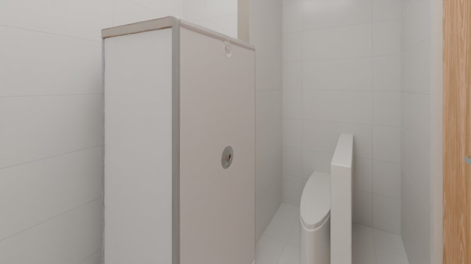
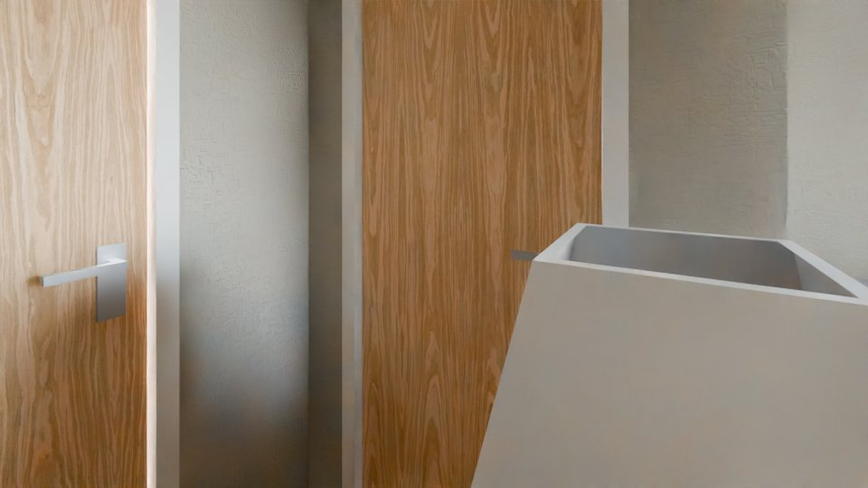
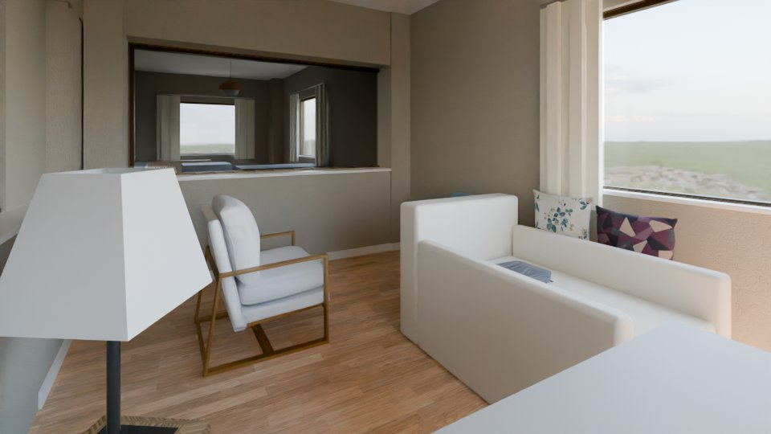
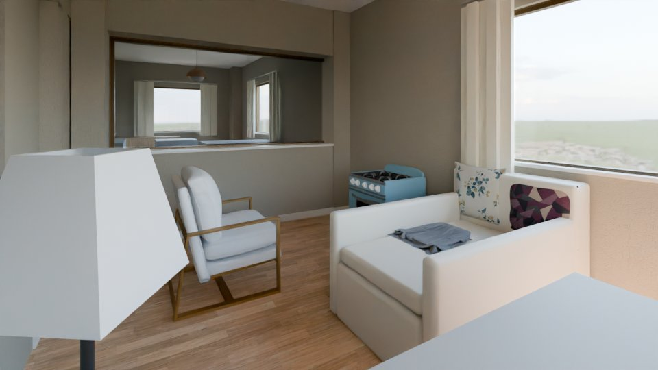
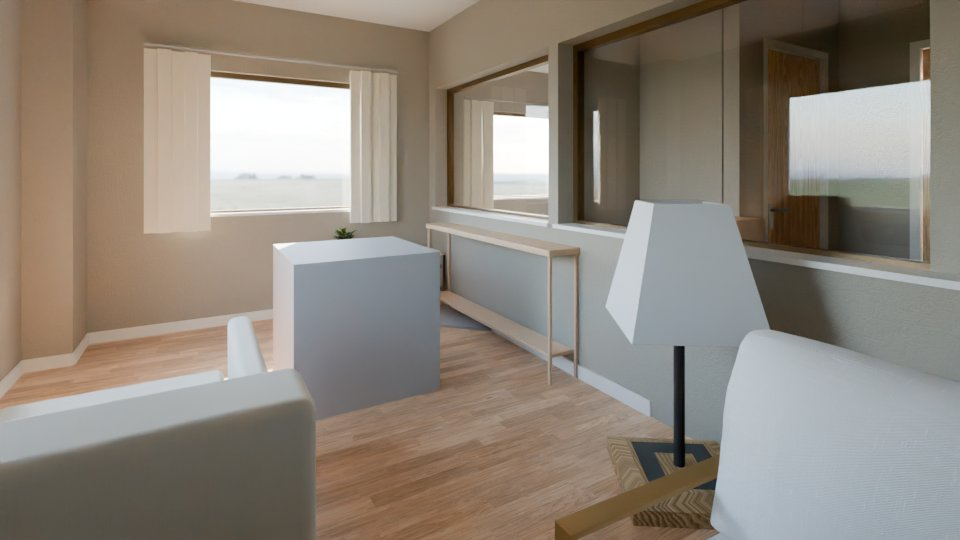

# AI orchestrator log: real03

Model `Qwen/Qwen3.8-27B-FP8` @ `017b9c7af6b5689d5dd426a76e0bc077eb5ca20a`; started 2026-10-10T10:58:43Z, finished 2026-10-10T16:38:49Z; 913 events, 282 model calls.
Stopped in round 3: time budget: the final stages need the time left before the deadline - 20 min.

## Round 0

Findings: 0 (0 dropped).

Stop: time budget: the final stages need the time left before the deadline - 20 min (0 edits accepted in 0 rounds)

## Round 1

| seq | critic | of | status | counts | note |
|---|---|---|---|---|---|
| 1 | code | plausibility | ok | {"critical": 0, "major": 6, "minor": 3} |  |
| 2 | code | exterior | ok | {"critical": 0, "major": 0, "minor": 0} |  |
| 3 | code | views | ok | {"critical": 0, "major": 0, "minor": 0} |  |
| 4 | vision | r_L0_ruzgarlik | ok | {"kept": 1, "dropped": 2} |  |
| 5 | vision | r_L0_kat_holu | ok | {"kept": 1, "dropped": 1} |  |
| 6 | vision | r_L0_guvenlik_holu | ok | {"kept": 0, "dropped": 3} |  |
| 7 | vision | r_L0_yangin_merdiveni | ok | {"kept": 2, "dropped": 2} |  |
| 8 | vision | r_L0_kat_merdiveni | ok | {"kept": 2, "dropped": 0} |  |
| 184 | code | plausibility | ok | {"critical": 9, "major": 171, "minor": 58} |  |
| 185 | code | exterior | ok | {"critical": 0, "major": 0, "minor": 0} |  |
| 186 | code | views | ok | {"critical": 0, "major": 0, "minor": 0} |  |
| 187 | vision | r_L0_ebeveyn_odasi | ok | {"kept": 0, "dropped": 4} |  |
| 188 | vision | r_L0_ebeveyn_odasi_2 | ok | {"kept": 1, "dropped": 1} |  |
| 189 | vision | r_L0_yasama | ok | {"kept": 0, "dropped": 1} |  |
| 190 | vision | r_L0_ebeveyn_odasi_3 | ok | {"kept": 0, "dropped": 3} |  |
| 191 | vision | r_L0_ruzgarlik | ok | {"kept": 0, "dropped": 0} |  |
| 192 | vision | r_L0_ebeveyn_odasi_4 | ok | {"kept": 2, "dropped": 0} |  |
| 193 | vision | r_L0_yasama_2 | ok | {"kept": 2, "dropped": 0} |  |
| 194 | vision | r_L0_oda_01 | ok | {"kept": 1, "dropped": 0} |  |
| 195 | vision | r_L0_yasama_3 | ok | {"kept": 2, "dropped": 0} |  |
| 196 | vision | r_L0_yasama_4 | ok | {"kept": 3, "dropped": 0} |  |
| 197 | vision | r_L0_giris_holu | ok | {"kept": 1, "dropped": 0} |  |
| 198 | vision | r_L0_banyo | ok | {"kept": 0, "dropped": 5} |  |
| 199 | vision | r_L0_banyo_2 | ok | {"kept": 0, "dropped": 3} |  |
| 200 | vision | r_L0_banyo_3 | ok | {"kept": 0, "dropped": 1} |  |
| 201 | vision | r_L0_giris_holu_2 | ok | {"kept": 0, "dropped": 4} |  |
| 202 | vision | r_L0_banyo_4 | ok | {"kept": 0, "dropped": 2} |  |
| 203 | vision | r_L0_oda_7 | ok | {"kept": 1, "dropped": 4} |  |
| 204 | vision | r_L0_kat_holu | ok | {"kept": 1, "dropped": 0} |  |
| 205 | vision | r_L0_oda_10 | ok | {"kept": 0, "dropped": 0} |  |
| 206 | vision | r_L0_yasama_5 | ok | {"kept": 2, "dropped": 0} |  |
| 207 | vision | r_L0_yasama_6 | ok | {"kept": 2, "dropped": 1} |  |
| 208 | vision | r_L0_banyo_5 | ok | {"kept": 0, "dropped": 1} |  |
| 209 | vision | r_L0_yangin_merdiveni | ok | {"kept": 0, "dropped": 0} |  |
| 210 | vision | r_L0_banyo_6 | ok | {"kept": 0, "dropped": 3} |  |
| 211 | vision | r_L0_kat_merdiveni | ok | {"kept": 2, "dropped": 0} |  |
| 212 | vision | r_L0_giris_holu_3 | ok | {"kept": 1, "dropped": 2} |  |
| 213 | vision | r_L0_oda_19 | ok | {"kept": 3, "dropped": 0} |  |
| 214 | vision | r_L0_banyo_7 | ok | {"kept": 1, "dropped": 2} |  |
| 215 | vision | r_L0_giris_holu_4 | ok | {"kept": 2, "dropped": 4} |  |
| 216 | vision | r_L0_banyo_8 | ok | {"kept": 0, "dropped": 5} |  |
| 217 | vision | r_L0_ebeveyn_odasi_5 | ok | {"kept": 0, "dropped": 3} |  |
| 218 | vision | r_L0_ebeveyn_odasi_6 | ok | {"kept": 0, "dropped": 4} |  |
| 219 | vision | r_L0_yasama_7 | ok | {"kept": 0, "dropped": 11} |  |
| 220 | vision | r_L0_ebeveyn_odasi_m_k_a | ok | {"kept": 0, "dropped": 3} |  |
| 221 | vision | r_L0_ebeveyn_odasi_m_k_a_2 | ok | {"kept": 0, "dropped": 4} |  |
| 222 | vision | r_L0_yasama_8 | ok | {"kept": 2, "dropped": 1} |  |

Findings: 362 (80 dropped).

| seq | source | check | severity | target | finding | dropped |
|---|---|---|---|---|---|---|
| 9 | code | F5 | minor | f_L0_004 | desk without a chair |  |
| 10 | code | F3 | major | f_L0_010 | console_table: its back is not on a wall (0.94 m off) |  |
| 11 | code | F9 | minor | f_L0_003 | an unexplained drawn box (0.31 m², type unknown) is built |  |
| 12 | code | F1 | major | f_L0_001 | kitchen_counter is not a piece of a other room |  |
| 13 | code | F3 | major | f_L0_001 | kitchen_counter: its back is not on a wall (0.13 m off) |  |
| 14 | code | F5 | minor | f_L0_013 | dining table with 1 of 4 chairs |  |
| 15 | code | F1 | major | f_L0_002 | kitchen_island is not a piece of a other room |  |
| 16 | code | F5 | major | f_L0_017 | dining table without chairs |  |
| 17 | code | F8 | major | f_L0_015 | armchair stands alone in the room (no wall, no sofa / sofa_corner / armchair within 2.0 m) |  |
| 18 | vision | F4 | major | f_L0_004 | The desk front is facing the wall (indicated by the arrow pointing left in the plan), which is an incorrect orientation for a workspace. |  |
| 19 | vision | R5 | critical | r_L0_kat_holu | The hallway area visible in the background of the renders is completely black, indicating a lack of lighting or a rendering error in that part of the room. |  |
| 20 | vision | F4 | major | f_L0_011 | The armchair is facing the wall (front 270 deg) instead of facing the dining table or the room's center. |  |
| 21 | vision | F4 | major | f_L0_012 | The dining chair is facing the wall (front 90 deg) instead of facing the dining table. |  |
| 22 | vision | F9 | major | f_L0_017 | The dining table (f_L0_017) is rendered with a height of approximately 1.2m, making it look like a low coffee table or bench rather than a standard dining table (typically 0.75m). |  |
| 23 | vision | F9 | major | f_L0_002 | The kitchen island (f_L0_002) is rendered with a height of approximately 1.2m, which is significantly higher than a standard kitchen counter (0.9m) or bar counter (1.1m), making it look like a solid wall or cabinet. |  |
| 24 | vision | F3 | major | f_L0_004 | The desk is placed in the middle of the room, floating away from any wall, instead of being pushed against a wall as is standard for desks. | code contradicts: F3 measured by code without a violation on f_L0_004 |
| 25 | vision | F8 | major | f_L0_004 | The desk is a floating piece in the center of the room and is not part of a coherent group (like a desk + chair against a wall). | code contradicts: F8 measured by code without a violation on f_L0_004 |
| 26 | vision | F8 | major | f_L0_010 | The console table is floating in the middle of the room, not against a wall or part of a furniture group. | code contradicts: F8 measured by code without a violation on f_L0_010 |
| 27 | vision | F3 | major | f_L0_006 | The console table is floating in the middle of the room, not placed against a wall. | code contradicts: F3 measured by code without a violation on f_L0_006 |
| 28 | vision | F3 | major | f_L0_007 | The shoe cabinet is floating in the middle of the room, not placed against a wall. | code contradicts: F3 measured by code without a violation on f_L0_007 |
| 29 | vision | F3 | major | f_L0_009 | The bookshelf is floating in the middle of the room, not placed against a wall. | code contradicts: F3 measured by code without a violation on f_L0_009 |
| 30 | vision | F3 | major | f_L0_011 | The armchair is floating in the middle of the room, not placed against a wall or as part of a defined seating group. | code contradicts: F3 measured by code without a violation on f_L0_011 |
| 31 | vision | F5 | major | f_L0_013 | The dining table is not properly grouped with its chairs; the chairs are placed on opposite sides of the room rather than around the table. | duplicate of a code finding |
| 223 | code | F6 | major | f_L0_059 | no 0.9 m walkway from d_L0_006 to win_L0_007 (blocked by f_L0_059) |  |
| 224 | code | F6 | major | f_L0_059 | no 0.9 m walkway from d_L0_006 to win_L0_031 (blocked by f_L0_059) |  |
| 225 | code | F9 | major | f_L0_024 | an unexplained drawn box (8.83 m², type unknown) is built |  |
| 226 | code | F3 | minor | f_L0_086 | nightstand: its back is not on a wall (0.03 m off) |  |
| 227 | code | F4 | major | f_L0_086 | nightstand faces a wall 0.08 m in front of it |  |
| 228 | code | F6 | major | f_L0_046 | bed_double: the free zone in front of it is blocked by f_L0_084 |  |
| 229 | code | F6 | major | f_L0_046 | no 0.9 m walkway from o_L0_003 to win_L0_033 (blocked by f_L0_046) |  |
| 230 | code | F6 | major | f_L0_046 | no 0.9 m walkway from o_L0_003 to win_L0_056 (blocked by f_L0_046) |  |
| 231 | code | F9 | minor | f_L0_088 | an unexplained drawn box (0.23 m², type unknown) is built |  |
| 232 | code | F1 | major | f_L0_043 | stove is not a piece of a living room |  |
| 233 | code | F4 | major | f_L0_170 | tv_unit does not face its group (f_L0_168, f_L0_171) |  |
| 234 | code | F4 | major | f_L0_171 | armchair stands behind the back of f_L0_168, looking at it |  |
| 235 | code | F5 | minor | f_L0_060 | bed_double with 1 of 2 nightstands |  |
| 236 | code | F6 | major | f_L0_060 | no 0.9 m walkway from d_L0_012 to win_L0_024 (blocked by f_L0_060) |  |
| 237 | code | F6 | major | f_L0_060 | no 0.9 m walkway from d_L0_012 to win_L0_036 (blocked by f_L0_060) |  |
| 238 | code | F9 | major | f_L0_025 | an unexplained drawn box (8.83 m², type unknown) is built |  |
| 239 | code | F9 | major | f_L0_118 | an unexplained drawn box (2.81 m², type unknown) is built |  |
| 240 | code | F9 | minor | f_L0_142 | an unexplained drawn box (0.31 m², type unknown) is built |  |
| 241 | code | F4 | major | f_L0_119 | bed_double faces a wall 0.01 m in front of it |  |
| 242 | code | F5 | minor | f_L0_119 | bed_double with 0 of 2 nightstands |  |
| 243 | code | F6 | major | f_L0_058 | no 0.9 m walkway from d_L0_023 to win_L0_058 (blocked by f_L0_058) |  |
| 244 | code | F6 | major | f_L0_119 | bed_double: the free zone in front of it is reaches out of the room |  |
| 245 | code | F1 | major | f_L0_053 | stove is not a piece of a living room |  |
| 246 | code | F4 | major | f_L0_102 | sofa does not face its group (f_L0_176) |  |
| 247 | code | F4 | major | f_L0_104 | armchair does not face its group (f_L0_102, f_L0_176) |  |
| 248 | code | F5 | minor | f_L0_102 | sofa without a coffee table |  |
| 249 | code | F6 | major | f_L0_102 | no 0.9 m walkway from o_L0_016 to win_L0_022 (blocked by f_L0_102, f_L0_103, f_L0_104, f_L0_105, f_L0_176) |  |
| 250 | code | F6 | major | f_L0_102 | no 0.9 m walkway from o_L0_016 to win_L0_024 (blocked by f_L0_102, f_L0_103, f_L0_104, f_L0_105, f_L0_176) |  |
| 251 | code | F6 | major | f_L0_102 | no 0.9 m walkway from o_L0_016 to win_L0_025 (blocked by f_L0_102, f_L0_103, f_L0_104, f_L0_105, f_L0_176) |  |
| 252 | code | F6 | major | f_L0_102 | no 0.9 m walkway from o_L0_016 to win_L0_026 (blocked by f_L0_102, f_L0_103, f_L0_104, f_L0_105, f_L0_176) |  |
| 253 | code | F6 | major | f_L0_102 | no 0.9 m walkway from o_L0_016 to win_L0_038 (blocked by f_L0_102, f_L0_103, f_L0_104, f_L0_105, f_L0_176) |  |
| 254 | code | F6 | major | f_L0_102 | no 0.9 m walkway from o_L0_016 to win_L0_040 (blocked by f_L0_102, f_L0_103, f_L0_104, f_L0_105, f_L0_176) |  |
| 255 | code | F6 | major | f_L0_102 | no 0.9 m walkway from o_L0_016 to win_L0_061 (blocked by f_L0_102, f_L0_103, f_L0_104, f_L0_105, f_L0_176) |  |
| 256 | code | F6 | major | f_L0_102 | no 0.9 m walkway from o_L0_016 to win_L0_063 (blocked by f_L0_102, f_L0_103, f_L0_104, f_L0_105, f_L0_176) |  |
| 257 | code | F7 | critical | f_L0_105 | floor_lamp blocks door o_L0_016 |  |
| 258 | code | F7 | major | f_L0_105 | floor_lamp (1.60 m) stands in front of window win_L0_025 (sill 0.90 m) |  |
| 259 | code | F9 | minor | f_L0_130 | an unexplained drawn box (0.64 m², type unknown) is built |  |
| 260 | code | F5 | minor | f_L0_061 | bed_single with 0 of 1 nightstands |  |
| 261 | code | F6 | major | f_L0_061 | bed_single: the free zone in front of it is reaches out of the room |  |
| 262 | code | F9 | minor | f_L0_089 | an unexplained drawn box (0.90 m², type unknown) is built |  |
| 263 | code | F9 | minor | f_L0_090 | an unexplained drawn box (0.08 m², type unknown) is built |  |
| 264 | code | F1 | major | f_L0_051 | stove is not a piece of a living room |  |
| 265 | code | F4 | major | f_L0_095 | sofa does not face its group (f_L0_178) |  |
| 266 | code | F4 | major | f_L0_097 | armchair does not face its group (f_L0_095, f_L0_178) |  |
| 267 | code | F5 | minor | f_L0_095 | sofa without a coffee table |  |
| 268 | code | F6 | major | f_L0_097 | no 0.9 m walkway from o_L0_007 to win_L0_009 (blocked by f_L0_097) |  |
| 269 | code | F6 | major | f_L0_097 | no 0.9 m walkway from o_L0_007 to win_L0_013 (blocked by f_L0_097) |  |
| 270 | code | F6 | major | f_L0_097 | no 0.9 m walkway from o_L0_007 to win_L0_039 (blocked by f_L0_097) |  |
| 271 | code | F6 | major | f_L0_097 | no 0.9 m walkway from o_L0_007 to win_L0_052 (blocked by f_L0_097) |  |
| 272 | code | F9 | minor | f_L0_098 | an unexplained drawn box (0.24 m², type unknown) is built |  |
| 273 | code | F9 | minor | f_L0_134 | an unexplained drawn box (0.64 m², type unknown) is built |  |
| 274 | code | F1 | major | f_L0_047 | stove is not a piece of a living room |  |
| 275 | code | F1 | major | f_L0_062 | washing_machine is not a piece of a hall room |  |
| 276 | code | F3 | major | f_L0_062 | washing_machine: its back is not on a wall (0.17 m off) |  |
| 277 | code | F3 | major | f_L0_135 | shoe_cabinet: its back is not on a wall (0.20 m off) |  |
| 278 | code | F4 | major | f_L0_062 | washing_machine faces a wall 0.02 m in front of it |  |
| 279 | code | F7 | major | f_L0_135 | shoe_cabinet (1.00 m) stands in front of window win_L0_008 (sill 0.90 m) |  |
| 280 | code | F9 | major | f_L0_062 | washing_machine reaches 0.11 m² through the room outline |  |
| 281 | code | F2 | major | f_L0_069 | toilet 1.15 x 0.36 m is outside the type's product sizes |  |
| 282 | code | F3 | major | f_L0_069 | toilet: its back is not on a wall (0.01 m off) |  |
| 283 | code | F3 | minor | f_L0_128 | shower: its back is not on a wall (0.11 m off) |  |
| 284 | code | F3 | major | f_L0_164 | bathtub: its back is not on a wall (0.03 m off) |  |
| 285 | code | F4 | major | f_L0_128 | shower faces a wall 0.00 m in front of it |  |
| 286 | code | F4 | major | f_L0_164 | bathtub faces a wall 0.02 m in front of it |  |
| 287 | code | F7 | critical | f_L0_069 | toilet blocks door d_L0_005 |  |
| 288 | code | F9 | major | f_L0_069 | toilet reaches 0.10 m² through the room outline |  |
| 289 | code | F9 | major | f_L0_128 | shower reaches 0.11 m² through the room outline |  |
| 290 | code | R3 | minor | d_L0_005 | door d_L0_005 swings into f_L0_069, f_L0_164 on one hinge side; the other hinge side is free |  |
| 291 | code | F2 | major | f_L0_067 | toilet 1.15 x 0.36 m is outside the type's product sizes |  |
| 292 | code | F3 | major | f_L0_067 | toilet: its back is not on a wall (0.01 m off) |  |
| 293 | code | F3 | minor | f_L0_126 | shower: its back is not on a wall (0.15 m off) |  |
| 294 | code | F3 | major | f_L0_165 | bathtub: its back is not on a wall (0.03 m off) |  |
| 295 | code | F4 | major | f_L0_165 | bathtub faces a wall 0.02 m in front of it |  |
| 296 | code | F7 | critical | f_L0_067 | toilet blocks door d_L0_011 |  |
| 297 | code | F9 | major | f_L0_067 | toilet reaches 0.10 m² through the room outline |  |
| 298 | code | F9 | major | f_L0_126 | shower reaches 0.12 m² through the room outline |  |
| 299 | code | R3 | minor | d_L0_011 | door d_L0_011 swings into f_L0_067, f_L0_165 on one hinge side; the other hinge side is free |  |
| 300 | code | F2 | major | f_L0_044 | toilet 1.15 x 0.36 m is outside the type's product sizes |  |
| 301 | code | F3 | minor | f_L0_042 | shower: its back is not on a wall (0.01 m off) |  |
| 302 | code | F3 | major | f_L0_044 | toilet: its back is not on a wall (0.02 m off) |  |
| 303 | code | F4 | major | f_L0_042 | shower faces a wall 0.02 m in front of it |  |
| 304 | code | F6 | major | f_L0_042 | no 0.9 m walkway from o_L0_003 to d_L0_017 (blocked by f_L0_042, f_L0_044) |  |
| 305 | code | F7 | critical | f_L0_044 | toilet blocks door d_L0_017 |  |
| 306 | code | F9 | major | f_L0_044 | toilet reaches 0.10 m² through the room outline |  |
| 307 | code | R3 | minor | d_L0_017 | door d_L0_017 swings into f_L0_044 on one hinge side; the other hinge side is free |  |
| 308 | code | F1 | major | f_L0_065 | washing_machine is not a piece of a hall room |  |
| 309 | code | F3 | major | f_L0_138 | shoe_cabinet: its back is not on a wall (0.20 m off) |  |
| 310 | code | F4 | major | f_L0_065 | washing_machine faces a wall 0.00 m in front of it |  |
| 311 | code | F7 | major | f_L0_138 | shoe_cabinet (1.00 m) stands in front of window win_L0_025 (sill 0.90 m) |  |
| 312 | code | F9 | major | f_L0_065 | washing_machine reaches 0.11 m² through the room outline |  |
| 313 | code | F2 | major | f_L0_048 | toilet 1.15 x 0.36 m is outside the type's product sizes |  |
| 314 | code | F3 | major | f_L0_048 | toilet: its back is not on a wall (0.00 m off) |  |
| 315 | code | F4 | major | f_L0_048 | toilet faces a wall 0.23 m in front of it |  |
| 316 | code | F4 | major | f_L0_123 | shower faces a wall 0.02 m in front of it |  |
| 317 | code | F7 | critical | f_L0_048 | toilet blocks door d_L0_022 |  |
| 318 | code | F9 | major | f_L0_048 | toilet reaches 0.10 m² through the room outline |  |
| 319 | code | R3 | minor | d_L0_022 | door d_L0_022 swings into f_L0_048, f_L0_123 on one hinge side; the other hinge side is free |  |
| 320 | code | F6 | major | f_L0_144 | no 0.9 m walkway from o_L0_012 to d_L0_001 (blocked by f_L0_144) |  |
| 321 | code | F6 | major | f_L0_144 | no 0.9 m walkway from o_L0_012 to d_L0_004 (blocked by f_L0_144) |  |
| 322 | code | F6 | major | f_L0_144 | no 0.9 m walkway from d_L0_001 to d_L0_004 (blocked by f_L0_144) |  |
| 323 | code | F7 | critical | f_L0_144 | floor_lamp blocks door d_L0_001 |  |
| 324 | code | F9 | minor | f_L0_145 | an unexplained drawn box (0.22 m², type unknown) is built |  |
| 325 | code | F9 | minor | f_L0_149 | an unexplained drawn box (0.16 m², type unknown) is built |  |
| 326 | code | F9 | minor | f_L0_152 | an unexplained drawn box (0.16 m², type unknown) is built |  |
| 327 | code | F3 | major | f_L0_087 | console_table: its back is not on a wall (0.01 m off) |  |
| 328 | code | F3 | major | f_L0_146 | console_table: its back is not on a wall (0.01 m off) |  |
| 329 | code | F3 | major | f_L0_148 | console_table: its back is not on a wall (0.01 m off) |  |
| 330 | code | F6 | major | f_L0_087 | no 0.9 m walkway from o_L0_004 to o_L0_013 (blocked by f_L0_087, f_L0_146) |  |
| 331 | code | F6 | major | f_L0_087 | no 0.9 m walkway from o_L0_004 to d_L0_014 (blocked by f_L0_087, f_L0_146) |  |
| 332 | code | F6 | major | f_L0_087 | no 0.9 m walkway from o_L0_004 to d_L0_016 (blocked by f_L0_087, f_L0_146) |  |
| 333 | code | F6 | major | f_L0_087 | no 0.9 m walkway from o_L0_004 to win_L0_004 (blocked by f_L0_087, f_L0_146) |  |
| 334 | code | F6 | major | f_L0_087 | no 0.9 m walkway from o_L0_013 to o_L0_014 (blocked by f_L0_087, f_L0_146) |  |
| 335 | code | F6 | major | f_L0_087 | no 0.9 m walkway from o_L0_013 to win_L0_003 (blocked by f_L0_087, f_L0_146) |  |
| 336 | code | F6 | major | f_L0_087 | no 0.9 m walkway from o_L0_013 to win_L0_005 (blocked by f_L0_087, f_L0_146) |  |
| 337 | code | F6 | major | f_L0_087 | no 0.9 m walkway from o_L0_013 to win_L0_006 (blocked by f_L0_087, f_L0_146) |  |
| 338 | code | F6 | major | f_L0_087 | no 0.9 m walkway from o_L0_014 to d_L0_014 (blocked by f_L0_087, f_L0_146) |  |
| 339 | code | F6 | major | f_L0_087 | no 0.9 m walkway from o_L0_014 to d_L0_016 (blocked by f_L0_087, f_L0_146) |  |
| 340 | code | F6 | major | f_L0_087 | no 0.9 m walkway from o_L0_014 to win_L0_004 (blocked by f_L0_087, f_L0_146) |  |
| 341 | code | F6 | major | f_L0_087 | no 0.9 m walkway from d_L0_014 to win_L0_003 (blocked by f_L0_087, f_L0_146) |  |
| 342 | code | F6 | major | f_L0_087 | no 0.9 m walkway from d_L0_014 to win_L0_005 (blocked by f_L0_087, f_L0_146) |  |
| 343 | code | F6 | major | f_L0_087 | no 0.9 m walkway from d_L0_014 to win_L0_006 (blocked by f_L0_087, f_L0_146) |  |
| 344 | code | F6 | major | f_L0_087 | no 0.9 m walkway from d_L0_016 to win_L0_003 (blocked by f_L0_087, f_L0_146) |  |
| 345 | code | F6 | major | f_L0_087 | no 0.9 m walkway from d_L0_016 to win_L0_005 (blocked by f_L0_087, f_L0_146) |  |
| 346 | code | F6 | major | f_L0_087 | no 0.9 m walkway from d_L0_016 to win_L0_006 (blocked by f_L0_087, f_L0_146) |  |
| 347 | code | F9 | minor | f_L0_150 | an unexplained drawn box (0.16 m², type unknown) is built |  |
| 348 | code | F9 | minor | f_L0_151 | an unexplained drawn box (0.16 m², type unknown) is built |  |
| 349 | code | F9 | minor | f_L0_153 | an unexplained drawn box (0.16 m², type unknown) is built |  |
| 350 | code | F9 | minor | f_L0_154 | an unexplained drawn box (0.16 m², type unknown) is built |  |
| 351 | code | F9 | minor | f_L0_139 | an unexplained drawn box (0.54 m², type unknown) is built |  |
| 352 | code | F9 | minor | f_L0_155 | an unexplained drawn box (0.16 m², type unknown) is built |  |
| 353 | code | F9 | minor | f_L0_156 | an unexplained drawn box (0.16 m², type unknown) is built |  |
| 354 | code | F1 | major | f_L0_050 | stove is not a piece of a living room |  |
| 355 | code | F7 | major | f_L0_092 | bookshelf (1.80 m) stands in front of window win_L0_011 (sill 0.90 m) |  |
| 356 | code | F7 | major | f_L0_092 | bookshelf (1.80 m) stands in front of window win_L0_012 (sill 0.90 m) |  |
| 357 | code | F9 | major | f_L0_091 | an unexplained drawn box (1.26 m², type unknown) is built |  |
| 358 | code | F9 | minor | f_L0_093 | an unexplained drawn box (0.55 m², type unknown) is built |  |
| 359 | code | F9 | minor | f_L0_094 | an unexplained drawn box (0.24 m², type unknown) is built |  |
| 360 | code | F9 | minor | f_L0_131 | an unexplained drawn box (0.64 m², type unknown) is built |  |
| 361 | code | F1 | major | f_L0_052 | stove is not a piece of a living room |  |
| 362 | code | F9 | major | f_L0_099 | an unexplained drawn box (1.26 m², type unknown) is built |  |
| 363 | code | F9 | minor | f_L0_100 | an unexplained drawn box (0.44 m², type unknown) is built |  |
| 364 | code | F9 | minor | f_L0_101 | an unexplained drawn box (0.55 m², type unknown) is built |  |
| 365 | code | F9 | minor | f_L0_129 | an unexplained drawn box (0.64 m², type unknown) is built |  |
| 366 | code | F2 | major | f_L0_068 | toilet 1.15 x 0.36 m is outside the type's product sizes |  |
| 367 | code | F3 | major | f_L0_068 | toilet: its back is not on a wall (0.01 m off) |  |
| 368 | code | F3 | minor | f_L0_127 | shower: its back is not on a wall (0.11 m off) |  |
| 369 | code | F4 | major | f_L0_127 | shower faces a wall 0.00 m in front of it |  |
| 370 | code | F7 | critical | f_L0_068 | toilet blocks door d_L0_002 |  |
| 371 | code | F9 | major | f_L0_068 | toilet reaches 0.10 m² through the room outline |  |
| 372 | code | F9 | major | f_L0_127 | shower reaches 0.12 m² through the room outline |  |
| 373 | code | F9 | major | f_L0_162 | an unexplained drawn box (1.30 m², type unknown) is built |  |
| 374 | code | R3 | minor | d_L0_002 | door d_L0_002 swings into f_L0_068 on one hinge side; the other hinge side is free |  |
| 375 | code | F7 | major | f_L0_009 | stair (2.70 m) stands in front of window win_L0_055 (sill 0.90 m) |  |
| 376 | code | F7 | major | f_L0_120 | stair (2.70 m) stands in front of window win_L0_004 (sill 0.90 m) |  |
| 377 | code | F7 | major | f_L0_120 | stair (2.70 m) stands in front of window win_L0_055 (sill 0.90 m) |  |
| 378 | code | F9 | minor | f_L0_124 | an unexplained drawn box (0.30 m², type unknown) is built |  |
| 379 | code | F2 | major | f_L0_039 | toilet 0.36 x 1.15 m is outside the type's product sizes |  |
| 380 | code | F3 | major | f_L0_039 | toilet: its back is not on a wall (0.27 m off) |  |
| 381 | code | F3 | minor | f_L0_075 | shower: its back is not on a wall (0.15 m off) |  |
| 382 | code | F4 | major | f_L0_157 | shower faces a wall 0.03 m in front of it |  |
| 383 | code | F9 | major | f_L0_039 | toilet reaches 0.10 m² through the room outline |  |
| 384 | code | F9 | major | f_L0_075 | shower reaches 0.15 m² through the room outline |  |
| 385 | code | R3 | minor | d_L0_013 | door d_L0_013 swings into f_L0_041 on one hinge side; the other hinge side is free |  |
| 386 | code | F7 | major | f_L0_008 | stair (2.70 m) stands in front of window win_L0_059 (sill 0.90 m) |  |
| 387 | code | F9 | minor | f_L0_115 | an unexplained drawn box (0.27 m², type unknown) is built |  |
| 388 | code | F1 | major | f_L0_064 | washing_machine is not a piece of a hall room |  |
| 389 | code | F4 | major | f_L0_064 | washing_machine faces a wall 0.00 m in front of it |  |
| 390 | code | F6 | major | f_L0_143 | no 0.9 m walkway from d_L0_007 to d_L0_008 (blocked by f_L0_143) |  |
| 391 | code | F6 | major | f_L0_143 | no 0.9 m walkway from d_L0_007 to d_L0_009 (blocked by f_L0_143) |  |
| 392 | code | F6 | major | f_L0_143 | no 0.9 m walkway from d_L0_008 to d_L0_009 (blocked by f_L0_143) |  |
| 393 | code | F6 | major | f_L0_143 | no 0.9 m walkway from d_L0_008 to win_L0_028 (blocked by f_L0_143) |  |
| 394 | code | F6 | major | f_L0_143 | no 0.9 m walkway from d_L0_008 to win_L0_062 (blocked by f_L0_143) |  |
| 395 | code | F6 | major | f_L0_143 | no 0.9 m walkway from d_L0_009 to win_L0_028 (blocked by f_L0_143) |  |
| 396 | code | F6 | major | f_L0_143 | no 0.9 m walkway from d_L0_009 to win_L0_062 (blocked by f_L0_143) |  |
| 397 | code | F7 | critical | f_L0_143 | floor_lamp blocks door d_L0_009 |  |
| 398 | code | F9 | major | f_L0_064 | washing_machine reaches 0.11 m² through the room outline |  |
| 399 | code | F9 | minor | f_L0_137 | an unexplained drawn box (0.14 m², type unknown) is built |  |
| 400 | code | F2 | major | f_L0_066 | toilet 1.15 x 0.36 m is outside the type's product sizes |  |
| 401 | code | F3 | major | f_L0_066 | toilet: its back is not on a wall (0.01 m off) |  |
| 402 | code | F3 | minor | f_L0_125 | shower: its back is not on a wall (0.15 m off) |  |
| 403 | code | F7 | critical | f_L0_066 | toilet blocks door d_L0_008 |  |
| 404 | code | F9 | major | f_L0_066 | toilet reaches 0.10 m² through the room outline |  |
| 405 | code | F9 | major | f_L0_125 | shower reaches 0.12 m² through the room outline |  |
| 406 | code | R3 | minor | d_L0_008 | door d_L0_008 swings into f_L0_066, f_L0_163 on one hinge side; the other hinge side is free |  |
| 407 | code | F1 | major | f_L0_063 | washing_machine is not a piece of a hall room |  |
| 408 | code | F3 | major | f_L0_063 | washing_machine: its back is not on a wall (0.17 m off) |  |
| 409 | code | F4 | major | f_L0_063 | washing_machine faces a wall 0.02 m in front of it |  |
| 410 | code | F9 | major | f_L0_063 | washing_machine reaches 0.11 m² through the room outline |  |
| 411 | code | F9 | minor | f_L0_136 | an unexplained drawn box (0.14 m², type unknown) is built |  |
| 412 | code | F2 | major | f_L0_040 | toilet 0.36 x 1.15 m is outside the type's product sizes |  |
| 413 | code | F3 | major | f_L0_040 | toilet: its back is not on a wall (0.27 m off) |  |
| 414 | code | F3 | minor | f_L0_076 | shower: its back is not on a wall (0.15 m off) |  |
| 415 | code | F4 | major | f_L0_158 | shower faces a wall 0.02 m in front of it |  |
| 416 | code | F6 | major | f_L0_040 | no 0.9 m walkway from d_L0_015 to win_L0_057 (blocked by f_L0_040) |  |
| 417 | code | F7 | major | f_L0_158 | shower (2.00 m) stands in front of window win_L0_057 (sill 0.90 m) |  |
| 418 | code | F9 | major | f_L0_040 | toilet reaches 0.10 m² through the room outline |  |
| 419 | code | F9 | major | f_L0_076 | shower reaches 0.15 m² through the room outline |  |
| 420 | code | R3 | minor | d_L0_015 | door d_L0_015 swings into f_L0_070 on one hinge side; the other hinge side is free |  |
| 421 | code | F6 | major | f_L0_055 | no 0.9 m walkway from d_L0_009 to win_L0_029 (blocked by f_L0_055) |  |
| 422 | code | F6 | major | f_L0_055 | no 0.9 m walkway from d_L0_009 to win_L0_045 (blocked by f_L0_055) |  |
| 423 | code | F9 | major | f_L0_023 | an unexplained drawn box (9.39 m², type unknown) is built |  |
| 424 | code | F4 | major | f_L0_185 | bench faces a wall 0.06 m in front of it |  |
| 425 | code | F6 | major | f_L0_054 | no 0.9 m walkway from d_L0_003 to win_L0_012 (blocked by f_L0_054) |  |
| 426 | code | F6 | major | f_L0_054 | no 0.9 m walkway from d_L0_003 to win_L0_044 (blocked by f_L0_054) |  |
| 427 | code | F9 | major | f_L0_022 | an unexplained drawn box (9.39 m², type unknown) is built |  |
| 428 | code | F1 | major | f_L0_038 | stove is not a piece of a living room |  |
| 429 | code | F1 | major | f_L0_160 | stove is not a piece of a living room |  |
| 430 | code | F3 | major | f_L0_117 | sofa_corner: its back is not on a wall (0.23 m off) |  |
| 431 | code | F3 | major | f_L0_160 | stove: its back is not on a wall (0.10 m off) |  |
| 432 | code | F4 | major | f_L0_117 | sofa_corner does not face its group (f_L0_186) |  |
| 433 | code | F4 | major | f_L0_186 | tv_unit stands behind the back of f_L0_187, looking at it |  |
| 434 | code | F4 | major | f_L0_187 | armchair does not face its group (f_L0_117, f_L0_186) |  |
| 435 | code | F5 | minor | f_L0_117 | sofa_corner without a coffee table |  |
| 436 | code | F8 | major | f_L0_078 | floor_lamp stands alone in the room (no wall, no sofa / sofa_corner / armchair within 1.2 m) |  |
| 437 | code | F9 | major | f_L0_073 | an unexplained drawn box (3.01 m², type unknown) is built |  |
| 438 | code | F9 | minor | f_L0_133 | an unexplained drawn box (0.64 m², type unknown) is built |  |
| 439 | code | F9 | major | f_L0_160 | stove f_L0_160 overlaps stove f_L0_038 by 0.29 m² |  |
| 440 | code | F3 | minor | f_L0_110 | nightstand: its back is not on a wall (0.00 m off) |  |
| 441 | code | F6 | major | f_L0_121 | wardrobe: the free zone in front of it is blocked by f_L0_056, f_L0_111 |  |
| 442 | code | F9 | minor | f_L0_080 | an unexplained drawn box (0.23 m², type unknown) is built |  |
| 443 | code | F3 | minor | f_L0_112 | nightstand: its back is not on a wall (0.00 m off) |  |
| 444 | code | F6 | major | f_L0_122 | wardrobe: the free zone in front of it is blocked by f_L0_057, f_L0_113 |  |
| 445 | code | F9 | minor | f_L0_081 | an unexplained drawn box (0.23 m², type unknown) is built |  |
| 446 | code | F1 | major | f_L0_037 | stove is not a piece of a living room |  |
| 447 | code | F1 | major | f_L0_159 | stove is not a piece of a living room |  |
| 448 | code | F3 | major | f_L0_116 | sofa_corner: its back is not on a wall (0.23 m off) |  |
| 449 | code | F3 | major | f_L0_159 | stove: its back is not on a wall (0.10 m off) |  |
| 450 | code | F4 | major | f_L0_116 | sofa_corner does not face its group (f_L0_192) |  |
| 451 | code | F4 | major | f_L0_192 | tv_unit does not face its group (f_L0_116) |  |
| 452 | code | F5 | minor | f_L0_116 | sofa_corner without a coffee table |  |
| 453 | code | F6 | major | f_L0_193 | no 0.9 m walkway from d_L0_013 to d_L0_014 (blocked by f_L0_193) |  |
| 454 | code | F6 | major | f_L0_193 | no 0.9 m walkway from d_L0_013 to win_L0_055 (blocked by f_L0_193) |  |
| 455 | code | F8 | major | f_L0_193 | ottoman stands alone in the room (no wall, no sofa / sofa_corner / armchair within 1.5 m) |  |
| 456 | code | F9 | major | f_L0_074 | an unexplained drawn box (3.01 m², type unknown) is built |  |
| 457 | code | F9 | minor | f_L0_077 | an unexplained drawn box (0.55 m², type unknown) is built |  |
| 458 | code | F9 | minor | f_L0_079 | an unexplained drawn box (0.24 m², type unknown) is built |  |
| 459 | code | F9 | minor | f_L0_132 | an unexplained drawn box (0.64 m², type unknown) is built |  |
| 460 | code | F9 | major | f_L0_159 | stove f_L0_159 overlaps stove f_L0_037 by 0.29 m² |  |
| 461 | vision | F9 | minor | f_L0_002 | A large, unexplained box (f_L0_002) is built in the room, occupying a significant portion of the floor area without a clear function. |  |
| 462 | vision | R5 | critical | cam_r_L0_ebeveyn_odasi_4_1 | The render is completely black, indicating a lighting failure or a camera positioned outside the room geometry. |  |
| 463 | vision | R5 | critical | cam_r_L0_ebeveyn_odasi_4_2 | The render is completely black, indicating a lighting failure or a camera positioned outside the room geometry. |  |
| 464 | vision | F9 | major | f_L0_102 | The sofa (f_L0_102) is rendered as a giant, solid white block that is disproportionately large for the room and obscures the view, appearing as a 'giant box' rather than a piece of furniture. |  |
| 465 | vision | F9 | major | f_L0_102 | The sofa (f_L0_102) is rendered as a featureless white block, lacking the cushions, backrest, or armrests visible on the other furniture, making it look like a placeholder or a solid box. |  |
| 466 | vision | F9 | minor | f_L0_161 | An unexplained drawn box (0.35 m², type unknown) is built. |  |
| 467 | vision | F9 | major | f_L0_005 | A large, unexplained solid block (labeled 'sofa' in the plan but rendered as a plain white box) is placed in the middle of the room, obstructing the space and not matching any standard furniture type. |  |
| 468 | vision | F9 | major | f_L0_019 | A large, unexplained solid block (labeled 'unknown' in the plan but rendered as a plain white box) is placed in the middle of the room, obstructing the space and not matching any standard furniture type. |  |
| 469 | vision | F9 | critical | f_L0_003 | A large, unexplained box (f_L0_003) is placed in the middle of the room, obstructing the floor space. |  |
| 470 | vision | F9 | critical | f_L0_003 | The large box (f_L0_003) is rendered as a floating, semi-transparent object in the middle of the room. |  |
| 471 | vision | F9 | critical | f_L0_003 | The large box (f_L0_003) is visible as a floating, semi-transparent object in the middle of the room. |  |
| 472 | vision | F9 | major | f_L0_135 | The shoe cabinet (f_L0_135) is placed in a way that it overlaps with the window (win_L0_008) and the door (d_L0_006) swing area, as seen in the top-down plan (Image 1) and the source drawing (Image 4). |  |
| 473 | vision | F1 | major | f_L0_144 | A floor lamp is placed in a 1.9 m2 hallway, which is an inappropriate fixture for this room type. |  |
| 474 | vision | F9 | minor | f_L0_179 | The shoe cabinet (f_L0_179) is placed in the middle of the hallway, blocking the walkway, and is not aligned with the wall as a cabinet should be. |  |
| 475 | vision | F9 | major | f_L0_004 | A large, unexplained box (4.82x2.98 m) is built in the room, appearing as a giant white block in the renders. |  |
| 476 | vision | F9 | major | f_L0_018 | A large, unexplained box (2.75x2.1 m) is built in the room, appearing as a giant white block in the renders. |  |
| 477 | vision | F9 | major | f_L0_006 | A large, unexplained box (4.82x2.98 m) is built in the room, appearing as a giant grey block in the renders. |  |
| 478 | vision | F9 | major | f_L0_020 | A large, unexplained box (2.75x2.1 m) is built in the room, appearing as a giant grey block in the renders. |  |
| 479 | vision | F9 | minor | f_L0_026 | An unexplained box (type 'unknown') is built in the room, which is not a standard fixture for a stairwell. |  |
| 480 | vision | F9 | minor | f_L0_027 | A very thin, unexplained box (type 'unknown') is built in the room. |  |
| 481 | vision | F1 | major | f_L0_183 | A console table is an unusual fixture for a small entrance hall (Giriş Holü) of this size, where a coat stand or bench would be more appropriate. |  |
| 482 | vision | F9 | critical | f_L0_001 | The piece f_L0_001 is rendered as a giant box that extends through the wall and out of the room, which is physically impossible and clearly wrong. |  |
| 483 | vision | F9 | critical | f_L0_001 | The piece f_L0_001 is rendered as a giant box that extends through the wall and out of the room, which is physically impossible and clearly wrong. |  |
| 484 | vision | F9 | critical | f_L0_001 | The piece f_L0_001 is rendered as a giant box that extends through the wall and out of the room, which is physically impossible and clearly wrong. |  |
| 485 | vision | F9 | major | f_L0_163 | The bathtub is placed in the middle of the room, floating away from the walls, and is not part of a coherent group. |  |
| 486 | vision | R1 | major | r_L0_giris_holu_4 | The room is labeled as a 'hall' (Giriş Holü) but contains a washing machine, which is a fixture for a utility or bathroom space, not a circulation hall. |  |
| 487 | vision | R5 | critical | cam_r_L0_giris_holu_4_2 | The render for this camera view is almost entirely black, indicating a severe lighting failure or a camera placement issue that prevents the room from being visible. |  |
| 488 | vision | F9 | major | f_L0_141 | The bookshelf (f_L0_141) is built as a solid, opaque block that completely blocks the window (win_L0_046) behind it, rather than being a functional shelf unit. |  |
| 489 | vision | F9 | major | f_L0_192 | The TV unit (f_L0_192) is built as a solid, opaque block that completely blocks the window (win_L0_046) behind it. |  |
| 490 | vision | F9 | critical | f_L0_024 | A large, unexplained box (f_L0_024) is built in the room, occupying a significant portion of the floor area and blocking the space. | duplicate of a code finding |
| 491 | vision | F3 | major | f_L0_059 | The bed (f_L0_059) is placed in the middle of the room with its headboard not against a wall, which is incorrect for a bedroom layout. | code contradicts: F3 measured by code without a violation on f_L0_059 |
| 492 | vision | F5 | major | f_L0_166 | The nightstand (f_L0_166) is not placed next to the bed (f_L0_059), breaking the expected furniture grouping. | code contradicts: F5 measured by code without a violation on f_L0_166 |
| 493 | vision | F5 | major | f_L0_167 | The nightstand (f_L0_167) is not placed next to the bed (f_L0_059), breaking the expected furniture grouping. | code contradicts: F5 measured by code without a violation on f_L0_167 |
| 494 | vision | F9 | minor | f_L0_088 | A small, unexplained box (f_L0_088) is built in the room, appearing as a floating or misplaced element. | duplicate of a code finding |
| 495 | vision | F7 | critical | f_L0_043 | The stove (f_L0_043) is placed directly in front of the window (win_L0_054), blocking it. | code contradicts: F7 measured by code without a violation on f_L0_043 |
| 496 | vision | F9 | major | f_L0_025 | A large, unexplained box (f_L0_025) is built in the room, occupying a significant portion of the floor area and blocking the path between the door and the windows. | duplicate of a code finding |
| 497 | vision | F6 | major | f_L0_060 | The bed (f_L0_060) is positioned such that it blocks the primary walkway from the door to the windows, leaving no clear 0.9m path. | duplicate of a code finding |
| 498 | vision | F5 | minor | f_L0_060 | The bed is missing a second nightstand, leaving the group incomplete. | duplicate of a code finding |
| 499 | vision | F9 | major | f_L0_069 | The toilet is positioned such that it extends outside the room's boundary wall. | duplicate of a code finding |
| 500 | vision | F9 | major | f_L0_128 | The shower is positioned such that it extends outside the room's boundary wall. | duplicate of a code finding |
| 501 | vision | F7 | critical | f_L0_069 | The toilet is placed directly in the path of the door swing, blocking the entrance. | duplicate of a code finding |
| 502 | vision | F4 | major | f_L0_128 | The shower is facing a wall with no clearance in front of it. | duplicate of a code finding |
| 503 | vision | F4 | major | f_L0_164 | The bathtub is facing a wall with no clearance in front of it. | duplicate of a code finding |
| 504 | vision | F9 | major | f_L0_067 | The toilet is positioned such that it extends through the wall into the adjacent space. | duplicate of a code finding |
| 505 | vision | F9 | major | f_L0_126 | The shower is positioned such that it extends through the wall into the adjacent space. | duplicate of a code finding |
| 506 | vision | F7 | critical | f_L0_067 | The toilet is placed directly in the path of the door swing, blocking the exit. | duplicate of a code finding |
| 507 | vision | F9 | major | f_L0_044 | The toilet (f_L0_044) is placed such that it overlaps with the door swing area and extends outside the room's defined boundary. | duplicate of a code finding |
| 508 | vision | F9 | critical | f_L0_065 | The washing machine is placed partially outside the room's boundary, with a significant portion of its volume extending through the wall into the adjacent space. | duplicate of a code finding |
| 509 | vision | F7 | major | f_L0_138 | The shoe cabinet is positioned directly in front of the window, blocking the view and light. Its height (1.0m) exceeds the window sill height (0.9m). | duplicate of a code finding |
| 510 | vision | F3 | major | f_L0_138 | The shoe cabinet is floating in the corner without its back being flush against the wall, leaving a visible gap. | duplicate of a code finding |
| 511 | vision | F1 | major | f_L0_065 | A washing machine is an inappropriate fixture for a small entrance hall (Giriş Holü). | duplicate of a code finding |
| 512 | vision | F9 | major | f_L0_048 | The toilet is placed in the middle of the room, floating away from the walls, and is not part of a coherent group. | duplicate of a code finding |
| 513 | vision | F9 | major | f_L0_048 | The toilet is rendered as a large, flat, box-like slab that does not resemble a real toilet fixture. | duplicate of a code finding |
| 514 | vision | F3 | major | f_L0_144 | The floor lamp is placed in the middle of the hallway walkway instead of being tucked into a corner or against a wall. | code contradicts: F3 measured by code without a violation on f_L0_144 |
| 515 | vision | F9 | minor | f_L0_145 | An unexplained box of unknown type is built in the hallway. | duplicate of a code finding |
| 516 | vision | F9 | minor | f_L0_149 | An unexplained box of unknown type is built in the hallway. | duplicate of a code finding |
| 517 | vision | F9 | minor | f_L0_152 | An unexplained box of unknown type is built in the hallway. | duplicate of a code finding |
| 518 | vision | F9 | major | f_L0_099 | A large, unexplained box (0.9x1.4 m) is built in the room, appearing as a giant grey block in the renders. | duplicate of a code finding |
| 519 | vision | F9 | major | f_L0_162 | The piece f_L0_162 is a large, unexplained box (1.62x0.8m) that occupies the entire upper section of the room, which is not a standard bathroom fixture. | duplicate of a code finding |
| 520 | vision | F9 | major | f_L0_075 | The shower unit (f_L0_075) is positioned such that it protrudes significantly outside the room's wall boundary, as seen in the top-down plan. | duplicate of a code finding |
| 521 | vision | F9 | major | f_L0_039 | The toilet (f_L0_039) is positioned such that it protrudes outside the room's wall boundary, as seen in the top-down plan. | duplicate of a code finding |
| 522 | vision | F4 | major | f_L0_157 | The shower (f_L0_157) is facing a wall with almost no clearance in front of it, making it unusable. | duplicate of a code finding |
| 523 | vision | F3 | major | f_L0_183 | The console table is placed in the middle of the room, floating away from any wall, rather than being placed against a wall as is standard for this type of furniture. | code contradicts: F3 measured by code without a violation on f_L0_183 |
| 524 | vision | F8 | major | f_L0_183 | The console table is a floating piece; it is not part of a furniture group and is not placed against a wall. | code contradicts: F8 measured by code without a violation on f_L0_183 |
| 525 | vision | F9 | major | f_L0_066 | The toilet is placed in the middle of the room, floating away from the walls, and is not part of a coherent group. | duplicate of a code finding |
| 526 | vision | F9 | major | f_L0_125 | The shower is placed in the middle of the room, floating away from the walls, and is not part of a coherent group. | duplicate of a code finding |
| 527 | vision | F9 | critical | f_L0_063 | The washing machine is placed partially outside the room's defined boundary, with a significant portion of its volume extending through the wall. | duplicate of a code finding |
| 528 | vision | F3 | major | f_L0_063 | The washing machine is not flush against the wall; there is a visible gap between the back of the appliance and the wall surface. | duplicate of a code finding |
| 529 | vision | F4 | major | f_L0_063 | The washing machine is facing a wall with almost no clearance, making it impossible to open the door or access the controls. | duplicate of a code finding |
| 530 | vision | F9 | minor | f_L0_136 | There is an unexplained, unidentified box (labeled 'unknown') built into the wall area, which does not correspond to a standard architectural element or fixture. | duplicate of a code finding |
| 531 | vision | F9 | major | f_L0_076 | The shower unit (f_L0_076) is positioned such that it overlaps with the room's boundary wall, extending outside the defined room area. | duplicate of a code finding |
| 532 | vision | F9 | major | f_L0_040 | The toilet (f_L0_040) is positioned such that it overlaps with the room's boundary wall, extending outside the defined room area. | duplicate of a code finding |
| 533 | vision | F7 | major | f_L0_158 | The shower (f_L0_158) is placed directly in front of the window (win_L0_057), blocking the view and light. | duplicate of a code finding |
| 534 | vision | F3 | major | f_L0_040 | The toilet (f_L0_040) is not placed against a wall; there is a visible gap between the back of the toilet and the wall. | duplicate of a code finding |
| 535 | vision | F4 | major | f_L0_158 | The shower (f_L0_158) is facing a wall with almost no clearance in front of it. | duplicate of a code finding |
| 536 | vision | F9 | major | f_L0_023 | A large, unexplained box (labeled 'unknown') is built in the room, occupying a significant portion of the floor area and blocking the space. | duplicate of a code finding |
| 537 | vision | F3 | major | f_L0_055 | The bed is placed in the middle of the room with its headboard facing a wall, but the foot of the bed is not facing free space; it is obstructed by the large unknown box (f_L0_023). | code contradicts: F3 measured by code without a violation on f_L0_055 |
| 538 | vision | F6 | major | f_L0_055 | The bed is placed such that it blocks the walkway between the door and the windows, violating the 0.9m clearance requirement. | duplicate of a code finding |
| 539 | vision | F9 | major | f_L0_022 | A large, unexplained box (f_L0_022) is built in the room, covering a significant portion of the floor area and overlapping with the bed and windows. | duplicate of a code finding |
| 540 | vision | F7 | major | f_L0_022 | The unexplained box (f_L0_022) is placed directly over the window (win_L0_012), blocking it. | code contradicts: F7 measured by code without a violation on f_L0_022 |
| 541 | vision | F7 | major | f_L0_022 | The unexplained box (f_L0_022) is placed directly over the window (win_L0_044), blocking it. | code contradicts: F7 measured by code without a violation on f_L0_022 |
| 542 | vision | F9 | major | f_L0_022 | The unexplained box (f_L0_022) overlaps with the bed (f_L0_054), which is physically impossible. | duplicate of a code finding |
| 543 | vision | F9 | major | f_L0_073 | A large, unexplained box (3.54m x 0.85m) is built in the room, which is not a standard piece of furniture for a living room. | duplicate of a code finding |
| 544 | vision | F9 | minor | f_L0_133 | A small, unexplained box (0.8m x 0.8m) is built in the room, which is not a standard piece of furniture for a living room. | duplicate of a code finding |
| 545 | vision | F1 | major | f_L0_038 | A stove is present in the living room, which is an incorrect fixture for this room type. | duplicate of a code finding |
| 546 | vision | F1 | major | f_L0_160 | A stove is present in the living room, which is an incorrect fixture for this room type. | duplicate of a code finding |
| 547 | vision | F9 | major | f_L0_160 | The stove f_L0_160 is duplicated and overlaps with another stove f_L0_038. | duplicate of a code finding |
| 548 | vision | F3 | major | f_L0_117 | The corner sofa is not placed against a wall, leaving a gap of 0.23m. | duplicate of a code finding |
| 549 | vision | F4 | major | f_L0_117 | The corner sofa is not facing the TV unit or the main seating group. | duplicate of a code finding |
| 550 | vision | F4 | major | f_L0_186 | The TV unit is positioned behind the armchair, facing the wrong direction. | duplicate of a code finding |
| 551 | vision | F4 | major | f_L0_187 | The armchair is not facing the sofa or the TV unit, but is instead facing a wall. | duplicate of a code finding |
| 552 | vision | F5 | minor | f_L0_117 | The sofa group is incomplete as it lacks a coffee table. | duplicate of a code finding |
| 553 | vision | F8 | major | f_L0_078 | The floor lamp is placed in an isolated spot, not near a seating area or a wall. | duplicate of a code finding |
| 554 | vision | F6 | major | f_L0_121 | The wardrobe is placed directly against the bed, blocking the required clearance in front of it. | duplicate of a code finding |
| 555 | vision | F3 | minor | f_L0_110 | The nightstand is floating in the corner and is not flush against the wall. | duplicate of a code finding |
| 556 | vision | F9 | minor | f_L0_080 | There is an unexplained, unidentified box (f_L0_080) built into the room. | duplicate of a code finding |
| 557 | vision | F3 | major | f_L0_057 | The bed is placed in the middle of the room with its headboard facing a wall, but the foot of the bed is blocked by the wardrobe (f_L0_122) and the nightstand (f_L0_113), violating the requirement for the foot to face free space. | code contradicts: F3 measured by code without a violation on f_L0_057 |
| 558 | vision | F6 | major | f_L0_057 | The clearance beside the bed is insufficient. The nightstand (f_L0_113) is placed directly against the side of the bed, leaving no walkway or access space (0.7 m required). | code contradicts: F6 measured by code without a violation on f_L0_057 |
| 559 | vision | F6 | major | f_L0_122 | The clearance in front of the wardrobe is blocked by the bed (f_L0_057) and the nightstand (f_L0_113), making it impossible to open the doors or access the storage. | duplicate of a code finding |
| 560 | vision | F9 | minor | f_L0_081 | There is an unexplained, small drawn box (f_L0_081) in the corner of the room that does not correspond to a standard piece of furniture or a clear architectural feature. | duplicate of a code finding |
| 561 | vision | F9 | major | f_L0_074 | A large, unexplained solid block (f_L0_074) is built in the room, which does not correspond to any standard furniture or architectural element. | duplicate of a code finding |

Edits:

| seq | tool | args | accepted | failed checks | score | label | reason | re-run from | before | after |
|---|---|---|---|---|---|---|---|---|---|---|
| 32 | move_piece | {"piece_id": "f_L0_010", "snap_wall_id": "w_L0_005", "offset": 11.7, "reason": "Snap the console table's back onto the south wall w_L0_005 to fix the 0.94 m off | True |  | 87.0 -> 97.0 | added_by_ai | Snap the console table's back onto the south wall w_L0_005 to fix the 0.94 m off-wall violation. | refit |  |  |
| 33 | change_type | {"piece_id": "f_L0_003", "type": "bench", "reason": "The 0.90×0.34 m drawn box in the entry nook matches a bench footprint, resolving the unexplained unknown bo | False | score: plausibility 97 -> 90 (F8 f_L0_003: bench stands alone in the room (no wall, no bed_double / bed_single / bunk_bed within 0.8 m)) | 97.0 -> 90.0 | adjusted_by_ai | The 0.90×0.34 m drawn box in the entry nook matches a bench footprint, resolving the unexplained unknown box. |  |  |  |
| 34 | remove_piece | {"piece_id": "f_L0_003", "reason": "The 0.90×0.34 m box is a thin sliver inside the entry nook, not a plausible standalone furniture item; no plan crop exists t | True |  | 97.0 -> 100.0 | adjusted_by_ai | The 0.90×0.34 m box is a thin sliver inside the entry nook, not a plausible standalone furniture item; no plan crop exists to identify it, so it is removed as a drawing artifact. | refit |  |  |
| 35 | remove_piece | {"piece_id": "f_L0_002", "reason": "Drawn box in a stair room (Kat Merdiveni) with no plan crop, no kitchen context and an unresolved symbol disagreement (unkno | False | drawn_lock: f_L0_002: drawn fixed equipment (kitchen_island) is never removed | 70.0 -> 70.0 | adjusted_by_ai | Drawn box in a stair room (Kat Merdiveni) with no plan crop, no kitchen context and an unresolved symbol disagreement (unknown vs kitchen_island); a 2.6×0.55 m box is not a kitchen island here, so it is removed as a non-furniture drawing artifact. |  |  |  |
| 36 | remove_piece | {"piece_id": "f_L0_015", "reason": "AI-added armchair stands alone in a stair room with no sofa or wall seating context (F8); removing it leaves the dining set  | True |  | 70.0 -> 80.0 | added_by_ai | AI-added armchair stands alone in a stair room with no sofa or wall seating context (F8); removing it leaves the dining set as the only furniture. | refit |  |  |
| 37 | change_type | {"piece_id": "f_L0_002", "type": "console_table", "reason": "The 2.6×0.55 m drawn box in the stair room is not a kitchen island (no kitchen context, unresolved  | False | drawn_lock: f_L0_002: drawn fixed equipment keeps its type (kitchen_island) | 80.0 -> 80.0 | adjusted_by_ai | The 2.6×0.55 m drawn box in the stair room is not a kitchen island (no kitchen context, unresolved symbol disagreement); a long low console table fits the footprint and the room type. |  |  |  |
| 38 | resize_piece | {"piece_id": "f_L0_017", "size": [1.2, 0.8], "reason": "Vision found the dining table rendered ~1.2 m high like a bench; resizing to a standard 1.2×0.8 m dining | True |  | 80.0 -> 80.0 | added_by_ai | Vision found the dining table rendered ~1.2 m high like a bench; resizing to a standard 1.2×0.8 m dining table restores the correct proportions. | refit |  |  |
| 39 | move_piece | {"piece_id": "f_L0_016", "center": [21.9, 12.35], "reason": "Move the chair to the far side of the dining table so the table has chairs on both sides (F5)."} | False | f_L0_016: no_overlap, f_L0_017: no_overlap, score: plausibility 80 -> 77 (F4 f_L0_016: chair does not face its group (f_L0_017); F5 f_L0_017: dining table with 1 of 4 chairs) | 80.0 -> 77.0 | added_by_ai | Move the chair to the far side of the dining table so the table has chairs on both sides (F5). |  |  |  |
| 40 | rotate_piece | {"piece_id": "f_L0_016", "front_deg": 180, "reason": "Face the chair towards the dining table after moving it to the far side."} | False | score: plausibility 80 -> 70 (F4 f_L0_016: chair faces a wall 0.05 m in front of it) | 80.0 -> 70.0 | added_by_ai | Face the chair towards the dining table after moving it to the far side. |  |  |  |
| 41 | move_piece | {"piece_id": "f_L0_016", "center": [21.9, 12.4], "reason": "Place the chair on the far side of the dining table (table spans y 11.3–12.1) so the table has chair | False | f_L0_016: no_overlap, f_L0_017: no_overlap, score: plausibility 80 -> 77 (F4 f_L0_016: chair does not face its group (f_L0_017); F5 f_L0_017: dining table with 1 of 4 chairs) | 80.0 -> 77.0 | added_by_ai | Place the chair on the far side of the dining table (table spans y 11.3–12.1) so the table has chairs on both sides (F5). |  |  |  |
| 42 | change_type | {"piece_id": "f_L0_001", "type": "console_table", "reason": "The 2.6x0.55 m drawn box along the south wall of the fire-escape stair is a slim wall-hung console, | False | drawn_lock: f_L0_001: drawn fixed equipment keeps its type (kitchen_counter) | 77.0 -> 77.0 | adjusted_by_ai | The 2.6x0.55 m drawn box along the south wall of the fire-escape stair is a slim wall-hung console, not a kitchen counter (no kitchen fixtures, room is a stair enclosure). |  |  |  |
| 43 | rotate_piece | {"piece_id": "f_L0_011", "front_deg": 0, "reason": "Turn the armchair away from the west wall so it faces the dining table and room center."} | False | f_L0_011: clearance_ok, score: plausibility 77 -> 67 (F6 f_L0_011: armchair: the free zone in front of it is blocked by f_L0_013) | 77.0 -> 67.0 | added_by_ai | Turn the armchair away from the west wall so it faces the dining table and room center. |  |  |  |
| 44 | rotate_piece | {"piece_id": "f_L0_012", "front_deg": 180, "reason": "Turn the dining chair to face the dining table instead of the east wall."} | False | score: plausibility 77 -> 67 (F4 f_L0_012: chair does not face its group (f_L0_013)) | 77.0 -> 67.0 | added_by_ai | Turn the dining chair to face the dining table instead of the east wall. |  |  |  |
| 45 | move_piece | {"piece_id": "f_L0_001", "snap_wall_id": "w_L0_016", "offset": 0, "reason": "Snap the drawn counter's back edge onto the south wall it is drawn against, closing | False | drawn_lock: f_L0_001: drawn fixed equipment (kitchen_counter) is never moved | 77.0 -> 77.0 | adjusted_by_ai | Snap the drawn counter's back edge onto the south wall it is drawn against, closing the 0.13 m gap. |  |  |  |
| 46 | move_piece | {"piece_id": "f_L0_011", "center": [4.094, 11.3], "reason": "Shift the armchair south to open a clear zone in front of it before turning it toward the table."} | False | f_L0_011: clearance_ok, score: plausibility 77 -> 67 (F6 f_L0_011: armchair: the free zone in front of it is blocked by f_L0_001) | 77.0 -> 67.0 | added_by_ai | Shift the armchair south to open a clear zone in front of it before turning it toward the table. |  |  |  |
| 47 | move_piece | {"piece_id": "f_L0_012", "center": [5.3, 11.6], "reason": "Move the dining chair to the south side of the table so it can face the table."} | False | f_L0_012: no_overlap, f_L0_013: no_overlap | 77.0 -> 77.0 | added_by_ai | Move the dining chair to the south side of the table so it can face the table. |  |  |  |
| 48 | move_piece | {"piece_id": "f_L0_011", "center": [4.094, 11.9], "reason": "Shift the armchair north to clear the counter, then it can face the table."} | True |  | 77.0 -> 77.0 | added_by_ai | Shift the armchair north to clear the counter, then it can face the table. | refit |  |  |
| 49 | move_piece | {"piece_id": "f_L0_012", "center": [5.3, 11.35], "reason": "Place the dining chair just south of the table's south edge so it can face the table."} | True |  | 77.0 -> 77.0 | added_by_ai | Place the dining chair just south of the table's south edge so it can face the table. | refit |  |  |
| 50 | rotate_piece | {"piece_id": "f_L0_004", "front_deg": 90, "reason": "Desk front currently faces the west wall; rotate so the front faces into the room (east) for a usable works | False | f_L0_004: clearance_ok, f_L0_004: inside_room, score: plausibility 97 -> 67 (F3 f_L0_004: desk: its back is not on a wall (0.02 m off); F6 f_L0_004: desk: the free zone in front of it is reaches out of the room; F9 f_L0_004: desk reaches 0.23 m² through the room outline) | 97.0 -> 67.0 | added_by_ai | Desk front currently faces the west wall; rotate so the front faces into the room (east) for a usable workspace. |  |  |  |
| 51 | move_piece | {"piece_id": "f_L0_004", "center": [10.471, 1.8], "reason": "Shift desk east so its back edge sits on the west wall, keeping the front facing into the room."} | False | f_L0_004: doors_free, score: plausibility 97 -> 37 (F3 f_L0_004: desk: its back is not on a wall (0.22 m off); F6 f_L0_004: no 0.9 m walkway from d_L0_001 to d_L0_002 (blocked by f_L0_004); F6 f_L0_004: no 0.9 m walkway from d_L0_001 to d_L0_004 (blocked by f_L0_004); F6 f_L0_004: no 0.9 m walkway f | 97.0 -> 37.0 | added_by_ai | Shift desk east so its back edge sits on the west wall, keeping the front facing into the room. |  |  |  |
| 52 | move_piece | {"piece_id": "f_L0_004", "snap_wall_id": "w_L0_003", "offset": 0.5, "reason": "Snap the desk back onto the north wall (d_L0_004 side) so its front faces into th | False | snap: f_L0_004: no free place on wall w_L0_003 (doors, windows) | 97.0 -> 97.0 | added_by_ai | Snap the desk back onto the north wall (d_L0_004 side) so its front faces into the room, away from the wall. |  |  |  |
| 53 | move_piece | {"piece_id": "f_L0_004", "snap_wall_id": "w_L0_022", "offset": 1.5, "reason": "Snap the desk back onto the west wall so its front faces into the room (east), fi | False | max_tries: f_L0_004 was edited 3 times in this round |  | added_by_ai | Snap the desk back onto the west wall so its front faces into the room (east), fixing the wall-facing orientation. |  |  |  |
| 562 | remove_piece | {"piece_id": "f_L0_003", "reason": "The 6.15x5.85 m 'unknown' box spans the entire living room footprint (it is the room outline misread as a piece), and the pl | False | no_change: f_L0_003 is not built already | 90.0 -> 90.0 | adjusted_by_ai | The 6.15x5.85 m 'unknown' box spans the entire living room footprint (it is the room outline misread as a piece), and the plan crop shows no such furniture in the middle of the room — it is a spurious drawn outline, not furniture. |  |  |  |
| 563 | remove_piece | {"piece_id": "f_L0_047", "reason": "The 0.6x0.57 m 'stove' sits in the corner of a living room with no kitchen fixtures; the plan crop shows only a small applia | False | drawn_lock: f_L0_047: drawn fixed equipment (stove) is never removed | 90.0 -> 90.0 | adjusted_by_ai | The 0.6x0.57 m 'stove' sits in the corner of a living room with no kitchen fixtures; the plan crop shows only a small appliance-like detail there, not a stove — a stove in a living room is a clear misclassification, so it is removed. |  |  |  |
| 564 | change_type | {"piece_id": "f_L0_003", "type": "sofa", "reason": "The unexplained 6.15x5.85 m box in the middle of the living room is a misread room outline; re-typing it as  | False | product_size: f_L0_003: 6.15 x 5.85 m does not fit a sofa (size table) | 90.0 -> 90.0 | adjusted_by_ai | The unexplained 6.15x5.85 m box in the middle of the living room is a misread room outline; re-typing it as a sofa (the dominant living-room furniture) resolves the F9 unknown-box finding. |  |  |  |
| 565 | change_type | {"piece_id": "f_L0_047", "type": "side_table", "reason": "The 0.6x0.57 m box in the living room corner is too small and misplaced to be a stove; the plan crop s | False | drawn_lock: f_L0_047: drawn fixed equipment keeps its type (stove) | 90.0 -> 90.0 | adjusted_by_ai | The 0.6x0.57 m box in the living room corner is too small and misplaced to be a stove; the plan crop shows a small table-like detail, so it is re-typed as a side table, which is valid living-room furniture. |  |  |  |
| 566 | resize_piece | {"piece_id": "f_L0_003", "size": [2.6, 1.0], "reason": "The 6.15x5.85 m box is a misread room outline, not furniture; resizing to a real sofa size (2.6x1.0 m) m | False | product_size: f_L0_003: 2.60 x 1.00 m is not a real unknown size (size table) | 90.0 -> 90.0 | adjusted_by_ai | The 6.15x5.85 m box is a misread room outline, not furniture; resizing to a real sofa size (2.6x1.0 m) makes it a plausible living-room piece instead of a room-filling box. |  |  |  |
| 567 | change_type | {"piece_id": "f_L0_003", "type": "sofa", "reason": "Re-typing the unknown box as a sofa so it can be resized to a real sofa product size, resolving the F9 unkno | False | max_tries: f_L0_003 was edited 3 times in this round |  | adjusted_by_ai | Re-typing the unknown box as a sofa so it can be resized to a real sofa product size, resolving the F9 unknown-box finding. |  |  |  |
| 568 | resize_piece | {"piece_id": "f_L0_001", "size": [0.42, 2.68], "reason": "Plan crop shows f_L0_001 is the thin central partition (420 mm) between the two bays, not a 13.2 m box | False | product_size: f_L0_001: 0.42 x 2.68 m is not a real unknown size (size table) | 100.0 -> 100.0 | adjusted_by_ai | Plan crop shows f_L0_001 is the thin central partition (420 mm) between the two bays, not a 13.2 m box; resize to the drawn partition footprint. |  |  |  |
| 569 | remove_piece | {"piece_id": "f_L0_001", "reason": "Plan crop shows f_L0_001 is the thin central partition wall (420 mm) between the two bays, not furniture; the 13.2 m box is  | False | no_change: f_L0_001 is not built already | 100.0 -> 100.0 | adjusted_by_ai | Plan crop shows f_L0_001 is the thin central partition wall (420 mm) between the two bays, not furniture; the 13.2 m box is a misread of the wall line. |  |  |  |
| 570 | change_type | {"piece_id": "f_L0_001", "type": "stair", "reason": "The 13.2 m box is a misread; the plan crop shows a thin central partition element, not furniture — retype s | False | product_size: f_L0_001: 13.20 x 2.68 m does not fit a stair (size table) | 100.0 -> 100.0 | adjusted_by_ai | The 13.2 m box is a misread; the plan crop shows a thin central partition element, not furniture — retype so it is not rendered as a giant box. |  |  |  |
| 571 | move_piece | {"piece_id": "f_L0_001", "center": [16.603, 8.89], "reason": "Recenter the misread box onto the drawn central partition line so it no longer extends through the | False | max_tries: f_L0_001 was edited 3 times in this round |  | adjusted_by_ai | Recenter the misread box onto the drawn central partition line so it no longer extends through the wall. |  |  |  |
| 572 | move_piece | {"piece_id": "f_L0_119", "snap_wall_id": "w_L0_121", "offset": 0.75, "reason": "Snap the bed's back to wall w_L0_121 so it no longer faces a wall 0.01 m in fron | False | snap: f_L0_119: no free place on wall w_L0_121 (doors, windows, at most 1.2 m from the drawn place) | 67.0 -> 67.0 | adjusted_by_ai | Snap the bed's back to wall w_L0_121 so it no longer faces a wall 0.01 m in front of it and its free zone stays inside the room. |  |  |  |
| 573 | move_piece | {"piece_id": "f_L0_058", "snap_wall_id": "w_L0_118", "offset": 1.05, "reason": "Shift the bed along the west wall away from the door-to-window path to restore t | False | snap: f_L0_058: no free place on wall w_L0_118 (doors, windows, at most 1.2 m from the drawn place) | 67.0 -> 67.0 | adjusted_by_ai | Shift the bed along the west wall away from the door-to-window path to restore the 0.9 m walkway from d_L0_023 to win_L0_058. |  |  |  |
| 574 | move_piece | {"piece_id": "f_L0_119", "center": [17.8818, 4.5543], "reason": "Nudge the bed 0.1 m off the wall it faces so the 0.01 m wall-in-front violation is resolved."} | False | f_L0_119: doors_free | 67.0 -> 67.0 | adjusted_by_ai | Nudge the bed 0.1 m off the wall it faces so the 0.01 m wall-in-front violation is resolved. |  |  |  |
| 575 | move_piece | {"piece_id": "f_L0_058", "center": [17.843, 1.3328], "reason": "Shift the bed 0.2 m toward the window wall to open the 0.9 m walkway from d_L0_023 to win_L0_058 | False | score: plausibility 67 -> 54 (F5 f_L0_058: bed_double with 1 of 2 nightstands; F9 f_L0_058: bed_double reaches 0.08 m² through the room outline) | 67.0 -> 54.0 | adjusted_by_ai | Shift the bed 0.2 m toward the window wall to open the 0.9 m walkway from d_L0_023 to win_L0_058. |  |  |  |
| 576 | move_piece | {"piece_id": "f_L0_119", "center": [17.8818, 4.4543], "reason": "Nudge the bed 0.2 m off the wall it faces so the 0.01 m wall-in-front violation is resolved."} | False | f_L0_119: doors_free, score: plausibility 67 -> 54 (F6 f_L0_058: no 0.9 m walkway from d_L0_023 to win_L0_002 (blocked by f_L0_058, f_L0_119); F6 f_L0_058: no 0.9 m walkway from d_L0_023 to win_L0_058 (blocked by f_L0_058, f_L0_119); R3 d_L0_023: door d_L0_023 swings into f_L0_119 on one hinge side; | 67.0 -> 54.0 | adjusted_by_ai | Nudge the bed 0.2 m off the wall it faces so the 0.01 m wall-in-front violation is resolved. |  |  |  |
| 577 | move_piece | {"piece_id": "f_L0_058", "center": [17.843, 1.4328], "reason": "Shift the bed 0.1 m toward the window wall to open the 0.9 m walkway from d_L0_023 to win_L0_058 | False | score: plausibility 67 -> 64 (F5 f_L0_058: bed_double with 1 of 2 nightstands) | 67.0 -> 64.0 | adjusted_by_ai | Shift the bed 0.1 m toward the window wall to open the 0.9 m walkway from d_L0_023 to win_L0_058. |  |  |  |
| 578 | move_piece | {"piece_id": "f_L0_119", "center": [17.8818, 4.5543], "reason": "Nudge the bed 0.1 m off the wall it faces so the 0.01 m wall-in-front violation is resolved."} | False | max_tries: f_L0_119 was edited 3 times in this round |  | adjusted_by_ai | Nudge the bed 0.1 m off the wall it faces so the 0.01 m wall-in-front violation is resolved. |  |  |  |
| 579 | move_piece | {"piece_id": "f_L0_105", "center": [30.35, 3.35], "reason": "Move the floor lamp away from door o_L0_016 and window win_L0_025 to clear the door swing and the w | False | drawn_lock: f_L0_105: a drawn piece moves at most 0.3 m, or 1.2 m when its back snaps onto a wall (this move: 0.73 m) | 0.0 -> 0.0 | adjusted_by_ai | Move the floor lamp away from door o_L0_016 and window win_L0_025 to clear the door swing and the window sightline. |  |  |  |
| 580 | change_type | {"piece_id": "f_L0_053", "type": "tall_cabinet", "reason": "The 0.6x0.57 m box drawn against the right wall in a living room is not a stove; the plan crop shows | False | drawn_lock: f_L0_053: drawn fixed equipment keeps its type (stove) | 0.0 -> 0.0 | adjusted_by_ai | The 0.6x0.57 m box drawn against the right wall in a living room is not a stove; the plan crop shows a plain cabinet outline, so retype it as a tall cabinet. |  |  |  |
| 581 | move_piece | {"piece_id": "f_L0_105", "snap_wall_id": "w_L0_155", "offset": 1, "reason": "Snap the floor lamp to the right wall away from door o_L0_016 and window win_L0_025 | False | snap: f_L0_105: no free place on wall w_L0_155 (doors, windows, at most 1.2 m from the drawn place) | 0.0 -> 0.0 | adjusted_by_ai | Snap the floor lamp to the right wall away from door o_L0_016 and window win_L0_025 to clear the door swing and window sightline. |  |  |  |
| 582 | remove_piece | {"piece_id": "f_L0_053", "reason": "A stove drawn in a living room is fixed equipment that never belongs here; the plan crop shows only a plain 0.6x0.57 m box o | False | drawn_lock: f_L0_053: drawn fixed equipment (stove) is never removed | 0.0 -> 0.0 | adjusted_by_ai | A stove drawn in a living room is fixed equipment that never belongs here; the plan crop shows only a plain 0.6x0.57 m box outline with no burner or hob detail, so it is a drawing error and is removed. |  |  |  |
| 583 | move_piece | {"piece_id": "f_L0_105", "center": [30.41, 4.38], "reason": "Shift the floor lamp 0.3 m away from door o_L0_016 to clear the door swing."} | True |  | 0.0 -> 0.0 | adjusted_by_ai | Shift the floor lamp 0.3 m away from door o_L0_016 to clear the door swing. | refit |  |  |
| 584 | rotate_piece | {"piece_id": "f_L0_102", "front_deg": 270, "reason": "Turn the sofa to face the tv_unit (f_L0_176) and the armchair group instead of the right wall."} | True |  | 0.0 -> 0.0 | adjusted_by_ai | Turn the sofa to face the tv_unit (f_L0_176) and the armchair group instead of the right wall. | refit |  |  |
| 585 | rotate_piece | {"piece_id": "f_L0_104", "front_deg": 90, "reason": "Turn the armchair to face the sofa and tv_unit group instead of the left wall."} | False | score: plausibility -46 -> -56 (F4 f_L0_176: tv_unit stands behind the back of f_L0_104, looking at it) | 0.0 -> 0.0 | adjusted_by_ai | Turn the armchair to face the sofa and tv_unit group instead of the left wall. |  |  |  |
| 586 | resize_piece | {"piece_id": "f_L0_102", "size": [0.9, 0.9], "reason": "Shrink the sofa to a real 0.9 m depth so it is no longer a giant block and frees the walkway from the do | False | product_size: f_L0_102: 0.90 x 0.90 m is not a real sofa size (size table) | 0.0 -> 0.0 | adjusted_by_ai | Shrink the sofa to a real 0.9 m depth so it is no longer a giant block and frees the walkway from the door to the windows. |  |  |  |
| 587 | remove_piece | {"piece_id": "f_L0_064", "reason": "Plan crop shows f_L0_064 is a drawn text/label box (\"İSLUK 745 m²\" annotation) in the corner, not a washing machine; it is | False | drawn_lock: f_L0_064: drawn fixed equipment (washing_machine) is never removed | 0.0 -> 0.0 | adjusted_by_ai | Plan crop shows f_L0_064 is a drawn text/label box ("İSLUK 745 m²" annotation) in the corner, not a washing machine; it is not furniture and it pokes through the room outline. |  |  |  |
| 588 | remove_piece | {"piece_id": "f_L0_143", "reason": "Plan crop shows f_L0_143 is a circled \"6\" room-number label, not a floor lamp; it is a drawing annotation, not furniture,  | True |  | 0.0 -> 67.0 | adjusted_by_ai | Plan crop shows f_L0_143 is a circled "6" room-number label, not a floor lamp; it is a drawing annotation, not furniture, and it blocks the door and walkways. | refit |  |  |
| 589 | change_type | {"piece_id": "f_L0_064", "type": "potted_plant", "reason": "Plan crop shows f_L0_064 is a small drawn box in the corner (a label/annotation), not a washing mach | False | drawn_lock: f_L0_064: drawn fixed equipment keeps its type (washing_machine) | 67.0 -> 67.0 | adjusted_by_ai | Plan crop shows f_L0_064 is a small drawn box in the corner (a label/annotation), not a washing machine; a potted plant is the plausible small corner piece for a hall that fits the 0.65x0.6 footprint. |  |  |  |
| 590 | rotate_piece | {"piece_id": "f_L0_064", "front_deg": 180, "reason": "Rotate the corner piece so its front faces into the room instead of a wall 0.00 m in front of it."} | False | drawn_lock: f_L0_064: the new front does not fix the error (its front faces a wall) | 67.0 -> 67.0 | adjusted_by_ai | Rotate the corner piece so its front faces into the room instead of a wall 0.00 m in front of it. |  |  |  |
| 591 | move_piece | {"piece_id": "f_L0_069", "center": [5.38, 5.555], "reason": "Shift the toilet left along the west wall so it no longer blocks door d_L0_005's swing and stays in | False | drawn_lock: f_L0_069: drawn fixed equipment (toilet) is never moved | 0.0 -> 0.0 | adjusted_by_ai | Shift the toilet left along the west wall so it no longer blocks door d_L0_005's swing and stays inside the room outline. |  |  |  |
| 592 | resize_piece | {"piece_id": "f_L0_069", "size": [0.36, 0.65], "reason": "The drawn 1.15 x 0.36 m toilet is outside product sizes; resize to a standard 0.36 x 0.65 m toilet so  | False | drawn_lock: f_L0_069: drawn fixed equipment keeps its drawn size | 0.0 -> 0.0 | adjusted_by_ai | The drawn 1.15 x 0.36 m toilet is outside product sizes; resize to a standard 0.36 x 0.65 m toilet so it fits the wall and clears the door swing. |  |  |  |
| 593 | remove_piece | {"piece_id": "f_L0_069", "reason": "The drawn 1.15 x 0.36 m 'toilet' is not a real toilet (outside all product sizes, blocks the door, pokes through the outline | False | drawn_lock: f_L0_069: drawn fixed equipment (toilet) is never removed | 0.0 -> 0.0 | adjusted_by_ai | The drawn 1.15 x 0.36 m 'toilet' is not a real toilet (outside all product sizes, blocks the door, pokes through the outline); the plan crop shows the actual toilet is the small fixture at the top of the room, so this long box is a misread drawing element, not furniture. |  |  |  |
| 594 | move_piece | {"piece_id": "f_L0_164", "snap_wall_id": "w_L0_018", "reason": "Snap the bathtub's back edge onto the north wall w_L0_018 to fix the 0.03 m back-off and the 0.0 | False | drawn_lock: f_L0_164: drawn fixed equipment (bathtub) is never moved | 0.0 -> 0.0 | adjusted_by_ai | Snap the bathtub's back edge onto the north wall w_L0_018 to fix the 0.03 m back-off and the 0.02 m wall-in-front violations. |  |  |  |
| 595 | move_piece | {"piece_id": "f_L0_128", "snap_wall_id": "w_L0_027", "reason": "Snap the shower's back edge onto wall w_L0_027 to fix the 0.11 m back-off and the wall-in-front  | False | drawn_lock: f_L0_128: drawn fixed equipment (shower) is never moved | 0.0 -> 0.0 | adjusted_by_ai | Snap the shower's back edge onto wall w_L0_027 to fix the 0.11 m back-off and the wall-in-front violation. |  |  |  |
| 596 | resize_piece | {"piece_id": "f_L0_067", "size": [0.36, 0.65], "reason": "Toilet footprint 1.15x0.36 m is not a real toilet size; the plan shows a standard WC, so resize to a r | False | drawn_lock: f_L0_067: drawn fixed equipment keeps its drawn size | 4.0 -> 4.0 | adjusted_by_ai | Toilet footprint 1.15x0.36 m is not a real toilet size; the plan shows a standard WC, so resize to a real product size (0.36 wide x 0.65 deep). |  |  |  |
| 597 | move_piece | {"piece_id": "f_L0_067", "center": [27.4831, 5.375], "reason": "Move the toilet 0.18 m away from the door so it no longer blocks door d_L0_011's swing, while ke | False | drawn_lock: f_L0_067: drawn fixed equipment (toilet) is never moved | 4.0 -> 4.0 | adjusted_by_ai | Move the toilet 0.18 m away from the door so it no longer blocks door d_L0_011's swing, while keeping its back against the north wall. |  |  |  |
| 598 | remove_piece | {"piece_id": "f_L0_067", "reason": "The drawn 'toilet' is a 1.15 x 0.36 m box that is not a real toilet size, blocks the door swing, and pokes through the room  | False | drawn_lock: f_L0_067: drawn fixed equipment (toilet) is never removed | 4.0 -> 4.0 | adjusted_by_ai | The drawn 'toilet' is a 1.15 x 0.36 m box that is not a real toilet size, blocks the door swing, and pokes through the room outline; the plan crop shows no toilet at that location (only the shower and tub are drawn), so it is a misread drawing element, not a WC. |  |  |  |
| 599 | move_piece | {"piece_id": "f_L0_165", "snap_wall_id": "w_L0_019", "reason": "Snap the bathtub's back edge onto the north wall so it is no longer 0.03 m off the wall and no l | False | drawn_lock: f_L0_165: drawn fixed equipment (bathtub) is never moved | 4.0 -> 4.0 | adjusted_by_ai | Snap the bathtub's back edge onto the north wall so it is no longer 0.03 m off the wall and no longer faces a wall 0.02 m in front of it. |  |  |  |
| 600 | move_piece | {"piece_id": "f_L0_126", "snap_wall_id": "w_L0_029", "reason": "Snap the shower's back edge onto the south wall so it is no longer 0.15 m off the wall and no lo | False | drawn_lock: f_L0_126: drawn fixed equipment (shower) is never moved | 4.0 -> 4.0 | adjusted_by_ai | Snap the shower's back edge onto the south wall so it is no longer 0.15 m off the wall and no longer pokes through the room outline. |  |  |  |
| 601 | resize_piece | {"piece_id": "f_L0_068", "size": [0.36, 0.65], "reason": "Toilet footprint 1.15x0.36 m is not a real product size; the plan shows a standard WC, so resize to a  | False | drawn_lock: f_L0_068: drawn fixed equipment keeps its drawn size | 4.0 -> 4.0 | adjusted_by_ai | Toilet footprint 1.15x0.36 m is not a real product size; the plan shows a standard WC, so resize to a standard 0.36 x 0.65 m toilet. |  |  |  |
| 602 | move_piece | {"piece_id": "f_L0_068", "center": [5.723, 7.7003], "reason": "Move the toilet up against the south wall so its back sits on the wall, it no longer crosses the  | False | drawn_lock: f_L0_068: drawn fixed equipment (toilet) is never moved | 4.0 -> 4.0 | adjusted_by_ai | Move the toilet up against the south wall so its back sits on the wall, it no longer crosses the room outline, and it clears the door d_L0_002 swing. |  |  |  |
| 603 | change_type | {"piece_id": "f_L0_162", "type": "bathtub", "reason": "The 1.62 x 0.8 m drawn box along the north wall matches the plan's bathtub outline (160 dimension), so it | False | f_L0_162: doors_free, f_L0_162: inside_room | 4.0 -> 14.0 | adjusted_by_ai | The 1.62 x 0.8 m drawn box along the north wall matches the plan's bathtub outline (160 dimension), so it is a bathtub, not an unexplained box. |  |  |  |
| 604 | remove_piece | {"piece_id": "f_L0_162", "reason": "The 1.62x0.8 m box is a dimension/annotation outline (160 dimension line) drawn over the room, not furniture; it extends out | True |  | 4.0 -> 14.0 | adjusted_by_ai | The 1.62x0.8 m box is a dimension/annotation outline (160 dimension line) drawn over the room, not furniture; it extends outside the room outline and blocks the door, so it is removed. | refit |  |  |
| 605 | remove_piece | {"piece_id": "f_L0_162", "reason": "The 1.62x0.8 m box is a dimension/annotation outline (160 dimension line) drawn over the room, not furniture; it extends out | False | no_change: f_L0_162 is not built already | 14.0 -> 14.0 | adjusted_by_ai | The 1.62x0.8 m box is a dimension/annotation outline (160 dimension line) drawn over the room, not furniture; it extends outside the room outline and blocks the door, so it is removed. |  |  |  |
| 606 | resize_piece | {"piece_id": "f_L0_044", "size": [0.36, 0.65], "reason": "Toilet footprint 1.15x0.36 m is outside product sizes; the plan crop shows a standard WC, so resize to | False | drawn_lock: f_L0_044: drawn fixed equipment keeps its drawn size | 14.0 -> 14.0 | adjusted_by_ai | Toilet footprint 1.15x0.36 m is outside product sizes; the plan crop shows a standard WC, so resize to a real 0.36 x 0.65 m toilet. |  |  |  |
| 607 | move_piece | {"piece_id": "f_L0_044", "snap_wall_id": "w_L0_107", "offset": 0.3, "reason": "Snap the toilet's back onto the left wall and shift it away from the door swing s | False | drawn_lock: f_L0_044: drawn fixed equipment (toilet) is never moved | 14.0 -> 14.0 | adjusted_by_ai | Snap the toilet's back onto the left wall and shift it away from the door swing so it no longer blocks d_L0_017. |  |  |  |
| 608 | rotate_piece | {"piece_id": "f_L0_044", "front_deg": 90, "reason": "The plan crop shows the WC bowl against the left wall (back on w_L0_107, front facing +X); the recorded fro | False | drawn_lock: f_L0_044: the new front does not fix the error (its back is not on a wall) | 14.0 -> 14.0 | adjusted_by_ai | The plan crop shows the WC bowl against the left wall (back on w_L0_107, front facing +X); the recorded front_deg 0 is wrong, so turn it to face +X. |  |  |  |
| 609 | move_piece | {"piece_id": "f_L0_042", "snap_wall_id": "w_L0_020", "offset": 0.9, "reason": "Snap the shower's back onto the top wall to clear the 0.02 m wall in front of it  | False | drawn_lock: f_L0_042: drawn fixed equipment (shower) is never moved | 14.0 -> 14.0 | adjusted_by_ai | Snap the shower's back onto the top wall to clear the 0.02 m wall in front of it and open the walkway from o_L0_003 to d_L0_017. |  |  |  |
| 610 | remove_piece | {"piece_id": "f_L0_044", "reason": "The plan crop shows the WC symbol drawn in the adjacent room (left of the red wall line, outside this room's outline); the d | False | max_tries: f_L0_044 was edited 3 times in this round |  | adjusted_by_ai | The plan crop shows the WC symbol drawn in the adjacent room (left of the red wall line, outside this room's outline); the dashed box here is a mis-extracted duplicate, so remove it from this room. |  |  |  |
| 611 | resize_piece | {"piece_id": "f_L0_048", "size": [0.4, 0.7], "reason": "Drawn 1.15x0.36 m box is not a real toilet size; resize to a standard 0.40 x 0.70 m toilet footprint."} | False | drawn_lock: f_L0_048: drawn fixed equipment keeps its drawn size | 17.0 -> 17.0 | adjusted_by_ai | Drawn 1.15x0.36 m box is not a real toilet size; resize to a standard 0.40 x 0.70 m toilet footprint. |  |  |  |
| 612 | move_piece | {"piece_id": "f_L0_048", "center": [21.25, 4.5582], "reason": "Shift the toilet left off the door swing so it no longer blocks door d_L0_022."} | False | drawn_lock: f_L0_048: drawn fixed equipment (toilet) is never moved | 17.0 -> 17.0 | adjusted_by_ai | Shift the toilet left off the door swing so it no longer blocks door d_L0_022. |  |  |  |
| 613 | remove_piece | {"piece_id": "f_L0_048", "reason": "The drawn box (1.15 x 0.36 m) is not a real toilet: it is 0.10 m² outside the room outline, blocks the door swing, and the p | False | drawn_lock: f_L0_048: drawn fixed equipment (toilet) is never removed | 17.0 -> 17.0 | adjusted_by_ai | The drawn box (1.15 x 0.36 m) is not a real toilet: it is 0.10 m² outside the room outline, blocks the door swing, and the plan crop shows only a dashed unverified label with no toilet fixture drawn inside it, so it is a misread label/detail, not a fixture. |  |  |  |
| 614 | rotate_piece | {"piece_id": "f_L0_123", "front_deg": 90, "reason": "Turn the shower so its front faces the open room instead of the wall 0.02 m in front of it."} | False | drawn_lock: f_L0_123: the new front does not fix the error (its front faces a wall) | 17.0 -> 17.0 | adjusted_by_ai | Turn the shower so its front faces the open room instead of the wall 0.02 m in front of it. |  |  |  |
| 615 | rotate_piece | {"piece_id": "f_L0_123", "front_deg": 270, "reason": "Turn the shower so its front faces the open room (away from the wall 0.02 m in front of it)."} | False | drawn_lock: f_L0_123: the new front does not fix the error (its front faces a wall) | 17.0 -> 17.0 | adjusted_by_ai | Turn the shower so its front faces the open room (away from the wall 0.02 m in front of it). |  |  |  |
| 616 | resize_piece | {"piece_id": "f_L0_066", "size": [0.36, 0.65], "reason": "Toilet footprint 1.15x0.36 m is not a real toilet size; the plan crop shows a standard WC, so resize t | False | drawn_lock: f_L0_066: drawn fixed equipment keeps its drawn size | 24.0 -> 24.0 | adjusted_by_ai | Toilet footprint 1.15x0.36 m is not a real toilet size; the plan crop shows a standard WC, so resize to a real product size (0.36 wide x 0.65 deep). |  |  |  |
| 617 | move_piece | {"piece_id": "f_L0_066", "center": [27.4831, 8.1261], "reason": "Shift the toilet 0.28 m north so it no longer blocks door d_L0_008's swing and no longer crosse | False | drawn_lock: f_L0_066: drawn fixed equipment (toilet) is never moved | 24.0 -> 24.0 | adjusted_by_ai | Shift the toilet 0.28 m north so it no longer blocks door d_L0_008's swing and no longer crosses the room outline at the south notch. |  |  |  |
| 618 | change_type | {"piece_id": "f_L0_066", "type": "shower", "reason": "The 1.15x0.36 m footprint is not a toilet product size and the piece is locked as drawn fixed equipment; t | False | drawn_lock: f_L0_066: drawn fixed equipment keeps its type (toilet) | 24.0 -> 24.0 | adjusted_by_ai | The 1.15x0.36 m footprint is not a toilet product size and the piece is locked as drawn fixed equipment; the plan crop shows a shower tray outline in the south bay, so retype it to shower. |  |  |  |
| 619 | remove_piece | {"piece_id": "f_L0_066", "reason": "The 1.15x0.36 m 'toilet' is not a real toilet (F2), blocks the door (F7) and crosses the outline (F9); the plan crop shows o | False | max_tries: f_L0_066 was edited 3 times in this round |  | adjusted_by_ai | The 1.15x0.36 m 'toilet' is not a real toilet (F2), blocks the door (F7) and crosses the outline (F9); the plan crop shows only a shower tray and a small WC symbol in the south bay, so this oversized box is a misread drawing element, not furniture. |  |  |  |
| 620 | move_piece | {"piece_id": "f_L0_125", "snap_wall_id": "w_L0_056", "reason": "Snap the shower's back to the west wall so it no longer crosses the room outline (F9) and its ba | False | drawn_lock: f_L0_125: drawn fixed equipment (shower) is never moved | 24.0 -> 24.0 | adjusted_by_ai | Snap the shower's back to the west wall so it no longer crosses the room outline (F9) and its back sits on a wall (F3). |  |  |  |
| 621 | move_piece | {"piece_id": "f_L0_163", "snap_wall_id": "w_L0_064", "reason": "The bathtub floats in the middle of the room; snap its back to the south wall so it sits against | False | drawn_lock: f_L0_163: drawn fixed equipment (bathtub) is never moved | 24.0 -> 24.0 | adjusted_by_ai | The bathtub floats in the middle of the room; snap its back to the south wall so it sits against a wall as the plan shows. |  |  |  |

Re-runs and renders:

| seq | kind | from | status | views | seconds | before | after | note |
|---|---|---|---|---|---|---|---|---|
| 54 | rerun | refit | ok | cam_r_L0_kat_holu_1, cam_r_L0_kat_holu_2, cam_r_L0_kat_holu_3, cam_r_L0_kat_merdiveni_1, cam_r_L0_kat_merdiveni_2, cam_r_L0_kat_merdiveni_3, cam_r_L0_yangin_merdiveni_1, cam_r_L0_yangin_merdiveni_2, cam_r_L0_yangin_merdiveni_3 | 93.2 |  |  |  |
| 55 | render |  | preview | cam_r_L0_kat_holu_1 |  |  |  |  |
| 56 | render |  | preview | cam_r_L0_kat_holu_2 |  |  |  |  |
| 57 | render |  | preview | cam_r_L0_kat_holu_3 |  |  |  |  |
| 58 | render |  | preview | cam_r_L0_kat_merdiveni_1 |  |  |  |  |
| 59 | render |  | preview | cam_r_L0_kat_merdiveni_2 |  |  |  |  |
| 60 | render |  | preview | cam_r_L0_kat_merdiveni_3 |  |  |  |  |
| 61 | render |  | preview | cam_r_L0_yangin_merdiveni_1 |  |  |  |  |
| 62 | render |  | preview | cam_r_L0_yangin_merdiveni_2 |  |  |  |  |
| 63 | render |  | preview | cam_r_L0_yangin_merdiveni_3 |  |  |  |  |
| 622 | rerun | refit | ok | cam_r_L0_banyo_5_1, cam_r_L0_giris_holu_3_1, cam_r_L0_yasama_2_1, cam_r_L0_yasama_2_2, cam_r_L0_yasama_2_3 | 288.0 |  |  |  |
| 623 | render |  | preview | cam_r_L0_banyo_5_1 |  |  |  |  |
| 624 | render |  | preview | cam_r_L0_giris_holu_3_1 |  |  |  |  |
| 625 | render |  | preview | cam_r_L0_yasama_2_1 |  |  |  |  |
| 626 | render |  | preview | cam_r_L0_yasama_2_2 |  |  |  |  |
| 627 | render |  | preview | cam_r_L0_yasama_2_3 |  |  |  |  |

Stop: time budget: the final stages need the time left before the deadline - 20 min (final round for critical findings not started)

## Round 2

| seq | critic | of | status | counts | note |
|---|---|---|---|---|---|
| 64 | code | plausibility | ok | {"critical": 0, "major": 4, "minor": 2} |  |
| 65 | code | exterior | ok | {"critical": 0, "major": 0, "minor": 0} |  |
| 66 | code | views | ok | {"critical": 0, "major": 0, "minor": 0} |  |
| 67 | vision | r_L0_kat_holu | ok | {"kept": 2, "dropped": 0} |  |
| 68 | vision | r_L0_yangin_merdiveni | ok | {"kept": 4, "dropped": 1} |  |
| 69 | vision | r_L0_kat_merdiveni | ok | {"kept": 0, "dropped": 2} |  |
| 628 | code | plausibility | ok | {"critical": 8, "major": 162, "minor": 58} |  |
| 629 | code | exterior | ok | {"critical": 0, "major": 0, "minor": 0} |  |
| 630 | code | views | ok | {"critical": 0, "major": 0, "minor": 0} |  |
| 631 | vision | r_L0_yasama_2 | ok | {"kept": 2, "dropped": 0} |  |
| 632 | vision | r_L0_banyo_5 | ok | {"kept": 0, "dropped": 0} |  |
| 633 | vision | r_L0_giris_holu_3 | ok | {"kept": 0, "dropped": 3} |  |

Findings: 275 (6 dropped).

| seq | source | check | severity | target | finding | dropped |
|---|---|---|---|---|---|---|
| 70 | code | F5 | minor | f_L0_004 | desk without a chair |  |
| 71 | code | F1 | major | f_L0_001 | kitchen_counter is not a piece of a other room |  |
| 72 | code | F3 | major | f_L0_001 | kitchen_counter: its back is not on a wall (0.13 m off) |  |
| 73 | code | F5 | minor | f_L0_013 | dining table with 1 of 4 chairs |  |
| 74 | code | F1 | major | f_L0_002 | kitchen_island is not a piece of a other room |  |
| 75 | code | F5 | major | f_L0_017 | dining table without chairs |  |
| 76 | vision | F4 | major | f_L0_004 | The desk front is facing the wall (indicated by the arrow pointing left in the plan), which is an incorrect orientation for a workspace. |  |
| 77 | vision | R5 | critical | r_L0_kat_holu | The room is extremely dark, with large areas of the floor and walls in near-total shadow, making it look like a black room. |  |
| 78 | vision | R5 | critical | r_L0_kat_holu | The room is extremely dark, with large areas of the floor and walls in near-total shadow, making it look like a black room. |  |
| 79 | vision | F1 | major | f_L0_013 | A dining table is placed in a room designated as a fire escape/stairwell ('Yangın Merdiveni'), which is an inappropriate fixture for this type of utility space. |  |
| 80 | vision | F1 | major | f_L0_014 | A bookshelf is placed in a room designated as a fire escape/stairwell, which is an inappropriate fixture for this type of utility space. |  |
| 81 | vision | F1 | major | f_L0_011 | An armchair is placed in a room designated as a fire escape/stairwell, which is an inappropriate fixture for this type of utility space. |  |
| 82 | vision | F4 | major | f_L0_012 | The chair is facing away from the dining table (front 90 deg) instead of facing it. |  |
| 83 | vision | F3 | major | f_L0_014 | The bookshelf is floating in the middle of the room and is not placed against a wall. | code contradicts: F3 measured by code without a violation on f_L0_014 |
| 84 | vision | F5 | major | f_L0_016 | The chair is placed far away from the dining table, not forming a coherent dining group. | code contradicts: F5 measured by code without a violation on f_L0_016 |
| 85 | vision | F6 | major | f_L0_002 | The kitchen island is placed against the wall, blocking the walkway and leaving no clearance for access. | code contradicts: F6 measured by code without a violation on f_L0_002 |
| 634 | code | F6 | major | f_L0_059 | no 0.9 m walkway from d_L0_006 to win_L0_007 (blocked by f_L0_059) |  |
| 635 | code | F6 | major | f_L0_059 | no 0.9 m walkway from d_L0_006 to win_L0_031 (blocked by f_L0_059) |  |
| 636 | code | F9 | major | f_L0_024 | an unexplained drawn box (8.83 m², type unknown) is built |  |
| 637 | code | F3 | minor | f_L0_086 | nightstand: its back is not on a wall (0.03 m off) |  |
| 638 | code | F4 | major | f_L0_086 | nightstand faces a wall 0.08 m in front of it |  |
| 639 | code | F6 | major | f_L0_046 | bed_double: the free zone in front of it is blocked by f_L0_084 |  |
| 640 | code | F6 | major | f_L0_046 | no 0.9 m walkway from o_L0_003 to win_L0_033 (blocked by f_L0_046) |  |
| 641 | code | F6 | major | f_L0_046 | no 0.9 m walkway from o_L0_003 to win_L0_056 (blocked by f_L0_046) |  |
| 642 | code | F9 | minor | f_L0_088 | an unexplained drawn box (0.23 m², type unknown) is built |  |
| 643 | code | F1 | major | f_L0_043 | stove is not a piece of a living room |  |
| 644 | code | F4 | major | f_L0_170 | tv_unit does not face its group (f_L0_168, f_L0_171) |  |
| 645 | code | F4 | major | f_L0_171 | armchair stands behind the back of f_L0_168, looking at it |  |
| 646 | code | F5 | minor | f_L0_060 | bed_double with 1 of 2 nightstands |  |
| 647 | code | F6 | major | f_L0_060 | no 0.9 m walkway from d_L0_012 to win_L0_024 (blocked by f_L0_060) |  |
| 648 | code | F6 | major | f_L0_060 | no 0.9 m walkway from d_L0_012 to win_L0_036 (blocked by f_L0_060) |  |
| 649 | code | F9 | major | f_L0_025 | an unexplained drawn box (8.83 m², type unknown) is built |  |
| 650 | code | F9 | major | f_L0_118 | an unexplained drawn box (2.81 m², type unknown) is built |  |
| 651 | code | F9 | minor | f_L0_142 | an unexplained drawn box (0.31 m², type unknown) is built |  |
| 652 | code | F4 | major | f_L0_119 | bed_double faces a wall 0.01 m in front of it |  |
| 653 | code | F5 | minor | f_L0_119 | bed_double with 0 of 2 nightstands |  |
| 654 | code | F6 | major | f_L0_058 | no 0.9 m walkway from d_L0_023 to win_L0_058 (blocked by f_L0_058) |  |
| 655 | code | F6 | major | f_L0_119 | bed_double: the free zone in front of it is reaches out of the room |  |
| 656 | code | F1 | major | f_L0_053 | stove is not a piece of a living room |  |
| 657 | code | F4 | major | f_L0_104 | armchair does not face its group (f_L0_102, f_L0_176) |  |
| 658 | code | F5 | minor | f_L0_102 | sofa without a coffee table |  |
| 659 | code | F6 | major | f_L0_102 | no 0.9 m walkway from o_L0_016 to win_L0_022 (blocked by f_L0_102, f_L0_103, f_L0_104, f_L0_105, f_L0_176) |  |
| 660 | code | F6 | major | f_L0_102 | no 0.9 m walkway from o_L0_016 to win_L0_024 (blocked by f_L0_102, f_L0_103, f_L0_104, f_L0_105, f_L0_176) |  |
| 661 | code | F6 | major | f_L0_102 | no 0.9 m walkway from o_L0_016 to win_L0_025 (blocked by f_L0_102, f_L0_103, f_L0_104, f_L0_105, f_L0_176) |  |
| 662 | code | F6 | major | f_L0_102 | no 0.9 m walkway from o_L0_016 to win_L0_026 (blocked by f_L0_102, f_L0_103, f_L0_104, f_L0_105, f_L0_176) |  |
| 663 | code | F6 | major | f_L0_102 | no 0.9 m walkway from o_L0_016 to win_L0_038 (blocked by f_L0_102, f_L0_103, f_L0_104, f_L0_105, f_L0_176) |  |
| 664 | code | F6 | major | f_L0_102 | no 0.9 m walkway from o_L0_016 to win_L0_040 (blocked by f_L0_102, f_L0_103, f_L0_104, f_L0_105, f_L0_176) |  |
| 665 | code | F6 | major | f_L0_102 | no 0.9 m walkway from o_L0_016 to win_L0_061 (blocked by f_L0_102, f_L0_103, f_L0_104, f_L0_105, f_L0_176) |  |
| 666 | code | F6 | major | f_L0_102 | no 0.9 m walkway from o_L0_016 to win_L0_063 (blocked by f_L0_102, f_L0_103, f_L0_104, f_L0_105, f_L0_176) |  |
| 667 | code | F7 | critical | f_L0_105 | floor_lamp blocks door o_L0_016 |  |
| 668 | code | F7 | major | f_L0_105 | floor_lamp (1.60 m) stands in front of window win_L0_025 (sill 0.90 m) |  |
| 669 | code | F9 | minor | f_L0_130 | an unexplained drawn box (0.64 m², type unknown) is built |  |
| 670 | code | F5 | minor | f_L0_061 | bed_single with 0 of 1 nightstands |  |
| 671 | code | F6 | major | f_L0_061 | bed_single: the free zone in front of it is reaches out of the room |  |
| 672 | code | F9 | minor | f_L0_089 | an unexplained drawn box (0.90 m², type unknown) is built |  |
| 673 | code | F9 | minor | f_L0_090 | an unexplained drawn box (0.08 m², type unknown) is built |  |
| 674 | code | F1 | major | f_L0_051 | stove is not a piece of a living room |  |
| 675 | code | F4 | major | f_L0_095 | sofa does not face its group (f_L0_178) |  |
| 676 | code | F4 | major | f_L0_097 | armchair does not face its group (f_L0_095, f_L0_178) |  |
| 677 | code | F5 | minor | f_L0_095 | sofa without a coffee table |  |
| 678 | code | F6 | major | f_L0_097 | no 0.9 m walkway from o_L0_007 to win_L0_009 (blocked by f_L0_097) |  |
| 679 | code | F6 | major | f_L0_097 | no 0.9 m walkway from o_L0_007 to win_L0_013 (blocked by f_L0_097) |  |
| 680 | code | F6 | major | f_L0_097 | no 0.9 m walkway from o_L0_007 to win_L0_039 (blocked by f_L0_097) |  |
| 681 | code | F6 | major | f_L0_097 | no 0.9 m walkway from o_L0_007 to win_L0_052 (blocked by f_L0_097) |  |
| 682 | code | F9 | minor | f_L0_098 | an unexplained drawn box (0.24 m², type unknown) is built |  |
| 683 | code | F9 | minor | f_L0_134 | an unexplained drawn box (0.64 m², type unknown) is built |  |
| 684 | code | F1 | major | f_L0_047 | stove is not a piece of a living room |  |
| 685 | code | F1 | major | f_L0_062 | washing_machine is not a piece of a hall room |  |
| 686 | code | F3 | major | f_L0_062 | washing_machine: its back is not on a wall (0.17 m off) |  |
| 687 | code | F3 | major | f_L0_135 | shoe_cabinet: its back is not on a wall (0.20 m off) |  |
| 688 | code | F4 | major | f_L0_062 | washing_machine faces a wall 0.02 m in front of it |  |
| 689 | code | F7 | major | f_L0_135 | shoe_cabinet (1.00 m) stands in front of window win_L0_008 (sill 0.90 m) |  |
| 690 | code | F9 | major | f_L0_062 | washing_machine reaches 0.11 m² through the room outline |  |
| 691 | code | F2 | major | f_L0_069 | toilet 1.15 x 0.36 m is outside the type's product sizes |  |
| 692 | code | F3 | major | f_L0_069 | toilet: its back is not on a wall (0.01 m off) |  |
| 693 | code | F3 | minor | f_L0_128 | shower: its back is not on a wall (0.11 m off) |  |
| 694 | code | F3 | major | f_L0_164 | bathtub: its back is not on a wall (0.03 m off) |  |
| 695 | code | F4 | major | f_L0_128 | shower faces a wall 0.00 m in front of it |  |
| 696 | code | F4 | major | f_L0_164 | bathtub faces a wall 0.02 m in front of it |  |
| 697 | code | F7 | critical | f_L0_069 | toilet blocks door d_L0_005 |  |
| 698 | code | F9 | major | f_L0_069 | toilet reaches 0.10 m² through the room outline |  |
| 699 | code | F9 | major | f_L0_128 | shower reaches 0.11 m² through the room outline |  |
| 700 | code | R3 | minor | d_L0_005 | door d_L0_005 swings into f_L0_069, f_L0_164 on one hinge side; the other hinge side is free |  |
| 701 | code | F2 | major | f_L0_067 | toilet 1.15 x 0.36 m is outside the type's product sizes |  |
| 702 | code | F3 | major | f_L0_067 | toilet: its back is not on a wall (0.01 m off) |  |
| 703 | code | F3 | minor | f_L0_126 | shower: its back is not on a wall (0.15 m off) |  |
| 704 | code | F3 | major | f_L0_165 | bathtub: its back is not on a wall (0.03 m off) |  |
| 705 | code | F4 | major | f_L0_165 | bathtub faces a wall 0.02 m in front of it |  |
| 706 | code | F7 | critical | f_L0_067 | toilet blocks door d_L0_011 |  |
| 707 | code | F9 | major | f_L0_067 | toilet reaches 0.10 m² through the room outline |  |
| 708 | code | F9 | major | f_L0_126 | shower reaches 0.12 m² through the room outline |  |
| 709 | code | R3 | minor | d_L0_011 | door d_L0_011 swings into f_L0_067, f_L0_165 on one hinge side; the other hinge side is free |  |
| 710 | code | F2 | major | f_L0_044 | toilet 1.15 x 0.36 m is outside the type's product sizes |  |
| 711 | code | F3 | minor | f_L0_042 | shower: its back is not on a wall (0.01 m off) |  |
| 712 | code | F3 | major | f_L0_044 | toilet: its back is not on a wall (0.02 m off) |  |
| 713 | code | F4 | major | f_L0_042 | shower faces a wall 0.02 m in front of it |  |
| 714 | code | F6 | major | f_L0_042 | no 0.9 m walkway from o_L0_003 to d_L0_017 (blocked by f_L0_042, f_L0_044) |  |
| 715 | code | F7 | critical | f_L0_044 | toilet blocks door d_L0_017 |  |
| 716 | code | F9 | major | f_L0_044 | toilet reaches 0.10 m² through the room outline |  |
| 717 | code | R3 | minor | d_L0_017 | door d_L0_017 swings into f_L0_044 on one hinge side; the other hinge side is free |  |
| 718 | code | F1 | major | f_L0_065 | washing_machine is not a piece of a hall room |  |
| 719 | code | F3 | major | f_L0_138 | shoe_cabinet: its back is not on a wall (0.20 m off) |  |
| 720 | code | F4 | major | f_L0_065 | washing_machine faces a wall 0.00 m in front of it |  |
| 721 | code | F7 | major | f_L0_138 | shoe_cabinet (1.00 m) stands in front of window win_L0_025 (sill 0.90 m) |  |
| 722 | code | F9 | major | f_L0_065 | washing_machine reaches 0.11 m² through the room outline |  |
| 723 | code | F2 | major | f_L0_048 | toilet 1.15 x 0.36 m is outside the type's product sizes |  |
| 724 | code | F3 | major | f_L0_048 | toilet: its back is not on a wall (0.00 m off) |  |
| 725 | code | F4 | major | f_L0_048 | toilet faces a wall 0.23 m in front of it |  |
| 726 | code | F4 | major | f_L0_123 | shower faces a wall 0.02 m in front of it |  |
| 727 | code | F7 | critical | f_L0_048 | toilet blocks door d_L0_022 |  |
| 728 | code | F9 | major | f_L0_048 | toilet reaches 0.10 m² through the room outline |  |
| 729 | code | R3 | minor | d_L0_022 | door d_L0_022 swings into f_L0_048, f_L0_123 on one hinge side; the other hinge side is free |  |
| 730 | code | F6 | major | f_L0_144 | no 0.9 m walkway from o_L0_012 to d_L0_001 (blocked by f_L0_144) |  |
| 731 | code | F6 | major | f_L0_144 | no 0.9 m walkway from o_L0_012 to d_L0_004 (blocked by f_L0_144) |  |
| 732 | code | F6 | major | f_L0_144 | no 0.9 m walkway from d_L0_001 to d_L0_004 (blocked by f_L0_144) |  |
| 733 | code | F7 | critical | f_L0_144 | floor_lamp blocks door d_L0_001 |  |
| 734 | code | F9 | minor | f_L0_145 | an unexplained drawn box (0.22 m², type unknown) is built |  |
| 735 | code | F9 | minor | f_L0_149 | an unexplained drawn box (0.16 m², type unknown) is built |  |
| 736 | code | F9 | minor | f_L0_152 | an unexplained drawn box (0.16 m², type unknown) is built |  |
| 737 | code | F3 | major | f_L0_087 | console_table: its back is not on a wall (0.01 m off) |  |
| 738 | code | F3 | major | f_L0_146 | console_table: its back is not on a wall (0.01 m off) |  |
| 739 | code | F3 | major | f_L0_148 | console_table: its back is not on a wall (0.01 m off) |  |
| 740 | code | F6 | major | f_L0_087 | no 0.9 m walkway from o_L0_004 to o_L0_013 (blocked by f_L0_087, f_L0_146) |  |
| 741 | code | F6 | major | f_L0_087 | no 0.9 m walkway from o_L0_004 to d_L0_014 (blocked by f_L0_087, f_L0_146) |  |
| 742 | code | F6 | major | f_L0_087 | no 0.9 m walkway from o_L0_004 to d_L0_016 (blocked by f_L0_087, f_L0_146) |  |
| 743 | code | F6 | major | f_L0_087 | no 0.9 m walkway from o_L0_004 to win_L0_004 (blocked by f_L0_087, f_L0_146) |  |
| 744 | code | F6 | major | f_L0_087 | no 0.9 m walkway from o_L0_013 to o_L0_014 (blocked by f_L0_087, f_L0_146) |  |
| 745 | code | F6 | major | f_L0_087 | no 0.9 m walkway from o_L0_013 to win_L0_003 (blocked by f_L0_087, f_L0_146) |  |
| 746 | code | F6 | major | f_L0_087 | no 0.9 m walkway from o_L0_013 to win_L0_005 (blocked by f_L0_087, f_L0_146) |  |
| 747 | code | F6 | major | f_L0_087 | no 0.9 m walkway from o_L0_013 to win_L0_006 (blocked by f_L0_087, f_L0_146) |  |
| 748 | code | F6 | major | f_L0_087 | no 0.9 m walkway from o_L0_014 to d_L0_014 (blocked by f_L0_087, f_L0_146) |  |
| 749 | code | F6 | major | f_L0_087 | no 0.9 m walkway from o_L0_014 to d_L0_016 (blocked by f_L0_087, f_L0_146) |  |
| 750 | code | F6 | major | f_L0_087 | no 0.9 m walkway from o_L0_014 to win_L0_004 (blocked by f_L0_087, f_L0_146) |  |
| 751 | code | F6 | major | f_L0_087 | no 0.9 m walkway from d_L0_014 to win_L0_003 (blocked by f_L0_087, f_L0_146) |  |
| 752 | code | F6 | major | f_L0_087 | no 0.9 m walkway from d_L0_014 to win_L0_005 (blocked by f_L0_087, f_L0_146) |  |
| 753 | code | F6 | major | f_L0_087 | no 0.9 m walkway from d_L0_014 to win_L0_006 (blocked by f_L0_087, f_L0_146) |  |
| 754 | code | F6 | major | f_L0_087 | no 0.9 m walkway from d_L0_016 to win_L0_003 (blocked by f_L0_087, f_L0_146) |  |
| 755 | code | F6 | major | f_L0_087 | no 0.9 m walkway from d_L0_016 to win_L0_005 (blocked by f_L0_087, f_L0_146) |  |
| 756 | code | F6 | major | f_L0_087 | no 0.9 m walkway from d_L0_016 to win_L0_006 (blocked by f_L0_087, f_L0_146) |  |
| 757 | code | F9 | minor | f_L0_150 | an unexplained drawn box (0.16 m², type unknown) is built |  |
| 758 | code | F9 | minor | f_L0_151 | an unexplained drawn box (0.16 m², type unknown) is built |  |
| 759 | code | F9 | minor | f_L0_153 | an unexplained drawn box (0.16 m², type unknown) is built |  |
| 760 | code | F9 | minor | f_L0_154 | an unexplained drawn box (0.16 m², type unknown) is built |  |
| 761 | code | F9 | minor | f_L0_139 | an unexplained drawn box (0.54 m², type unknown) is built |  |
| 762 | code | F9 | minor | f_L0_155 | an unexplained drawn box (0.16 m², type unknown) is built |  |
| 763 | code | F9 | minor | f_L0_156 | an unexplained drawn box (0.16 m², type unknown) is built |  |
| 764 | code | F1 | major | f_L0_050 | stove is not a piece of a living room |  |
| 765 | code | F7 | major | f_L0_092 | bookshelf (1.80 m) stands in front of window win_L0_011 (sill 0.90 m) |  |
| 766 | code | F7 | major | f_L0_092 | bookshelf (1.80 m) stands in front of window win_L0_012 (sill 0.90 m) |  |
| 767 | code | F9 | major | f_L0_091 | an unexplained drawn box (1.26 m², type unknown) is built |  |
| 768 | code | F9 | minor | f_L0_093 | an unexplained drawn box (0.55 m², type unknown) is built |  |
| 769 | code | F9 | minor | f_L0_094 | an unexplained drawn box (0.24 m², type unknown) is built |  |
| 770 | code | F9 | minor | f_L0_131 | an unexplained drawn box (0.64 m², type unknown) is built |  |
| 771 | code | F1 | major | f_L0_052 | stove is not a piece of a living room |  |
| 772 | code | F9 | major | f_L0_099 | an unexplained drawn box (1.26 m², type unknown) is built |  |
| 773 | code | F9 | minor | f_L0_100 | an unexplained drawn box (0.44 m², type unknown) is built |  |
| 774 | code | F9 | minor | f_L0_101 | an unexplained drawn box (0.55 m², type unknown) is built |  |
| 775 | code | F9 | minor | f_L0_129 | an unexplained drawn box (0.64 m², type unknown) is built |  |
| 776 | code | F2 | major | f_L0_068 | toilet 1.15 x 0.36 m is outside the type's product sizes |  |
| 777 | code | F3 | major | f_L0_068 | toilet: its back is not on a wall (0.01 m off) |  |
| 778 | code | F3 | minor | f_L0_127 | shower: its back is not on a wall (0.11 m off) |  |
| 779 | code | F4 | major | f_L0_127 | shower faces a wall 0.00 m in front of it |  |
| 780 | code | F7 | critical | f_L0_068 | toilet blocks door d_L0_002 |  |
| 781 | code | F9 | major | f_L0_068 | toilet reaches 0.10 m² through the room outline |  |
| 782 | code | F9 | major | f_L0_127 | shower reaches 0.12 m² through the room outline |  |
| 783 | code | R3 | minor | d_L0_002 | door d_L0_002 swings into f_L0_068 on one hinge side; the other hinge side is free |  |
| 784 | code | F7 | major | f_L0_009 | stair (2.70 m) stands in front of window win_L0_055 (sill 0.90 m) |  |
| 785 | code | F7 | major | f_L0_120 | stair (2.70 m) stands in front of window win_L0_004 (sill 0.90 m) |  |
| 786 | code | F7 | major | f_L0_120 | stair (2.70 m) stands in front of window win_L0_055 (sill 0.90 m) |  |
| 787 | code | F9 | minor | f_L0_124 | an unexplained drawn box (0.30 m², type unknown) is built |  |
| 788 | code | F2 | major | f_L0_039 | toilet 0.36 x 1.15 m is outside the type's product sizes |  |
| 789 | code | F3 | major | f_L0_039 | toilet: its back is not on a wall (0.27 m off) |  |
| 790 | code | F3 | minor | f_L0_075 | shower: its back is not on a wall (0.15 m off) |  |
| 791 | code | F4 | major | f_L0_157 | shower faces a wall 0.03 m in front of it |  |
| 792 | code | F9 | major | f_L0_039 | toilet reaches 0.10 m² through the room outline |  |
| 793 | code | F9 | major | f_L0_075 | shower reaches 0.15 m² through the room outline |  |
| 794 | code | R3 | minor | d_L0_013 | door d_L0_013 swings into f_L0_041 on one hinge side; the other hinge side is free |  |
| 795 | code | F7 | major | f_L0_008 | stair (2.70 m) stands in front of window win_L0_059 (sill 0.90 m) |  |
| 796 | code | F9 | minor | f_L0_115 | an unexplained drawn box (0.27 m², type unknown) is built |  |
| 797 | code | F1 | major | f_L0_064 | washing_machine is not a piece of a hall room |  |
| 798 | code | F4 | major | f_L0_064 | washing_machine faces a wall 0.00 m in front of it |  |
| 799 | code | F9 | major | f_L0_064 | washing_machine reaches 0.11 m² through the room outline |  |
| 800 | code | F9 | minor | f_L0_137 | an unexplained drawn box (0.14 m², type unknown) is built |  |
| 801 | code | F2 | major | f_L0_066 | toilet 1.15 x 0.36 m is outside the type's product sizes |  |
| 802 | code | F3 | major | f_L0_066 | toilet: its back is not on a wall (0.01 m off) |  |
| 803 | code | F3 | minor | f_L0_125 | shower: its back is not on a wall (0.15 m off) |  |
| 804 | code | F7 | critical | f_L0_066 | toilet blocks door d_L0_008 |  |
| 805 | code | F9 | major | f_L0_066 | toilet reaches 0.10 m² through the room outline |  |
| 806 | code | F9 | major | f_L0_125 | shower reaches 0.12 m² through the room outline |  |
| 807 | code | R3 | minor | d_L0_008 | door d_L0_008 swings into f_L0_066, f_L0_163 on one hinge side; the other hinge side is free |  |
| 808 | code | F1 | major | f_L0_063 | washing_machine is not a piece of a hall room |  |
| 809 | code | F3 | major | f_L0_063 | washing_machine: its back is not on a wall (0.17 m off) |  |
| 810 | code | F4 | major | f_L0_063 | washing_machine faces a wall 0.02 m in front of it |  |
| 811 | code | F9 | major | f_L0_063 | washing_machine reaches 0.11 m² through the room outline |  |
| 812 | code | F9 | minor | f_L0_136 | an unexplained drawn box (0.14 m², type unknown) is built |  |
| 813 | code | F2 | major | f_L0_040 | toilet 0.36 x 1.15 m is outside the type's product sizes |  |
| 814 | code | F3 | major | f_L0_040 | toilet: its back is not on a wall (0.27 m off) |  |
| 815 | code | F3 | minor | f_L0_076 | shower: its back is not on a wall (0.15 m off) |  |
| 816 | code | F4 | major | f_L0_158 | shower faces a wall 0.02 m in front of it |  |
| 817 | code | F6 | major | f_L0_040 | no 0.9 m walkway from d_L0_015 to win_L0_057 (blocked by f_L0_040) |  |
| 818 | code | F7 | major | f_L0_158 | shower (2.00 m) stands in front of window win_L0_057 (sill 0.90 m) |  |
| 819 | code | F9 | major | f_L0_040 | toilet reaches 0.10 m² through the room outline |  |
| 820 | code | F9 | major | f_L0_076 | shower reaches 0.15 m² through the room outline |  |
| 821 | code | R3 | minor | d_L0_015 | door d_L0_015 swings into f_L0_070 on one hinge side; the other hinge side is free |  |
| 822 | code | F6 | major | f_L0_055 | no 0.9 m walkway from d_L0_009 to win_L0_029 (blocked by f_L0_055) |  |
| 823 | code | F6 | major | f_L0_055 | no 0.9 m walkway from d_L0_009 to win_L0_045 (blocked by f_L0_055) |  |
| 824 | code | F9 | major | f_L0_023 | an unexplained drawn box (9.39 m², type unknown) is built |  |
| 825 | code | F4 | major | f_L0_185 | bench faces a wall 0.06 m in front of it |  |
| 826 | code | F6 | major | f_L0_054 | no 0.9 m walkway from d_L0_003 to win_L0_012 (blocked by f_L0_054) |  |
| 827 | code | F6 | major | f_L0_054 | no 0.9 m walkway from d_L0_003 to win_L0_044 (blocked by f_L0_054) |  |
| 828 | code | F9 | major | f_L0_022 | an unexplained drawn box (9.39 m², type unknown) is built |  |
| 829 | code | F1 | major | f_L0_038 | stove is not a piece of a living room |  |
| 830 | code | F1 | major | f_L0_160 | stove is not a piece of a living room |  |
| 831 | code | F3 | major | f_L0_117 | sofa_corner: its back is not on a wall (0.23 m off) |  |
| 832 | code | F3 | major | f_L0_160 | stove: its back is not on a wall (0.10 m off) |  |
| 833 | code | F4 | major | f_L0_117 | sofa_corner does not face its group (f_L0_186) |  |
| 834 | code | F4 | major | f_L0_186 | tv_unit stands behind the back of f_L0_187, looking at it |  |
| 835 | code | F4 | major | f_L0_187 | armchair does not face its group (f_L0_117, f_L0_186) |  |
| 836 | code | F5 | minor | f_L0_117 | sofa_corner without a coffee table |  |
| 837 | code | F8 | major | f_L0_078 | floor_lamp stands alone in the room (no wall, no sofa / sofa_corner / armchair within 1.2 m) |  |
| 838 | code | F9 | major | f_L0_073 | an unexplained drawn box (3.01 m², type unknown) is built |  |
| 839 | code | F9 | minor | f_L0_133 | an unexplained drawn box (0.64 m², type unknown) is built |  |
| 840 | code | F9 | major | f_L0_160 | stove f_L0_160 overlaps stove f_L0_038 by 0.29 m² |  |
| 841 | code | F3 | minor | f_L0_110 | nightstand: its back is not on a wall (0.00 m off) |  |
| 842 | code | F6 | major | f_L0_121 | wardrobe: the free zone in front of it is blocked by f_L0_056, f_L0_111 |  |
| 843 | code | F9 | minor | f_L0_080 | an unexplained drawn box (0.23 m², type unknown) is built |  |
| 844 | code | F3 | minor | f_L0_112 | nightstand: its back is not on a wall (0.00 m off) |  |
| 845 | code | F6 | major | f_L0_122 | wardrobe: the free zone in front of it is blocked by f_L0_057, f_L0_113 |  |
| 846 | code | F9 | minor | f_L0_081 | an unexplained drawn box (0.23 m², type unknown) is built |  |
| 847 | code | F1 | major | f_L0_037 | stove is not a piece of a living room |  |
| 848 | code | F1 | major | f_L0_159 | stove is not a piece of a living room |  |
| 849 | code | F3 | major | f_L0_116 | sofa_corner: its back is not on a wall (0.23 m off) |  |
| 850 | code | F3 | major | f_L0_159 | stove: its back is not on a wall (0.10 m off) |  |
| 851 | code | F4 | major | f_L0_116 | sofa_corner does not face its group (f_L0_192) |  |
| 852 | code | F4 | major | f_L0_192 | tv_unit does not face its group (f_L0_116) |  |
| 853 | code | F5 | minor | f_L0_116 | sofa_corner without a coffee table |  |
| 854 | code | F6 | major | f_L0_193 | no 0.9 m walkway from d_L0_013 to d_L0_014 (blocked by f_L0_193) |  |
| 855 | code | F6 | major | f_L0_193 | no 0.9 m walkway from d_L0_013 to win_L0_055 (blocked by f_L0_193) |  |
| 856 | code | F8 | major | f_L0_193 | ottoman stands alone in the room (no wall, no sofa / sofa_corner / armchair within 1.5 m) |  |
| 857 | code | F9 | major | f_L0_074 | an unexplained drawn box (3.01 m², type unknown) is built |  |
| 858 | code | F9 | minor | f_L0_077 | an unexplained drawn box (0.55 m², type unknown) is built |  |
| 859 | code | F9 | minor | f_L0_079 | an unexplained drawn box (0.24 m², type unknown) is built |  |
| 860 | code | F9 | minor | f_L0_132 | an unexplained drawn box (0.64 m², type unknown) is built |  |
| 861 | code | F9 | major | f_L0_159 | stove f_L0_159 overlaps stove f_L0_037 by 0.29 m² |  |
| 862 | vision | F9 | minor | f_L0_002 | A large, unexplained box (f_L0_002) is built in the room, occupying a significant portion of the floor area without a clear function. |  |
| 863 | vision | R5 | critical | cam_r_L0_ebeveyn_odasi_4_1 | The render is completely black, indicating a lighting failure or a camera positioned outside the room geometry. |  |
| 864 | vision | R5 | critical | cam_r_L0_ebeveyn_odasi_4_2 | The render is completely black, indicating a lighting failure or a camera positioned outside the room geometry. |  |
| 865 | vision | F9 | major | f_L0_102 | The sofa is rendered as a giant, blocky white box that is disproportionately large for the room and lacks realistic furniture details (cushions, legs, fabric texture), appearing as a placeholder geometry. |  |
| 866 | vision | F9 | major | f_L0_105 | The floor lamp is rendered as a massive, flat white geometric shape (a truncated pyramid) that is unrealistically large compared to the chair and sofa, looking like a debug mesh or a giant box. |  |
| 867 | vision | F9 | minor | f_L0_161 | An unexplained drawn box (0.35 m², type unknown) is built. |  |
| 868 | vision | F9 | major | f_L0_005 | A large, unexplained solid block (labeled 'sofa' in the plan but rendered as a plain white box) is placed in the middle of the room, obstructing the space and not matching any standard furniture type. |  |
| 869 | vision | F9 | major | f_L0_019 | A large, unexplained solid block (labeled 'unknown' in the plan but rendered as a plain white box) is placed in the middle of the room, obstructing the space and not matching any standard furniture type. |  |
| 870 | vision | F9 | critical | f_L0_003 | A large, unexplained box (f_L0_003) is placed in the middle of the room, obstructing the floor space. |  |
| 871 | vision | F9 | critical | f_L0_003 | The large box (f_L0_003) is rendered as a floating, semi-transparent object in the middle of the room. |  |
| 872 | vision | F9 | critical | f_L0_003 | The large box (f_L0_003) is visible as a floating, semi-transparent object in the middle of the room. |  |
| 873 | vision | F9 | major | f_L0_135 | The shoe cabinet (f_L0_135) is placed in a way that it overlaps with the window (win_L0_008) and the door (d_L0_006) swing area, as seen in the top-down plan (Image 1) and the source drawing (Image 4). |  |
| 874 | vision | F1 | major | f_L0_144 | A floor lamp is placed in a 1.9 m2 hallway, which is an inappropriate fixture for this room type. |  |
| 875 | vision | F9 | minor | f_L0_179 | The shoe cabinet (f_L0_179) is placed in the middle of the hallway, blocking the walkway, and is not aligned with the wall as a cabinet should be. |  |
| 876 | vision | F9 | major | f_L0_004 | A large, unexplained box (4.82x2.98 m) is built in the room, appearing as a giant white block in the renders. |  |
| 877 | vision | F9 | major | f_L0_018 | A large, unexplained box (2.75x2.1 m) is built in the room, appearing as a giant white block in the renders. |  |
| 878 | vision | F9 | major | f_L0_006 | A large, unexplained box (4.82x2.98 m) is built in the room, appearing as a giant grey block in the renders. |  |
| 879 | vision | F9 | major | f_L0_020 | A large, unexplained box (2.75x2.1 m) is built in the room, appearing as a giant grey block in the renders. |  |
| 880 | vision | F9 | minor | f_L0_026 | An unexplained box (type 'unknown') is built in the room, which is not a standard fixture for a stairwell. |  |
| 881 | vision | F9 | minor | f_L0_027 | A very thin, unexplained box (type 'unknown') is built in the room. |  |
| 882 | vision | F9 | critical | f_L0_001 | The piece f_L0_001 is rendered as a giant box that extends through the wall and out of the room, which is physically impossible and clearly wrong. |  |
| 883 | vision | F9 | critical | f_L0_001 | The piece f_L0_001 is rendered as a giant box that extends through the wall and out of the room, which is physically impossible and clearly wrong. |  |
| 884 | vision | F9 | critical | f_L0_001 | The piece f_L0_001 is rendered as a giant box that extends through the wall and out of the room, which is physically impossible and clearly wrong. |  |
| 885 | vision | F9 | major | f_L0_163 | The bathtub is placed in the middle of the room, floating away from the walls, and is not part of a coherent group. |  |
| 886 | vision | R1 | major | r_L0_giris_holu_4 | The room is labeled as a 'hall' (Giriş Holü) but contains a washing machine, which is a fixture for a utility or bathroom space, not a circulation hall. |  |
| 887 | vision | R5 | critical | cam_r_L0_giris_holu_4_2 | The render for this camera view is almost entirely black, indicating a severe lighting failure or a camera placement issue that prevents the room from being visible. |  |
| 888 | vision | F9 | major | f_L0_141 | The bookshelf (f_L0_141) is built as a solid, opaque block that completely blocks the window (win_L0_046) behind it, rather than being a functional shelf unit. |  |
| 889 | vision | F9 | major | f_L0_192 | The TV unit (f_L0_192) is built as a solid, opaque block that completely blocks the window (win_L0_046) behind it. |  |
| 890 | vision | F9 | critical | f_L0_064 | The washing machine is placed partially outside the room's physical boundary, with a significant portion of its volume extending through the wall into the adjacent space. | duplicate of a code finding |
| 891 | vision | F9 | major | f_L0_137 | An unexplained, unidentified box (labeled 'unknown') is built into the room, which does not correspond to any standard furniture or fixture for a hall. | duplicate of a code finding |
| 892 | vision | F1 | major | f_L0_064 | A washing machine is an inappropriate fixture for a hall (entrance room) and should be located in a utility or laundry area. | duplicate of a code finding |

Edits:

| seq | tool | args | accepted | failed checks | score | label | reason | re-run from | before | after |
|---|---|---|---|---|---|---|---|---|---|---|
| 86 | remove_piece | {"piece_id": "f_L0_013", "reason": "Dining table is inappropriate in a fire escape/stairwell; it was AI-added to complete the room."} | False | score: plausibility 77 -> 70 (F8 f_L0_012: chair stands alone in the room (no wall, no table_dining / desk / kitchen_island within 0.8 m)) | 77.0 -> 70.0 | added_by_ai | Dining table is inappropriate in a fire escape/stairwell; it was AI-added to complete the room. |  |  |  |
| 87 | remove_piece | {"piece_id": "f_L0_014", "reason": "Bookshelf is inappropriate in a fire escape/stairwell; it was AI-added to complete the room."} | True |  | 77.0 -> 77.0 | added_by_ai | Bookshelf is inappropriate in a fire escape/stairwell; it was AI-added to complete the room. | refit |  |  |
| 88 | remove_piece | {"piece_id": "f_L0_011", "reason": "Armchair is inappropriate in a fire escape/stairwell; it was AI-added to complete the room."} | True |  | 77.0 -> 77.0 | added_by_ai | Armchair is inappropriate in a fire escape/stairwell; it was AI-added to complete the room. | refit |  |  |
| 89 | remove_piece | {"piece_id": "f_L0_012", "reason": "Chair is inappropriate in a fire escape/stairwell and faces away from the table; it was AI-added."} | False | score: plausibility 77 -> 60 (F5 f_L0_013: dining table without chairs; F8 f_L0_013: table_dining stands alone in the room (no wall, no chair / bench / bar_stool within 1.0 m)) | 77.0 -> 60.0 | added_by_ai | Chair is inappropriate in a fire escape/stairwell and faces away from the table; it was AI-added. |  |  |  |
| 90 | remove_piece | {"piece_id": "f_L0_013", "reason": "Dining table is inappropriate in a fire escape/stairwell; it was AI-added to complete the room."} | False | score: plausibility 77 -> 70 (F8 f_L0_012: chair stands alone in the room (no wall, no table_dining / desk / kitchen_island within 0.8 m)) | 77.0 -> 70.0 | added_by_ai | Dining table is inappropriate in a fire escape/stairwell; it was AI-added to complete the room. |  |  |  |
| 91 | remove_piece | {"piece_id": "f_L0_012", "reason": "Chair is inappropriate in a fire escape/stairwell and faces away from the table; it was AI-added."} | False | score: plausibility 77 -> 60 (F5 f_L0_013: dining table without chairs; F8 f_L0_013: table_dining stands alone in the room (no wall, no chair / bench / bar_stool within 1.0 m)) | 77.0 -> 60.0 | added_by_ai | Chair is inappropriate in a fire escape/stairwell and faces away from the table; it was AI-added. |  |  |  |
| 92 | move_piece | {"piece_id": "f_L0_012", "center": [5.3, 11.35], "reason": "Keep chair adjacent to the dining table so the table is not left chairless while the stairwell furni | True |  | 77.0 -> 77.0 | added_by_ai | Keep chair adjacent to the dining table so the table is not left chairless while the stairwell furniture is being resolved. | refit |  |  |
| 93 | remove_piece | {"piece_id": "f_L0_013", "reason": "Dining table is inappropriate in a fire escape/stairwell; it was AI-added to complete the room."} | False | score: plausibility 77 -> 70 (F8 f_L0_012: chair stands alone in the room (no wall, no table_dining / desk / kitchen_island within 0.8 m)) | 77.0 -> 70.0 | added_by_ai | Dining table is inappropriate in a fire escape/stairwell; it was AI-added to complete the room. |  |  |  |
| 94 | remove_piece | {"piece_id": "f_L0_002", "reason": "The 2.6×0.55 m box spans the full width of the 2.6 m stair room at the bottom, matching the stair flight drawn in the plan ( | False | drawn_lock: f_L0_002: drawn fixed equipment (kitchen_island) is never removed | 80.0 -> 80.0 | adjusted_by_ai | The 2.6×0.55 m box spans the full width of the 2.6 m stair room at the bottom, matching the stair flight drawn in the plan (the room is Kat Merdiveni, a stair room); it is not a kitchen island and not furniture, so it is removed. |  |  |  |
| 95 | remove_piece | {"piece_id": "f_L0_017", "reason": "The dining table was AI-added to a 14 m² stair room (Kat Merdiveni) where it does not belong; removing it also resolves the  | True |  | 80.0 -> 80.0 | added_by_ai | The dining table was AI-added to a 14 m² stair room (Kat Merdiveni) where it does not belong; removing it also resolves the F5 'dining table without chairs' finding. | refit |  |  |
| 96 | change_type | {"piece_id": "f_L0_002", "type": "stair", "reason": "The 2.6×0.55 m box spans the full width of the 2.6 m stair room (Kat Merdiveni) at the bottom, matching the | False | drawn_lock: f_L0_002: drawn fixed equipment keeps its type (kitchen_island) | 80.0 -> 80.0 | adjusted_by_ai | The 2.6×0.55 m box spans the full width of the 2.6 m stair room (Kat Merdiveni) at the bottom, matching the stair flight drawn in the plan; it is a stair, not a kitchen island, so the type is corrected. |  |  |  |
| 97 | rotate_piece | {"piece_id": "f_L0_004", "front_deg": 90, "reason": "Turn the desk so its front faces into the room (away from the west wall) instead of facing the wall."} | False | f_L0_004: clearance_ok, f_L0_004: inside_room, score: plausibility 97 -> 67 (F3 f_L0_004: desk: its back is not on a wall (0.02 m off); F6 f_L0_004: desk: the free zone in front of it is reaches out of the room; F9 f_L0_004: desk reaches 0.23 m² through the room outline) | 97.0 -> 67.0 | added_by_ai | Turn the desk so its front faces into the room (away from the west wall) instead of facing the wall. |  |  |  |
| 98 | move_piece | {"piece_id": "f_L0_004", "snap_wall_id": "w_L0_022", "offset": 1.55, "reason": "Snap the desk's back edge onto the west wall so it sits flush against the wall." | False | snap: f_L0_004: no free place on wall w_L0_022 (doors, windows) | 97.0 -> 97.0 | added_by_ai | Snap the desk's back edge onto the west wall so it sits flush against the wall. |  |  |  |
| 99 | move_piece | {"piece_id": "f_L0_004", "center": [10.42, 1.8], "reason": "Shift the desk east so its back edge sits flush on the west wall (wall inner face at x=10.0) while k | False | f_L0_004: doors_free, score: plausibility 97 -> 87 (F3 f_L0_004: desk: its back is not on a wall (0.17 m off)) | 97.0 -> 87.0 | added_by_ai | Shift the desk east so its back edge sits flush on the west wall (wall inner face at x=10.0) while keeping its front facing the room. |  |  |  |
| 100 | move_piece | {"piece_id": "f_L0_004", "center": [10.37, 1.8], "reason": "Shift the desk east so its back edge sits flush on the west wall (inner face at x=10.0) while keepin | False | max_tries: f_L0_004 was edited 3 times in this round |  | added_by_ai | Shift the desk east so its back edge sits flush on the west wall (inner face at x=10.0) while keeping its front facing the room. |  |  |  |
| 893 | remove_piece | {"piece_id": "f_L0_003", "reason": "The 6.15x5.85 m 'unknown' box spans the entire living room (22 m2) and matches no furniture; the plan crop shows no such dra | False | no_change: f_L0_003 is not built already | 90.0 -> 90.0 | adjusted_by_ai | The 6.15x5.85 m 'unknown' box spans the entire living room (22 m2) and matches no furniture; the plan crop shows no such drawn object in the YASAMA room, so it is a spurious outline, not furniture. |  |  |  |
| 894 | remove_piece | {"piece_id": "f_L0_047", "reason": "A 0.6x0.57 m 'stove' in the corner of a living room is not a living-room fixture; the plan crop shows no stove drawn there,  | False | drawn_lock: f_L0_047: drawn fixed equipment (stove) is never removed | 90.0 -> 90.0 | adjusted_by_ai | A 0.6x0.57 m 'stove' in the corner of a living room is not a living-room fixture; the plan crop shows no stove drawn there, so it is a misread detail and is removed. |  |  |  |
| 895 | change_type | {"piece_id": "f_L0_003", "type": "sofa", "reason": "The 6.15x5.85 m unknown box is a spurious room-sized outline; re-typing it as a sofa lets the refit replace  | False | product_size: f_L0_003: 6.15 x 5.85 m does not fit a sofa (size table) | 90.0 -> 90.0 | adjusted_by_ai | The 6.15x5.85 m unknown box is a spurious room-sized outline; re-typing it as a sofa lets the refit replace it with a real, correctly sized sofa instead of a floating box. |  |  |  |
| 896 | change_type | {"piece_id": "f_L0_047", "type": "sideboard", "reason": "A stove is not a living-room fixture; the 0.6x0.57 m drawn box in the corner is re-typed as a sideboard | False | drawn_lock: f_L0_047: drawn fixed equipment keeps its type (stove) | 90.0 -> 90.0 | adjusted_by_ai | A stove is not a living-room fixture; the 0.6x0.57 m drawn box in the corner is re-typed as a sideboard, which fits the living room and its footprint. |  |  |  |
| 897 | resize_piece | {"piece_id": "f_L0_003", "size": [2.2, 0.95], "reason": "The 6.15x5.85 m box is a spurious room-sized outline, not furniture; resizing to a real sofa size remov | False | product_size: f_L0_003: 2.20 x 0.95 m is not a real unknown size (size table) | 90.0 -> 90.0 | adjusted_by_ai | The 6.15x5.85 m box is a spurious room-sized outline, not furniture; resizing to a real sofa size removes the floating box that obstructs the floor. |  |  |  |
| 898 | change_type | {"piece_id": "f_L0_003", "type": "sofa", "reason": "Re-typing the spurious room-sized unknown box as a sofa so it can be resized to a real product size and stop | False | max_tries: f_L0_003 was edited 3 times in this round |  | adjusted_by_ai | Re-typing the spurious room-sized unknown box as a sofa so it can be resized to a real product size and stop rendering as a floating box. |  |  |  |
| 899 | remove_piece | {"piece_id": "f_L0_001", "reason": "Plan crop shows f_L0_001 is the central window mullion/partition (blue vertical element, 420 dimension) between the two wind | False | no_change: f_L0_001 is not built already | 100.0 -> 100.0 | adjusted_by_ai | Plan crop shows f_L0_001 is the central window mullion/partition (blue vertical element, 420 dimension) between the two window bays, not furniture; its 13.2 m footprint is a misread that pokes through the wall. |  |  |  |
| 900 | resize_piece | {"piece_id": "f_L0_001", "size": [0.42, 2.6], "reason": "Plan crop shows f_L0_001 is the central mullion/partition between the two window bays (420 dimension),  | False | product_size: f_L0_001: 0.42 x 2.60 m is not a real unknown size (size table) | 100.0 -> 100.0 | adjusted_by_ai | Plan crop shows f_L0_001 is the central mullion/partition between the two window bays (420 dimension), not a 13.2 m box; resize to the drawn 0.42 m wide partition. |  |  |  |
| 901 | change_type | {"piece_id": "f_L0_001", "type": "tall_cabinet", "reason": "The 13.2 m box is a misread of the central partition between the two window bays; a tall cabinet aga | False | room_type: tall_cabinet is not a piece a unknown room may hold here | 100.0 -> 100.0 | adjusted_by_ai | The 13.2 m box is a misread of the central partition between the two window bays; a tall cabinet against the south wall is the closest plausible furniture interpretation. |  |  |  |
| 902 | set_room_type | {"room_id": "r_L0_oda_19", "room_type": "living", "reason": "Room has windows on three sides, side tables and a central partition; no fixtures indicate kitchen/ | True |  | 100.0 -> 100.0 | adjusted_by_ai | Room has windows on three sides, side tables and a central partition; no fixtures indicate kitchen/bath; treat as living room so furniture can be validated. | layout |  |  |
| 903 | remove_piece | {"piece_id": "f_L0_001", "reason": "Plan crop shows f_L0_001 is the central window mullion/partition (blue vertical element, 420 dimension) between the two wind | False | max_tries: f_L0_001 was edited 3 times in this round |  | adjusted_by_ai | Plan crop shows f_L0_001 is the central window mullion/partition (blue vertical element, 420 dimension) between the two window bays, not furniture; its 13.2 m footprint is a misread that pokes through the wall. |  |  |  |
| 904 | move_piece | {"piece_id": "f_L0_119", "snap_wall_id": "w_L0_121", "offset": 0.75, "reason": "Bed's front free zone reached out of the room and it faced a wall 0.01 m ahead;  | False | snap: f_L0_119: no free place on wall w_L0_121 (doors, windows, at most 1.2 m from the drawn place) | 67.0 -> 67.0 | adjusted_by_ai | Bed's front free zone reached out of the room and it faced a wall 0.01 m ahead; snap its back to the east wall w_L0_121 so the free zone lies inside the room. |  |  |  |
| 905 | move_piece | {"piece_id": "f_L0_058", "snap_wall_id": "w_L0_118", "offset": 1, "reason": "Bed blocked the 0.9 m walkway from door d_L0_023 to window win_L0_058; snap its bac | False | snap: f_L0_058: no free place on wall w_L0_118 (doors, windows, at most 1.2 m from the drawn place) | 67.0 -> 67.0 | adjusted_by_ai | Bed blocked the 0.9 m walkway from door d_L0_023 to window win_L0_058; snap its back to the west wall w_L0_118 to clear the walkway. |  |  |  |
| 906 | move_piece | {"piece_id": "f_L0_119", "center": [18.85, 4.65], "reason": "Shift the bed east so its front free zone stays inside the room and it no longer faces a wall 0.01  | False | drawn_lock: f_L0_119: a drawn piece moves at most 0.3 m, or 1.2 m when its back snaps onto a wall (this move: 0.97 m) | 67.0 -> 67.0 | adjusted_by_ai | Shift the bed east so its front free zone stays inside the room and it no longer faces a wall 0.01 m ahead. |  |  |  |
| 907 | move_piece | {"piece_id": "f_L0_058", "center": [17.45, 1.53], "reason": "Shift the bed west toward wall w_L0_118 to open the 0.9 m walkway from door d_L0_023 to window win_ | False | drawn_lock: f_L0_058: a drawn piece moves at most 0.3 m, or 1.2 m when its back snaps onto a wall (this move: 0.39 m) | 67.0 -> 67.0 | adjusted_by_ai | Shift the bed west toward wall w_L0_118 to open the 0.9 m walkway from door d_L0_023 to window win_L0_058. |  |  |  |
| 908 | move_piece | {"piece_id": "f_L0_119", "center": [18.18, 4.65], "reason": "Shift the bed 0.3 m east so its front free zone stays inside the room and it no longer faces a wall | False | f_L0_119: doors_free, score: plausibility 67 -> 27 (F3 f_L0_119: bed_double: the headboard stands in the room (0.31 m off); F4 f_L0_119: bed_double faces a wall 0.00 m in front of it; F9 f_L0_119: bed_double reaches 0.35 m² through the room outline) | 67.0 -> 27.0 | adjusted_by_ai | Shift the bed 0.3 m east so its front free zone stays inside the room and it no longer faces a wall 0.01 m ahead. |  |  |  |
| 909 | move_piece | {"piece_id": "f_L0_058", "center": [17.54, 1.53], "reason": "Shift the bed 0.3 m west toward wall w_L0_118 to open the 0.9 m walkway from door d_L0_023 to windo | False | drawn_lock: f_L0_058: a drawn piece moves at most 0.3 m, or 1.2 m when its back snaps onto a wall (this move: 0.30 m) | 67.0 -> 67.0 | adjusted_by_ai | Shift the bed 0.3 m west toward wall w_L0_118 to open the 0.9 m walkway from door d_L0_023 to window win_L0_058. |  |  |  |
| 910 | move_piece | {"piece_id": "f_L0_058", "center": [17.55, 1.53], "reason": "Shift the bed 0.29 m west toward wall w_L0_118 to open the 0.9 m walkway from door d_L0_023 to wind | False | max_tries: f_L0_058 was edited 3 times in this round |  | adjusted_by_ai | Shift the bed 0.29 m west toward wall w_L0_118 to open the 0.9 m walkway from door d_L0_023 to window win_L0_058. |  |  |  |

Re-runs and renders:

| seq | kind | from | status | views | seconds | before | after | note |
|---|---|---|---|---|---|---|---|---|
| 101 | rerun | refit | ok | cam_r_L0_kat_merdiveni_1, cam_r_L0_kat_merdiveni_2, cam_r_L0_kat_merdiveni_3, cam_r_L0_yangin_merdiveni_1, cam_r_L0_yangin_merdiveni_2, cam_r_L0_yangin_merdiveni_3 | 83.7 |  |  |  |
| 102 | render |  | preview | cam_r_L0_kat_merdiveni_1 |  |  |  |  |
| 103 | render |  | preview | cam_r_L0_kat_merdiveni_2 |  |  |  |  |
| 104 | render |  | preview | cam_r_L0_kat_merdiveni_3 |  |  |  |  |
| 105 | render |  | preview | cam_r_L0_yangin_merdiveni_1 |  |  |  |  |
| 106 | render |  | preview | cam_r_L0_yangin_merdiveni_2 |  |  |  |  |
| 107 | render |  | preview | cam_r_L0_yangin_merdiveni_3 |  |  |  |  |
| 911 | rerun | layout | skipped | cam_r_L0_oda_19_1, cam_r_L0_oda_19_2, cam_r_L0_oda_19_3 |  |  |  | time budget: the accepted edits reach the final renders |

Stop: time budget: the final stages need the time left before the deadline - 20 min (5 edits accepted in 2 rounds)

## Round 3

| seq | critic | of | status | counts | note |
|---|---|---|---|---|---|
| 108 | code | plausibility | ok | {"critical": 0, "major": 4, "minor": 2} |  |
| 109 | code | exterior | ok | {"critical": 0, "major": 0, "minor": 0} |  |
| 110 | code | views | ok | {"critical": 0, "major": 0, "minor": 0} |  |
| 111 | vision | r_L0_yangin_merdiveni | ok | {"kept": 2, "dropped": 0} |  |
| 112 | vision | r_L0_kat_merdiveni | ok | {"kept": 1, "dropped": 1} |  |

Findings: 13 (1 dropped).

| seq | source | check | severity | target | finding | dropped |
|---|---|---|---|---|---|---|
| 113 | code | F5 | minor | f_L0_004 | desk without a chair |  |
| 114 | code | F1 | major | f_L0_001 | kitchen_counter is not a piece of a other room |  |
| 115 | code | F3 | major | f_L0_001 | kitchen_counter: its back is not on a wall (0.13 m off) |  |
| 116 | code | F5 | minor | f_L0_013 | dining table with 1 of 4 chairs |  |
| 117 | code | F1 | major | f_L0_002 | kitchen_island is not a piece of a other room |  |
| 118 | code | F4 | major | f_L0_016 | chair does not face its group (f_L0_002) |  |
| 119 | vision | F4 | major | f_L0_004 | The desk front is facing the wall (indicated by the arrow pointing left in the plan), which is an incorrect orientation for a workspace. |  |
| 120 | vision | R5 | critical | r_L0_kat_holu | The room is extremely dark, with large areas of the floor and walls in near-total shadow, making it look like a black room. |  |
| 121 | vision | R5 | critical | r_L0_kat_holu | The room is extremely dark, with large areas of the floor and walls in near-total shadow, making it look like a black room. |  |
| 122 | vision | F9 | major | f_L0_001 | The kitchen counter is rendered as a solid, opaque wall-like structure that blocks the view of the back of the room, rather than appearing as a standard kitchen counter with a visible countertop and base cabinets. |  |
| 123 | vision | F9 | major | f_L0_001 | The kitchen counter is rendered as a solid, opaque wall-like structure that blocks the view of the back of the room, rather than appearing as a standard kitchen counter with a visible countertop and base cabinets. |  |
| 124 | vision | F1 | major | f_L0_016 | A chair is placed in a room of type 'other' (staircase/void) without a corresponding table or seating group, making it an inappropriate fixture for this space. |  |
| 125 | vision | F8 | major | f_L0_002 | The kitchen island is floating in the middle of the room without being part of a coherent kitchen group or attached to a wall, which is odd for a non-kitchen room type. | code contradicts: F8 measured by code without a violation on f_L0_002 |

Edits:

| seq | tool | args | accepted | failed checks | score | label | reason | re-run from | before | after |
|---|---|---|---|---|---|---|---|---|---|---|
| 126 | remove_piece | {"piece_id": "f_L0_001", "reason": "A kitchen counter is not a valid piece of a fire-escape stair room (type 'other'); it is an inferred box with no plan crop e | False | drawn_lock: f_L0_001: drawn fixed equipment (kitchen_counter) is never removed | 77.0 -> 77.0 | adjusted_by_ai | A kitchen counter is not a valid piece of a fire-escape stair room (type 'other'); it is an inferred box with no plan crop evidence, and it renders as a solid wall-like slab blocking the room. |  |  |  |
| 127 | move_piece | {"piece_id": "f_L0_001", "snap_wall_id": "w_L0_016", "reason": "Snap the counter's back edge onto the south wall to resolve the 0.13 m off-wall violation."} | False | drawn_lock: f_L0_001: drawn fixed equipment (kitchen_counter) is never moved | 77.0 -> 77.0 | adjusted_by_ai | Snap the counter's back edge onto the south wall to resolve the 0.13 m off-wall violation. |  |  |  |
| 128 | change_type | {"piece_id": "f_L0_001", "type": "bench", "reason": "A kitchen counter is not a valid piece of a fire-escape stair room; the 2.6 m long low box along the wall r | False | drawn_lock: f_L0_001: drawn fixed equipment keeps its type (kitchen_counter) | 77.0 -> 77.0 | adjusted_by_ai | A kitchen counter is not a valid piece of a fire-escape stair room; the 2.6 m long low box along the wall reads as a bench, which is a plausible piece for this room type. |  |  |  |
| 129 | swap_model | {"piece_id": "f_L0_001", "asset_id": "kitchen_counter_low", "reason": "Replace the wall-like opaque counter model with a low base-cabinet counter model so the b | False | max_tries: f_L0_001 was edited 3 times in this round |  | adjusted_by_ai | Replace the wall-like opaque counter model with a low base-cabinet counter model so the back of the room stays visible. |  |  |  |
| 130 | remove_piece | {"piece_id": "f_L0_016", "reason": "AI-added chair in a staircase/void room with no table or seating group; inappropriate fixture for this space."} | True |  | 80.0 -> 90.0 | added_by_ai | AI-added chair in a staircase/void room with no table or seating group; inappropriate fixture for this space. | refit |  |  |
| 131 | change_type | {"piece_id": "f_L0_002", "type": "console_table", "reason": "In a staircase/void room a 2.6x0.55 m low drawn box along the wall is a console table, not a kitche | False | drawn_lock: f_L0_002: drawn fixed equipment keeps its type (kitchen_island) | 90.0 -> 90.0 | adjusted_by_ai | In a staircase/void room a 2.6x0.55 m low drawn box along the wall is a console table, not a kitchen island; the second vision pass suggested console_table. |  |  |  |
| 132 | remove_piece | {"piece_id": "f_L0_002", "reason": "A kitchen island cannot exist in a staircase/void room; the drawn box is an inferred misread (vision passes disagreed, no pl | False | drawn_lock: f_L0_002: drawn fixed equipment (kitchen_island) is never removed | 90.0 -> 90.0 | adjusted_by_ai | A kitchen island cannot exist in a staircase/void room; the drawn box is an inferred misread (vision passes disagreed, no plan crop on disk to confirm it is furniture), so it is not furniture in this space. |  |  |  |
| 133 | rotate_piece | {"piece_id": "f_L0_004", "front_deg": 90, "reason": "Desk front currently faces the left wall; rotate so the front faces into the room (east) for a usable works | False | f_L0_004: clearance_ok, f_L0_004: inside_room, score: plausibility 97 -> 67 (F3 f_L0_004: desk: its back is not on a wall (0.02 m off); F6 f_L0_004: desk: the free zone in front of it is reaches out of the room; F9 f_L0_004: desk reaches 0.23 m² through the room outline) | 97.0 -> 67.0 | added_by_ai | Desk front currently faces the left wall; rotate so the front faces into the room (east) for a usable workspace. |  |  |  |
| 134 | move_piece | {"piece_id": "f_L0_004", "center": [10.5, 1.8], "reason": "Shift desk east so its front (facing +X into the room) has a free zone inside the room and it no long | False | f_L0_004: doors_free, score: plausibility 97 -> 37 (F3 f_L0_004: desk: its back is not on a wall (0.25 m off); F6 f_L0_004: no 0.9 m walkway from d_L0_001 to d_L0_002 (blocked by f_L0_004); F6 f_L0_004: no 0.9 m walkway from d_L0_001 to d_L0_004 (blocked by f_L0_004); F6 f_L0_004: no 0.9 m walkway f | 97.0 -> 37.0 | added_by_ai | Shift desk east so its front (facing +X into the room) has a free zone inside the room and it no longer crosses the outline. |  |  |  |
| 135 | move_piece | {"piece_id": "f_L0_004", "center": [10.45, 1.8], "reason": "Shift desk east so its front (facing +X into the room) has a free zone inside the room and it no lon | False | f_L0_004: doors_free, score: plausibility 97 -> 87 (F3 f_L0_004: desk: its back is not on a wall (0.20 m off)) | 97.0 -> 87.0 | added_by_ai | Shift desk east so its front (facing +X into the room) has a free zone inside the room and it no longer crosses the outline. |  |  |  |
| 136 | move_piece | {"piece_id": "f_L0_004", "snap_wall_id": "w_L0_022", "offset": 1.8, "reason": "Snap desk back to the west wall so its front faces into the room (east) with a cl | False | max_tries: f_L0_004 was edited 3 times in this round |  | added_by_ai | Snap desk back to the west wall so its front faces into the room (east) with a clear free zone, fixing the wall-facing orientation. |  |  |  |

Re-runs and renders:

| seq | kind | from | status | views | seconds | before | after | note |
|---|---|---|---|---|---|---|---|---|
| 137 | rerun | refit | ok | cam_r_L0_kat_merdiveni_1, cam_r_L0_kat_merdiveni_2, cam_r_L0_kat_merdiveni_3 | 79.5 |  |  |  |
| 138 | render |  | preview | cam_r_L0_kat_merdiveni_1 |  |  |  |  |
| 139 | render |  | preview | cam_r_L0_kat_merdiveni_2 |  |  |  |  |
| 140 | render |  | preview | cam_r_L0_kat_merdiveni_3 |  |  |  |  |

Stop: time budget: the final stages need the time left before the deadline - 20 min (final round for critical findings not started)

## Round 4

| seq | critic | of | status | counts | note |
|---|---|---|---|---|---|
| 141 | code | plausibility | ok | {"critical": 0, "major": 3, "minor": 2} |  |
| 142 | code | exterior | ok | {"critical": 0, "major": 0, "minor": 0} |  |
| 143 | code | views | ok | {"critical": 0, "major": 0, "minor": 0} |  |
| 144 | vision | r_L0_kat_merdiveni | ok | {"kept": 0, "dropped": 2} |  |

Findings: 12 (2 dropped).

| seq | source | check | severity | target | finding | dropped |
|---|---|---|---|---|---|---|
| 145 | code | F5 | minor | f_L0_004 | desk without a chair |  |
| 146 | code | F1 | major | f_L0_001 | kitchen_counter is not a piece of a other room |  |
| 147 | code | F3 | major | f_L0_001 | kitchen_counter: its back is not on a wall (0.13 m off) |  |
| 148 | code | F5 | minor | f_L0_013 | dining table with 1 of 4 chairs |  |
| 149 | code | F1 | major | f_L0_002 | kitchen_island is not a piece of a other room |  |
| 150 | vision | F4 | major | f_L0_004 | The desk front is facing the wall (indicated by the arrow pointing left in the plan), which is an incorrect orientation for a workspace. |  |
| 151 | vision | R5 | critical | r_L0_kat_holu | The room is extremely dark, with large areas of the floor and walls in near-total shadow, making it look like a black room. |  |
| 152 | vision | R5 | critical | r_L0_kat_holu | The room is extremely dark, with large areas of the floor and walls in near-total shadow, making it look like a black room. |  |
| 153 | vision | F9 | major | f_L0_001 | The kitchen counter is rendered as a solid, opaque wall-like structure that blocks the view of the back of the room, rather than appearing as a standard kitchen counter with a visible countertop and base cabinets. |  |
| 154 | vision | F9 | major | f_L0_001 | The kitchen counter is rendered as a solid, opaque wall-like structure that blocks the view of the back of the room, rather than appearing as a standard kitchen counter with a visible countertop and base cabinets. |  |
| 155 | vision | F8 | major | f_L0_002 | The kitchen island is floating in the middle of the room without being part of a larger kitchen group or connected to any other furniture. | code contradicts: F8 measured by code without a violation on f_L0_002 |
| 156 | vision | F3 | major | f_L0_002 | The kitchen island is not placed against a wall, which is standard for kitchen runs or islands in a dedicated kitchen area. | code contradicts: F3 measured by code without a violation on f_L0_002 |

Edits:

| seq | tool | args | accepted | failed checks | score | label | reason | re-run from | before | after |
|---|---|---|---|---|---|---|---|---|---|---|
| 157 | remove_piece | {"piece_id": "f_L0_001", "reason": "The room is a fire stair (Yangın Merdiveni) with no doors, windows or kitchen fixtures; the 2.6×0.55 m box is a misread draw | False | drawn_lock: f_L0_001: drawn fixed equipment (kitchen_counter) is never removed | 77.0 -> 77.0 | adjusted_by_ai | The room is a fire stair (Yangın Merdiveni) with no doors, windows or kitchen fixtures; the 2.6×0.55 m box is a misread drawing artifact (vision shows it as a solid wall-like slab, and the two vision passes disagreed on its type), not a kitchen counter. |  |  |  |
| 158 | change_type | {"piece_id": "f_L0_001", "type": "console_table", "reason": "The room is a fire stair (Yangın Merdiveni) with no doors, windows or kitchen fixtures, so a kitche | False | drawn_lock: f_L0_001: drawn fixed equipment keeps its type (kitchen_counter) | 77.0 -> 77.0 | adjusted_by_ai | The room is a fire stair (Yangın Merdiveni) with no doors, windows or kitchen fixtures, so a kitchen counter cannot belong here; the 2.6×0.55 m low box along the wall matches a console table, which is allowed in an 'other' room. |  |  |  |
| 159 | move_piece | {"piece_id": "f_L0_001", "snap_wall_id": "w_L0_016", "offset": 1.3, "reason": "Snap the counter's back edge onto the south wall (w_L0_016) to clear the F3 'back | False | drawn_lock: f_L0_001: drawn fixed equipment (kitchen_counter) is never moved | 77.0 -> 77.0 | adjusted_by_ai | Snap the counter's back edge onto the south wall (w_L0_016) to clear the F3 'back 0.13 m off a wall' finding. |  |  |  |
| 160 | remove_piece | {"piece_id": "f_L0_002", "reason": "The 2.6×0.55 m box spans the full width of the stair room (Kat Merdiveni) at the landing level, matching the stair flight/la | False | drawn_lock: f_L0_002: drawn fixed equipment (kitchen_island) is never removed | 90.0 -> 90.0 | adjusted_by_ai | The 2.6×0.55 m box spans the full width of the stair room (Kat Merdiveni) at the landing level, matching the stair flight/landing drawn in the plan, not a kitchen island; the two vision passes disagreed (unknown vs kitchen_island) and no kitchen exists in this building, so it is not furniture. |  |  |  |
| 161 | change_type | {"piece_id": "f_L0_002", "type": "stair", "reason": "The 2.6×0.55 m box spans the full width of the stair room (Kat Merdiveni) at the landing level, matching th | False | drawn_lock: f_L0_002: drawn fixed equipment keeps its type (kitchen_island) | 90.0 -> 90.0 | adjusted_by_ai | The 2.6×0.55 m box spans the full width of the stair room (Kat Merdiveni) at the landing level, matching the stair flight/landing drawn in the plan; the two vision passes disagreed (unknown vs kitchen_island) and no kitchen exists in this building, so it is the stair, not an island. |  |  |  |
| 162 | rotate_piece | {"piece_id": "f_L0_004", "front_deg": 90, "reason": "Turn the desk so its front faces the open room instead of the west wall."} | False | f_L0_004: clearance_ok, f_L0_004: inside_room, score: plausibility 97 -> 67 (F3 f_L0_004: desk: its back is not on a wall (0.02 m off); F6 f_L0_004: desk: the free zone in front of it is reaches out of the room; F9 f_L0_004: desk reaches 0.23 m² through the room outline) | 97.0 -> 67.0 | added_by_ai | Turn the desk so its front faces the open room instead of the west wall. |  |  |  |
| 163 | move_piece | {"piece_id": "f_L0_004", "center": [10.55, 1.8], "reason": "Shift the desk east so its front faces the open room with a clear working zone."} | False | f_L0_004: doors_free, score: plausibility 97 -> 34 (F3 f_L0_004: desk: its back is not on a wall (0.30 m off); F6 f_L0_004: no 0.9 m walkway from d_L0_001 to d_L0_002 (blocked by f_L0_004); F6 f_L0_004: no 0.9 m walkway from d_L0_001 to d_L0_004 (blocked by f_L0_004); F6 f_L0_004: no 0.9 m walkway f | 97.0 -> 34.0 | added_by_ai | Shift the desk east so its front faces the open room with a clear working zone. |  |  |  |
| 164 | move_piece | {"piece_id": "f_L0_004", "snap_wall_id": "w_L0_003", "offset": 0.6, "reason": "Snap the desk's back to the north wall so its front faces the open room."} | False | snap: f_L0_004: no free place on wall w_L0_003 (doors, windows) | 97.0 -> 97.0 | added_by_ai | Snap the desk's back to the north wall so its front faces the open room. |  |  |  |
| 165 | move_piece | {"piece_id": "f_L0_004", "center": [10.55, 2.75], "reason": "Place the desk against the north wall between the two doors so its front faces the open room."} | False | max_tries: f_L0_004 was edited 3 times in this round |  | added_by_ai | Place the desk against the north wall between the two doors so its front faces the open room. |  |  |  |

Stop: no edit accepted in this round (11 edits accepted in 4 rounds)

## Round 5

| seq | critic | of | status | counts | note |
|---|---|---|---|---|---|
| 167 | code | plausibility | ok | {"critical": 0, "major": 3, "minor": 2} |  |
| 168 | code | exterior | ok | {"critical": 0, "major": 0, "minor": 0} |  |
| 169 | code | views | ok | {"critical": 0, "major": 0, "minor": 0} |  |
| 170 | vision | r_L0_kat_merdiveni | ok | {"kept": 0, "dropped": 0} |  |

Findings: 10 (0 dropped).

| seq | source | check | severity | target | finding | dropped |
|---|---|---|---|---|---|---|
| 171 | code | F5 | minor | f_L0_004 | desk without a chair |  |
| 172 | code | F1 | major | f_L0_001 | kitchen_counter is not a piece of a other room |  |
| 173 | code | F3 | major | f_L0_001 | kitchen_counter: its back is not on a wall (0.13 m off) |  |
| 174 | code | F5 | minor | f_L0_013 | dining table with 1 of 4 chairs |  |
| 175 | code | F1 | major | f_L0_002 | kitchen_island is not a piece of a other room |  |
| 176 | vision | F4 | major | f_L0_004 | The desk front is facing the wall (indicated by the arrow pointing left in the plan), which is an incorrect orientation for a workspace. |  |
| 177 | vision | R5 | critical | r_L0_kat_holu | The room is extremely dark, with large areas of the floor and walls in near-total shadow, making it look like a black room. |  |
| 178 | vision | R5 | critical | r_L0_kat_holu | The room is extremely dark, with large areas of the floor and walls in near-total shadow, making it look like a black room. |  |
| 179 | vision | F9 | major | f_L0_001 | The kitchen counter is rendered as a solid, opaque wall-like structure that blocks the view of the back of the room, rather than appearing as a standard kitchen counter with a visible countertop and base cabinets. |  |
| 180 | vision | F9 | major | f_L0_001 | The kitchen counter is rendered as a solid, opaque wall-like structure that blocks the view of the back of the room, rather than appearing as a standard kitchen counter with a visible countertop and base cabinets. |  |

Stop: final round for critical findings done
