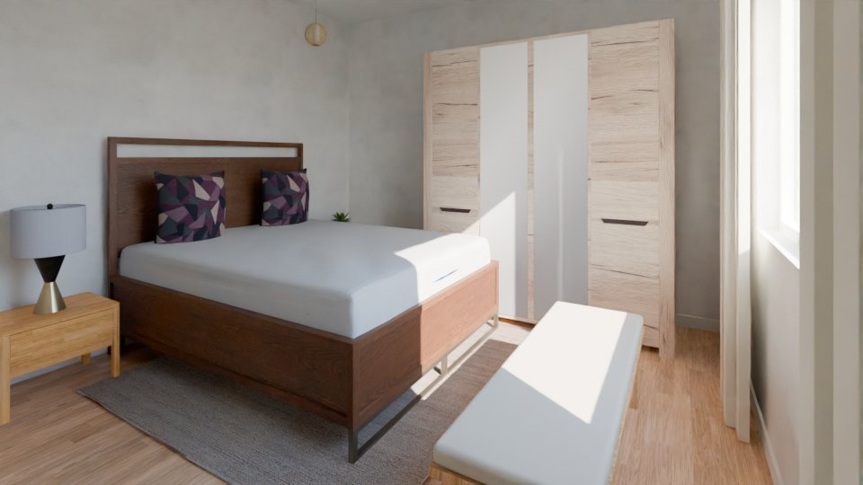
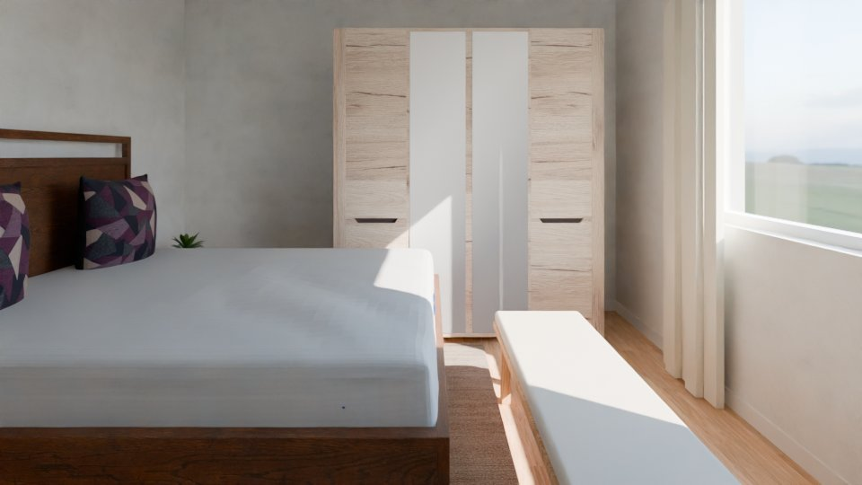
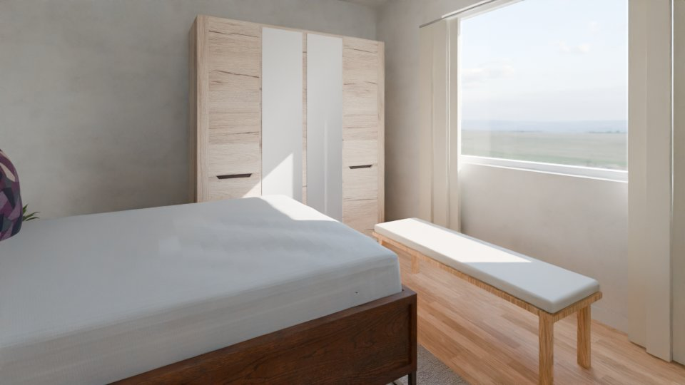
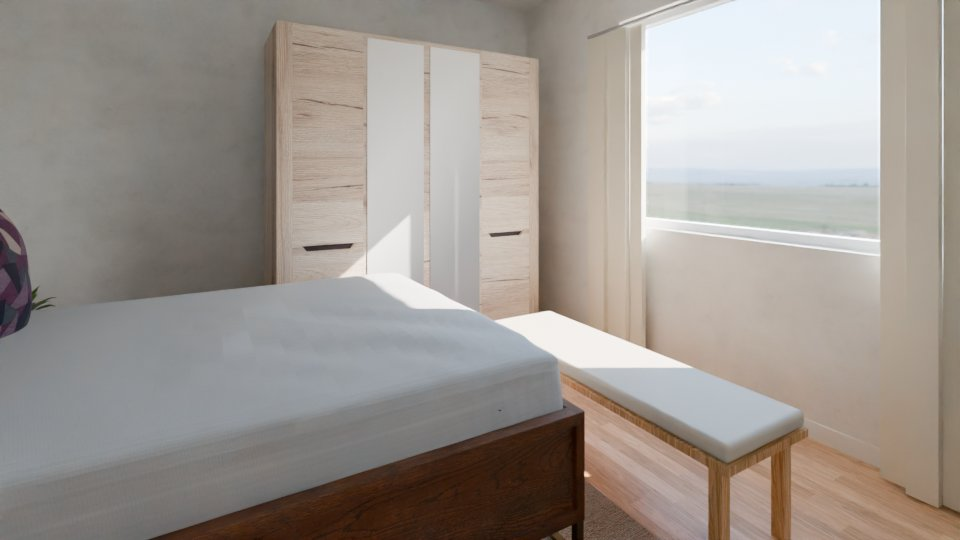
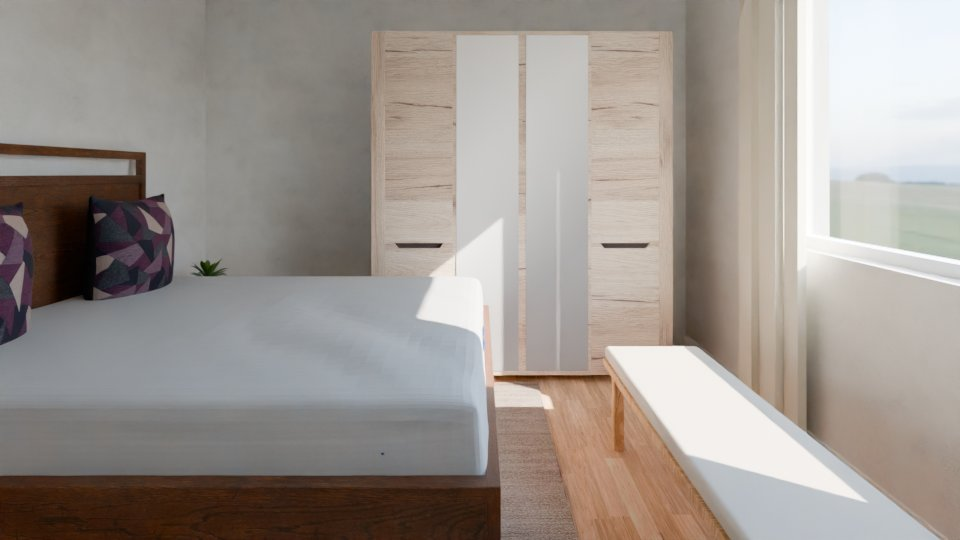

# AI orchestrator log: synthetic-01

Model `Qwen/Qwen3.8-27B-FP8` @ `017b9c7af6b5689d5dd426a76e0bc077eb5ca20a`; started 2026-10-10T00:30:45Z, finished 2026-10-10T00:51:24Z; 131 events, 71 model calls.
Stopped in round 3: final round for critical findings done.

## Round 1

| seq | critic | of | status | counts | note |
|---|---|---|---|---|---|
| 1 | code | plausibility | ok | {"critical": 0, "major": 8, "minor": 6} |  |
| 2 | code | exterior | ok | {"critical": 0, "major": 0, "minor": 0} |  |
| 3 | code | views | ok | {"critical": 0, "major": 0, "minor": 0} |  |
| 4 | vision | r_L0_salon | ok | {"kept": 1, "dropped": 1} |  |
| 5 | vision | r_L0_yatak_odasi | ok | {"kept": 0, "dropped": 2} |  |
| 6 | vision | r_L0_hol | ok | {"kept": 0, "dropped": 2} |  |
| 7 | vision | r_L0_banyo | ok | {"kept": 2, "dropped": 0} |  |
| 8 | vision | r_L0_mutfak | ok | {"kept": 0, "dropped": 2} |  |
| 9 | vision | r_L1_ebeveyn_yatak_odasi | ok | {"kept": 0, "dropped": 3} |  |
| 10 | vision | r_L1_hol | ok | {"kept": 0, "dropped": 2} |  |
| 11 | vision | r_L1_yatak_odasi | ok | {"kept": 0, "dropped": 0} |  |
| 12 | vision | r_L1_banyo | ok | {"kept": 0, "dropped": 2} |  |
| 13 | vision | r_L1_cocuk_odasi | ok | {"kept": 0, "dropped": 2} |  |

Findings: 33 (16 dropped).

| seq | source | check | severity | target | finding | dropped |
|---|---|---|---|---|---|---|
| 14 | code | F6 | major | f_L0_004 | no 0.9 m walkway from d_L0_002 to win_L0_001 (blocked by f_L0_004) |  |
| 15 | code | F6 | major | f_L0_004 | no 0.9 m walkway from d_L0_002 to win_L0_002 (blocked by f_L0_004) |  |
| 16 | code | F6 | major | f_L0_004 | no 0.9 m walkway from d_L0_002 to win_L0_004 (blocked by f_L0_004) |  |
| 17 | code | R3 | minor | d_L0_002 | door d_L0_002 swings into f_L0_004 on one hinge side; the other hinge side is free |  |
| 18 | code | F6 | major | f_L0_009 | wardrobe: the free zone in front of it is blocked by f_L0_006 |  |
| 19 | code | R3 | minor | d_L0_004 | door d_L0_004 swings into f_L0_007 on one hinge side; the other hinge side is free |  |
| 20 | code | F3 | major | f_L0_013 | washing_machine: its back is not on a wall (0.10 m off) |  |
| 21 | code | F6 | major | f_L0_011 | no 0.9 m walkway from d_L0_005 to win_L0_006 (blocked by f_L0_011, f_L0_012) |  |
| 22 | code | F7 | major | f_L0_012 | shower (2.00 m) stands in front of window win_L0_006 (sill 0.90 m) |  |
| 23 | code | R3 | minor | d_L0_005 | door d_L0_005 swings into f_L0_012 on one hinge side; the other hinge side is free |  |
| 24 | code | F4 | major | f_L1_006 | office_chair faces a wall 0.03 m in front of it |  |
| 25 | code | F5 | minor | f_L1_001 | bed_double with 1 of 2 nightstands |  |
| 26 | code | F5 | minor | f_L1_010 | bed_double with 1 of 2 nightstands |  |
| 27 | code | F5 | minor | f_L1_020 | desk without a chair |  |
| 28 | vision | F9 | major | f_L0_004 | The armchair f_L0_004 is placed directly in the path of the door d_L0_002 swing, which is a clear collision and safety hazard visible in the plan. |  |
| 29 | vision | F9 | major | f_L0_012 | The shower (f_L0_012) is rendered as a solid, opaque black box in the 3D views, which is visually incorrect for a shower fixture and looks like a glitch or a missing material. |  |
| 30 | vision | F9 | major | f_L0_012 | The shower (f_L0_012) is rendered as a solid, opaque black box in the 3D views, which is visually incorrect for a shower fixture and looks like a glitch or a missing material. |  |
| 31 | vision | F3 | minor | f_L0_005 | The bookshelf f_L0_005 is floating in the middle of the room, not placed against a wall as is standard for this type of furniture. | code contradicts: F3 measured by code without a violation on f_L0_005 |
| 32 | vision | F6 | major | f_L0_021 | The bench (f_L0_021) is placed directly in front of the bed, blocking the required 0.7m clearance for getting out of bed on that side. | code contradicts: F6 measured by code without a violation on f_L0_021 |
| 33 | vision | F6 | major | f_L0_006 | The bed (f_L0_006) is positioned such that the space on the right side is obstructed by the wardrobe (f_L0_009), leaving no clear 0.7m walkway to access the bed from that side. | code contradicts: F6 measured by code without a violation on f_L0_006 |
| 34 | vision | F3 | major | f_L0_014 | The console table is floating in the middle of the room, not placed against a wall. | code contradicts: F3 measured by code without a violation on f_L0_014 |
| 35 | vision | F8 | major | f_L0_014 | The console table is an isolated piece away from the walls and is not part of a furniture group. | code contradicts: F8 measured by code without a violation on f_L0_014 |
| 36 | vision | F3 | major | f_L0_016 | The sink_kitchen is placed in the middle of the room, floating away from the walls and the main kitchen counter run. | code contradicts: F3 measured by code without a violation on f_L0_016 |
| 37 | vision | F8 | major | f_L0_016 | The sink_kitchen is a floating piece not attached to any wall or part of a larger furniture group. | code contradicts: F8 measured by code without a violation on f_L0_016 |
| 38 | vision | F3 | major | f_L1_001 | The bed is placed in the middle of the room with its headboard facing a wall, but it is not pushed against that wall, leaving a large gap behind it. | code contradicts: F3 measured by code without a violation on f_L1_001 |
| 39 | vision | F6 | major | f_L1_001 | The clearance on the left side of the bed is less than 0.7m, making it difficult to access the bed from that side. | code contradicts: F6 measured by code without a violation on f_L1_001 |
| 40 | vision | F6 | major | f_L1_004 | The clearance in front of the wardrobe is less than 0.6m, which is too narrow to open the doors and access the contents comfortably. | code contradicts: F6 measured by code without a violation on f_L1_004 |
| 41 | vision | F3 | major | f_L1_009 | The bench is placed in the middle of the hallway walkway, not against a wall, obstructing the path. | code contradicts: F3 measured by code without a violation on f_L1_009 |
| 42 | vision | F6 | major | f_L1_009 | The bench blocks the main circulation path of the hallway, leaving insufficient clearance for walking. | code contradicts: F6 measured by code without a violation on f_L1_009 |
| 43 | vision | F3 | major | f_L1_013 | The shower is placed in the middle of the room, floating away from the walls, instead of being tucked into a corner or against a wall as is standard for a shower enclosure. | code contradicts: F3 measured by code without a violation on f_L1_013 |
| 44 | vision | F3 | major | f_L1_015 | The washbasin is placed in the middle of the room, floating away from the walls, instead of being against a wall. | code contradicts: F3 measured by code without a violation on f_L1_015 |
| 45 | vision | F3 | major | f_L1_020 | The desk is placed in the middle of the room with its back facing the open floor, not against a wall. | code contradicts: F3 measured by code without a violation on f_L1_020 |
| 46 | vision | F8 | major | f_L1_020 | The desk is a floating piece in the center of the room and is not part of a group (no chair). | code contradicts: F8 measured by code without a violation on f_L1_020 |

Edits:

| seq | tool | args | accepted | failed checks | score | label | reason | re-run from | before | after |
|---|---|---|---|---|---|---|---|---|---|---|
| 47 | move_piece | {"piece_id": "f_L0_013", "snap_wall_id": "w_L0_008", "offset": 0, "reason": "Snap washing machine back onto the west wall to clear the 0.10 m F3 gap."} | False | drawn_lock: f_L0_013: drawn fixed equipment (washing_machine) is never moved | 67.0 -> 67.0 | adjusted_by_ai | Snap washing machine back onto the west wall to clear the 0.10 m F3 gap. |  |  |  |
| 48 | move_piece | {"piece_id": "f_L0_012", "center": [7.55, 5.95], "reason": "Shift shower 0.5 m south to clear the window win_L0_006 (F7) and open the door-to-window walkway (F6 | False | drawn_lock: f_L0_012: drawn fixed equipment (shower) is never moved | 67.0 -> 67.0 | adjusted_by_ai | Shift shower 0.5 m south to clear the window win_L0_006 (F7) and open the door-to-window walkway (F6). |  |  |  |
| 49 | move_piece | {"piece_id": "f_L0_004", "center": [4.5, 2.5], "reason": "Move the armchair away from the door d_L0_002 swing and the walkways to the windows, keeping it in the | False | drawn_lock: f_L0_004: a drawn piece moves at most 0.3 m, or 1.2 m when its back snaps onto a wall (this move: 0.90 m) | 67.0 -> 67.0 | adjusted_by_ai | Move the armchair away from the door d_L0_002 swing and the walkways to the windows, keeping it in the open area of the salon. |  |  |  |
| 50 | move_piece | {"piece_id": "f_L0_004", "snap_wall_id": "w_L0_004", "offset": 2.5, "reason": "Snap the armchair's back to the west wall (w_L0_004) to clear the door d_L0_002 s | False | snap: f_L0_004: no free place on wall w_L0_004 (doors, windows, at most 1.2 m from the drawn place) | 67.0 -> 67.0 | adjusted_by_ai | Snap the armchair's back to the west wall (w_L0_004) to clear the door d_L0_002 swing and the 0.9 m walkways to the windows. |  |  |  |
| 51 | move_piece | {"piece_id": "f_L0_004", "snap_wall_id": "w_L0_006", "offset": 4.5, "reason": "Snap the armchair's back to the south wall (w_L0_006) to clear the door d_L0_002  | False | snap: f_L0_004: no free place on wall w_L0_006 (doors, windows, at most 1.2 m from the drawn place) | 67.0 -> 67.0 | adjusted_by_ai | Snap the armchair's back to the south wall (w_L0_006) to clear the door d_L0_002 swing and the 0.9 m walkways to the windows. |  |  |  |
| 52 | move_piece | {"piece_id": "f_L0_004", "center": [4.5, 3.1], "reason": "Shift the armchair 0.3 m south to clear the door d_L0_002 swing and open the 0.9 m walkways to the win | False | max_tries: f_L0_004 was edited 3 times in this round |  | adjusted_by_ai | Shift the armchair 0.3 m south to clear the door d_L0_002 swing and open the 0.9 m walkways to the windows. |  |  |  |
| 53 | move_piece | {"piece_id": "f_L0_021", "center": [7.4, 0.75], "reason": "Move the AI bench away from the wardrobe's free zone so the front of f_L0_009 is unblocked (F6)."} | False | score: plausibility 87 -> 77 (F4 f_L0_021: bench faces a wall 0.28 m in front of it) | 87.0 -> 77.0 | added_by_ai | Move the AI bench away from the wardrobe's free zone so the front of f_L0_009 is unblocked (F6). |  |  |  |
| 54 | move_piece | {"piece_id": "f_L0_021", "center": [7.4, 0.95], "reason": "Move the AI bench down so the wardrobe's free zone in front of f_L0_009 is unblocked (F6)."} | True |  | 87.0 -> 87.0 | added_by_ai | Move the AI bench down so the wardrobe's free zone in front of f_L0_009 is unblocked (F6). | refit |  |  |
| 55 | move_piece | {"piece_id": "f_L0_007", "center": [6.65, 3.3], "reason": "Shift the nightstand away from the door swing arc so d_L0_004 no longer hits it (R3)."} | False | score: plausibility 87 -> 84 (F3 f_L0_007: nightstand: its back is not on a wall (0.25 m off)) | 87.0 -> 84.0 | adjusted_by_ai | Shift the nightstand away from the door swing arc so d_L0_004 no longer hits it (R3). |  |  |  |
| 56 | move_piece | {"piece_id": "f_L0_007", "snap_wall_id": "w_L0_007", "offset": 0.3, "reason": "Snap the nightstand back to the wall and shift it along the wall away from the do | False | snap: f_L0_007: no free place on wall w_L0_007 (doors, windows, at most 1.2 m from the drawn place) | 87.0 -> 87.0 | adjusted_by_ai | Snap the nightstand back to the wall and shift it along the wall away from the door swing arc (R3). |  |  |  |
| 57 | move_piece | {"piece_id": "f_L0_007", "center": [6.65, 3.55], "reason": "Nudge the nightstand 5 cm toward the wall so the door swing arc no longer overlaps it (R3)."} | False | f_L0_007: inside_room | 87.0 -> 87.0 | adjusted_by_ai | Nudge the nightstand 5 cm toward the wall so the door swing arc no longer overlaps it (R3). |  |  |  |
| 58 | move_piece | {"piece_id": "f_L0_007", "center": [6.65, 3.52], "reason": "Nudge the nightstand 2 cm toward the wall so the door swing arc no longer overlaps it (R3)."} | False | max_tries: f_L0_007 was edited 3 times in this round |  | adjusted_by_ai | Nudge the nightstand 2 cm toward the wall so the door swing arc no longer overlaps it (R3). |  |  |  |
| 59 | move_piece | {"piece_id": "f_L1_006", "center": [1.0, 0.55], "reason": "Move the office chair away from the west wall (it faced a wall 0.03 m in front) and place it in front | False | f_L1_005: no_overlap, f_L1_006: no_overlap | 87.0 -> 87.0 | added_by_ai | Move the office chair away from the west wall (it faced a wall 0.03 m in front) and place it in front of the desk. |  |  |  |
| 60 | move_piece | {"piece_id": "f_L1_006", "center": [1.0, 0.95], "reason": "Move the office chair away from the west wall (it faced a wall 0.03 m in front) and place it in front | False | f_L1_005: no_overlap, f_L1_006: no_overlap | 87.0 -> 97.0 | added_by_ai | Move the office chair away from the west wall (it faced a wall 0.03 m in front) and place it in front of the desk, clear of the desk footprint. |  |  |  |
| 61 | move_piece | {"piece_id": "f_L1_006", "center": [1.0, 1.1], "reason": "Move the office chair away from the west wall (it faced a wall 0.03 m in front) and place it in front  | False | f_L1_001: doors_free, f_L1_005: no_overlap, f_L1_006: doors_free, f_L1_006: no_overlap | 87.0 -> 87.0 | added_by_ai | Move the office chair away from the west wall (it faced a wall 0.03 m in front) and place it in front of the desk, clear of the desk footprint. |  |  |  |
| 62 | move_piece | {"piece_id": "f_L1_006", "center": [1.0, 1.0], "reason": "Move the office chair away from the west wall (it faced a wall 0.03 m in front) and place it in front  | False | max_tries: f_L1_006 was edited 3 times in this round |  | added_by_ai | Move the office chair away from the west wall (it faced a wall 0.03 m in front) and place it in front of the desk, clear of the desk footprint. |  |  |  |

Re-runs and renders:

| seq | kind | from | status | views | seconds | before | after | note |
|---|---|---|---|---|---|---|---|---|
| 63 | rerun | refit | ok | cam_r_L0_yatak_odasi_1, cam_r_L0_yatak_odasi_2, cam_r_L0_yatak_odasi_3 | 166.6 |  |  |  |
| 64 | render |  | preview | cam_r_L0_yatak_odasi_1 |  |  |  |  |
| 65 | render |  | preview | cam_r_L0_yatak_odasi_2 |  |  |  |  |
| 66 | render |  | preview | cam_r_L0_yatak_odasi_3 |  |  |  |  |

## Round 2

| seq | critic | of | status | counts | note |
|---|---|---|---|---|---|
| 67 | code | plausibility | ok | {"critical": 0, "major": 8, "minor": 6} |  |
| 68 | code | exterior | ok | {"critical": 0, "major": 0, "minor": 0} |  |
| 69 | code | views | ok | {"critical": 0, "major": 0, "minor": 0} |  |
| 70 | vision | r_L0_yatak_odasi | ok | {"kept": 0, "dropped": 4} |  |

Findings: 21 (4 dropped).

| seq | source | check | severity | target | finding | dropped |
|---|---|---|---|---|---|---|
| 71 | code | F6 | major | f_L0_004 | no 0.9 m walkway from d_L0_002 to win_L0_001 (blocked by f_L0_004) |  |
| 72 | code | F6 | major | f_L0_004 | no 0.9 m walkway from d_L0_002 to win_L0_002 (blocked by f_L0_004) |  |
| 73 | code | F6 | major | f_L0_004 | no 0.9 m walkway from d_L0_002 to win_L0_004 (blocked by f_L0_004) |  |
| 74 | code | R3 | minor | d_L0_002 | door d_L0_002 swings into f_L0_004 on one hinge side; the other hinge side is free |  |
| 75 | code | F6 | major | f_L0_009 | wardrobe: the free zone in front of it is blocked by f_L0_006 |  |
| 76 | code | R3 | minor | d_L0_004 | door d_L0_004 swings into f_L0_007 on one hinge side; the other hinge side is free |  |
| 77 | code | F3 | major | f_L0_013 | washing_machine: its back is not on a wall (0.10 m off) |  |
| 78 | code | F6 | major | f_L0_011 | no 0.9 m walkway from d_L0_005 to win_L0_006 (blocked by f_L0_011, f_L0_012) |  |
| 79 | code | F7 | major | f_L0_012 | shower (2.00 m) stands in front of window win_L0_006 (sill 0.90 m) |  |
| 80 | code | R3 | minor | d_L0_005 | door d_L0_005 swings into f_L0_012 on one hinge side; the other hinge side is free |  |
| 81 | code | F4 | major | f_L1_006 | office_chair faces a wall 0.03 m in front of it |  |
| 82 | code | F5 | minor | f_L1_001 | bed_double with 1 of 2 nightstands |  |
| 83 | code | F5 | minor | f_L1_010 | bed_double with 1 of 2 nightstands |  |
| 84 | code | F5 | minor | f_L1_020 | desk without a chair |  |
| 85 | vision | F9 | major | f_L0_004 | The armchair f_L0_004 is placed directly in the path of the door d_L0_002 swing, which is a clear collision and safety hazard visible in the plan. |  |
| 86 | vision | F9 | major | f_L0_012 | The shower (f_L0_012) is rendered as a solid, opaque black box in the 3D views, which is visually incorrect for a shower fixture and looks like a glitch or a missing material. |  |
| 87 | vision | F9 | major | f_L0_012 | The shower (f_L0_012) is rendered as a solid, opaque black box in the 3D views, which is visually incorrect for a shower fixture and looks like a glitch or a missing material. |  |
| 88 | vision | F6 | major | f_L0_009 | The clearance in front of the wardrobe is blocked by the bed, making it impossible to open the doors or access the storage. | duplicate of a code finding |
| 89 | vision | F6 | major | f_L0_006 | The clearance on the right side of the bed is blocked by the wardrobe, leaving no space to walk around or access the bed. | code contradicts: F6 measured by code without a violation on f_L0_006 |
| 90 | vision | F5 | major | f_L0_008 | The nightstand on the right is not placed next to the bed, breaking the expected bed + nightstand group. | code contradicts: F5 measured by code without a violation on f_L0_008 |
| 91 | vision | F8 | minor | f_L0_008 | The nightstand is floating in the corner of the room, not attached to the bed or a wall group. | code contradicts: F8 measured by code without a violation on f_L0_008 |

Edits:

| seq | tool | args | accepted | failed checks | score | label | reason | re-run from | before | after |
|---|---|---|---|---|---|---|---|---|---|---|
| 92 | move_piece | {"piece_id": "f_L0_013", "snap_wall_id": "w_L0_008", "reason": "Snap the washing machine's back edge onto the west wall to clear the 0.10 m F3 gap."} | False | drawn_lock: f_L0_013: drawn fixed equipment (washing_machine) is never moved | 67.0 -> 67.0 | adjusted_by_ai | Snap the washing machine's back edge onto the west wall to clear the 0.10 m F3 gap. |  |  |  |
| 93 | move_piece | {"piece_id": "f_L0_012", "snap_wall_id": "w_L0_008", "offset": 2.6, "reason": "Move the shower to the west wall below the door swing so it no longer stands in f | False | drawn_lock: f_L0_012: drawn fixed equipment (shower) is never moved | 67.0 -> 67.0 | adjusted_by_ai | Move the shower to the west wall below the door swing so it no longer stands in front of window win_L0_006 and frees the door-to-window walkway. |  |  |  |
| 94 | resize_piece | {"piece_id": "f_L0_012", "size": [0.9, 0.9], "reason": "Set the shower to a real 0.9×0.9 m product size so its footprint matches the drawn box and the F7 window | False | drawn_lock: f_L0_012: drawn fixed equipment keeps its drawn size | 67.0 -> 67.0 | adjusted_by_ai | Set the shower to a real 0.9×0.9 m product size so its footprint matches the drawn box and the F7 window clearance is re-evaluated. |  |  |  |
| 95 | move_piece | {"piece_id": "f_L0_004", "snap_wall_id": "w_L0_005", "offset": 0.45, "reason": "Move the armchair out of the door d_L0_002 swing and clear the 0.9 m walkways fr | False | f_L0_001: doors_free | 67.0 -> 70.0 | adjusted_by_ai | Move the armchair out of the door d_L0_002 swing and clear the 0.9 m walkways from the door to the windows by snapping it against the east wall above the door. |  |  |  |
| 96 | move_piece | {"piece_id": "f_L0_004", "center": [4.75, 4.75], "reason": "Move the armchair to the top-right corner, clear of the door d_L0_002 swing and the walkways to the  | False | drawn_lock: f_L0_004: a drawn piece moves at most 0.3 m, or 1.2 m when its back snaps onto a wall (this move: 1.37 m) | 67.0 -> 67.0 | adjusted_by_ai | Move the armchair to the top-right corner, clear of the door d_L0_002 swing and the walkways to the windows. |  |  |  |
| 97 | move_piece | {"piece_id": "f_L0_004", "snap_wall_id": "w_L0_005", "offset": 0.75, "reason": "Snap the armchair's back to the east wall above the door, out of the door swing  | False | f_L0_001: doors_free | 67.0 -> 70.0 | adjusted_by_ai | Snap the armchair's back to the east wall above the door, out of the door swing and clear of the walkways to the windows. |  |  |  |
| 98 | move_piece | {"piece_id": "f_L0_004", "center": [4.75, 3.1], "reason": "Shift the armchair 0.3 m down along the east wall, out of the door d_L0_002 swing and clear of the wa | False | max_tries: f_L0_004 was edited 3 times in this round |  | adjusted_by_ai | Shift the armchair 0.3 m down along the east wall, out of the door d_L0_002 swing and clear of the walkways to the windows. |  |  |  |
| 99 | move_piece | {"piece_id": "f_L0_006", "center": [7.8, 2.45], "reason": "Shift the bed 0.25 m away from the wardrobe so the free zone in front of f_L0_009 is no longer blocke | False | score: plausibility 87 -> 57 (F3 f_L0_006: bed_double: the headboard stands in the room (0.30 m off)) | 87.0 -> 57.0 | adjusted_by_ai | Shift the bed 0.25 m away from the wardrobe so the free zone in front of f_L0_009 is no longer blocked (F6). |  |  |  |
| 100 | move_piece | {"piece_id": "f_L0_006", "snap_wall_id": "w_L0_005", "offset": 1.2, "reason": "Snap the bed's headboard back to the west wall (w_L0_005) and shift it 1.2 m alon | False | snap: f_L0_006: no free place on wall w_L0_005 (doors, windows, at most 1.2 m from the drawn place) | 87.0 -> 87.0 | adjusted_by_ai | Snap the bed's headboard back to the west wall (w_L0_005) and shift it 1.2 m along the wall away from the wardrobe, clearing the free zone in front of f_L0_009 (F6). |  |  |  |
| 101 | move_piece | {"piece_id": "f_L0_006", "center": [7.8, 2.55], "reason": "Shift the bed 0.15 m away from the wardrobe (headboard stays on the west wall) so the free zone in fr | False | score: plausibility 87 -> 57 (F3 f_L0_006: bed_double: the headboard stands in the room (0.20 m off)) | 87.0 -> 57.0 | adjusted_by_ai | Shift the bed 0.15 m away from the wardrobe (headboard stays on the west wall) so the free zone in front of f_L0_009 is no longer blocked (F6). |  |  |  |
| 102 | move_piece | {"piece_id": "f_L0_006", "center": [7.8, 2.6], "reason": "Shift the bed 0.10 m away from the wardrobe (headboard stays on the west wall) so the free zone in fro | False | max_tries: f_L0_006 was edited 3 times in this round |  | adjusted_by_ai | Shift the bed 0.10 m away from the wardrobe (headboard stays on the west wall) so the free zone in front of f_L0_009 is no longer blocked (F6). |  |  |  |
| 103 | move_piece | {"piece_id": "f_L1_006", "center": [1.0, 0.55], "reason": "Move the office chair away from the west wall (it faced a wall 0.03 m in front) and place it in front | False | f_L1_005: no_overlap, f_L1_006: no_overlap | 87.0 -> 87.0 | added_by_ai | Move the office chair away from the west wall (it faced a wall 0.03 m in front) and place it in front of the desk. |  |  |  |
| 104 | move_piece | {"piece_id": "f_L1_006", "center": [1.0, 0.95], "reason": "Move the office chair away from the west wall (it faced a wall 0.03 m in front) and place it in front | False | f_L1_005: no_overlap, f_L1_006: no_overlap | 87.0 -> 97.0 | added_by_ai | Move the office chair away from the west wall (it faced a wall 0.03 m in front) and place it in front of the desk, clear of the desk footprint. |  |  |  |
| 105 | move_piece | {"piece_id": "f_L1_006", "center": [1.0, 1.1], "reason": "Move the office chair away from the west wall (it faced a wall 0.03 m in front) and place it in front  | False | f_L1_001: doors_free, f_L1_005: no_overlap, f_L1_006: doors_free, f_L1_006: no_overlap | 87.0 -> 87.0 | added_by_ai | Move the office chair away from the west wall (it faced a wall 0.03 m in front) and place it in front of the desk, clear of the desk footprint. |  |  |  |
| 106 | move_piece | {"piece_id": "f_L1_006", "center": [1.0, 1.0], "reason": "Move the office chair away from the west wall (it faced a wall 0.03 m in front) and place it in front  | False | max_tries: f_L1_006 was edited 3 times in this round |  | added_by_ai | Move the office chair away from the west wall (it faced a wall 0.03 m in front) and place it in front of the desk, clear of the desk footprint and door swing. |  |  |  |

Stop: no edit accepted in this round (1 edits accepted in 2 rounds)

## Round 3

| seq | critic | of | status | counts | note |
|---|---|---|---|---|---|
| 108 | code | plausibility | ok | {"critical": 0, "major": 8, "minor": 6} |  |
| 109 | code | exterior | ok | {"critical": 0, "major": 0, "minor": 0} |  |
| 110 | code | views | ok | {"critical": 0, "major": 0, "minor": 0} |  |
| 111 | vision | r_L0_yatak_odasi | ok | {"kept": 1, "dropped": 1} |  |

Findings: 19 (1 dropped).

| seq | source | check | severity | target | finding | dropped |
|---|---|---|---|---|---|---|
| 112 | code | F6 | major | f_L0_004 | no 0.9 m walkway from d_L0_002 to win_L0_001 (blocked by f_L0_004) |  |
| 113 | code | F6 | major | f_L0_004 | no 0.9 m walkway from d_L0_002 to win_L0_002 (blocked by f_L0_004) |  |
| 114 | code | F6 | major | f_L0_004 | no 0.9 m walkway from d_L0_002 to win_L0_004 (blocked by f_L0_004) |  |
| 115 | code | R3 | minor | d_L0_002 | door d_L0_002 swings into f_L0_004 on one hinge side; the other hinge side is free |  |
| 116 | code | F6 | major | f_L0_009 | wardrobe: the free zone in front of it is blocked by f_L0_006 |  |
| 117 | code | R3 | minor | d_L0_004 | door d_L0_004 swings into f_L0_007 on one hinge side; the other hinge side is free |  |
| 118 | code | F3 | major | f_L0_013 | washing_machine: its back is not on a wall (0.10 m off) |  |
| 119 | code | F6 | major | f_L0_011 | no 0.9 m walkway from d_L0_005 to win_L0_006 (blocked by f_L0_011, f_L0_012) |  |
| 120 | code | F7 | major | f_L0_012 | shower (2.00 m) stands in front of window win_L0_006 (sill 0.90 m) |  |
| 121 | code | R3 | minor | d_L0_005 | door d_L0_005 swings into f_L0_012 on one hinge side; the other hinge side is free |  |
| 122 | code | F4 | major | f_L1_006 | office_chair faces a wall 0.03 m in front of it |  |
| 123 | code | F5 | minor | f_L1_001 | bed_double with 1 of 2 nightstands |  |
| 124 | code | F5 | minor | f_L1_010 | bed_double with 1 of 2 nightstands |  |
| 125 | code | F5 | minor | f_L1_020 | desk without a chair |  |
| 126 | vision | F9 | major | f_L0_004 | The armchair f_L0_004 is placed directly in the path of the door d_L0_002 swing, which is a clear collision and safety hazard visible in the plan. |  |
| 127 | vision | F9 | major | f_L0_006 | The bed is rendered with two different, mismatched base styles (a dark wood frame on one side and a light wood frame on the other), which is a visual defect. |  |
| 128 | vision | F9 | major | f_L0_012 | The shower (f_L0_012) is rendered as a solid, opaque black box in the 3D views, which is visually incorrect for a shower fixture and looks like a glitch or a missing material. |  |
| 129 | vision | F9 | major | f_L0_012 | The shower (f_L0_012) is rendered as a solid, opaque black box in the 3D views, which is visually incorrect for a shower fixture and looks like a glitch or a missing material. |  |
| 130 | vision | F3 | major | f_L0_021 | The bench is placed in the middle of the room, floating away from any wall or furniture group, instead of being tucked against a wall or at the foot of the bed. | code contradicts: F3 measured by code without a violation on f_L0_021 |

Stop: final round for critical findings done
