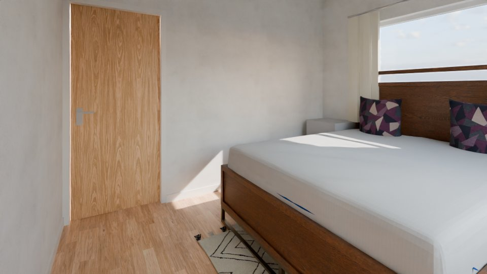
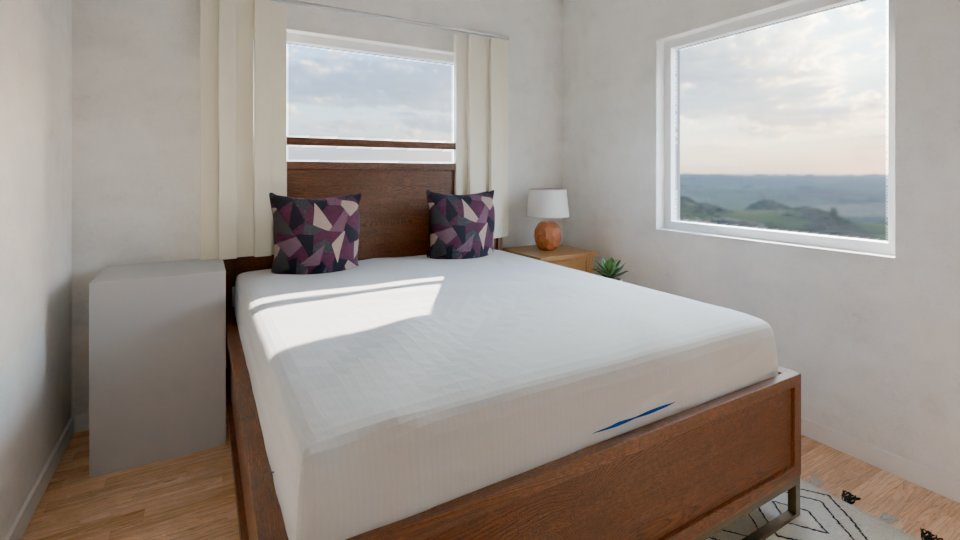
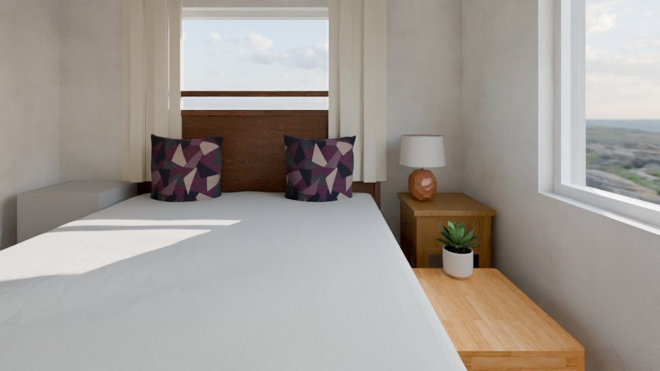
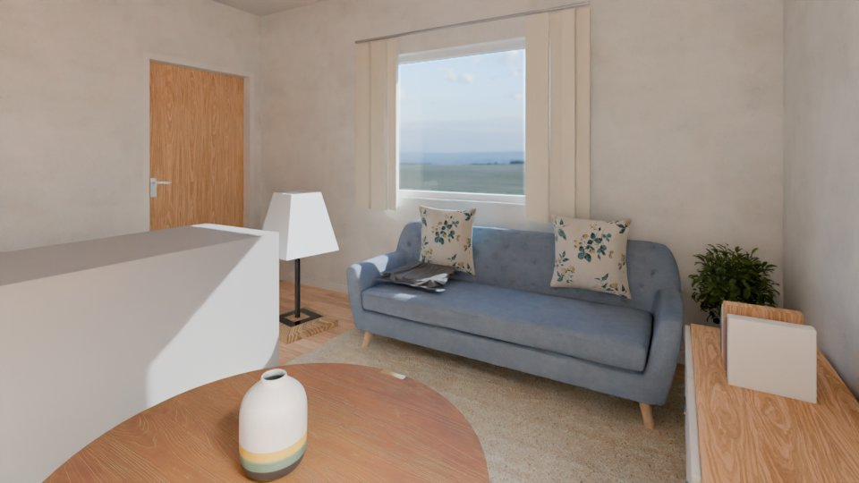
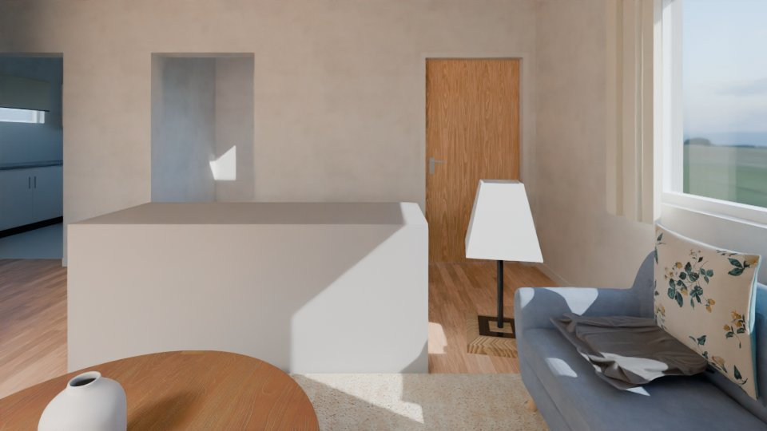
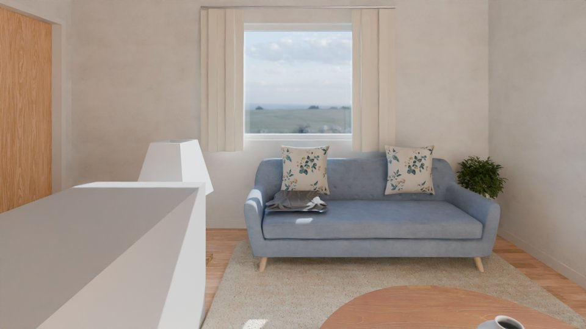
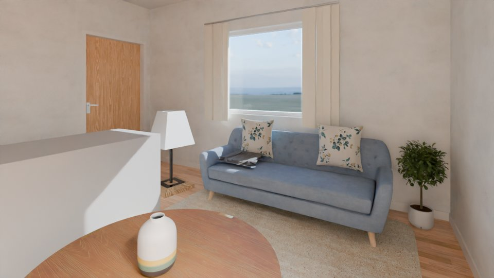
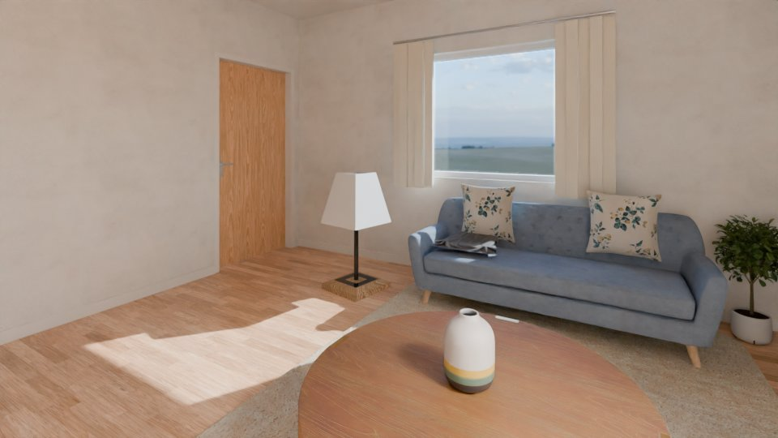
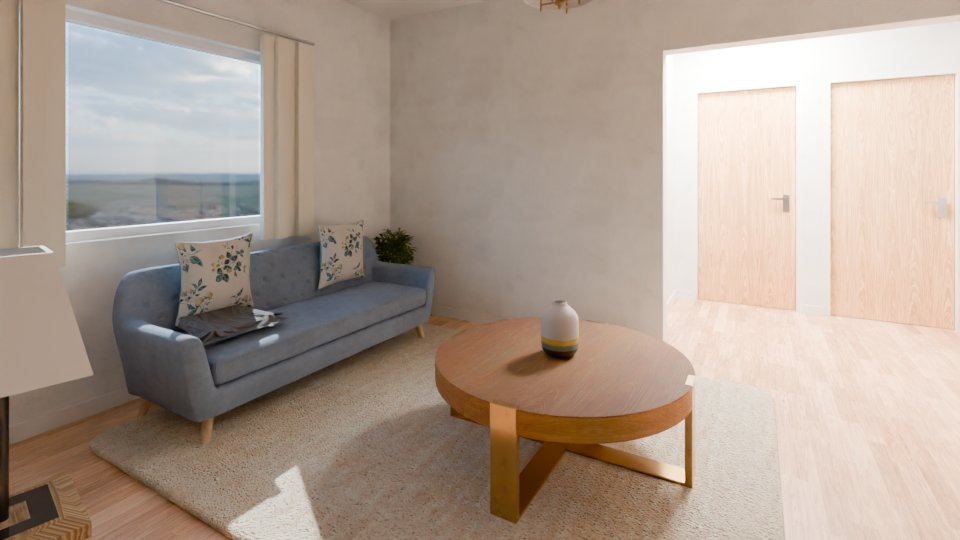

# Final report: real01

18 views: 0 polished, 18 Cycles (error 11, room 7). Stages: render run, gate validation ok, polish run, vision check single_pass (calibration run). A polished image is final only when the gate accepted it and the vision check checked it without finding a lost or added element (§5.5). Mismatches are listed with their evidence and never auto-fixed.

## Summary

| item | value |
|---|---|
| views | 18 |
| interior / exterior views | 18 / 0 |
| variant | base |
| polished | 0 |
| Cycles | 18 (error 11, room 7) |
| confirmed mismatches on the final image | 0 in 0 view(s) |
| JSON cross-check findings (Cycles render) | 0 |
| needs_review views | 0 |
| unverified pieces in view (sum over views) | 4 |
| rooms mixing polished and Cycles | 0 |
| advisory | yes |
| advisory flags | 10 |
| exposure | -0.67 .. +5.17 EV (0 at a limit), modes auto |
| window pull | 15 view(s), -2 .. -1 EV |
| camera policy | search 18 |
| camera score (min / mean / max) | 1.85 / 3.21 / 4.04 |
| rooms by number of views | 2 with 0, 1 with 1, 1 with 2, 5 with 3 |
| gate validation | ok |
| seconds: build / render / metering | 63.3 s / 61.6 s / 7.9 s |
| seconds: polish / gate / check | 2.1 min / 11.0 s / 17.2 min |
| brief polish | yes (default, not in brief.yaml) |
| unit system | imperial |
| side-by-side sheets | 7 |

## 3D files

Open in Blender: the `.blend` directly (textures packed, cameras with their metered exposure in the custom property `wenart_exposure_ev`, render settings as these images); the `.glb` with File > Import > glTF 2.0 (also other 3D tools). In the results: `final/<project>/3d/`.

| file | size |
|---|---|
| [real01.blend](3d/real01.blend) | 101.5 MB |
| [real01.glb](3d/real01.glb) | 224.9 MB |

18 cameras; textures scaled to at most 1024 px (86 scaled) for the download.

## AI decor

33 decor items chosen by the AI (Qwen/Qwen3-VL-8B-Instruct; both passes agreeing) in 6 rooms; 0 items by the rules. The decor stage places decor only: it moves, adds and removes no furniture (the AI completion of furnished rooms has its own section, `AI completion of furnished rooms`; `furniture/<project>/decor_report.md` has every room).

## Advisory flags and open items

- vision check single pass: every result unverified (advisory)
- vision check advisory: single pass: no two-model agreement; fa_missing None misses <= 0.05 (single pass); fa_extra None misses <= 0.1 (single pass); removal_flagged None misses >= 0.8 (single pass); removal_confirmed None misses >= 0.6 (single pass); insertion None misses >= 0.6 (single pass)
- check target missed: fa_missing - (needs <= 0.05), single pass
- check target missed: fa_extra - (needs <= 0.1), single pass
- check target missed: removal_flagged - (needs >= 0.8), single pass
- check target missed: removal_confirmed - (needs >= 0.6), single pass
- check target missed: insertion - (needs >= 0.6), single pass
- 2 drawn piece(s) not typed: the two AI passes disagree or did not answer (unknown, unverified; footprint kept): f_L0_006, f_L0_009
- drawn-piece check: 1 piece(s) moved beyond the tolerance, 0 locked-rule violation(s)
- AI completion: 34 proposal(s) refused, reverted or not placed (listed per room)

## Gate validation

| item | value |
|---|---|
| decision | ok |
| benign controls accepted | 96.4 % (limit 95 %), 56 comparisons |
| negative controls rejected | 95.6 % (limit 90 %), 114 comparisons |
| effect | polish allowed |

## Contact sheets

Tiles: camera, `P` polished / `C` Cycles, `U<n>` unverified pieces in view.

Level L0: [contact_L0.jpg](contact_L0.jpg)

## Side-by-side sheets (Cycles | polished)

Per room: the Cycles render (left) and the polish candidate (right; the chosen attempt, else the last attempt the gate saw) with the gate decision, both check verdicts and the final decision.

- r_L0_bath_toilet: [contact_sbs_r_L0_bath_toilet.jpg](contact_sbs_r_L0_bath_toilet.jpg)

- r_L0_bed_room: [contact_sbs_r_L0_bed_room.jpg](contact_sbs_r_L0_bed_room.jpg)

- r_L0_bed_room_2: [contact_sbs_r_L0_bed_room_2.jpg](contact_sbs_r_L0_bed_room_2.jpg)

- r_L0_dining: [contact_sbs_r_L0_dining.jpg](contact_sbs_r_L0_dining.jpg)

- r_L0_drawing_room: [contact_sbs_r_L0_drawing_room.jpg](contact_sbs_r_L0_drawing_room.jpg)

- r_L0_kitchen: [contact_sbs_r_L0_kitchen.jpg](contact_sbs_r_L0_kitchen.jpg)

- r_L0_room: [contact_sbs_r_L0_room.jpg](contact_sbs_r_L0_room.jpg)

| room | view | polish attempt | gate | check Cycles | check polished | detector | final |
|---|---|---|---|---|---|---|---|
| r_L0_bath_toilet | cam_r_L0_bath_toilet_1 | a1 s 0.375 geometry x0.8 | accept | info | - | - | cycles (error) |
| r_L0_bath_toilet | cam_r_L0_bath_toilet_2 | a1 s 0.375 geometry x0.8 | accept | info | - | - | cycles (error) |
| r_L0_bed_room | cam_r_L0_bed_room_1 | a1 s 0.375 geometry x0.8 | accept | info | - | - | cycles (error) |
| r_L0_bed_room | cam_r_L0_bed_room_2 | a1 s 0.375 geometry x0.8 | accept | info | - | - | cycles (error) |
| r_L0_bed_room | cam_r_L0_bed_room_3 | a1 s 0.375 geometry x0.8 | accept | info | - | - | cycles (error) |
| r_L0_bed_room_2 | cam_r_L0_bed_room_2_1 | - | - | info | - | - | cycles (room) |
| r_L0_bed_room_2 | cam_r_L0_bed_room_2_2 | - | - | info | - | - | cycles (room) |
| r_L0_bed_room_2 | cam_r_L0_bed_room_2_3 | - | - | info | - | - | cycles (room) |
| r_L0_dining | cam_r_L0_dining_1 | a1 s 0.375 geometry x0.8 | accept | info | - | - | cycles (error) |
| r_L0_dining | cam_r_L0_dining_2 | a2 s 0.25 canny x0.8 | accept | info | - | - | cycles (error) |
| r_L0_dining | cam_r_L0_dining_3 | a3 s 0.125 depth x0.8 | accept | info | - | - | cycles (error) |
| r_L0_drawing_room | cam_r_L0_drawing_room_1 | a1 s 0.375 geometry x0.8 | accept | info | - | - | cycles (error) |
| r_L0_drawing_room | cam_r_L0_drawing_room_2 | a2 s 0.25 canny x0.8 | accept | info | - | - | cycles (error) |
| r_L0_drawing_room | cam_r_L0_drawing_room_3 | a1 s 0.375 geometry x0.8 | accept | info | - | - | cycles (error) |
| r_L0_kitchen | cam_r_L0_kitchen_1 | - | - | info | - | - | cycles (room) |
| r_L0_kitchen | cam_r_L0_kitchen_2 | - | - | info | - | - | cycles (room) |
| r_L0_kitchen | cam_r_L0_kitchen_3 | - | - | info | - | - | cycles (room) |
| r_L0_room | cam_r_L0_room_1 | - | - | info | - | - | cycles (room) |

## Views

| view | room | level | final | reason | polish attempt | gate | check Cycles | check polished | preference | EV | pull EV | camera | ids D/A/R | U | review | files |
|---|---|---|---|---|---|---|---|---|---|---|---|---|---|---|---|---|
| cam_r_L0_bath_toilet_1 | r_L0_bath_toilet | L0 | cycles | error | a1 s 0.375 geometry x0.8 | accept | info | - | - | -0.67 | - | search 2.78 | D1 A3 | 0 | no | [preview](cam_r_L0_bath_toilet_1_final_preview.jpg) [plan](cam_r_L0_bath_toilet_1_plan.jpg) |
| cam_r_L0_bath_toilet_2 | r_L0_bath_toilet | L0 | cycles | error | a1 s 0.375 geometry x0.8 | accept | info | - | - | -0.67 | - | search 1.85 | D1 A3 | 0 | no | [preview](cam_r_L0_bath_toilet_2_final_preview.jpg) [plan](cam_r_L0_bath_toilet_2_plan.jpg) |
| cam_r_L0_bed_room_1 | r_L0_bed_room | L0 | cycles | error | a1 s 0.375 geometry x0.8 | accept | info | - | - | +3.33 | -1 | search 3.41 | D4 A2 | 1 | no | [preview](cam_r_L0_bed_room_1_final_preview.jpg) [plan](cam_r_L0_bed_room_1_plan.jpg) |
| cam_r_L0_bed_room_2 | r_L0_bed_room | L0 | cycles | error | a1 s 0.375 geometry x0.8 | accept | info | - | - | +3.83 | -2 | search 3.20 | D5 A2 | 1 | no | [preview](cam_r_L0_bed_room_2_final_preview.jpg) [plan](cam_r_L0_bed_room_2_plan.jpg) |
| cam_r_L0_bed_room_2_1 | r_L0_bed_room_2 | L0 | cycles | room | - | - | info | - | - | +3.67 | -1 | search 3.67 | D4 A2 | 0 | no | [preview](cam_r_L0_bed_room_2_1_final_preview.jpg) [plan](cam_r_L0_bed_room_2_1_plan.jpg) |
| cam_r_L0_bed_room_2_2 | r_L0_bed_room_2 | L0 | cycles | room | - | - | info | - | - | +4.17 | -2 | search 3.33 | D3 A3 | 0 | no | [preview](cam_r_L0_bed_room_2_2_final_preview.jpg) [plan](cam_r_L0_bed_room_2_2_plan.jpg) |
| cam_r_L0_bed_room_2_3 | r_L0_bed_room_2 | L0 | cycles | room | - | - | info | - | - | +3.83 | -1 | search 3.07 | D5 A2 | 1 | no | [preview](cam_r_L0_bed_room_2_3_final_preview.jpg) [plan](cam_r_L0_bed_room_2_3_plan.jpg) |
| cam_r_L0_bed_room_3 | r_L0_bed_room | L0 | cycles | error | a1 s 0.375 geometry x0.8 | accept | info | - | - | +3.33 | -1 | search 2.80 | D5 A2 | 1 | no | [preview](cam_r_L0_bed_room_3_final_preview.jpg) [plan](cam_r_L0_bed_room_3_plan.jpg) |
| cam_r_L0_dining_1 | r_L0_dining | L0 | cycles | error | a1 s 0.375 geometry x0.8 | accept | info | - | - | +4.83 | -1 | search 2.91 | D9 A5 | 0 | no | [preview](cam_r_L0_dining_1_final_preview.jpg) [plan](cam_r_L0_dining_1_plan.jpg) |
| cam_r_L0_dining_2 | r_L0_dining | L0 | cycles | error | a2 s 0.25 canny x0.8 | accept | info | - | - | +5.00 | -2 | search 2.48 | D7 A4 | 0 | no | [preview](cam_r_L0_dining_2_final_preview.jpg) [plan](cam_r_L0_dining_2_plan.jpg) |
| cam_r_L0_dining_3 | r_L0_dining | L0 | cycles | error | a3 s 0.125 depth x0.8 | accept | info | - | - | +4.83 | -2 | search 2.47 | D6 A3 | 0 | no | [preview](cam_r_L0_dining_3_final_preview.jpg) [plan](cam_r_L0_dining_3_plan.jpg) |
| cam_r_L0_drawing_room_1 | r_L0_drawing_room | L0 | cycles | error | a1 s 0.375 geometry x0.8 | accept | info | - | - | +3.00 | -1 | search 3.95 | D5 A3 | 0 | no | [preview](cam_r_L0_drawing_room_1_final_preview.jpg) [plan](cam_r_L0_drawing_room_1_plan.jpg) |
| cam_r_L0_drawing_room_2 | r_L0_drawing_room | L0 | cycles | error | a2 s 0.25 canny x0.8 | accept | info | - | - | +2.67 | -1 | search 3.70 | D5 A3 | 0 | no | [preview](cam_r_L0_drawing_room_2_final_preview.jpg) [plan](cam_r_L0_drawing_room_2_plan.jpg) |
| cam_r_L0_drawing_room_3 | r_L0_drawing_room | L0 | cycles | error | a1 s 0.375 geometry x0.8 | accept | info | - | - | +2.67 | -1 | search 3.59 | D6 A2 | 0 | no | [preview](cam_r_L0_drawing_room_3_final_preview.jpg) [plan](cam_r_L0_drawing_room_3_plan.jpg) |
| cam_r_L0_kitchen_1 | r_L0_kitchen | L0 | cycles | room | - | - | info | - | - | +5.17 | -1 | search 4.04 | D4 A2 | 0 | no | [preview](cam_r_L0_kitchen_1_final_preview.jpg) [plan](cam_r_L0_kitchen_1_plan.jpg) |
| cam_r_L0_kitchen_2 | r_L0_kitchen | L0 | cycles | room | - | - | info | - | - | +5.00 | -2 | search 3.58 | D5 A2 | 0 | no | [preview](cam_r_L0_kitchen_2_final_preview.jpg) [plan](cam_r_L0_kitchen_2_plan.jpg) |
| cam_r_L0_kitchen_3 | r_L0_kitchen | L0 | cycles | room | - | - | info | - | - | +5.17 | -2 | search 3.54 | D4 A3 | 0 | no | [preview](cam_r_L0_kitchen_3_final_preview.jpg) [plan](cam_r_L0_kitchen_3_plan.jpg) |
| cam_r_L0_room_1 | r_L0_room | L0 | cycles | room | - | - | info | - | - | +0.00 | - | search 3.33 | D2 | 0 | no | [preview](cam_r_L0_room_1_final_preview.jpg) [plan](cam_r_L0_room_1_plan.jpg) |

polish attempt: the polish candidate (used only when final is polished). pull EV: the window pull of the render (window panes darkened by that many EV, §5). camera: policy (`search` = ray-cast camera search, `m5` = the fixed rules) and score. ids: D from_documents, A added_by_ai, R rule (elements in view). check: verdict (confirmed mismatches). U: unverified pieces in view.

## Views per room

| room | type | level | views | polished | Cycles | cameras |
|---|---|---|---|---|---|---|
| r_L0_bath_toilet | bathroom | L0 | 2 | 0 | 2 | cam_r_L0_bath_toilet_1, cam_r_L0_bath_toilet_2 |
| r_L0_bed_room | bedroom | L0 | 3 | 0 | 3 | cam_r_L0_bed_room_1, cam_r_L0_bed_room_2, cam_r_L0_bed_room_3 |
| r_L0_bed_room_2 | bedroom | L0 | 3 | 0 | 3 | cam_r_L0_bed_room_2_1, cam_r_L0_bed_room_2_2, cam_r_L0_bed_room_2_3 |
| r_L0_dining | dining | L0 | 3 | 0 | 3 | cam_r_L0_dining_1, cam_r_L0_dining_2, cam_r_L0_dining_3 |
| r_L0_drawing_room | living | L0 | 3 | 0 | 3 | cam_r_L0_drawing_room_1, cam_r_L0_drawing_room_2, cam_r_L0_drawing_room_3 |
| r_L0_kitchen | kitchen | L0 | 3 | 0 | 3 | cam_r_L0_kitchen_1, cam_r_L0_kitchen_2, cam_r_L0_kitchen_3 |
| r_L0_pooja | prayer | L0 | 0 | 0 | 0 | - |
| r_L0_room | hall | L0 | 1 | 0 | 1 | cam_r_L0_room_1 |
| r_L0_store | storage | L0 | 0 | 0 | 0 | - |

Rooms without a rendered view: r_L0_pooja (no furniture after layout and decor and 1.76 m2 < 2.5 m2: no view (docs/milestone7.md §6.2)), r_L0_store (no furniture after layout and decor and 1.86 m2 < 2.5 m2: no view (docs/milestone7.md §6.2)).

### Why Cycles

- cam_r_L0_bath_toilet_1: error: polished from another render (source sha256 differs from the current render)
- cam_r_L0_bath_toilet_2: error: polished from another render (source sha256 differs from the current render)
- cam_r_L0_bed_room_1: error: polished from another render (source sha256 differs from the current render)
- cam_r_L0_bed_room_2: error: polished from another render (source sha256 differs from the current render)
- cam_r_L0_bed_room_2_1: room: polish: room
- cam_r_L0_bed_room_2_2: room: polish: room
- cam_r_L0_bed_room_2_3: room: polish: room
- cam_r_L0_bed_room_3: error: polished from another render (source sha256 differs from the current render)
- cam_r_L0_dining_1: error: polished from another render (source sha256 differs from the current render)
- cam_r_L0_dining_2: error: polished from another render (source sha256 differs from the current render)
- cam_r_L0_dining_3: error: polished from another render (source sha256 differs from the current render)
- cam_r_L0_drawing_room_1: error: polished from another render (source sha256 differs from the current render)
- cam_r_L0_drawing_room_2: error: polished from another render (source sha256 differs from the current render)
- cam_r_L0_drawing_room_3: error: polished from another render (source sha256 differs from the current render)
- cam_r_L0_kitchen_1: room: polish: room
- cam_r_L0_kitchen_2: room: polish: room
- cam_r_L0_kitchen_3: room: polish: room
- cam_r_L0_room_1: room: polish: room

## Mismatches (never auto-fixed)

None.

## Needs review

None.

## Building JSON: unverified items and conflicts

Status: ok.

Unverified items:

- r_L0_room
- f_L0_006
- f_L0_009
- f_L0_018

Unverified pieces in view:

- cam_r_L0_bed_room_1: f_L0_009
- cam_r_L0_bed_room_2: f_L0_009
- cam_r_L0_bed_room_2_3: f_L0_006
- cam_r_L0_bed_room_3: f_L0_009

Conflicts:

| id | kind | elements | description | resolution |
|---|---|---|---|---|
| c_001 | symbol_type_disagreement | f_L0_006 | f_L0_006: sym_L0_003: the passes disagree: pass 1 (Qwen/Qwen3-VL-8B-Instruct) nightstand, pass 2 (zai-org/GLM-4.6V-Flash) wall_cabinet | unresolved: the drawn footprint is kept as unknown, unverified |
| c_002 | symbol_type_disagreement | f_L0_009 | f_L0_009: sym_L0_006: the passes disagree: pass 1 (Qwen/Qwen3-VL-8B-Instruct) nightstand, pass 2 (zai-org/GLM-4.6V-Flash) floor_lamp | unresolved: the drawn footprint is kept as unknown, unverified |
| c_003 | symbol_type_disagreement | f_L0_018 | f_L0_018: sym_L0_015: the passes disagree: pass 1 (Qwen/Qwen3-VL-8B-Instruct) wardrobe, pass 2 (zai-org/GLM-4.6V-Flash) sofa | unresolved: the drawn footprint is kept as unknown, unverified |
| c_004 | symbol_front_disagreement | f_L0_004 | f_L0_004: sym_L0_001: AI front [90.0, 270.0] (pass 1 (Qwen/Qwen3-VL-8B-Instruct) bottom, pass 2 (zai-org/GLM-4.6V-Flash) top) disagrees with the drawn front 270 deg (only side within 0.25 m of a wall is the back; head = side with >= 2 small closed shapes) | the drawn front is kept (trust order: vector geometry > AI suggestions) |
| c_005 | symbol_front_disagreement | f_L0_007 | f_L0_007: sym_L0_004: AI front [90.0, 270.0] (pass 1 (Qwen/Qwen3-VL-8B-Instruct) bottom, pass 2 (zai-org/GLM-4.6V-Flash) top) disagrees with the drawn front 90 deg (only side within 0.25 m of a wall is the back; head = side with >= 2 small closed shapes) | the drawn front is kept (trust order: vector geometry > AI suggestions) |
| c_006 | symbol_front_disagreement | f_L0_011 | f_L0_011: sym_L0_008: AI front [90.0, 270.0] (pass 1 (Qwen/Qwen3-VL-8B-Instruct) bottom, pass 2 (zai-org/GLM-4.6V-Flash) top) disagrees with the drawn front 90 deg (only side within 0.25 m of a wall is the back; chair faces the nearest table) | the drawn front is kept (trust order: vector geometry > AI suggestions) |
| c_007 | symbol_front_disagreement | f_L0_012 | f_L0_012: sym_L0_009: AI front [90.0] (pass 1 (Qwen/Qwen3-VL-8B-Instruct) top, pass 2 (zai-org/GLM-4.6V-Flash) top) disagrees with the drawn front 270 deg (only side within 0.25 m of a wall is the back; chair faces the nearest table) | the drawn front is kept (trust order: vector geometry > AI suggestions) |
| c_008 | symbol_front_disagreement | f_L0_013 | f_L0_013: sym_L0_010: AI front [0.0, 180.0] (pass 1 (Qwen/Qwen3-VL-8B-Instruct) right, pass 2 (zai-org/GLM-4.6V-Flash) left) disagrees with the drawn front 0 deg (chair faces the nearest table) | the drawn front is kept (trust order: vector geometry > AI suggestions) |
| c_009 | symbol_front_disagreement | f_L0_014 | f_L0_014: sym_L0_011: AI front [0.0, 180.0] (pass 1 (Qwen/Qwen3-VL-8B-Instruct) right, pass 2 (zai-org/GLM-4.6V-Flash) left) disagrees with the drawn front 0 deg (chair faces the nearest table) | the drawn front is kept (trust order: vector geometry > AI suggestions) |
| c_010 | symbol_front_disagreement | f_L0_015 | f_L0_015: sym_L0_012: AI front [0.0] (pass 1 (Qwen/Qwen3-VL-8B-Instruct) right, pass 2 (zai-org/GLM-4.6V-Flash) right) disagrees with the drawn front 180 deg (chair faces the nearest table) | the drawn front is kept (trust order: vector geometry > AI suggestions) |
| c_011 | symbol_front_disagreement | f_L0_016 | f_L0_016: sym_L0_013: AI front [0.0] (pass 1 (Qwen/Qwen3-VL-8B-Instruct) right, pass 2 (zai-org/GLM-4.6V-Flash) right) disagrees with the drawn front 180 deg (chair faces the nearest table) | the drawn front is kept (trust order: vector geometry > AI suggestions) |
| c_012 | symbol_front_disagreement | f_L0_017 | f_L0_017: sym_L0_014: AI front [180.0, 270.0] (pass 1 (Qwen/Qwen3-VL-8B-Instruct) bottom, pass 2 (zai-org/GLM-4.6V-Flash) left) disagrees with the drawn front 90 deg (only side within 0.25 m of a wall is the back) | the drawn front is kept (trust order: vector geometry > AI suggestions) |

## Sheets

The sheets stage split every sheet into drawing regions and classified them before any wall was read. 1 regions (use: read 1). A region is read only when its class says it is a plan; everything else is ignored with its reason, never guessed.

Full analysis: [sheets_report.md](sheets_report.md).

Regions:

| region | file | class | decided by | status | level | variant | use |
|---|---|---|---|---|---|---|---|
| r1 | real01.pdf | floor_plan | geometry (0.70) | verified | L0 (assumed) | base | read |

Levels and their alternative plans (a variant group):

| level | label | kind | base region | alternatives |
|---|---|---|---|---|
| L0 | Ground floor | floor | r1 | - |

Variants (the base building and one per alternative plan):

| variant | label | levels | regions |
|---|---|---|---|
| base | Base | L0 | r1 |

Strays (entities far from every drawing, ignored): 0.

Unit check (the drawing unit against the room-area labels, the level marks and the door widths):

| file | format | metres per unit | method | checks | conflict |
|---|---|---|---|---|---|
| real01.pdf | pdf | - | none | - | - |

Debug images (every region boxed and labelled with class, level and variant):

- [debug/real01_pdf_s1.jpg](debug/real01_pdf_s1.jpg)

Sheet warnings:

- real01.pdf r1: plan without a level title, the project's only plan: level L0 'Ground floor' assumed

## AI completion of furnished rooms (Feature 1)

Mode `furnished_rooms: complete` (assumed: furnished_rooms, furnished_rooms_keep, furnished_rooms_keep_size, render.twin_rooms). Drawn pieces keep their anchor (+-5 cm) and front (+-1 deg); the AI may change a piece's type (within the room type's types), size, height and look (it stays `from_documents`, `modified_by_ai`, with the drawn type and size recorded) and add the pieces the room type misses (`added_by_ai`, never a second main piece). Fixed equipment never changes. A change needs both AI passes.

0 change(s) applied, 4 piece(s) added, 1 wall cabinet run(s).

### Bed Room (r_L0_bed_room, bedroom): completed

- added f_L0_023: nightstand 0.60 x 0.45 (confidence 0.60, ai)
- refused f_L0_007 -> bed_double: only pass 1 changes it (a drawn piece needs both passes)
- refused f_L0_008 -> nightstand: only pass 1 changes it (a drawn piece needs both passes)
- refused f_L0_009 -> nightstand: only pass 1 changes it (a drawn piece needs both passes)
- not placed bench: no free place passed the placer checks (no repair left)
- not placed wardrobe: no free place passed the placer checks (no repair left)
- not placed wardrobe: no free place passed the placer checks (no repair left)
- drawn pieces that already fail a placer check as drawn (kept, never moved): f_L0_007, f_L0_008

### Drawing Room (r_L0_drawing_room, living): completed

- added f_L0_024: tv_unit 1.60 x 0.45 (confidence 0.60, ai)
- refused f_L0_017 -> sofa: only pass 1 changes it (a drawn piece needs both passes)
- refused f_L0_018 -> armchair: only pass 1 changes it (a drawn piece needs both passes)
- refused f_L0_019 -> table_coffee: only pass 1 changes it (a drawn piece needs both passes)
- not placed sideboard: no free place passed the placer checks (no repair left)
- not placed armchair: no free place passed the placer checks (no repair left)
- not placed armchair: no free place passed the placer checks (no repair left)
- not placed tv_unit: no free place passed the placer checks (no repair left)

### Room (r_L0_room, hall): completed

- not placed console_table: no free place passed the placer checks (no repair left)
- not placed console_table: no free place passed the placer checks (no repair left)
- drawn pieces that already fail a placer check as drawn (kept, never moved): f_L0_003

### Bed Room (r_L0_bed_room_2, bedroom): completed

- not placed bench: no free place passed the placer checks (no repair left)
- not placed wardrobe: no free place passed the placer checks (no repair left)
- not placed bench: no free place passed the placer checks (no repair left)
- not placed wardrobe: no free place passed the placer checks (no repair left)
- drawn pieces that already fail a placer check as drawn (kept, never moved): f_L0_004, f_L0_005, f_L0_006

### Kitchen (r_L0_kitchen, kitchen): completed

- added f_L0_025: tall_cabinet 0.60 x 0.60 (confidence 0.60, ai)
- 1 wall cabinet run(s) over the drawn counter
- not placed chair: no free place passed the placer checks (no repair left)
- not placed chair: no free place passed the placer checks (no repair left)
- not placed table_dining: no free place passed the placer checks (no repair left)
- not placed chair: no free place passed the placer checks (no repair left)
- not placed chair: no free place passed the placer checks (no repair left)
- not placed table_dining: no free place passed the placer checks (no repair left)
- not placed chair: no free place passed the placer checks (no table_dining in the room)
- not placed chair: no free place passed the placer checks (no table_dining in the room)
- drawn pieces that already fail a placer check as drawn (kept, never moved): f_L0_001, f_L0_002

### Dining (r_L0_dining, dining): completed

- added f_L0_027: sideboard 1.60 x 0.45 (confidence 0.60, ai)
- refused f_L0_010 -> table_dining: only pass 1 changes it (a drawn piece needs both passes)
- refused f_L0_011 -> chair: only pass 1 changes it (a drawn piece needs both passes)
- refused f_L0_012 -> chair: only pass 1 changes it (a drawn piece needs both passes)
- refused f_L0_013 -> chair: only pass 1 changes it (a drawn piece needs both passes)
- refused f_L0_014 -> chair: only pass 1 changes it (a drawn piece needs both passes)
- refused f_L0_015 -> chair: only pass 1 changes it (a drawn piece needs both passes)
- refused f_L0_016 -> chair: only pass 1 changes it (a drawn piece needs both passes)
- drawn pieces that already fail a placer check as drawn (kept, never moved): f_L0_010, f_L0_011, f_L0_013, f_L0_014

### Drawn pieces against the source plan

Reference: source building.json; mode `complete`. 20 of 20 drawn piece(s) checked: anchor within 0.05 m, front within 1.0 deg, the same wall; 19 ok, 1 failed; 0 changed by the AI.

| piece | type (drawn) | anchor moved (m) | front turned (deg) | same wall | notes |
|---|---|---|---|---|---|
| f_L0_008 | nightstand (nightstand) | 0.12 | - | - | front missing on one side |

## Units

Project unit system: **imperial** (lengths in feet and inches, metres in brackets).

| document | unit system | source kind |
|---|---|---|
| real01.pdf | imperial | cad_pdf |

## Recognition (AI typing and raster labels)

Furniture type methods: ai_two_pass 14, none 3, rule 3. Recognition questions: 17; answer files: answers_glm-4.6v-flash.json, answers_qwen3-vl-8b.json. A type counts only when both passes agree and the drawn footprint fits the type's size range; otherwise the piece stays `unknown` and `unverified` with both answers.

AI-typed pieces:

| piece | room | type | agreed | status | built | answers |
|---|---|---|---|---|---|---|
| f_L0_004 | r_L0_bed_room_2 | bed_double | yes | verified | yes | pass 1 Qwen/Qwen3-VL-8B-Instruct: bed_double, front bottom 0.95; pass 2 zai-org/GLM-4.6V-Flash: bed_double, front top 1.00 |
| f_L0_005 | r_L0_bed_room_2 | nightstand | yes | verified | yes | pass 1 Qwen/Qwen3-VL-8B-Instruct: nightstand, front left 0.95; pass 2 zai-org/GLM-4.6V-Flash: nightstand, front right 0.90 |
| f_L0_006 | r_L0_bed_room_2 | nightstand | no | unverified | yes | pass 1 Qwen/Qwen3-VL-8B-Instruct: nightstand, front right 0.95; pass 2 zai-org/GLM-4.6V-Flash: wall_cabinet 0.90 |
| f_L0_007 | r_L0_bed_room | bed_double | yes | verified | yes | pass 1 Qwen/Qwen3-VL-8B-Instruct: bed_double, front bottom 0.95; pass 2 zai-org/GLM-4.6V-Flash: bed_double, front top 0.90 |
| f_L0_008 | r_L0_bed_room | nightstand | yes | verified | yes | pass 1 Qwen/Qwen3-VL-8B-Instruct: nightstand, front right 0.95; pass 2 zai-org/GLM-4.6V-Flash: nightstand, front left 0.90 |
| f_L0_009 | r_L0_bed_room | unknown | no | unverified | yes | pass 1 Qwen/Qwen3-VL-8B-Instruct: nightstand, front right 0.95; pass 2 zai-org/GLM-4.6V-Flash: floor_lamp 0.80 |
| f_L0_010 | r_L0_dining | table_dining | yes | verified | yes | pass 1 Qwen/Qwen3-VL-8B-Instruct: table_dining, front top 0.95; pass 2 zai-org/GLM-4.6V-Flash: table_dining 0.90 |
| f_L0_011 | r_L0_dining | chair | yes | verified | yes | pass 1 Qwen/Qwen3-VL-8B-Instruct: chair, front bottom 0.95; pass 2 zai-org/GLM-4.6V-Flash: chair, front top 0.90 |
| f_L0_012 | r_L0_dining | chair | yes | verified | yes | pass 1 Qwen/Qwen3-VL-8B-Instruct: chair, front top 0.95; pass 2 zai-org/GLM-4.6V-Flash: chair, front top 0.90 |
| f_L0_013 | r_L0_dining | chair | yes | verified | yes | pass 1 Qwen/Qwen3-VL-8B-Instruct: chair, front right 0.95; pass 2 zai-org/GLM-4.6V-Flash: chair, front left 0.90 |
| f_L0_014 | r_L0_dining | chair | yes | verified | yes | pass 1 Qwen/Qwen3-VL-8B-Instruct: chair, front right 0.95; pass 2 zai-org/GLM-4.6V-Flash: chair, front left 1.00 |
| f_L0_015 | r_L0_dining | chair | yes | verified | yes | pass 1 Qwen/Qwen3-VL-8B-Instruct: chair, front right 0.95; pass 2 zai-org/GLM-4.6V-Flash: chair, front right 0.90 |
| f_L0_016 | r_L0_dining | chair | yes | verified | yes | pass 1 Qwen/Qwen3-VL-8B-Instruct: chair, front right 0.95; pass 2 zai-org/GLM-4.6V-Flash: chair, front right 0.90 |
| f_L0_017 | r_L0_drawing_room | sofa | yes | verified | yes | pass 1 Qwen/Qwen3-VL-8B-Instruct: sofa, front bottom 0.95; pass 2 zai-org/GLM-4.6V-Flash: sofa, front left 1.00 |
| f_L0_018 | r_L0_drawing_room | unknown | no | unverified | no (drawn symbol, not built) | pass 1 Qwen/Qwen3-VL-8B-Instruct: wardrobe, front left 0.95; pass 2 zai-org/GLM-4.6V-Flash: sofa, front top 1.00 |
| f_L0_019 | r_L0_drawing_room | table_coffee | yes | verified | yes | pass 1 Qwen/Qwen3-VL-8B-Instruct: table_coffee 0.95; pass 2 zai-org/GLM-4.6V-Flash: table_coffee 0.80 |
| f_L0_020 | r_L0_drawing_room | floor_lamp | yes | verified | yes | pass 1 Qwen/Qwen3-VL-8B-Instruct: floor_lamp 0.95; pass 2 zai-org/GLM-4.6V-Flash: floor_lamp 0.90 |

## Site

Recorded, not built.

| id | what | detail |
|---|---|---|
| sw_L0_001 | boundary wall (plot) | 50' 0" (15.24 m) long, 0' 6" (0.15 m) thick |
| sw_L0_002 | boundary wall (plot) | 50' 0" (15.24 m) long, 0' 6" (0.15 m) thick |
| sw_L0_003 | boundary wall (plot) | 29' 0" (8.85 m) long, 0' 6" (0.15 m) thick |
| sw_L0_004 | boundary wall (plot) | 17' 9" (5.41 m) long, 0' 6" (0.15 m) thick |
| sa_L0_parking | area 'Parking' | label size 11' 3" x 15' 3", measured 15' 6" (4.72 m) x 11' 3" (3.43 m) (unchecked), no closed outline |
| - | decor | other x 1, plant x 9 |

## Separators

Virtual lines that split an open-plan face where two room names share it (no geometry is built; the pipeline's report.md lists the candidates it dropped):

| id | level | length | status | reason |
|---|---|---|---|---|
| o_L0_004 | L0 | 4' 3" (1.29 m) | verified | virtual separator (end-to-wall, 1.29 m): two room names shared one face |

## Assumed values

- style: default text "Scandinavian, light oak floor, white walls, linen textiles, warm daylight" (no style in brief.yaml; wenart/defaults.yaml)
- style exterior facade render in white, roof concrete_tiles in anthracite, window_frame as inside (painted_metal_white), door as inside (wood_oak_light), paving paving in grey, garden grass from style.exterior_fallback of wenart/defaults.yaml (no word for them in the brief)
- brief empty_rooms: ai (default, not in brief.yaml)
- brief decor: True (default, not in brief.yaml)
- brief polish: True (default, not in brief.yaml)
- brief style_photos: [] (default, not in brief.yaml)
- brief ceiling_height: 2.7 (default, not in brief.yaml)
- brief slab_thickness: 0.2 (default, not in brief.yaml)
- brief furnished_rooms: complete (default, not in brief.yaml)
- brief furnished_rooms_keep: [] (default, not in brief.yaml)
- brief furnished_rooms_keep_size: False (default, not in brief.yaml)
- brief variants: all (default, not in brief.yaml)
- brief failed_levels: leave_out (default, not in brief.yaml)
- brief site: full (default, not in brief.yaml)
- brief exterior.facade:  (default, not in brief.yaml)
- brief exterior.roof:  (default, not in brief.yaml)
- brief exterior.window_frame:  (default, not in brief.yaml)
- brief exterior.door:  (default, not in brief.yaml)
- brief exterior.paving:  (default, not in brief.yaml)
- brief exterior.garden:  (default, not in brief.yaml)
- brief render.views_per_room: 3 (default, not in brief.yaml)
- brief render.resolution: [1920, 1080] (default, not in brief.yaml)
- brief render.samples: 256 (default, not in brief.yaml)
- brief render.lens_mm: auto (default, not in brief.yaml)
- brief render.exterior_views: True (default, not in brief.yaml)
- brief render.twin_rooms: one (default, not in brief.yaml)
- brief markers_in_final: False (default, not in brief.yaml)
- brief roof_terraces: auto (default, not in brief.yaml)
- brief site_options.front_court: auto (default, not in brief.yaml)
- L0: level 'Ground floor' assumed (no level title on the page)
- L0: ceiling height 8' 10" (2.70 m) (assumed_default)
- door height 6' 11" (2.10 m): 5 opening(s) (d_L0_001, d_L0_002, d_L0_003, d_L0_004, d_L0_005)
- opening height 6' 11" (2.10 m): 3 opening(s) (o_L0_001, o_L0_002, o_L0_003)
- window height 3' 11" (1.20 m): 9 opening(s) (win_L0_001, win_L0_002, win_L0_003, win_L0_004, win_L0_005, win_L0_006 ...)
- window sill height 2' 11" (0.90 m): 9 opening(s) (win_L0_001, win_L0_002, win_L0_003, win_L0_004, win_L0_005, win_L0_006 ...)
- f_L0_003 (stair): direction, turn, void assumed (no UP arrow, break line or riser text drawn: rise direction and flight order are assumed; two side-by-side flights read as a U-turn (dog-leg) stair)

Scene (build) assumptions:

| field | objects | reason | e.g. |
|---|---|---|---|
| area_light | 1 | r_L0_bath_toilet: room has no window; soft ceiling light added (lighting mood, invisible to the camera) | light_r_L0_bath_toilet |
| area_light | 1 | r_L0_room: room has no window; soft ceiling light added (lighting mood, invisible to the camera) | light_r_L0_room |
| area_light | 1 | r_L0_store: room has no window; soft ceiling light added (lighting mood, invisible to the camera) | light_r_L0_store |
| cabinet_fronts | 1 | design detail of the cabinet (fronts and handles inside its own box); the documents show only the footprint | furn_f_L0_026 |
| ceiling_height | 1 | building JSON: assumed_default | level_L0 |
| counter_fronts | 2 | design detail of the counter (fronts and handles inside its own box); the documents show only the footprint | furn_f_L0_001, furn_f_L0_002 |
| direction | 1 | no UP arrow, break line or riser text drawn: rise direction and flight order are assumed; two side-by-side flights read as a U-turn (dog-leg) stair | furn_f_L0_003 |
| door_handles | 5 | design detail of the documented door (lever handles on both faces); not in the documents | d_L0_001_handle, d_L0_002_handle, d_L0_003_handle |
| fabric | 1 | style profile has no textiles slot; default fabric for sofas and chairs | furniture |
| handrail | 1 | design detail on every flight side not against a wall; not in the documents | furn_f_L0_003 |
| height | 5 | door height listed as assumed in the building JSON | d_L0_001, d_L0_002, d_L0_003 |
| height | 1 | no height in the JSON; proxy table value for unknown | proxy_f_L0_009 |
| height | 2 | no height in the JSON; type height for bed_double | furn_f_L0_004, furn_f_L0_007 |
| height | 6 | no height in the JSON; type height for chair | furn_f_L0_011, furn_f_L0_012, furn_f_L0_013 |
| height | 1 | no height in the JSON; type height for floor_lamp | furn_f_L0_020 |
| height | 2 | no height in the JSON; type height for kitchen_counter | furn_f_L0_001, furn_f_L0_002 |
| height | 3 | no height in the JSON; type height for nightstand | furn_f_L0_005, furn_f_L0_006, furn_f_L0_008 |
| height | 1 | no height in the JSON; type height for sofa | furn_f_L0_017 |
| height | 1 | no height in the JSON; type height for table_coffee | furn_f_L0_019 |
| height | 1 | no height in the JSON; type height for table_dining | furn_f_L0_010 |
| height | 3 | opening height listed as assumed in the building JSON | o_L0_001, o_L0_002, o_L0_003 |
| height | 9 | window height listed as assumed in the building JSON | win_L0_001, win_L0_002, win_L0_003 |
| riser_m | 1 | derived from assumed ceiling and slab: 2.850 m / 16 drawn risers | furn_f_L0_003 |
| sill_height | 9 | window sill_height listed as assumed in the building JSON | win_L0_001, win_L0_002, win_L0_003 |
| skirting | 8 | design detail of the room's documented walls (painted skirting board); not in the documents | skirting_r_L0_bed_room, skirting_r_L0_drawing_room, skirting_r_L0_room |
| splashback | 1 | kitchen splashback: tiles 0.6 m high from the counter top behind f_L0_001, f_L0_002 (docs/milestone11.md §1.3 M2; not drawn) | splashback_r_L0_kitchen |
| turn | 1 | flights side by side read as a turning stair, climbed in turn; nothing drawn says which flight starts at the floor | furn_f_L0_003 |
| void | 1 | nothing drawn above the stair; the opening is assumed; the floor above is not modelled, so the cap hides the shaft | f_L0_003_void |
| waist | 1 | the documents show the stair in plan only | furn_f_L0_003 |

## Rooms mixing polished and Cycles views

None.

Polish room rule (wall colour within ΔE 5 per room) downgraded: r_L0_bed_room_2 (rung None), r_L0_kitchen (rung None), r_L0_room (rung None).

## Models and licences

| role | model | revision | licence | from |
|---|---|---|---|---|
| polish base | Tongyi-MAI/Z-Image-Turbo | f332072aa78be7aecdf3ee76d5c247082da564a6 | Apache-2.0 | polish_manifest.json |
| polish controlnet | alibaba-pai/Z-Image-Turbo-Fun-Controlnet-Union-2.1 | 5155fc56d17821007d6f62ac192c09e0f0e72016 | Apache-2.0 | polish_manifest.json |
| gate depth | depth-anything/Depth-Anything-V2-Small-hf | 5426e4f0f36572d16453bbda7a8389317b1bef99 | Apache-2.0 | polish_manifest.json |
| gate sam | facebook/sam2.1-hiera-large | 665f8e2ad61cf5f53d65644ff27c8ee525124610 | Apache-2.0 | polish_manifest.json |
| gate dino | facebook/dinov2-base | f9e44c814b77203eaa57a6bdbbd535f21ede1415 | Apache-2.0 | polish_manifest.json |
| check agent | Qwen/Qwen3.8-27B-FP8 | 017b9c7af6b5689d5dd426a76e0bc077eb5ca20a | Apache-2.0 | check_manifest.json |
| detector | google/owlv2-base-patch16-ensemble | cfd3195ba4ea9592eec887ded089f4c08eff231d | Apache-2.0 | check_manifest.json |

Assets: textures CC0 x 5; furniture/decor models CC-BY-4.0 x 38, CC0 x 1, generated (TRELLIS.2-4B, MIT) x 7 (parametric meshes need no licence).

## Attribution

3D models from Objaverse 1.0 used in these images (§7.3):

- "low poly Lamp 3d model" by mohamedvfx (https://sketchfab.com/3d-models/53409613b45b42b98b979f12ab8faa12), CC BY 4.0 (https://creativecommons.org/licenses/by/4.0/), via Objaverse (allenai/objaverse, ODC-By 1.0); changes: scaled to the drawn footprint, re-oriented, rendered, AI-retouched (used for f_L0_020)
- "JuiceMachine" by voxelpoint (https://sketchfab.com/3d-models/6b46b33bdff44269bf9391774bb8dd63), CC BY 4.0 (https://creativecommons.org/licenses/by/4.0/), via Objaverse (allenai/objaverse, ODC-By 1.0); changes: scaled to the drawn footprint, re-oriented, rendered, AI-retouched (used for dec_L0_003)
- "Three candles and a golden candlestick" by Leon_dp (https://sketchfab.com/3d-models/9d46daabbefe4b4eab74d9da349dd015), CC BY 4.0 (https://creativecommons.org/licenses/by/4.0/), via Objaverse (allenai/objaverse, ODC-By 1.0); changes: scaled to the drawn footprint, re-oriented, rendered, AI-retouched (used for dec_L0_019)

Contains information from Objaverse 1.0 (https://huggingface.co/datasets/allenai/objaverse, revision 21e4e14), which is made available under the ODC Attribution License (ODC-By 1.0, https://opendatacommons.org/licenses/by/1-0/). Every object keeps its own licence, as declared by its uploader and not verified by WenArt_RUN (CC0 1.0 and CC BY 4.0 unflagged, every other licence flagged: docs/milestone8.md §2): check it before commercial use. This file is licensed ODC-By 1.0, not MIT.

## Added-object detector

Calibrated: t_det 0.08, t_strong 0.11; a confirmed added non-decor object rejects the polished image (the Cycles render is final).
Model: google/owlv2-base-patch16-ensemble @ cfd3195ba4ea (Apache-2.0).

## Stages

This run (`20261010-000113-full-20261010T000613Z`):

| stage | status | seconds | note |
|---|---|---|---|
| intake | skipped | 0.0 s | private only |
| sheets | ok | 8.3 s | - |
| pipeline | pending | 12.2 s | 17 recognition question(s) written (recognition/requests.json) |
| recognize | reused | 1.8 s | - |
| photos | skipped | 0.0 s | no style photos |
| style | ok | 0.2 s | - |
| pipeline_final | ok | 12.1 s | answers applied |
| fit | ok | 1.7 s | - |
| layout | ok | 53.0 s | - |
| decor_ask | ok | 20.7 s | - |
| assets | ok | 1.3 s | - |
| decor | ok | 4.1 s | - |
| refit | ok | 12.6 s | - |
| build | ok | 4.8 min | - |
| agent_previews | ok | 101.8 s | 3 view(s) |
| agent_apply | ok | 6.4 s | - |
| agent | ok | 8.4 min | 4 round(s), 5 edit(s) accepted, 31 rejected; stop: no edit accepted in this round |
| render | ok | 111.7 s | - |
| export | ok | 28.1 s | - |
| controls | ok | 55.9 s | - |
| detect | skipped | 0.0 s | polish off |
| gate | skipped | 0.0 s | polish off |
| polish | skipped | 0.0 s | polish off |
| expected | ok | 10.4 s | - |
| check | ok | 2.1 min | - |
| combine | ok | 14.5 s | - |

The report stage itself is recorded after this report.

## AI orchestrator

Model `Qwen/Qwen3.8-27B-FP8` @ `017b9c7af6b5689d5dd426a76e0bc077eb5ca20a`: 5 round(s), 5 edit(s) accepted, 31 rejected, 79 model calls (609861 tokens), 10.2 min. Stop: final round for critical findings done. Every edit was checked by code before it was accepted; the full log is `orchestrator/log.md` on the volume.

### Rounds

| round | critical | major | minor | dropped (vision) | accepted | rejected | re-run from | views |
|---|---|---|---|---|---|---|---|---|
| 1 | 0 | 5 | 3 | 12 | 3 | 14 | refit | 6 |
| 2 | 0 | 3 | 2 | 5 | 1 | 6 | refit | 3 |
| 3 | 0 | 2 | 2 | 2 | 1 | 4 | refit | 3 |
| 4 | 0 | 2 | 2 | 2 | 0 | 7 | - | 0 |
| 5 | 0 | 2 | 2 | 3 | 0 | 0 | - | 0 |

### Findings by check

| check | critical | major | minor | dropped |
|---|---|---|---|---|
| F3 | 0 | 0 | 6 | 9 |
| F4 | 0 | 12 | 0 | 0 |
| F5 | 0 | 0 | 0 | 4 |
| F6 | 0 | 0 | 0 | 3 |
| F7 | 0 | 0 | 0 | 3 |
| F8 | 0 | 0 | 0 | 2 |
| F9 | 0 | 2 | 5 | 2 |
| R3 | 0 | 0 | 0 | 1 |

### Accepted edits

| # | round | tool | target | label | score | reason | before | after |
|---|---|---|---|---|---|---|---|---|
| 36 | 1 | move_piece | f_L0_024 | added_by_ai | 80.0 -> 90.0 | Move the tv_unit to the north wall so its front faces the sofa group (f_L0_017) and it no longer blocks the coffee table. |  |  |
| 37 | 1 | move_piece | f_L0_008 | adjusted_by_ai | 81.0 -> 94.0 | Snap the nightstand's back onto the west wall to clear the 0.05 m wall in front and the 0.16 m back gap. |  |  |
| 41 | 1 | move_piece | f_L0_023 | added_by_ai | 94.0 -> 94.0 | Shift the AI nightstand up along the west wall to keep the 0.9 m door walkway clear while staying close to the wall. |  |  |
| 72 | 2 | remove_piece | f_L0_018 | adjusted_by_ai | 90.0 -> 100.0 | The drawn box is a duplicate of the already-placed sofa f_L0_017 (identical 1.90x0.70 m footprint, same seat height); the room already has its sofa anchor, and keeping it blocks all door walkways. |  |  |
| 95 | 3 | rotate_piece | f_L0_017 | adjusted_by_ai | 100.0 -> 100.0 | Sofa seat faces north toward the coffee table and TV unit, away from the window wall, per the plan crop showing cushions up. |  |  |

### Rejected edits

| # | round | tool | target | failed checks | reason |
|---|---|---|---|---|---|
| 31 | 1 | change_type | f_L0_018 | room_type: tall_cabinet is not a piece a living room may hold here | Plan crop shows a tall cabinet with three doors along the right wall, matching a tall_cabinet footprint (1.9 x 0.7 m). |
| 32 | 1 | change_type | f_L0_018 | product_size: f_L0_018: 1.90 x 0.70 m does not fit a display_cabinet (size table) | Plan crop shows a tall cabinet with three doors along the right wall; display_cabinet fits the living room and the 1.9 x 0.7 m footprint. |
| 33 | 1 | change_type | f_L0_018 | product_size: f_L0_018: 1.90 x 0.70 m does not fit a sideboard (size table) | Plan crop shows a long cabinet with three doors along the right wall; a sideboard fits the living room and the 1.9 x 0.7 m footprint. |
| 34 | 1 | change_type | f_L0_018 | max_tries: f_L0_018 was edited 3 times in this round | Plan crop shows a long three-seat sofa along the right wall; a 1.9 m sofa fits the living room and the footprint. |
| 35 | 1 | rotate_piece | f_L0_024 | f_L0_017: clearance_ok, f_L0_019: no_overlap, f_L0_024: inside_room, f_L0_024: no_overlap, score: plausibility 80 -> 40 (F3 f_L0_024: tv_unit: its back is not on a wall (0.15 m off); F4 f_L0_017: sofa stands behind the back of f_L0_024, looking at it; F6 f_L0_017: sofa: the free zone in front of it is blocked by f_L0_024; F9 f_L0_024: tv_unit reaches 0.25 m² through the room outline) | Turn the tv_unit so its front faces the sofa group (f_L0_017) across the room. |
| 38 | 1 | move_piece | f_L0_023 | f_L0_007: doors_free, f_L0_023: doors_free, score: plausibility 94 -> 87 (F6 f_L0_007: no 0.9 m walkway from d_L0_001 to win_L0_007 (blocked by f_L0_007, f_L0_023)) | Snap the AI nightstand's back onto the west wall to close the 0.15 m gap. |
| 39 | 1 | change_type | f_L0_009 | score: plausibility 94 -> 84 (F3 f_L0_009: nightstand: its back is not on a wall (0.17 m off); F4 f_L0_009: nightstand faces a wall 0.05 m in front of it) | The drawn box is a 0.50x0.45 m bedside table at the foot-side of the bed, matching the twin of f_L0_008. |
| 40 | 1 | move_piece | f_L0_009 | snap: f_L0_009: no free place on wall w_L0_008 (doors, windows, at most 1.2 m from the drawn place) | Snap the bedside table's back onto the west wall so it reads as a proper nightstand against the wall. |
| 42 | 1 | change_type | f_L0_009 | score: plausibility 94 -> 84 (F3 f_L0_009: nightstand: its back is not on a wall (0.17 m off); F4 f_L0_009: nightstand faces a wall 0.05 m in front of it) | The drawn box is a 0.50x0.45 m bedside table at the foot-side of the bed, matching the twin of f_L0_008. |
| 43 | 1 | move_piece | f_L0_009 | max_tries: f_L0_009 was edited 3 times in this round | Move the bedside table to the west wall beside the bed so its back is on the wall and it is not facing a wall. |
| 44 | 1 | rotate_piece | f_L0_027 | score: plausibility 100 -> 80 (F3 f_L0_027: sideboard: its back is not on a wall (0.10 m off); F4 f_L0_027: sideboard faces a wall 0.02 m in front of it) | Sideboard was facing the west wall; rotate so its front faces into the room (east) away from the wall. |
| 45 | 1 | move_piece | f_L0_027 | snap: f_L0_027: no free place on wall w_L0_006 (doors, windows) | Move the sideboard to the south wall (w_L0_006) so its back is on a wall and its front faces into the room. |
| 46 | 1 | move_piece | f_L0_027 | f_L0_012: no_overlap, f_L0_016: no_overlap, f_L0_027: inside_room, f_L0_027: no_overlap, score: plausibility 100 -> 50 (F3 f_L0_027: sideboard: its back is not on a wall (0.12 m off); F9 f_L0_027: sideboard f_L0_027 overlaps table_dining f_L0_010 by 0.15 m²; F9 f_L0_027: sideboard f_L0_027 overlaps chair f_L0_012 by 0.06 m²; F9 f_L0_027: sideboard f_L0_027 overlaps chair f_L0_016 by 0.05 m²) | Place the sideboard against the south wall under the window so its back is on the wall and its front faces into the room. |
| 47 | 1 | move_piece | f_L0_027 | max_tries: f_L0_027 was edited 3 times in this round | Place the sideboard against the south wall to the right of the window, back on the wall, front facing into the room. |
| 70 | 2 | change_type | f_L0_018 | second_anchor: the room already has its sofa / sofa_corner: never a second anchor piece | Plan crop shows a 3-seat sofa with upright cushions drawn against the right wall; footprint 1.90x0.70 m matches a sofa. |
| 71 | 2 | change_type | f_L0_018 | f_L0_018: doors_free, f_L0_024: doors_free, score: plausibility 90 -> 60 (F4 f_L0_018: chaise does not face its group (f_L0_019, f_L0_024); F6 f_L0_018: no 0.9 m walkway from o_L0_001 to d_L0_003 (blocked by f_L0_018, f_L0_024); F6 f_L0_018: no 0.9 m walkway from o_L0_001 to o_L0_002 (blocked by f_L0_018, f_L0_024); F6 f_L0_018: no 0.9 m walkway from o_L0_001 to o_L0_004 (blocked by f_L0_018, f_L0_024)) | Plan crop shows a long upholstered seat with back along the right wall; as a chaise it complements the existing sofa without creating a second anchor. |
| 73 | 2 | rotate_piece | f_L0_027 | score: plausibility 100 -> 80 (F3 f_L0_027: sideboard: its back is not on a wall (0.10 m off); F4 f_L0_027: sideboard faces a wall 0.02 m in front of it) | Sideboard was facing the west wall; turn its front to face east into the room. |
| 74 | 2 | move_piece | f_L0_027 | snap: f_L0_027: no free place on wall w_L0_011 (doors, windows) | Snap the sideboard's back onto the west wall so its front faces into the room. |
| 75 | 2 | move_piece | f_L0_027 | f_L0_027: inside_room | Nudge the sideboard 2 cm west so its back sits flush on the west wall, keeping its front facing into the room. |
| 76 | 2 | move_piece | f_L0_027 | max_tries: f_L0_027 was edited 3 times in this round | Nudge the sideboard 2 cm west so its back sits flush on the west wall, keeping its front facing into the room. |
| 91 | 3 | rotate_piece | f_L0_027 | score: plausibility 100 -> 80 (F3 f_L0_027: sideboard: its back is not on a wall (0.10 m off); F4 f_L0_027: sideboard faces a wall 0.02 m in front of it) | Sideboard front was facing the west wall; rotate so its front faces into the room (east) away from the wall. |
| 92 | 3 | move_piece | f_L0_027 | snap: f_L0_027: no free place on wall w_L0_011 (doors, windows) | Snap the sideboard's back edge onto the west wall so its front faces into the room. |
| 93 | 3 | move_piece | f_L0_027 | f_L0_027: inside_room | Nudge the sideboard 2 cm west so its back sits flush on the west wall, keeping its front facing into the room. |
| 94 | 3 | move_piece | f_L0_027 | max_tries: f_L0_027 was edited 3 times in this round | Nudge the sideboard 1.5 cm west so its back sits flush on the west wall, keeping its front facing into the room. |
| 110 | 4 | rotate_piece | f_L0_027 | score: plausibility 100 -> 80 (F3 f_L0_027: sideboard: its back is not on a wall (0.10 m off); F4 f_L0_027: sideboard faces a wall 0.02 m in front of it) | Sideboard front was facing the west wall; turn it to face east into the room. |
| 111 | 4 | move_piece | f_L0_027 | snap: f_L0_027: no free place on wall w_L0_011 (doors, windows) | Snap the sideboard's back onto the west wall so its front faces into the room. |
| 112 | 4 | move_piece | f_L0_027 | f_L0_027: inside_room | Nudge the sideboard 2 cm west so its back sits flush on the west wall, keeping its front facing into the room. |
| 113 | 4 | move_piece | f_L0_027 | max_tries: f_L0_027 was edited 3 times in this round | Nudge the sideboard 1.5 cm west so its back sits on the west wall, keeping its front facing into the room. |
| 114 | 4 | rotate_piece | f_L0_017 | f_L0_017: clearance_ok, score: plausibility 100 -> 60 (F3 f_L0_017: sofa: its back is not on a wall (0.57 m off); F4 f_L0_017: sofa faces a wall 0.18 m in front of it; F4 f_L0_024: tv_unit stands behind the back of f_L0_017, looking at it; F6 f_L0_017: sofa: the free zone in front of it is reaches out of the room) | Turn the sofa so its front faces the TV unit on the opposite wall instead of the window wall. |
| 115 | 4 | move_piece | f_L0_017 | drawn_lock: f_L0_017: a drawn piece moves at most 0.3 m, or 1.2 m when its back snaps onto a wall (this move: 0.84 m) | Pull the sofa off the window wall into the room so it can be turned to face the TV unit. |
| 116 | 4 | move_piece | f_L0_017 | f_L0_017: clearance_ok, f_L0_020: doors_free, score: plausibility 100 -> 60 (F6 f_L0_020: no 0.9 m walkway from o_L0_001 to win_L0_002 (blocked by f_L0_020); F6 f_L0_020: no 0.9 m walkway from d_L0_003 to win_L0_002 (blocked by f_L0_020); F6 f_L0_020: no 0.9 m walkway from o_L0_002 to win_L0_002 (blocked by f_L0_020); F6 f_L0_020: no 0.9 m walkway from o_L0_004 to win_L0_002 (blocked by f_L0_020)) | Nudge the sofa slightly off the window wall within the drawn-piece limit to improve its facing. |

### Inferred and AI-changed items

| id | kind | type | room | labels | reason |
|---|---|---|---|---|---|
| f_L0_006 | piece | nightstand | r_L0_bed_room_2 | inferred | - |
| f_L0_008 | piece | nightstand | r_L0_bed_room | adjusted_by_ai | Snap the nightstand's back onto the west wall to clear the 0.05 m wall in front and the 0.16 m back gap. |
| f_L0_017 | piece | sofa | r_L0_drawing_room | adjusted_by_ai | Sofa seat faces north toward the coffee table and TV unit, away from the window wall, per the plan crop showing cushions up. |
| f_L0_018 | piece | unknown | r_L0_drawing_room | adjusted_by_ai | The drawn box is a duplicate of the already-placed sofa f_L0_017 (identical 1.90x0.70 m footprint, same seat height); the room already has its sofa anchor, and keeping it blocks all door walkways. |
| f_L0_023 | piece | nightstand | r_L0_bed_room | adjusted_by_ai | Shift the AI nightstand up along the west wall to keep the 0.9 m door walkway clear while staying close to the wall. |
| f_L0_024 | piece | tv_unit | r_L0_drawing_room | adjusted_by_ai | Move the tv_unit to the north wall so its front faces the sofa group (f_L0_017) and it no longer blocks the coffee table. |

### Before and after (previews of the re-rendered views)

| round | view | before | after |
|---|---|---|---|
| 1 | cam_r_L0_bed_room_1 |  |  |
| 1 | cam_r_L0_bed_room_2 |  |  |
| 1 | cam_r_L0_bed_room_3 |  |  |
| 1 | cam_r_L0_drawing_room_1 |  |  |
| 1 | cam_r_L0_drawing_room_2 |  |  |
| 1 | cam_r_L0_drawing_room_3 |  |  |
| 2 | cam_r_L0_drawing_room_1 |  |  |
| 2 | cam_r_L0_drawing_room_2 |  |  |
| 2 | cam_r_L0_drawing_room_3 |  |  |
| 3 | cam_r_L0_drawing_room_1 |  |  |
| 3 | cam_r_L0_drawing_room_2 |  |  |
| 3 | cam_r_L0_drawing_room_3 |  |  |

### Old pipeline vs orchestrator

Not made yet: the images of both runs come from the pods (`orchestrator/compare.json`).

## Warnings

- no brief.yaml in /workspace/repo/projects/real01: every brief value is a default
- cam_r_L0_room_2: in the polish manifest but not in the render manifest (an earlier run's camera; not a view of this report)
- cam_r_L0_room_3: in the polish manifest but not in the render manifest (an earlier run's camera; not a view of this report)
- final/cam_r_L0_room_2_final_preview.jpg is from an earlier run (not part of this report)
- final/cam_r_L0_room_3_final_preview.jpg is from an earlier run (not part of this report)
- final/cam_r_L0_room_2_plan.jpg is from an earlier run (not part of this report)
- final/cam_r_L0_room_3_plan.jpg is from an earlier run (not part of this report)
