# Final report: real02

41 views: 0 polished, 41 Cycles (error 17, gate_validation 6, room 18). Stages: render run, gate validation ok, polish run, vision check single_pass (calibration run). A polished image is final only when the gate accepted it and the vision check checked it without finding a lost or added element (§5.5). Mismatches are listed with their evidence and never auto-fixed.

## Summary

| item | value |
|---|---|
| views | 41 |
| interior / exterior views | 35 / 6 |
| variant | base |
| polished | 0 |
| Cycles | 41 (error 17, gate_validation 6, room 18) |
| confirmed mismatches on the final image | 0 in 0 view(s) |
| JSON cross-check findings (Cycles render) | 3 |
| needs_review views | 3 |
| unverified pieces in view (sum over views) | 23 |
| rooms mixing polished and Cycles | 0 |
| advisory | yes |
| advisory flags | 13 |
| exposure | -1.50 .. +8.00 EV (3 at a limit), modes auto |
| window pull | 20 view(s), -4 .. 0 EV |
| camera policy | m5 6, search 35 |
| camera score (min / mean / max) | 1.21 / 2.57 / 3.49 |
| rooms by number of views | 1 with 0, 2 with 1, 3 with 2, 9 with 3 |
| gate validation | ok |
| seconds: build / render / metering | 2.8 min / 2.3 min / 31.4 s |
| seconds: polish / gate / check | 5.8 min / 3.9 min / 27.0 min |
| brief polish | yes (default, not in brief.yaml) |
| unit system | metric |
| side-by-side sheets | 15 |

## 3D files

Open in Blender: the `.blend` directly (textures packed, cameras with their metered exposure in the custom property `wenart_exposure_ev`, render settings as these images); the `.glb` with File > Import > glTF 2.0 (also other 3D tools). In the results: `final/<project>/3d/`.

| file | size |
|---|---|
| [real02.blend](3d/real02.blend) | 264.2 MB |
| [real02.glb](3d/real02.glb) | 781.2 MB |

41 cameras; textures scaled to at most 1024 px (188 scaled) for the download.

## AI decor

98 decor items chosen by the AI (Qwen/Qwen3-VL-8B-Instruct; both passes agreeing) in 24 rooms; 4 items by the rules. The decor stage places decor only: it moves, adds and removes no furniture (the AI completion of furnished rooms has its own section, `AI completion of furnished rooms`; `furniture/<project>/decor_report.md` has every room).

- r_L0_yatak_odasi_3: rules (no slot for AI decor)

## Advisory flags and open items

- vision check single pass: every result unverified (advisory)
- vision check advisory: single pass: no two-model agreement; fa_missing None misses <= 0.05 (single pass); fa_extra None misses <= 0.1 (single pass); removal_flagged None misses >= 0.8 (single pass); removal_confirmed None misses >= 0.6 (single pass); insertion None misses >= 0.6 (single pass)
- check target missed: fa_missing - (needs <= 0.05), single pass
- check target missed: fa_extra - (needs <= 0.1), single pass
- check target missed: removal_flagged - (needs >= 0.8), single pass
- check target missed: removal_confirmed - (needs >= 0.6), single pass
- check target missed: insertion - (needs >= 0.6), single pass
- camera cam_r_L1_banyo_1: no free camera point in the room; camera at the room's inner point
- 32 drawn piece(s) not typed: the two AI passes disagree or did not answer (unknown, unverified; footprint kept): f_L-1_058, f_L-1_060, f_L-1_069, f_L-1_070, f_L-1_071, f_L-1_072, f_L-1_087, f_L-1_088
- 6 drawn piece(s) without an AI answer (not asked, or the answers were not applied; unknown, unverified; footprint kept): f_L-1_007, f_L-1_015, f_L-1_016, f_L-1_021, f_L-1_022, f_L1_006
- exterior gate polish_disabled: the exterior views are the Cycles render (negative controls rejected 0.733 < 0.90 (60 comparisons): the gate lets geometry changes through)
- drawn-piece check: 10 piece(s) moved beyond the tolerance, 0 locked-rule violation(s)
- AI completion: 16 proposal(s) refused, reverted or not placed (listed per room)

## Gate validation

| item | value |
|---|---|
| decision | ok |
| benign controls accepted | 100.0 % (limit 95 %), 64 comparisons |
| negative controls rejected | 100.0 % (limit 90 %), 176 comparisons |
| effect | polish allowed |

### Exterior views

Exterior decision: **polish_disabled**. The exterior views are the Cycles render; the rooms are not affected.

| item | value |
|---|---|
| benign exterior comparisons accepted | 100.0 % (limit 95 %), 24 comparisons |
| negative exterior comparisons rejected | 73.3 % (limit 90 %), 60 comparisons |

Reasons:

- negative controls rejected 0.733 < 0.90 (60 comparisons): the gate lets geometry changes through

## Contact sheets

Tiles: camera, `P` polished / `C` Cycles, `U<n>` unverified pieces in view.

Level L-1: [contact_L-1.jpg](contact_L-1.jpg)

Level L0: [contact_L0.jpg](contact_L0.jpg)

Level L1: [contact_L1.jpg](contact_L1.jpg)

## Side-by-side sheets (Cycles | polished)

Per room: the Cycles render (left) and the polish candidate (right; the chosen attempt, else the last attempt the gate saw) with the gate decision, both check verdicts and the final decision.

- exterior_base: [contact_sbs_exterior_base.jpg](contact_sbs_exterior_base.jpg)

- r_L-1_banyo: [contact_sbs_r_L-1_banyo.jpg](contact_sbs_r_L-1_banyo.jpg)

- r_L-1_koridor_2: [contact_sbs_r_L-1_koridor_2.jpg](contact_sbs_r_L-1_koridor_2.jpg)

- r_L-1_mutfak: [contact_sbs_r_L-1_mutfak.jpg](contact_sbs_r_L-1_mutfak.jpg)

- r_L-1_salon: [contact_sbs_r_L-1_salon.jpg](contact_sbs_r_L-1_salon.jpg)

- r_L0_banyo: [contact_sbs_r_L0_banyo.jpg](contact_sbs_r_L0_banyo.jpg)

- r_L0_e_banyo: [contact_sbs_r_L0_e_banyo.jpg](contact_sbs_r_L0_e_banyo.jpg)

- r_L0_e_yatak_odasi: [contact_sbs_r_L0_e_yatak_odasi.jpg](contact_sbs_r_L0_e_yatak_odasi.jpg)

- r_L0_koridor: [contact_sbs_r_L0_koridor.jpg](contact_sbs_r_L0_koridor.jpg)

- r_L0_yatak_odasi: [contact_sbs_r_L0_yatak_odasi.jpg](contact_sbs_r_L0_yatak_odasi.jpg)

- r_L0_yatak_odasi_3: [contact_sbs_r_L0_yatak_odasi_3.jpg](contact_sbs_r_L0_yatak_odasi_3.jpg)

- r_L1_banyo: [contact_sbs_r_L1_banyo.jpg](contact_sbs_r_L1_banyo.jpg)

- r_L1_koridor: [contact_sbs_r_L1_koridor.jpg](contact_sbs_r_L1_koridor.jpg)

- r_L1_oyun_aktivite_ve_dinlenme_odasi: [contact_sbs_r_L1_oyun_aktivite_ve_dinlenme_odasi.jpg](contact_sbs_r_L1_oyun_aktivite_ve_dinlenme_odasi.jpg)

- r_L1_teras: [contact_sbs_r_L1_teras.jpg](contact_sbs_r_L1_teras.jpg)

| room | view | polish attempt | gate | check Cycles | check polished | detector | final |
|---|---|---|---|---|---|---|---|
| exterior_base | ext_1 | - | - | info | - | - | cycles (gate_validation) |
| exterior_base | ext_2 | - | - | info | - | - | cycles (gate_validation) |
| exterior_base | ext_3 | - | - | info | - | - | cycles (gate_validation) |
| exterior_base | ext_4 | - | - | info | - | - | cycles (gate_validation) |
| exterior_base | ext_5 | - | - | info | - | - | cycles (gate_validation) |
| exterior_base | ext_6 | - | - | info | - | - | cycles (gate_validation) |
| r_L-1_banyo | cam_r_L-1_banyo_1 | a2 s 0.25 canny x0.8 | accept | info | - | - | cycles (error) |
| r_L-1_banyo | cam_r_L-1_banyo_2 | a1 s 0.375 geometry x0.8 | accept | info | - | - | cycles (error) |
| r_L-1_koridor_2 | cam_r_L-1_koridor_2_1 | - | - | info | - | - | cycles (room) |
| r_L-1_koridor_2 | cam_r_L-1_koridor_2_2 | - | - | info | - | - | cycles (room) |
| r_L-1_koridor_2 | cam_r_L-1_koridor_2_3 | - | - | info | - | - | cycles (room) |
| r_L-1_mutfak | cam_r_L-1_mutfak_1 | - | - | info | - | - | cycles (room) |
| r_L-1_mutfak | cam_r_L-1_mutfak_2 | - | - | info | - | - | cycles (room) |
| r_L-1_mutfak | cam_r_L-1_mutfak_3 | - | - | info | - | - | cycles (room) |
| r_L-1_salon | cam_r_L-1_salon_1 | - | - | info | - | - | cycles (room) |
| r_L-1_salon | cam_r_L-1_salon_2 | - | - | info | - | - | cycles (room) |
| r_L-1_salon | cam_r_L-1_salon_3 | - | - | info | - | - | cycles (room) |
| r_L0_banyo | cam_r_L0_banyo_1 | a2 s 0.25 canny x0.8 | accept | info | - | - | cycles (error) |
| r_L0_banyo | cam_r_L0_banyo_2 | a1 s 0.375 geometry x0.8 | accept | info | - | - | cycles (error) |
| r_L0_e_banyo | cam_r_L0_e_banyo_1 | a3 s 0.125 depth x0.8 | accept | info | - | - | cycles (error) |
| r_L0_e_banyo | cam_r_L0_e_banyo_2 | a1 s 0.375 geometry x0.8 | accept | info | - | - | cycles (error) |
| r_L0_e_yatak_odasi | cam_r_L0_e_yatak_odasi_1 | - | - | info | - | - | cycles (room) |
| r_L0_e_yatak_odasi | cam_r_L0_e_yatak_odasi_2 | - | - | info | - | - | cycles (room) |
| r_L0_e_yatak_odasi | cam_r_L0_e_yatak_odasi_3 | - | - | info | - | - | cycles (room) |
| r_L0_koridor | cam_r_L0_koridor_1 | - | - | info | - | - | cycles (room) |
| r_L0_koridor | cam_r_L0_koridor_2 | - | - | info | - | - | cycles (room) |
| r_L0_koridor | cam_r_L0_koridor_3 | - | - | info | - | - | cycles (room) |
| r_L0_yatak_odasi | cam_r_L0_yatak_odasi_1 | a1 s 0.375 geometry x0.8 | accept | info | - | - | cycles (error) |
| r_L0_yatak_odasi | cam_r_L0_yatak_odasi_2 | a1 s 0.375 geometry x0.8 | accept | info | - | - | cycles (error) |
| r_L0_yatak_odasi | cam_r_L0_yatak_odasi_3 | a2 s 0.25 canny x0.8 | accept | info | - | - | cycles (error) |
| r_L0_yatak_odasi_3 | cam_r_L0_yatak_odasi_3_1 | a1 s 0.375 geometry x0.8 | accept | info | - | - | cycles (error) |
| r_L0_yatak_odasi_3 | cam_r_L0_yatak_odasi_3_2 | a1 s 0.375 geometry x0.8 | accept | info | - | - | cycles (error) |
| r_L0_yatak_odasi_3 | cam_r_L0_yatak_odasi_3_3 | a1 s 0.375 geometry x0.8 | accept | info | - | - | cycles (error) |
| r_L1_banyo | cam_r_L1_banyo_1 | a1 s 0.375 geometry x0.8 | accept | info | - | - | cycles (error) |
| r_L1_koridor | cam_r_L1_koridor_1 | a3 s 0.125 depth x0.8 | accept | info | - | - | cycles (error) |
| r_L1_koridor | cam_r_L1_koridor_2 | a3 s 0.125 depth x0.8 | accept | info | - | - | cycles (error) |
| r_L1_koridor | cam_r_L1_koridor_3 | a3 s 0.125 depth x0.8 | accept | info | - | - | cycles (error) |
| r_L1_oyun_aktivite_ve_dinlenme_odasi | cam_r_L1_oyun_aktivite_ve_dinlenme_odasi_1 | - | - | info | - | - | cycles (room) |
| r_L1_oyun_aktivite_ve_dinlenme_odasi | cam_r_L1_oyun_aktivite_ve_dinlenme_odasi_2 | - | - | info | - | - | cycles (room) |
| r_L1_oyun_aktivite_ve_dinlenme_odasi | cam_r_L1_oyun_aktivite_ve_dinlenme_odasi_3 | - | - | info | - | - | cycles (room) |
| r_L1_teras | cam_r_L1_teras_1 | a3 s 0.125 depth x0.8 | accept | info | - | - | cycles (error) |

## Views

| view | room | level | final | reason | polish attempt | gate | check Cycles | check polished | preference | EV | pull EV | camera | ids D/A/R | U | review | files |
|---|---|---|---|---|---|---|---|---|---|---|---|---|---|---|---|---|
| cam_r_L-1_banyo_1 | r_L-1_banyo | L-1 | cycles | error | a2 s 0.25 canny x0.8 | accept | info | - | - | -0.83 | - | search 2.17 | D3 A1 | 0 | no | [preview](cam_r_L-1_banyo_1_final_preview.jpg) [plan](cam_r_L-1_banyo_1_plan.jpg) |
| cam_r_L-1_banyo_2 | r_L-1_banyo | L-1 | cycles | error | a1 s 0.375 geometry x0.8 | accept | info | - | - | -0.83 | - | search 1.81 | D3 A1 | 0 | no | [preview](cam_r_L-1_banyo_2_final_preview.jpg) [plan](cam_r_L-1_banyo_2_plan.jpg) |
| cam_r_L-1_koridor_2_1 | r_L-1_koridor_2 | L-1 | cycles | room | - | - | info | - | - | -0.17 | 0 | search 3.18 | D8 A4 | 1 | no | [preview](cam_r_L-1_koridor_2_1_final_preview.jpg) [plan](cam_r_L-1_koridor_2_1_plan.jpg) |
| cam_r_L-1_koridor_2_2 | r_L-1_koridor_2 | L-1 | cycles | room | - | - | info | - | - | +0.17 | - | search 2.49 | D2 | 0 | no | [preview](cam_r_L-1_koridor_2_2_final_preview.jpg) [plan](cam_r_L-1_koridor_2_2_plan.jpg) |
| cam_r_L-1_koridor_2_3 | r_L-1_koridor_2 | L-1 | cycles | room | - | - | info | - | - | +0.33 | 0 | search 2.03 | D7 A4 | 1 | no | [preview](cam_r_L-1_koridor_2_3_final_preview.jpg) [plan](cam_r_L-1_koridor_2_3_plan.jpg) |
| cam_r_L-1_mutfak_1 | r_L-1_mutfak | L-1 | cycles | room | - | - | info | - | - | +8.00 (limit) | -2 | search 2.94 | D7 A8 | 1 | no | [preview](cam_r_L-1_mutfak_1_final_preview.jpg) [plan](cam_r_L-1_mutfak_1_plan.jpg) |
| cam_r_L-1_mutfak_2 | r_L-1_mutfak | L-1 | cycles | room | - | - | info | - | - | +8.00 (limit) | -1 | search 2.68 | D7 A8 | 1 | no | [preview](cam_r_L-1_mutfak_2_final_preview.jpg) [plan](cam_r_L-1_mutfak_2_plan.jpg) |
| cam_r_L-1_mutfak_3 | r_L-1_mutfak | L-1 | cycles | room | - | - | info | - | - | +8.00 (limit) | -2 | search 2.62 | D6 A7 | 0 | no | [preview](cam_r_L-1_mutfak_3_final_preview.jpg) [plan](cam_r_L-1_mutfak_3_plan.jpg) |
| cam_r_L-1_salon_1 | r_L-1_salon | L-1 | cycles | room | - | - | info | - | - | +4.17 | -1 | search 2.64 | D9 A2 | 3 | no | [preview](cam_r_L-1_salon_1_final_preview.jpg) [plan](cam_r_L-1_salon_1_plan.jpg) |
| cam_r_L-1_salon_2 | r_L-1_salon | L-1 | cycles | room | - | - | info | - | - | +3.67 | -1 | search 2.59 | D15 A4 | 3 | no | [preview](cam_r_L-1_salon_2_final_preview.jpg) [plan](cam_r_L-1_salon_2_plan.jpg) |
| cam_r_L-1_salon_3 | r_L-1_salon | L-1 | cycles | room | - | - | info | - | - | +3.83 | -1 | search 2.59 | D14 A4 | 3 | no | [preview](cam_r_L-1_salon_3_final_preview.jpg) [plan](cam_r_L-1_salon_3_plan.jpg) |
| cam_r_L0_banyo_1 | r_L0_banyo | L0 | cycles | error | a2 s 0.25 canny x0.8 | accept | info | - | - | -0.67 | - | search 2.17 | D3 A1 | 0 | no | [preview](cam_r_L0_banyo_1_final_preview.jpg) [plan](cam_r_L0_banyo_1_plan.jpg) |
| cam_r_L0_banyo_2 | r_L0_banyo | L0 | cycles | error | a1 s 0.375 geometry x0.8 | accept | info | - | - | -0.67 | - | search 1.81 | D3 A1 | 0 | no | [preview](cam_r_L0_banyo_2_final_preview.jpg) [plan](cam_r_L0_banyo_2_plan.jpg) |
| cam_r_L0_e_banyo_1 | r_L0_e_banyo | L0 | cycles | error | a3 s 0.125 depth x0.8 | accept | info | - | - | -0.50 | - | search 1.35 | D2 A1 | 0 | no | [preview](cam_r_L0_e_banyo_1_final_preview.jpg) [plan](cam_r_L0_e_banyo_1_plan.jpg) |
| cam_r_L0_e_banyo_2 | r_L0_e_banyo | L0 | cycles | error | a1 s 0.375 geometry x0.8 | accept | info | - | - | -0.50 | - | search 1.21 | D2 A1 | 0 | no | [preview](cam_r_L0_e_banyo_2_final_preview.jpg) [plan](cam_r_L0_e_banyo_2_plan.jpg) |
| cam_r_L0_e_yatak_odasi_1 | r_L0_e_yatak_odasi | L0 | cycles | room | - | - | info | - | - | +6.17 | - | search 3.49 | D5 A3 | 0 | yes | [preview](cam_r_L0_e_yatak_odasi_1_final_preview.jpg) [plan](cam_r_L0_e_yatak_odasi_1_plan.jpg) |
| cam_r_L0_e_yatak_odasi_2 | r_L0_e_yatak_odasi | L0 | cycles | room | - | - | info | - | - | +6.33 | - | search 3.44 | D5 A4 | 0 | yes | [preview](cam_r_L0_e_yatak_odasi_2_final_preview.jpg) [plan](cam_r_L0_e_yatak_odasi_2_plan.jpg) |
| cam_r_L0_e_yatak_odasi_3 | r_L0_e_yatak_odasi | L0 | cycles | room | - | - | info | - | - | +7.17 | -3 | search 3.39 | D4 A4 | 0 | yes | [preview](cam_r_L0_e_yatak_odasi_3_final_preview.jpg) [plan](cam_r_L0_e_yatak_odasi_3_plan.jpg) |
| cam_r_L0_koridor_1 | r_L0_koridor | L0 | cycles | room | - | - | info | - | - | +0.67 | - | search 2.71 | D4 A2 | 0 | no | [preview](cam_r_L0_koridor_1_final_preview.jpg) [plan](cam_r_L0_koridor_1_plan.jpg) |
| cam_r_L0_koridor_2 | r_L0_koridor | L0 | cycles | room | - | - | info | - | - | +0.17 | - | search 2.61 | D3 A2 | 0 | no | [preview](cam_r_L0_koridor_2_final_preview.jpg) [plan](cam_r_L0_koridor_2_plan.jpg) |
| cam_r_L0_koridor_3 | r_L0_koridor | L0 | cycles | room | - | - | info | - | - | +0.00 | - | search 2.11 | D2 A1 | 0 | no | [preview](cam_r_L0_koridor_3_final_preview.jpg) [plan](cam_r_L0_koridor_3_plan.jpg) |
| cam_r_L0_yatak_odasi_1 | r_L0_yatak_odasi | L0 | cycles | error | a1 s 0.375 geometry x0.8 | accept | info | - | - | +7.17 | -4 | search 3.45 | D3 A7 | 1 | no | [preview](cam_r_L0_yatak_odasi_1_final_preview.jpg) [plan](cam_r_L0_yatak_odasi_1_plan.jpg) |
| cam_r_L0_yatak_odasi_2 | r_L0_yatak_odasi | L0 | cycles | error | a1 s 0.375 geometry x0.8 | accept | info | - | - | +6.67 | - | search 3.11 | D3 | 1 | no | [preview](cam_r_L0_yatak_odasi_2_final_preview.jpg) [plan](cam_r_L0_yatak_odasi_2_plan.jpg) |
| cam_r_L0_yatak_odasi_3 | r_L0_yatak_odasi | L0 | cycles | error | a2 s 0.25 canny x0.8 | accept | info | - | - | +6.83 | -3 | search 3.10 | D4 A2 | 1 | no | [preview](cam_r_L0_yatak_odasi_3_final_preview.jpg) [plan](cam_r_L0_yatak_odasi_3_plan.jpg) |
| cam_r_L0_yatak_odasi_3_1 | r_L0_yatak_odasi_3 | L0 | cycles | error | a1 s 0.375 geometry x0.8 | accept | info | - | - | -0.83 | - | search 2.55 | D3 | 1 | no | [preview](cam_r_L0_yatak_odasi_3_1_final_preview.jpg) [plan](cam_r_L0_yatak_odasi_3_1_plan.jpg) |
| cam_r_L0_yatak_odasi_3_2 | r_L0_yatak_odasi_3 | L0 | cycles | error | a1 s 0.375 geometry x0.8 | accept | info | - | - | -0.83 | - | search 2.44 | D4 A1 | 1 | no | [preview](cam_r_L0_yatak_odasi_3_2_final_preview.jpg) [plan](cam_r_L0_yatak_odasi_3_2_plan.jpg) |
| cam_r_L0_yatak_odasi_3_3 | r_L0_yatak_odasi_3 | L0 | cycles | error | a1 s 0.375 geometry x0.8 | accept | info | - | - | -0.67 | - | search 2.37 | D2 A3 | 1 | no | [preview](cam_r_L0_yatak_odasi_3_3_final_preview.jpg) [plan](cam_r_L0_yatak_odasi_3_3_plan.jpg) |
| cam_r_L1_banyo_1 | r_L1_banyo | L1 | cycles | error | a1 s 0.375 geometry x0.8 | accept | info | - | - | -1.00 | - | search 1.61 | D3 A1 | 0 | no | [preview](cam_r_L1_banyo_1_final_preview.jpg) [plan](cam_r_L1_banyo_1_plan.jpg) |
| cam_r_L1_koridor_1 | r_L1_koridor | L1 | cycles | error | a3 s 0.125 depth x0.8 | accept | info | - | - | -1.00 | - | search 2.80 | D2 A2 | 1 | no | [preview](cam_r_L1_koridor_1_final_preview.jpg) [plan](cam_r_L1_koridor_1_plan.jpg) |
| cam_r_L1_koridor_2 | r_L1_koridor | L1 | cycles | error | a3 s 0.125 depth x0.8 | accept | info | - | - | -1.17 | - | search 2.60 | D3 A2 | 1 | no | [preview](cam_r_L1_koridor_2_final_preview.jpg) [plan](cam_r_L1_koridor_2_plan.jpg) |
| cam_r_L1_koridor_3 | r_L1_koridor | L1 | cycles | error | a3 s 0.125 depth x0.8 | accept | info | - | - | -1.00 | - | search 2.51 | D2 | 0 | no | [preview](cam_r_L1_koridor_3_final_preview.jpg) [plan](cam_r_L1_koridor_3_plan.jpg) |
| cam_r_L1_oyun_aktivite_ve_dinlenme_odasi_1 | r_L1_oyun_aktivite_ve_dinlenme_odasi | L1 | cycles | room | - | - | info | - | - | +0.67 | -1 | search 3.37 | D5 A3 | 1 | no | [preview](cam_r_L1_oyun_aktivite_ve_dinlenme_odasi_1_final_preview.jpg) [plan](cam_r_L1_oyun_aktivite_ve_dinlenme_odasi_1_plan.jpg) |
| cam_r_L1_oyun_aktivite_ve_dinlenme_odasi_2 | r_L1_oyun_aktivite_ve_dinlenme_odasi | L1 | cycles | room | - | - | info | - | - | +0.67 | 0 | search 3.23 | D5 A3 | 1 | no | [preview](cam_r_L1_oyun_aktivite_ve_dinlenme_odasi_2_final_preview.jpg) [plan](cam_r_L1_oyun_aktivite_ve_dinlenme_odasi_2_plan.jpg) |
| cam_r_L1_oyun_aktivite_ve_dinlenme_odasi_3 | r_L1_oyun_aktivite_ve_dinlenme_odasi | L1 | cycles | room | - | - | info | - | - | +0.67 | 0 | search 3.21 | D3 A3 | 0 | no | [preview](cam_r_L1_oyun_aktivite_ve_dinlenme_odasi_3_final_preview.jpg) [plan](cam_r_L1_oyun_aktivite_ve_dinlenme_odasi_3_plan.jpg) |
| cam_r_L1_teras_1 | r_L1_teras | L1 | cycles | error | a3 s 0.125 depth x0.8 | accept | info | - | - | +1.50 | 0 | search 1.50 | D2 | 0 | no | [preview](cam_r_L1_teras_1_final_preview.jpg) [plan](cam_r_L1_teras_1_plan.jpg) |
| ext_1 | - | unknown | cycles | gate_validation | - | - | info | - | - | -0.50 | 0 | m5 | D4 | 0 | no | [preview](ext_1_final_preview.jpg) [plan](ext_1_plan.jpg) |
| ext_2 | - | unknown | cycles | gate_validation | - | - | info | - | - | -0.67 | 0 | m5 | D4 | 0 | no | [preview](ext_2_final_preview.jpg) [plan](ext_2_plan.jpg) |
| ext_3 | - | unknown | cycles | gate_validation | - | - | info | - | - | -1.50 | 0 | m5 | D4 | 0 | no | [preview](ext_3_final_preview.jpg) [plan](ext_3_plan.jpg) |
| ext_4 | - | unknown | cycles | gate_validation | - | - | info | - | - | -1.33 | -1 | m5 | D4 | 0 | no | [preview](ext_4_final_preview.jpg) [plan](ext_4_plan.jpg) |
| ext_5 | - | unknown | cycles | gate_validation | - | - | info | - | - | -0.33 | 0 | m5 blocked | D4 | 0 | no | [preview](ext_5_final_preview.jpg) [plan](ext_5_plan.jpg) |
| ext_6 | - | unknown | cycles | gate_validation | - | - | info | - | - | -1.33 | - | m5 blocked | D2 | 0 | no | [preview](ext_6_final_preview.jpg) [plan](ext_6_plan.jpg) |

polish attempt: the polish candidate (used only when final is polished). pull EV: the window pull of the render (window panes darkened by that many EV, §5). camera: policy (`search` = ray-cast camera search, `m5` = the fixed rules) and score. ids: D from_documents, A added_by_ai, R rule (elements in view). check: verdict (confirmed mismatches). U: unverified pieces in view.

## Views per room

| room | type | level | views | polished | Cycles | cameras |
|---|---|---|---|---|---|---|
| r_L-1_banyo | bathroom | L-1 | 2 | 0 | 2 | cam_r_L-1_banyo_1, cam_r_L-1_banyo_2 |
| r_L-1_banyo_2 | bathroom | L-1 | 0 | 0 | 0 | - |
| r_L-1_koridor | hall | L-1 | 0 | 0 | 0 | - |
| r_L-1_koridor_2 | hall | L-1 | 3 | 0 | 3 | cam_r_L-1_koridor_2_1, cam_r_L-1_koridor_2_2, cam_r_L-1_koridor_2_3 |
| r_L-1_mutfak | kitchen | L-1 | 3 | 0 | 3 | cam_r_L-1_mutfak_1, cam_r_L-1_mutfak_2, cam_r_L-1_mutfak_3 |
| r_L-1_mutfak_2 | kitchen | L-1 | 0 | 0 | 0 | - |
| r_L-1_salon | living | L-1 | 3 | 0 | 3 | cam_r_L-1_salon_1, cam_r_L-1_salon_2, cam_r_L-1_salon_3 |
| r_L-1_salon_2 | living | L-1 | 0 | 0 | 0 | - |
| r_L0_banyo | bathroom | L0 | 2 | 0 | 2 | cam_r_L0_banyo_1, cam_r_L0_banyo_2 |
| r_L0_banyo_2 | bathroom | L0 | 0 | 0 | 0 | - |
| r_L0_e_banyo | bathroom | L0 | 2 | 0 | 2 | cam_r_L0_e_banyo_1, cam_r_L0_e_banyo_2 |
| r_L0_e_banyo_2 | bathroom | L0 | 0 | 0 | 0 | - |
| r_L0_e_yatak_odasi | bedroom | L0 | 3 | 0 | 3 | cam_r_L0_e_yatak_odasi_1, cam_r_L0_e_yatak_odasi_2, cam_r_L0_e_yatak_odasi_3 |
| r_L0_e_yatak_odasi_2 | bedroom | L0 | 0 | 0 | 0 | - |
| r_L0_koridor | hall | L0 | 3 | 0 | 3 | cam_r_L0_koridor_1, cam_r_L0_koridor_2, cam_r_L0_koridor_3 |
| r_L0_koridor_2 | hall | L0 | 0 | 0 | 0 | - |
| r_L0_merdiven | hall | L0 | 0 | 0 | 0 | - |
| r_L0_merdiven_2 | hall | L0 | 0 | 0 | 0 | - |
| r_L0_yatak_odasi | bedroom | L0 | 3 | 0 | 3 | cam_r_L0_yatak_odasi_1, cam_r_L0_yatak_odasi_2, cam_r_L0_yatak_odasi_3 |
| r_L0_yatak_odasi_2 | bedroom | L0 | 0 | 0 | 0 | - |
| r_L0_yatak_odasi_3 | bedroom | L0 | 3 | 0 | 3 | cam_r_L0_yatak_odasi_3_1, cam_r_L0_yatak_odasi_3_2, cam_r_L0_yatak_odasi_3_3 |
| r_L0_yatak_odasi_4 | bedroom | L0 | 0 | 0 | 0 | - |
| r_L1_banyo | bathroom | L1 | 1 | 0 | 1 | cam_r_L1_banyo_1 |
| r_L1_banyo_2 | bathroom | L1 | 0 | 0 | 0 | - |
| r_L1_koridor | hall | L1 | 3 | 0 | 3 | cam_r_L1_koridor_1, cam_r_L1_koridor_2, cam_r_L1_koridor_3 |
| r_L1_koridor_2 | hall | L1 | 0 | 0 | 0 | - |
| r_L1_oyun_aktivite_ve_dinlenme_odasi | living | L1 | 3 | 0 | 3 | cam_r_L1_oyun_aktivite_ve_dinlenme_odasi_1, cam_r_L1_oyun_aktivite_ve_dinlenme_odasi_2, cam_r_L1_oyun_aktivite_ve_dinlenme_odasi_3 |
| r_L1_oyun_aktivite_ve_dinlenme_odasi_2 | other | L1 | 0 | 0 | 0 | - |
| r_L1_teras | balcony | L1 | 1 | 0 | 1 | cam_r_L1_teras_1 |
| r_L1_teras_2 | balcony | L1 | 0 | 0 | 0 | - |

Rooms not rendered on purpose: r_L-1_banyo_2 (twin of r_L-1_banyo), r_L-1_koridor (twin of r_L-1_koridor_2), r_L-1_mutfak_2 (twin of r_L-1_mutfak), r_L-1_salon_2 (twin of r_L-1_salon), r_L0_banyo_2 (twin of r_L0_banyo), r_L0_e_banyo_2 (twin of r_L0_e_banyo), r_L0_e_yatak_odasi_2 (twin of r_L0_e_yatak_odasi), r_L0_koridor_2 (twin of r_L0_koridor), r_L0_merdiven_2 (twin of r_L0_merdiven), r_L0_yatak_odasi_2 (twin of r_L0_yatak_odasi), r_L0_yatak_odasi_4 (twin of r_L0_yatak_odasi_3), r_L1_banyo_2 (twin of r_L1_banyo), r_L1_koridor_2 (twin of r_L1_koridor), r_L1_oyun_aktivite_ve_dinlenme_odasi_2 (twin of r_L1_oyun_aktivite_ve_dinlenme_odasi), r_L1_teras_2 (twin of r_L1_teras).

Rooms without a rendered view: r_L0_merdiven (stair core: the stair fills the room, its only camera point is inside the stair; the hall shows it (docs/milestone11.md §1.3 M5)).

### Why Cycles

- cam_r_L-1_banyo_1: error: polished from another render (source sha256 differs from the current render)
- cam_r_L-1_banyo_2: error: polished from another render (source sha256 differs from the current render)
- cam_r_L-1_koridor_2_1: room: polish: room
- cam_r_L-1_koridor_2_2: room: polish: room
- cam_r_L-1_koridor_2_3: room: polish: room
- cam_r_L-1_mutfak_1: room: polish: room
- cam_r_L-1_mutfak_2: room: polish: room
- cam_r_L-1_mutfak_3: room: polish: room
- cam_r_L-1_salon_1: room: polish: room
- cam_r_L-1_salon_2: room: polish: room
- cam_r_L-1_salon_3: room: polish: room
- cam_r_L0_banyo_1: error: polished from another render (source sha256 differs from the current render)
- cam_r_L0_banyo_2: error: polished from another render (source sha256 differs from the current render)
- cam_r_L0_e_banyo_1: error: polished from another render (source sha256 differs from the current render)
- cam_r_L0_e_banyo_2: error: polished from another render (source sha256 differs from the current render)
- cam_r_L0_e_yatak_odasi_1: room: polish: room
- cam_r_L0_e_yatak_odasi_2: room: polish: room
- cam_r_L0_e_yatak_odasi_3: room: polish: room
- cam_r_L0_koridor_1: room: polish: room
- cam_r_L0_koridor_2: room: polish: room
- cam_r_L0_koridor_3: room: polish: room
- cam_r_L0_yatak_odasi_1: error: polished from another render (source sha256 differs from the current render)
- cam_r_L0_yatak_odasi_2: error: polished from another render (source sha256 differs from the current render)
- cam_r_L0_yatak_odasi_3: error: polished from another render (source sha256 differs from the current render)
- cam_r_L0_yatak_odasi_3_1: error: polished from another render (source sha256 differs from the current render)
- cam_r_L0_yatak_odasi_3_2: error: polished from another render (source sha256 differs from the current render)
- cam_r_L0_yatak_odasi_3_3: error: polished from another render (source sha256 differs from the current render)
- cam_r_L1_banyo_1: error: polished from another render (source sha256 differs from the current render)
- cam_r_L1_koridor_1: error: polished from another render (source sha256 differs from the current render)
- cam_r_L1_koridor_2: error: polished from another render (source sha256 differs from the current render)
- cam_r_L1_koridor_3: error: polished from another render (source sha256 differs from the current render)
- cam_r_L1_oyun_aktivite_ve_dinlenme_odasi_1: room: polish: room
- cam_r_L1_oyun_aktivite_ve_dinlenme_odasi_2: room: polish: room
- cam_r_L1_oyun_aktivite_ve_dinlenme_odasi_3: room: polish: room
- cam_r_L1_teras_1: error: polished from another render (source sha256 differs from the current render)
- ext_1: gate_validation: exterior gate validation polish_disabled: the exterior views stay the Cycles render (negative controls rejected 0.733 < 0.90 (60 comparisons): the gate lets geometry changes through)
- ext_2: gate_validation: exterior gate validation polish_disabled: the exterior views stay the Cycles render (negative controls rejected 0.733 < 0.90 (60 comparisons): the gate lets geometry changes through)
- ext_3: gate_validation: exterior gate validation polish_disabled: the exterior views stay the Cycles render (negative controls rejected 0.733 < 0.90 (60 comparisons): the gate lets geometry changes through)
- ext_4: gate_validation: exterior gate validation polish_disabled: the exterior views stay the Cycles render (negative controls rejected 0.733 < 0.90 (60 comparisons): the gate lets geometry changes through)
- ext_5: gate_validation: exterior gate validation polish_disabled: the exterior views stay the Cycles render (negative controls rejected 0.733 < 0.90 (60 comparisons): the gate lets geometry changes through)
- ext_6: gate_validation: exterior gate validation polish_disabled: the exterior views stay the Cycles render (negative controls rejected 0.733 < 0.90 (60 comparisons): the gate lets geometry changes through)

## Mismatches (never auto-fixed)

| view | image | result | id | type | role | source | evidence | counted | notes |
|---|---|---|---|---|---|---|---|---|---|
| cam_r_L0_e_yatak_odasi_1 | cycles | cross-check misplaced | f_L0_007 | bed_double | - | from_documents | one_building.dwg INSERT:2DDFA/10,INSERT:2DDFA/11,INSERT:2DDFA/12,INSERT:2DDFA/13,INSERT:2DDFA/14,INSERT:2DDFA/15,INSERT:2DDFA/16,INSERT:2DDFA/17,INSERT:2DDFA/18,INSERT:2DDFA/19,INSERT:2DDFA/2,INSERT:2DDFA/20,INSERT:2DDFA/21,INSERT:2DDFA/22,INSERT:2DDFA/23,INSERT:2DDFA/24,INSERT:2DDFA/25,INSERT:2DDFA/26,INSERT:2DDFA/27,INSERT:2DDFA/28,INSERT:2DDFA/29,INSERT:2DDFA/30,INSERT:2DDFA/31,INSERT:2DDFA/32,INSERT:2DDFA/33,INSERT:2DDFA/4,INSERT:2DDFA/5,INSERT:2DDFA/6,INSERT:2DDFA/7,INSERT:2DDFA/8,INSERT:2DDFA/9 YATAK vector 0.90 | yes | 23 % of its pixels > 0.10 m outside the drawing, 442364 px |
| cam_r_L0_e_yatak_odasi_2 | cycles | cross-check misplaced | f_L0_007 | bed_double | - | from_documents | one_building.dwg INSERT:2DDFA/10,INSERT:2DDFA/11,INSERT:2DDFA/12,INSERT:2DDFA/13,INSERT:2DDFA/14,INSERT:2DDFA/15,INSERT:2DDFA/16,INSERT:2DDFA/17,INSERT:2DDFA/18,INSERT:2DDFA/19,INSERT:2DDFA/2,INSERT:2DDFA/20,INSERT:2DDFA/21,INSERT:2DDFA/22,INSERT:2DDFA/23,INSERT:2DDFA/24,INSERT:2DDFA/25,INSERT:2DDFA/26,INSERT:2DDFA/27,INSERT:2DDFA/28,INSERT:2DDFA/29,INSERT:2DDFA/30,INSERT:2DDFA/31,INSERT:2DDFA/32,INSERT:2DDFA/33,INSERT:2DDFA/4,INSERT:2DDFA/5,INSERT:2DDFA/6,INSERT:2DDFA/7,INSERT:2DDFA/8,INSERT:2DDFA/9 YATAK vector 0.90 | yes | 28 % of its pixels > 0.10 m outside the drawing, 461831 px |
| cam_r_L0_e_yatak_odasi_3 | cycles | cross-check misplaced | f_L0_007 | bed_double | - | from_documents | one_building.dwg INSERT:2DDFA/10,INSERT:2DDFA/11,INSERT:2DDFA/12,INSERT:2DDFA/13,INSERT:2DDFA/14,INSERT:2DDFA/15,INSERT:2DDFA/16,INSERT:2DDFA/17,INSERT:2DDFA/18,INSERT:2DDFA/19,INSERT:2DDFA/2,INSERT:2DDFA/20,INSERT:2DDFA/21,INSERT:2DDFA/22,INSERT:2DDFA/23,INSERT:2DDFA/24,INSERT:2DDFA/25,INSERT:2DDFA/26,INSERT:2DDFA/27,INSERT:2DDFA/28,INSERT:2DDFA/29,INSERT:2DDFA/30,INSERT:2DDFA/31,INSERT:2DDFA/32,INSERT:2DDFA/33,INSERT:2DDFA/4,INSERT:2DDFA/5,INSERT:2DDFA/6,INSERT:2DDFA/7,INSERT:2DDFA/8,INSERT:2DDFA/9 YATAK vector 0.90 | yes | 41 % of its pixels > 0.10 m outside the drawing, 234216 px |

## Needs review

- cam_r_L0_e_yatak_odasi_1: json cross-check misplaced: f_L0_007
- cam_r_L0_e_yatak_odasi_2: json cross-check misplaced: f_L0_007
- cam_r_L0_e_yatak_odasi_3: json cross-check misplaced: f_L0_007

## Building JSON: unverified items and conflicts

Status: ok.

Unverified items:

- o_L0_001
- o_L0_002
- r_L-1_koridor
- r_L-1_koridor_2
- r_L-1b_acik_mutfak
- r_L-1b_acik_mutfak_2
- r_L-1b_koridor
- r_L-1b_koridor_2
- r_L0_koridor
- r_L0_koridor_2
- r_L0_yatak_odasi_3
- r_L0_yatak_odasi_4
- r_L0_merdiven
- r_L0_merdiven_2
- r_L1_teras
- r_L1_teras_2
- f_L-1_005
- f_L-1_006
- f_L-1_007
- f_L-1_009
- f_L-1_014
- f_L-1_015
- f_L-1_016
- f_L-1_018
- f_L-1_021
- f_L-1_022
- f_L-1_058
- f_L-1_060
- f_L-1_069
- f_L-1_070
- f_L-1_071
- f_L-1_072
- f_L-1_081
- f_L-1_082
- f_L-1_083
- f_L-1_084
- f_L-1_085
- f_L-1_086
- f_L-1_087
- f_L-1_088
- f_L-1b_001
- f_L-1b_002
- f_L-1b_006
- f_L-1b_008
- f_L-1b_012
- f_L-1b_014
- f_L-1b_040
- f_L-1b_043
- f_L-1b_044
- f_L-1b_045
- f_L-1b_046
- f_L-1b_047
- f_L-1b_048
- f_L-1b_049
- f_L-1b_050
- f_L-1b_051
- f_L-1b_052
- f_L-1b_055
- f_L-1b_056
- f_L-1b_057
- f_L-1b_058
- f_L0_013
- f_L0_014
- f_L0_027
- f_L0_028
- f_L0_029
- f_L0_030
- f_L1_003
- f_L1_004
- f_L1_005
- f_L1_006
- f_L1_015
- f_L1_016
- f_L1_017
- f_L1_018
- f_L1_021
- f_L1_023
- f_L1_024
- f_L1_025
- f_L1_026
- f_L1_027
- f_L1_028

Unverified pieces in view:

- cam_r_L-1_koridor_2_1: f_L-1_071
- cam_r_L-1_koridor_2_3: f_L-1_071
- cam_r_L-1_mutfak_1: f_L-1_007
- cam_r_L-1_mutfak_2: f_L-1_007
- cam_r_L-1_salon_1: f_L-1_021, f_L-1_060, f_L-1_070
- cam_r_L-1_salon_2: f_L-1_060, f_L-1_070, f_L-1_071
- cam_r_L-1_salon_3: f_L-1_060, f_L-1_070, f_L-1_071
- cam_r_L0_yatak_odasi_1: f_L0_030
- cam_r_L0_yatak_odasi_2: f_L0_030
- cam_r_L0_yatak_odasi_3: f_L0_030
- cam_r_L0_yatak_odasi_3_1: f_L0_029
- cam_r_L0_yatak_odasi_3_2: f_L0_029
- cam_r_L0_yatak_odasi_3_3: f_L0_029
- cam_r_L1_koridor_1: f_L1_021
- cam_r_L1_koridor_2: f_L1_021
- cam_r_L1_oyun_aktivite_ve_dinlenme_odasi_1: f_L1_015
- cam_r_L1_oyun_aktivite_ve_dinlenme_odasi_2: f_L1_015

Conflicts:

| id | kind | elements | description | resolution |
|---|---|---|---|---|
| c_001 | area_label_vs_computed | r_L-1_salon | Label says 49,00 m², polygon gives 50,86 m² (3.8%) | within tolerance (8%), kept polygon from one_building.dwg |
| c_002 | area_label_vs_computed | r_L-1_salon_2 | Label says 49,00 m², polygon gives 50,86 m² (3.8%) | within tolerance (8%), kept polygon from one_building.dwg |
| c_003 | area_label_vs_computed | r_L-1_mutfak | Label says 14,50 m², polygon gives 13,63 m² (6.0%) | within tolerance (8%), kept polygon from one_building.dwg |
| c_004 | area_label_vs_computed | r_L-1_mutfak_2 | Label says 14,50 m², polygon gives 13,62 m² (6.1%) | within tolerance (8%), kept polygon from one_building.dwg |
| c_005 | area_label_vs_computed | r_L-1_koridor | Label says 7,00 m², polygon gives 11,92 m² minus the stair 5,64 m² = 6,28 m² (10.2%) | over 8%: room marked unverified, polygon from one_building.dwg kept |
| c_006 | area_label_vs_computed | r_L-1_koridor_2 | Label says 7,00 m², polygon gives 11,93 m² minus the stair 5,64 m² = 6,29 m² (10.2%) | over 8%: room marked unverified, polygon from one_building.dwg kept |
| c_007 | area_label_vs_computed | r_L-1_banyo | Label says 4,90 m², polygon gives 4,98 m² (1.6%) | within tolerance (8%), kept polygon from one_building.dwg |
| c_008 | area_label_vs_computed | r_L-1_banyo_2 | Label says 4,90 m², polygon gives 4,98 m² (1.6%) | within tolerance (8%), kept polygon from one_building.dwg |
| c_009 | area_label_vs_computed | r_L-1b_acik_mutfak | Label says 8,50 m², polygon gives 51,83 m² (509.7%) | over 8%: room marked unverified, polygon from one_building.dwg kept |
| c_010 | area_label_vs_computed | r_L-1b_acik_mutfak_2 | Label says 8,50 m², polygon gives 51,83 m² (509.7%) | over 8%: room marked unverified, polygon from one_building.dwg kept |
| c_011 | area_label_vs_computed | r_L-1b_oda | Label says 13,00 m², polygon gives 13,14 m² (1.1%) | within tolerance (8%), kept polygon from one_building.dwg |
| c_012 | area_label_vs_computed | r_L-1b_oda_2 | Label says 13,00 m², polygon gives 13,15 m² (1.2%) | within tolerance (8%), kept polygon from one_building.dwg |
| c_013 | area_label_vs_computed | r_L-1b_koridor | Label says 7,00 m², polygon gives 11,50 m² minus the stair 5,64 m² = 5,86 m² (16.3%) | over 8%: room marked unverified, polygon from one_building.dwg kept |
| c_014 | area_label_vs_computed | r_L-1b_koridor_2 | Label says 7,00 m², polygon gives 11,50 m² minus the stair 5,64 m² = 5,86 m² (16.3%) | over 8%: room marked unverified, polygon from one_building.dwg kept |
| c_015 | area_label_vs_computed | r_L-1b_banyo | Label says 4,90 m², polygon gives 4,98 m² (1.7%) | within tolerance (8%), kept polygon from one_building.dwg |
| c_016 | area_label_vs_computed | r_L-1b_banyo_2 | Label says 4,90 m², polygon gives 4,98 m² (1.6%) | within tolerance (8%), kept polygon from one_building.dwg |
| c_017 | area_label_vs_computed | r_L0_yatak_odasi | Label says 16,00 m², polygon gives 16,13 m² (0.8%) | within tolerance (8%), kept polygon from one_building.dwg |
| c_018 | area_label_vs_computed | r_L0_e_yatak_odasi | Label says 17,00 m², polygon gives 16,86 m² (0.8%) | within tolerance (8%), kept polygon from one_building.dwg |
| c_019 | area_label_vs_computed | r_L0_e_yatak_odasi_2 | Label says 17,00 m², polygon gives 16,87 m² (0.8%) | within tolerance (8%), kept polygon from one_building.dwg |
| c_020 | area_label_vs_computed | r_L0_yatak_odasi_2 | Label says 16,00 m², polygon gives 16,12 m² (0.7%) | within tolerance (8%), kept polygon from one_building.dwg |
| c_021 | area_label_vs_computed | r_L0_koridor | Label says 7,00 m², polygon gives 7,61 m² (8.8%) | over 8%: room marked unverified, polygon from one_building.dwg kept |
| c_022 | area_label_vs_computed | r_L0_koridor_2 | Label says 7,00 m², polygon gives 7,61 m² (8.8%) | over 8%: room marked unverified, polygon from one_building.dwg kept |
| c_023 | area_label_vs_computed | r_L0_yatak_odasi_3 | Label says 17,00 m², polygon gives 14,05 m² (17.3%) | over 8%: room marked unverified, polygon from one_building.dwg kept |
| c_024 | area_label_vs_computed | r_L0_yatak_odasi_4 | Label says 17,00 m², polygon gives 14,04 m² (17.4%) | over 8%: room marked unverified, polygon from one_building.dwg kept |
| c_025 | area_label_vs_computed | r_L0_banyo | Label says 4,90 m², polygon gives 4,97 m² (1.5%) | within tolerance (8%), kept polygon from one_building.dwg |
| c_026 | area_label_vs_computed | r_L0_banyo_2 | Label says 4,90 m², polygon gives 4,98 m² (1.6%) | within tolerance (8%), kept polygon from one_building.dwg |
| c_027 | area_label_vs_computed | r_L1_teras | Label says 22,00 m², polygon gives 19,68 m² (10.6%) | over 8%: room marked unverified, polygon from one_building.dwg kept |
| c_028 | area_label_vs_computed | r_L1_oyun_aktivite_ve_dinlenme_odasi | Label says 40,00 m², polygon gives 40,45 m² (1.1%) | within tolerance (8%), kept polygon from one_building.dwg |
| c_029 | area_label_vs_computed | r_L1_oyun_aktivite_ve_dinlenme_odasi_2 | Label says 40,00 m², polygon gives 40,45 m² (1.1%) | within tolerance (8%), kept polygon from one_building.dwg |
| c_030 | area_label_vs_computed | r_L1_koridor | Label says 10,00 m², polygon gives 15,34 m² minus the stair 5,64 m² = 9,71 m² (2.9%) | within tolerance (8%), kept polygon from one_building.dwg |
| c_031 | area_label_vs_computed | r_L1_koridor_2 | Label says 10,00 m², polygon gives 15,34 m² minus the stair 5,64 m² = 9,71 m² (2.9%) | within tolerance (8%), kept polygon from one_building.dwg |
| c_032 | area_label_vs_computed | r_L1_banyo | Label says 4,90 m², polygon gives 4,98 m² (1.6%) | within tolerance (8%), kept polygon from one_building.dwg |
| c_033 | area_label_vs_computed | r_L1_banyo_2 | Label says 4,90 m², polygon gives 4,98 m² (1.6%) | within tolerance (8%), kept polygon from one_building.dwg |
| c_034 | area_label_vs_computed | r_L1_teras_2 | Label says 22,00 m², polygon gives 19,68 m² (10.6%) | over 8%: room marked unverified, polygon from one_building.dwg kept |
| c_035 | outline_mismatch | L0, L-1 | Outer wall outline of Bodrum Kat differs from Zemin Kat by up to 1.499 m (areas 160.21 / 182.06 m²) | unresolved: each level kept as drawn |
| c_036 | outline_mismatch | L0, L-1b | Outer wall outline of Bodrum Kat differs from Zemin Kat by up to 1.499 m (areas 160.21 / 182.06 m²) | unresolved: each level kept as drawn |
| c_037 | outline_mismatch | L0, L1 | Outer wall outline of Çatı Katı differs from Zemin Kat by up to 1.499 m (areas 160.21 / 182.06 m²) | unresolved: each level kept as drawn |
| c_038 | symbol_type_disagreement | f_L-1_058 | f_L-1_058: sym_L-1_006: the passes disagree: pass 1 (Qwen/Qwen3-VL-8B-Instruct) table_coffee, pass 2 (zai-org/GLM-4.6V-Flash) potted_plant | unresolved: the drawn footprint is kept as unknown, unverified |
| c_039 | symbol_type_disagreement | f_L-1_060 | f_L-1_060: sym_L-1_008: the passes disagree: pass 1 (Qwen/Qwen3-VL-8B-Instruct) table_coffee, pass 2 (zai-org/GLM-4.6V-Flash) potted_plant | unresolved: the drawn footprint is kept as unknown, unverified |
| c_040 | symbol_type_disagreement | f_L-1_069 | f_L-1_069: sym_L-1_017: the passes disagree: pass 1 (Qwen/Qwen3-VL-8B-Instruct) table_coffee, pass 2 (zai-org/GLM-4.6V-Flash) armchair | unresolved: the drawn footprint is kept as unknown, unverified |
| c_041 | symbol_type_disagreement | f_L-1_070 | f_L-1_070: sym_L-1_018: the passes disagree: pass 1 (Qwen/Qwen3-VL-8B-Instruct) table_coffee, pass 2 (zai-org/GLM-4.6V-Flash) armchair | unresolved: the drawn footprint is kept as unknown, unverified |
| c_042 | symbol_type_disagreement | f_L-1_071 | f_L-1_071: sym_L-1_019: the passes disagree: pass 1 (Qwen/Qwen3-VL-8B-Instruct) ottoman, pass 2 (zai-org/GLM-4.6V-Flash) armchair | unresolved: the drawn footprint is kept as unknown, unverified |
| c_043 | symbol_type_disagreement | f_L-1_072 | f_L-1_072: sym_L-1_020: the passes disagree: pass 1 (Qwen/Qwen3-VL-8B-Instruct) table_coffee, pass 2 (zai-org/GLM-4.6V-Flash) armchair | unresolved: the drawn footprint is kept as unknown, unverified |
| c_044 | symbol_type_disagreement | f_L-1_081 | f_L-1_081: sym_L-1_029: the passes disagree: pass 1 (Qwen/Qwen3-VL-8B-Instruct) bar_stool, pass 2 (zai-org/GLM-4.6V-Flash) sink_kitchen | unresolved: the drawn footprint is kept as unknown, unverified |
| c_045 | symbol_type_disagreement | f_L-1_082 | f_L-1_082: sym_L-1_030: the passes disagree: pass 1 (Qwen/Qwen3-VL-8B-Instruct) bar_stool, pass 2 (zai-org/GLM-4.6V-Flash) sink_kitchen | unresolved: the drawn footprint is kept as unknown, unverified |
| c_046 | symbol_type_disagreement | f_L-1_083 | f_L-1_083: sym_L-1_031: the passes disagree: pass 1 (Qwen/Qwen3-VL-8B-Instruct) bar_stool, pass 2 (zai-org/GLM-4.6V-Flash) wall_cabinet | unresolved: the drawn footprint is kept as unknown, unverified |
| c_047 | symbol_type_disagreement | f_L-1_084 | f_L-1_084: sym_L-1_032: the passes disagree: pass 1 (Qwen/Qwen3-VL-8B-Instruct) bar_stool, pass 2 (zai-org/GLM-4.6V-Flash) sink_kitchen | unresolved: the drawn footprint is kept as unknown, unverified |
| c_048 | symbol_type_disagreement | f_L-1_086 | f_L-1_086: sym_L-1_034: the passes disagree: pass 1 (Qwen/Qwen3-VL-8B-Instruct) not_furniture, pass 2 (zai-org/GLM-4.6V-Flash) unknown | unresolved: the drawn footprint is kept as unknown, unverified |
| c_049 | symbol_type_disagreement | f_L-1_087 | f_L-1_087: sym_L-1_035: the passes disagree: pass 1 (Qwen/Qwen3-VL-8B-Instruct) ottoman, pass 2 (zai-org/GLM-4.6V-Flash) table_coffee | unresolved: the drawn footprint is kept as unknown, unverified |
| c_050 | symbol_type_disagreement | f_L-1_088 | f_L-1_088: sym_L-1_036: the passes disagree: pass 1 (Qwen/Qwen3-VL-8B-Instruct) ottoman, pass 2 (zai-org/GLM-4.6V-Flash) table_coffee | unresolved: the drawn footprint is kept as unknown, unverified |
| c_051 | symbol_type_disagreement | f_L-1b_040 | f_L-1b_040: sym_L-1b_002: the passes disagree: pass 1 (Qwen/Qwen3-VL-8B-Instruct) kitchen_island, pass 2 (zai-org/GLM-4.6V-Flash) sofa | unresolved: the drawn footprint is kept as unknown, unverified |
| c_052 | symbol_type_disagreement | f_L-1b_043 | f_L-1b_043: sym_L-1b_005: the passes disagree: pass 1 (Qwen/Qwen3-VL-8B-Instruct) kitchen_island, pass 2 (zai-org/GLM-4.6V-Flash) sofa | unresolved: the drawn footprint is kept as unknown, unverified |
| c_053 | symbol_type_disagreement | f_L-1b_044 | f_L-1b_044: sym_L-1b_006: the passes disagree: pass 1 (Qwen/Qwen3-VL-8B-Instruct) kitchen_island, pass 2 (zai-org/GLM-4.6V-Flash) sofa | unresolved: the drawn footprint is kept as unknown, unverified |
| c_054 | symbol_type_disagreement | f_L-1b_045 | f_L-1b_045: sym_L-1b_007: the passes disagree: pass 1 (Qwen/Qwen3-VL-8B-Instruct) floor_lamp, pass 2 (zai-org/GLM-4.6V-Flash) potted_plant | unresolved: the drawn footprint is kept as unknown, unverified |
| c_055 | symbol_type_disagreement | f_L-1b_046 | f_L-1b_046: sym_L-1b_008: the passes disagree: pass 1 (Qwen/Qwen3-VL-8B-Instruct) kitchen_counter, pass 2 (zai-org/GLM-4.6V-Flash) potted_plant | unresolved: the drawn footprint is kept as unknown, unverified |
| c_056 | symbol_type_disagreement | f_L-1b_047 | f_L-1b_047: sym_L-1b_009: the passes disagree: pass 1 (Qwen/Qwen3-VL-8B-Instruct) floor_lamp, pass 2 (zai-org/GLM-4.6V-Flash) potted_plant | unresolved: the drawn footprint is kept as unknown, unverified |
| c_057 | symbol_type_disagreement | f_L-1b_048 | f_L-1b_048: sym_L-1b_010: the passes disagree: pass 1 (Qwen/Qwen3-VL-8B-Instruct) kitchen_counter, pass 2 (zai-org/GLM-4.6V-Flash) potted_plant | unresolved: the drawn footprint is kept as unknown, unverified |
| c_058 | symbol_type_disagreement | f_L-1b_049 | f_L-1b_049: sym_L-1b_011: the passes disagree: pass 1 (Qwen/Qwen3-VL-8B-Instruct) kitchen_counter, pass 2 (zai-org/GLM-4.6V-Flash) armchair | unresolved: the drawn footprint is kept as unknown, unverified |
| c_059 | symbol_type_disagreement | f_L-1b_050 | f_L-1b_050: sym_L-1b_012: the passes disagree: pass 1 (Qwen/Qwen3-VL-8B-Instruct) kitchen_counter, pass 2 (zai-org/GLM-4.6V-Flash) armchair | unresolved: the drawn footprint is kept as unknown, unverified |
| c_060 | symbol_type_disagreement | f_L-1b_051 | f_L-1b_051: sym_L-1b_013: the passes disagree: pass 1 (Qwen/Qwen3-VL-8B-Instruct) kitchen_counter, pass 2 (zai-org/GLM-4.6V-Flash) armchair | unresolved: the drawn footprint is kept as unknown, unverified |
| c_061 | symbol_type_disagreement | f_L-1b_052 | f_L-1b_052: sym_L-1b_014: the passes disagree: pass 1 (Qwen/Qwen3-VL-8B-Instruct) kitchen_counter, pass 2 (zai-org/GLM-4.6V-Flash) armchair | unresolved: the drawn footprint is kept as unknown, unverified |
| c_062 | symbol_type_disagreement | f_L-1b_055 | f_L-1b_055: sym_L-1b_017: the passes disagree: pass 1 (Qwen/Qwen3-VL-8B-Instruct) bar_stool, pass 2 (zai-org/GLM-4.6V-Flash) chair | unresolved: the drawn footprint is kept as unknown, unverified |
| c_063 | symbol_type_disagreement | f_L-1b_056 | f_L-1b_056: sym_L-1b_018: the passes disagree: pass 1 (Qwen/Qwen3-VL-8B-Instruct) bar_stool, pass 2 (zai-org/GLM-4.6V-Flash) chair | unresolved: the drawn footprint is kept as unknown, unverified |
| c_064 | symbol_type_disagreement | f_L-1b_057 | f_L-1b_057: sym_L-1b_019: the passes disagree: pass 1 (Qwen/Qwen3-VL-8B-Instruct) bar_stool, pass 2 (zai-org/GLM-4.6V-Flash) sink_kitchen | unresolved: the drawn footprint is kept as unknown, unverified |
| c_065 | symbol_type_disagreement | f_L-1b_058 | f_L-1b_058: sym_L-1b_020: the passes disagree: pass 1 (Qwen/Qwen3-VL-8B-Instruct) bar_stool, pass 2 (zai-org/GLM-4.6V-Flash) sink_kitchen | unresolved: the drawn footprint is kept as unknown, unverified |
| c_066 | symbol_type_disagreement | f_L0_027 | f_L0_027: sym_L0_009: the passes disagree: pass 1 (Qwen/Qwen3-VL-8B-Instruct) desk, pass 2 (zai-org/GLM-4.6V-Flash) sofa | unresolved: the drawn footprint is kept as unknown, unverified |
| c_067 | symbol_type_disagreement | f_L0_028 | f_L0_028: sym_L0_010: the passes disagree: pass 1 (Qwen/Qwen3-VL-8B-Instruct) desk, pass 2 (zai-org/GLM-4.6V-Flash) sofa | unresolved: the drawn footprint is kept as unknown, unverified |
| c_068 | symbol_type_disagreement | f_L0_029 | f_L0_029: sym_L0_011: the passes disagree: pass 1 (Qwen/Qwen3-VL-8B-Instruct) desk, pass 2 (zai-org/GLM-4.6V-Flash) sofa | unresolved: the drawn footprint is kept as unknown, unverified |
| c_069 | symbol_type_disagreement | f_L0_030 | f_L0_030: sym_L0_012: the passes disagree: pass 1 (Qwen/Qwen3-VL-8B-Instruct) unknown, pass 2 (zai-org/GLM-4.6V-Flash) sofa | unresolved: the drawn footprint is kept as unknown, unverified |
| c_070 | symbol_type_disagreement | f_L1_015 | f_L1_015: sym_L1_001: the passes disagree: pass 1 (Qwen/Qwen3-VL-8B-Instruct) unknown, pass 2 (zai-org/GLM-4.6V-Flash) potted_plant | unresolved: the drawn footprint is kept as unknown, unverified |
| c_071 | symbol_type_disagreement | f_L1_016 | f_L1_016: sym_L1_002: the passes disagree: pass 1 (Qwen/Qwen3-VL-8B-Instruct) unknown, pass 2 (zai-org/GLM-4.6V-Flash) potted_plant | unresolved: the drawn footprint is kept as unknown, unverified |
| c_072 | symbol_type_disagreement | f_L1_017 | f_L1_017: sym_L1_003: the passes disagree: pass 1 (Qwen/Qwen3-VL-8B-Instruct) unknown, pass 2 (zai-org/GLM-4.6V-Flash) not_furniture | unresolved: the drawn footprint is kept as unknown, unverified |
| c_073 | symbol_type_disagreement | f_L1_018 | f_L1_018: sym_L1_004: the passes disagree: pass 1 (Qwen/Qwen3-VL-8B-Instruct) unknown, pass 2 (zai-org/GLM-4.6V-Flash) not_furniture | unresolved: the drawn footprint is kept as unknown, unverified |
| c_074 | symbol_type_disagreement | f_L1_021 | f_L1_021: sym_L1_007: the passes disagree: pass 1 (Qwen/Qwen3-VL-8B-Instruct) unknown, pass 2 (zai-org/GLM-4.6V-Flash) bench | unresolved: the drawn footprint is kept as unknown, unverified |
| c_075 | symbol_type_disagreement | f_L1_023 | f_L1_023: sym_L1_009: the passes disagree: pass 1 (Qwen/Qwen3-VL-8B-Instruct) ottoman, pass 2 (zai-org/GLM-4.6V-Flash) armchair | unresolved: the drawn footprint is kept as unknown, unverified |
| c_076 | symbol_type_disagreement | f_L1_024 | f_L1_024: sym_L1_010: the passes disagree: pass 1 (Qwen/Qwen3-VL-8B-Instruct) table_coffee, pass 2 (zai-org/GLM-4.6V-Flash) armchair | unresolved: the drawn footprint is kept as unknown, unverified |
| c_077 | symbol_type_disagreement | f_L1_025 | f_L1_025: sym_L1_011: the passes disagree: pass 1 (Qwen/Qwen3-VL-8B-Instruct) table_coffee, pass 2 (zai-org/GLM-4.6V-Flash) armchair | unresolved: the drawn footprint is kept as unknown, unverified |
| c_078 | symbol_type_disagreement | f_L1_026 | f_L1_026: sym_L1_012: the passes disagree: pass 1 (Qwen/Qwen3-VL-8B-Instruct) table_coffee, pass 2 (zai-org/GLM-4.6V-Flash) armchair | unresolved: the drawn footprint is kept as unknown, unverified |
| c_079 | other | r_L-1b_acik_mutfak | r_L-1b_acik_mutfak: one face holds the room names 'Açık Mutfak' and 'SALON' | unresolved: first label kept, room unverified |
| c_080 | other | r_L-1b_acik_mutfak_2 | r_L-1b_acik_mutfak_2: one face holds the room names 'Açık Mutfak' and 'SALON' | unresolved: first label kept, room unverified |
| c_081 | symbol_front_disagreement | f_L-1_053 | f_L-1_053: sym_L-1_001: AI front [180.0, 270.0] (pass 1 (Qwen/Qwen3-VL-8B-Instruct) bottom, pass 2 (zai-org/GLM-4.6V-Flash) left) disagrees with the drawn front 180 deg (L outline: the open inner corner is the front) | the drawn front is kept (trust order: vector geometry > AI suggestions) |
| c_082 | symbol_front_disagreement | f_L-1_054 | f_L-1_054: sym_L-1_002: AI front [180.0, 270.0] (pass 1 (Qwen/Qwen3-VL-8B-Instruct) bottom, pass 2 (zai-org/GLM-4.6V-Flash) left) disagrees with the drawn front 0 deg (L outline: the open inner corner is the front) | the drawn front is kept (trust order: vector geometry > AI suggestions) |
| c_083 | symbol_front_disagreement | f_L-1_068 | f_L-1_068: sym_L-1_016: AI front [0.0] (pass 2 (zai-org/GLM-4.6V-Flash) right) disagrees with the drawn front 180 deg (only side within 0.25 m of a wall is the back) | the drawn front is kept (trust order: vector geometry > AI suggestions) |
| c_084 | symbol_front_disagreement | f_L-1_069 | f_L-1_069: sym_L-1_017: AI front [180.0, 270.0] (pass 1 (Qwen/Qwen3-VL-8B-Instruct) bottom, pass 2 (zai-org/GLM-4.6V-Flash) left) disagrees with the drawn front 180 deg (chair faces the nearest table) | the drawn front is kept (trust order: vector geometry > AI suggestions) |
| c_085 | symbol_front_disagreement | f_L-1_070 | f_L-1_070: sym_L-1_018: AI front [0.0, 180.0] (pass 1 (Qwen/Qwen3-VL-8B-Instruct) right, pass 2 (zai-org/GLM-4.6V-Flash) left) disagrees with the drawn front 180 deg (only side within 0.25 m of a wall is the back; chair faces the nearest table) | the drawn front is kept (trust order: vector geometry > AI suggestions) |
| c_086 | symbol_front_disagreement | f_L-1_071 | f_L-1_071: sym_L-1_019: AI front [0.0, 270.0] (pass 1 (Qwen/Qwen3-VL-8B-Instruct) bottom, pass 2 (zai-org/GLM-4.6V-Flash) right) disagrees with the drawn front 0 deg (chair faces the nearest table) | the drawn front is kept (trust order: vector geometry > AI suggestions) |
| c_087 | symbol_front_disagreement | f_L-1_072 | f_L-1_072: sym_L-1_020: AI front [0.0, 270.0] (pass 1 (Qwen/Qwen3-VL-8B-Instruct) bottom, pass 2 (zai-org/GLM-4.6V-Flash) right) disagrees with the drawn front 0 deg (only side within 0.25 m of a wall is the back; chair faces the nearest table) | the drawn front is kept (trust order: vector geometry > AI suggestions) |
| c_088 | symbol_front_disagreement | f_L-1_075 | f_L-1_075: sym_L-1_023: AI front [180.0, 270.0] (pass 1 (Qwen/Qwen3-VL-8B-Instruct) bottom, pass 2 (zai-org/GLM-4.6V-Flash) left) disagrees with the drawn front 0 deg (chair faces the nearest table) | the drawn front is kept (trust order: vector geometry > AI suggestions) |
| c_089 | symbol_front_disagreement | f_L-1_076 | f_L-1_076: sym_L-1_024: AI front [180.0, 270.0] (pass 1 (Qwen/Qwen3-VL-8B-Instruct) bottom, pass 2 (zai-org/GLM-4.6V-Flash) left) disagrees with the drawn front 0 deg (chair faces the nearest table) | the drawn front is kept (trust order: vector geometry > AI suggestions) |
| c_090 | symbol_front_disagreement | f_L-1_077 | f_L-1_077: sym_L-1_025: AI front [0.0, 270.0] (pass 1 (Qwen/Qwen3-VL-8B-Instruct) bottom, pass 2 (zai-org/GLM-4.6V-Flash) right) disagrees with the drawn front 180 deg (chair faces the nearest table) | the drawn front is kept (trust order: vector geometry > AI suggestions) |
| c_091 | symbol_front_disagreement | f_L-1_078 | f_L-1_078: sym_L-1_026: AI front [0.0, 270.0] (pass 1 (Qwen/Qwen3-VL-8B-Instruct) bottom, pass 2 (zai-org/GLM-4.6V-Flash) right) disagrees with the drawn front 180 deg (chair faces the nearest table) | the drawn front is kept (trust order: vector geometry > AI suggestions) |
| c_092 | symbol_front_disagreement | f_L-1b_053 | f_L-1b_053: sym_L-1b_015: AI front [0.0] (pass 2 (zai-org/GLM-4.6V-Flash) right) disagrees with the drawn front 180 deg (only side within 0.25 m of a wall is the back) | the drawn front is kept (trust order: vector geometry > AI suggestions) |
| c_093 | symbol_front_disagreement | f_L-1b_054 | f_L-1b_054: sym_L-1b_016: AI front [90.0] (pass 2 (zai-org/GLM-4.6V-Flash) top) disagrees with the drawn front 0 deg (only side within 0.25 m of a wall is the back) | the drawn front is kept (trust order: vector geometry > AI suggestions) |
| c_094 | symbol_front_disagreement | f_L0_019 | f_L0_019: sym_L0_001: AI front [180.0, 270.0] (pass 1 (Qwen/Qwen3-VL-8B-Instruct) bottom, pass 2 (zai-org/GLM-4.6V-Flash) left) disagrees with the drawn front 0 deg (only side within 0.25 m of a wall is the back) | the drawn front is kept (trust order: vector geometry > AI suggestions) |
| c_095 | symbol_front_disagreement | f_L0_020 | f_L0_020: sym_L0_002: AI front [180.0, 270.0] (pass 1 (Qwen/Qwen3-VL-8B-Instruct) bottom, pass 2 (zai-org/GLM-4.6V-Flash) left) disagrees with the drawn front 180 deg (only side within 0.25 m of a wall is the back) | the drawn front is kept (trust order: vector geometry > AI suggestions) |
| c_096 | symbol_front_disagreement | f_L0_021 | f_L0_021: sym_L0_003: AI front [0.0, 270.0] (pass 1 (Qwen/Qwen3-VL-8B-Instruct) bottom, pass 2 (zai-org/GLM-4.6V-Flash) right) disagrees with the drawn front 0 deg (only side within 0.25 m of a wall is the back) | the drawn front is kept (trust order: vector geometry > AI suggestions) |
| c_097 | symbol_front_disagreement | f_L0_022 | f_L0_022: sym_L0_004: AI front [180.0, 270.0] (pass 1 (Qwen/Qwen3-VL-8B-Instruct) bottom, pass 2 (zai-org/GLM-4.6V-Flash) left) disagrees with the drawn front 180 deg (only side within 0.25 m of a wall is the back) | the drawn front is kept (trust order: vector geometry > AI suggestions) |
| c_098 | symbol_front_disagreement | f_L0_027 | f_L0_027: sym_L0_009: AI front [0.0, 180.0] (pass 1 (Qwen/Qwen3-VL-8B-Instruct) left, pass 2 (zai-org/GLM-4.6V-Flash) right) disagrees with the drawn front 180 deg (only side within 0.25 m of a wall is the back) | the drawn front is kept (trust order: vector geometry > AI suggestions) |
| c_099 | symbol_front_disagreement | f_L0_028 | f_L0_028: sym_L0_010: AI front [0.0, 180.0] (pass 1 (Qwen/Qwen3-VL-8B-Instruct) left, pass 2 (zai-org/GLM-4.6V-Flash) right) disagrees with the drawn front 180 deg (only side within 0.25 m of a wall is the back) | the drawn front is kept (trust order: vector geometry > AI suggestions) |
| c_100 | symbol_front_disagreement | f_L0_029 | f_L0_029: sym_L0_011: AI front [0.0, 180.0] (pass 1 (Qwen/Qwen3-VL-8B-Instruct) right, pass 2 (zai-org/GLM-4.6V-Flash) left) disagrees with the drawn front 0 deg (only side within 0.25 m of a wall is the back) | the drawn front is kept (trust order: vector geometry > AI suggestions) |
| c_101 | symbol_front_disagreement | f_L0_030 | f_L0_030: sym_L0_012: AI front [0.0, 180.0] (pass 1 (Qwen/Qwen3-VL-8B-Instruct) right, pass 2 (zai-org/GLM-4.6V-Flash) left) disagrees with the drawn front 0 deg (only side within 0.25 m of a wall is the back) | the drawn front is kept (trust order: vector geometry > AI suggestions) |
| c_102 | symbol_front_disagreement | f_L1_023 | f_L1_023: sym_L1_009: AI front [0.0, 270.0] (pass 1 (Qwen/Qwen3-VL-8B-Instruct) bottom, pass 2 (zai-org/GLM-4.6V-Flash) right) disagrees with the drawn front 90 deg (only side within 0.25 m of a wall is the back) | the drawn front is kept (trust order: vector geometry > AI suggestions) |
| c_103 | symbol_front_disagreement | f_L1_024 | f_L1_024: sym_L1_010: AI front [270.0] (pass 2 (zai-org/GLM-4.6V-Flash) bottom) disagrees with the drawn front 90 deg (only side within 0.25 m of a wall is the back) | the drawn front is kept (trust order: vector geometry > AI suggestions) |
| c_104 | symbol_front_disagreement | f_L1_025 | f_L1_025: sym_L1_011: AI front [0.0] (pass 2 (zai-org/GLM-4.6V-Flash) right) disagrees with the drawn front 90 deg (only side within 0.25 m of a wall is the back) | the drawn front is kept (trust order: vector geometry > AI suggestions) |
| c_105 | symbol_front_disagreement | f_L1_026 | f_L1_026: sym_L1_012: AI front [180.0] (pass 2 (zai-org/GLM-4.6V-Flash) left) disagrees with the drawn front 90 deg (only side within 0.25 m of a wall is the back) | the drawn front is kept (trust order: vector geometry > AI suggestions) |
| c_106 | unit_mismatch | r1, r2, r3, r4, r5, r6 | sheets.json sc_001: one_building.dwg: $INSUNITS 4 says mm, but 3 independent checks (area_labels, level_marks, door_widths) agree on cm and none supports mm: cm used | cm used (user decision 8 of 8 Oct 2026: >= 2 independent checks agree) |
| c_107 | level_mark_mismatch | r6 | sheets.json sc_002: section r6: the level mark 40.00 (MTEXT:304DD) gives -3.00 m but points at -3.15 m (the bottom of a slab) (0.15 m apart) | geometry wins: slab tops from the slab lines |

## Sheets

The sheets stage split every sheet into drawing regions and classified them before any wall was read. 6 regions (use: heights 1, ignored 1, read 4). A region is read only when its class says it is a plan; everything else is ignored with its reason, never guessed.

Full analysis: [sheets_report.md](sheets_report.md).

Regions:

| region | file | class | decided by | status | level | variant | use |
|---|---|---|---|---|---|---|---|
| r1 | one_building.dwg | title_block | geometry (0.90) | verified | - | - | ignored (title block) |
| r2 | one_building.dwg | floor_plan | title (0.99) | verified | L-1 | base | read |
| r3 | one_building.dwg | alternative_floor_plan | title (0.99) | verified | L-1b | Açık mutfak | read |
| r4 | one_building.dwg | floor_plan | title (0.99) | verified | L0 | base | read |
| r5 | one_building.dwg | floor_plan | title (0.99) | verified | L1 | base | read |
| r6 | one_building.dwg | section | geometry (0.85) | verified | - | - | heights |

Levels and their alternative plans (a variant group):

| level | label | kind | base region | alternatives |
|---|---|---|---|---|
| L-1 | Bodrum Kat | basement | r2 | r3 Açık mutfak -> L-1b |
| L0 | Zemin Kat | floor | r4 | - |
| L1 | Çatı Katı | attic | r5 | - |

Variants (the base building and one per alternative plan):

| variant | label | levels | regions |
|---|---|---|---|
| base | Base | L-1, L0, L1 | r2, r4, r5 |
| l-1b-acik-mutfak | Bodrum Kat: Açık mutfak (open kitchen) | L-1b, L0, L1 | r3, r4, r5 |

Section regions (heights): r6.

Strays (entities far from every drawing, ignored): 3.

| entity | type | layer | distance (m) | reason |
|---|---|---|---|---|
| HATCH:6633 | HATCH | _P3_S_Duvar_T | 317.9 | far outside the frame, 1 entity (0.01 % of the document) |
| DIMENSION:34CEC | DIMENSION | Deko_Olcu Ic | 20.9 | far outside the frame; on a layer that is off or frozen (not drawn) |
| DIMENSION:34CF2 | DIMENSION | Deko_Olcu Ic | 21.0 | far outside the frame; on a layer that is off or frozen (not drawn) |

Unit check (the drawing unit against the room-area labels, the level marks and the door widths):

| file | format | metres per unit | method | checks | conflict |
|---|---|---|---|---|---|
| one_building.dwg | dwg | 0.01 | unit_check | area_labels cm 1.00 (4); level_marks cm 1.00 (1); door_widths cm 1.00 (26); wall_thickness None 0.57 (1514); text_height None - (40); dimensions None - (0) | $INSUNITS 4 says mm, but 3 independent checks (area_labels, level_marks, door_widths) agree on cm and none supports mm: cm used |

Conflicts:

| id | kind | description | resolution |
|---|---|---|---|
| sc_001 | unit_mismatch | one_building.dwg: $INSUNITS 4 says mm, but 3 independent checks (area_labels, level_marks, door_widths) agree on cm and none supports mm: cm used | cm used (user decision 8 of 8 Oct 2026: >= 2 independent checks agree) |
| sc_002 | level_mark_mismatch | section r6: the level mark 40.00 (MTEXT:304DD) gives -3.00 m but points at -3.15 m (the bottom of a slab) (0.15 m apart) | geometry wins: slab tops from the slab lines |

Debug images (every region boxed and labelled with class, level and variant):

- [debug/one_building_dwg_s1.jpg](debug/one_building_dwg_s1.jpg)

Sheet warnings:

- the largest drawn polylines of the plans differ in size: r2 (L-1) LWPOLYLINE:366F8 on DBM_w_sld 7.19 x 10.50 m (open, ends 12.50 m apart); r3 (L-1b) LWPOLYLINE:2C4A5 on DBM_w_sld 7.19 x 10.50 m (open, ends 12.50 m apart); r4 (L0) LWPOLYLINE:2DA7F on DBM_w_sld 7.59 x 10.50 m (open, ends 0.40 m apart); r5 (L1) LWPOLYLINE:2F87A on _P3_S_Duvar_Ç 11.77 x 8.60 m (closed); the registered outlines (all long strokes, columns included) give residuals r2 0.0001, r3 0.0001, r5 0.0001 m; each level is kept as drawn
- section r6: 2 horizontal lines outside the left wall; the upper one (+0.00 m) is read as the terrain, the others (-3.15 m (LWPOLYLINE:304DE)) are not
- section r6: 2 horizontal lines outside the right wall; the upper one (+0.00 m) is read as the terrain, the others (-3.15 m (LWPOLYLINE:304DF)) are not
- section r6: no cut line on the plans: the section's left end is taken as the building's min side along the cut axis (flipped unknown)
- roof: the break line on r5 (LWPOLYLINE:2F87A) is 11.77 m wide along the cut, the section's slope changes 12.17 m apart (0.40 m); both kept as drawn
- no elevation drawn: facade materials and outside openings are not drawn (facade empty)

## Building

The whole building as it was read and built: every level stacked on one frame with its slabs, the roof over the top level, the facade and the site. Each height says whether a document gave it or it was assumed (never silently).

Levels:

| level | label | kind | floor level | ceiling height | variant | region |
|---|---|---|---|---|---|---|
| L-1 | Bodrum Kat | basement | -3,00 m (section) | 2,85 m (section) | base | r2 |
| L-1b | Bodrum Kat | basement | -3,00 m (section) | 2,85 m (section) | Açık mutfak | r3 |
| L0 | Zemin Kat | floor | 0,00 m (section) | 3,00 m (section) | base | r4 |
| L1 | Çatı Katı | attic | 3,15 m (section) | 3,43 m (section) | base | r5 |

Variants:

| variant | label | levels | rooms changed | outside changed |
|---|---|---|---|---|
| base | Base | L-1, L0, L1 | 0 | no |
| l-1b-acik-mutfak | Bodrum Kat: Açık mutfak (open kitchen) | L-1b, L0, L1 | 6 | yes |

Heights (drawn = read from a document; assumed = a default, listed again under Assumed values):

| item | value | state | from | note |
|---|---|---|---|---|
| L-1 ceiling height | 2,85 m | drawn | section | - |
| L-1 floor level | -3,00 m | drawn | section | - |
| L-1 floor to floor | 3,00 m | drawn | vector | - |
| L-1b ceiling height | 2,85 m | drawn | section | - |
| L-1b floor level | -3,00 m | drawn | section | - |
| L-1b floor to floor | 3,00 m | drawn | vector | - |
| L0 ceiling height | 3,00 m | drawn | section | - |
| L0 floor level | 0,00 m | drawn | section | - |
| L0 floor to floor | 3,15 m | drawn | vector | - |
| L1 ceiling height | 3,43 m | drawn | section | - |
| L1 floor level | 3,15 m | drawn | section | - |
| sl_L-1 thickness | 0,15 m | drawn | section | - |
| sl_L0 thickness | 0,15 m | drawn | section | - |
| sl_L1 thickness | 0,15 m | drawn | section | - |
| roof eaves height | 3,65 m | drawn | vector | 0.50 m above the top floor |
| roof ridge height | 6,79 m | drawn | vector | 3.64 m above the top floor |
| roof overhang | 0,50 m | drawn | vector | left 0.50 m, right 0.50 m |
| roof thickness | 0,20 m | drawn | vector | perpendicular to the first slope |
| roof knee wall | 0,93 m | drawn | vector | the roof's top surface at the outer face of the outer wall above the top floor (a cross-check); the underside meets the outer face 0.66 m above the floor |

Slabs:

| slab | carries level | top | thickness | from | stair voids | variants | status |
|---|---|---|---|---|---|---|---|
| sl_L-1 | L-1 | -3,00 m | 0,15 m | section | 0 | all | verified |
| sl_L0 | L0 | 0,00 m | 0,15 m | section | 2 | all | verified |
| sl_L1 | L1 | 3,15 m | 0,15 m | section | 2 | all | verified |

Roof:

- type mansard (plan_roof_lines)
- over level L1
- eaves 3,65 m (drawn)
- ridge 6,79 m (drawn)
- overhang 0,50 m (drawn)
- thickness 0,20 m (drawn)
- knee wall 0,93 m (drawn)
- pitch 40.4 deg (drawn), 13.3 deg (drawn)
- 0 planes, 2 opening(s)
- covering not drawn (outside look: see Exterior views)

Facade:

No facade face or elevation drawn: the outside look is resolved from the brief, the style or the defaults (see Exterior views).

Site:

- plot not drawn
- 0 paving area(s), 0 grass, 0 parking built
- 0 boundary wall(s), 6 decor item(s) built
- 0 labelled area(s), 0 recorded only (label, not built)
- drawn ground levels: left -, right -
- terrain flat, 0 light well(s)

## AI completion of furnished rooms (Feature 1)

Mode `furnished_rooms: complete` (assumed: furnished_rooms, furnished_rooms_keep, furnished_rooms_keep_size, render.twin_rooms). Drawn pieces keep their anchor (+-5 cm) and front (+-1 deg); the AI may change a piece's type (within the room type's types), size, height and look (it stays `from_documents`, `modified_by_ai`, with the drawn type and size recorded) and add the pieces the room type misses (`added_by_ai`, never a second main piece). Fixed equipment never changes. A change needs both AI passes.

0 change(s) applied, 56 piece(s) added, 6 wall cabinet run(s).

### Salon (r_L-1_salon, living): completed

- added f_L-1_089: tv_unit 1.60 x 0.45 (confidence 0.60, ai)
- added f_L-1_090: armchair 0.90 x 0.90 (confidence 0.90, ai)
- added f_L-1_091: console_table 1.20 x 0.35 (confidence 0.60, ai)
- drawn pieces that already fail a placer check as drawn (kept, never moved): f_L-1_021, f_L-1_024, f_L-1_027, f_L-1_028, f_L-1_029, f_L-1_030, f_L-1_031, f_L-1_032, f_L-1_033, f_L-1_034, f_L-1_035, f_L-1_036, f_L-1_037, f_L-1_049, f_L-1_053, f_L-1_059, f_L-1_060, f_L-1_063, f_L-1_064, f_L-1_070, f_L-1_071, f_L-1_075, f_L-1_077, f_L-1_087

### Salon (r_L-1_salon_2, living): mirrored (decisions of r_L-1_salon (twin), not asked again)

- added f_L-1_100: tv_unit 1.60 x 0.45 (confidence 0.60, ai, mirrored from f_L-1_089)
- added f_L-1_101: armchair 0.90 x 0.90 (confidence 0.90, ai, mirrored from f_L-1_090)
- added f_L-1_102: console_table 1.20 x 0.35 (confidence 0.60, ai, mirrored from f_L-1_091)
- drawn pieces that already fail a placer check as drawn (kept, never moved): f_L-1_022, f_L-1_023, f_L-1_038, f_L-1_039, f_L-1_040, f_L-1_041, f_L-1_042, f_L-1_043, f_L-1_044, f_L-1_045, f_L-1_046, f_L-1_047, f_L-1_048, f_L-1_050, f_L-1_054, f_L-1_057, f_L-1_058, f_L-1_065, f_L-1_066, f_L-1_069, f_L-1_072, f_L-1_076, f_L-1_078, f_L-1_088

### Mutfak (r_L-1_mutfak, kitchen): completed

- added f_L-1_092: tall_cabinet 0.40 x 0.58 (confidence 0.60, ai)
- added f_L-1_093: table_dining 1.60 x 0.90 (confidence 0.90, ai)
- added f_L-1_094: chair 0.45 x 0.45 (confidence 0.90, ai)
- added f_L-1_095: chair 0.45 x 0.45 (confidence 0.90, ai)
- 3 wall cabinet run(s) over the drawn counter
- not placed chair: no free place passed the placer checks (no repair left)
- not placed chair: no free place passed the placer checks (no repair left)
- not placed chair: no free place passed the placer checks (no repair left)
- not placed table_dining: no free place passed the placer checks (no repair left)
- not placed chair: no free place passed the placer checks (no table_dining in the room)
- not placed chair: no free place passed the placer checks (no repair left)
- not placed chair: no free place passed the placer checks (no repair left)
- drawn pieces that already fail a placer check as drawn (kept, never moved): f_L-1_001, f_L-1_002, f_L-1_003, f_L-1_004, f_L-1_005, f_L-1_008, f_L-1_009, f_L-1_067, f_L-1_081, f_L-1_083, f_L-1_085

### Mutfak (r_L-1_mutfak_2, kitchen): mirrored (decisions of r_L-1_mutfak (twin), not asked again)

- added f_L-1_103: tall_cabinet 0.40 x 0.58 (confidence 0.60, ai, mirrored from f_L-1_092)
- added f_L-1_104: table_dining 1.60 x 0.90 (confidence 0.90, ai, mirrored from f_L-1_093)
- added f_L-1_105: chair 0.45 x 0.45 (confidence 0.90, ai, mirrored from f_L-1_094)
- added f_L-1_106: chair 0.45 x 0.45 (confidence 0.90, ai, mirrored from f_L-1_095)
- 3 wall cabinet run(s) over the drawn counter
- drawn pieces that already fail a placer check as drawn (kept, never moved): f_L-1_010, f_L-1_011, f_L-1_012, f_L-1_013, f_L-1_014, f_L-1_017, f_L-1_018, f_L-1_068, f_L-1_082, f_L-1_084, f_L-1_086

### Koridor (r_L-1_koridor, hall): mirrored (decisions of r_L-1_koridor_2 (twin), not asked again)

- added f_L-1_110: console_table 1.20 x 0.35 (confidence 0.90, ai, mirrored from f_L-1_099)
- drawn pieces that already fail a placer check as drawn (kept, never moved): f_L-1_020

### Koridor (r_L-1_koridor_2, hall): completed

- added f_L-1_099: console_table 1.20 x 0.35 (confidence 0.90, ai)
- drawn pieces that already fail a placer check as drawn (kept, never moved): f_L-1_019

### Banyo (r_L-1_banyo, bathroom): completed (nothing to ask: no changeable drawn piece and nothing the room may get)

- drawn pieces that already fail a placer check as drawn (kept, never moved): f_L-1_026, f_L-1_051, f_L-1_056

### Banyo (r_L-1_banyo_2, bathroom): mirrored (decisions of r_L-1_banyo (twin), not asked again)

- drawn pieces that already fail a placer check as drawn (kept, never moved): f_L-1_025, f_L-1_052, f_L-1_055

### Açık Mutfak (r_L-1b_acik_mutfak, kitchen): completed

- added f_L-1b_071: tall_cabinet 0.60 x 0.60 (confidence 0.60, ai)
- added f_L-1b_072: bar_stool 0.42 x 0.42 (confidence 0.60, ai)
- added f_L-1b_073: bar_stool 0.42 x 0.42 (confidence 0.60, ai)
- added f_L-1b_074: bar_stool 0.42 x 0.42 (confidence 0.60, ai)
- added f_L-1b_075: bar_stool 0.42 x 0.42 (confidence 0.60, ai)
- not placed bar_stool: no free place passed the placer checks (0.61 m from the nearest kitchen_island (> 0.6 m))
- drawn pieces that already fail a placer check as drawn (kept, never moved): f_L-1b_009, f_L-1b_010, f_L-1b_012, f_L-1b_013, f_L-1b_014, f_L-1b_026, f_L-1b_027, f_L-1b_028, f_L-1b_029, f_L-1b_030, f_L-1b_031, f_L-1b_032, f_L-1b_033, f_L-1b_034, f_L-1b_047, f_L-1b_048, f_L-1b_054, f_L-1b_058

### Açık Mutfak (r_L-1b_acik_mutfak_2, kitchen): completed (partner r_L-1b_acik_mutfak (twin) not used: the twin's drawn furniture does not map onto this room: drawn unknown f_L-1b_044 has no counterpart here; asked itself)

- added f_L-1b_077: tall_cabinet 0.60 x 0.60 (confidence 0.60, ai)
- added f_L-1b_078: bar_stool 0.42 x 0.42 (confidence 0.60, ai)
- added f_L-1b_079: bar_stool 0.42 x 0.42 (confidence 0.60, ai)
- added f_L-1b_080: bar_stool 0.42 x 0.42 (confidence 0.60, ai)
- added f_L-1b_081: bar_stool 0.42 x 0.42 (confidence 0.60, ai)
- not placed bar_stool: no free place passed the placer checks (0.61 m from the nearest kitchen_island (> 0.6 m))
- drawn pieces that already fail a placer check as drawn (kept, never moved): f_L-1b_003, f_L-1b_004, f_L-1b_006, f_L-1b_007, f_L-1b_008, f_L-1b_017, f_L-1b_018, f_L-1b_019, f_L-1b_020, f_L-1b_021, f_L-1b_022, f_L-1b_023, f_L-1b_024, f_L-1b_025, f_L-1b_045, f_L-1b_046, f_L-1b_053, f_L-1b_057

### Koridor (r_L-1b_koridor, hall): completed

- added f_L-1b_076: console_table 1.20 x 0.35 (confidence 0.90, ai)
- drawn pieces that already fail a placer check as drawn (kept, never moved): f_L-1b_016

### Koridor (r_L-1b_koridor_2, hall): mirrored (decisions of r_L-1b_koridor (twin), not asked again)

- added f_L-1b_082: console_table 1.20 x 0.35 (confidence 0.90, ai, mirrored from f_L-1b_076)
- drawn pieces that already fail a placer check as drawn (kept, never moved): f_L-1b_015

### Banyo (r_L-1b_banyo, bathroom): completed (nothing to ask: no changeable drawn piece and nothing the room may get; partner r_L-1_banyo (same_as) not used: the same_as's drawn furniture does not map onto this room: drawn toilet f_L-1_051 has no counterpart here; asked itself)

- drawn pieces that already fail a placer check as drawn (kept, never moved): f_L-1b_036, f_L-1b_038, f_L-1b_042

### Banyo (r_L-1b_banyo_2, bathroom): completed (nothing to ask: no changeable drawn piece and nothing the room may get; partner r_L-1_banyo_2 (same_as) not used: the same_as's drawn furniture does not map onto this room: drawn toilet f_L-1_052 has no counterpart here; asked itself)

- drawn pieces that already fail a placer check as drawn (kept, never moved): f_L-1b_035, f_L-1b_037, f_L-1b_041

### Yatak Odası (r_L0_yatak_odasi, bedroom): completed

- added f_L0_039: nightstand 0.50 x 0.40 (confidence 0.90, ai)
- added f_L0_040: nightstand 0.40 x 0.40 (confidence 0.90, ai)
- added f_L0_041: bench 1.20 x 0.40 (confidence 0.60, ai)
- refused f_L0_019 -> bed_double: only pass 1 changes it (a drawn piece needs both passes)
- not placed dresser: no free place passed the placer checks (no repair left)
- drawn pieces that already fail a placer check as drawn (kept, never moved): f_L0_010, f_L0_019, f_L0_030

### E.yatak Odası (r_L0_e_yatak_odasi, bedroom): completed

- added f_L0_042: nightstand 0.60 x 0.45 (confidence 0.60, ai)
- added f_L0_043: nightstand 0.60 x 0.45 (confidence 0.60, ai)
- added f_L0_044: bench 1.20 x 0.40 (confidence 0.60, ai)
- refused f_L0_007 -> bed_double: only pass 1 changes it (a drawn piece needs both passes)
- refused f_L0_023 -> wardrobe: only pass 1 changes it (a drawn piece needs both passes)
- drawn pieces that already fail a placer check as drawn (kept, never moved): f_L0_007, f_L0_023, f_L0_031, f_L0_032

### E.yatak Odası (r_L0_e_yatak_odasi_2, bedroom): mirrored (decisions of r_L0_e_yatak_odasi (twin), not asked again)

- added f_L0_049: nightstand 0.60 x 0.45 (confidence 0.60, ai, mirrored from f_L0_042)
- added f_L0_050: nightstand 0.60 x 0.45 (confidence 0.60, ai, mirrored from f_L0_043)
- added f_L0_051: bench 1.20 x 0.40 (confidence 0.60, ai, mirrored from f_L0_044)
- drawn pieces that already fail a placer check as drawn (kept, never moved): f_L0_008, f_L0_024, f_L0_033, f_L0_034

### Yatak Odası (r_L0_yatak_odasi_2, bedroom): mirrored (decisions of r_L0_yatak_odasi (twin), not asked again)

- added f_L0_052: nightstand 0.50 x 0.40 (confidence 0.90, ai, mirrored from f_L0_039)
- added f_L0_053: nightstand 0.40 x 0.40 (confidence 0.90, ai, mirrored from f_L0_040)
- added f_L0_054: bench 1.20 x 0.40 (confidence 0.60, ai, mirrored from f_L0_041)
- drawn pieces that already fail a placer check as drawn (kept, never moved): f_L0_012, f_L0_020, f_L0_027

### E.banyo (r_L0_e_banyo, bathroom): completed (nothing to ask: no changeable drawn piece and nothing the room may get)

- drawn pieces that already fail a placer check as drawn (kept, never moved): f_L0_006, f_L0_013, f_L0_015

### E.banyo (r_L0_e_banyo_2, bathroom): mirrored (decisions of r_L0_e_banyo (twin), not asked again)

- drawn pieces that already fail a placer check as drawn (kept, never moved): f_L0_004, f_L0_014, f_L0_016

### Yatak Odası (r_L0_yatak_odasi_3, bedroom): completed

- added f_L0_045: nightstand 0.50 x 0.40 (confidence 0.90, ai)
- added f_L0_046: nightstand 0.50 x 0.40 (confidence 0.90, ai)
- added f_L0_047: bench 1.20 x 0.40 (confidence 0.90, ai)
- added f_L0_048: dresser 1.20 x 0.50 (confidence 0.60, ai)
- refused f_L0_021 -> bed_double: only pass 1 changes it (a drawn piece needs both passes)
- drawn pieces that already fail a placer check as drawn (kept, never moved): f_L0_009, f_L0_021, f_L0_029

### Yatak Odası (r_L0_yatak_odasi_4, bedroom): mirrored (decisions of r_L0_yatak_odasi_3 (twin), not asked again)

- added f_L0_055: nightstand 0.50 x 0.40 (confidence 0.90, ai, mirrored from f_L0_045)
- added f_L0_056: nightstand 0.50 x 0.40 (confidence 0.90, ai, mirrored from f_L0_046)
- added f_L0_057: bench 1.20 x 0.40 (confidence 0.90, ai, mirrored from f_L0_047)
- added f_L0_058: dresser 1.20 x 0.50 (confidence 0.60, ai, mirrored from f_L0_048)
- drawn pieces that already fail a placer check as drawn (kept, never moved): f_L0_011, f_L0_022, f_L0_028

### Merdiven (r_L0_merdiven, hall): completed

- not placed console_table: no free place passed the placer checks (no repair left)
- not placed console_table: no free place passed the placer checks (no repair left)
- drawn pieces that already fail a placer check as drawn (kept, never moved): f_L0_001

### Merdiven (r_L0_merdiven_2, hall): mirrored (decisions of r_L0_merdiven (twin), not asked again)

- drawn pieces that already fail a placer check as drawn (kept, never moved): f_L0_002

### Banyo (r_L0_banyo, bathroom): completed (nothing to ask: no changeable drawn piece and nothing the room may get)

- drawn pieces that already fail a placer check as drawn (kept, never moved): f_L0_003, f_L0_018, f_L0_025

### Banyo (r_L0_banyo_2, bathroom): mirrored (decisions of r_L0_banyo (twin), not asked again)

- drawn pieces that already fail a placer check as drawn (kept, never moved): f_L0_005, f_L0_017, f_L0_026

### Oyun Aktivite Ve Dinlenme Odası (r_L1_oyun_aktivite_ve_dinlenme_odasi, other): completed

- added f_L1_029: armchair 0.90 x 0.90 (confidence 0.90, ai)
- added f_L1_030: chair 0.50 x 0.50 (confidence 0.60, ai)
- added f_L1_031: bookshelf 0.80 x 0.30 (confidence 0.90, ai)
- drawn pieces that already fail a placer check as drawn (kept, never moved): f_L1_005, f_L1_009

### Oyun Aktivite Ve Dinlenme Odası (r_L1_oyun_aktivite_ve_dinlenme_odasi_2, other): mirrored (decisions of r_L1_oyun_aktivite_ve_dinlenme_odasi (twin), not asked again)

- added f_L1_033: armchair 0.90 x 0.90 (confidence 0.90, ai, mirrored from f_L1_029)
- added f_L1_034: chair 0.50 x 0.50 (confidence 0.60, ai, mirrored from f_L1_030)
- added f_L1_035: bookshelf 0.80 x 0.30 (confidence 0.90, ai, mirrored from f_L1_031)
- drawn pieces that already fail a placer check as drawn (kept, never moved): f_L1_006, f_L1_010

### Koridor (r_L1_koridor, hall): completed

- added f_L1_032: console_table 0.90 x 0.30 (confidence 0.60, ai)
- drawn pieces that already fail a placer check as drawn (kept, never moved): f_L1_002, f_L1_021

### Koridor (r_L1_koridor_2, hall): mirrored (decisions of r_L1_koridor (twin), not asked again)

- added f_L1_036: console_table 0.90 x 0.30 (confidence 0.60, ai, mirrored from f_L1_032)
- drawn pieces that already fail a placer check as drawn (kept, never moved): f_L1_001, f_L1_022

### Banyo (r_L1_banyo, bathroom): completed (nothing to ask: no changeable drawn piece and nothing the room may get)

- drawn pieces that already fail a placer check as drawn (kept, never moved): f_L1_007, f_L1_013, f_L1_019

### Banyo (r_L1_banyo_2, bathroom): mirrored (decisions of r_L1_banyo (twin), not asked again)

- drawn pieces that already fail a placer check as drawn (kept, never moved): f_L1_008, f_L1_014, f_L1_020

### Drawn pieces against the source plan

Reference: source building.json; mode `complete`. 210 of 210 drawn piece(s) checked: anchor within 0.05 m, front within 1.0 deg, the same wall; 200 ok, 10 failed; 0 changed by the AI.

| piece | type (drawn) | anchor moved (m) | front turned (deg) | same wall | notes |
|---|---|---|---|---|---|
| f_L-1_023 | wardrobe (wardrobe) | 0.18 | 0.00 | no | no longer against wall w_L-1_004 (now centre None) |
| f_L-1_024 | wardrobe (wardrobe) | 0.18 | 0.00 | no | no longer against wall w_L-1_004 (now centre None) |
| f_L-1_050 | armchair (armchair) | 0.00 | 90.00 | - | - |
| f_L-1_054 | sofa_corner (sofa_corner) | 0.00 | 90.00 | - | - |
| f_L-1_057 | floor_lamp (floor_lamp) | 0.82 | 90.00 | - | - |
| f_L-1_059 | floor_lamp (floor_lamp) | 0.29 | 0.00 | - | - |
| f_L-1_062 | sofa (sofa) | 0.30 | - | - | - |
| f_L-1_065 | floor_lamp (floor_lamp) | 0.30 | - | - | - |
| f_L0_029 | desk (desk) | 0.30 | 0.00 | yes | - |
| f_L0_033 | floor_lamp (floor_lamp) | 0.06 | 0.00 | yes | - |

## Exterior views

6 of 6 exterior view(s) of variant `base` rendered.

- contact sheet of `base`: [contact_exterior_base.jpg](contact_exterior_base.jpg)
- contact sheet of `l-1b-acik-mutfak`: [contact_exterior_l-1b-acik-mutfak.jpg](contact_exterior_l-1b-acik-mutfak.jpg)

Gate for the exterior polish: **polish_disabled** (exterior views stay the Cycles render): negative controls rejected 0.733 < 0.90 (60 comparisons): the gate lets geometry changes through.

Views:

| view | kind | sides | region | final | roof | facade counts (advisory) | review |
|---|---|---|---|---|---|---|---|
| ext_1 | corner | left, front | - | cycles (gate_validation) | ok | front: unverified | no |
| ext_2 | corner | right, front | - | cycles (gate_validation) | ok | front: unverified | no |
| ext_3 | corner | right, back | - | cycles (gate_validation) | ok | back: unverified | no |
| ext_4 | corner | left, back | - | cycles (gate_validation) | ok | back: unverified | no |
| ext_5 | aerial | left, front | - | cycles (gate_validation) | ok | front: ok | no |
| ext_6 | frontal | back | - | cycles (gate_validation) | ok | back: ok | no |

Outside looks (documents > brief > style > fallback; assumed ones are also listed under Assumed values):

| slot | material | colour | source | assumed | reason |
|---|---|---|---|---|---|
| facade | render | warm greige | fallback | yes | style profile exterior.facade (assumed) |
| roof | concrete_tiles | anthracite | fallback | yes | style profile exterior.roof (assumed) |
| window_frame | dark_bronze | - | style | no | style profile exterior.window_frame |
| door | wood_oak_light | - | fallback | yes | style profile exterior.door (assumed) |
| paving | paving | grey | fallback | yes | style profile exterior.paving (assumed) |
| garden | grass | - | fallback | yes | style profile exterior.garden (assumed) |
| sill | stone | - | build | yes | exterior sill not drawn |
| light_well | concrete | - | build | yes | light well: concrete (not drawn) |
| railing | steel_brushed | - | build | yes | railing not drawn: steel rail and glass panel |
| soffit | soffit | - | build | yes | roof soffit: painted (not drawn) |
| bark | bark | - | build | yes | parametric tree |
| foliage | foliage | - | build | yes | parametric tree |
| ground | soil | - | build | yes | neutral ground (brief site: ground) |
| plot_wall | render | warm greige | build | yes | plot wall finish not drawn: the facade's look |

Elevation check (window and door counts and positions per facade, building JSON against the drawn elevation; built eaves and ridge against the section; deterministic):

Source: sheets.json exterior.openings_seen. 0 facade(s): 0 ok, 0 mismatch, 0 not checked; roof ok.

Roof heights: built eaves 3,65 m, ridge 6,79 m; drawn eaves 3,65 m (vector), ridge 6,79 m (vector); result ok.

## Variants

One building per drawn alternative plan: the base and, for each alternative, the same building with that level replaced. An alternative renders only the rooms it changes, and its exterior views only when its outside differs (otherwise the base views stand for it). Each alternative has its own report in its sub-output (paths below, relative to the project output).

| variant | label | rooms changed | outside | interior views | polished / Cycles | mismatches | report |
|---|---|---|---|---|---|---|---|
| base | Base | - | its own views (this report) | cam_r_L-1_banyo_1, cam_r_L-1_banyo_2, cam_r_L-1_koridor_2_1, cam_r_L-1_koridor_2_2, cam_r_L-1_koridor_2_3, cam_r_L-1_mutfak_1, cam_r_L-1_mutfak_2, cam_r_L-1_mutfak_3, cam_r_L-1_salon_1, cam_r_L-1_salon_2, cam_r_L-1_salon_3, cam_r_L0_banyo_1, cam_r_L0_banyo_2, cam_r_L0_e_banyo_1, cam_r_L0_e_banyo_2, cam_r_L0_e_yatak_odasi_1, cam_r_L0_e_yatak_odasi_2, cam_r_L0_e_yatak_odasi_3, cam_r_L0_koridor_1, cam_r_L0_koridor_2, cam_r_L0_koridor_3, cam_r_L0_yatak_odasi_1, cam_r_L0_yatak_odasi_2, cam_r_L0_yatak_odasi_3, cam_r_L0_yatak_odasi_3_1, cam_r_L0_yatak_odasi_3_2, cam_r_L0_yatak_odasi_3_3, cam_r_L1_banyo_1, cam_r_L1_koridor_1, cam_r_L1_koridor_2, cam_r_L1_koridor_3, cam_r_L1_oyun_aktivite_ve_dinlenme_odasi_1, cam_r_L1_oyun_aktivite_ve_dinlenme_odasi_2, cam_r_L1_oyun_aktivite_ve_dinlenme_odasi_3, cam_r_L1_teras_1 | 0 / 41 | 0 | - |
| l-1b-acik-mutfak | Bodrum Kat: Açık mutfak (open kitchen) | r_L-1b_acik_mutfak, r_L-1b_acik_mutfak_2, r_L-1b_oda, r_L-1b_oda_2, r_L-1b_koridor, r_L-1b_koridor_2 | its own 6 view(s) | cam_r_L-1b_acik_mutfak_1, cam_r_L-1b_acik_mutfak_2, cam_r_L-1b_acik_mutfak_3, cam_r_L-1b_koridor_1, cam_r_L-1b_koridor_2, cam_r_L-1b_koridor_3, cam_r_L-1b_oda_1, cam_r_L-1b_oda_2, cam_r_L-1b_oda_3 | 0 / 15 | 0 | variants/l-1b-acik-mutfak/final/final_report.md |

- l-1b-acik-mutfak: interior views: [contact_variant_l-1b-acik-mutfak.jpg](contact_variant_l-1b-acik-mutfak.jpg)

## Units

Project unit system: **metric**.

| document | unit system | source kind |
|---|---|---|
| one_building.dwg | metric | dxf |

## Recognition (AI typing and raster labels)

Furniture type methods: ai_two_pass 46, block_name 42, none 62, rule 60. Recognition questions: 88; answer files: answers_glm-4.6v-flash.json, answers_qwen3-vl-8b.json. A type counts only when both passes agree and the drawn footprint fits the type's size range; otherwise the piece stays `unknown` and `unverified` with both answers.

AI-typed pieces:

| piece | room | type | agreed | status | built | answers |
|---|---|---|---|---|---|---|
| f_L-1_053 | r_L-1_salon | sofa_corner | yes | verified | yes | pass 1 Qwen/Qwen3-VL-8B-Instruct: sofa_corner, front bottom 0.95; pass 2 zai-org/GLM-4.6V-Flash: sofa_corner, front left 1.00 |
| f_L-1_054 | r_L-1_salon_2 | sofa_corner | yes | verified | no (drawn symbol, not built) | pass 1 Qwen/Qwen3-VL-8B-Instruct: sofa_corner, front bottom 0.95; pass 2 zai-org/GLM-4.6V-Flash: sofa_corner, front left 1.00 |
| f_L-1_055 | r_L-1_banyo_2 | bathtub | yes | verified | yes | pass 1 Qwen/Qwen3-VL-8B-Instruct: bathtub, front bottom 0.95; pass 2 zai-org/GLM-4.6V-Flash: bathtub, front bottom 0.90 |
| f_L-1_056 | r_L-1_banyo | bathtub | yes | verified | yes | pass 1 Qwen/Qwen3-VL-8B-Instruct: bathtub, front bottom 0.95; pass 2 zai-org/GLM-4.6V-Flash: bathtub, front bottom 0.90 |
| f_L-1_057 | r_L-1_salon_2 | floor_lamp | yes | verified | yes | pass 1 Qwen/Qwen3-VL-8B-Instruct: floor_lamp 0.95; pass 2 zai-org/GLM-4.6V-Flash: floor_lamp 0.90 |
| f_L-1_058 | r_L-1_salon_2 | unknown | no | unverified | yes | pass 1 Qwen/Qwen3-VL-8B-Instruct: table_coffee 0.95; pass 2 zai-org/GLM-4.6V-Flash: potted_plant 0.90 |
| f_L-1_059 | r_L-1_salon | floor_lamp | yes | verified | yes | pass 1 Qwen/Qwen3-VL-8B-Instruct: floor_lamp 0.95; pass 2 zai-org/GLM-4.6V-Flash: floor_lamp 0.90 |
| f_L-1_060 | r_L-1_salon | unknown | no | unverified | yes | pass 1 Qwen/Qwen3-VL-8B-Instruct: table_coffee 0.95; pass 2 zai-org/GLM-4.6V-Flash: potted_plant 0.90 |
| f_L-1_061 | r_L-1_salon | sofa | yes | verified | yes | pass 1 Qwen/Qwen3-VL-8B-Instruct: sofa, front bottom 0.95; pass 2 zai-org/GLM-4.6V-Flash: sofa, front left 0.90 |
| f_L-1_062 | r_L-1_salon_2 | sofa | yes | verified | yes | pass 1 Qwen/Qwen3-VL-8B-Instruct: sofa, front bottom 0.95; pass 2 zai-org/GLM-4.6V-Flash: sofa, front left 0.90 |
| f_L-1_063 | r_L-1_salon | floor_lamp | yes | verified | yes | pass 1 Qwen/Qwen3-VL-8B-Instruct: floor_lamp 0.95; pass 2 zai-org/GLM-4.6V-Flash: floor_lamp 0.90 |
| f_L-1_064 | r_L-1_salon | floor_lamp | yes | verified | yes | pass 1 Qwen/Qwen3-VL-8B-Instruct: floor_lamp 0.95; pass 2 zai-org/GLM-4.6V-Flash: floor_lamp 0.90 |
| f_L-1_065 | r_L-1_salon_2 | floor_lamp | yes | verified | yes | pass 1 Qwen/Qwen3-VL-8B-Instruct: floor_lamp 0.95; pass 2 zai-org/GLM-4.6V-Flash: floor_lamp 0.90 |
| f_L-1_066 | r_L-1_salon_2 | floor_lamp | yes | verified | yes | pass 1 Qwen/Qwen3-VL-8B-Instruct: floor_lamp 0.95; pass 2 zai-org/GLM-4.6V-Flash: floor_lamp 0.90 |
| f_L-1_067 | r_L-1_mutfak | fridge | yes | verified | yes | pass 1 Qwen/Qwen3-VL-8B-Instruct: fridge 0.95; pass 2 zai-org/GLM-4.6V-Flash: fridge, front right 0.90 |
| f_L-1_068 | r_L-1_mutfak_2 | fridge | yes | verified | yes | pass 1 Qwen/Qwen3-VL-8B-Instruct: fridge 0.95; pass 2 zai-org/GLM-4.6V-Flash: fridge, front right 0.90 |
| f_L-1_069 | r_L-1_salon_2 | unknown | no | unverified | yes | pass 1 Qwen/Qwen3-VL-8B-Instruct: table_coffee, front bottom 0.95; pass 2 zai-org/GLM-4.6V-Flash: armchair, front left 0.90 |
| f_L-1_070 | r_L-1_salon | unknown | no | unverified | yes | pass 1 Qwen/Qwen3-VL-8B-Instruct: table_coffee, front right 0.95; pass 2 zai-org/GLM-4.6V-Flash: armchair, front left 0.90 |
| f_L-1_071 | r_L-1_salon | unknown | no | unverified | yes | pass 1 Qwen/Qwen3-VL-8B-Instruct: ottoman, front bottom 0.95; pass 2 zai-org/GLM-4.6V-Flash: armchair, front right 0.90 |
| f_L-1_072 | r_L-1_salon_2 | unknown | no | unverified | yes | pass 1 Qwen/Qwen3-VL-8B-Instruct: table_coffee, front bottom 0.95; pass 2 zai-org/GLM-4.6V-Flash: armchair, front right 0.90 |
| f_L-1_073 | r_L-1_salon | table_coffee | yes | verified | yes | pass 1 Qwen/Qwen3-VL-8B-Instruct: table_coffee 0.95; pass 2 zai-org/GLM-4.6V-Flash: table_coffee 0.90 |
| f_L-1_074 | r_L-1_salon_2 | table_coffee | yes | verified | yes | pass 1 Qwen/Qwen3-VL-8B-Instruct: table_coffee 0.95; pass 2 zai-org/GLM-4.6V-Flash: table_coffee 0.80 |
| f_L-1_075 | r_L-1_salon | ottoman | yes | verified | yes | pass 1 Qwen/Qwen3-VL-8B-Instruct: ottoman, front bottom 0.95; pass 2 zai-org/GLM-4.6V-Flash: ottoman, front left 0.80 |
| f_L-1_076 | r_L-1_salon_2 | ottoman | yes | verified | yes | pass 1 Qwen/Qwen3-VL-8B-Instruct: ottoman, front bottom 0.95; pass 2 zai-org/GLM-4.6V-Flash: ottoman, front left 0.80 |
| f_L-1_077 | r_L-1_salon | ottoman | yes | verified | yes | pass 1 Qwen/Qwen3-VL-8B-Instruct: ottoman, front bottom 0.95; pass 2 zai-org/GLM-4.6V-Flash: ottoman, front right 0.80 |
| f_L-1_078 | r_L-1_salon_2 | ottoman | yes | verified | yes | pass 1 Qwen/Qwen3-VL-8B-Instruct: ottoman, front bottom 0.95; pass 2 zai-org/GLM-4.6V-Flash: ottoman, front right 0.80 |
| f_L-1_079 | r_L-1_salon_2 | ottoman | yes | verified | yes | pass 1 Qwen/Qwen3-VL-8B-Instruct: ottoman 0.95; pass 2 zai-org/GLM-4.6V-Flash: ottoman 0.90 |
| f_L-1_080 | r_L-1_salon | ottoman | yes | verified | yes | pass 1 Qwen/Qwen3-VL-8B-Instruct: ottoman 0.95; pass 2 zai-org/GLM-4.6V-Flash: ottoman 0.90 |
| f_L-1_081 | r_L-1_mutfak | unknown | no | unverified | no (drawn symbol, not built) | pass 1 Qwen/Qwen3-VL-8B-Instruct: bar_stool 0.95; pass 2 zai-org/GLM-4.6V-Flash: sink_kitchen 0.90 |
| f_L-1_082 | r_L-1_mutfak_2 | unknown | no | unverified | no (drawn symbol, not built) | pass 1 Qwen/Qwen3-VL-8B-Instruct: bar_stool 0.95; pass 2 zai-org/GLM-4.6V-Flash: sink_kitchen 0.90 |
| f_L-1_083 | r_L-1_mutfak | unknown | no | unverified | no (drawn symbol, not built) | pass 1 Qwen/Qwen3-VL-8B-Instruct: bar_stool 0.95; pass 2 zai-org/GLM-4.6V-Flash: wall_cabinet, front right 0.90 |
| f_L-1_084 | r_L-1_mutfak_2 | unknown | no | unverified | no (drawn symbol, not built) | pass 1 Qwen/Qwen3-VL-8B-Instruct: bar_stool 0.95; pass 2 zai-org/GLM-4.6V-Flash: sink_kitchen 0.90 |
| f_L-1_085 | r_L-1_mutfak | unknown | no | unverified | no (drawn symbol, not built) | pass 1 Qwen/Qwen3-VL-8B-Instruct: not_furniture 0.95; pass 2 zai-org/GLM-4.6V-Flash: not_furniture 0.90 |
| f_L-1_086 | r_L-1_mutfak_2 | unknown | no | unverified | no (drawn symbol, not built) | pass 1 Qwen/Qwen3-VL-8B-Instruct: not_furniture 0.95; pass 2 zai-org/GLM-4.6V-Flash: unknown 0.80 |
| f_L-1_087 | r_L-1_salon | unknown | no | unverified | yes | pass 1 Qwen/Qwen3-VL-8B-Instruct: ottoman 0.95; pass 2 zai-org/GLM-4.6V-Flash: table_coffee, front right 0.90 |
| f_L-1_088 | r_L-1_salon_2 | unknown | no | unverified | yes | pass 1 Qwen/Qwen3-VL-8B-Instruct: ottoman 0.95; pass 2 zai-org/GLM-4.6V-Flash: table_coffee, front right 0.90 |
| f_L-1b_039 | r_L-1b_acik_mutfak_2 | kitchen_island | yes | verified | yes | pass 1 Qwen/Qwen3-VL-8B-Instruct: kitchen_island, front bottom 0.95; pass 2 zai-org/GLM-4.6V-Flash: kitchen_island, front bottom 0.90 |
| f_L-1b_040 | r_L-1b_acik_mutfak | kitchen_island | no | unverified | yes | pass 1 Qwen/Qwen3-VL-8B-Instruct: kitchen_island, front bottom 0.95; pass 2 zai-org/GLM-4.6V-Flash: sofa, front top 0.90 |
| f_L-1b_041 | r_L-1b_banyo_2 | bathtub | yes | verified | yes | pass 1 Qwen/Qwen3-VL-8B-Instruct: bathtub, front bottom 0.95; pass 2 zai-org/GLM-4.6V-Flash: bathtub, front bottom 0.90 |
| f_L-1b_042 | r_L-1b_banyo | bathtub | yes | verified | yes | pass 1 Qwen/Qwen3-VL-8B-Instruct: bathtub, front bottom 0.95; pass 2 zai-org/GLM-4.6V-Flash: bathtub, front bottom 0.90 |
| f_L-1b_043 | r_L-1b_acik_mutfak_2 | unknown | no | unverified | no (drawn symbol, not built) | pass 1 Qwen/Qwen3-VL-8B-Instruct: kitchen_island, front left 0.95; pass 2 zai-org/GLM-4.6V-Flash: sofa, front left 0.90 |
| f_L-1b_044 | r_L-1b_acik_mutfak | unknown | no | unverified | yes | pass 1 Qwen/Qwen3-VL-8B-Instruct: kitchen_island, front left 0.95; pass 2 zai-org/GLM-4.6V-Flash: sofa, front left 0.90 |
| f_L-1b_045 | r_L-1b_acik_mutfak_2 | unknown | no | unverified | yes | pass 1 Qwen/Qwen3-VL-8B-Instruct: floor_lamp 0.95; pass 2 zai-org/GLM-4.6V-Flash: potted_plant 0.90 |
| f_L-1b_046 | r_L-1b_acik_mutfak_2 | unknown | no | unverified | yes | pass 1 Qwen/Qwen3-VL-8B-Instruct: kitchen_counter 0.95; pass 2 zai-org/GLM-4.6V-Flash: potted_plant 0.90 |
| f_L-1b_047 | r_L-1b_acik_mutfak | unknown | no | unverified | yes | pass 1 Qwen/Qwen3-VL-8B-Instruct: floor_lamp 0.95; pass 2 zai-org/GLM-4.6V-Flash: potted_plant 0.90 |
| f_L-1b_048 | r_L-1b_acik_mutfak | unknown | no | unverified | yes | pass 1 Qwen/Qwen3-VL-8B-Instruct: kitchen_counter 0.95; pass 2 zai-org/GLM-4.6V-Flash: potted_plant 0.90 |
| f_L-1b_049 | r_L-1b_acik_mutfak | unknown | no | unverified | yes | pass 1 Qwen/Qwen3-VL-8B-Instruct: kitchen_counter, front left 0.95; pass 2 zai-org/GLM-4.6V-Flash: armchair, front top 0.90 |
| f_L-1b_050 | r_L-1b_acik_mutfak | unknown | no | unverified | yes | pass 1 Qwen/Qwen3-VL-8B-Instruct: kitchen_counter, front left 0.95; pass 2 zai-org/GLM-4.6V-Flash: armchair, front top 0.90 |
| f_L-1b_051 | r_L-1b_acik_mutfak_2 | unknown | no | unverified | yes | pass 1 Qwen/Qwen3-VL-8B-Instruct: kitchen_counter, front left 0.95; pass 2 zai-org/GLM-4.6V-Flash: armchair, front top 0.90 |
| f_L-1b_052 | r_L-1b_acik_mutfak_2 | unknown | no | unverified | yes | pass 1 Qwen/Qwen3-VL-8B-Instruct: kitchen_counter, front left 0.95; pass 2 zai-org/GLM-4.6V-Flash: armchair, front top 0.90 |
| f_L-1b_053 | r_L-1b_acik_mutfak_2 | fridge | yes | verified | yes | pass 1 Qwen/Qwen3-VL-8B-Instruct: fridge 0.95; pass 2 zai-org/GLM-4.6V-Flash: fridge, front right 0.90 |
| f_L-1b_054 | r_L-1b_acik_mutfak | fridge | yes | verified | yes | pass 1 Qwen/Qwen3-VL-8B-Instruct: fridge 0.95; pass 2 zai-org/GLM-4.6V-Flash: fridge, front top 0.90 |
| f_L-1b_055 | r_L-1b_acik_mutfak_2 | unknown | no | unverified | yes | pass 1 Qwen/Qwen3-VL-8B-Instruct: bar_stool 0.95; pass 2 zai-org/GLM-4.6V-Flash: chair, front right 0.80 |
| f_L-1b_056 | r_L-1b_acik_mutfak | unknown | no | unverified | yes | pass 1 Qwen/Qwen3-VL-8B-Instruct: bar_stool 0.95; pass 2 zai-org/GLM-4.6V-Flash: chair, front right 0.80 |
| f_L-1b_057 | r_L-1b_acik_mutfak_2 | unknown | no | unverified | no (drawn symbol, not built) | pass 1 Qwen/Qwen3-VL-8B-Instruct: bar_stool 0.95; pass 2 zai-org/GLM-4.6V-Flash: sink_kitchen, front bottom 0.90 |
| f_L-1b_058 | r_L-1b_acik_mutfak | unknown | no | unverified | no (drawn symbol, not built) | pass 1 Qwen/Qwen3-VL-8B-Instruct: bar_stool 0.95; pass 2 zai-org/GLM-4.6V-Flash: sink_kitchen, front right 0.90 |
| f_L-1b_059 | r_L-1b_acik_mutfak_2 | wall_cabinet | yes | verified | yes | pass 1 Qwen/Qwen3-VL-8B-Instruct: wall_cabinet 0.95; pass 2 zai-org/GLM-4.6V-Flash: wall_cabinet, front right 0.90 |
| f_L-1b_060 | r_L-1b_acik_mutfak | wall_cabinet | yes | verified | yes | pass 1 Qwen/Qwen3-VL-8B-Instruct: wall_cabinet 0.95; pass 2 zai-org/GLM-4.6V-Flash: wall_cabinet, front top 0.90 |
| f_L0_019 | r_L0_yatak_odasi | bed_double | yes | verified | yes | pass 1 Qwen/Qwen3-VL-8B-Instruct: bed_double, front bottom 0.95; pass 2 zai-org/GLM-4.6V-Flash: bed_double, front left 1.00 |
| f_L0_020 | r_L0_yatak_odasi_2 | bed_double | yes | verified | yes | pass 1 Qwen/Qwen3-VL-8B-Instruct: bed_double, front bottom 0.95; pass 2 zai-org/GLM-4.6V-Flash: bed_double, front left 0.90 |
| f_L0_021 | r_L0_yatak_odasi_3 | bed_double | yes | verified | yes | pass 1 Qwen/Qwen3-VL-8B-Instruct: bed_double, front bottom 0.95; pass 2 zai-org/GLM-4.6V-Flash: bed_double, front right 0.90 |
| f_L0_022 | r_L0_yatak_odasi_4 | bed_double | yes | verified | yes | pass 1 Qwen/Qwen3-VL-8B-Instruct: bed_double, front bottom 0.95; pass 2 zai-org/GLM-4.6V-Flash: bed_double, front left 0.90 |
| f_L0_023 | r_L0_e_yatak_odasi | wardrobe | yes | verified | yes | pass 1 Qwen/Qwen3-VL-8B-Instruct: wardrobe, front left 0.95; pass 2 zai-org/GLM-4.6V-Flash: wardrobe, front left 0.90 |
| f_L0_024 | r_L0_e_yatak_odasi_2 | wardrobe | yes | verified | yes | pass 1 Qwen/Qwen3-VL-8B-Instruct: wardrobe, front left 0.95; pass 2 zai-org/GLM-4.6V-Flash: wardrobe, front right 0.90 |
| f_L0_025 | r_L0_banyo | bathtub | yes | verified | yes | pass 1 Qwen/Qwen3-VL-8B-Instruct: bathtub, front bottom 0.95; pass 2 zai-org/GLM-4.6V-Flash: bathtub, front bottom 0.90 |
| f_L0_026 | r_L0_banyo_2 | bathtub | yes | verified | yes | pass 1 Qwen/Qwen3-VL-8B-Instruct: bathtub, front bottom 0.95; pass 2 zai-org/GLM-4.6V-Flash: bathtub, front bottom 0.90 |
| f_L0_027 | r_L0_yatak_odasi_2 | desk | no | unverified | yes | pass 1 Qwen/Qwen3-VL-8B-Instruct: desk, front left 0.95; pass 2 zai-org/GLM-4.6V-Flash: sofa, front right 0.90 |
| f_L0_028 | r_L0_yatak_odasi_4 | desk | no | unverified | yes | pass 1 Qwen/Qwen3-VL-8B-Instruct: desk, front left 0.95; pass 2 zai-org/GLM-4.6V-Flash: sofa, front right 0.90 |
| f_L0_029 | r_L0_yatak_odasi_3 | desk | no | unverified | yes | pass 1 Qwen/Qwen3-VL-8B-Instruct: desk, front right 0.95; pass 2 zai-org/GLM-4.6V-Flash: sofa, front left 0.90 |
| f_L0_030 | r_L0_yatak_odasi | desk | no | unverified | yes | pass 1 Qwen/Qwen3-VL-8B-Instruct: unknown, front right 0.85; pass 2 zai-org/GLM-4.6V-Flash: sofa, front left 0.90 |
| f_L0_031 | r_L0_e_yatak_odasi | floor_lamp | yes | verified | yes | pass 1 Qwen/Qwen3-VL-8B-Instruct: floor_lamp 0.95; pass 2 zai-org/GLM-4.6V-Flash: floor_lamp 0.90 |
| f_L0_032 | r_L0_e_yatak_odasi | floor_lamp | yes | verified | yes | pass 1 Qwen/Qwen3-VL-8B-Instruct: floor_lamp 0.95; pass 2 zai-org/GLM-4.6V-Flash: floor_lamp 0.90 |
| f_L0_033 | r_L0_e_yatak_odasi_2 | floor_lamp | yes | verified | yes | pass 1 Qwen/Qwen3-VL-8B-Instruct: floor_lamp 0.95; pass 2 zai-org/GLM-4.6V-Flash: floor_lamp 0.90 |
| f_L0_034 | r_L0_e_yatak_odasi_2 | floor_lamp | yes | verified | yes | pass 1 Qwen/Qwen3-VL-8B-Instruct: floor_lamp 0.95; pass 2 zai-org/GLM-4.6V-Flash: floor_lamp 0.90 |
| f_L1_015 | r_L1_oyun_aktivite_ve_dinlenme_odasi | unknown | no | unverified | yes | pass 1 Qwen/Qwen3-VL-8B-Instruct: unknown 0.90; pass 2 zai-org/GLM-4.6V-Flash: potted_plant 0.90 |
| f_L1_016 | r_L1_oyun_aktivite_ve_dinlenme_odasi_2 | unknown | no | unverified | yes | pass 1 Qwen/Qwen3-VL-8B-Instruct: unknown 0.90; pass 2 zai-org/GLM-4.6V-Flash: potted_plant 0.90 |
| f_L1_017 | r_L1_oyun_aktivite_ve_dinlenme_odasi | unknown | no | unverified | no (drawn symbol, not built) | pass 1 Qwen/Qwen3-VL-8B-Instruct: unknown 0.95; pass 2 zai-org/GLM-4.6V-Flash: not_furniture 0.90 |
| f_L1_018 | r_L1_oyun_aktivite_ve_dinlenme_odasi_2 | unknown | no | unverified | yes | pass 1 Qwen/Qwen3-VL-8B-Instruct: unknown 0.95; pass 2 zai-org/GLM-4.6V-Flash: not_furniture 0.90 |
| f_L1_019 | r_L1_banyo | bathtub | yes | verified | yes | pass 1 Qwen/Qwen3-VL-8B-Instruct: bathtub, front bottom 0.95; pass 2 zai-org/GLM-4.6V-Flash: bathtub, front bottom 0.90 |
| f_L1_020 | r_L1_banyo_2 | bathtub | yes | verified | yes | pass 1 Qwen/Qwen3-VL-8B-Instruct: bathtub, front bottom 0.95; pass 2 zai-org/GLM-4.6V-Flash: bathtub, front bottom 0.90 |
| f_L1_021 | r_L1_koridor | bench | no | unverified | yes | pass 1 Qwen/Qwen3-VL-8B-Instruct: unknown 0.80; pass 2 zai-org/GLM-4.6V-Flash: bench, front left 0.90 |
| f_L1_022 | r_L1_koridor_2 | bench | yes | verified | yes | pass 1 Qwen/Qwen3-VL-8B-Instruct: bench, front left 0.95; pass 2 zai-org/GLM-4.6V-Flash: bench, front left 0.90 |
| f_L1_023 | r_L1_oyun_aktivite_ve_dinlenme_odasi_2 | unknown | no | unverified | yes | pass 1 Qwen/Qwen3-VL-8B-Instruct: ottoman, front bottom 0.95; pass 2 zai-org/GLM-4.6V-Flash: armchair, front right 0.90 |
| f_L1_024 | r_L1_oyun_aktivite_ve_dinlenme_odasi | unknown | no | unverified | yes | pass 1 Qwen/Qwen3-VL-8B-Instruct: table_coffee 0.95; pass 2 zai-org/GLM-4.6V-Flash: armchair, front bottom 0.90 |
| f_L1_025 | r_L1_oyun_aktivite_ve_dinlenme_odasi | unknown | no | unverified | yes | pass 1 Qwen/Qwen3-VL-8B-Instruct: table_coffee 0.95; pass 2 zai-org/GLM-4.6V-Flash: armchair, front right 0.90 |
| f_L1_026 | r_L1_oyun_aktivite_ve_dinlenme_odasi_2 | unknown | no | unverified | yes | pass 1 Qwen/Qwen3-VL-8B-Instruct: table_coffee 0.95; pass 2 zai-org/GLM-4.6V-Flash: armchair, front left 0.90 |
| f_L1_027 | r_L1_oyun_aktivite_ve_dinlenme_odasi | ottoman | yes | unverified | yes | pass 1 Qwen/Qwen3-VL-8B-Instruct: ottoman 0.95; pass 2 zai-org/GLM-4.6V-Flash: ottoman 0.90 |
| f_L1_028 | r_L1_oyun_aktivite_ve_dinlenme_odasi_2 | ottoman | yes | unverified | yes | pass 1 Qwen/Qwen3-VL-8B-Instruct: ottoman 0.95; pass 2 zai-org/GLM-4.6V-Flash: ottoman 0.90 |

## Site

Recorded, not built.

| id | what | detail |
|---|---|---|
| - | decor | other x 6 |

## Separators

Virtual lines that split an open-plan face where two room names share it (no geometry is built; the pipeline's report.md lists the candidates it dropped):

| id | level | length | status | reason |
|---|---|---|---|---|
| o_L-1_001 | L-1 | 1,38 m | verified | virtual separator (end-to-face, 1.38 m): two room names shared one face |
| o_L-1_002 | L-1 | 1,38 m | verified | virtual separator (end-to-face, 1.38 m): two room names shared one face |
| o_L-1b_001 | L-1b | 1,30 m | verified | virtual separator (end-to-wall, 1.30 m): two room names shared one face |
| o_L-1b_002 | L-1b | 1,30 m | verified | virtual separator (end-to-wall, 1.30 m): two room names shared one face |

## Assumed values

- style exterior facade render in warm greige, roof concrete_tiles in anthracite, door as inside (wood_oak_light), paving paving in grey, garden grass from style.exterior_fallback of wenart/defaults.yaml (no word for them in the brief)
- brief empty_rooms: ai (default, not in brief.yaml)
- brief decor: True (default, not in brief.yaml)
- brief polish: True (default, not in brief.yaml)
- brief ceiling_height: 2.7 (default, not in brief.yaml)
- brief slab_thickness: 0.2 (default, not in brief.yaml)
- brief furnished_rooms: complete (default, not in brief.yaml)
- brief furnished_rooms_keep: [] (default, not in brief.yaml)
- brief furnished_rooms_keep_size: False (default, not in brief.yaml)
- brief variants: all (default, not in brief.yaml)
- brief failed_levels: leave_out (default, not in brief.yaml)
- brief site: full (default, not in brief.yaml)
- brief exterior.facade:  (default, not in brief.yaml)
- brief exterior.roof:  (default, not in brief.yaml)
- brief exterior.window_frame:  (default, not in brief.yaml)
- brief exterior.door:  (default, not in brief.yaml)
- brief exterior.paving:  (default, not in brief.yaml)
- brief exterior.garden:  (default, not in brief.yaml)
- brief render.views_per_room: 3 (default, not in brief.yaml)
- brief render.resolution: [1920, 1080] (default, not in brief.yaml)
- brief render.samples: 256 (default, not in brief.yaml)
- brief render.lens_mm: auto (default, not in brief.yaml)
- brief render.exterior_views: True (default, not in brief.yaml)
- brief render.twin_rooms: one (default, not in brief.yaml)
- brief markers_in_final: False (default, not in brief.yaml)
- brief roof_terraces: auto (default, not in brief.yaml)
- brief site_options.front_court: auto (default, not in brief.yaml)
- front kept from the drawing although both AI passes answered 'none': 14 piece(s) (f_L-1_057, f_L-1_059, f_L-1_064, f_L-1_066, f_L-1_073, f_L-1_074 ...)
- door height 2,10 m: 26 opening(s) (d_L-1_001, d_L-1_002, d_L-1_003, d_L-1_004, d_L-1b_001, d_L-1b_002 ...)
- opening height 2,10 m: 3 opening(s) (o_L0_001, o_L0_002, o_L1_001)
- window height 1,20 m: 12 opening(s) (win_L-1_001, win_L-1_002, win_L-1_003, win_L-1_004, win_L-1b_001, win_L-1b_002 ...)
- window sill height 0,90 m: 12 opening(s) (win_L-1_001, win_L-1_002, win_L-1_003, win_L-1_004, win_L-1b_001, win_L-1b_002 ...)
- f_L-1_019 (stair): direction, turn, void assumed (no UP arrow, break line or riser text drawn: rise direction and flight order are assumed; two side-by-side flights read as a U-turn (dog-leg) stair)
- f_L-1_020 (stair): direction, turn, void assumed (no UP arrow, break line or riser text drawn: rise direction and flight order are assumed; two side-by-side flights read as a U-turn (dog-leg) stair)
- f_L-1b_015 (stair): direction, turn, void assumed (no UP arrow, break line or riser text drawn: rise direction and flight order are assumed; two side-by-side flights read as a U-turn (dog-leg) stair)
- f_L-1b_016 (stair): direction, turn, void assumed (no UP arrow, break line or riser text drawn: rise direction and flight order are assumed; two side-by-side flights read as a U-turn (dog-leg) stair)
- f_L0_001 (stair): direction, turn, void assumed (no UP arrow, break line or riser text drawn: rise direction and flight order are assumed; two side-by-side flights read as a U-turn (dog-leg) stair)
- f_L0_002 (stair): direction, turn, void assumed (no UP arrow, break line or riser text drawn: rise direction and flight order are assumed; two side-by-side flights read as a U-turn (dog-leg) stair)
- f_L1_001 (stair): direction, turn, void assumed (no UP arrow, break line or riser text drawn: rise direction and flight order are assumed; two side-by-side flights read as a U-turn (dog-leg) stair)
- f_L1_002 (stair): direction, turn, void assumed (no UP arrow, break line or riser text drawn: rise direction and flight order are assumed; two side-by-side flights read as a U-turn (dog-leg) stair)
- roof covering: not drawn (the outside look decides, see below)
- outside look facade: render in warm greige (fallback: style profile exterior.facade (assumed))
- outside look roof: concrete_tiles in anthracite (fallback: style profile exterior.roof (assumed))
- outside look door: wood_oak_light (fallback: style profile exterior.door (assumed))
- outside look paving: paving in grey (fallback: style profile exterior.paving (assumed))
- outside look garden: grass (fallback: style profile exterior.garden (assumed))
- outside look sill: stone (build: exterior sill not drawn)
- outside look light_well: concrete (build: light well: concrete (not drawn))
- outside look railing: steel_brushed (build: railing not drawn: steel rail and glass panel)
- outside look soffit: soffit (build: roof soffit: painted (not drawn))
- outside look bark: bark (build: parametric tree)
- outside look foliage: foliage (build: parametric tree)
- outside look ground: soil (build: neutral ground (brief site: ground))
- outside look plot_wall: render in warm greige (build: plot wall finish not drawn: the facade's look)

Scene (build) assumptions:

| field | objects | reason | e.g. |
|---|---|---|---|
| area_light | 1 | r_L-1_banyo: room has no window; soft ceiling light added (lighting mood, invisible to the camera) | light_r_L-1_banyo |
| area_light | 1 | r_L-1_banyo_2: room has no window; soft ceiling light added (lighting mood, invisible to the camera) | light_r_L-1_banyo_2 |
| area_light | 1 | r_L-1_koridor: room has no window; soft ceiling light added (lighting mood, invisible to the camera) | light_r_L-1_koridor |
| area_light | 1 | r_L-1_koridor_2: room has no window; soft ceiling light added (lighting mood, invisible to the camera) | light_r_L-1_koridor_2 |
| area_light | 1 | r_L0_banyo: room has no window; soft ceiling light added (lighting mood, invisible to the camera) | light_r_L0_banyo |
| area_light | 1 | r_L0_banyo_2: room has no window; soft ceiling light added (lighting mood, invisible to the camera) | light_r_L0_banyo_2 |
| area_light | 1 | r_L0_e_banyo: room has no window; soft ceiling light added (lighting mood, invisible to the camera) | light_r_L0_e_banyo |
| area_light | 1 | r_L0_e_banyo_2: room has no window; soft ceiling light added (lighting mood, invisible to the camera) | light_r_L0_e_banyo_2 |
| area_light | 1 | r_L0_koridor: room has no window; soft ceiling light added (lighting mood, invisible to the camera) | light_r_L0_koridor |
| area_light | 1 | r_L0_koridor_2: room has no window; soft ceiling light added (lighting mood, invisible to the camera) | light_r_L0_koridor_2 |
| area_light | 1 | r_L0_merdiven: room has no window; soft ceiling light added (lighting mood, invisible to the camera) | light_r_L0_merdiven |
| area_light | 1 | r_L0_merdiven_2: room has no window; soft ceiling light added (lighting mood, invisible to the camera) | light_r_L0_merdiven_2 |
| area_light | 1 | r_L0_yatak_odasi_3: room has no window; soft ceiling light added (lighting mood, invisible to the camera) | light_r_L0_yatak_odasi_3 |
| area_light | 1 | r_L0_yatak_odasi_4: room has no window; soft ceiling light added (lighting mood, invisible to the camera) | light_r_L0_yatak_odasi_4 |
| area_light | 1 | r_L1_banyo: room has no window; soft ceiling light added (lighting mood, invisible to the camera) | light_r_L1_banyo |
| area_light | 1 | r_L1_banyo_2: room has no window; soft ceiling light added (lighting mood, invisible to the camera) | light_r_L1_banyo_2 |
| area_light | 1 | r_L1_koridor: room has no window; soft ceiling light added (lighting mood, invisible to the camera) | light_r_L1_koridor |
| area_light | 1 | r_L1_koridor_2: room has no window; soft ceiling light added (lighting mood, invisible to the camera) | light_r_L1_koridor_2 |
| area_light | 1 | r_L1_oyun_aktivite_ve_dinlenme_odasi: room has little daylight (window/floor 0.054 < 0.08); soft ceiling light added (lighting mood, invisible to the camera) | light_r_L1_oyun_aktivite_ve_dinlenme_odasi |
| area_light | 1 | r_L1_oyun_aktivite_ve_dinlenme_odasi_2: room has little daylight (window/floor 0.054 < 0.08); soft ceiling light added (lighting mood, invisible to the camera) | light_r_L1_oyun_aktivite_ve_dinlenme_odasi_2 |
| azimuth_deg | 1 | no north arrow: the sun 45 degrees off the main (+y) facade, so the views of it show light and shadows (docs/milestone11.md §4.1 X7; was 210) | sun |
| boundary | 1 | no site plan: a low hedge on the inferred plot boundary (inferred) | site |
| cabinet_fronts | 8 | design detail of the cabinet (fronts and handles inside its own box); the documents show only the footprint | furn_f_L-1_092, furn_f_L-1_096, furn_f_L-1_097 |
| counter_fronts | 8 | design detail of the counter (fronts and handles inside its own box); the documents show only the footprint | furn_f_L-1_001, furn_f_L-1_002, furn_f_L-1_003 |
| direction | 4 | no UP arrow, break line or riser text drawn: rise direction and flight order are assumed; two side-by-side flights read as a U-turn (dog-leg) stair | furn_f_L-1_019, furn_f_L-1_020, furn_f_L0_001 |
| door | 1 | style profile exterior.door (assumed) | exterior |
| door_handles | 22 | design detail of the documented door (lever handles on both faces); not in the documents | d_L-1_001_handle, d_L-1_002_handle, d_L-1_003_handle |
| fabric | 3 | style profile has no textiles slot; default fabric for sofas and chairs | furniture, furniture, furniture |
| facade | 1 | style profile exterior.facade (assumed) | exterior |
| garden | 1 | style profile exterior.garden (assumed) | exterior |
| ground:+y | 1 | no ground level drawn on this side: the mean of the drawn sides | site |
| ground:-y | 1 | no ground level drawn on this side: the mean of the drawn sides | site |
| handrail | 4 | design detail on every flight side not against a wall; not in the documents | furn_f_L-1_019, furn_f_L-1_020, furn_f_L0_001 |
| height | 22 | door height listed as assumed in the building JSON | d_L-1_001, d_L-1_002, d_L-1_003 |
| height | 2 | door height not drawn: its top 2.10 m above the floor would reach over the roof underside (1.10 m) at its wall; clipped 0.05 m under it (docs/milestone11.md §1.1 E8); still lower than a usable door (needs a dormer: review) | d_L1_004, d_L1_005 |
| height | 2 | door height not drawn: its top 2.10 m above the floor would reach over the roof underside (2.04 m) at its wall; clipped 0.05 m under it (docs/milestone11.md §1.1 E8) | d_L1_003, d_L1_006 |
| height | 2 | door height not drawn: its top 2.10 m above the floor would reach over the roof underside (2.11 m) at its wall; clipped 0.05 m under it (docs/milestone11.md §1.1 E8) | d_L1_001, d_L1_002 |
| height | 21 | no height in the JSON; proxy table value for unknown | proxy_f_L-1_007, proxy_f_L-1_015, proxy_f_L-1_016 |
| height | 2 | no height in the JSON; type height for armchair | furn_f_L-1_049, furn_f_L-1_050 |
| height | 6 | no height in the JSON; type height for bathtub | furn_f_L-1_055, furn_f_L-1_056, furn_f_L0_025 |
| height | 6 | no height in the JSON; type height for bed_double | furn_f_L0_007, furn_f_L0_008, furn_f_L0_019 |
| height | 2 | no height in the JSON; type height for bench | furn_f_L1_021, furn_f_L1_022 |
| height | 20 | no height in the JSON; type height for chair | furn_f_L-1_028, furn_f_L-1_029, furn_f_L-1_030 |
| height | 4 | no height in the JSON; type height for desk | furn_f_L0_027, furn_f_L0_028, furn_f_L0_029 |
| height | 10 | no height in the JSON; type height for floor_lamp | furn_f_L-1_057, furn_f_L-1_059, furn_f_L-1_063 |
| height | 2 | no height in the JSON; type height for fridge | furn_f_L-1_067, furn_f_L-1_068 |
| height | 8 | no height in the JSON; type height for kitchen_counter | furn_f_L-1_001, furn_f_L-1_002, furn_f_L-1_003 |
| height | 8 | no height in the JSON; type height for ottoman | furn_f_L-1_075, furn_f_L-1_076, furn_f_L-1_077 |
| height | 2 | no height in the JSON; type height for shower | furn_f_L0_013, furn_f_L0_014 |
| height | 6 | no height in the JSON; type height for sofa | furn_f_L-1_061, furn_f_L-1_062, furn_f_L1_009 |
| height | 1 | no height in the JSON; type height for sofa_corner | furn_f_L-1_053 |
| height | 2 | no height in the JSON; type height for stove | furn_f_L-1_008, furn_f_L-1_017 |
| height | 2 | no height in the JSON; type height for table_coffee | furn_f_L-1_073, furn_f_L-1_074 |
| height | 2 | no height in the JSON; type height for table_dining | furn_f_L-1_027, furn_f_L-1_038 |
| height | 8 | no height in the JSON; type height for toilet | furn_f_L-1_051, furn_f_L-1_052, furn_f_L0_015 |
| height | 8 | no height in the JSON; type height for wardrobe | furn_f_L-1_023, furn_f_L-1_024, furn_f_L0_009 |
| height | 8 | no height in the JSON; type height for washbasin | furn_f_L-1_025, furn_f_L-1_026, furn_f_L0_003 |
| height | 3 | opening height listed as assumed in the building JSON | o_L0_001, o_L0_002, o_L1_001 |
| height | 10 | window height listed as assumed in the building JSON | win_L-1_001, win_L-1_002, win_L-1_003 |
| height | 2 | window height not drawn: its top 2.10 m above the floor would reach over the roof underside (2.04 m) at its wall; clipped 0.05 m under it (docs/milestone11.md §1.1 E8) | win_L1_001, win_L1_002 |
| height_lift | 1 | footprint overlaps another piece of the same height; lifted so the top faces do not coincide | furn_f_L-1_061 |
| inside_sill | 2 | design detail of the documented window: an inside sill 0.05 m deep, 0.03 m proud of the wall face, in the trim look; rooms on both sides or none: the sill on the wall's right face; not in the documents | win_L1_001_inside_sill, win_L1_002_inside_sill |
| inside_sill | 8 | design detail of the documented window: an inside sill 0.1 m deep, 0.03 m proud of the wall face, in the trim look; not in the documents | win_L-1_001_inside_sill, win_L-1_002_inside_sill, win_L-1_003_inside_sill |
| light_well:win_L-1_001 | 1 | window sill 2.10 m below the ground outside (> 1 m): an inferred sunken front court 3 m deep, 8.39 m wide, its floor at the basement floor, a 0.9 m parapet (decision D6; no court drawn); one court for win_L-1_001, win_L-1_002 | site |
| light_well:win_L-1_003 | 1 | window sill 2.10 m below the ground outside (> 1 m): an inferred sunken front court 3 m deep, 5.36 m wide, its floor at the basement floor, a 0.9 m parapet (decision D6; no court drawn) | site |
| light_well:win_L-1_004 | 1 | window sill 2.10 m below the ground outside (> 1 m): an inferred sunken front court 3 m deep, 5.36 m wide, its floor at the basement floor, a 0.9 m parapet (decision D6; no court drawn) | site |
| mansard_ends | 1 | the section does not cut the two other sides: their lower slopes rise from the eaves to the plan's break line at the section's break height 5.350 m, the upper slopes from there at the pitch that reaches the section's ridge height (its upper pitch would stay under it) (docs/milestone11.md §1.1 E7) | roof |
| north_deg | 1 | assumed (+Y is north: no north arrow) | sun |
| parapet | 1 | roof terrace ro_001: its walls end at a 1.0 m parapet (height assumed) | w_L1_001,w_L1_007,w_L1_008 |
| parapet | 1 | roof terrace ro_002: its walls end at a 1.0 m parapet (height assumed) | w_L1_001,w_L1_007,w_L1_016 |
| parapet_height:ro_001 | 1 | not drawn | roof |
| parapet_height:ro_002 | 1 | not drawn | roof |
| path:d_L0_011 | 1 | a paved path from the plot edge to the entrance (inferred) | site |
| path:d_L0_012 | 1 | a paved path from the plot edge to the entrance (inferred) | site |
| paving | 1 | style profile exterior.paving (assumed) | exterior |
| plinth | 1 | plinth band: concrete_exposed (style family modern; not drawn) | facade |
| plot | 1 | no site plan: the plot is the outline's rectangle + 6 m (inferred) | site |
| ridge_direction | 1 | read from one section profile (cut along x): the ridge runs across the cut through its highest point | roof |
| riser_m | 2 | derived from the level elevations (floor to floor): 3.000 m / 12 drawn risers | furn_f_L-1_019, furn_f_L-1_020 |
| riser_m | 1 | derived from the level elevations (floor to floor): 3.150 m / 11 drawn risers | furn_f_L0_001 |
| riser_m | 1 | derived from the level elevations (floor to floor): 3.150 m / 12 drawn risers | furn_f_L0_002 |
| roof | 1 | style profile exterior.roof (assumed) | exterior |
| sill | 2 | outside sill 2.2285 x 0.109 m, 0.04 m proud of the facade (not drawn; size assumed) | win_L0_002_sill, win_L0_003_sill |
| sill | 2 | outside sill 2.7431 x 0.109 m, 0.04 m proud of the facade (not drawn; size assumed) | win_L0_001_sill, win_L0_004_sill |
| sill | 2 | outside sill 4.2173 x 0.109 m, 0.04 m proud of the facade (not drawn; size assumed) | win_L-1_003_sill, win_L-1_004_sill |
| sill | 2 | outside sill 7.2461 x 0.109 m, 0.04 m proud of the facade (not drawn; size assumed) | win_L-1_001_sill, win_L-1_002_sill |
| sill_height | 10 | window sill_height listed as assumed in the building JSON | win_L-1_001, win_L-1_002, win_L-1_003 |
| site | 1 | not in the brief: the default of wenart/defaults.yaml | brief |
| skirting | 20 | design detail of the room's documented walls (painted skirting board); not in the documents | skirting_r_L-1_salon, skirting_r_L-1_salon_2, skirting_r_L-1_mutfak |
| slab_band | 1 | slab band / coping: the facade material, set off in colour (not drawn) | facade |
| splashback | 1 | kitchen splashback: tiles 0.6 m high from the counter top behind f_L-1_001, f_L-1_002, f_L-1_003, f_L-1_004, f_L-1_008 (docs/milestone11.md §1.3 M2; not drawn) | splashback_r_L-1_mutfak |
| splashback | 1 | kitchen splashback: tiles 0.6 m high from the counter top behind f_L-1_010, f_L-1_011, f_L-1_012, f_L-1_013, f_L-1_017 (docs/milestone11.md §1.3 M2; not drawn) | splashback_r_L-1_mutfak_2 |
| stair | 1 | no level above L1: the drawn stair lies over f_L0_001 (100% of the smaller footprint; slab opening sv_L1_001); read as its upper end, not built as a second flight | f_L1_002 |
| stair | 1 | no level above L1: the drawn stair lies over f_L0_002 (100% of the smaller footprint; slab opening sv_L1_002); read as its upper end, not built as a second flight | f_L1_001 |
| terrace:ro_001 | 1 | brief roof_terraces: auto: the plan draws r_L1_teras as a room with a door to it (d_L1_003) | roof |
| terrace:ro_002 | 1 | brief roof_terraces: auto: the plan draws r_L1_teras_2 as a room with a door to it (d_L1_006) | roof |
| tree | 2 | parametric tree: crown 3.5 m as drawn, 5.6 m tall (height assumed) | tree_tree_inferred_1, tree_tree_inferred_2 |
| tree:tree_inferred_1 | 1 | no site plan: a tree clear of the windows, the paths and the front garden (inferred, docs/milestone11.md §1.1 E11) | site |
| tree:tree_inferred_2 | 1 | no site plan: a tree clear of the windows, the paths and the front garden (inferred, docs/milestone11.md §1.1 E11) | site |
| turn | 4 | flights side by side read as a turning stair, climbed in turn; nothing drawn says which flight starts at the floor | furn_f_L-1_019, furn_f_L-1_020, furn_f_L0_001 |
| waist | 4 | the documents show the stair in plan only | furn_f_L-1_019, furn_f_L-1_020, furn_f_L0_001 |

## Rooms mixing polished and Cycles views

None.

Polish room rule (wall colour within ΔE 5 per room) downgraded: r_L-1_koridor_2 (rung None), r_L-1_mutfak (rung None), r_L-1_salon (rung None), r_L0_e_yatak_odasi (rung None), r_L0_koridor (rung None), r_L1_koridor (rung 3), r_L1_oyun_aktivite_ve_dinlenme_odasi (rung None).

## Models and licences

| role | model | revision | licence | from |
|---|---|---|---|---|
| polish base | Tongyi-MAI/Z-Image-Turbo | f332072aa78be7aecdf3ee76d5c247082da564a6 | Apache-2.0 | polish_manifest.json |
| polish controlnet | alibaba-pai/Z-Image-Turbo-Fun-Controlnet-Union-2.1 | 5155fc56d17821007d6f62ac192c09e0f0e72016 | Apache-2.0 | polish_manifest.json |
| gate depth | depth-anything/Depth-Anything-V2-Small-hf | 5426e4f0f36572d16453bbda7a8389317b1bef99 | Apache-2.0 | polish_manifest.json |
| gate sam | facebook/sam2.1-hiera-large | 665f8e2ad61cf5f53d65644ff27c8ee525124610 | Apache-2.0 | polish_manifest.json |
| gate dino | facebook/dinov2-base | f9e44c814b77203eaa57a6bdbbd535f21ede1415 | Apache-2.0 | polish_manifest.json |
| check agent | Qwen/Qwen3.8-27B-FP8 | 017b9c7af6b5689d5dd426a76e0bc077eb5ca20a | Apache-2.0 | check_manifest.json |
| detector | google/owlv2-base-patch16-ensemble | cfd3195ba4ea9592eec887ded089f4c08eff231d | Apache-2.0 | check_manifest.json |

Assets: textures CC0 x 11; furniture/decor models CC-BY-4.0 x 222, generated (TRELLIS.2-4B, MIT) x 16 (parametric meshes need no licence).

## Attribution

3D models from Objaverse 1.0 used in these images (§7.3):

- "Bed" by Ambriel (https://sketchfab.com/3d-models/08f7f65edfea417b8ed9ca748381e507), CC BY 4.0 (https://creativecommons.org/licenses/by/4.0/), via Objaverse (allenai/objaverse, ODC-By 1.0); changes: scaled to the drawn footprint, re-oriented, rendered, AI-retouched (used for f_L0_007, f_L0_008)
- "Toilettes" by Lightningx (https://sketchfab.com/3d-models/0b3325fad3e740b1ac86173c90b56afd), CC BY 4.0 (https://creativecommons.org/licenses/by/4.0/), via Objaverse (allenai/objaverse, ODC-By 1.0); changes: scaled to the drawn footprint, re-oriented, rendered, AI-retouched (used for f_L0_015, f_L0_016)
- "FF Desk Drawer 3D Test 5 Obj" by fabcreative (https://sketchfab.com/3d-models/1b256f6ce7924f59a756fe8f7ba69416), CC BY 4.0 (https://creativecommons.org/licenses/by/4.0/), via Objaverse (allenai/objaverse, ODC-By 1.0); changes: scaled to the drawn footprint, re-oriented, rendered, AI-retouched (used for f_L0_027, f_L0_028, f_L0_029, f_L0_030)
- "Toilet" by Xill (https://sketchfab.com/3d-models/24d1b493899d407780140688abae19bc), CC BY 4.0 (https://creativecommons.org/licenses/by/4.0/), via Objaverse (allenai/objaverse, ODC-By 1.0); changes: scaled to the drawn footprint, re-oriented, rendered, AI-retouched (used for f_L-1_051, f_L-1_052, f_L0_017, f_L0_018)
- "QHD-02 Bakul Dak Kakak" by eeelabvisual (https://sketchfab.com/3d-models/2687ac6a5dc94c949fe22d143868e301), CC BY 4.0 (https://creativecommons.org/licenses/by/4.0/), via Objaverse (allenai/objaverse, ODC-By 1.0); changes: scaled to the drawn footprint, re-oriented, rendered, AI-retouched (used for dec_L1_015)
- "low poly Lamp 3d model" by mohamedvfx (https://sketchfab.com/3d-models/53409613b45b42b98b979f12ab8faa12), CC BY 4.0 (https://creativecommons.org/licenses/by/4.0/), via Objaverse (allenai/objaverse, ODC-By 1.0); changes: scaled to the drawn footprint, re-oriented, rendered, AI-retouched (used for f_L-1_057, f_L-1_059, f_L-1_063, f_L-1_064, f_L-1_065, f_L-1_066, f_L0_031, f_L0_032, f_L0_033, f_L0_034)
- "Fridge" by Yaseen Ali (https://sketchfab.com/3d-models/66878d980a364b2db1a5cc44c67bb45d), CC BY 4.0 (https://creativecommons.org/licenses/by/4.0/), via Objaverse (allenai/objaverse, ODC-By 1.0); changes: scaled to the drawn footprint, re-oriented, rendered, AI-retouched (used for f_L-1_067, f_L-1_068, f_L-1b_053, f_L-1b_054)
- "JuiceMachine" by voxelpoint (https://sketchfab.com/3d-models/6b46b33bdff44269bf9391774bb8dd63), CC BY 4.0 (https://creativecommons.org/licenses/by/4.0/), via Objaverse (allenai/objaverse, ODC-By 1.0); changes: scaled to the drawn footprint, re-oriented, rendered, AI-retouched (used for dec_L0_003)
- "rattan fruit basket" by prasetyoheru10 (https://sketchfab.com/3d-models/837171e3015b43498b087f3852f9b8cc), CC BY 4.0 (https://creativecommons.org/licenses/by/4.0/), via Objaverse (allenai/objaverse, ODC-By 1.0); changes: scaled to the drawn footprint, re-oriented, rendered, AI-retouched (used for dec_L1_004)
- "Chair" by 杭州维界科技有限公司 (https://sketchfab.com/3d-models/d2785b57e7da45858f2fe8bf4dedd68d), CC BY 4.0 (https://creativecommons.org/licenses/by/4.0/), via Objaverse (allenai/objaverse, ODC-By 1.0); changes: scaled to the drawn footprint, re-oriented, rendered, AI-retouched (used for f_L-1_028, f_L-1_029, f_L-1_030, f_L-1_031, f_L-1_032, f_L-1_033, f_L-1_034, f_L-1_035, f_L-1_036, f_L-1_037, f_L-1_039, f_L-1_040, f_L-1_041, f_L-1_042, f_L-1_043, f_L-1_044, f_L-1_045, f_L-1_046, f_L-1_047, f_L-1_048, f_L-1b_018, f_L-1b_019, f_L-1b_020, f_L-1b_021, f_L-1b_022, f_L-1b_023, f_L-1b_024, f_L-1b_025, f_L-1b_027, f_L-1b_028, f_L-1b_029, f_L-1b_030, f_L-1b_031, f_L-1b_032, f_L-1b_033, f_L-1b_034, f_L-1b_064, f_L-1b_069, f_L-1_094, f_L-1_095, f_L-1_105, f_L-1_106)
- "High Bookcase" by 8549 (https://sketchfab.com/3d-models/d48a42e91c5d4716a8c254addf8c9d99), CC BY 4.0 (https://creativecommons.org/licenses/by/4.0/), via Objaverse (allenai/objaverse, ODC-By 1.0); changes: scaled to the drawn footprint, re-oriented, rendered, AI-retouched (used for f_L-1b_062, f_L-1b_067)

Contains information from Objaverse 1.0 (https://huggingface.co/datasets/allenai/objaverse, revision 21e4e14), which is made available under the ODC Attribution License (ODC-By 1.0, https://opendatacommons.org/licenses/by/1-0/). Every object keeps its own licence, as declared by its uploader and not verified by WenArt_RUN (CC0 1.0 and CC BY 4.0 unflagged, every other licence flagged: docs/milestone8.md §2): check it before commercial use. This file is licensed ODC-By 1.0, not MIT.

## Added-object detector

Calibrated: t_det 0.08, t_strong 0.11; a confirmed added non-decor object rejects the polished image (the Cycles render is final).
Model: google/owlv2-base-patch16-ensemble @ cfd3195ba4ea (Apache-2.0).

## Stages

This run (`20261010-015217-full-20261010T015655Z`):

| stage | status | seconds | note |
|---|---|---|---|
| intake | skipped | 0.0 s | private only |
| sheets | reused | 0.0 s | - |
| pipeline | pending | 0.0 s | reused: 88 recognition question(s) written (recognition/requests.json) |
| recognize | reused | 1.9 s | - |
| style | ok | 0.2 s | - |
| pipeline_final | reused | 0.0 s | - |
| fit | ok | 2.4 s | - |
| layout | ok | 103.0 s | - |
| decor_ask | ok | 2.2 s | - |
| photos | reused | 0.2 s | - |
| assets | ok | 1.4 s | - |
| decor | ok | 5.6 s | - |
| agent_apply | ok | 21.3 s | - |
| refit | ok | 72.1 s | - |
| build | ok | 17.3 min | - |
| agent_previews | ok | 3.3 min | 3 view(s) |
| agent | ok | 36.3 min | 4 round(s), 20 edit(s) accepted, 177 rejected; stop: max rounds reached |
| render | ok | 4.0 min | - |
| export | ok | 73.8 s | - |
| controls | ok | 95.8 s | - |
| detect | skipped | 0.0 s | polish off |
| gate | skipped | 0.0 s | polish off |
| polish | skipped | 0.0 s | polish off |
| expected | ok | 91.1 s | - |
| check | ok | 3.2 min | - |
| combine | ok | 29.1 s | - |

The report stage itself is recorded after this report.

## AI orchestrator

Model `Qwen/Qwen3.8-27B-FP8` @ `017b9c7af6b5689d5dd426a76e0bc077eb5ca20a`: 5 round(s), 50 edit(s) accepted, 401 rejected, 801 model calls (7637525 tokens), 39.9 min. Stop: time budget: the final stages need the time left before the deadline - 20 min. Every edit was checked by code before it was accepted; the full log is `orchestrator/log.md` on the volume.

### Rounds

| round | critical | major | minor | dropped (vision) | accepted | rejected | re-run from | views |
|---|---|---|---|---|---|---|---|---|
| 1 | 25 | 499 | 257 | 197 | 23 | 138 | refit | 3 |
| 2 | 20 | 346 | 196 | 30 | 20 | 127 | refit | 3 |
| 3 | 12 | 219 | 130 | 8 | 4 | 90 | refit | 0 |
| 4 | 6 | 117 | 63 | 1 | 3 | 46 | refit | 3 |
| 5 | 0 | 0 | 0 | 0 | 0 | 0 | - | 0 |

### Findings by check

| check | critical | major | minor | dropped |
|---|---|---|---|---|
| F1 | 0 | 84 | 67 | 0 |
| F2 | 0 | 20 | 0 | 2 |
| F3 | 0 | 178 | 20 | 91 |
| F4 | 0 | 208 | 0 | 5 |
| F5 | 0 | 0 | 105 | 35 |
| F6 | 0 | 76 | 0 | 29 |
| F7 | 0 | 46 | 0 | 2 |
| F8 | 0 | 52 | 0 | 15 |
| F9 | 42 | 434 | 334 | 57 |
| R3 | 0 | 0 | 100 | 0 |
| X2 | 21 | 24 | 20 | 0 |
| X3 | 0 | 37 | 0 | 0 |
| X6 | 0 | 22 | 0 | 0 |

### Accepted edits

| # | round | tool | target | label | score | reason | before | after |
|---|---|---|---|---|---|---|---|---|
| 304 | 1 | move_piece | f_L-1_059 | adjusted_by_ai | 0.0 -> 0.0 | Nudge the floor lamp 0.3 m away from the window to clear the 0.90 m sill. |  |  |
| 626 | 1 | move_piece | f_L-1_091 | added_by_ai | 0.0 -> 0.0 | Snap the console table's back onto the west wall to fix the 0.76 m off-wall back. |  |  |
| 632 | 1 | move_piece | f_L-1_059 | adjusted_by_ai | 0.0 -> 0.0 | Nudge the floor lamp 0.3 m north, the maximum allowed, to pull it off the window band. |  |  |
| 638 | 1 | move_piece | f_L-1_104 | added_by_ai | 0.0 -> 0.0 | Snap the console table's back onto the right exterior wall to fix the 0.76 m off-wall finding. |  |  |
| 658 | 1 | resize_piece | f_L0_007 | adjusted_by_ai | 50.0 -> 87.0 | Shrink the drawn bed to a real double-bed size so the 0.9 m walkways from both doors to the window are no longer blocked. |  |  |
| 904 | 2 | move_piece | f_L-1_062 | adjusted_by_ai | 0.0 -> 0.0 | Nudge the small sofa 0.30 m toward the window wall so its back sits on the wall (fixes F3) and it no longer blocks the corner sofa's free zone. |  |  |
| 906 | 2 | rotate_piece | f_L-1_050 | adjusted_by_ai | 0.0 -> 0.0 | Turn the armchair to face the sofa group (west) instead of the wall, fixing F4 and keeping its free zone inside the room (F6). |  |  |
| 907 | 2 | rotate_piece | f_L-1_103 | added_by_ai | 0.0 -> 0.0 | Turn the AI armchair to face the sofa group (west) instead of the wall, fixing F4. |  |  |
| 917 | 2 | remove_piece | f_L-1b_043 | adjusted_by_ai | 55.0 -> 65.0 | 1.34 m² unknown box at the room's left edge; the plan crop shows no furniture there, it is a misread outline. |  |  |
| 925 | 2 | set_room_type | r_L1_oyun_aktivite_ve_dinlenme_odasi | adjusted_by_ai | 22.0 -> 25.0 | The room is a 40 m² lounge with two drawn sofas, an ottoman and a coffee table — a living room, so its furniture (sofas, tables) is valid and the F1/F9 checks resolve. |  |  |
| 937 | 2 | remove_piece | f_L-1_006 | adjusted_by_ai | 48.0 -> 51.0 | Plan crop shows f_L-1_006 is a small drawn detail (0.10 m²) inside the kitchen counter run, not a separate piece of furniture. |  |  |
| 938 | 2 | remove_piece | f_L-1_007 | adjusted_by_ai | 51.0 -> 54.0 | Plan crop shows f_L-1_007 is a small drawn detail (0.10 m²) inside the kitchen counter run, not a separate piece of furniture. |  |  |
| 1238 | 1 | move_piece | f_L0_029 | adjusted_by_ai | 90.0 -> 90.0 | Nudge the desk 0.3 m north along the west wall so it clears the free zone in front of the wardrobe f_L0_009 (F6). |  |  |
| 1247 | 1 | move_piece | f_L-1_024 | adjusted_by_ai | 0.0 -> 0.0 | Shift the wardrobe 0.10 m south so its back edge sits on the north wall line and it no longer crosses the room outline. |  |  |
| 1250 | 1 | remove_piece | f_L-1b_077 | added_by_ai | 55.0 -> 55.0 | AI-added tall cabinet floats in the middle of the room away from any wall and blocks the walkway between island and dining area. |  |  |
| 1258 | 1 | remove_piece | f_L1_017 | adjusted_by_ai | 22.0 -> 32.0 | Plan crop shows the 1.63x1.52 m box is a dashed outline of a circular play mat / rug with a circle inside, not furniture; it must not be built as a solid block. |  |  |
| 1259 | 1 | remove_piece | f_L1_005 | adjusted_by_ai | 32.0 -> 42.0 | Plan crop shows the 3.66x0.4 m strip along the top wall is a curtain (labelled curtain in the drawing), not furniture; it must not be built as a solid box. |  |  |
| 1261 | 1 | set_room_type | r_L1_oyun_aktivite_ve_dinlenme_odasi | adjusted_by_ai | 42.0 -> 45.0 | The room contains sofas, an armchair, an ottoman and a coffee-table zone (a play/relax lounge), so 'living' fits its fixtures and furniture far better than 'other'. |  |  |
| 1269 | 1 | rotate_piece | f_L1_033 | added_by_ai | 22.0 -> 32.0 | Turn the armchair to face west, towards the sofa group (f_L1_010, f_L1_011), fixing F4. |  |  |
| 1270 | 1 | remove_piece | f_L1_034 | added_by_ai | 32.0 -> 42.0 | The AI-added chair stands alone with no table or wall nearby (F8); removing it is the cleanest fix. |  |  |
| 1278 | 1 | move_piece | f_L0_033 | adjusted_by_ai | 50.0 -> 50.0 | Shift the drawn floor lamp 0.06 m west so it no longer overlaps the bed footprint (F9). |  |  |
| 1509 | 2 | move_piece | f_L-1_089 | added_by_ai | 0.0 -> 0.0 | Keep the TV unit against the window wall but reposition it so it is not behind the armchairs' backs. |  |  |
| 1522 | 2 | change_type | f_L-1b_006 | adjusted_by_ai | 55.0 -> 55.0 | The 0.62x0.6 m box sits in the back counter run where a sink belongs. |  |  |
| 1523 | 2 | resize_piece | f_L0_008 | adjusted_by_ai | 50.0 -> 87.0 | Shrink the drawn bed to a real double-bed size so a 0.9 m walkway opens between the two doors and the window. |  |  |
| 1534 | 2 | swap_model | f_L1_013 | adjusted_by_ai | 67.0 -> 67.0 | Replace the flat wooden panel render with a proper toilet fixture model. |  |  |
| 1535 | 2 | swap_model | f_L1_007 | adjusted_by_ai | 67.0 -> 67.0 | Replace the solid white block render with a proper washbasin model showing bowl and faucet. |  |  |
| 1538 | 2 | rotate_piece | f_L1_029 | added_by_ai | 45.0 -> 45.0 | Turn the armchair to face east toward the sofa group to fix F4. |  |  |
| 1539 | 2 | remove_piece | f_L1_030 | added_by_ai | 45.0 -> 55.0 | Remove the lone AI chair that stands alone with no table or wall nearby (F8). |  |  |
| 1756 | 3 | rerun_stage | polish | agent_rerun | - | Re-enable polish so the drawn staircase f_L-1_019 is rendered as a proper integrated stair (treads, stringers, railing) instead of a floating solid wood block. | - | - |
| 1796 | 3 | remove_piece | f_L-1_015 | adjusted_by_ai | 48.0 -> 51.0 | The 0.45×0.23 m box is a sink basin detail drawn inside the north counter run, not a separate piece of furniture. |  |  |
| 2087 | 1 | rerun_stage | polish | agent_rerun | - | Re-enable polish so the drawn stair f_L-1_019 renders as steps instead of a solid green box blocking the corridor. | - | - |
| 2091 | 1 | remove_piece | f_L-1_054 | adjusted_by_ai | 0.0 -> 0.0 | The drawn corner-sofa block (4.38x1.97 m) completely covers the smaller sofa f_L-1_062 and the coffee table f_L-1_074, is 1.10 m off any wall, and blocks the door-to-window walkway; it is a misread drawing block, so it is removed to unblock the room. |  |  |
| 2093 | 1 | move_piece | f_L-1_023 | adjusted_by_ai | 0.0 -> 0.0 | Shift the wardrobe 0.10 m south so its back edge sits on the north wall line and it no longer crosses the room outline. |  |  |
| 2095 | 1 | move_piece | f_L-1_057 | adjusted_by_ai | 0.0 -> 0.0 | Snap the floor lamp to the east wall so it no longer stands in front of the window band (sill 0.90 m). |  |  |
| 2097 | 1 | move_piece | f_L-1_065 | adjusted_by_ai | 0.0 -> 0.0 | Nudge the floor lamp 0.30 m north, the maximum allowed for a drawn piece, to clear the window band (sill 0.90 m). |  |  |
| 2108 | 1 | change_type | f_L-1_014 | adjusted_by_ai | 48.0 -> 48.0 | 0.62x0.6 m box at the west counter end is the drawn kitchen sink position. |  |  |
| 2113 | 1 | remove_piece | f_L-1b_043 | adjusted_by_ai | 55.0 -> 65.0 | 1.34 m² unexplained box at (9.62, 6.44) is not furniture; the plan crop shows no drawn object at that location, it is a spurious inferred region. |  |  |
| 2119 | 1 | remove_piece | f_L-1b_078 | added_by_ai | 65.0 -> 65.0 | AI-added bar stool floats in the middle of the room, unattached to any counter or island. |  |  |
| 2132 | 1 | remove_piece | f_L-1_006 | adjusted_by_ai | 48.0 -> 51.0 | Tiny 0.10 m² drawn box is a plan detail (drain/symbol) inside the counter zone, not furniture. |  |  |
| 2333 | 2 | rerun_stage | polish | agent_rerun | - | Stair f_L-1_019 renders as a solid green box instead of steps; polish was skipped, re-run to fix stair rendering. | - | - |
| 2340 | 2 | move_piece | f_L-1_023 | adjusted_by_ai | 0.0 -> 0.0 | Shift wardrobe 0.08 m north so its back sits on the north wall (F3). |  |  |
| 2342 | 2 | move_piece | f_L-1_062 | adjusted_by_ai | 0.0 -> 0.0 | Nudge sofa 0.3 m east toward the east wall to reduce the F3 back-off-wall gap. |  |  |
| 2343 | 2 | rotate_piece | f_L-1_050 | adjusted_by_ai | 0.0 -> 0.0 | Turn armchair to face the sofa group (F4) and keep its free zone inside the room (F6). |  |  |
| 2345 | 2 | rotate_piece | f_L-1_101 | added_by_ai | 0.0 -> 0.0 | Turn armchair to face the sofa group (F4). |  |  |
| 2350 | 2 | move_piece | f_L-1_089 | added_by_ai | 0.0 -> 0.0 | Keep the tv_unit at the window wall but reposition so it faces the seating group rather than standing behind the armchairs (F4). |  |  |
| 2570 | 3 | rerun_stage | polish | agent_rerun | - | Stair f_L-1_019 renders as a solid green box instead of steps; polish was skipped, re-run to fix stair rendering. | - | - |
| 2582 | 3 | rotate_piece | f_L-1_054 | adjusted_by_ai | 0.0 -> 0.0 | Turn the corner sofa to face the room/TV unit instead of the window wall. |  |  |
| 2809 | 4 | rerun_stage | polish | agent_rerun | - | Re-enable polish so the drawn stair f_L-1_019 is rendered as a stepped staircase model instead of a solid green box blocking the corridor. | - | - |
| 2822 | 4 | move_piece | f_L-1_089 | added_by_ai | 0.0 -> 0.0 | Keep the TV unit on the south wall but reposition it so it is not behind the back of the armchairs. |  |  |
| 2823 | 4 | move_piece | f_L-1_024 | adjusted_by_ai | 0.0 -> 0.0 | Nudge the wardrobe 0.08 m north so its back sits on the north wall. |  |  |

### Rejected edits

| # | round | tool | target | failed checks | reason |
|---|---|---|---|---|---|
| 299 | 1 | move_piece | f_L-1_053 | snap: f_L-1_053: no free place on wall w_L-1_007 (doors, windows, at most 0.3 m from the drawn place) | Snap the corner sofa's back to the west wall to fix the 1.10 m off-wall and the blocked door-to-window walkway. |
| 300 | 1 | move_piece | f_L-1_053 | drawn_lock: f_L-1_053: a drawn piece moves at most 0.3 m (this move: 1.93 m) | Shift the corner sofa west so its back sits on the west wall, clearing the door-to-window walkway. |
| 301 | 1 | move_piece | f_L-1_053 | f_L-1_053: clearance_ok, f_L-1_061: clearance_ok, score: plausibility -38 -> -61 (F5 f_L-1_053: sofa_corner without a coffee table; F6 f_L-1_053: sofa_corner: the free zone in front of it is blocked by f_L-1_061; F6 f_L-1_061: sofa: the free zone in front of it is blocked by f_L-1_053) | Nudge the corner sofa 0.30 m west toward the west wall to reduce the off-wall distance and open the door-to-window walkway. |
| 302 | 1 | move_piece | f_L-1_059 | drawn_lock: f_L-1_059: a drawn piece moves at most 0.3 m (this move: 0.90 m) | Move the floor lamp away from the window so it no longer blocks the 0.90 m sill. |
| 303 | 1 | move_piece | f_L-1_063 | drawn_lock: f_L-1_063: a drawn piece moves at most 0.3 m (this move: 0.86 m) | Move the floor lamp away from the window so it no longer blocks the 0.90 m sill. |
| 305 | 1 | move_piece | f_L-1_063 | f_L-1_053: no_overlap | Nudge the floor lamp 0.3 m away from the window to clear the 0.90 m sill. |
| 306 | 1 | move_piece | f_L-1_063 | score: plausibility -28 -> -38 (F9 f_L-1_064: floor_lamp f_L-1_064 overlaps floor_lamp f_L-1_063 by 0.11 m²) | Nudge the floor lamp 0.3 m east along the window to clear the 0.90 m sill zone. |
| 612 | 1 | resize_piece | f_L-1b_041 | drawn_lock: f_L-1b_041: drawn fixed equipment keeps its drawn size | Drawn bathtub box (1.83 m) extends past the left outer wall; resize to a real 1.70 m tub so it fits inside the room. |
| 613 | 1 | resize_piece | f_L-1b_035 | drawn_lock: f_L-1b_035: drawn fixed equipment keeps its drawn size | Drawn washbasin box (1.0 m wide) extends past the right outer wall; resize to a real 0.60 m basin so it fits inside the room. |
| 614 | 1 | move_piece | f_L-1b_037 | drawn_lock: f_L-1b_037: drawn fixed equipment (toilet) is never moved | Snap the toilet's back edge onto the bottom wall (it was 0.02 m off) and pull it fully inside the room. |
| 615 | 1 | move_piece | f_L-1b_041 | drawn_lock: f_L-1b_041: drawn fixed equipment (bathtub) is never moved | Shift the drawn bathtub right so its left edge sits on the room's left wall instead of extending beyond it. |
| 616 | 1 | move_piece | f_L-1b_035 | drawn_lock: f_L-1b_035: drawn fixed equipment (washbasin) is never moved | Shift the drawn washbasin left so its right edge sits on the room's right wall instead of extending beyond it. |
| 617 | 1 | remove_piece | f_L-1_020 | drawn_lock: f_L-1_020: drawn fixed equipment (stair) is never removed | The 2.71x2.10 m 'stair' box covers ~47% of this 11.9 m² corridor and is not a real stair: the plan crop shows no treads or stair symbol in this area, the corridor label (7 m²) only matches once this box is excluded, and the actual stairs of the building are drawn in the central hall of the other floor plans, not in this corridor. |
| 618 | 1 | resize_piece | f_L-1_020 | drawn_lock: f_L-1_020: drawn fixed equipment keeps its drawn size | The drawn 2.71 m wide stair box covers ~47% of the 11.9 m² corridor and is physically impossible; resizing to a real 1.2 m wide straight stair keeps the drawn stair's position and 2.1 m run while making it a plausible fixture. |
| 619 | 1 | remove_piece | f_L-1b_015 | drawn_lock: f_L-1b_015: drawn fixed equipment (stair) is never removed | The stair box (2.71×2.1 m, centre 9.11,8.64) extends ~0.44 m past the room's west boundary wall (x=7.787) and ~0.15 m past the south edge (y=7.593), a clear drawing error; the plan crop shows the stair drawn in the central hall, not in this corridor, so this duplicate stair belongs to the other corridor (f_L-1b_016) and is removed from r_L-1b_koridor_2. |
| 620 | 1 | resize_piece | f_L-1b_015 | drawn_lock: f_L-1b_015: drawn fixed equipment keeps its drawn size | No-op size check before moving the stair back inside the room boundary. |
| 621 | 1 | move_piece | f_L-1b_015 | drawn_lock: f_L-1b_015: drawn fixed equipment (stair) is never moved | No-op move to test whether the drawn stair's position can be adjusted at all. |
| 622 | 1 | move_piece | f_L0_002 | drawn_lock: f_L0_002: drawn fixed equipment (stair) is never moved | Re-center the stair footprint inside the room so it no longer overhangs the south wall (front arrow was pointing out of the room). |
| 623 | 1 | rotate_piece | f_L0_002 | frontless: f_L0_002: a stair has no front to turn | Turn the stair's front (direction of ascent) to face north, inside the room, instead of pointing out through the south wall. |
| 624 | 1 | resize_piece | f_L0_002 | drawn_lock: f_L0_002: drawn fixed equipment keeps its drawn size | Shrink the stair footprint to a real 2.1 m flight so it fits inside the 2.6 m deep room instead of overhanging the south wall. |
| 625 | 1 | move_piece | f_L-1_053 | snap: f_L-1_053: no free place on wall w_L-1_007 (doors, windows, at most 0.3 m from the drawn place) | Snap the corner sofa's back to the west wall to clear the door-to-window walkway and fix the off-wall back. |
| 627 | 1 | move_piece | f_L-1_053 | drawn_lock: f_L-1_053: a drawn piece moves at most 0.3 m (this move: 0.78 m) | Shift the corner sofa west so its back sits on the west wall and it no longer blocks the door-to-window walkway. |
| 628 | 1 | move_piece | f_L-1_053 | f_L-1_053: clearance_ok, f_L-1_061: clearance_ok, score: plausibility -38 -> -61 (F5 f_L-1_053: sofa_corner without a coffee table; F6 f_L-1_053: sofa_corner: the free zone in front of it is blocked by f_L-1_061; F6 f_L-1_061: sofa: the free zone in front of it is blocked by f_L-1_053) | Nudge the corner sofa 0.3 m west toward the west wall to reduce the off-wall back and clear the walkway. |
| 629 | 1 | move_piece | f_L-1_053 | max_tries: f_L-1_053 was edited 3 times in this round | Nudge the corner sofa 0.3 m north to open the door-to-window walkway that it currently blocks. |
| 630 | 1 | move_piece | f_L-1_059 | drawn_lock: f_L-1_059: a drawn piece moves at most 0.3 m (this move: 0.90 m) | Move the floor lamp away from the window so it no longer stands in front of win_L-1_001. |
| 631 | 1 | move_piece | f_L-1_063 | drawn_lock: f_L-1_063: a drawn piece moves at most 0.3 m (this move: 0.86 m) | Move the floor lamp away from the window so it no longer stands in front of win_L-1_001. |
| 633 | 1 | resize_piece | f_L-1_054 | product_size: f_L-1_054: 2.60 x 0.95 m is not a real sofa_corner size (size table) | The drawn 4.38x1.97 m 'sofa_corner' is a misread oversized box; resize to a real corner-sofa footprint so it no longer blocks the walkway. |
| 634 | 1 | move_piece | f_L-1_054 | snap: f_L-1_054: no free place on wall w_L-1_015 (doors, windows, at most 0.3 m from the drawn place) | Snap the corner sofa's back onto the right exterior wall to clear the door-to-window walkway and satisfy the back-on-wall check. |
| 635 | 1 | resize_piece | f_L-1_054 | f_L-1_054: no_overlap, f_L-1_062: doors_free, f_L-1_062: no_overlap, score: plausibility -68 -> -88 (F3 f_L-1_054: sofa_corner: its back is not on a wall (1.97 m off); F6 f_L-1_054: no 0.9 m walkway from o_L-1_002 to win_L-1_002 (blocked by f_L-1_054, f_L-1_062); F8 f_L-1_057: floor_lamp stands alone in the room (no wall, no sofa / sofa_corner / armchair within 1.2 m); F9 f_L-1_062: sofa f_L-1_062 overlaps sofa_corner f_L-1_054 by 0.08 m²) | Resize the misread 4.38x1.97 m box to a real corner-sofa product size (Rivet Emerly 96in) so it fits the room and clears the walkway. |
| 636 | 1 | move_piece | f_L-1_054 | max_tries: f_L-1_054 was edited 3 times in this round | Shift the corner sofa toward the right wall so its back sits on the exterior wall and it no longer blocks the door-to-window walkway. |
| 637 | 1 | move_piece | f_L-1_062 | snap: f_L-1_062: no free place on wall w_L-1_015 (doors, windows, at most 0.3 m from the drawn place) | Snap the sofa's back onto the right exterior wall to fix the 2.39 m off-wall finding. |
| 639 | 1 | remove_piece | f_L-1b_001 | no_change: f_L-1b_001 is not built already | 5.54x2.77 m unexplained box in the room center is a misread drawing artifact (hatch/outline), not furniture; it overlaps the island and stools. |
| 640 | 1 | remove_piece | f_L-1b_039 | drawn_lock: f_L-1b_039: drawn fixed equipment (kitchen_island) is never removed | Duplicate second kitchen island (2.13x0.9 m) overlapping the real island f_L-1b_005 and the bar stools; the plan shows only one island. |
| 641 | 1 | change_type | f_L-1b_001 | room_type: sofa is not a piece a kitchen room may hold here | The 5.54x2.77 m drawn box in the open-kitchen center is a sofa zone (open-plan living area); typing it as sofa explains the footprint and stops it being an unexplained box. |
| 642 | 1 | change_type | f_L-1b_043 | product_size: f_L-1b_043: 0.82 x 1.64 m does not fit a tall_cabinet (size table) | The 0.82x1.64 m drawn box against the north wall is a tall cabinet (pantry) by footprint and position. |
| 643 | 1 | change_type | f_L-1b_001 | product_size: f_L-1b_001: 5.54 x 2.77 m does not fit a table_dining (size table) | The large 5.54x2.77 m drawn box in the open-kitchen center is a dining table zone; typing it as table_dining explains the footprint within the kitchen room type. |
| 644 | 1 | change_type | f_L-1b_043 | room_type: wardrobe is not a piece a kitchen room may hold here | The 0.82x1.64 m drawn box against the north wall is a wardrobe/storage cabinet by footprint and position. |
| 645 | 1 | change_type | f_L-1b_043 | room_type: display_cabinet is not a piece a kitchen room may hold here | The 0.82x1.64 m drawn box against the north wall is a display cabinet by footprint and position. |
| 646 | 1 | move_piece | f_L-1b_076 | f_L-1b_076: inside_room, score: plausibility 55 -> 35 (F3 f_L-1b_076: tall_cabinet: its back is not on a wall (0.09 m off); F9 f_L-1b_076: tall_cabinet reaches 0.05 m² through the room outline) | Move the AI tall cabinet from the middle of the room to the north wall so it no longer blocks the walkway between island and dining area. |
| 647 | 1 | remove_piece | f_L1_003 | no_change: f_L1_003 is not built already | The plan crop shows f_L1_003 is a dashed outline enclosing the two drawn sofas and the round table — it is a grouping/zone boundary, not furniture, and it renders as an implausible solid block in the lounge. |
| 648 | 1 | change_type | f_L1_017 | room_type: table_coffee is not a piece a other room may hold here | The plan crop shows f_L1_017 is a round table with chairs around it (a game/activity table), so the 1.63×1.52 m box is a table, not an unexplained block. |
| 649 | 1 | change_type | f_L1_005 | room_type: bench is not a piece a other room may hold here | The plan crop shows f_L1_005 is a long thin 3.66×0.4 m strip along the top wall — a bench, not an unexplained box. |
| 650 | 1 | change_type | f_L1_015 | room_type: table_coffee is not a piece a other room may hold here | The plan crop shows f_L1_015 is the round table drawn between the two sofas, so it is a coffee table. |
| 651 | 1 | change_type | f_L1_024 | product_size: f_L1_024: 0.68 x 0.78 m does not fit a chair (size table) | The plan crop shows f_L1_024 is one of the two drawn chairs at the bottom of the room, so the box is a chair. |
| 652 | 1 | move_piece | f_L1_010 | snap: f_L1_010: no free place on wall w_L1_015 (doors, windows, at most 0.3 m from the drawn place) | Snap the sofa's back onto the right wall to fix F3 (back 2.48 m off a wall). |
| 653 | 1 | move_piece | f_L1_011 | snap: f_L1_011: no free place on wall w_L1_012 (doors, windows, at most 0.3 m from the drawn place) | Snap the sofa's back onto the left wall to fix F3 (back 0.79 m off a wall). |
| 654 | 1 | move_piece | f_L1_010 | drawn_lock: f_L1_010: a drawn piece moves at most 0.3 m (this move: 1.46 m) | Move the sofa so its back sits on the right wall (window wall) to fix F3. |
| 655 | 1 | move_piece | f_L1_011 | drawn_lock: f_L1_011: a drawn piece moves at most 0.3 m (this move: 1.28 m) | Move the sofa so its back sits on the left wall to fix F3. |
| 656 | 1 | change_type | f_L1_004 | room_type: table_coffee is not a piece a other room may hold here | The large central drawn box (4.49x3.02 m) is the activity table of the play/relax room, surrounded by the sofas and ottoman; it is not a rug. |
| 657 | 1 | change_type | f_L1_006 | room_type: bench is not a piece a other room may hold here | The long thin drawn box (3.66x0.4 m) along the bottom edge is a low bench, not an unexplained box. |
| 659 | 1 | move_piece | f_L0_007 | drawn_lock: f_L0_007: a drawn piece moves at most 0.3 m (this move: 0.36 m) | Shift the bed 0.3 m toward the window so the 0.9 m walkway from both doors to the window is clear. |
| 660 | 1 | move_piece | f_L0_007 | drawn_lock: f_L0_007: a drawn piece moves at most 0.3 m (this move: 0.36 m) | Shift the bed 0.3 m toward the window so the 0.9 m walkway from both doors to the window is clear. |
| 661 | 1 | move_piece | f_L0_007 | max_tries: f_L0_007 was edited 3 times in this round | Shift the bed 0.3 m toward the window so the 0.9 m walkway from both doors to the window is clear. |
| 662 | 1 | move_piece | f_L0_031 | f_L0_043: no_overlap, score: plausibility 87 -> 77 (F9 f_L0_043: nightstand f_L0_043 overlaps floor_lamp f_L0_031 by 0.10 m²) | Move the floor lamp 0.3 m toward the window so it no longer overlaps the bed. |
| 663 | 1 | move_piece | f_L0_032 | f_L0_044: no_overlap | Move the floor lamp 0.3 m toward the door wall so it no longer overlaps the bed. |
| 664 | 1 | move_piece | f_L0_031 | drawn_lock: f_L0_031: a drawn piece moves at most 0.3 m (this move: 0.40 m) | Move the floor lamp 0.4 m toward the window so it clears both the bed and the nightstand. |
| 890 | 2 | resize_piece | f_L-1b_041 | drawn_lock: f_L-1b_041: drawn fixed equipment keeps its drawn size | Drawn bathtub box (1.83 m) extends past the left outer wall; resize to a standard 1.70 m tub so it fits inside the room. |
| 891 | 2 | resize_piece | f_L-1b_035 | drawn_lock: f_L-1b_035: drawn fixed equipment keeps its drawn size | Drawn washbasin box (1.0 m wide) extends past the right outer wall; resize to a standard 0.60 m basin so it fits inside the room. |
| 892 | 2 | move_piece | f_L-1b_037 | drawn_lock: f_L-1b_037: drawn fixed equipment (toilet) is never moved | Snap the toilet back onto the bottom wall (it was 0.02 m off) and pull it inside the room so it no longer crosses the outer wall. |
| 893 | 2 | remove_piece | f_L-1_020 | drawn_lock: f_L-1_020: drawn fixed equipment (stair) is never removed | The 2.71x2.10 m 'stair' box covers ~47% of this 11.9 m² corridor and is not a real stair: the plan crop shows no treads/risers in this area, the corridor label (7 m²) only reconciles if the box is excluded, and a stair of this size would be a fixed structural element that cannot sit inside a hall. It is a misclassified drawing artifact, so it is removed. |
| 894 | 2 | resize_piece | f_L-1_020 | drawn_lock: f_L-1_020: drawn fixed equipment keeps its drawn size | The drawn 2.71x2.10 m stair box covers ~47% of the 11.9 m² corridor, which is physically impossible; resizing to a real straight-run stair footprint (1.2 m wide x 2.4 m long) keeps the drawn stair while making it plausible. |
| 895 | 2 | move_piece | f_L-1_020 | drawn_lock: f_L-1_020: drawn fixed equipment (stair) is never moved | No-op move to confirm the drawn stair's locked position; the oversized footprint is a drawing artifact that cannot be resized or removed under the drawn-lock rules. |
| 896 | 2 | remove_piece | f_L-1b_015 | drawn_lock: f_L-1b_015: drawn fixed equipment (stair) is never removed | The stair box (2.71×2.1 m) is drawn as a plain green rectangle with no treads, landing or direction markings in the plan crop, and it extends through the room's boundary wall; it is a mis-extracted hatch/box, not a real stair, and a stair is not a valid fixture for this corridor. |
| 897 | 2 | resize_piece | f_L-1b_015 | drawn_lock: f_L-1b_015: drawn fixed equipment keeps its drawn size | Shrink the stair to a real stairwell size so it no longer extends through the room's boundary wall (the drawn 2.71×2.1 m box was a mis-extracted hatch). |
| 898 | 2 | move_piece | f_L-1b_015 | drawn_lock: f_L-1b_015: drawn fixed equipment (stair) is never moved | Re-assert the stair's drawn centre so the layout engine re-clips the footprint to the room boundary, removing the part that pokes through the wall. |
| 899 | 2 | change_type | f_L-1b_015 | max_tries: f_L-1b_015 was edited 3 times in this round | The drawn box has no treads, landing or direction markings in the plan crop and is not a valid stair for this corridor; re-typing it as a tall cabinet (a storage piece valid in a hall) resolves the wrong-fixture finding. |
| 900 | 2 | move_piece | f_L-1_054 | snap: f_L-1_054: no free place on wall w_L-1_015 (doors, windows, at most 0.3 m from the drawn place) | Snap the corner sofa's back onto the right exterior wall to fix F3 (back 1.10 m off a wall) and clear the door-to-window walkway. |
| 901 | 2 | move_piece | f_L-1_054 | drawn_lock: f_L-1_054: a drawn piece moves at most 0.3 m (this move: 1.64 m) | Shift the corner sofa 0.36 m right so its back sits on the right exterior wall (fixes F3) and it no longer blocks the door-to-window walkway (F6). |
| 902 | 2 | move_piece | f_L-1_054 | f_L-1_054: clearance_ok, score: plausibility -58 -> -71 (F5 f_L-1_054: sofa_corner without a coffee table; F6 f_L-1_054: sofa_corner: the free zone in front of it is blocked by f_L-1_062) | Nudge the corner sofa 0.30 m right toward the right wall to reduce the back-off-wall distance (F3) and ease the door-to-window walkway blockage (F6). |
| 903 | 2 | move_piece | f_L-1_062 | drawn_lock: f_L-1_062: a drawn piece moves at most 0.3 m (this move: 0.30 m) | Nudge the small sofa 0.30 m toward the window wall so its back sits on the wall (fixes F3) and it no longer blocks the corner sofa's free zone. |
| 905 | 2 | move_piece | f_L-1_054 | max_tries: f_L-1_054 was edited 3 times in this round | Nudge the corner sofa 0.30 m right toward the right wall to reduce the back-off-wall distance (F3) and ease the door-to-window walkway blockage (F6). |
| 908 | 2 | move_piece | f_L-1_053 | snap: f_L-1_053: no free place on wall w_L-1_007 (doors, windows, at most 0.3 m from the drawn place) | Snap the corner sofa's back to the west wall to fix F3 (back 1.10 m off a wall) and clear the door-to-window walkway (F6). |
| 909 | 2 | resize_piece | f_L-1_027 | score: plausibility -28 -> -68 (F4 f_L-1_028: chair does not face its group (f_L-1_027); F4 f_L-1_031: chair does not face its group (f_L-1_027); F4 f_L-1_032: chair does not face its group (f_L-1_027); F4 f_L-1_035: chair does not face its group (f_L-1_027)) | The drawn dining table is an oversized 3.35 m slab; resize to a real 1.8 m dining table matching the 8 chairs. |
| 910 | 2 | move_piece | f_L-1_063 | drawn_lock: f_L-1_063: a drawn piece moves at most 0.3 m (this move: 0.86 m) | Move the floor lamp away from the window (sill 0.90 m) to fix F7. |
| 911 | 2 | move_piece | f_L-1_073 | drawn_lock: f_L-1_073: a drawn piece moves at most 0.3 m (this move: 3.24 m) | Move the coffee table in front of the sofa group so it is no longer standing alone (F8). |
| 912 | 2 | move_piece | f_L-1_053 | drawn_lock: f_L-1_053: a drawn piece moves at most 0.3 m (this move: 1.08 m) | Shift the corner sofa west so its back sits on the west wall (fixes F3) and it no longer blocks the door-to-window walkway (F6). |
| 913 | 2 | move_piece | f_L-1_063 | f_L-1_053: no_overlap | Nudge the floor lamp 0.3 m away from the window sill to fix F7. |
| 914 | 2 | move_piece | f_L-1_073 | f_L-1_073: no_overlap, f_L-1_077: no_overlap | Nudge the coffee table 0.3 m toward the seating group to reduce its isolation (F8). |
| 915 | 2 | remove_piece | f_L-1b_001 | no_change: f_L-1b_001 is not built already | 5.54x2.77 m unknown box in the room centre is not furniture; the plan crop shows no such object there, it is a misread hatch/outline that collides with the island and stools. |
| 916 | 2 | remove_piece | f_L-1b_039 | drawn_lock: f_L-1b_039: drawn fixed equipment (kitchen_island) is never removed | Second unexplained 2.13x0.9 m box in the room centre; the plan crop shows no such object, it is a misread outline overlapping the real island and stools. |
| 918 | 2 | move_piece | f_L-1b_007 | drawn_lock: f_L-1b_007: drawn fixed equipment (stove) is never moved | Shift the stove 0.27 m off the counter line so it no longer overlaps kitchen_counter f_L-1b_003. |
| 919 | 2 | move_piece | f_L-1b_053 | drawn_lock: f_L-1b_053: drawn fixed equipment (fridge) is never moved | Shift the fridge 0.73 m along the right wall so it no longer overlaps kitchen_counter f_L-1b_004. |
| 920 | 2 | move_piece | f_L-1b_076 | f_L-1b_076: inside_room | Move the AI tall cabinet from the middle of the room to the left wall so it no longer blocks the walkway between island and dining area. |
| 921 | 2 | remove_piece | f_L1_003 | no_change: f_L1_003 is not built already | The plan crop shows f_L1_003 is a dashed outline enclosing the two drawn sofas and a rug circle — it is a grouping/rug boundary, not a solid furniture piece, so it must not be built as an opaque block. |
| 922 | 2 | change_type | f_L1_005 | room_type: bench is not a piece a other room may hold here | The plan crop shows f_L1_005 as a long thin 3.66×0.4 m drawn strip along the top wall — a low bench/seat, not an unknown box. |
| 923 | 2 | change_type | f_L1_005 | room_type: console_table is not a piece a other room may hold here | The plan crop shows f_L1_005 as a long thin 3.66×0.4 m drawn strip along the top wall — a low console/bench seat, not an unknown box. |
| 924 | 2 | change_type | f_L1_017 | room_type: table_coffee is not a piece a other room may hold here | The plan crop shows f_L1_017 as a ~1.6×1.5 m square table with a circular rug drawn around it in the lounge corner — a coffee/activity table, not an unknown box. |
| 926 | 2 | change_type | f_L1_005 | room_type: bench is not a piece a living room may hold here | The plan crop shows f_L1_005 as a long thin 3.66×0.4 m drawn strip along the top wall — a low bench/seat, not an unknown box. |
| 927 | 2 | change_type | f_L1_017 | product_size: f_L1_017: 1.63 x 1.52 m does not fit a table_coffee (size table) | The plan crop shows f_L1_017 as a ~1.6×1.5 m square table with a circular rug drawn around it in the lounge corner — a coffee/activity table, not an unknown box. |
| 928 | 2 | move_piece | f_L1_010 | snap: f_L1_010: no free place on wall w_L1_015 (doors, windows, at most 0.3 m from the drawn place) | Snap the sofa's back onto the right wall (w_L1_015) to fix F3 (back 2.48 m off a wall). |
| 929 | 2 | move_piece | f_L1_011 | snap: f_L1_011: no free place on wall w_L1_012 (doors, windows, at most 0.3 m from the drawn place) | Snap the sofa's back onto the left wall (w_L1_012) to fix F3 (back 0.79 m off a wall). |
| 930 | 2 | move_piece | f_L1_010 | drawn_lock: f_L1_010: a drawn piece moves at most 0.3 m (this move: 1.96 m) | Move the sofa so its back sits on the right wall (w_L1_015) to fix F3 (back 2.48 m off a wall). |
| 931 | 2 | move_piece | f_L1_011 | drawn_lock: f_L1_011: a drawn piece moves at most 0.3 m (this move: 1.28 m) | Move the sofa so its back sits on the left wall (w_L1_012) to fix F3 (back 0.79 m off a wall). |
| 932 | 2 | remove_piece | f_L1_004 | no_change: f_L1_004 is not built already | The 13.56 m² box is a dashed hatch/zone outline (activity area) drawn behind the sofas, not furniture; remove it to resolve F9. |
| 933 | 2 | change_type | f_L1_018 | room_type: table_coffee is not a piece a other room may hold here | The 1.63×1.52 m drawn box in the play area is a low activity table; change from unknown to table_coffee to resolve F9. |
| 934 | 2 | change_type | f_L1_006 | room_type: bench is not a piece a other room may hold here | The 3.66×0.4 m drawn strip along the top is a low bench; change from unknown to bench to resolve F9. |
| 935 | 2 | move_piece | f_L-1_008 | drawn_lock: f_L-1_008: drawn fixed equipment (stove) is never moved | Snap stove back onto the north wall to fix the 0.06 m off-wall gap and the overlap with counter f_L-1_002. |
| 936 | 2 | move_piece | f_L-1_067 | drawn_lock: f_L-1_067: drawn fixed equipment (fridge) is never moved | Test whether the drawn fridge can be repositioned along the west wall away from the window. |
| 939 | 2 | swap_model | f_L-1_094 | asset_exists: no catalogue model 'tall_cabinet_02' | Replace the featureless white block tall cabinet with a detailed library model so it reads as finished furniture. |
| 1232 | 1 | move_piece | f_L-1b_042 | drawn_lock: f_L-1b_042: drawn fixed equipment (bathtub) is never moved | Shift the drawn bathtub 0.033 m so its back edge sits on the south wall (fixes F3 0.09 m off and the wall overlap) while keeping its drawn position and orientation. |
| 1233 | 1 | move_piece | f_L-1b_038 | drawn_lock: f_L-1b_038: drawn fixed equipment (toilet) is never moved | Shift the drawn toilet 0.05 m so its back edge sits on the south wall (fixes F3 0.02 m off) while keeping its drawn position and orientation. |
| 1234 | 1 | resize_piece | f_L-1b_042 | drawn_lock: f_L-1b_042: drawn fixed equipment keeps its drawn size | Resize the drawn bathtub to a real 1.80×0.75 m product size so its back edge sits on the south wall (fixes F3 0.09 m off and the wall overlap) while keeping its drawn centre and orientation. |
| 1235 | 1 | resize_piece | f_L-1b_038 | drawn_lock: f_L-1b_038: drawn fixed equipment keeps its drawn size | Resize the drawn toilet to a real 0.69×0.55 m product size so its back edge sits on the south wall (fixes F3 0.02 m off) while keeping its drawn centre and orientation. |
| 1236 | 1 | move_piece | f_L0_029 | drawn_lock: f_L0_029: a drawn piece moves at most 0.3 m, or 1.2 m when its back snaps onto a wall (this move: 0.71 m) | Shift the desk north along the west wall so it no longer blocks the free zone in front of the wardrobe f_L0_009 (F6). |
| 1237 | 1 | move_piece | f_L0_029 | snap: f_L0_029: no free place on wall w_L0_003 (doors, windows, at most 1.2 m from the drawn place) | Snap the desk's back to the west wall and shift it north so it clears the free zone in front of the wardrobe f_L0_009 (F6). |
| 1239 | 1 | move_piece | f_L0_029 | max_tries: f_L0_029 was edited 3 times in this round | Nudge the desk a further 0.3 m north along the west wall so its south edge clears the 0.6 m free zone in front of the wardrobe f_L0_009 (F6). |
| 1240 | 1 | move_piece | f_L0_009 | score: plausibility 90 -> 70 (F3 f_L0_009: wardrobe: its back is not on a wall (0.10 m off); F9 f_L0_009: wardrobe reaches 0.15 m² through the room outline) | Nudge the wardrobe 0.1 m south against the south wall so the desk no longer intrudes into its 0.6 m free zone (F6). |
| 1241 | 1 | resize_piece | f_L1_020 | drawn_lock: f_L1_020: drawn fixed equipment keeps its drawn size | Drawn bathtub box (1.83 x 0.8 m) is far too large for the 4.98 m² bathroom and overlaps the toilet; resize to a standard 1.7 m tub. |
| 1242 | 1 | resize_piece | f_L1_008 | drawn_lock: f_L1_008: drawn fixed equipment keeps its drawn size | Drawn washbasin box (1.0 x 0.55 m) is oversized and overlaps the door swing and toilet; resize to a standard 0.6 m basin. |
| 1243 | 1 | move_piece | f_L1_014 | drawn_lock: f_L1_014: drawn fixed equipment (toilet) is never moved | Snap the toilet's back edge onto the right wall (w_L1_013) to clear the 0.02 m F3 gap. |
| 1244 | 1 | change_type | f_L-1_021 | room_type: tall_cabinet is not a piece a living room may hold here | The 5.54 m x 0.60 m box along the left wall is a long built-in sideboard/cabinet run, not an unexplained box. |
| 1245 | 1 | move_piece | f_L-1_024 | snap: f_L-1_024: no free place on wall w_L-1_002 (doors, windows, at most 1.2 m from the drawn place) | Snap the wardrobe back onto the north wall so it no longer crosses the room outline. |
| 1246 | 1 | change_type | f_L-1_021 | product_size: f_L-1_021: 5.54 x 0.60 m does not fit a sideboard (size table) | The 5.54 m x 0.60 m box along the left wall is a long built-in sideboard run, not an unexplained box. |
| 1248 | 1 | change_type | f_L-1_021 | product_size: f_L-1_021: 5.54 x 0.60 m does not fit a display_cabinet (size table) | The 5.54 m x 0.60 m box along the left wall is a long built-in display cabinet run, not an unexplained box. |
| 1249 | 1 | remove_piece | f_L-1b_001 | no_change: f_L-1b_001 is not built already | 5.54x2.77 m unexplained box in the middle of the room is not furniture; the plan crop shows no such drawn element, it is a spurious inferred outline blocking the walkway. |
| 1251 | 1 | change_type | f_L-1b_001 | product_size: f_L-1b_001: 5.54 x 2.77 m does not fit a kitchen_island (size table) | The large unexplained box in the room center is the kitchen island block (it contains the drawn island f_L-1b_039 and the bar stools); typing it as kitchen_island explains the footprint instead of leaving an unknown box. |
| 1252 | 1 | change_type | f_L-1b_043 | product_size: f_L-1b_043: 0.82 x 1.64 m does not fit a tall_cabinet (size table) | The 0.82x1.64 m drawn box against the left wall is a tall cabinet footprint (pantry/wardrobe) in the open kitchen. |
| 1253 | 1 | change_type | f_L-1b_001 | product_size: f_L-1b_001: 5.54 x 2.77 m does not fit a table_dining (size table) | The large unexplained box in the room center is the dining table block (it contains the drawn dining table f_L-1b_017 and chairs); typing it as table_dining explains the footprint instead of leaving an unknown box. |
| 1254 | 1 | change_type | f_L-1b_043 | room_type: wardrobe is not a piece a kitchen room may hold here | The 0.82x1.64 m drawn box against the left wall is a wardrobe/pantry footprint in the open kitchen. |
| 1255 | 1 | change_type | f_L-1b_043 | product_size: f_L-1b_043: 0.82 x 1.64 m does not fit a tall_cabinet (size table) | The 0.82x1.64 m drawn box against the left wall is a tall cabinet (pantry) footprint in the open kitchen. |
| 1256 | 1 | resize_piece | f_L-1b_001 | max_tries: f_L-1b_001 was edited 3 times in this round | The 5.54x2.77 m unknown box is a spurious inferred outline; resizing to a real dining-table size makes it a plausible table_dining block instead of an unexplained box. |
| 1257 | 1 | remove_piece | f_L1_003 | no_change: f_L1_003 is not built already | Plan crop shows the 4.49x3.02 m box is a dashed outline enclosing the two sofas and a rug circle (a seating-zone boundary), not a solid object; it must not be built as a giant grey block. |
| 1260 | 1 | change_type | f_L1_003 | room_type: table_coffee is not a piece a other room may hold here | The 4.49x3.02 m box is a dashed zone outline around the seating group, not a solid object; re-typing it to a low coffee table keeps the drawn footprint but stops it being built as a giant grey block. |
| 1262 | 1 | change_type | f_L1_003 | product_size: f_L1_003: 4.49 x 3.02 m does not fit a table_coffee (size table) | The 4.49x3.02 m box is a dashed zone outline around the seating group, not a solid object; re-typing it to a low coffee table keeps the drawn footprint but stops it being built as a giant grey block. |
| 1263 | 1 | remove_piece | f_L1_003 | max_tries: f_L1_003 was edited 3 times in this round | Plan crop shows the 4.49x3.02 m box is a dashed zone outline enclosing the two sofas and a rug circle (a seating-zone boundary), not a solid object; it must not be built as a giant grey block. |
| 1264 | 1 | move_piece | f_L1_010 | snap: f_L1_010: no free place on wall w_L1_015 (doors, windows, at most 1.2 m from the drawn place) | Snap the sofa's back onto the right wall (w_L1_015) to fix F3 (back 2.48 m off a wall). |
| 1265 | 1 | move_piece | f_L1_011 | snap: f_L1_011: no free place on wall w_L1_012 (doors, windows, at most 1.2 m from the drawn place) | Snap the sofa's back onto the left wall (w_L1_012) to fix F3 (back 0.79 m off a wall). |
| 1266 | 1 | move_piece | f_L1_010 | drawn_lock: f_L1_010: a drawn piece moves at most 0.3 m, or 1.2 m when its back snaps onto a wall (this move: 1.96 m) | Move the sofa to the right wall (back on w_L1_015) to fix F3; the snap failed because the window band blocks the wall. |
| 1267 | 1 | move_piece | f_L1_011 | drawn_lock: f_L1_011: a drawn piece moves at most 0.3 m, or 1.2 m when its back snaps onto a wall (this move: 1.28 m) | Move the sofa to the left wall (back on w_L1_012) to fix F3; the snap failed because the drawn position is too far from a free wall spot. |
| 1268 | 1 | move_piece | f_L1_011 | drawn_lock: f_L1_011: a drawn piece moves at most 0.3 m, or 1.2 m when its back snaps onto a wall (this move: 1.20 m) | Nudge the sofa 0.2 m left so its back sits on the left wall (w_L1_012), fixing F3 within the 0.3 m drawn-move limit. |
| 1271 | 1 | move_piece | f_L1_035 | f_L1_035: doors_free, score: plausibility 42 -> -1 (F6 f_L1_035: no 0.9 m walkway from d_L1_002 to win_L1_002 (blocked by f_L1_035); F7 f_L1_035: bookshelf blocks door d_L1_002; R3 d_L1_002: door d_L1_002 swings into f_L1_035 on one hinge side; the other hinge side is free) | Move the bookshelf down along the right wall, clear of the window band (win_L1_002), so it no longer blocks the window. |
| 1272 | 1 | move_piece | f_L-1_008 | drawn_lock: f_L-1_008: drawn fixed equipment (stove) is never moved | Snap stove back onto the north wall to clear the 0.06 m gap and the overlap with counter f_L-1_002. |
| 1273 | 1 | move_piece | f_L-1_067 | drawn_lock: f_L-1_067: drawn fixed equipment (fridge) is never moved | Snap fridge back onto the north wall to clear the overlap with counter f_L-1_003 and move it off the window band. |
| 1274 | 1 | move_piece | f_L-1_092 | f_L-1_092: doors_free, score: plausibility 48 -> 38 (F6 f_L-1_001: no 0.9 m walkway from d_L-1_003 to win_L-1_003 (blocked by f_L-1_001, f_L-1_092)) | Snap the floating tall cabinet to the south wall so it is attached to a wall instead of floating mid-room. |
| 1275 | 1 | move_piece | f_L-1_092 | snap: f_L-1_092: no free place on wall w_L-1_002 (doors, windows) | Snap the floating tall cabinet to the south wall near the east end, away from the door swing, so it is attached to a wall. |
| 1276 | 1 | move_piece | f_L-1_092 | snap: f_L-1_092: no free place on wall w_L-1_008 (doors, windows) | Snap the floating tall cabinet to the east wall so it is attached to a wall instead of floating mid-room. |
| 1277 | 1 | remove_piece | f_L-1_092 | max_tries: f_L-1_092 was edited 3 times in this round | AI-added tall cabinet floats mid-room and no wall has a free spot for it (door swing and counters block all walls); removing it resolves the floating-box finding. |
| 1496 | 2 | remove_piece | f_L1_003 | no_change: f_L1_003 is not built already | Plan crop shows f_L1_003 is a dashed outline of a play-mat/rug (curved rug with circles drawn inside), not furniture; it is the decor element poking through the roof at 5.35 m. |
| 1497 | 2 | remove_piece | f_L1_004 | no_change: f_L1_004 is not built already | Mirror of f_L1_003: the plan crop shows the same dashed play-mat/rug outline (rug with circles), not furniture, so it must not be built as a 3D element. |
| 1498 | 2 | move_piece | f_L-1b_042 | drawn_lock: f_L-1b_042: drawn fixed equipment (bathtub) is never moved | Snap the bathtub's back edge onto the right wall to clear the F3 (0.09 m off) and F4 (faces a wall 0.00 m ahead) failures. |
| 1499 | 2 | move_piece | f_L-1b_038 | drawn_lock: f_L-1b_038: drawn fixed equipment (toilet) is never moved | Snap the toilet's back edge onto the right wall to clear the F3 (0.02 m off) failure. |
| 1500 | 2 | resize_piece | f_L1_020 | drawn_lock: f_L1_020: drawn fixed equipment keeps its drawn size | The drawn bathtub box (1.83 m wide) is far too large for this 5 m² bathroom and overlaps the toilet; resize to a standard 0.8×1.7 m tub. |
| 1501 | 2 | move_piece | f_L1_020 | drawn_lock: f_L1_020: drawn fixed equipment (bathtub) is never moved | Shift the drawn bathtub right so its 1.83 m length fits inside the room (x 7.7865–10.4545) instead of extending past the left wall. |
| 1502 | 2 | move_piece | f_L1_014 | drawn_lock: f_L1_014: drawn fixed equipment (toilet) is never moved | Snap the toilet's back onto the wall it is 0.02 m off, fixing the F3 back-on-wall violation. |
| 1503 | 2 | resize_piece | f_L1_008 | drawn_lock: f_L1_008: drawn fixed equipment keeps its drawn size | The drawn washbasin box (1.0×0.55 m) is unrealistically large and overlaps the door swing and toilet; resize to a standard 0.6×0.45 m basin. |
| 1504 | 2 | move_piece | f_L1_008 | drawn_lock: f_L1_008: drawn fixed equipment (washbasin) is never moved | Shift the drawn washbasin toward the far wall so it no longer overlaps the door swing arc and the toilet. |
| 1505 | 2 | move_piece | f_L-1_024 | snap: f_L-1_024: no free place on wall w_L-1_002 (doors, windows, at most 1.2 m from the drawn place) | Snap the wardrobe back onto the north wall to close the 0.08 m gap flagged by F3. |
| 1506 | 2 | move_piece | f_L-1_053 | snap: f_L-1_053: no free place on wall w_L-1_007 (doors, windows, at most 1.2 m from the drawn place) | Snap the corner sofa back onto the west wall to close the 1.10 m gap and clear the door-to-window walkway. |
| 1507 | 2 | move_piece | f_L-1_063 | drawn_lock: f_L-1_063: a drawn piece moves at most 0.3 m, or 1.2 m when its back snaps onto a wall (this move: 0.86 m) | Move the floor lamp away from the window band so it no longer blocks the sill. |
| 1508 | 2 | move_piece | f_L-1_073 | drawn_lock: f_L-1_073: a drawn piece moves at most 0.3 m, or 1.2 m when its back snaps onto a wall (this move: 3.17 m) | Move the coffee table in front of the corner sofa so it is no longer standing alone. |
| 1510 | 2 | move_piece | f_L-1_008 | drawn_lock: f_L-1_008: drawn fixed equipment (stove) is never moved | Snap stove back onto the north wall (0.06 m off) so its back sits on the wall line. |
| 1511 | 2 | move_piece | f_L-1_067 | drawn_lock: f_L-1_067: drawn fixed equipment (fridge) is never moved | Test whether the drawn fridge can be repositioned to clear the window and counter overlap. |
| 1512 | 2 | move_piece | f_L-1_092 | f_L-1_092: doors_free, score: plausibility 48 -> 38 (F6 f_L-1_092: no 0.9 m walkway from d_L-1_003 to win_L-1_003 (blocked by f_L-1_092)) | Attach the floating tall cabinet to the south wall instead of leaving it in the middle of the room. |
| 1513 | 2 | move_piece | f_L-1_092 | f_L-1_092: doors_free, score: plausibility 48 -> 38 (F6 f_L-1_001: no 0.9 m walkway from d_L-1_003 to win_L-1_003 (blocked by f_L-1_001, f_L-1_092)) | Attach the floating tall cabinet to the south wall at the west end, away from the door swing and walkway. |
| 1514 | 2 | move_piece | f_L-1_092 | snap: f_L-1_092: no free place on wall w_L-1_008 (doors, windows) | Attach the floating tall cabinet to the east wall near the door, where the walkway stays clear. |
| 1515 | 2 | remove_piece | f_L-1_092 | max_tries: f_L-1_092 was edited 3 times in this round | AI-added tall cabinet floats in the room middle and every wall placement blocks the door walkway; removing it resolves the vision finding. |
| 1516 | 2 | remove_piece | f_L-1b_001 | no_change: f_L-1b_001 is not built already | 5.54x2.77 m unexplained box in the middle of the kitchen with no corresponding furniture in the plan crop; it is a stray drawing region, not furniture, and it blocks the walkway. |
| 1517 | 2 | change_type | f_L-1b_001 | product_size: f_L-1b_001: 5.54 x 2.77 m does not fit a kitchen_counter (size table) | The 5.54x2.77 m box is an inferred region, not a real drawn piece; re-typing it as a counter lets the refit stage re-place it properly instead of building a giant block in the walkway. |
| 1518 | 2 | resize_piece | f_L-1b_001 | product_size: f_L-1b_001: 2.40 x 0.60 m is not a real unknown size (size table) | Shrink the stray 5.54x2.77 m inferred box to a real counter size so it can be re-typed and re-placed instead of blocking the walkway. |
| 1519 | 2 | move_piece | f_L-1b_007 | drawn_lock: f_L-1b_007: drawn fixed equipment (stove) is never moved | Move the stove along the back counter wall to clear the 0.41 m² overlap with kitchen_counter f_L-1b_003. |
| 1520 | 2 | move_piece | f_L-1b_053 | drawn_lock: f_L-1b_053: drawn fixed equipment (fridge) is never moved | Move the fridge along the right wall to clear the 0.39 m² overlap with kitchen_counter f_L-1b_004. |
| 1521 | 2 | change_type | f_L-1b_043 | product_size: f_L-1b_043: 0.82 x 1.64 m does not fit a tall_cabinet (size table) | The 0.82x1.64 m box against the left wall is a tall cabinet footprint (kitchen pantry), matching its size and position. |
| 1524 | 2 | move_piece | f_L0_008 | drawn_lock: f_L0_008: a drawn piece moves at most 0.3 m, or 1.2 m when its back snaps onto a wall (this move: 0.45 m) | Shift the bed 0.4 m toward the window so the south edge clears the doors and a 0.9 m walkway opens along the door side. |
| 1525 | 2 | move_piece | f_L0_008 | drawn_lock: f_L0_008: a drawn piece moves at most 0.3 m, or 1.2 m when its back snaps onto a wall (this move: 0.36 m) | Shift the bed 0.3 m toward the window so the south edge clears the doors and a 0.9 m walkway opens along the door side. |
| 1526 | 2 | move_piece | f_L0_008 | max_tries: f_L0_008 was edited 3 times in this round | Shift the bed 0.26 m toward the window so the south edge clears the doors and a 0.9 m walkway opens along the door side. |
| 1527 | 2 | move_piece | f_L0_033 | drawn_lock: f_L0_033: a drawn piece moves at most 0.3 m, or 1.2 m when its back snaps onto a wall (this move: 0.37 m) | Move the floor lamp away from the bed's corner to clear the 0.14 m² overlap. |
| 1528 | 2 | move_piece | f_L0_034 | drawn_lock: f_L0_034: a drawn piece moves at most 0.3 m, or 1.2 m when its back snaps onto a wall (this move: 0.36 m) | Move the floor lamp away from the bed's corner to clear the 0.22 m² overlap. |
| 1529 | 2 | move_piece | f_L0_033 | drawn_lock: f_L0_033: a drawn piece moves at most 0.3 m, or 1.2 m when its back snaps onto a wall (this move: 0.31 m) | Move the floor lamp 0.3 m toward the window to clear the 0.14 m² overlap with the bed. |
| 1530 | 2 | move_piece | f_L1_013 | drawn_lock: f_L1_013: drawn fixed equipment (toilet) is never moved | Shift toilet 0.02 m so its back edge sits flush on the south wall, resolving F3. |
| 1531 | 2 | move_piece | f_L1_019 | drawn_lock: f_L1_019: drawn fixed equipment (bathtub) is never moved | Shift bathtub 0.02 m west so its back edge sits flush on the east wall, resolving F3. |
| 1532 | 2 | swap_model | f_L1_013 | asset_exists: no catalogue model 'toilet_standard' | Replace the flat wooden panel render with a proper toilet fixture model. |
| 1533 | 2 | swap_model | f_L1_007 | asset_exists: no catalogue model 'washbasin_standard' | Replace the solid white block render with a proper washbasin model showing bowl and faucet. |
| 1536 | 2 | move_piece | f_L1_009 | snap: f_L1_009: no free place on wall w_L1_009 (doors, windows, at most 1.2 m from the drawn place) | Snap the sofa's back onto the left wall to fix F3 (back 2.48 m off a wall). |
| 1537 | 2 | move_piece | f_L1_012 | snap: f_L1_012: no free place on wall w_L1_012 (doors, windows, at most 1.2 m from the drawn place) | Snap the sofa's back onto the right wall to fix F3 (back 0.79 m off a wall). |
| 1540 | 2 | change_type | f_L1_015 | score: plausibility 55 -> 44 (F4 f_L1_009: sofa does not face its group (f_L1_015); F4 f_L1_012: sofa does not face its group (f_L1_015)) | The drawn box is the round coffee table in front of the sofas; set its type to table_coffee (F9). |
| 1541 | 2 | change_type | f_L1_024 | score: plausibility 55 -> 48 (F8 f_L1_024: ottoman stands alone in the room (no wall, no sofa / sofa_corner / armchair within 1.5 m)) | The drawn box is a small upholstered stool/ottoman; set its type to ottoman (F9). |
| 1542 | 2 | change_type | f_L1_025 | score: plausibility 55 -> 48 (F8 f_L1_025: ottoman stands alone in the room (no wall, no sofa / sofa_corner / armchair within 1.5 m)) | The drawn box is a small upholstered stool/ottoman; set its type to ottoman (F9). |
| 1748 | 3 | move_piece | f_L-1b_042 | drawn_lock: f_L-1b_042: drawn fixed equipment (bathtub) is never moved | Shift the drawn bathtub 3.3 cm south so its back edge sits on the south wall (fixes F3 0.09 m off-wall and the F4 zero clearance to the wall in front). |
| 1749 | 3 | move_piece | f_L-1b_038 | drawn_lock: f_L-1b_038: drawn fixed equipment (toilet) is never moved | Shift the drawn toilet 3 cm south so its back edge sits on the south wall (fixes F3 0.02 m off-wall). |
| 1750 | 3 | resize_piece | f_L-1b_042 | drawn_lock: f_L-1b_042: drawn fixed equipment keeps its drawn size | Resize the drawn bathtub to a real 1.80×0.75 m product size so its back edge lands on the south wall (fixes F3 0.09 m off-wall and F4 zero clearance). |
| 1751 | 3 | resize_piece | f_L-1b_038 | drawn_lock: f_L-1b_038: drawn fixed equipment keeps its drawn size | Resize the drawn toilet to a real 0.69×0.47 m product size so its back edge lands on the south wall (fixes F3 0.02 m off-wall). |
| 1752 | 3 | resize_piece | f_L1_020 | drawn_lock: f_L1_020: drawn fixed equipment keeps its drawn size | Drawn bathtub box (1.83 x 0.8 m) is far too large for this 5 m2 bathroom and overlaps the toilet; resize to a standard 1.7 m tub footprint. |
| 1753 | 3 | move_piece | f_L1_020 | drawn_lock: f_L1_020: drawn fixed equipment (bathtub) is never moved | Shift the drawn bathtub slightly toward the west wall so its 1.83 m length fits inside the room instead of crossing the west wall. |
| 1754 | 3 | move_piece | f_L1_014 | drawn_lock: f_L1_014: drawn fixed equipment (toilet) is never moved | Snap the toilet's back edge onto the west wall to clear the 0.02 m F3 offset. |
| 1755 | 3 | resize_piece | f_L1_008 | drawn_lock: f_L1_008: drawn fixed equipment keeps its drawn size | The drawn washbasin box (1.0 x 0.55 m) is unrealistically large and overlaps the door swing; resize to a standard 0.6 m basin. |
| 1757 | 3 | move_piece | f_L-1_024 | snap: f_L-1_024: no free place on wall w_L-1_002 (doors, windows, at most 1.2 m from the drawn place) | Snap wardrobe back onto the north wall to clear the 0.08 m F3 gap. |
| 1758 | 3 | move_piece | f_L-1_053 | snap: f_L-1_053: no free place on wall w_L-1_007 (doors, windows, at most 1.2 m from the drawn place) | Snap the corner sofa's back to the west wall to clear the 1.10 m F3 gap and open the door-to-window walkway. |
| 1759 | 3 | move_piece | f_L-1_063 | drawn_lock: f_L-1_063: a drawn piece moves at most 0.3 m, or 1.2 m when its back snaps onto a wall (this move: 1.46 m) | Move the floor lamp away from the window so it no longer blocks the sill. |
| 1760 | 3 | move_piece | f_L-1_073 | drawn_lock: f_L-1_073: a drawn piece moves at most 0.3 m, or 1.2 m when its back snaps onto a wall (this move: 4.69 m) | Move the coffee table in front of the sofa group so it is no longer standing alone. |
| 1761 | 3 | change_type | f_L-1_021 | product_size: f_L-1_021: 5.54 x 0.60 m does not fit a sideboard (size table) | The 5.5 m x 0.6 m drawn box along the west wall is a long low storage unit, so type it as a sideboard. |
| 1762 | 3 | move_piece | f_L-1_054 | snap: f_L-1_054: no free place on wall w_L-1_015 (doors, windows, at most 1.2 m from the drawn place) | Snap the corner sofa's back onto the right exterior wall so it is wall-backed and clears the door-to-window walkway. |
| 1763 | 3 | move_piece | f_L-1_062 | snap: f_L-1_062: no free place on wall w_L-1_015 (doors, windows, at most 1.2 m from the drawn place) | Snap the sofa's back onto the right exterior wall so it is wall-backed and faces the coffee table and TV. |
| 1764 | 3 | move_piece | f_L-1_054 | drawn_lock: f_L-1_054: a drawn piece moves at most 0.3 m, or 1.2 m when its back snaps onto a wall (this move: 1.61 m) | Shift the corner sofa right so its back sits on the exterior wall and it no longer blocks the door-to-window walkway. |
| 1765 | 3 | move_piece | f_L-1_062 | drawn_lock: f_L-1_062: a drawn piece moves at most 0.3 m, or 1.2 m when its back snaps onto a wall (this move: 1.74 m) | Shift the sofa right so its back sits on the exterior wall and it faces the coffee table and TV. |
| 1766 | 3 | move_piece | f_L-1_054 | f_L-1_054: clearance_ok, score: plausibility -58 -> -71 (F5 f_L-1_054: sofa_corner without a coffee table; F6 f_L-1_054: sofa_corner: the free zone in front of it is blocked by f_L-1_062) | Nudge the corner sofa 0.3 m right to reduce the gap to the wall and clear the door-to-window walkway. |
| 1767 | 3 | move_piece | f_L-1_008 | drawn_lock: f_L-1_008: drawn fixed equipment (stove) is never moved | Snap stove back onto the north wall to clear the 0.06 m gap and the overlap with counter f_L-1_002. |
| 1768 | 3 | move_piece | f_L-1_067 | drawn_lock: f_L-1_067: drawn fixed equipment (fridge) is never moved | Snap fridge back onto the north wall to clear the 0.06 m gap and the overlap with counter f_L-1_003. |
| 1769 | 3 | move_piece | f_L-1_092 | f_L-1_092: doors_free, score: plausibility 48 -> 38 (F6 f_L-1_001: no 0.9 m walkway from d_L-1_003 to win_L-1_003 (blocked by f_L-1_001, f_L-1_092)) | Snap the floating tall cabinet to the south wall so it is attached to a wall instead of floating in the middle of the room. |
| 1770 | 3 | move_piece | f_L-1_092 | snap: f_L-1_092: no free place on wall w_L-1_002 (doors, windows) | Snap the floating tall cabinet to the south wall near the east end, away from the door swing, so it is attached to a wall. |
| 1771 | 3 | move_piece | f_L-1_092 | snap: f_L-1_092: no free place on wall w_L-1_008 (doors, windows) | Snap the floating tall cabinet to the east wall so it is attached to a wall instead of floating in the middle of the room. |
| 1772 | 3 | remove_piece | f_L-1_092 | max_tries: f_L-1_092 was edited 3 times in this round | AI-added tall cabinet floats in the middle of the room and no wall has a free spot for it (door swing and counters block all walls); removing it resolves the floating-box finding. |
| 1773 | 3 | remove_piece | f_L-1b_001 | no_change: f_L-1b_001 is not built already | 5.54x2.77 m unexplained box in the middle of the kitchen with no corresponding furniture in the plan crop; it is a misread drawing region, not furniture, and it blocks the walkway. |
| 1774 | 3 | change_type | f_L-1b_043 | product_size: f_L-1b_043: 0.82 x 1.64 m does not fit a tall_cabinet (size table) | 1.64x0.82 m box along the left wall next to the island matches a tall cabinet footprint in the plan crop. |
| 1775 | 3 | change_type | f_L-1b_001 | product_size: f_L-1b_001: 5.54 x 2.77 m does not fit a kitchen_island (size table) | The 5.54x2.77 m box is a misread region, not furniture; re-typing it as an island lets it be resized to a real product size. |
| 1776 | 3 | change_type | f_L-1b_043 | room_type: wardrobe is not a piece a kitchen room may hold here | 1.64x0.82 m box along the left wall matches a wardrobe footprint in the plan crop. |
| 1777 | 3 | resize_piece | f_L-1b_001 | product_size: f_L-1b_001: 2.40 x 1.20 m is not a real unknown size (size table) | Shrink the misread 5.54x2.77 m box to a real kitchen island size so it no longer blocks the walkway. |
| 1778 | 3 | change_type | f_L-1b_043 | product_size: f_L-1b_043: 0.82 x 1.64 m does not fit a tall_cabinet (size table) | Re-type the 1.64x0.82 m box as a tall cabinet; will resize to a real product size next. |
| 1779 | 3 | resize_piece | f_L-1b_043 | max_tries: f_L-1b_043 was edited 3 times in this round | Resize the misread box to a real tall cabinet size (0.6 x 1.6 m) so it fits the size table. |
| 1780 | 3 | move_piece | f_L-1b_007 | drawn_lock: f_L-1b_007: drawn fixed equipment (stove) is never moved | Shift the stove 0.42 m away from the counter to clear the 0.41 m² overlap. |
| 1781 | 3 | move_piece | f_L1_009 | snap: f_L1_009: no free place on wall w_L1_009 (doors, windows, at most 1.2 m from the drawn place) | Snap the sofa's back onto the left wall (window wall) to fix F3 back-not-on-wall. |
| 1782 | 3 | move_piece | f_L1_012 | snap: f_L1_012: no free place on wall w_L1_012 (doors, windows, at most 1.2 m from the drawn place) | Snap the sofa's back onto the right wall to fix F3 back-not-on-wall. |
| 1783 | 3 | move_piece | f_L1_029 | f_L1_009: doors_free, f_L1_012: doors_free, f_L1_029: doors_free, score: plausibility 55 -> 45 (F4 f_L1_029: armchair does not face its group (f_L1_009, f_L1_012); F6 f_L1_009: no 0.9 m walkway from d_L1_001 to win_L1_001 (blocked by f_L1_009, f_L1_012, f_L1_029)) | Move the armchair away from behind the sofa f_L1_012 so it no longer stands behind its back. |
| 1784 | 3 | remove_piece | f_L1_005 | no_change: f_L1_005 is not built already | Plan crop shows f_L1_005 is a thin curtain line at the window, not furniture; remove the solid block. |
| 1785 | 3 | move_piece | f_L1_009 | drawn_lock: f_L1_009: a drawn piece moves at most 0.3 m, or 1.2 m when its back snaps onto a wall (this move: 1.96 m) | Shift the sofa left so its back sits on the left wall (window wall), fixing F3. |
| 1786 | 3 | move_piece | f_L1_012 | drawn_lock: f_L1_012: a drawn piece moves at most 0.3 m, or 1.2 m when its back snaps onto a wall (this move: 1.49 m) | Shift the sofa right so its back sits on the right wall, fixing F3. |
| 1787 | 3 | move_piece | f_L-1_056 | drawn_lock: f_L-1_056: drawn fixed equipment (bathtub) is never moved | Snap the bathtub's back edge onto the right wall to fix F3 (back 0.09 m off) and F4 (front facing the wall). |
| 1788 | 3 | rotate_piece | f_L-1_056 | drawn_lock: f_L-1_056: the new front does not fix the error (its back is not on a wall) | Turn the bathtub so its front faces the open room (away from the right wall) to fix F4 (front facing a wall 0.00 m away). |
| 1789 | 3 | resize_piece | f_L-1_056 | drawn_lock: f_L-1_056: drawn fixed equipment keeps its drawn size | Shrink the bathtub depth to a standard 0.71 m so its back edge lands on the right wall (fixes F3, 0.09 m off) while keeping the drawn length. |
| 1790 | 3 | swap_model | f_L-1_056 | max_tries: f_L-1_056 was edited 3 times in this round | Replace the low open rectangular tub model with a standard enclosed bathtub to match the product type and plan representation. |
| 1791 | 3 | swap_model | f_L-1_026 | asset_exists: no catalogue model 'washbasin_standard_vessel' | Replace the oversized deep rectangular basin model with a standard bathroom washbasin to match the product type. |
| 1792 | 3 | move_piece | f_L-1_017 | drawn_lock: f_L-1_017: drawn fixed equipment (stove) is never moved | Snap the stove's back onto the west wall so it is no longer 0.06 m off and no longer overlaps the south counter. |
| 1793 | 3 | move_piece | f_L-1_068 | drawn_lock: f_L-1_068: drawn fixed equipment (fridge) is never moved | Move the fridge off the window and off the counter by snapping its back to the west wall. |
| 1794 | 3 | change_type | f_L-1_015 | product_size: f_L-1_015: 0.45 x 0.23 m does not fit a sink_kitchen (size table) | The 0.45×0.23 m box is a sink basin detail drawn inside the north counter run, not a separate piece of furniture. |
| 1795 | 3 | change_type | f_L-1_016 | product_size: f_L-1_016: 0.45 x 0.23 m does not fit a sink_kitchen (size table) | The 0.45×0.23 m box is a sink basin detail drawn inside the north counter run, not a separate piece of furniture. |
| 2080 | 1 | resize_piece | f_L1_020 | drawn_lock: f_L1_020: drawn fixed equipment keeps its drawn size | Bathtub drawn as a 1.83x0.8 box spanning the whole room; resize to a real 1.7 m tub (0.8 wide) so it fits the left wall of the 2.67x1.87 m bathroom. |
| 2081 | 1 | move_piece | f_L1_020 | drawn_lock: f_L1_020: drawn fixed equipment (bathtub) is never moved | Re-center the drawn bathtub on its drawn position to clear the overlap with the toilet area flagged by vision. |
| 2082 | 1 | move_piece | f_L1_014 | drawn_lock: f_L1_014: drawn fixed equipment (toilet) is never moved | Snap the toilet's back edge onto the wall to clear the 0.02 m F3 gap. |
| 2083 | 1 | move_piece | f_L1_008 | drawn_lock: f_L1_008: drawn fixed equipment (washbasin) is never moved | Snap the washbasin's back edge onto the wall to clear the overlap with the door swing and wall flagged by vision. |
| 2084 | 1 | remove_piece | f_L-1_020 | drawn_lock: f_L-1_020: drawn fixed equipment (stair) is never removed | The 'stair' box (2.71 x 2.1 m) covers the entire main corridor area, which is physically impossible for a hall; the plan crop shows no stair treads or risers in this region, so it is a misclassified drawing artifact, not a real stair. |
| 2085 | 1 | resize_piece | f_L-1_020 | drawn_lock: f_L-1_020: drawn fixed equipment keeps its drawn size | The drawn stair box (2.71 x 2.1 m) covers the entire corridor, which is physically impossible; resizing to a realistic stair footprint (1.2 x 1.0 m) so it no longer dominates the hall. |
| 2086 | 1 | move_piece | f_L-1_020 | drawn_lock: f_L-1_020: drawn fixed equipment (stair) is never moved | No-op move to confirm the piece is locked in place; the real fix is the room type change below. |
| 2088 | 1 | move_piece | f_L-1b_041 | drawn_lock: f_L-1b_041: drawn fixed equipment (bathtub) is never moved | Re-center the drawn bathtub so its footprint lies fully inside the room's left boundary (it was drawn extending past the wall). |
| 2089 | 1 | resize_piece | f_L-1b_041 | drawn_lock: f_L-1b_041: drawn fixed equipment keeps its drawn size | Shrink the drawn bathtub to a real product length (1.7 m) so its footprint fits inside the room's left boundary instead of extending past the wall. |
| 2090 | 1 | move_piece | f_L-1b_037 | drawn_lock: f_L-1b_037: drawn fixed equipment (toilet) is never moved | Snap the toilet's back onto the wall it is 0.02 m off, fixing the F3 back-not-on-wall finding. |
| 2092 | 1 | move_piece | f_L-1_023 | snap: f_L-1_023: no free place on wall w_L-1_003 (doors, windows, at most 1.2 m from the drawn place) | Snap the wardrobe back onto the north wall so it no longer crosses the room outline (0.05 m² over). |
| 2094 | 1 | move_piece | f_L-1_057 | drawn_lock: f_L-1_057: a drawn piece moves at most 0.3 m, or 1.2 m when its back snaps onto a wall (this move: 1.14 m) | Move the floor lamp away from the window band (sill 0.90 m) so it no longer stands in front of win_L-1_002. |
| 2096 | 1 | move_piece | f_L-1_065 | snap: f_L-1_065: no free place on wall w_L-1_011 (doors, windows, at most 1.2 m from the drawn place) | Snap the floor lamp to the west wall so it no longer stands in front of the window band (sill 0.90 m). |
| 2098 | 1 | move_piece | f_L-1_074 | drawn_lock: f_L-1_074: a drawn piece moves at most 0.3 m, or 1.2 m when its back snaps onto a wall (this move: 3.99 m) | Move the coffee table in front of the sofa f_L-1_062 so it is no longer standing alone and the sofa has a coffee table. |
| 2099 | 1 | move_piece | f_L-1_024 | snap: f_L-1_024: no free place on wall w_L-1_002 (doors, windows, at most 1.2 m from the drawn place) | Snap the wardrobe back onto the north wall to clear the 0.08 m F3 offset. |
| 2100 | 1 | move_piece | f_L-1_053 | drawn_lock: f_L-1_053: a drawn piece moves at most 0.3 m, or 1.2 m when its back snaps onto a wall (this move: 0.73 m) | Shift the corner sofa west so its back sits on the west wall and the 0.9 m walkway from door o_L-1_001 to window win_L-1_001 is no longer blocked. |
| 2101 | 1 | move_piece | f_L-1_063 | drawn_lock: f_L-1_063: a drawn piece moves at most 0.3 m, or 1.2 m when its back snaps onto a wall (this move: 0.86 m) | Move the floor lamp away from the window so it no longer stands in front of win_L-1_001 (F7). |
| 2102 | 1 | move_piece | f_L-1_073 | drawn_lock: f_L-1_073: a drawn piece moves at most 0.3 m, or 1.2 m when its back snaps onto a wall (this move: 3.24 m) | Move the coffee table into the seating group in front of the sofa so it is no longer standing alone (F8). |
| 2103 | 1 | change_type | f_L-1_021 | product_size: f_L-1_021: 5.54 x 0.60 m does not fit a sideboard (size table) | The long 5.5 m x 0.6 m drawn box along the west wall is a sideboard/credenza, not an unexplained box (F9). |
| 2104 | 1 | change_type | f_L-1_060 | f_L-1_059: no_overlap, f_L-1_060: no_overlap, score: plausibility -28 -> -35 (F9 f_L-1_060: potted_plant f_L-1_060 overlaps floor_lamp f_L-1_059 by 0.17 m²) | The 0.79 m square drawn next to the floor lamp is a potted plant, not an unexplained box (F9). |
| 2105 | 1 | move_piece | f_L-1_024 | f_L-1_024: clearance_ok, f_L-1_024: doors_free, score: plausibility -28 -> -38 (F3 f_L-1_024: wardrobe: its back is not on a wall (0.23 m off); F6 f_L-1_024: wardrobe: the free zone in front of it is blocked by f_L-1_027) | Nudge the wardrobe 0.15 m north so its back sits on the north wall, clearing the 0.08 m F3 offset. |
| 2106 | 1 | move_piece | f_L-1_017 | drawn_lock: f_L-1_017: drawn fixed equipment (stove) is never moved | Snap stove back onto the west wall so it is no longer 0.06 m off the wall and no longer overlaps counter f_L-1_011. |
| 2107 | 1 | move_piece | f_L-1_068 | drawn_lock: f_L-1_068: drawn fixed equipment (fridge) is never moved | Move fridge to the west wall near the door so it no longer blocks window win_L-1_004 and no longer overlaps counter f_L-1_012. |
| 2109 | 1 | change_type | f_L-1_018 | product_size: f_L-1_018: 0.51 x 0.11 m does not fit a sink_kitchen (size table) | 0.51x0.11 m strip drawn on the east counter is the sink basin detail. |
| 2110 | 1 | change_type | f_L-1_082 | product_size: f_L-1_082: 0.44 x 0.35 m does not fit a sink_kitchen (size table) | 0.44x0.35 m box on the east counter is the sink bowl. |
| 2111 | 1 | change_type | f_L-1_084 | product_size: f_L-1_084: 0.44 x 0.35 m does not fit a sink_kitchen (size table) | 0.44x0.35 m box on the east counter is the sink bowl. |
| 2112 | 1 | remove_piece | f_L-1b_001 | no_change: f_L-1b_001 is not built already | 5.54x2.77 m 'unknown' box in the middle of the kitchen is not furniture; the plan crop shows no such drawn object there, it is a spurious inferred region that blocks the walkway and overlaps the island. |
| 2114 | 1 | change_type | f_L-1b_001 | room_type: sofa is not a piece a kitchen room may hold here | The 5.54x2.77 m drawn box in the open-kitchen living zone is a sofa (L-shaped seating area) per its footprint and position; typing it removes the 'unknown' box and the walkway-blocking overlap. |
| 2115 | 1 | change_type | f_L-1b_001 | product_size: f_L-1b_001: 5.54 x 2.77 m does not fit a kitchen_island (size table) | The large 5.54x2.77 m drawn box in the open kitchen is a kitchen island/peninsula block; typing it as kitchen_island removes the unexplained unknown box. |
| 2116 | 1 | remove_piece | f_L-1b_001 | max_tries: f_L-1b_001 was edited 3 times in this round | The 5.54x2.77 m 'unknown' box is not furniture: it is a spurious inferred region (label 'inferred', unverified) that blocks the main walkway and overlaps the island; no such drawn object exists in the plan crop at that location. |
| 2117 | 1 | move_piece | f_L-1b_007 | drawn_lock: f_L-1b_007: drawn fixed equipment (stove) is never moved | Shift the stove 0.42 m away from the counter to clear the 0.41 m² overlap with kitchen_counter f_L-1b_003. |
| 2118 | 1 | move_piece | f_L-1b_053 | drawn_lock: f_L-1b_053: drawn fixed equipment (fridge) is never moved | Shift the fridge 0.47 m along the wall to clear the 0.39 m² overlap with kitchen_counter f_L-1b_004. |
| 2120 | 1 | change_type | f_L1_003 | second_anchor: the room already has its sofa / sofa_corner: never a second anchor piece | Plan crop shows an L-shaped sectional sofa (two seat runs with cushions) drawn in the room, so the 4.49x3.02 m box is a corner sofa, not an unexplained box. |
| 2121 | 1 | change_type | f_L1_017 | product_size: f_L1_017: 1.63 x 1.52 m does not fit a table_coffee (size table) | Plan crop shows a round table with chairs around it (dining/play table) inside the dashed outline, so the 1.63x1.52 m box is a table, not an unexplained box. |
| 2122 | 1 | change_type | f_L1_005 | room_type: bench is not a piece a living room may hold here | Plan crop shows a long thin 3.66x0.4 m element along the top wall (labeled curtain by AI), consistent with a low bench/seat, not an unexplained box. |
| 2123 | 1 | change_type | f_L1_015 | score: plausibility 55 -> 44 (F4 f_L1_009: sofa does not face its group (f_L1_015); F4 f_L1_012: sofa does not face its group (f_L1_015)) | 0.71 m² box in front of the sofa is a coffee table, matching the sofa seating group. |
| 2124 | 1 | change_type | f_L1_003 | product_size: f_L1_003: 4.49 x 3.02 m does not fit a sofa (size table) | Plan crop shows an L-shaped sectional sofa (two seat runs with cushions) drawn in the room, so the 4.49x3.02 m box is a sofa, not an unexplained box. |
| 2125 | 1 | change_type | f_L1_017 | product_size: f_L1_017: 1.63 x 1.52 m does not fit a table_dining (size table) | Plan crop shows a round table with chairs around it (play/dining table) inside the dashed outline, so the 1.63x1.52 m box is a dining table, not an unexplained box. |
| 2126 | 1 | move_piece | f_L-1_008 | drawn_lock: f_L-1_008: drawn fixed equipment (stove) is never moved | Snap stove back onto the north wall to clear the 0.06 m gap and the overlap with counter f_L-1_002. |
| 2127 | 1 | move_piece | f_L-1_067 | drawn_lock: f_L-1_067: drawn fixed equipment (fridge) is never moved | Move fridge off the window and out of the counter overlap by snapping it to the east wall. |
| 2128 | 1 | move_piece | f_L-1_092 | f_L-1_092: doors_free, score: plausibility 48 -> 38 (F6 f_L-1_001: no 0.9 m walkway from d_L-1_003 to win_L-1_003 (blocked by f_L-1_001, f_L-1_092)) | Snap the floating tall cabinet to the north wall so it is attached to a wall instead of floating mid-room. |
| 2129 | 1 | move_piece | f_L-1_092 | snap: f_L-1_092: no free place on wall w_L-1_008 (doors, windows) | Snap the floating tall cabinet to the east wall (clear of the door swing) so it is attached to a wall instead of floating mid-room. |
| 2130 | 1 | move_piece | f_L-1_092 | f_L-1_001: no_overlap, f_L-1_092: clearance_ok, f_L-1_092: no_overlap, score: plausibility 48 -> 8 (F3 f_L-1_092: tall_cabinet: its back is not on a wall (0.10 m off); F4 f_L-1_092: tall_cabinet faces a wall 0.06 m in front of it; F6 f_L-1_092: tall_cabinet: the free zone in front of it is blocked by f_L-1_001; F9 f_L-1_092: tall_cabinet f_L-1_092 overlaps kitchen_counter f_L-1_001 by 0.23 m²) | Move the floating tall cabinet into the NE corner against the north and east walls, clear of the door swing and walkway. |
| 2131 | 1 | remove_piece | f_L-1_092 | max_tries: f_L-1_092 was edited 3 times in this round | AI-added tall cabinet cannot be placed against any wall without blocking the door swing or overlapping the drawn counters, so it is removed. |
| 2326 | 2 | resize_piece | f_L1_020 | drawn_lock: f_L1_020: drawn fixed equipment keeps its drawn size | Bathtub drawn as a 1.83x0.8 box extending beyond the room walls; resized to a real 1.7 m tub with 0.8 m width along the front. |
| 2327 | 2 | move_piece | f_L1_020 | drawn_lock: f_L1_020: drawn fixed equipment (bathtub) is never moved | Bathtub drawn box extends beyond the room walls; snap its back edge onto the right wall so it sits inside the room. |
| 2328 | 2 | move_piece | f_L1_014 | drawn_lock: f_L1_014: drawn fixed equipment (toilet) is never moved | Toilet back is 0.02 m off the wall; snap it onto the wall to clear the F3 check. |
| 2329 | 2 | move_piece | f_L1_008 | drawn_lock: f_L1_008: drawn fixed equipment (washbasin) is never moved | Washbasin drawn box extends beyond the room boundary and overlaps the door swing; snap its back edge onto the right wall to bring it inside the room. |
| 2330 | 2 | remove_piece | f_L-1_020 | drawn_lock: f_L-1_020: drawn fixed equipment (stair) is never removed | The 2.71x2.1 m 'stair' box covers ~47% of this 11.9 m² corridor and is not a real stair: the plan crop shows no treads or risers in this area, the corridor label (7 m²) only matches once this box is excluded, and a stair cannot physically occupy the majority of a hall floor. |
| 2331 | 2 | resize_piece | f_L-1_020 | drawn_lock: f_L-1_020: drawn fixed equipment keeps its drawn size | The drawn 2.71x2.1 m stair box covers ~47% of the 11.9 m² corridor, which is physically impossible; resizing to a standard 1.2x1.0 m stair footprint restores a plausible corridor (label 7 m² ≈ 11.9 - 1.2). |
| 2332 | 2 | move_piece | f_L-1_020 | drawn_lock: f_L-1_020: drawn fixed equipment (stair) is never moved | No-op move to confirm the drawn stair's locked position; the oversized footprint is a drawing-scale error that cannot be corrected by the available tools. |
| 2334 | 2 | move_piece | f_L-1b_041 | drawn_lock: f_L-1b_041: drawn fixed equipment (bathtub) is never moved | Shift the drawn bathtub 0.4 m right so its left edge sits on the room's left wall instead of extending outside the room boundary. |
| 2335 | 2 | move_piece | f_L-1b_037 | drawn_lock: f_L-1b_037: drawn fixed equipment (toilet) is never moved | Nudge the toilet 0.02 m left so its back edge sits flush on the room's left wall, clearing the F3 off-wall check. |
| 2336 | 2 | resize_piece | f_L-1b_041 | drawn_lock: f_L-1b_041: drawn fixed equipment keeps its drawn size | Shorten the drawn bathtub from 1.83 m to a standard 1.43 m so it fits inside the room's left boundary instead of extending outside the wall. |
| 2337 | 2 | move_piece | f_L-1b_037 | drawn_lock: f_L-1b_037: drawn fixed equipment (toilet) is never moved | Snap the toilet's back edge onto the room's left wall to clear the 0.02 m off-wall F3 check. |
| 2338 | 2 | move_piece | f_L-1_023 | snap: f_L-1_023: no free place on wall w_L-1_003 (doors, windows, at most 1.2 m from the drawn place) | Snap wardrobe back onto the north wall to clear the 0.08 m F3 gap. |
| 2339 | 2 | move_piece | f_L-1_062 | snap: f_L-1_062: no free place on wall w_L-1_015 (doors, windows, at most 1.2 m from the drawn place) | Snap the sofa back to the east wall to clear the 2.39 m F3 gap. |
| 2341 | 2 | move_piece | f_L-1_062 | drawn_lock: f_L-1_062: a drawn piece moves at most 0.3 m, or 1.2 m when its back snaps onto a wall (this move: 1.79 m) | Move sofa to the east wall so its back is on the wall (F3). |
| 2344 | 2 | rotate_piece | f_L-1_062 | max_tries: f_L-1_062 was edited 3 times in this round | Turn sofa to face west toward the coffee table and armchairs (F4). |
| 2346 | 2 | move_piece | f_L-1_024 | snap: f_L-1_024: no free place on wall w_L-1_002 (doors, windows, at most 1.2 m from the drawn place) | Snap wardrobe back onto the north wall to clear the 0.08 m F3 gap. |
| 2347 | 2 | move_piece | f_L-1_053 | snap: f_L-1_053: no free place on wall w_L-1_007 (doors, windows, at most 1.2 m from the drawn place) | Snap the corner sofa's back to the west wall to clear the 1.10 m F3 gap and open the door-to-window walkway. |
| 2348 | 2 | move_piece | f_L-1_063 | drawn_lock: f_L-1_063: a drawn piece moves at most 0.3 m, or 1.2 m when its back snaps onto a wall (this move: 0.86 m) | Move the floor lamp away from the window so it no longer blocks win_L-1_001 (F7). |
| 2349 | 2 | move_piece | f_L-1_073 | drawn_lock: f_L-1_073: a drawn piece moves at most 0.3 m, or 1.2 m when its back snaps onto a wall (this move: 3.34 m) | Move the coffee table in front of the sofa group so it is no longer standing alone (F8). |
| 2351 | 2 | remove_piece | f_L1_003 | no_change: f_L1_003 is not built already | Plan crop shows the 4.49x3.02 m box is a dashed outline enclosing the two sofas and the round table — a grouping/zone outline, not furniture. |
| 2352 | 2 | remove_piece | f_L1_017 | no_change: f_L1_017 is not built already | Plan crop shows the 1.63x1.52 m box is a dashed outline around a round play table with chairs — a zone outline, not a solid piece. |
| 2353 | 2 | change_type | f_L1_005 | room_type: bench is not a piece a living room may hold here | The 3.66x0.4 m strip along the top wall is a long low bench/seat, not a standard furniture type. |
| 2354 | 2 | change_type | f_L1_015 | score: plausibility 55 -> 44 (F4 f_L1_009: sofa does not face its group (f_L1_015); F4 f_L1_012: sofa does not face its group (f_L1_015)) | The 1.03x0.69 m box sits in front of the sofa pair as a low table; footprint matches a coffee table. |
| 2355 | 2 | change_type | f_L1_003 | second_anchor: the room already has its sofa / sofa_corner: never a second anchor piece | The 4.49x3.02 m box is the L-shaped seating zone of the living area; a corner sofa matches its footprint and neighbours. |
| 2356 | 2 | change_type | f_L1_017 | product_size: f_L1_017: 1.63 x 1.52 m does not fit a table_coffee (size table) | The 1.63x1.52 m box encloses a round play table; a low table type fits the footprint in this activity room. |
| 2357 | 2 | remove_piece | f_L-1b_001 | no_change: f_L-1b_001 is not built already | 5.54x2.77 m unknown box in the room center is not furniture; the source plan shows an open walkway there, and it blocks the main walkway and overlaps the island area. |
| 2358 | 2 | remove_piece | f_L-1b_043 | no_change: f_L-1b_043 is not built already | 0.82x1.64 m unknown box in the upper-left does not match the source drawing (open floor there) and obstructs the space. |
| 2359 | 2 | change_type | f_L-1b_001 | room_type: sofa is not a piece a kitchen room may hold here | Large 5.54x2.77 m box in the open-kitchen living zone is a sofa group; typing it as sofa makes it a valid piece instead of an unexplained box. |
| 2360 | 2 | change_type | f_L-1b_043 | product_size: f_L-1b_043: 0.82 x 1.64 m does not fit a tall_cabinet (size table) | 0.82x1.64 m box against the left wall is a tall cabinet footprint; typing it removes the unexplained-box finding. |
| 2361 | 2 | change_type | f_L-1b_001 | product_size: f_L-1b_001: 5.54 x 2.77 m does not fit a kitchen_island (size table) | The large central box is the kitchen island counter of the open kitchen; typing it as kitchen_island resolves the unexplained-box finding. |
| 2362 | 2 | change_type | f_L-1b_043 | second_anchor: the room already has its kitchen_counter: never a second anchor piece | The 0.82x1.64 m box along the left wall is a kitchen counter run; typing it as kitchen_counter resolves the unexplained-box finding. |
| 2363 | 2 | change_type | f_L-1b_001 | max_tries: f_L-1b_001 was edited 3 times in this round | The large central box is the dining table of the open kitchen; typing it as table_dining resolves the unexplained-box finding. |
| 2364 | 2 | change_type | f_L-1b_043 | max_tries: f_L-1b_043 was edited 3 times in this round | The 0.82x1.64 m box along the left wall is a tall cabinet; typing it as tall_cabinet resolves the unexplained-box finding. |
| 2365 | 2 | move_piece | f_L-1_008 | drawn_lock: f_L-1_008: drawn fixed equipment (stove) is never moved | Snap stove back onto the right wall to clear the 0.06 m gap and the overlap with counter f_L-1_002. |
| 2366 | 2 | move_piece | f_L-1_067 | drawn_lock: f_L-1_067: drawn fixed equipment (fridge) is never moved | Move fridge off the window and off counter f_L-1_003 by snapping it to the right wall. |
| 2367 | 2 | move_piece | f_L-1_092 | f_L-1_092: doors_free, score: plausibility 51 -> 41 (F6 f_L-1_001: no 0.9 m walkway from d_L-1_003 to win_L-1_003 (blocked by f_L-1_001, f_L-1_092)) | Snap the floating tall cabinet to the south wall so it is attached to a wall instead of floating mid-floor. |
| 2368 | 2 | move_piece | f_L-1_092 | snap: f_L-1_092: no free place on wall w_L-1_008 (doors, windows) | Snap the floating tall cabinet to the right wall (near the door) so it is attached to a wall instead of floating mid-floor. |
| 2369 | 2 | move_piece | f_L-1_092 | f_L-1_092: clearance_ok, f_L-1_092: doors_free, score: plausibility 51 -> -36 (F3 f_L-1_092: tall_cabinet: its back is not on a wall (0.07 m off); F6 f_L-1_092: tall_cabinet: the free zone in front of it is blocked by f_L-1_001; F6 f_L-1_092: no 0.9 m walkway from d_L-1_003 to win_L-1_003 (blocked by f_L-1_092); F7 f_L-1_092: tall_cabinet blocks door d_L-1_003) | Place the tall cabinet against the right wall near the door so it is attached to a wall instead of floating mid-floor. |
| 2370 | 2 | remove_piece | f_L-1_092 | max_tries: f_L-1_092 was edited 3 times in this round | AI-added tall cabinet cannot be placed against any wall without blocking the door or the walkway; removing it resolves the floating-box finding. |
| 2371 | 2 | move_piece | f_L-1b_042 | drawn_lock: f_L-1b_042: drawn fixed equipment (bathtub) is never moved | Shift the drawn bathtub 0.05 m south so its back edge sits on the south wall (was 0.09 m off) and its front no longer faces a wall at 0.00 m. |
| 2372 | 2 | move_piece | f_L-1b_038 | drawn_lock: f_L-1b_038: drawn fixed equipment (toilet) is never moved | Shift the drawn toilet 0.05 m south so its back edge sits on the south wall (was 0.02 m off). |
| 2373 | 2 | resize_piece | f_L-1b_042 | drawn_lock: f_L-1b_042: drawn fixed equipment keeps its drawn size | Shrink the drawn bathtub's depth to a real 0.71 m product size so its back edge lands on the south wall (was 0.09 m off) and its front clears the wall (F4). |
| 2374 | 2 | resize_piece | f_L-1b_038 | drawn_lock: f_L-1b_038: drawn fixed equipment keeps its drawn size | Shrink the drawn toilet's depth to a real 0.41 m product size so its back edge lands on the south wall (was 0.02 m off). |
| 2375 | 2 | move_piece | f_L-1_017 | drawn_lock: f_L-1_017: drawn fixed equipment (stove) is never moved | Snap the stove's back onto the west wall so it sits flush against the wall and no longer overlaps the counter. |
| 2565 | 3 | resize_piece | f_L1_020 | drawn_lock: f_L1_020: drawn fixed equipment keeps its drawn size | The drawn bathtub box (1.83 m wide) extends far beyond the room walls; resize to a real 1.7 m x 0.8 m bathtub footprint. |
| 2566 | 3 | move_piece | f_L1_020 | drawn_lock: f_L1_020: drawn fixed equipment (bathtub) is never moved | Re-center the drawn bathtub on its drawn position to clear the overlap with the toilet area flagged in the finding. |
| 2567 | 3 | move_piece | f_L1_014 | drawn_lock: f_L1_014: drawn fixed equipment (toilet) is never moved | Snap the toilet's back onto the wall to clear the 0.02 m F3 offset. |
| 2568 | 3 | move_piece | f_L1_008 | drawn_lock: f_L1_008: drawn fixed equipment (washbasin) is never moved | Snap the washbasin's back onto the wall to clear the box extending beyond the room boundary and overlapping the door swing. |
| 2569 | 3 | remove_piece | f_L-1_020 | drawn_lock: f_L-1_020: drawn fixed equipment (stair) is never removed | The 2.71x2.1 m 'stair' box covers ~47% of this 11.9 m² corridor and is not a real stair: the plan crop shows no treads or risers in the corridor, the corridor label (7 m²) only matches once this box is excluded, and the actual stair is drawn in the adjacent salon area — so this is a mis-assigned drawing artifact, not a stair fixture. |
| 2571 | 3 | move_piece | f_L-1b_041 | drawn_lock: f_L-1b_041: drawn fixed equipment (bathtub) is never moved | Re-center the drawn bathtub so its 1.83 m length fits inside the 1.866 m room height instead of protruding past the left wall. |
| 2572 | 3 | move_piece | f_L-1b_037 | drawn_lock: f_L-1b_037: drawn fixed equipment (toilet) is never moved | Shift the toilet 0.02 m so its back sits flush on the south wall, clearing the F3 off-wall check. |
| 2573 | 3 | resize_piece | f_L-1b_041 | drawn_lock: f_L-1b_041: drawn fixed equipment keeps its drawn size | Shrink the drawn bathtub to a standard 1.80 m length so it fits inside the 1.866 m room height instead of protruding past the left wall. |
| 2574 | 3 | move_piece | f_L-1b_037 | drawn_lock: f_L-1b_037: drawn fixed equipment (toilet) is never moved | Snap the toilet's back to the south wall to clear the 0.02 m off-wall F3 check. |
| 2575 | 3 | move_piece | f_L-1_024 | snap: f_L-1_024: no free place on wall w_L-1_002 (doors, windows, at most 1.2 m from the drawn place) | Snap wardrobe back onto the north wall to clear the 0.08 m F3 gap. |
| 2576 | 3 | move_piece | f_L-1_053 | snap: f_L-1_053: no free place on wall w_L-1_007 (doors, windows, at most 1.2 m from the drawn place) | Snap the corner sofa's back to the west wall to clear the 1.10 m F3 gap and open the door-to-window walkway. |
| 2577 | 3 | move_piece | f_L-1_063 | drawn_lock: f_L-1_063: a drawn piece moves at most 0.3 m, or 1.2 m when its back snaps onto a wall (this move: 0.86 m) | Move the floor lamp away from the window band so it no longer blocks win_L-1_001 (F7). |
| 2578 | 3 | move_piece | f_L-1_073 | drawn_lock: f_L-1_073: a drawn piece moves at most 0.3 m, or 1.2 m when its back snaps onto a wall (this move: 3.34 m) | Move the coffee table in front of the sofa group so it is no longer standing alone (F8). |
| 2579 | 3 | change_type | f_L-1_021 | product_size: f_L-1_021: 5.54 x 0.60 m does not fit a sideboard (size table) | The 5.5 m x 0.6 m drawn box along the west wall is a long low storage unit, not a rug or label; type it as a sideboard (F9). |
| 2580 | 3 | move_piece | f_L-1_023 | snap: f_L-1_023: no free place on wall w_L-1_003 (doors, windows, at most 1.2 m from the drawn place) | Snap wardrobe back onto the north wall it is 0.16 m off from. |
| 2581 | 3 | move_piece | f_L-1_062 | snap: f_L-1_062: no free place on wall w_L-1_015 (doors, windows, at most 1.2 m from the drawn place) | Snap sofa back onto the east wall it is 2.12 m off from. |
| 2583 | 3 | rotate_piece | f_L-1_050 | f_L-1_050: clearance_ok, score: plausibility -8 -> -28 (F4 f_L-1_100: tv_unit stands behind the back of f_L-1_050, looking at it; F6 f_L-1_050: armchair: the free zone in front of it is reaches out of the room) | Face the armchair toward the sofa group. |
| 2584 | 3 | rotate_piece | f_L-1_101 | score: plausibility -8 -> -18 (F4 f_L-1_100: tv_unit stands behind the back of f_L-1_101, looking at it) | Face the armchair toward the sofa group. |
| 2585 | 3 | remove_piece | f_L1_003 | no_change: f_L1_003 is not built already | Plan crop shows the 4.49x3.02 m box is a dashed outline enclosing the two sofas and coffee table — a grouping/zone outline, not furniture. |
| 2586 | 3 | remove_piece | f_L1_017 | no_change: f_L1_017 is not built already | Plan crop shows the 1.63x1.52 m box is a dashed outline around a round rug with a circular motif — a rug outline, not furniture. |
| 2587 | 3 | change_type | f_L1_005 | room_type: bench is not a piece a living room may hold here | The 3.66x0.4 m strip along the top wall is a long low bench/seat, matching its narrow footprint. |
| 2588 | 3 | change_type | f_L1_015 | score: plausibility 55 -> 44 (F4 f_L1_009: sofa does not face its group (f_L1_015); F4 f_L1_012: sofa does not face its group (f_L1_015)) | The 1.03x0.69 m box sits in front of the sofa pair as a coffee table in the plan crop. |
| 2589 | 3 | change_type | f_L1_003 | second_anchor: the room already has its sofa / sofa_corner: never a second anchor piece | The 4.49x3.02 m box is the L-shaped corner sofa drawn in the plan (two sofa runs with cushions), not a free-standing box. |
| 2590 | 3 | change_type | f_L1_017 | product_size: f_L1_017: 1.63 x 1.52 m does not fit a ottoman (size table) | The 1.63x1.52 m box is a large floor pouf/ottoman drawn in the plan, matching its near-square footprint. |
| 2591 | 3 | remove_piece | f_L-1b_001 | no_change: f_L-1b_001 is not built already | 5.54x2.77 m unknown box in the room center is not furniture; the source plan shows an open walkway there, and it blocks the main walkway and overlaps the island area. |
| 2592 | 3 | remove_piece | f_L-1b_043 | no_change: f_L-1b_043 is not built already | 0.82x1.64 m unknown box in the upper-left does not match the source drawing, which shows open floor there; it obstructs the space. |
| 2593 | 3 | change_type | f_L-1b_001 | room_type: sofa is not a piece a kitchen room may hold here | Large 5.54x2.77 m box in the open-kitchen living zone is a sofa seating group, not a walkway blocker; typing it as sofa makes it a legitimate piece. |
| 2594 | 3 | change_type | f_L-1b_043 | product_size: f_L-1b_043: 0.82 x 1.64 m does not fit a tall_cabinet (size table) | 0.82x1.64 m box against the left wall is a tall storage cabinet, matching its footprint and position. |
| 2595 | 3 | change_type | f_L-1b_001 | product_size: f_L-1b_001: 5.54 x 2.77 m does not fit a kitchen_island (size table) | The large central box is the kitchen island counter of the open kitchen; typing it as kitchen_island matches its central position and neighbours. |
| 2596 | 3 | change_type | f_L-1b_043 | room_type: wardrobe is not a piece a kitchen room may hold here | 0.82x1.64 m box against the left wall is a wardrobe/storage cabinet, matching its footprint and position. |
| 2597 | 3 | change_type | f_L-1b_043 | max_tries: f_L-1b_043 was edited 3 times in this round | 0.82x1.64 m box against the left wall is a tall storage cabinet, matching its footprint and position. |
| 2598 | 3 | resize_piece | f_L-1b_001 | max_tries: f_L-1b_001 was edited 3 times in this round | Shrink the oversized 5.54x2.77 m box to a real kitchen island size so it no longer blocks the walkway. |
| 2599 | 3 | move_piece | f_L-1_008 | drawn_lock: f_L-1_008: drawn fixed equipment (stove) is never moved | Snap stove back onto the north wall so it is no longer 0.06 m off and no longer overlaps counter f_L-1_002. |
| 2600 | 3 | move_piece | f_L-1_067 | drawn_lock: f_L-1_067: drawn fixed equipment (fridge) is never moved | Move fridge off the window and off counter f_L-1_003 by snapping it to the east wall near the door. |
| 2601 | 3 | move_piece | f_L-1_092 | f_L-1_092: doors_free, score: plausibility 51 -> 41 (F6 f_L-1_001: no 0.9 m walkway from d_L-1_003 to win_L-1_003 (blocked by f_L-1_001, f_L-1_092)) | Snap the floating tall cabinet to the north wall so it is attached to a wall instead of standing in the middle of the kitchen floor. |
| 2602 | 3 | move_piece | f_L-1_092 | snap: f_L-1_092: no free place on wall w_L-1_002 (doors, windows) | Snap the floating tall cabinet to the north wall at the east end, away from the door swing and walkway. |
| 2603 | 3 | move_piece | f_L-1_092 | snap: f_L-1_092: no free place on wall w_L-1_008 (doors, windows) | Snap the floating tall cabinet to the east wall so it is attached to a wall instead of standing in the middle of the kitchen floor. |
| 2604 | 3 | remove_piece | f_L-1_092 | max_tries: f_L-1_092 was edited 3 times in this round | AI-added tall cabinet floats in the middle of the kitchen floor and no wall has a free spot for it; removing it resolves the floating-box finding. |
| 2605 | 3 | move_piece | f_L-1b_042 | drawn_lock: f_L-1b_042: drawn fixed equipment (bathtub) is never moved | Shift the drawn bathtub 0.02 m east so its back edge sits on the east wall, resolving the 0.09 m back-off-wall and 0.00 m front clearance failures. |
| 2606 | 3 | move_piece | f_L-1b_038 | drawn_lock: f_L-1b_038: drawn fixed equipment (toilet) is never moved | Shift the drawn toilet 0.02 m west so its back edge sits on the south wall, resolving the 0.02 m back-off-wall failure. |
| 2607 | 3 | resize_piece | f_L-1b_042 | drawn_lock: f_L-1b_042: drawn fixed equipment keeps its drawn size | Trim the drawn bathtub length by 0.04 m to a standard 1.8 m tub so its back edge lands on the east wall, resolving the 0.09 m back-off-wall and 0.00 m front clearance failures. |
| 2608 | 3 | move_piece | f_L-1_017 | drawn_lock: f_L-1_017: drawn fixed equipment (stove) is never moved | Snap the stove's back onto the west wall so it sits flush against the wall and clears the counter overlap. |
| 2609 | 3 | move_piece | f_L-1_068 | drawn_lock: f_L-1_068: drawn fixed equipment (fridge) is never moved | Move the fridge off the window and the counter run, snapping its back to the west wall in the free stretch between the sink and the dining table. |
| 2802 | 4 | resize_piece | f_L1_020 | drawn_lock: f_L1_020: drawn fixed equipment keeps its drawn size | Bathtub drawn as a 1.83x0.8 box spanning the whole room; resize to a real 1.7 m tub with 0.8 m width along the west wall. |
| 2803 | 4 | move_piece | f_L1_020 | drawn_lock: f_L1_020: drawn fixed equipment (bathtub) is never moved | Snap the resized bathtub's back edge onto the west wall so it sits inside the room. |
| 2804 | 4 | move_piece | f_L1_014 | drawn_lock: f_L1_014: drawn fixed equipment (toilet) is never moved | Snap the toilet's back edge onto the west wall to clear the 0.02 m F3 gap. |
| 2805 | 4 | move_piece | f_L1_008 | drawn_lock: f_L1_008: drawn fixed equipment (washbasin) is never moved | Snap the washbasin's back edge onto the west wall so it no longer crosses the room boundary or the door swing. |
| 2806 | 4 | remove_piece | f_L-1_020 | drawn_lock: f_L-1_020: drawn fixed equipment (stair) is never removed | The 2.71x2.10 m 'stair' box covers ~47% of this 11.9 m² corridor and is not a real stair: the plan crop shows no treads or risers in this area, the corridor label (7 m²) only matches once this box is excluded, and the actual stairs of the building are drawn in the central hall of the other floor plans. It is a misclassified drawing artifact, so it is removed from the corridor. |
| 2807 | 4 | resize_piece | f_L-1_020 | drawn_lock: f_L-1_020: drawn fixed equipment keeps its drawn size | The drawn 2.71x2.10 m stair box covers ~47% of this 11.9 m² corridor, which is physically impossible; resizing to a real 1.2x1.0 m stair footprint keeps the drawn stair while making the corridor usable and consistent with the 7 m² label. |
| 2808 | 4 | move_piece | f_L-1_020 | drawn_lock: f_L-1_020: drawn fixed equipment (stair) is never moved | No-op move to confirm the drawn stair's locked position; the oversized footprint is a drawing artifact that cannot be resized or removed under the drawn-lock rules, so the finding is left open. |
| 2810 | 4 | move_piece | f_L-1b_041 | drawn_lock: f_L-1b_041: drawn fixed equipment (bathtub) is never moved | Bathtub was drawn extending past the room's left boundary; snap its back edge onto the left wall so the fixture sits fully inside the room. |
| 2811 | 4 | resize_piece | f_L-1b_041 | drawn_lock: f_L-1b_041: drawn fixed equipment keeps its drawn size | Reduce the bathtub depth from 0.80 m to a standard 0.75 m so the drawn fixture no longer extends past the room's left boundary. |
| 2812 | 4 | move_piece | f_L-1b_037 | drawn_lock: f_L-1b_037: drawn fixed equipment (toilet) is never moved | Snap the toilet's back edge onto the left wall to clear the 0.02 m F3 offset. |
| 2813 | 4 | change_type | f_L-1_022 | product_size: f_L-1_022: 5.54 x 0.60 m does not fit a sideboard (size table) | The 5.54m x 0.60m drawn box along the right wall is a long low storage unit, not a 3.33m² box; sideboard fits its footprint and the living room. |
| 2814 | 4 | move_piece | f_L-1_023 | snap: f_L-1_023: no free place on wall w_L-1_003 (doors, windows, at most 1.2 m from the drawn place) | Snap the wardrobe back onto the north wall to clear the 0.16 m off-wall violation. |
| 2815 | 4 | resize_piece | f_L-1_022 | product_size: f_L-1_022: 2.40 x 0.60 m is not a real unknown size (size table) | Shrink the unexplained 5.54 m box to a real sideboard length so it can be typed as a sideboard along the right wall. |
| 2816 | 4 | move_piece | f_L-1_023 | drawn_lock: f_L-1_023: a drawn piece moves at most 0.3 m, or 1.2 m when its back snaps onto a wall (this move: 0.33 m) | Shift the wardrobe 0.15 m south so its back sits on the north wall line (was 0.16 m off). |
| 2817 | 4 | move_piece | f_L-1_023 | drawn_lock: f_L-1_023: a drawn piece moves at most 0.3 m, or 1.2 m when its back snaps onto a wall (this move: 0.42 m) | Shift the wardrobe 0.24 m south so its back sits on the north wall line (was 0.16 m off). |
| 2818 | 4 | move_piece | f_L-1_024 | snap: f_L-1_024: no free place on wall w_L-1_002 (doors, windows, at most 1.2 m from the drawn place) | Snap wardrobe back onto the north wall to clear the 0.08 m F3 offset. |
| 2819 | 4 | move_piece | f_L-1_053 | drawn_lock: f_L-1_053: a drawn piece moves at most 0.3 m, or 1.2 m when its back snaps onto a wall (this move: 1.00 m) | Shift the corner sofa 1.0 m south so its back sits on the south window wall and the door-to-window walkway is no longer blocked. |
| 2820 | 4 | move_piece | f_L-1_063 | drawn_lock: f_L-1_063: a drawn piece moves at most 0.3 m, or 1.2 m when its back snaps onto a wall (this move: 0.86 m) | Move the floor lamp away from the window so it no longer stands in front of win_L-1_001. |
| 2821 | 4 | move_piece | f_L-1_073 | drawn_lock: f_L-1_073: a drawn piece moves at most 0.3 m, or 1.2 m when its back snaps onto a wall (this move: 3.06 m) | Move the coffee table in front of the corner sofa so it is no longer standing alone. |
| 2824 | 4 | move_piece | f_L-1_053 | snap: f_L-1_053: no free place on wall w_L-1_001 (doors, windows, at most 1.2 m from the drawn place) | Snap the corner sofa's back onto the south window wall to clear the 1.10 m F3 offset and unblock the door-to-window walkway. |
| 2825 | 4 | remove_piece | f_L1_003 | no_change: f_L1_003 is not built already | Plan crop shows the 4.49x3.02 m box is a dashed outline enclosing the two drawn sofas and a rug circle — a grouping/rug outline, not furniture. |
| 2826 | 4 | remove_piece | f_L1_017 | no_change: f_L1_017 is not built already | Plan crop shows the 1.63x1.52 m box is a dashed outline around a drawn play-mat/round rug detail, not a furniture piece. |
| 2827 | 4 | change_type | f_L1_005 | room_type: bench is not a piece a living room may hold here | The 3.66x0.4 m strip along the top wall is a long low bench/seat, matching its footprint. |
| 2828 | 4 | change_type | f_L1_015 | score: plausibility 55 -> 44 (F4 f_L1_009: sofa does not face its group (f_L1_015); F4 f_L1_012: sofa does not face its group (f_L1_015)) | The 1.03x0.69 m box sits in front of the sofa pair as a low table, matching a coffee table footprint. |
| 2829 | 4 | change_type | f_L1_003 | second_anchor: the room already has its sofa / sofa_corner: never a second anchor piece | The 4.49x3.02 m box is the L-shaped seating group drawn in the plan (two sofa runs), best represented as a corner sofa. |
| 2830 | 4 | change_type | f_L1_017 | product_size: f_L1_017: 1.63 x 1.52 m does not fit a ottoman (size table) | The 1.63x1.52 m box is a low play mat/seat area in the children's activity room, best represented as a large ottoman. |
| 2831 | 4 | remove_piece | f_L-1b_001 | no_change: f_L-1b_001 is not built already | 5.54x2.77 m unknown box in the room center is not furniture; the source plan shows an open walkway there, and it blocks the main walkway and overlaps the island area. |
| 2832 | 4 | remove_piece | f_L-1b_043 | no_change: f_L-1b_043 is not built already | 0.82x1.64 m unknown box in the upper-left does not match the source drawing, which shows open floor there; it obstructs the space. |
| 2833 | 4 | change_type | f_L-1b_001 | room_type: sofa is not a piece a kitchen room may hold here | Large 5.54x2.77 m box in the open-kitchen living zone is a sofa (open-plan kitchen with seating), not a walkway blocker. |
| 2834 | 4 | change_type | f_L-1b_043 | product_size: f_L-1b_043: 0.82 x 1.64 m does not fit a tall_cabinet (size table) | 0.82x1.64 m box against the left wall is a tall cabinet, matching its footprint and position. |
| 2835 | 4 | change_type | f_L-1b_001 | product_size: f_L-1b_001: 5.54 x 2.77 m does not fit a kitchen_island (size table) | The large central box is the kitchen island of the open kitchen; re-typing it resolves the unknown-box and walkway findings. |
| 2836 | 4 | change_type | f_L-1b_043 | product_size: f_L-1b_043: 0.82 x 1.64 m does not fit a fridge (size table) | 0.82x1.64 m box against the left wall is a tall fridge, matching its footprint. |
| 2837 | 4 | resize_piece | f_L-1b_043 | max_tries: f_L-1b_043 was edited 3 times in this round | Resize to a real tall-fridge product size to clear the product-size check. |
| 2838 | 4 | resize_piece | f_L-1b_001 | max_tries: f_L-1b_001 was edited 3 times in this round | Shrink the oversized central box to a real island size so it no longer blocks the walkway. |
| 2839 | 4 | move_piece | f_L-1_008 | drawn_lock: f_L-1_008: drawn fixed equipment (stove) is never moved | Snap stove back onto the right wall to clear the 0.06 m gap and the overlap with counter f_L-1_002. |
| 2840 | 4 | move_piece | f_L-1_067 | drawn_lock: f_L-1_067: drawn fixed equipment (fridge) is never moved | Move fridge off the window and off counter f_L-1_003 by snapping it to the right wall. |
| 2841 | 4 | move_piece | f_L-1_092 | f_L-1_092: doors_free, score: plausibility 51 -> 41 (F6 f_L-1_001: no 0.9 m walkway from d_L-1_003 to win_L-1_003 (blocked by f_L-1_001, f_L-1_092)) | Snap the floating tall cabinet to the south wall so it is attached to a wall instead of floating mid-floor. |
| 2842 | 4 | move_piece | f_L-1_092 | snap: f_L-1_092: no free place on wall w_L-1_002 (doors, windows) | Snap the floating tall cabinet to the south wall near the door corner, away from the counter run, so it is attached to a wall. |
| 2843 | 4 | move_piece | f_L-1_092 | snap: f_L-1_092: no free place on wall w_L-1_008 (doors, windows) | Snap the floating tall cabinet to the right wall so it is attached to a wall instead of floating mid-floor. |
| 2844 | 4 | remove_piece | f_L-1_092 | max_tries: f_L-1_092 was edited 3 times in this round | AI-added tall cabinet floats mid-floor and no wall has a free spot for it; removing it resolves the floating-box finding. |
| 2845 | 4 | move_piece | f_L-1b_042 | drawn_lock: f_L-1b_042: drawn fixed equipment (bathtub) is never moved | Snap the bathtub's back edge onto the east wall (was 0.09 m off) so it no longer faces a wall 0.00 m in front. |
| 2846 | 4 | move_piece | f_L-1b_038 | drawn_lock: f_L-1b_038: drawn fixed equipment (toilet) is never moved | Nudge the toilet 0.02 m so its back edge sits on the south wall, clearing the F3 back-not-on-wall check. |
| 2847 | 4 | resize_piece | f_L-1b_042 | drawn_lock: f_L-1b_042: drawn fixed equipment keeps its drawn size | Shrink the bathtub depth to a real 0.71 m product size so its back edge reaches the east wall (was 0.09 m off) and it no longer faces a wall 0.00 m in front. |
| 2848 | 4 | rotate_piece | f_L-1b_038 | drawn_lock: f_L-1b_038: the new front does not fix the error (its back is not on a wall) | Point the toilet's front toward the room (east) so its back is against the south wall, clearing the F3 back-not-on-wall check. |
| 2849 | 4 | move_piece | f_L-1_017 | drawn_lock: f_L-1_017: drawn fixed equipment (stove) is never moved | Snap the stove's back onto the west wall so it sits flush against the wall and no longer overlaps the counter. |
| 2850 | 4 | move_piece | f_L-1_068 | drawn_lock: f_L-1_068: drawn fixed equipment (fridge) is never moved | Move the fridge off the window and the counter, snapping its back to the west wall in the free gap between the sink and the stove. |

Rolled back (the refit refused them): #1 move_piece (refit failed (exit 1)), #6 move_piece (refit failed (exit 1)), #7 rotate_piece (refit failed (exit 1)), #8 rotate_piece (refit failed (exit 1)), #9 remove_piece (refit failed (exit 1)), #10 set_room_type (refit failed (exit 1)), #11 remove_piece (refit failed (exit 1)), #12 remove_piece (refit failed (exit 1)), #29 rerun_stage (refit failed (exit 1)), #30 remove_piece (refit failed (exit 1)).

### Inferred and AI-changed items

| id | kind | type | room | labels | reason |
|---|---|---|---|---|---|
| f_L-1_006 | piece | unknown | r_L-1_mutfak | adjusted_by_ai | Tiny 0.10 m² drawn box is a plan detail (drain/symbol) inside the counter zone, not furniture. |
| f_L-1_014 | piece | sink_kitchen | r_L-1_mutfak_2 | inferred, adjusted_by_ai | 0.62x0.6 m box at the west counter end is the drawn kitchen sink position. |
| f_L-1_023 | piece | wardrobe | r_L-1_salon_2 | adjusted_by_ai | Shift wardrobe 0.08 m north so its back sits on the north wall (F3). |
| f_L-1_024 | piece | wardrobe | r_L-1_salon | adjusted_by_ai | Nudge the wardrobe 0.08 m north so its back sits on the north wall. |
| f_L-1_050 | piece | armchair | r_L-1_salon_2 | adjusted_by_ai | Turn armchair to face the sofa group (F4) and keep its free zone inside the room (F6). |
| f_L-1_051 | piece | toilet | r_L-1_banyo | inferred | - |
| f_L-1_054 | piece | sofa_corner | r_L-1_salon_2 | adjusted_by_ai | Turn the corner sofa to face the room/TV unit instead of the window wall. |
| f_L-1_057 | piece | floor_lamp | r_L-1_salon_2 | adjusted_by_ai | Snap the floor lamp to the east wall so it no longer stands in front of the window band (sill 0.90 m). |
| f_L-1_059 | piece | floor_lamp | r_L-1_salon | adjusted_by_ai | Nudge the floor lamp 0.3 m north, the maximum allowed, to pull it off the window band. |
| f_L-1_062 | piece | sofa | r_L-1_salon_2 | adjusted_by_ai | Nudge sofa 0.3 m east toward the east wall to reduce the F3 back-off-wall gap. |
| f_L-1_065 | piece | floor_lamp | r_L-1_salon_2 | adjusted_by_ai | Nudge the floor lamp 0.30 m north, the maximum allowed for a drawn piece, to clear the window band (sill 0.90 m). |
| f_L-1_081 | piece | unknown | r_L-1_mutfak | inferred | - |
| f_L-1_082 | piece | unknown | r_L-1_mutfak_2 | inferred | - |
| f_L-1_083 | piece | unknown | r_L-1_mutfak | inferred | - |
| f_L-1_084 | piece | unknown | r_L-1_mutfak_2 | inferred | - |
| f_L-1_086 | piece | unknown | r_L-1_mutfak_2 | inferred | - |
| f_L-1b_001 | piece | unknown | r_L-1b_acik_mutfak_2 | inferred | - |
| f_L-1b_002 | piece | unknown | r_L-1b_acik_mutfak | inferred | - |
| f_L-1b_006 | piece | sink_kitchen | r_L-1b_acik_mutfak_2 | inferred, adjusted_by_ai | The 0.62x0.6 m box sits in the back counter run where a sink belongs. |
| f_L-1b_040 | piece | kitchen_island | r_L-1b_acik_mutfak | inferred | - |
| f_L-1b_043 | piece | unknown | r_L-1b_acik_mutfak_2 | adjusted_by_ai | 1.34 m² unexplained box at (9.62, 6.44) is not furniture; the plan crop shows no drawn object at that location, it is a spurious inferred region. |
| f_L-1b_057 | piece | unknown | r_L-1b_acik_mutfak_2 | inferred | - |
| f_L-1b_058 | piece | unknown | r_L-1b_acik_mutfak | inferred | - |
| f_L0_007 | piece | bed_double | r_L0_e_yatak_odasi | adjusted_by_ai | Shrink the drawn bed to a real double-bed size so the 0.9 m walkways from both doors to the window are no longer blocked. |
| f_L0_008 | piece | bed_double | r_L0_e_yatak_odasi_2 | adjusted_by_ai | Shrink the drawn bed to a real double-bed size so a 0.9 m walkway opens between the two doors and the window. |
| f_L0_016 | piece | toilet | r_L0_e_banyo_2 | inferred | - |
| f_L0_017 | piece | toilet | r_L0_banyo_2 | inferred | - |
| f_L0_027 | piece | desk | r_L0_yatak_odasi_2 | inferred | - |
| f_L0_028 | piece | desk | r_L0_yatak_odasi_4 | inferred | - |
| f_L0_029 | piece | desk | r_L0_yatak_odasi_3 | inferred, adjusted_by_ai | Nudge the desk 0.3 m north along the west wall so it clears the free zone in front of the wardrobe f_L0_009 (F6). |
| f_L0_030 | piece | desk | r_L0_yatak_odasi | inferred | - |
| f_L0_033 | piece | floor_lamp | r_L0_e_yatak_odasi_2 | adjusted_by_ai | Shift the drawn floor lamp 0.06 m west so it no longer overlaps the bed footprint (F9). |
| f_L1_003 | piece | unknown | r_L1_oyun_aktivite_ve_dinlenme_odasi | inferred | - |
| f_L1_004 | piece | unknown | r_L1_oyun_aktivite_ve_dinlenme_odasi_2 | inferred | - |
| f_L1_005 | piece | unknown | r_L1_oyun_aktivite_ve_dinlenme_odasi | adjusted_by_ai | Plan crop shows the 3.66x0.4 m strip along the top wall is a curtain (labelled curtain in the drawing), not furniture; it must not be built as a solid box. |
| f_L1_007 | piece | washbasin | r_L1_banyo | adjusted_by_ai | Replace the solid white block render with a proper washbasin model showing bowl and faucet. |
| f_L1_013 | piece | toilet | r_L1_banyo | adjusted_by_ai | Replace the flat wooden panel render with a proper toilet fixture model. |
| f_L1_017 | piece | unknown | r_L1_oyun_aktivite_ve_dinlenme_odasi | adjusted_by_ai | Plan crop shows the 1.63x1.52 m box is a dashed outline of a circular play mat / rug with a circle inside, not furniture; it must not be built as a solid block. |
| f_L1_021 | piece | bench | r_L1_koridor | inferred | - |
| f_L-1_089 | piece | tv_unit | r_L-1_salon | adjusted_by_ai | Keep the TV unit on the south wall but reposition it so it is not behind the back of the armchairs. |
| f_L-1_091 | piece | console_table | r_L-1_salon | adjusted_by_ai | Snap the console table's back onto the west wall to fix the 0.76 m off-wall back. |
| f_L1_029 | piece | armchair | r_L1_oyun_aktivite_ve_dinlenme_odasi | adjusted_by_ai | Turn the armchair to face east toward the sofa group to fix F4. |
| f_L-1_101 | piece | armchair | r_L-1_salon_2 | adjusted_by_ai | Turn armchair to face the sofa group (F4). |
| f_L1_033 | piece | armchair | r_L1_oyun_aktivite_ve_dinlenme_odasi_2 | adjusted_by_ai | Turn the armchair to face west, towards the sofa group (f_L1_010, f_L1_011), fixing F4. |

### Before and after (previews of the re-rendered views)

| round | view | before | after |
|---|---|---|---|
| 1 | cam_r_L-1_salon_1 | 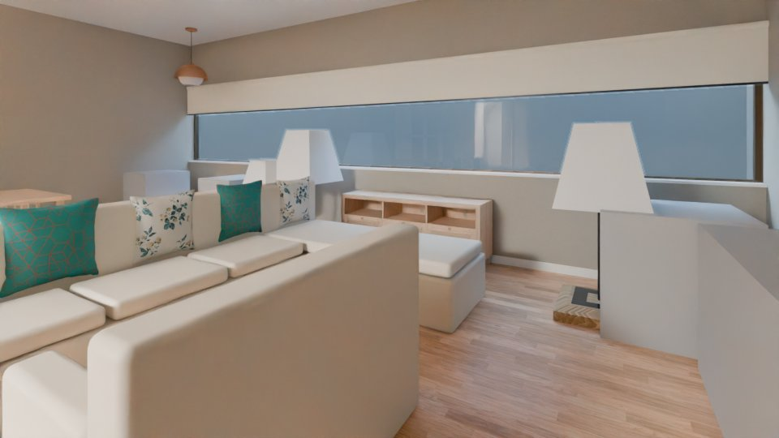 |  |
| 1 | cam_r_L-1_salon_2 |  |  |
| 1 | cam_r_L-1_salon_3 |  |  |
| 1 | cam_r_L-1_salon_1 |  |  |
| 1 | cam_r_L-1_salon_2 |  |  |
| 1 | cam_r_L-1_salon_3 |  |  |
| 1 | cam_r_L0_e_yatak_odasi_1 | 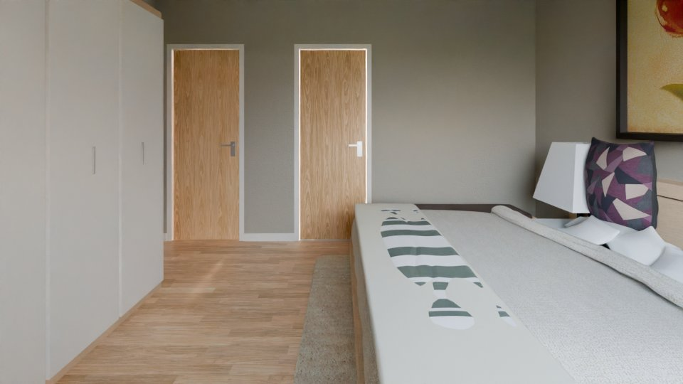 | 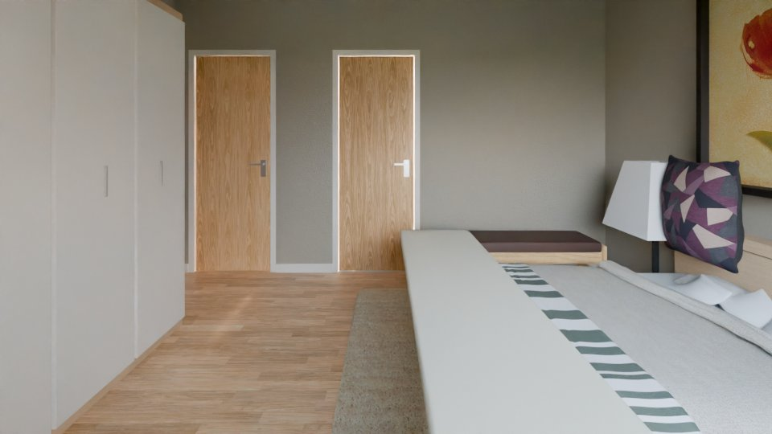 |
| 1 | cam_r_L0_e_yatak_odasi_2 |  |  |
| 1 | cam_r_L0_e_yatak_odasi_3 | 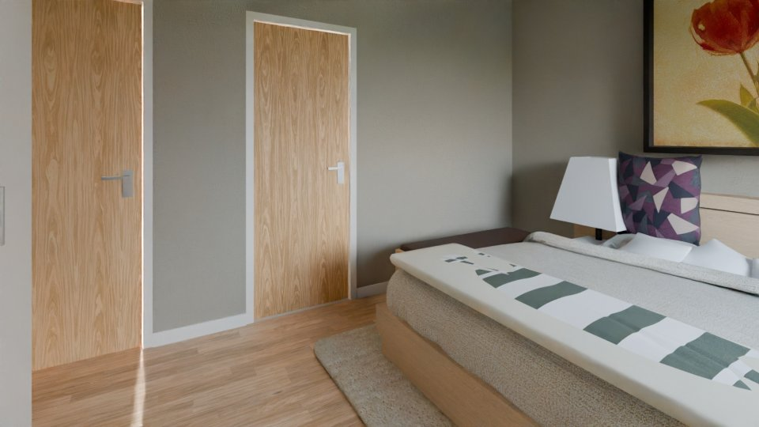 |  |
| 2 | cam_r_L-1_mutfak_1 |  |  |
| 2 | cam_r_L-1_mutfak_2 |  |  |
| 2 | cam_r_L-1_mutfak_3 |  |  |
| 2 | cam_r_L1_oyun_aktivite_ve_dinlenme_odasi_1 | 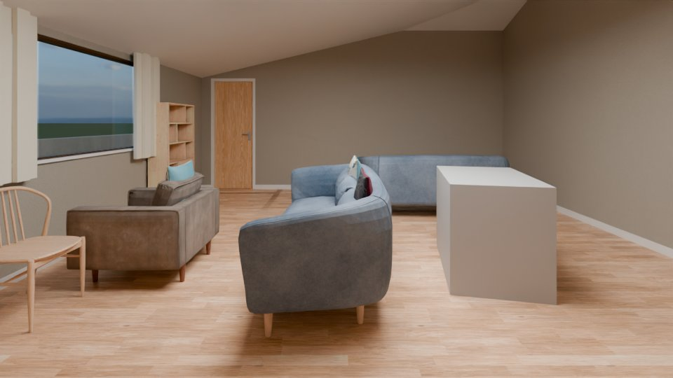 |  |
| 2 | cam_r_L1_oyun_aktivite_ve_dinlenme_odasi_2 |  |  |
| 2 | cam_r_L1_oyun_aktivite_ve_dinlenme_odasi_3 |  | 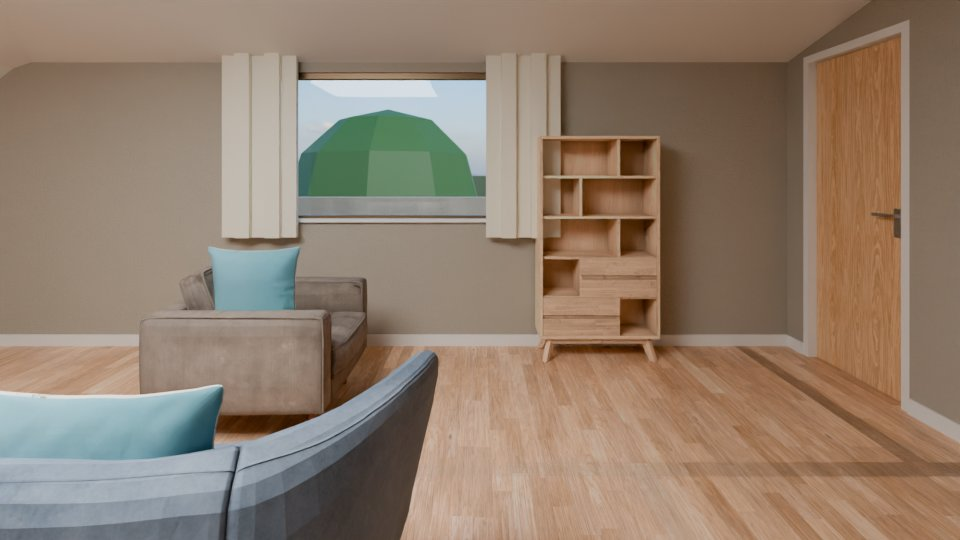 |
| 1 | cam_r_L-1_salon_1 |  |  |
| 1 | cam_r_L-1_salon_2 |  |  |
| 1 | cam_r_L-1_salon_3 |  |  |
| 1 | cam_r_L0_yatak_odasi_3_1 |  | 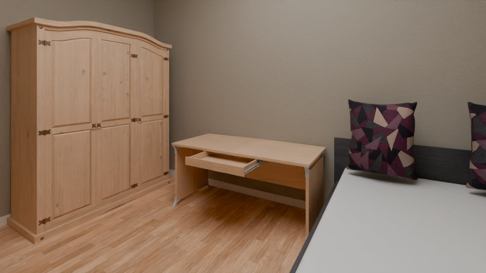 |
| 1 | cam_r_L0_yatak_odasi_3_2 |  |  |
| 1 | cam_r_L0_yatak_odasi_3_3 | 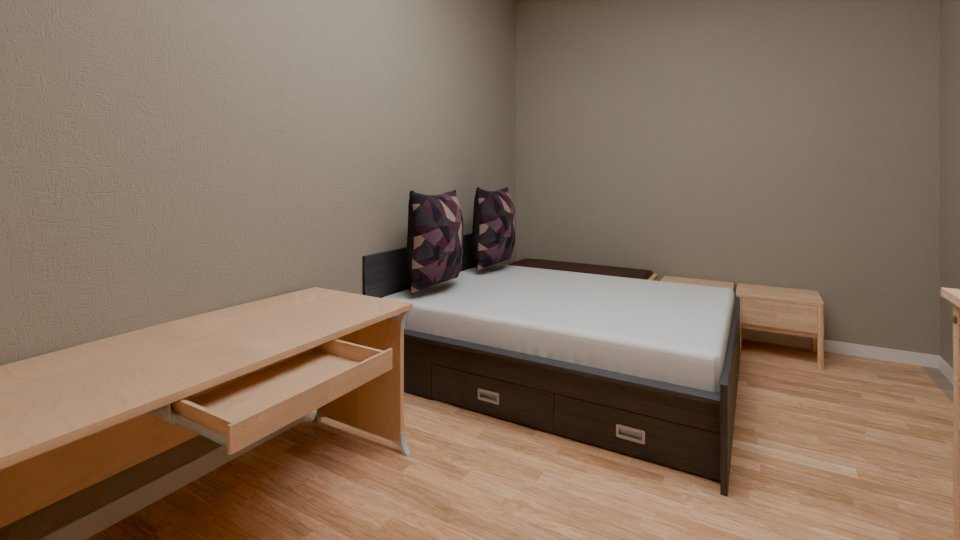 |  |
| 1 | cam_r_L1_oyun_aktivite_ve_dinlenme_odasi_1 |  |  |
| 1 | cam_r_L1_oyun_aktivite_ve_dinlenme_odasi_2 | 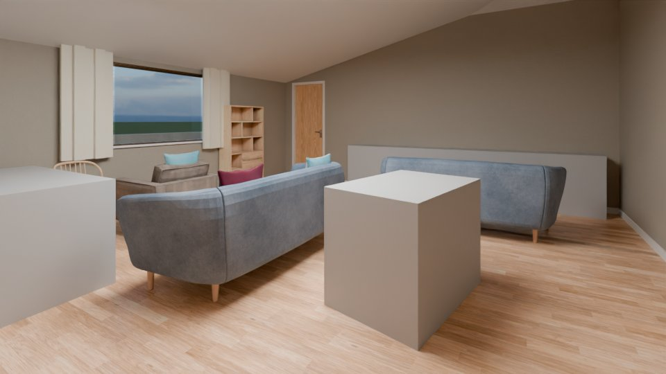 |  |
| 1 | cam_r_L1_oyun_aktivite_ve_dinlenme_odasi_3 |  | 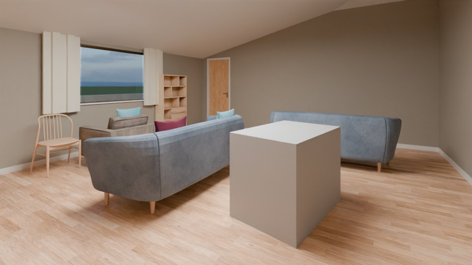 |
| 2 | cam_r_L-1_salon_1 |  |  |
| 2 | cam_r_L-1_salon_2 | 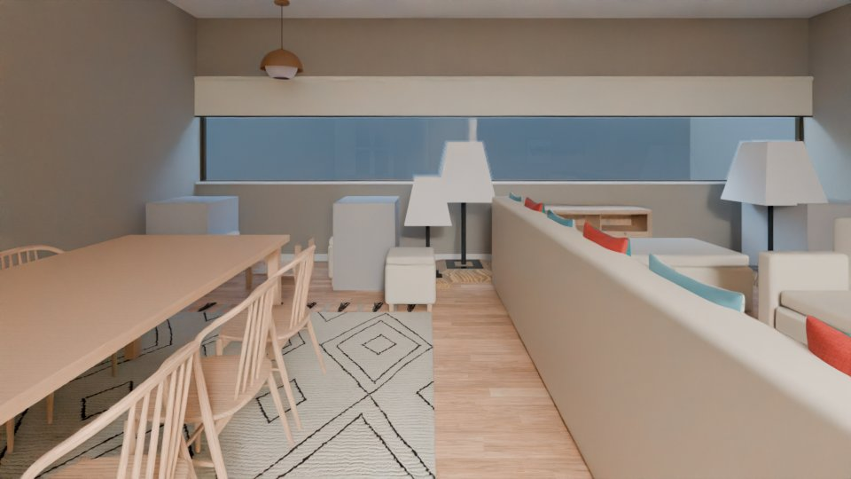 |  |
| 2 | cam_r_L-1_salon_3 |  |  |
| 2 | cam_r_L1_banyo_1 |  | 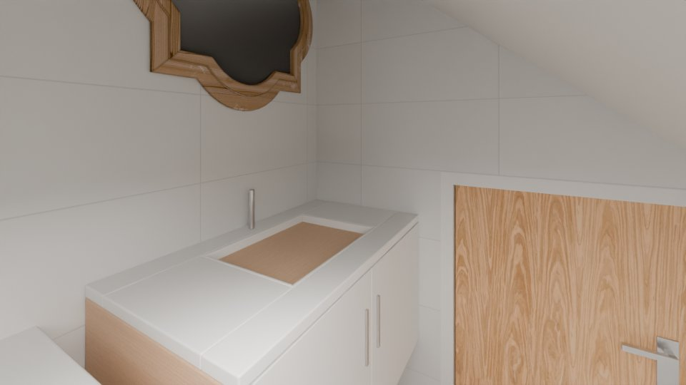 |
| 2 | cam_r_L1_oyun_aktivite_ve_dinlenme_odasi_1 |  |  |
| 2 | cam_r_L1_oyun_aktivite_ve_dinlenme_odasi_2 |  |  |
| 2 | cam_r_L1_oyun_aktivite_ve_dinlenme_odasi_3 |  |  |
| 1 | cam_r_L-1_mutfak_1 | 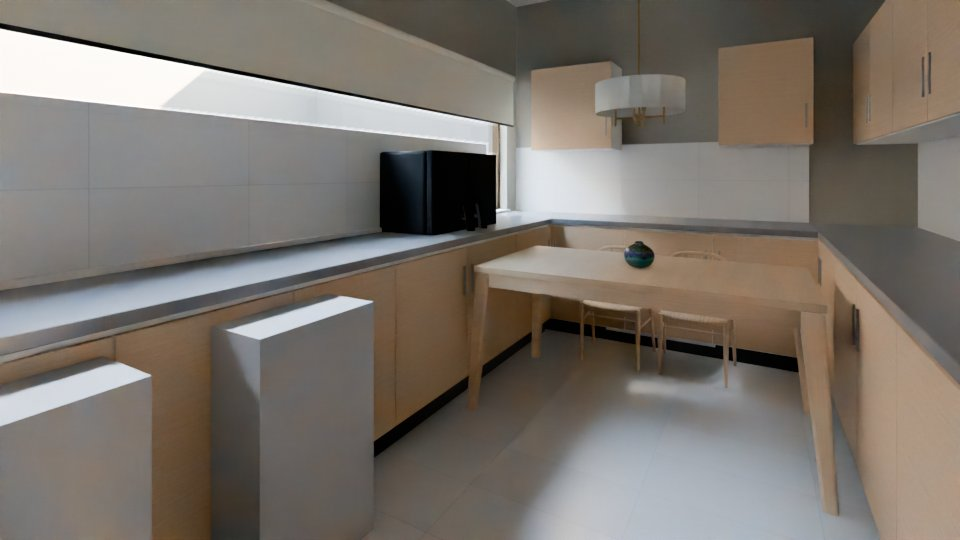 | 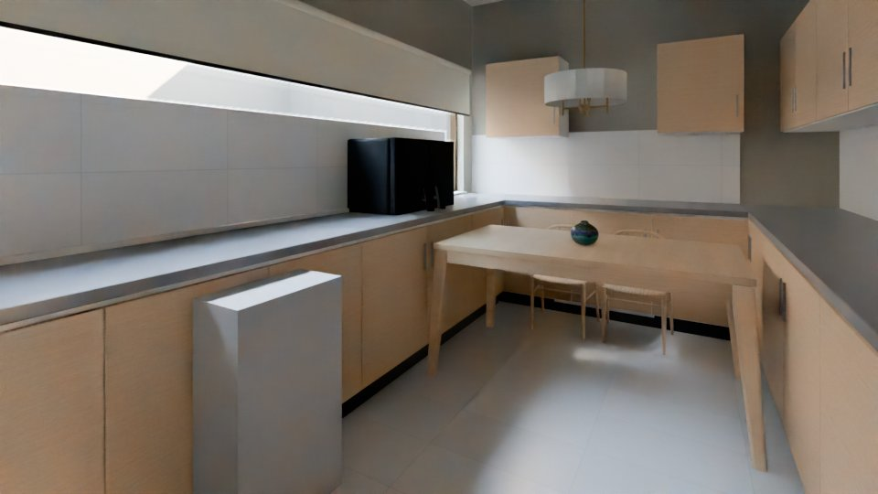 |
| 1 | cam_r_L-1_mutfak_2 | 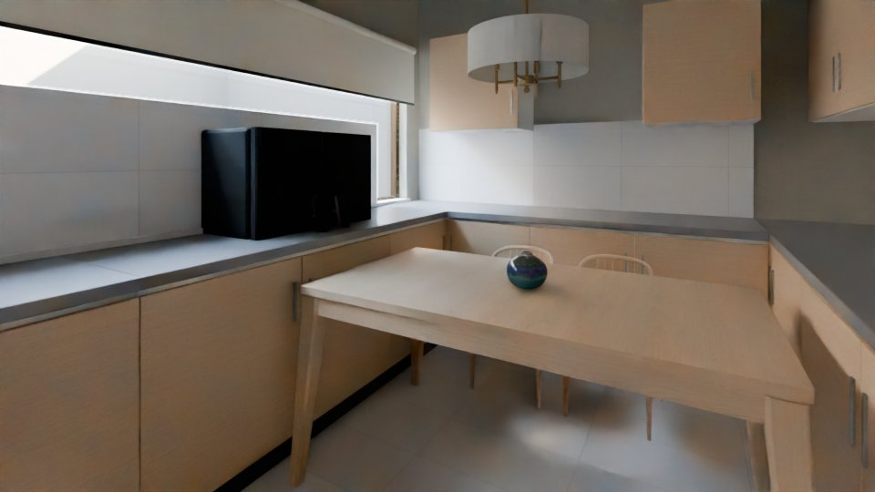 | 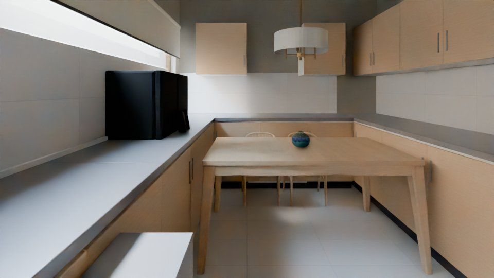 |
| 1 | cam_r_L-1_mutfak_3 | 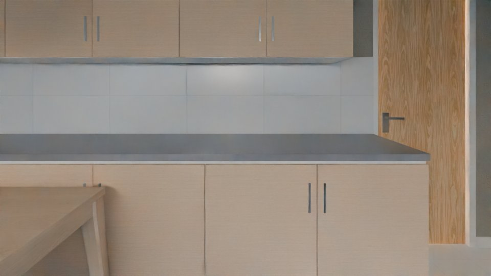 |  |
| 2 | cam_r_L-1_salon_1 |  |  |
| 2 | cam_r_L-1_salon_2 |  |  |
| 2 | cam_r_L-1_salon_3 |  |  |
| 4 | cam_r_L-1_salon_1 |  |  |
| 4 | cam_r_L-1_salon_2 |  |  |
| 4 | cam_r_L-1_salon_3 |  | 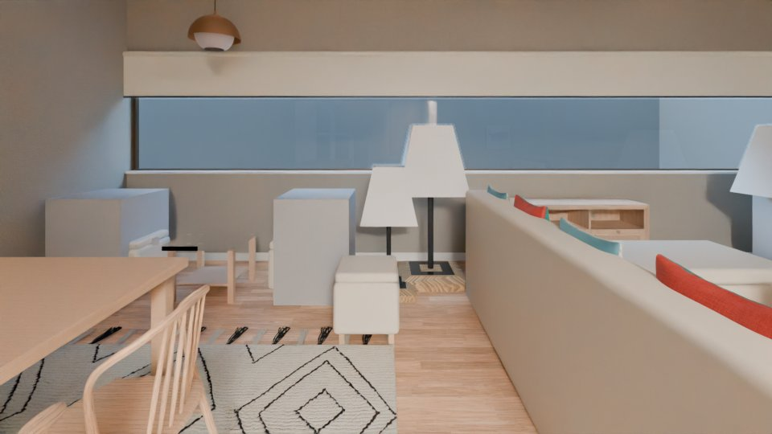 |

### Old pipeline vs orchestrator

Not made yet: the images of both runs come from the pods (`orchestrator/compare.json`).

## Warnings

- final/cam_r_L0_oda_1_final_preview.jpg is from an earlier run (not part of this report)
- final/cam_r_L0_oda_2_1_final_preview.jpg is from an earlier run (not part of this report)
- final/cam_r_L0_oda_2_2_final_preview.jpg is from an earlier run (not part of this report)
- final/cam_r_L0_oda_2_final_preview.jpg is from an earlier run (not part of this report)
- final/cam_r_L1_banyo_2_final_preview.jpg is from an earlier run (not part of this report)
- final/cam_r_L1_koridor_2_1_final_preview.jpg is from an earlier run (not part of this report)
- final/cam_r_L1_koridor_2_2_final_preview.jpg is from an earlier run (not part of this report)
- final/cam_r_L1_koridor_2_3_final_preview.jpg is from an earlier run (not part of this report)
- final/cam_r_L0_oda_1_plan.jpg is from an earlier run (not part of this report)
- final/cam_r_L0_oda_2_1_plan.jpg is from an earlier run (not part of this report)
- final/cam_r_L0_oda_2_2_plan.jpg is from an earlier run (not part of this report)
- final/cam_r_L0_oda_2_plan.jpg is from an earlier run (not part of this report)
- final/cam_r_L1_banyo_2_plan.jpg is from an earlier run (not part of this report)
- final/cam_r_L1_koridor_2_1_plan.jpg is from an earlier run (not part of this report)
- final/cam_r_L1_koridor_2_2_plan.jpg is from an earlier run (not part of this report)
- final/cam_r_L1_koridor_2_3_plan.jpg is from an earlier run (not part of this report)
- final/contact_sbs_r_L0_oda.jpg is from an earlier run (not part of this report)
- final/contact_sbs_r_L0_oda_2.jpg is from an earlier run (not part of this report)
- final/contact_sbs_r_L1_koridor_2.jpg is from an earlier run (not part of this report)
