# Final report: real03

83 views: 0 polished, 83 Cycles (not_run 83). Stages: render run, gate validation not_run, polish not_run, vision check single_pass (calibration run). A polished image is final only when the gate accepted it and the vision check checked it without finding a lost or added element (§5.5). Mismatches are listed with their evidence and never auto-fixed.

## Summary

| item | value |
|---|---|
| views | 83 |
| interior / exterior views | 83 / 0 |
| variant | base |
| polished | 0 |
| Cycles | 83 (not_run 83) |
| confirmed mismatches on the final image | 0 in 0 view(s) |
| JSON cross-check findings (Cycles render) | 2 |
| needs_review views | 2 |
| unverified pieces in view (sum over views) | 115 |
| rooms mixing polished and Cycles | 0 |
| advisory | yes |
| advisory flags | 17 |
| exposure | -0.83 .. +8.00 EV (8 at a limit), modes auto |
| window pull | 69 view(s), -3 .. 0 EV |
| camera policy | search 83 |
| camera score (min / mean / max) | 0.21 / 2.54 / 4.42 |
| rooms by number of views | 19 with 0, 8 with 1, 9 with 2, 19 with 3 |
| gate validation | not recorded |
| seconds: build / render / metering | 3.8 min / 6.4 min / 104.7 s |
| seconds: polish / gate / check | - / - / 21.6 min |
| brief polish | yes (default, not in brief.yaml) |
| unit system | metric |
| side-by-side sheets | 0 |

## 3D files

Open in Blender: the `.blend` directly (textures packed, cameras with their metered exposure in the custom property `wenart_exposure_ev`, render settings as these images); the `.glb` with File > Import > glTF 2.0 (also other 3D tools). In the results: `final/<project>/3d/`.

| file | size |
|---|---|
| [real03.blend](3d/real03.blend) | 416.8 MB |
| [real03.glb](3d/real03.glb) | 1177.1 MB |

83 cameras; textures scaled to at most 1024 px (196 scaled) for the download.

## AI decor

102 decor items chosen by the AI (Qwen/Qwen3-VL-8B-Instruct; both passes agreeing) in 22 rooms; 6 items by the rules. The decor stage places decor only: it moves, adds and removes no furniture (the AI completion of furnished rooms has its own section, `AI completion of furnished rooms`; `furniture/<project>/decor_report.md` has every room).

- r_L0_yasama: rules (no slot for AI decor)
- r_L0_ebeveyn_odasi_4: rules (no slot for AI decor)

## Advisory flags and open items

- polish not run (every view is the Cycles render)
- vision check single pass: every result unverified (advisory)
- vision check advisory: single pass: no two-model agreement; fa_missing None misses <= 0.05 (single pass); fa_extra None misses <= 0.1 (single pass); removal_flagged None misses >= 0.8 (single pass); removal_confirmed None misses >= 0.6 (single pass); insertion None misses >= 0.6 (single pass)
- check target missed: fa_missing - (needs <= 0.05), single pass
- check target missed: fa_extra - (needs <= 0.1), single pass
- check target missed: removal_flagged - (needs >= 0.8), single pass
- check target missed: removal_confirmed - (needs >= 0.6), single pass
- check target missed: insertion - (needs >= 0.6), single pass
- camera cam_r_L0_banyo_1: no free camera point in the room; room's inner point inside a tall proxy, camera at the nearest point clear of tall proxies
- camera cam_r_L0_banyo_2_1: no free camera point in the room; room's inner point inside a tall proxy, camera at the nearest point clear of tall proxies
- camera cam_r_L0_banyo_7_1: no free camera point in the room; room's inner point inside a tall proxy, camera at the nearest point clear of tall proxies
- camera cam_r_L0_oda_10_1: no free camera point in the room; camera at the room's inner point
- camera cam_r_L0_oda_7_1: no free camera point in the room; camera at the room's inner point
- 47 drawn piece(s) not typed: the two AI passes disagree or did not answer (unknown, unverified; footprint kept): f_L0_073, f_L0_074, f_L0_077, f_L0_079, f_L0_080, f_L0_081, f_L0_083, f_L0_084
- 4 drawn piece(s) without an AI answer (not asked, or the answers were not applied; unknown, unverified; footprint kept): f_L0_022, f_L0_023, f_L0_024, f_L0_025
- drawn-piece check: 2 piece(s) moved beyond the tolerance, 0 locked-rule violation(s)
- AI completion: 83 proposal(s) refused, reverted or not placed (listed per room)

## Gate validation

Not recorded: the gate calibration and validation did not run.

## Contact sheets

Tiles: camera, `P` polished / `C` Cycles, `U<n>` unverified pieces in view.

Level L0: [contact_L0.jpg](contact_L0.jpg)

## Side-by-side sheets (Cycles | polished)

None: the polish did not run in this run.

## Views

| view | room | level | final | reason | polish attempt | gate | check Cycles | check polished | preference | EV | pull EV | camera | ids D/A/R | U | review | files |
|---|---|---|---|---|---|---|---|---|---|---|---|---|---|---|---|---|
| cam_r_L0_banyo_1 | r_L0_banyo | L0 | cycles | not_run | - | - | info | - | - | -0.50 | - | search 0.55 | - | 0 | yes | [preview](cam_r_L0_banyo_1_final_preview.jpg) [plan](cam_r_L0_banyo_1_plan.jpg) |
| cam_r_L0_banyo_2_1 | r_L0_banyo_2 | L0 | cycles | not_run | - | - | info | - | - | -0.50 | - | search 0.55 | - | 0 | yes | [preview](cam_r_L0_banyo_2_1_final_preview.jpg) [plan](cam_r_L0_banyo_2_1_plan.jpg) |
| cam_r_L0_banyo_3_1 | r_L0_banyo_3 | L0 | cycles | not_run | - | - | info | - | - | -0.17 | - | search 1.91 | D4 | 1 | no | [preview](cam_r_L0_banyo_3_1_final_preview.jpg) [plan](cam_r_L0_banyo_3_1_plan.jpg) |
| cam_r_L0_banyo_4_1 | r_L0_banyo_4 | L0 | cycles | not_run | - | - | info | - | - | -0.50 | - | search 2.43 | D4 | 1 | no | [preview](cam_r_L0_banyo_4_1_final_preview.jpg) [plan](cam_r_L0_banyo_4_1_plan.jpg) |
| cam_r_L0_banyo_4_2 | r_L0_banyo_4 | L0 | cycles | not_run | - | - | info | - | - | -0.50 | - | search 2.11 | D3 | 0 | no | [preview](cam_r_L0_banyo_4_2_final_preview.jpg) [plan](cam_r_L0_banyo_4_2_plan.jpg) |
| cam_r_L0_banyo_5_1 | r_L0_banyo_5 | L0 | cycles | not_run | - | - | info | - | - | -0.17 | - | search 1.87 | D3 | 1 | no | [preview](cam_r_L0_banyo_5_1_final_preview.jpg) [plan](cam_r_L0_banyo_5_1_plan.jpg) |
| cam_r_L0_banyo_5_2 | r_L0_banyo_5 | L0 | cycles | not_run | - | - | info | - | - | -0.33 | - | search 1.64 | D2 | 1 | no | [preview](cam_r_L0_banyo_5_2_final_preview.jpg) [plan](cam_r_L0_banyo_5_2_plan.jpg) |
| cam_r_L0_banyo_6_1 | r_L0_banyo_6 | L0 | cycles | not_run | - | - | info | - | - | -0.67 | - | search 1.08 | D2 | 0 | no | [preview](cam_r_L0_banyo_6_1_final_preview.jpg) [plan](cam_r_L0_banyo_6_1_plan.jpg) |
| cam_r_L0_banyo_6_2 | r_L0_banyo_6 | L0 | cycles | not_run | - | - | info | - | - | -0.83 | 0 | search 0.59 | D2 | 0 | no | [preview](cam_r_L0_banyo_6_2_final_preview.jpg) [plan](cam_r_L0_banyo_6_2_plan.jpg) |
| cam_r_L0_banyo_7_1 | r_L0_banyo_7 | L0 | cycles | not_run | - | - | info | - | - | -0.67 | - | search 0.68 | D1 | 0 | no | [preview](cam_r_L0_banyo_7_1_final_preview.jpg) [plan](cam_r_L0_banyo_7_1_plan.jpg) |
| cam_r_L0_banyo_8_1 | r_L0_banyo_8 | L0 | cycles | not_run | - | - | info | - | - | -0.67 | - | search 1.28 | D2 | 0 | no | [preview](cam_r_L0_banyo_8_1_final_preview.jpg) [plan](cam_r_L0_banyo_8_1_plan.jpg) |
| cam_r_L0_ebeveyn_odasi_1 | r_L0_ebeveyn_odasi | L0 | cycles | not_run | - | - | info | - | - | +4.50 | -1 | search 3.34 | D4 A2 | 1 | no | [preview](cam_r_L0_ebeveyn_odasi_1_final_preview.jpg) [plan](cam_r_L0_ebeveyn_odasi_1_plan.jpg) |
| cam_r_L0_ebeveyn_odasi_2 | r_L0_ebeveyn_odasi | L0 | cycles | not_run | - | - | info | - | - | +4.50 | -1 | search 1.78 | D3 A1 | 1 | no | [preview](cam_r_L0_ebeveyn_odasi_2_final_preview.jpg) [plan](cam_r_L0_ebeveyn_odasi_2_plan.jpg) |
| cam_r_L0_ebeveyn_odasi_2_1 | r_L0_ebeveyn_odasi_2 | L0 | cycles | not_run | - | - | info | - | - | +4.50 | 0 | search 3.04 | D5 | 2 | no | [preview](cam_r_L0_ebeveyn_odasi_2_1_final_preview.jpg) [plan](cam_r_L0_ebeveyn_odasi_2_1_plan.jpg) |
| cam_r_L0_ebeveyn_odasi_2_2 | r_L0_ebeveyn_odasi_2 | L0 | cycles | not_run | - | - | info | - | - | +4.50 | 0 | search 2.97 | D5 | 2 | no | [preview](cam_r_L0_ebeveyn_odasi_2_2_final_preview.jpg) [plan](cam_r_L0_ebeveyn_odasi_2_2_plan.jpg) |
| cam_r_L0_ebeveyn_odasi_2_3 | r_L0_ebeveyn_odasi_2 | L0 | cycles | not_run | - | - | info | - | - | +4.50 | 0 | search 2.95 | D5 A1 | 1 | no | [preview](cam_r_L0_ebeveyn_odasi_2_3_final_preview.jpg) [plan](cam_r_L0_ebeveyn_odasi_2_3_plan.jpg) |
| cam_r_L0_ebeveyn_odasi_3_1 | r_L0_ebeveyn_odasi_3 | L0 | cycles | not_run | - | - | info | - | - | +4.83 | -1 | search 3.62 | D4 A2 | 1 | no | [preview](cam_r_L0_ebeveyn_odasi_3_1_final_preview.jpg) [plan](cam_r_L0_ebeveyn_odasi_3_1_plan.jpg) |
| cam_r_L0_ebeveyn_odasi_3_2 | r_L0_ebeveyn_odasi_3 | L0 | cycles | not_run | - | - | info | - | - | +4.17 | 0 | search 1.89 | D4 A1 | 1 | no | [preview](cam_r_L0_ebeveyn_odasi_3_2_final_preview.jpg) [plan](cam_r_L0_ebeveyn_odasi_3_2_plan.jpg) |
| cam_r_L0_ebeveyn_odasi_4_1 | r_L0_ebeveyn_odasi_4 | L0 | cycles | not_run | - | - | info | - | - | +8.00 (limit) | 0 | search 2.91 | D3 A1 | 0 | no | [preview](cam_r_L0_ebeveyn_odasi_4_1_final_preview.jpg) [plan](cam_r_L0_ebeveyn_odasi_4_1_plan.jpg) |
| cam_r_L0_ebeveyn_odasi_4_2 | r_L0_ebeveyn_odasi_4 | L0 | cycles | not_run | - | - | info | - | - | +8.00 (limit) | - | search 2.88 | D4 A1 | 0 | no | [preview](cam_r_L0_ebeveyn_odasi_4_2_final_preview.jpg) [plan](cam_r_L0_ebeveyn_odasi_4_2_plan.jpg) |
| cam_r_L0_ebeveyn_odasi_4_3 | r_L0_ebeveyn_odasi_4 | L0 | cycles | not_run | - | - | info | - | - | +8.00 (limit) | 0 | search 2.86 | D3 A1 | 0 | no | [preview](cam_r_L0_ebeveyn_odasi_4_3_final_preview.jpg) [plan](cam_r_L0_ebeveyn_odasi_4_3_plan.jpg) |
| cam_r_L0_ebeveyn_odasi_5_1 | r_L0_ebeveyn_odasi_5 | L0 | cycles | not_run | - | - | info | - | - | +5.67 | -2 | search 3.46 | D4 A2 | 1 | no | [preview](cam_r_L0_ebeveyn_odasi_5_1_final_preview.jpg) [plan](cam_r_L0_ebeveyn_odasi_5_1_plan.jpg) |
| cam_r_L0_ebeveyn_odasi_5_2 | r_L0_ebeveyn_odasi_5 | L0 | cycles | not_run | - | - | info | - | - | +5.50 | -2 | search 3.40 | D4 A2 | 1 | no | [preview](cam_r_L0_ebeveyn_odasi_5_2_final_preview.jpg) [plan](cam_r_L0_ebeveyn_odasi_5_2_plan.jpg) |
| cam_r_L0_ebeveyn_odasi_5_3 | r_L0_ebeveyn_odasi_5 | L0 | cycles | not_run | - | - | info | - | - | +5.50 | -1 | search 2.21 | D4 A1 | 1 | no | [preview](cam_r_L0_ebeveyn_odasi_5_3_final_preview.jpg) [plan](cam_r_L0_ebeveyn_odasi_5_3_plan.jpg) |
| cam_r_L0_ebeveyn_odasi_6_1 | r_L0_ebeveyn_odasi_6 | L0 | cycles | not_run | - | - | info | - | - | +5.83 | -2 | search 3.16 | D4 A2 | 1 | no | [preview](cam_r_L0_ebeveyn_odasi_6_1_final_preview.jpg) [plan](cam_r_L0_ebeveyn_odasi_6_1_plan.jpg) |
| cam_r_L0_ebeveyn_odasi_6_2 | r_L0_ebeveyn_odasi_6 | L0 | cycles | not_run | - | - | info | - | - | +6.00 | 0 | search 1.68 | D4 A1 | 1 | no | [preview](cam_r_L0_ebeveyn_odasi_6_2_final_preview.jpg) [plan](cam_r_L0_ebeveyn_odasi_6_2_plan.jpg) |
| cam_r_L0_ebeveyn_odasi_m_k_a_1 | r_L0_ebeveyn_odasi_m_k_a | L0 | cycles | not_run | - | - | info | - | - | +4.83 | -1 | search 2.84 | D5 A4 | 0 | no | [preview](cam_r_L0_ebeveyn_odasi_m_k_a_1_final_preview.jpg) [plan](cam_r_L0_ebeveyn_odasi_m_k_a_1_plan.jpg) |
| cam_r_L0_ebeveyn_odasi_m_k_a_2 | r_L0_ebeveyn_odasi_m_k_a | L0 | cycles | not_run | - | - | info | - | - | +5.00 | -1 | search 2.66 | D4 A3 | 0 | no | [preview](cam_r_L0_ebeveyn_odasi_m_k_a_2_final_preview.jpg) [plan](cam_r_L0_ebeveyn_odasi_m_k_a_2_plan.jpg) |
| cam_r_L0_ebeveyn_odasi_m_k_a_2_1 | r_L0_ebeveyn_odasi_m_k_a_2 | L0 | cycles | not_run | - | - | info | - | - | +5.00 | -2 | search 3.02 | D5 A2 | 0 | no | [preview](cam_r_L0_ebeveyn_odasi_m_k_a_2_1_final_preview.jpg) [plan](cam_r_L0_ebeveyn_odasi_m_k_a_2_1_plan.jpg) |
| cam_r_L0_ebeveyn_odasi_m_k_a_2_2 | r_L0_ebeveyn_odasi_m_k_a_2 | L0 | cycles | not_run | - | - | info | - | - | +5.33 | -2 | search 2.80 | D4 A2 | 0 | no | [preview](cam_r_L0_ebeveyn_odasi_m_k_a_2_2_final_preview.jpg) [plan](cam_r_L0_ebeveyn_odasi_m_k_a_2_2_plan.jpg) |
| cam_r_L0_ebeveyn_odasi_m_k_a_2_3 | r_L0_ebeveyn_odasi_m_k_a_2 | L0 | cycles | not_run | - | - | info | - | - | +5.00 | -1 | search 2.37 | D5 | 1 | no | [preview](cam_r_L0_ebeveyn_odasi_m_k_a_2_3_final_preview.jpg) [plan](cam_r_L0_ebeveyn_odasi_m_k_a_2_3_plan.jpg) |
| cam_r_L0_ebeveyn_odasi_m_k_a_3 | r_L0_ebeveyn_odasi_m_k_a | L0 | cycles | not_run | - | - | info | - | - | +5.17 | -1 | search 2.01 | D5 | 1 | no | [preview](cam_r_L0_ebeveyn_odasi_m_k_a_3_final_preview.jpg) [plan](cam_r_L0_ebeveyn_odasi_m_k_a_3_plan.jpg) |
| cam_r_L0_giris_holu_1 | r_L0_giris_holu | L0 | cycles | not_run | - | - | info | - | - | +7.83 | -3 | search 1.81 | D4 | 0 | no | [preview](cam_r_L0_giris_holu_1_final_preview.jpg) [plan](cam_r_L0_giris_holu_1_plan.jpg) |
| cam_r_L0_giris_holu_2 | r_L0_giris_holu | L0 | cycles | not_run | - | - | info | - | - | +8.00 (limit) | -3 | search 1.41 | D2 | 0 | no | [preview](cam_r_L0_giris_holu_2_final_preview.jpg) [plan](cam_r_L0_giris_holu_2_plan.jpg) |
| cam_r_L0_giris_holu_2_1 | r_L0_giris_holu_2 | L0 | cycles | not_run | - | - | info | - | - | +8.00 (limit) | -3 | search 1.85 | D3 | 0 | no | [preview](cam_r_L0_giris_holu_2_1_final_preview.jpg) [plan](cam_r_L0_giris_holu_2_1_plan.jpg) |
| cam_r_L0_giris_holu_2_2 | r_L0_giris_holu_2 | L0 | cycles | not_run | - | - | info | - | - | +8.00 | - | search 0.99 | D2 | 0 | no | [preview](cam_r_L0_giris_holu_2_2_final_preview.jpg) [plan](cam_r_L0_giris_holu_2_2_plan.jpg) |
| cam_r_L0_giris_holu_3_1 | r_L0_giris_holu_3 | L0 | cycles | not_run | - | - | info | - | - | +8.00 (limit) | -2 | search 0.44 | D4 A1 | 1 | no | [preview](cam_r_L0_giris_holu_3_1_final_preview.jpg) [plan](cam_r_L0_giris_holu_3_1_plan.jpg) |
| cam_r_L0_giris_holu_4_1 | r_L0_giris_holu_4 | L0 | cycles | not_run | - | - | info | - | - | +8.00 (limit) | -2 | search 1.92 | D5 A1 | 1 | no | [preview](cam_r_L0_giris_holu_4_1_final_preview.jpg) [plan](cam_r_L0_giris_holu_4_1_plan.jpg) |
| cam_r_L0_giris_holu_4_2 | r_L0_giris_holu_4 | L0 | cycles | not_run | - | - | info | - | - | +8.00 (limit) | -3 | search 1.64 | D3 A1 | 1 | no | [preview](cam_r_L0_giris_holu_4_2_final_preview.jpg) [plan](cam_r_L0_giris_holu_4_2_plan.jpg) |
| cam_r_L0_kat_holu_1 | r_L0_kat_holu | L0 | cycles | not_run | - | - | info | - | - | -0.33 | 0 | search 2.16 | D6 | 3 | no | [preview](cam_r_L0_kat_holu_1_final_preview.jpg) [plan](cam_r_L0_kat_holu_1_plan.jpg) |
| cam_r_L0_kat_holu_2 | r_L0_kat_holu | L0 | cycles | not_run | - | - | info | - | - | -0.33 | 0 | search 2.10 | D7 | 2 | no | [preview](cam_r_L0_kat_holu_2_final_preview.jpg) [plan](cam_r_L0_kat_holu_2_plan.jpg) |
| cam_r_L0_kat_holu_3 | r_L0_kat_holu | L0 | cycles | not_run | - | - | info | - | - | -0.17 | 0 | search 2.08 | D7 | 2 | no | [preview](cam_r_L0_kat_holu_3_final_preview.jpg) [plan](cam_r_L0_kat_holu_3_plan.jpg) |
| cam_r_L0_kat_merdiveni_1 | r_L0_kat_merdiveni | L0 | cycles | not_run | - | - | info | - | - | -0.67 | 0 | search 3.98 | D4 | 2 | no | [preview](cam_r_L0_kat_merdiveni_1_final_preview.jpg) [plan](cam_r_L0_kat_merdiveni_1_plan.jpg) |
| cam_r_L0_kat_merdiveni_2 | r_L0_kat_merdiveni | L0 | cycles | not_run | - | - | info | - | - | -0.17 | 0 | search 3.70 | D2 | 1 | no | [preview](cam_r_L0_kat_merdiveni_2_final_preview.jpg) [plan](cam_r_L0_kat_merdiveni_2_plan.jpg) |
| cam_r_L0_kat_merdiveni_3 | r_L0_kat_merdiveni | L0 | cycles | not_run | - | - | info | - | - | -0.50 | 0 | search 3.29 | D2 | 1 | no | [preview](cam_r_L0_kat_merdiveni_3_final_preview.jpg) [plan](cam_r_L0_kat_merdiveni_3_plan.jpg) |
| cam_r_L0_oda_01_1 | r_L0_oda_01 | L0 | cycles | not_run | - | - | info | - | - | +4.33 | - | search 3.24 | D3 A1 | 1 | no | [preview](cam_r_L0_oda_01_1_final_preview.jpg) [plan](cam_r_L0_oda_01_1_plan.jpg) |
| cam_r_L0_oda_01_2 | r_L0_oda_01 | L0 | cycles | not_run | - | - | info | - | - | +4.67 | 0 | search 3.19 | D3 A3 | 1 | no | [preview](cam_r_L0_oda_01_2_final_preview.jpg) [plan](cam_r_L0_oda_01_2_plan.jpg) |
| cam_r_L0_oda_01_3 | r_L0_oda_01 | L0 | cycles | not_run | - | - | info | - | - | +5.00 | -2 | search 3.02 | D4 A2 | 1 | no | [preview](cam_r_L0_oda_01_3_final_preview.jpg) [plan](cam_r_L0_oda_01_3_plan.jpg) |
| cam_r_L0_oda_10_1 | r_L0_oda_10 | L0 | cycles | not_run | - | - | info | - | - | +0.00 | 0 | search 0.22 | D2 A1 | 2 | no | [preview](cam_r_L0_oda_10_1_final_preview.jpg) [plan](cam_r_L0_oda_10_1_plan.jpg) |
| cam_r_L0_oda_19_1 | r_L0_oda_19 | L0 | cycles | not_run | - | - | info | - | - | -0.67 | 0 | search 2.93 | D4 | 0 | no | [preview](cam_r_L0_oda_19_1_final_preview.jpg) [plan](cam_r_L0_oda_19_1_plan.jpg) |
| cam_r_L0_oda_19_2 | r_L0_oda_19 | L0 | cycles | not_run | - | - | info | - | - | -0.67 | 0 | search 2.93 | D4 | 1 | no | [preview](cam_r_L0_oda_19_2_final_preview.jpg) [plan](cam_r_L0_oda_19_2_plan.jpg) |
| cam_r_L0_oda_19_3 | r_L0_oda_19 | L0 | cycles | not_run | - | - | info | - | - | -0.67 | 0 | search 2.89 | D3 | 0 | no | [preview](cam_r_L0_oda_19_3_final_preview.jpg) [plan](cam_r_L0_oda_19_3_plan.jpg) |
| cam_r_L0_oda_7_1 | r_L0_oda_7 | L0 | cycles | not_run | - | - | info | - | - | +0.17 | 0 | search 0.21 | D6 | 4 | no | [preview](cam_r_L0_oda_7_1_final_preview.jpg) [plan](cam_r_L0_oda_7_1_plan.jpg) |
| cam_r_L0_ruzgarlik_1 | r_L0_ruzgarlik | L0 | cycles | not_run | - | - | info | - | - | +4.50 | -1 | search 3.88 | D6 A1 | 2 | no | [preview](cam_r_L0_ruzgarlik_1_final_preview.jpg) [plan](cam_r_L0_ruzgarlik_1_plan.jpg) |
| cam_r_L0_ruzgarlik_2 | r_L0_ruzgarlik | L0 | cycles | not_run | - | - | info | - | - | +4.67 | -1 | search 3.39 | D6 A1 | 2 | no | [preview](cam_r_L0_ruzgarlik_2_final_preview.jpg) [plan](cam_r_L0_ruzgarlik_2_plan.jpg) |
| cam_r_L0_ruzgarlik_3 | r_L0_ruzgarlik | L0 | cycles | not_run | - | - | info | - | - | +4.67 | - | search 3.23 | D5 | 2 | no | [preview](cam_r_L0_ruzgarlik_3_final_preview.jpg) [plan](cam_r_L0_ruzgarlik_3_plan.jpg) |
| cam_r_L0_yangin_merdiveni_1 | r_L0_yangin_merdiveni | L0 | cycles | not_run | - | - | info | - | - | -0.67 | 0 | search 3.19 | D3 | 2 | no | [preview](cam_r_L0_yangin_merdiveni_1_final_preview.jpg) [plan](cam_r_L0_yangin_merdiveni_1_plan.jpg) |
| cam_r_L0_yangin_merdiveni_2 | r_L0_yangin_merdiveni | L0 | cycles | not_run | - | - | info | - | - | -0.17 | 0 | search 2.20 | D2 | 1 | no | [preview](cam_r_L0_yangin_merdiveni_2_final_preview.jpg) [plan](cam_r_L0_yangin_merdiveni_2_plan.jpg) |
| cam_r_L0_yangin_merdiveni_3 | r_L0_yangin_merdiveni | L0 | cycles | not_run | - | - | info | - | - | +3.67 | -1 | search 1.78 | D2 | 1 | no | [preview](cam_r_L0_yangin_merdiveni_3_final_preview.jpg) [plan](cam_r_L0_yangin_merdiveni_3_plan.jpg) |
| cam_r_L0_yasama_1 | r_L0_yasama | L0 | cycles | not_run | - | - | info | - | - | +4.00 | 0 | search 3.45 | D4 A4 | 0 | no | [preview](cam_r_L0_yasama_1_final_preview.jpg) [plan](cam_r_L0_yasama_1_plan.jpg) |
| cam_r_L0_yasama_2 | r_L0_yasama | L0 | cycles | not_run | - | - | info | - | - | +3.83 | 0 | search 3.37 | D4 A3 | 0 | no | [preview](cam_r_L0_yasama_2_final_preview.jpg) [plan](cam_r_L0_yasama_2_plan.jpg) |
| cam_r_L0_yasama_2_1 | r_L0_yasama_2 | L0 | cycles | not_run | - | - | info | - | - | +5.33 | -2 | search 3.16 | D7 A1 | 2 | no | [preview](cam_r_L0_yasama_2_1_final_preview.jpg) [plan](cam_r_L0_yasama_2_1_plan.jpg) |
| cam_r_L0_yasama_2_2 | r_L0_yasama_2 | L0 | cycles | not_run | - | - | info | - | - | +5.50 | -2 | search 3.09 | D9 A2 | 2 | no | [preview](cam_r_L0_yasama_2_2_final_preview.jpg) [plan](cam_r_L0_yasama_2_2_plan.jpg) |
| cam_r_L0_yasama_2_3 | r_L0_yasama_2 | L0 | cycles | not_run | - | - | info | - | - | +4.83 | 0 | search 3.07 | D8 A1 | 3 | no | [preview](cam_r_L0_yasama_2_3_final_preview.jpg) [plan](cam_r_L0_yasama_2_3_plan.jpg) |
| cam_r_L0_yasama_3 | r_L0_yasama | L0 | cycles | not_run | - | - | info | - | - | +4.00 | -2 | search 3.26 | D4 A2 | 0 | no | [preview](cam_r_L0_yasama_3_final_preview.jpg) [plan](cam_r_L0_yasama_3_plan.jpg) |
| cam_r_L0_yasama_3_1 | r_L0_yasama_3 | L0 | cycles | not_run | - | - | info | - | - | +4.67 | -2 | search 3.25 | D7 A1 | 3 | no | [preview](cam_r_L0_yasama_3_1_final_preview.jpg) [plan](cam_r_L0_yasama_3_1_plan.jpg) |
| cam_r_L0_yasama_3_2 | r_L0_yasama_3 | L0 | cycles | not_run | - | - | info | - | - | +4.17 | -1 | search 3.24 | D10 A2 | 5 | no | [preview](cam_r_L0_yasama_3_2_final_preview.jpg) [plan](cam_r_L0_yasama_3_2_plan.jpg) |
| cam_r_L0_yasama_3_3 | r_L0_yasama_3 | L0 | cycles | not_run | - | - | info | - | - | +4.33 | -1 | search 3.05 | D9 A3 | 4 | no | [preview](cam_r_L0_yasama_3_3_final_preview.jpg) [plan](cam_r_L0_yasama_3_3_plan.jpg) |
| cam_r_L0_yasama_4_1 | r_L0_yasama_4 | L0 | cycles | not_run | - | - | info | - | - | +3.83 | -1 | search 4.42 | D4 | 1 | no | [preview](cam_r_L0_yasama_4_1_final_preview.jpg) [plan](cam_r_L0_yasama_4_1_plan.jpg) |
| cam_r_L0_yasama_4_2 | r_L0_yasama_4 | L0 | cycles | not_run | - | - | info | - | - | +3.67 | -1 | search 4.08 | D5 | 0 | no | [preview](cam_r_L0_yasama_4_2_final_preview.jpg) [plan](cam_r_L0_yasama_4_2_plan.jpg) |
| cam_r_L0_yasama_4_3 | r_L0_yasama_4 | L0 | cycles | not_run | - | - | info | - | - | +3.83 | -1 | search 4.04 | D4 | 0 | no | [preview](cam_r_L0_yasama_4_3_final_preview.jpg) [plan](cam_r_L0_yasama_4_3_plan.jpg) |
| cam_r_L0_yasama_5_1 | r_L0_yasama_5 | L0 | cycles | not_run | - | - | info | - | - | +3.83 | 0 | search 3.18 | D9 A1 | 6 | no | [preview](cam_r_L0_yasama_5_1_final_preview.jpg) [plan](cam_r_L0_yasama_5_1_plan.jpg) |
| cam_r_L0_yasama_5_2 | r_L0_yasama_5 | L0 | cycles | not_run | - | - | info | - | - | +4.83 | -2 | search 3.08 | D9 A3 | 6 | no | [preview](cam_r_L0_yasama_5_2_final_preview.jpg) [plan](cam_r_L0_yasama_5_2_plan.jpg) |
| cam_r_L0_yasama_5_3 | r_L0_yasama_5 | L0 | cycles | not_run | - | - | info | - | - | +4.67 | -2 | search 2.83 | D8 A2 | 4 | no | [preview](cam_r_L0_yasama_5_3_final_preview.jpg) [plan](cam_r_L0_yasama_5_3_plan.jpg) |
| cam_r_L0_yasama_6_1 | r_L0_yasama_6 | L0 | cycles | not_run | - | - | info | - | - | +5.83 | -2 | search 2.99 | D10 A4 | 5 | no | [preview](cam_r_L0_yasama_6_1_final_preview.jpg) [plan](cam_r_L0_yasama_6_1_plan.jpg) |
| cam_r_L0_yasama_6_2 | r_L0_yasama_6 | L0 | cycles | not_run | - | - | info | - | - | +6.00 | 0 | search 2.91 | D9 A5 | 4 | no | [preview](cam_r_L0_yasama_6_2_final_preview.jpg) [plan](cam_r_L0_yasama_6_2_plan.jpg) |
| cam_r_L0_yasama_6_3 | r_L0_yasama_6 | L0 | cycles | not_run | - | - | info | - | - | +5.50 | -2 | search 2.85 | D7 A1 | 3 | no | [preview](cam_r_L0_yasama_6_3_final_preview.jpg) [plan](cam_r_L0_yasama_6_3_plan.jpg) |
| cam_r_L0_yasama_7_1 | r_L0_yasama_7 | L0 | cycles | not_run | - | - | info | - | - | +3.67 | -1 | search 2.70 | D6 A6 | 3 | no | [preview](cam_r_L0_yasama_7_1_final_preview.jpg) [plan](cam_r_L0_yasama_7_1_plan.jpg) |
| cam_r_L0_yasama_7_2 | r_L0_yasama_7 | L0 | cycles | not_run | - | - | info | - | - | +3.17 | -1 | search 2.59 | D4 A1 | 1 | no | [preview](cam_r_L0_yasama_7_2_final_preview.jpg) [plan](cam_r_L0_yasama_7_2_plan.jpg) |
| cam_r_L0_yasama_7_3 | r_L0_yasama_7 | L0 | cycles | not_run | - | - | info | - | - | +3.83 | -1 | search 2.50 | D5 A4 | 2 | no | [preview](cam_r_L0_yasama_7_3_final_preview.jpg) [plan](cam_r_L0_yasama_7_3_plan.jpg) |
| cam_r_L0_yasama_8_1 | r_L0_yasama_8 | L0 | cycles | not_run | - | - | info | - | - | +4.83 | -2 | search 2.72 | D4 A3 | 2 | no | [preview](cam_r_L0_yasama_8_1_final_preview.jpg) [plan](cam_r_L0_yasama_8_1_plan.jpg) |
| cam_r_L0_yasama_8_2 | r_L0_yasama_8 | L0 | cycles | not_run | - | - | info | - | - | +5.00 | -1 | search 2.63 | D5 A3 | 3 | no | [preview](cam_r_L0_yasama_8_2_final_preview.jpg) [plan](cam_r_L0_yasama_8_2_plan.jpg) |
| cam_r_L0_yasama_8_3 | r_L0_yasama_8 | L0 | cycles | not_run | - | - | info | - | - | +4.83 | -1 | search 2.57 | D5 A4 | 2 | no | [preview](cam_r_L0_yasama_8_3_final_preview.jpg) [plan](cam_r_L0_yasama_8_3_plan.jpg) |

polish attempt: the polish candidate (used only when final is polished). pull EV: the window pull of the render (window panes darkened by that many EV, §5). camera: policy (`search` = ray-cast camera search, `m5` = the fixed rules) and score. ids: D from_documents, A added_by_ai, R rule (elements in view). check: verdict (confirmed mismatches). U: unverified pieces in view.

## Views per room

| room | type | level | views | polished | Cycles | cameras |
|---|---|---|---|---|---|---|
| r_L0_banyo | bathroom | L0 | 1 | 0 | 1 | cam_r_L0_banyo_1 |
| r_L0_banyo_2 | bathroom | L0 | 1 | 0 | 1 | cam_r_L0_banyo_2_1 |
| r_L0_banyo_3 | bathroom | L0 | 1 | 0 | 1 | cam_r_L0_banyo_3_1 |
| r_L0_banyo_4 | bathroom | L0 | 2 | 0 | 2 | cam_r_L0_banyo_4_1, cam_r_L0_banyo_4_2 |
| r_L0_banyo_5 | bathroom | L0 | 2 | 0 | 2 | cam_r_L0_banyo_5_1, cam_r_L0_banyo_5_2 |
| r_L0_banyo_6 | bathroom | L0 | 2 | 0 | 2 | cam_r_L0_banyo_6_1, cam_r_L0_banyo_6_2 |
| r_L0_banyo_7 | bathroom | L0 | 1 | 0 | 1 | cam_r_L0_banyo_7_1 |
| r_L0_banyo_8 | bathroom | L0 | 1 | 0 | 1 | cam_r_L0_banyo_8_1 |
| r_L0_ebeveyn_odasi | bedroom | L0 | 2 | 0 | 2 | cam_r_L0_ebeveyn_odasi_1, cam_r_L0_ebeveyn_odasi_2 |
| r_L0_ebeveyn_odasi_2 | bedroom | L0 | 3 | 0 | 3 | cam_r_L0_ebeveyn_odasi_2_1, cam_r_L0_ebeveyn_odasi_2_2, cam_r_L0_ebeveyn_odasi_2_3 |
| r_L0_ebeveyn_odasi_3 | bedroom | L0 | 2 | 0 | 2 | cam_r_L0_ebeveyn_odasi_3_1, cam_r_L0_ebeveyn_odasi_3_2 |
| r_L0_ebeveyn_odasi_4 | bedroom | L0 | 3 | 0 | 3 | cam_r_L0_ebeveyn_odasi_4_1, cam_r_L0_ebeveyn_odasi_4_2, cam_r_L0_ebeveyn_odasi_4_3 |
| r_L0_ebeveyn_odasi_5 | bedroom | L0 | 3 | 0 | 3 | cam_r_L0_ebeveyn_odasi_5_1, cam_r_L0_ebeveyn_odasi_5_2, cam_r_L0_ebeveyn_odasi_5_3 |
| r_L0_ebeveyn_odasi_6 | bedroom | L0 | 2 | 0 | 2 | cam_r_L0_ebeveyn_odasi_6_1, cam_r_L0_ebeveyn_odasi_6_2 |
| r_L0_ebeveyn_odasi_m_k_a | bedroom | L0 | 3 | 0 | 3 | cam_r_L0_ebeveyn_odasi_m_k_a_1, cam_r_L0_ebeveyn_odasi_m_k_a_2, cam_r_L0_ebeveyn_odasi_m_k_a_3 |
| r_L0_ebeveyn_odasi_m_k_a_2 | bedroom | L0 | 3 | 0 | 3 | cam_r_L0_ebeveyn_odasi_m_k_a_2_1, cam_r_L0_ebeveyn_odasi_m_k_a_2_2, cam_r_L0_ebeveyn_odasi_m_k_a_2_3 |
| r_L0_giris_holu | hall | L0 | 2 | 0 | 2 | cam_r_L0_giris_holu_1, cam_r_L0_giris_holu_2 |
| r_L0_giris_holu_2 | hall | L0 | 2 | 0 | 2 | cam_r_L0_giris_holu_2_1, cam_r_L0_giris_holu_2_2 |
| r_L0_giris_holu_3 | hall | L0 | 1 | 0 | 1 | cam_r_L0_giris_holu_3_1 |
| r_L0_giris_holu_4 | hall | L0 | 2 | 0 | 2 | cam_r_L0_giris_holu_4_1, cam_r_L0_giris_holu_4_2 |
| r_L0_hava_bacasi | shaft | L0 | 0 | 0 | 0 | - |
| r_L0_kat_holu | hall | L0 | 3 | 0 | 3 | cam_r_L0_kat_holu_1, cam_r_L0_kat_holu_2, cam_r_L0_kat_holu_3 |
| r_L0_kat_merdiveni | stair | L0 | 3 | 0 | 3 | cam_r_L0_kat_merdiveni_1, cam_r_L0_kat_merdiveni_2, cam_r_L0_kat_merdiveni_3 |
| r_L0_oda | unknown | L0 | 0 | 0 | 0 | - |
| r_L0_oda_01 | bedroom | L0 | 3 | 0 | 3 | cam_r_L0_oda_01_1, cam_r_L0_oda_01_2, cam_r_L0_oda_01_3 |
| r_L0_oda_10 | hall | L0 | 1 | 0 | 1 | cam_r_L0_oda_10_1 |
| r_L0_oda_11 | unknown | L0 | 0 | 0 | 0 | - |
| r_L0_oda_12 | unknown | L0 | 0 | 0 | 0 | - |
| r_L0_oda_13 | unknown | L0 | 0 | 0 | 0 | - |
| r_L0_oda_14 | unknown | L0 | 0 | 0 | 0 | - |
| r_L0_oda_15 | unknown | L0 | 0 | 0 | 0 | - |
| r_L0_oda_16 | unknown | L0 | 0 | 0 | 0 | - |
| r_L0_oda_17 | unknown | L0 | 0 | 0 | 0 | - |
| r_L0_oda_18 | unknown | L0 | 0 | 0 | 0 | - |
| r_L0_oda_19 | unknown | L0 | 3 | 0 | 3 | cam_r_L0_oda_19_1, cam_r_L0_oda_19_2, cam_r_L0_oda_19_3 |
| r_L0_oda_2 | unknown | L0 | 0 | 0 | 0 | - |
| r_L0_oda_20 | unknown | L0 | 0 | 0 | 0 | - |
| r_L0_oda_21 | unknown | L0 | 0 | 0 | 0 | - |
| r_L0_oda_3 | unknown | L0 | 0 | 0 | 0 | - |
| r_L0_oda_4 | unknown | L0 | 0 | 0 | 0 | - |
| r_L0_oda_5 | unknown | L0 | 0 | 0 | 0 | - |
| r_L0_oda_6 | unknown | L0 | 0 | 0 | 0 | - |
| r_L0_oda_7 | hall | L0 | 1 | 0 | 1 | cam_r_L0_oda_7_1 |
| r_L0_oda_8 | hall | L0 | 0 | 0 | 0 | - |
| r_L0_oda_9 | hall | L0 | 0 | 0 | 0 | - |
| r_L0_ruzgarlik | hall | L0 | 3 | 0 | 3 | cam_r_L0_ruzgarlik_1, cam_r_L0_ruzgarlik_2, cam_r_L0_ruzgarlik_3 |
| r_L0_yangin_merdiveni | stair | L0 | 3 | 0 | 3 | cam_r_L0_yangin_merdiveni_1, cam_r_L0_yangin_merdiveni_2, cam_r_L0_yangin_merdiveni_3 |
| r_L0_yasama | living | L0 | 3 | 0 | 3 | cam_r_L0_yasama_1, cam_r_L0_yasama_2, cam_r_L0_yasama_3 |
| r_L0_yasama_2 | living | L0 | 3 | 0 | 3 | cam_r_L0_yasama_2_1, cam_r_L0_yasama_2_2, cam_r_L0_yasama_2_3 |
| r_L0_yasama_3 | living | L0 | 3 | 0 | 3 | cam_r_L0_yasama_3_1, cam_r_L0_yasama_3_2, cam_r_L0_yasama_3_3 |
| r_L0_yasama_4 | living | L0 | 3 | 0 | 3 | cam_r_L0_yasama_4_1, cam_r_L0_yasama_4_2, cam_r_L0_yasama_4_3 |
| r_L0_yasama_5 | living | L0 | 3 | 0 | 3 | cam_r_L0_yasama_5_1, cam_r_L0_yasama_5_2, cam_r_L0_yasama_5_3 |
| r_L0_yasama_6 | living | L0 | 3 | 0 | 3 | cam_r_L0_yasama_6_1, cam_r_L0_yasama_6_2, cam_r_L0_yasama_6_3 |
| r_L0_yasama_7 | living | L0 | 3 | 0 | 3 | cam_r_L0_yasama_7_1, cam_r_L0_yasama_7_2, cam_r_L0_yasama_7_3 |
| r_L0_yasama_8 | living | L0 | 3 | 0 | 3 | cam_r_L0_yasama_8_1, cam_r_L0_yasama_8_2, cam_r_L0_yasama_8_3 |

Rooms without a rendered view: r_L0_hava_bacasi (no furniture after layout and decor and 0.32 m2 < 2.5 m2: no view (docs/milestone7.md §6.2)), r_L0_oda (no furniture after layout and decor and 0.35 m2 < 2.5 m2: no view (docs/milestone7.md §6.2)), r_L0_oda_11 (no furniture after layout and decor and 0.04 m2 < 2.5 m2: no view (docs/milestone7.md §6.2)), r_L0_oda_12 (no furniture after layout and decor and 0.04 m2 < 2.5 m2: no view (docs/milestone7.md §6.2)), r_L0_oda_13 (no furniture after layout and decor and 0.05 m2 < 2.5 m2: no view (docs/milestone7.md §6.2)), r_L0_oda_14 (no furniture after layout and decor and 0.04 m2 < 2.5 m2: no view (docs/milestone7.md §6.2)), r_L0_oda_15 (no furniture after layout and decor and 0.35 m2 < 2.5 m2: no view (docs/milestone7.md §6.2)), r_L0_oda_16 (no furniture after layout and decor and 0.07 m2 < 2.5 m2: no view (docs/milestone7.md §6.2)), r_L0_oda_17 (no furniture after layout and decor and 0.07 m2 < 2.5 m2: no view (docs/milestone7.md §6.2)), r_L0_oda_18 (no furniture after layout and decor and 0.35 m2 < 2.5 m2: no view (docs/milestone7.md §6.2)), r_L0_oda_2 (no furniture after layout and decor and 0.25 m2 < 2.5 m2: no view (docs/milestone7.md §6.2)), r_L0_oda_20 (no furniture after layout and decor and 0.33 m2 < 2.5 m2: no view (docs/milestone7.md §6.2)), r_L0_oda_21 (no furniture after layout and decor and 0.33 m2 < 2.5 m2: no view (docs/milestone7.md §6.2)), r_L0_oda_3 (no furniture after layout and decor and 0.35 m2 < 2.5 m2: no view (docs/milestone7.md §6.2)), r_L0_oda_4 (no furniture after layout and decor and 0.09 m2 < 2.5 m2: no view (docs/milestone7.md §6.2)), r_L0_oda_5 (no furniture after layout and decor and 0.07 m2 < 2.5 m2: no view (docs/milestone7.md §6.2)), r_L0_oda_6 (no furniture after layout and decor and 0.10 m2 < 2.5 m2: no view (docs/milestone7.md §6.2)), r_L0_oda_8 (no furniture after layout and decor and 1.40 m2 < 2.5 m2: no view (docs/milestone7.md §6.2)), r_L0_oda_9 (no furniture after layout and decor and 1.40 m2 < 2.5 m2: no view (docs/milestone7.md §6.2)).

### Why Cycles

- cam_r_L0_banyo_1: not_run: polish not run
- cam_r_L0_banyo_2_1: not_run: polish not run
- cam_r_L0_banyo_3_1: not_run: polish not run
- cam_r_L0_banyo_4_1: not_run: polish not run
- cam_r_L0_banyo_4_2: not_run: polish not run
- cam_r_L0_banyo_5_1: not_run: polish not run
- cam_r_L0_banyo_5_2: not_run: polish not run
- cam_r_L0_banyo_6_1: not_run: polish not run
- cam_r_L0_banyo_6_2: not_run: polish not run
- cam_r_L0_banyo_7_1: not_run: polish not run
- cam_r_L0_banyo_8_1: not_run: polish not run
- cam_r_L0_ebeveyn_odasi_1: not_run: polish not run
- cam_r_L0_ebeveyn_odasi_2: not_run: polish not run
- cam_r_L0_ebeveyn_odasi_2_1: not_run: polish not run
- cam_r_L0_ebeveyn_odasi_2_2: not_run: polish not run
- cam_r_L0_ebeveyn_odasi_2_3: not_run: polish not run
- cam_r_L0_ebeveyn_odasi_3_1: not_run: polish not run
- cam_r_L0_ebeveyn_odasi_3_2: not_run: polish not run
- cam_r_L0_ebeveyn_odasi_4_1: not_run: polish not run
- cam_r_L0_ebeveyn_odasi_4_2: not_run: polish not run
- cam_r_L0_ebeveyn_odasi_4_3: not_run: polish not run
- cam_r_L0_ebeveyn_odasi_5_1: not_run: polish not run
- cam_r_L0_ebeveyn_odasi_5_2: not_run: polish not run
- cam_r_L0_ebeveyn_odasi_5_3: not_run: polish not run
- cam_r_L0_ebeveyn_odasi_6_1: not_run: polish not run
- cam_r_L0_ebeveyn_odasi_6_2: not_run: polish not run
- cam_r_L0_ebeveyn_odasi_m_k_a_1: not_run: polish not run
- cam_r_L0_ebeveyn_odasi_m_k_a_2: not_run: polish not run
- cam_r_L0_ebeveyn_odasi_m_k_a_2_1: not_run: polish not run
- cam_r_L0_ebeveyn_odasi_m_k_a_2_2: not_run: polish not run
- cam_r_L0_ebeveyn_odasi_m_k_a_2_3: not_run: polish not run
- cam_r_L0_ebeveyn_odasi_m_k_a_3: not_run: polish not run
- cam_r_L0_giris_holu_1: not_run: polish not run
- cam_r_L0_giris_holu_2: not_run: polish not run
- cam_r_L0_giris_holu_2_1: not_run: polish not run
- cam_r_L0_giris_holu_2_2: not_run: polish not run
- cam_r_L0_giris_holu_3_1: not_run: polish not run
- cam_r_L0_giris_holu_4_1: not_run: polish not run
- cam_r_L0_giris_holu_4_2: not_run: polish not run
- cam_r_L0_kat_holu_1: not_run: polish not run
- cam_r_L0_kat_holu_2: not_run: polish not run
- cam_r_L0_kat_holu_3: not_run: polish not run
- cam_r_L0_kat_merdiveni_1: not_run: polish not run
- cam_r_L0_kat_merdiveni_2: not_run: polish not run
- cam_r_L0_kat_merdiveni_3: not_run: polish not run
- cam_r_L0_oda_01_1: not_run: polish not run
- cam_r_L0_oda_01_2: not_run: polish not run
- cam_r_L0_oda_01_3: not_run: polish not run
- cam_r_L0_oda_10_1: not_run: polish not run
- cam_r_L0_oda_19_1: not_run: polish not run
- cam_r_L0_oda_19_2: not_run: polish not run
- cam_r_L0_oda_19_3: not_run: polish not run
- cam_r_L0_oda_7_1: not_run: polish not run
- cam_r_L0_ruzgarlik_1: not_run: polish not run
- cam_r_L0_ruzgarlik_2: not_run: polish not run
- cam_r_L0_ruzgarlik_3: not_run: polish not run
- cam_r_L0_yangin_merdiveni_1: not_run: polish not run
- cam_r_L0_yangin_merdiveni_2: not_run: polish not run
- cam_r_L0_yangin_merdiveni_3: not_run: polish not run
- cam_r_L0_yasama_1: not_run: polish not run
- cam_r_L0_yasama_2: not_run: polish not run
- cam_r_L0_yasama_2_1: not_run: polish not run
- cam_r_L0_yasama_2_2: not_run: polish not run
- cam_r_L0_yasama_2_3: not_run: polish not run
- cam_r_L0_yasama_3: not_run: polish not run
- cam_r_L0_yasama_3_1: not_run: polish not run
- cam_r_L0_yasama_3_2: not_run: polish not run
- cam_r_L0_yasama_3_3: not_run: polish not run
- cam_r_L0_yasama_4_1: not_run: polish not run
- cam_r_L0_yasama_4_2: not_run: polish not run
- cam_r_L0_yasama_4_3: not_run: polish not run
- cam_r_L0_yasama_5_1: not_run: polish not run
- cam_r_L0_yasama_5_2: not_run: polish not run
- cam_r_L0_yasama_5_3: not_run: polish not run
- cam_r_L0_yasama_6_1: not_run: polish not run
- cam_r_L0_yasama_6_2: not_run: polish not run
- cam_r_L0_yasama_6_3: not_run: polish not run
- cam_r_L0_yasama_7_1: not_run: polish not run
- cam_r_L0_yasama_7_2: not_run: polish not run
- cam_r_L0_yasama_7_3: not_run: polish not run
- cam_r_L0_yasama_8_1: not_run: polish not run
- cam_r_L0_yasama_8_2: not_run: polish not run
- cam_r_L0_yasama_8_3: not_run: polish not run

## Mismatches (never auto-fixed)

| view | image | result | id | type | role | source | evidence | counted | notes |
|---|---|---|---|---|---|---|---|---|---|
| cam_r_L0_banyo_1 | cycles | cross-check in_json_not_rendered | f_L0_164 | bathtub | - | from_documents | tekkat.dwg INSERT:7C9C9/3/36/0,INSERT:7C9C9/3/36/1/0,INSERT:7C9C9/3/36/1/1,INSERT:7C9C9/3/36/1/10,INSERT:7C9C9/3/36/1/11,INSERT:7C9C9/3/36/1/12,INSERT:7C9C9/3/36/1/13,INSERT:7C9C9/3/36/1/14,INSERT:7C9C9/3/36/1/15,INSERT:7C9C9/3/36/1/16,INSERT:7C9C9/3/36/1/17,INSERT:7C9C9/3/36/1/18,INSERT:7C9C9/3/36/1/19,INSERT:7C9C9/3/36/1/2,INSERT:7C9C9/3/36/1/3,INSERT:7C9C9/3/36/1/4,INSERT:7C9C9/3/36/1/5,INSERT:7C9C9/3/36/1/6,INSERT:7C9C9/3/36/1/7,INSERT:7C9C9/3/36/1/8,INSERT:7C9C9/3/36/1/9,INSERT:7C9C9/3/36/10,INSERT:7C9C9/3/36/11,INSERT:7C9C9/3/36/12,INSERT:7C9C9/3/36/13,INSERT:7C9C9/3/36/14,INSERT:7C9C9/3/36/2,INSERT:7C9C9/3/36/4,INSERT:7C9C9/3/36/5,INSERT:7C9C9/3/36/6,INSERT:7C9C9/3/36/7,INSERT:7C9C9/3/36/8,INSERT:7C9C9/3/36/9 vector 0.90; tekkat.dwg recognition:sym_L0_094 ai 0.95; +1 more | yes | visible 0.37, area 0.307 |
| cam_r_L0_banyo_2_1 | cycles | cross-check in_json_not_rendered | f_L0_165 | bathtub | - | from_documents | tekkat.dwg INSERT:7C9C9/5/36/0,INSERT:7C9C9/5/36/1/0,INSERT:7C9C9/5/36/1/1,INSERT:7C9C9/5/36/1/10,INSERT:7C9C9/5/36/1/11,INSERT:7C9C9/5/36/1/12,INSERT:7C9C9/5/36/1/13,INSERT:7C9C9/5/36/1/14,INSERT:7C9C9/5/36/1/15,INSERT:7C9C9/5/36/1/16,INSERT:7C9C9/5/36/1/17,INSERT:7C9C9/5/36/1/18,INSERT:7C9C9/5/36/1/19,INSERT:7C9C9/5/36/1/2,INSERT:7C9C9/5/36/1/3,INSERT:7C9C9/5/36/1/4,INSERT:7C9C9/5/36/1/5,INSERT:7C9C9/5/36/1/6,INSERT:7C9C9/5/36/1/7,INSERT:7C9C9/5/36/1/8,INSERT:7C9C9/5/36/1/9,INSERT:7C9C9/5/36/10,INSERT:7C9C9/5/36/11,INSERT:7C9C9/5/36/12,INSERT:7C9C9/5/36/13,INSERT:7C9C9/5/36/14,INSERT:7C9C9/5/36/2,INSERT:7C9C9/5/36/4,INSERT:7C9C9/5/36/5,INSERT:7C9C9/5/36/6,INSERT:7C9C9/5/36/7,INSERT:7C9C9/5/36/8,INSERT:7C9C9/5/36/9 vector 0.90; tekkat.dwg recognition:sym_L0_095 ai 0.95; +1 more | yes | visible 0.37, area 0.307 |

## Needs review

- cam_r_L0_banyo_1: json cross-check in_json_not_rendered: f_L0_164
- cam_r_L0_banyo_2_1: json cross-check in_json_not_rendered: f_L0_165

## Building JSON: unverified items and conflicts

Status: ok.

Unverified items:

- o_L0_001
- o_L0_002
- o_L0_003
- o_L0_004
- o_L0_005
- o_L0_006
- o_L0_007
- o_L0_008
- o_L0_009
- o_L0_010
- o_L0_011
- o_L0_012
- o_L0_013
- o_L0_014
- o_L0_015
- o_L0_016
- o_L0_017
- o_L0_018
- o_L0_019
- o_L0_020
- o_L0_021
- o_L0_022
- d_L0_024
- r_L0_yasama
- r_L0_ruzgarlik
- r_L0_ebeveyn_odasi_4
- r_L0_yasama_4
- r_L0_giris_holu
- r_L0_giris_holu_2
- r_L0_oda
- r_L0_oda_2
- r_L0_oda_3
- r_L0_oda_4
- r_L0_oda_5
- r_L0_oda_6
- r_L0_oda_7
- r_L0_oda_8
- r_L0_kat_holu
- r_L0_oda_9
- r_L0_oda_10
- r_L0_oda_11
- r_L0_oda_12
- r_L0_oda_13
- r_L0_oda_14
- r_L0_oda_15
- r_L0_yangin_merdiveni
- r_L0_oda_16
- r_L0_oda_17
- r_L0_kat_merdiveni
- r_L0_oda_18
- r_L0_giris_holu_3
- r_L0_oda_19
- r_L0_oda_20
- r_L0_oda_21
- r_L0_giris_holu_4
- f_L0_001
- f_L0_002
- f_L0_003
- f_L0_004
- f_L0_005
- f_L0_006
- f_L0_007
- f_L0_008
- f_L0_009
- f_L0_010
- f_L0_011
- f_L0_012
- f_L0_013
- f_L0_014
- f_L0_015
- f_L0_016
- f_L0_017
- f_L0_018
- f_L0_019
- f_L0_020
- f_L0_021
- f_L0_022
- f_L0_023
- f_L0_024
- f_L0_025
- f_L0_026
- f_L0_027
- f_L0_028
- f_L0_029
- f_L0_030
- f_L0_031
- f_L0_032
- f_L0_033
- f_L0_034
- f_L0_035
- f_L0_036
- f_L0_039
- f_L0_040
- f_L0_044
- f_L0_048
- f_L0_066
- f_L0_067
- f_L0_068
- f_L0_069
- f_L0_071
- f_L0_072
- f_L0_073
- f_L0_074
- f_L0_077
- f_L0_079
- f_L0_080
- f_L0_081
- f_L0_083
- f_L0_084
- f_L0_088
- f_L0_089
- f_L0_090
- f_L0_091
- f_L0_092
- f_L0_093
- f_L0_094
- f_L0_096
- f_L0_097
- f_L0_098
- f_L0_099
- f_L0_100
- f_L0_101
- f_L0_103
- f_L0_104
- f_L0_115
- f_L0_118
- f_L0_120
- f_L0_124
- f_L0_129
- f_L0_130
- f_L0_131
- f_L0_132
- f_L0_133
- f_L0_134
- f_L0_136
- f_L0_137
- f_L0_139
- f_L0_140
- f_L0_141
- f_L0_142
- f_L0_145
- f_L0_149
- f_L0_150
- f_L0_151
- f_L0_152
- f_L0_153
- f_L0_154
- f_L0_155
- f_L0_156
- f_L0_159
- f_L0_160
- f_L0_161
- f_L0_162

Unverified pieces in view:

- cam_r_L0_banyo_3_1: f_L0_044
- cam_r_L0_banyo_4_1: f_L0_048
- cam_r_L0_banyo_5_1: f_L0_068
- cam_r_L0_banyo_5_2: f_L0_068
- cam_r_L0_ebeveyn_odasi_1: f_L0_024
- cam_r_L0_ebeveyn_odasi_2: f_L0_024
- cam_r_L0_ebeveyn_odasi_2_1: f_L0_044, f_L0_088
- cam_r_L0_ebeveyn_odasi_2_2: f_L0_044, f_L0_088
- cam_r_L0_ebeveyn_odasi_2_3: f_L0_044
- cam_r_L0_ebeveyn_odasi_3_1: f_L0_025
- cam_r_L0_ebeveyn_odasi_3_2: f_L0_025
- cam_r_L0_ebeveyn_odasi_5_1: f_L0_023
- cam_r_L0_ebeveyn_odasi_5_2: f_L0_023
- cam_r_L0_ebeveyn_odasi_5_3: f_L0_023
- cam_r_L0_ebeveyn_odasi_6_1: f_L0_022
- cam_r_L0_ebeveyn_odasi_6_2: f_L0_022
- cam_r_L0_ebeveyn_odasi_m_k_a_2_3: f_L0_081
- cam_r_L0_ebeveyn_odasi_m_k_a_3: f_L0_080
- cam_r_L0_giris_holu_3_1: f_L0_137
- cam_r_L0_giris_holu_4_1: f_L0_136
- cam_r_L0_giris_holu_4_2: f_L0_136
- cam_r_L0_kat_holu_1: f_L0_139, f_L0_151, f_L0_153
- cam_r_L0_kat_holu_2: f_L0_150, f_L0_154
- cam_r_L0_kat_holu_3: f_L0_150, f_L0_154
- cam_r_L0_kat_merdiveni_1: f_L0_008, f_L0_115
- cam_r_L0_kat_merdiveni_2: f_L0_008
- cam_r_L0_kat_merdiveni_3: f_L0_008
- cam_r_L0_oda_01_1: f_L0_089
- cam_r_L0_oda_01_2: f_L0_090
- cam_r_L0_oda_01_3: f_L0_090
- cam_r_L0_oda_10_1: f_L0_066, f_L0_067
- cam_r_L0_oda_19_2: f_L0_083
- cam_r_L0_oda_7_1: f_L0_068, f_L0_069, f_L0_120, f_L0_150
- cam_r_L0_ruzgarlik_1: f_L0_118, f_L0_142
- cam_r_L0_ruzgarlik_2: f_L0_118, f_L0_142
- cam_r_L0_ruzgarlik_3: f_L0_118, f_L0_142
- cam_r_L0_yangin_merdiveni_1: f_L0_009, f_L0_124
- cam_r_L0_yangin_merdiveni_2: f_L0_009
- cam_r_L0_yangin_merdiveni_3: f_L0_009
- cam_r_L0_yasama_2_1: f_L0_104, f_L0_130
- cam_r_L0_yasama_2_2: f_L0_104, f_L0_130
- cam_r_L0_yasama_2_3: f_L0_103, f_L0_104, f_L0_130
- cam_r_L0_yasama_3_1: f_L0_097, f_L0_098, f_L0_134
- cam_r_L0_yasama_3_2: f_L0_024, f_L0_096, f_L0_097, f_L0_098, f_L0_134
- cam_r_L0_yasama_3_3: f_L0_024, f_L0_096, f_L0_098, f_L0_134
- cam_r_L0_yasama_4_1: d_L0_024
- cam_r_L0_yasama_5_1: f_L0_022, f_L0_091, f_L0_092, f_L0_093, f_L0_094, f_L0_131
- cam_r_L0_yasama_5_2: f_L0_022, f_L0_091, f_L0_092, f_L0_093, f_L0_094, f_L0_131
- cam_r_L0_yasama_5_3: f_L0_091, f_L0_092, f_L0_094, f_L0_131
- cam_r_L0_yasama_6_1: f_L0_023, f_L0_099, f_L0_100, f_L0_101, f_L0_129
- cam_r_L0_yasama_6_2: f_L0_099, f_L0_100, f_L0_101, f_L0_129
- cam_r_L0_yasama_6_3: f_L0_099, f_L0_101, f_L0_129
- cam_r_L0_yasama_7_1: f_L0_073, f_L0_133, f_L0_140
- cam_r_L0_yasama_7_2: f_L0_073
- cam_r_L0_yasama_7_3: f_L0_073, f_L0_133
- cam_r_L0_yasama_8_1: f_L0_074, f_L0_132
- cam_r_L0_yasama_8_2: f_L0_074, f_L0_132, f_L0_141
- cam_r_L0_yasama_8_3: f_L0_074, f_L0_132

Conflicts:

| id | kind | elements | description | resolution |
|---|---|---|---|---|
| c_001 | area_label_vs_computed | r_L0_ebeveyn_odasi | Label says 11,27 m², polygon gives 10,61 m² (5.9%) | within tolerance (8%), kept polygon from tekkat.dwg |
| c_002 | area_label_vs_computed | r_L0_ebeveyn_odasi_2 | Label says 10,17 m², polygon gives 10,12 m² (0.5%) | within tolerance (8%), kept polygon from tekkat.dwg |
| c_003 | area_label_vs_computed | r_L0_yasama | Label says 16,72 m², polygon gives 19,11 m² (14.3%) | over 8%: room marked unverified, polygon from tekkat.dwg kept |
| c_004 | area_label_vs_computed | r_L0_ebeveyn_odasi_3 | Label says 11,27 m², polygon gives 10,59 m² (6.0%) | within tolerance (8%), kept polygon from tekkat.dwg |
| c_005 | area_label_vs_computed | r_L0_ruzgarlik | Label says 9,64 m², polygon gives 15,97 m² (65.7%) | over 8%: room marked unverified, polygon from tekkat.dwg kept |
| c_006 | area_label_vs_computed | r_L0_ebeveyn_odasi_4 | Label says 14,53 m², polygon gives 13,21 m² (9.1%) | over 8%: room marked unverified, polygon from tekkat.dwg kept |
| c_007 | area_label_vs_computed | r_L0_yasama_2 | Label says 15,64 m², polygon gives 15,56 m² (0.5%) | within tolerance (8%), kept polygon from tekkat.dwg |
| c_008 | area_label_vs_computed | r_L0_oda_01 | Label says 9,06 m², polygon gives 8,38 m² (7.5%) | within tolerance (8%), kept polygon from tekkat.dwg |
| c_009 | area_label_vs_computed | r_L0_yasama_3 | Label says 15,64 m², polygon gives 15,62 m² (0.1%) | within tolerance (8%), kept polygon from tekkat.dwg |
| c_010 | area_label_vs_computed | r_L0_yasama_4 | Label says 16,68 m², polygon gives 22,05 m² (32.2%) | over 8%: room marked unverified, polygon from tekkat.dwg kept |
| c_011 | area_label_vs_computed | r_L0_giris_holu | Label says 3,59 m², polygon gives 3,27 m² (8.9%) | over 8%: room marked unverified, polygon from tekkat.dwg kept |
| c_012 | area_label_vs_computed | r_L0_giris_holu_2 | Label says 3,59 m², polygon gives 3,28 m² (8.7%) | over 8%: room marked unverified, polygon from tekkat.dwg kept |
| c_013 | area_label_vs_computed | r_L0_kat_holu | Label says 46,94 m², polygon gives 30,05 m² (36.0%) | over 8%: room marked unverified, polygon from tekkat.dwg kept |
| c_014 | area_label_vs_computed | r_L0_yasama_6 | Label says 15,64 m², polygon gives 15,59 m² (0.4%) | within tolerance (8%), kept polygon from tekkat.dwg |
| c_015 | area_label_vs_computed | r_L0_yangin_merdiveni | Label says 14,17 m², polygon gives 17,46 m² (23.2%) | over 8%: room marked unverified, polygon from tekkat.dwg kept |
| c_016 | area_label_vs_computed | r_L0_kat_merdiveni | Label says 14,17 m², polygon gives 17,78 m² (25.5%) | over 8%: room marked unverified, polygon from tekkat.dwg kept |
| c_017 | area_label_vs_computed | r_L0_giris_holu_3 | Label says 3,59 m², polygon gives 3,28 m² (8.6%) | over 8%: room marked unverified, polygon from tekkat.dwg kept |
| c_018 | area_label_vs_computed | r_L0_giris_holu_4 | Label says 3,59 m², polygon gives 3,28 m² (8.7%) | over 8%: room marked unverified, polygon from tekkat.dwg kept |
| c_019 | area_label_vs_computed | r_L0_ebeveyn_odasi_5 | Label says 11,32 m², polygon gives 10,96 m² (3.2%) | within tolerance (8%), kept polygon from tekkat.dwg |
| c_020 | area_label_vs_computed | r_L0_ebeveyn_odasi_6 | Label says 11,32 m², polygon gives 10,96 m² (3.2%) | within tolerance (8%), kept polygon from tekkat.dwg |
| c_021 | area_label_vs_computed | r_L0_yasama_7 | Label says 18,33 m², polygon gives 18,00 m² (1.8%) | within tolerance (8%), kept polygon from tekkat.dwg |
| c_022 | area_label_vs_computed | r_L0_ebeveyn_odasi_m_k_a | Label says 10,22 m², polygon gives 10,14 m² (0.7%) | within tolerance (8%), kept polygon from tekkat.dwg |
| c_023 | area_label_vs_computed | r_L0_ebeveyn_odasi_m_k_a_2 | Label says 10,22 m², polygon gives 10,15 m² (0.7%) | within tolerance (8%), kept polygon from tekkat.dwg |
| c_024 | area_label_vs_computed | r_L0_yasama_8 | Label says 18,33 m², polygon gives 18,07 m² (1.4%) | within tolerance (8%), kept polygon from tekkat.dwg |
| c_025 | symbol_type_disagreement | f_L0_071 | f_L0_071: sym_L0_001: the passes disagree: pass 1 (Qwen/Qwen3-VL-8B-Instruct) unknown, pass 2 (zai-org/GLM-4.6V-Flash) bed_double | unresolved: the drawn footprint is kept as unknown, unverified |
| c_026 | symbol_type_disagreement | f_L0_072 | f_L0_072: sym_L0_002: the passes disagree: pass 1 (Qwen/Qwen3-VL-8B-Instruct) unknown, pass 2 (zai-org/GLM-4.6V-Flash) bed_double | unresolved: the drawn footprint is kept as unknown, unverified |
| c_027 | symbol_type_disagreement | f_L0_073 | f_L0_073: sym_L0_003: the passes disagree: pass 1 (Qwen/Qwen3-VL-8B-Instruct) unknown, pass 2 (zai-org/GLM-4.6V-Flash) kitchen_counter | unresolved: the drawn footprint is kept as unknown, unverified |
| c_028 | symbol_type_disagreement | f_L0_074 | f_L0_074: sym_L0_004: the passes disagree: pass 1 (Qwen/Qwen3-VL-8B-Instruct) unknown, pass 2 (zai-org/GLM-4.6V-Flash) stair | unresolved: the drawn footprint is kept as unknown, unverified |
| c_029 | symbol_type_disagreement | f_L0_077 | f_L0_077: sym_L0_007: the passes disagree: pass 1 (Qwen/Qwen3-VL-8B-Instruct) ottoman, pass 2 (zai-org/GLM-4.6V-Flash) armchair | unresolved: the drawn footprint is kept as unknown, unverified |
| c_030 | symbol_type_disagreement | f_L0_079 | f_L0_079: sym_L0_009: the passes disagree: pass 1 (Qwen/Qwen3-VL-8B-Instruct) floor_lamp, pass 2 (zai-org/GLM-4.6V-Flash) ottoman | unresolved: the drawn footprint is kept as unknown, unverified |
| c_031 | symbol_type_disagreement | f_L0_080 | f_L0_080: sym_L0_010: the passes disagree: pass 1 (Qwen/Qwen3-VL-8B-Instruct) unknown, pass 2 (zai-org/GLM-4.6V-Flash) potted_plant | unresolved: the drawn footprint is kept as unknown, unverified |
| c_032 | symbol_type_disagreement | f_L0_081 | f_L0_081: sym_L0_011: the passes disagree: pass 1 (Qwen/Qwen3-VL-8B-Instruct) unknown, pass 2 (zai-org/GLM-4.6V-Flash) potted_plant | unresolved: the drawn footprint is kept as unknown, unverified |
| c_033 | symbol_type_disagreement | f_L0_083 | f_L0_083: sym_L0_013: the passes disagree: pass 1 (Qwen/Qwen3-VL-8B-Instruct) side_table, pass 2 (zai-org/GLM-4.6V-Flash) wall_cabinet | unresolved: the drawn footprint is kept as unknown, unverified |
| c_034 | symbol_type_disagreement | f_L0_084 | f_L0_084: sym_L0_014: the passes disagree: pass 1 (Qwen/Qwen3-VL-8B-Instruct) dresser, pass 2 (zai-org/GLM-4.6V-Flash) tall_cabinet | unresolved: the drawn footprint is kept as unknown, unverified |
| c_035 | symbol_type_disagreement | f_L0_088 | f_L0_088: sym_L0_018: the passes disagree: pass 1 (Qwen/Qwen3-VL-8B-Instruct) unknown, pass 2 (zai-org/GLM-4.6V-Flash) potted_plant | unresolved: the drawn footprint is kept as unknown, unverified |
| c_036 | symbol_type_disagreement | f_L0_089 | f_L0_089: sym_L0_019: the passes disagree: pass 1 (Qwen/Qwen3-VL-8B-Instruct) dresser, pass 2 (zai-org/GLM-4.6V-Flash) wardrobe | unresolved: the drawn footprint is kept as unknown, unverified |
| c_037 | symbol_type_disagreement | f_L0_090 | f_L0_090: sym_L0_020: the passes disagree: pass 1 (Qwen/Qwen3-VL-8B-Instruct) unknown, pass 2 (zai-org/GLM-4.6V-Flash) potted_plant | unresolved: the drawn footprint is kept as unknown, unverified |
| c_038 | symbol_type_disagreement | f_L0_091 | f_L0_091: sym_L0_021: the passes disagree: pass 1 (Qwen/Qwen3-VL-8B-Instruct) sofa, pass 2 (zai-org/GLM-4.6V-Flash) table_dining | unresolved: the drawn footprint is kept as unknown, unverified |
| c_039 | symbol_type_disagreement | f_L0_092 | f_L0_092: sym_L0_022: the passes disagree: pass 1 (Qwen/Qwen3-VL-8B-Instruct) unknown, pass 2 (zai-org/GLM-4.6V-Flash) bookshelf | unresolved: the drawn footprint is kept as unknown, unverified |
| c_040 | symbol_type_disagreement | f_L0_093 | f_L0_093: sym_L0_023: the passes disagree: pass 1 (Qwen/Qwen3-VL-8B-Instruct) table_coffee, pass 2 (zai-org/GLM-4.6V-Flash) armchair | unresolved: the drawn footprint is kept as unknown, unverified |
| c_041 | symbol_type_disagreement | f_L0_094 | f_L0_094: sym_L0_024: the passes disagree: pass 1 (Qwen/Qwen3-VL-8B-Instruct) floor_lamp, pass 2 (zai-org/GLM-4.6V-Flash) potted_plant | unresolved: the drawn footprint is kept as unknown, unverified |
| c_042 | symbol_type_disagreement | f_L0_096 | f_L0_096: sym_L0_026: the passes disagree: pass 1 (Qwen/Qwen3-VL-8B-Instruct) unknown, pass 2 (zai-org/GLM-4.6V-Flash) console_table | unresolved: the drawn footprint is kept as unknown, unverified |
| c_043 | symbol_type_disagreement | f_L0_097 | f_L0_097: sym_L0_027: the passes disagree: pass 1 (Qwen/Qwen3-VL-8B-Instruct) unknown, pass 2 (zai-org/GLM-4.6V-Flash) armchair | unresolved: the drawn footprint is kept as unknown, unverified |
| c_044 | symbol_type_disagreement | f_L0_098 | f_L0_098: sym_L0_028: the passes disagree: pass 1 (Qwen/Qwen3-VL-8B-Instruct) floor_lamp, pass 2 (zai-org/GLM-4.6V-Flash) ottoman | unresolved: the drawn footprint is kept as unknown, unverified |
| c_045 | symbol_type_disagreement | f_L0_099 | f_L0_099: sym_L0_029: the passes disagree: pass 1 (Qwen/Qwen3-VL-8B-Instruct) sofa, pass 2 (zai-org/GLM-4.6V-Flash) table_dining | unresolved: the drawn footprint is kept as unknown, unverified |
| c_046 | symbol_type_disagreement | f_L0_100 | f_L0_100: sym_L0_030: the passes disagree: pass 1 (Qwen/Qwen3-VL-8B-Instruct) console_table, pass 2 (zai-org/GLM-4.6V-Flash) bookshelf | unresolved: the drawn footprint is kept as unknown, unverified |
| c_047 | symbol_type_disagreement | f_L0_101 | f_L0_101: sym_L0_031: the passes disagree: pass 1 (Qwen/Qwen3-VL-8B-Instruct) unknown, pass 2 (zai-org/GLM-4.6V-Flash) armchair | unresolved: the drawn footprint is kept as unknown, unverified |
| c_048 | symbol_type_disagreement | f_L0_103 | f_L0_103: sym_L0_033: the passes disagree: pass 1 (Qwen/Qwen3-VL-8B-Instruct) unknown, pass 2 (zai-org/GLM-4.6V-Flash) console_table | unresolved: the drawn footprint is kept as unknown, unverified |
| c_049 | symbol_type_disagreement | f_L0_104 | f_L0_104: sym_L0_034: the passes disagree: pass 1 (Qwen/Qwen3-VL-8B-Instruct) unknown, pass 2 (zai-org/GLM-4.6V-Flash) armchair | unresolved: the drawn footprint is kept as unknown, unverified |
| c_050 | symbol_type_disagreement | f_L0_115 | f_L0_115: sym_L0_045: the passes disagree: pass 1 (Qwen/Qwen3-VL-8B-Instruct) unknown, pass 2 (zai-org/GLM-4.6V-Flash) toilet | unresolved: the drawn footprint is kept as unknown, unverified |
| c_051 | symbol_type_disagreement | f_L0_118 | f_L0_118: sym_L0_048: the passes disagree: pass 1 (Qwen/Qwen3-VL-8B-Instruct) sofa, pass 2 (zai-org/GLM-4.6V-Flash) table_dining | unresolved: the drawn footprint is kept as unknown, unverified |
| c_052 | symbol_type_disagreement | f_L0_124 | f_L0_124: sym_L0_054: the passes disagree: pass 1 (Qwen/Qwen3-VL-8B-Instruct) unknown, pass 2 (zai-org/GLM-4.6V-Flash) not_furniture | unresolved: the drawn footprint is kept as unknown, unverified |
| c_053 | symbol_type_disagreement | f_L0_129 | f_L0_129: sym_L0_059: the passes disagree: pass 1 (Qwen/Qwen3-VL-8B-Instruct) table_coffee, pass 2 (zai-org/GLM-4.6V-Flash) armchair | unresolved: the drawn footprint is kept as unknown, unverified |
| c_054 | symbol_type_disagreement | f_L0_130 | f_L0_130: sym_L0_060: the passes disagree: pass 1 (Qwen/Qwen3-VL-8B-Instruct) table_coffee, pass 2 (zai-org/GLM-4.6V-Flash) armchair | unresolved: the drawn footprint is kept as unknown, unverified |
| c_055 | symbol_type_disagreement | f_L0_131 | f_L0_131: sym_L0_061: the passes disagree: pass 1 (Qwen/Qwen3-VL-8B-Instruct) table_coffee, pass 2 (zai-org/GLM-4.6V-Flash) armchair | unresolved: the drawn footprint is kept as unknown, unverified |
| c_056 | symbol_type_disagreement | f_L0_132 | f_L0_132: sym_L0_062: the passes disagree: pass 1 (Qwen/Qwen3-VL-8B-Instruct) table_coffee, pass 2 (zai-org/GLM-4.6V-Flash) armchair | unresolved: the drawn footprint is kept as unknown, unverified |
| c_057 | symbol_type_disagreement | f_L0_133 | f_L0_133: sym_L0_063: the passes disagree: pass 1 (Qwen/Qwen3-VL-8B-Instruct) table_coffee, pass 2 (zai-org/GLM-4.6V-Flash) armchair | unresolved: the drawn footprint is kept as unknown, unverified |
| c_058 | symbol_type_disagreement | f_L0_134 | f_L0_134: sym_L0_064: the passes disagree: pass 1 (Qwen/Qwen3-VL-8B-Instruct) table_coffee, pass 2 (zai-org/GLM-4.6V-Flash) armchair | unresolved: the drawn footprint is kept as unknown, unverified |
| c_059 | symbol_type_disagreement | f_L0_136 | f_L0_136: sym_L0_066: the passes disagree: pass 1 (Qwen/Qwen3-VL-8B-Instruct) unknown, pass 2 (zai-org/GLM-4.6V-Flash) shoe_cabinet | unresolved: the drawn footprint is kept as unknown, unverified |
| c_060 | symbol_type_disagreement | f_L0_137 | f_L0_137: sym_L0_067: the passes disagree: pass 1 (Qwen/Qwen3-VL-8B-Instruct) unknown, pass 2 (zai-org/GLM-4.6V-Flash) shoe_cabinet | unresolved: the drawn footprint is kept as unknown, unverified |
| c_061 | symbol_type_disagreement | f_L0_139 | f_L0_139: sym_L0_069: the passes disagree: pass 1 (Qwen/Qwen3-VL-8B-Instruct) unknown, pass 2 (zai-org/GLM-4.6V-Flash) not_furniture | unresolved: the drawn footprint is kept as unknown, unverified |
| c_062 | symbol_type_disagreement | f_L0_140 | f_L0_140: sym_L0_070: the passes disagree: pass 1 (Qwen/Qwen3-VL-8B-Instruct) unknown, pass 2 (zai-org/GLM-4.6V-Flash) bookshelf | unresolved: the drawn footprint is kept as unknown, unverified |
| c_063 | symbol_type_disagreement | f_L0_141 | f_L0_141: sym_L0_071: the passes disagree: pass 1 (Qwen/Qwen3-VL-8B-Instruct) unknown, pass 2 (zai-org/GLM-4.6V-Flash) bookshelf | unresolved: the drawn footprint is kept as unknown, unverified |
| c_064 | symbol_type_disagreement | f_L0_142 | f_L0_142: sym_L0_072: the passes disagree: pass 1 (Qwen/Qwen3-VL-8B-Instruct) unknown, pass 2 (zai-org/GLM-4.6V-Flash) potted_plant | unresolved: the drawn footprint is kept as unknown, unverified |
| c_065 | symbol_type_disagreement | f_L0_145 | f_L0_145: sym_L0_075: the passes disagree: pass 1 (Qwen/Qwen3-VL-8B-Instruct) floor_lamp, pass 2 (zai-org/GLM-4.6V-Flash) toilet | unresolved: the drawn footprint is kept as unknown, unverified |
| c_066 | symbol_type_disagreement | f_L0_149 | f_L0_149: sym_L0_079: the passes disagree: pass 1 (Qwen/Qwen3-VL-8B-Instruct) unknown, pass 2 (zai-org/GLM-4.6V-Flash) not_furniture | unresolved: the drawn footprint is kept as unknown, unverified |
| c_067 | symbol_type_disagreement | f_L0_150 | f_L0_150: sym_L0_080: the passes disagree: pass 1 (Qwen/Qwen3-VL-8B-Instruct) unknown, pass 2 (zai-org/GLM-4.6V-Flash) not_furniture | unresolved: the drawn footprint is kept as unknown, unverified |
| c_068 | symbol_type_disagreement | f_L0_151 | f_L0_151: sym_L0_081: the passes disagree: pass 1 (Qwen/Qwen3-VL-8B-Instruct) unknown, pass 2 (zai-org/GLM-4.6V-Flash) not_furniture | unresolved: the drawn footprint is kept as unknown, unverified |
| c_069 | symbol_type_disagreement | f_L0_152 | f_L0_152: sym_L0_082: the passes disagree: pass 1 (Qwen/Qwen3-VL-8B-Instruct) unknown, pass 2 (zai-org/GLM-4.6V-Flash) not_furniture | unresolved: the drawn footprint is kept as unknown, unverified |
| c_070 | symbol_type_disagreement | f_L0_153 | f_L0_153: sym_L0_083: the passes disagree: pass 1 (Qwen/Qwen3-VL-8B-Instruct) unknown, pass 2 (zai-org/GLM-4.6V-Flash) not_furniture | unresolved: the drawn footprint is kept as unknown, unverified |
| c_071 | symbol_type_disagreement | f_L0_154 | f_L0_154: sym_L0_084: the passes disagree: pass 1 (Qwen/Qwen3-VL-8B-Instruct) unknown, pass 2 (zai-org/GLM-4.6V-Flash) not_furniture | unresolved: the drawn footprint is kept as unknown, unverified |
| c_072 | symbol_type_disagreement | f_L0_155 | f_L0_155: sym_L0_085: the passes disagree: pass 1 (Qwen/Qwen3-VL-8B-Instruct) unknown, pass 2 (zai-org/GLM-4.6V-Flash) not_furniture | unresolved: the drawn footprint is kept as unknown, unverified |
| c_073 | symbol_type_disagreement | f_L0_156 | f_L0_156: sym_L0_086: the passes disagree: pass 1 (Qwen/Qwen3-VL-8B-Instruct) unknown, pass 2 (zai-org/GLM-4.6V-Flash) not_furniture | unresolved: the drawn footprint is kept as unknown, unverified |
| c_074 | symbol_type_disagreement | f_L0_161 | f_L0_161: sym_L0_091: the passes disagree: pass 1 (Qwen/Qwen3-VL-8B-Instruct) nightstand, pass 2 (zai-org/GLM-4.6V-Flash) wardrobe | unresolved: the drawn footprint is kept as unknown, unverified |
| c_075 | symbol_type_disagreement | f_L0_162 | f_L0_162: sym_L0_092: the passes disagree: pass 1 (Qwen/Qwen3-VL-8B-Instruct) shower, pass 2 (zai-org/GLM-4.6V-Flash) bathtub | unresolved: the drawn footprint is kept as unknown, unverified |
| c_076 | other | r_L0_yasama | r_L0_yasama: one face holds the room names 'Yaşama' and 'GİRİŞ HOLÜ' | unresolved: first label kept, room unverified |
| c_077 | other | r_L0_yasama_4 | r_L0_yasama_4: one face holds the room names 'Yaşama' and 'GİRİŞ HOLÜ', 'HOL' | unresolved: first label kept, room unverified |
| c_078 | other | r_L0_giris_holu | r_L0_giris_holu: one face holds the room names 'Giriş Holü' and 'İŞLİK' | unresolved: first label kept, room unverified |
| c_079 | other | r_L0_giris_holu_2 | r_L0_giris_holu_2: one face holds the room names 'Giriş Holü' and 'İŞLİK' | unresolved: first label kept, room unverified |
| c_080 | other | r_L0_yangin_merdiveni | r_L0_yangin_merdiveni: one face holds the room names 'Yangın Merdiveni' and 'GÜVENLİK HOLÜ' | unresolved: first label kept, room unverified |
| c_081 | other | r_L0_giris_holu_3 | r_L0_giris_holu_3: one face holds the room names 'Giriş Holü' and 'İŞLİK' | unresolved: first label kept, room unverified |
| c_082 | other | r_L0_giris_holu_4 | r_L0_giris_holu_4: one face holds the room names 'Giriş Holü' and 'İŞLİK' | unresolved: first label kept, room unverified |
| c_083 | symbol_front_disagreement | f_L0_073 | f_L0_073: sym_L0_003: AI front [90.0, 180.0] (pass 1 (Qwen/Qwen3-VL-8B-Instruct) left, pass 2 (zai-org/GLM-4.6V-Flash) top) disagrees with the drawn front 0 deg (head = side with >= 2 small closed shapes) | the drawn front is kept (trust order: vector geometry > AI suggestions) |
| c_084 | symbol_front_disagreement | f_L0_074 | f_L0_074: sym_L0_004: AI front [0.0, 180.0] (pass 1 (Qwen/Qwen3-VL-8B-Instruct) left, pass 2 (zai-org/GLM-4.6V-Flash) right) disagrees with the drawn front 180 deg (head = side with >= 2 small closed shapes) | the drawn front is kept (trust order: vector geometry > AI suggestions) |
| c_085 | symbol_front_disagreement | f_L0_091 | f_L0_091: sym_L0_021: AI front [180.0] (pass 1 (Qwen/Qwen3-VL-8B-Instruct) left, pass 2 (zai-org/GLM-4.6V-Flash) left) disagrees with the drawn front 0 deg (only side within 0.25 m of a wall is the back) | the drawn front is kept (trust order: vector geometry > AI suggestions) |
| c_086 | symbol_front_disagreement | f_L0_095 | f_L0_095: sym_L0_025: AI front [0.0, 180.0] (pass 1 (Qwen/Qwen3-VL-8B-Instruct) right, pass 2 (zai-org/GLM-4.6V-Flash) left) disagrees with the drawn front 0 deg (only side within 0.25 m of a wall is the back) | the drawn front is kept (trust order: vector geometry > AI suggestions) |
| c_087 | symbol_front_disagreement | f_L0_100 | f_L0_100: sym_L0_030: AI front [180.0] (pass 1 (Qwen/Qwen3-VL-8B-Instruct) left, pass 2 (zai-org/GLM-4.6V-Flash) left) disagrees with the drawn front 0 deg (only side within 0.25 m of a wall is the back) | the drawn front is kept (trust order: vector geometry > AI suggestions) |
| c_088 | symbol_front_disagreement | f_L0_102 | f_L0_102: sym_L0_032: AI front [0.0, 180.0] (pass 1 (Qwen/Qwen3-VL-8B-Instruct) left, pass 2 (zai-org/GLM-4.6V-Flash) right) disagrees with the drawn front 180 deg (only side within 0.25 m of a wall is the back) | the drawn front is kept (trust order: vector geometry > AI suggestions) |
| c_089 | symbol_front_disagreement | f_L0_103 | f_L0_103: sym_L0_033: AI front [180.0] (pass 2 (zai-org/GLM-4.6V-Flash) left) disagrees with the drawn front 0 deg (only side within 0.25 m of a wall is the back) | the drawn front is kept (trust order: vector geometry > AI suggestions) |
| c_090 | symbol_front_disagreement | f_L0_106 | f_L0_106: sym_L0_036: AI front [0.0] (pass 2 (zai-org/GLM-4.6V-Flash) right) disagrees with the drawn front 180 deg (only side within 0.25 m of a wall is the back) | the drawn front is kept (trust order: vector geometry > AI suggestions) |
| c_091 | symbol_front_disagreement | f_L0_107 | f_L0_107: sym_L0_037: AI front [0.0, 180.0] (pass 1 (Qwen/Qwen3-VL-8B-Instruct) left, pass 2 (zai-org/GLM-4.6V-Flash) right) disagrees with the drawn front 180 deg (only side within 0.25 m of a wall is the back) | the drawn front is kept (trust order: vector geometry > AI suggestions) |
| c_092 | symbol_front_disagreement | f_L0_109 | f_L0_109: sym_L0_039: AI front [0.0, 180.0] (pass 1 (Qwen/Qwen3-VL-8B-Instruct) left, pass 2 (zai-org/GLM-4.6V-Flash) right) disagrees with the drawn front 0 deg (only side within 0.25 m of a wall is the back) | the drawn front is kept (trust order: vector geometry > AI suggestions) |
| c_093 | symbol_front_disagreement | f_L0_113 | f_L0_113: sym_L0_043: AI front [0.0, 180.0] (pass 1 (Qwen/Qwen3-VL-8B-Instruct) left, pass 2 (zai-org/GLM-4.6V-Flash) right) disagrees with the drawn front 0 deg (only side within 0.25 m of a wall is the back) | the drawn front is kept (trust order: vector geometry > AI suggestions) |
| c_094 | symbol_front_disagreement | f_L0_116 | f_L0_116: sym_L0_046: AI front [180.0, 270.0] (pass 1 (Qwen/Qwen3-VL-8B-Instruct) bottom, pass 2 (zai-org/GLM-4.6V-Flash) left) disagrees with the drawn front 0 deg (L outline: the open inner corner is the front) | the drawn front is kept (trust order: vector geometry > AI suggestions) |
| c_095 | symbol_front_disagreement | f_L0_117 | f_L0_117: sym_L0_047: AI front [180.0, 270.0] (pass 1 (Qwen/Qwen3-VL-8B-Instruct) bottom, pass 2 (zai-org/GLM-4.6V-Flash) left) disagrees with the drawn front 180 deg (L outline: the open inner corner is the front) | the drawn front is kept (trust order: vector geometry > AI suggestions) |
| c_096 | symbol_front_disagreement | f_L0_118 | f_L0_118: sym_L0_048: AI front [0.0, 90.0] (pass 1 (Qwen/Qwen3-VL-8B-Instruct) top, pass 2 (zai-org/GLM-4.6V-Flash) right) disagrees with the drawn front 180 deg (only side within 0.25 m of a wall is the back) | the drawn front is kept (trust order: vector geometry > AI suggestions) |
| c_097 | symbol_front_disagreement | f_L0_135 | f_L0_135: sym_L0_065: AI front [0.0, 180.0] (pass 1 (Qwen/Qwen3-VL-8B-Instruct) left, pass 2 (zai-org/GLM-4.6V-Flash) right) disagrees with the drawn front 0 deg (only side within 0.25 m of a wall is the back) | the drawn front is kept (trust order: vector geometry > AI suggestions) |
| c_098 | symbol_front_disagreement | f_L0_136 | f_L0_136: sym_L0_066: AI front [180.0, 270.0] (pass 1 (Qwen/Qwen3-VL-8B-Instruct) bottom, pass 2 (zai-org/GLM-4.6V-Flash) left) disagrees with the drawn front 0 deg (only side within 0.25 m of a wall is the back) | the drawn front is kept (trust order: vector geometry > AI suggestions) |
| c_099 | symbol_front_disagreement | f_L0_140 | f_L0_140: sym_L0_070: AI front [270.0] (pass 2 (zai-org/GLM-4.6V-Flash) bottom) disagrees with the drawn front 0 deg (only side within 0.25 m of a wall is the back) | the drawn front is kept (trust order: vector geometry > AI suggestions) |
| c_100 | symbol_front_disagreement | f_L0_141 | f_L0_141: sym_L0_071: AI front [90.0] (pass 2 (zai-org/GLM-4.6V-Flash) top) disagrees with the drawn front 180 deg (only side within 0.25 m of a wall is the back) | the drawn front is kept (trust order: vector geometry > AI suggestions) |
| c_101 | symbol_front_disagreement | f_L0_144 | f_L0_144: sym_L0_074: AI front [180.0] (pass 1 (Qwen/Qwen3-VL-8B-Instruct) left, pass 2 (zai-org/GLM-4.6V-Flash) left) disagrees with the drawn front 270 deg (chair faces the nearest table) | the drawn front is kept (trust order: vector geometry > AI suggestions) |
| c_102 | symbol_front_disagreement | f_L0_145 | f_L0_145: sym_L0_075: AI front [90.0, 180.0] (pass 1 (Qwen/Qwen3-VL-8B-Instruct) top, pass 2 (zai-org/GLM-4.6V-Flash) left) disagrees with the drawn front 90 deg (chair faces the nearest table) | the drawn front is kept (trust order: vector geometry > AI suggestions) |
| c_103 | symbol_front_disagreement | f_L0_147 | f_L0_147: sym_L0_077: AI front [180.0] (pass 1 (Qwen/Qwen3-VL-8B-Instruct) left, pass 2 (zai-org/GLM-4.6V-Flash) left) disagrees with the drawn front 90 deg (only side within 0.25 m of a wall is the back) | the drawn front is kept (trust order: vector geometry > AI suggestions) |

## Sheets

The sheets stage split every sheet into drawing regions and classified them before any wall was read. 1 regions (use: read 1). A region is read only when its class says it is a plan; everything else is ignored with its reason, never guessed.

Full analysis: [sheets_report.md](sheets_report.md).

Regions:

| region | file | class | decided by | status | level | variant | use |
|---|---|---|---|---|---|---|---|
| r1 | tekkat.dwg | floor_plan | title (0.99) | verified | L0 | base | read |

Levels and their alternative plans (a variant group):

| level | label | kind | base region | alternatives |
|---|---|---|---|---|
| L0 | Zemin Kat | floor | r1 | - |

Variants (the base building and one per alternative plan):

| variant | label | levels | regions |
|---|---|---|---|
| base | Base | L0 | r1 |

Strays (entities far from every drawing, ignored): 0.

Unit check (the drawing unit against the room-area labels, the level marks and the door widths):

| file | format | metres per unit | method | checks | conflict |
|---|---|---|---|---|---|
| tekkat.dwg | dwg | 0.01 | dxf_insunits | area_labels cm 0.86 (50); level_marks None - (0); door_widths cm 1.00 (40); wall_thickness None 0.57 (1045); text_height None - (302); dimensions None - (0) | - |

Debug images (every region boxed and labelled with class, level and variant):

- [debug/tekkat_dwg_s1.jpg](debug/tekkat_dwg_s1.jpg)

## AI completion of furnished rooms (Feature 1)

Mode `furnished_rooms: complete` (assumed: furnished_rooms, furnished_rooms_keep, furnished_rooms_keep_size, render.twin_rooms). Drawn pieces keep their anchor (+-5 cm) and front (+-1 deg); the AI may change a piece's type (within the room type's types), size, height and look (it stays `from_documents`, `modified_by_ai`, with the drawn type and size recorded) and add the pieces the room type misses (`added_by_ai`, never a second main piece). Fixed equipment never changes. A change needs both AI passes.

0 change(s) applied, 28 piece(s) added, 0 wall cabinet run(s).

### Ebeveyn Odası (r_L0_ebeveyn_odasi, bedroom): completed

- added f_L0_166: nightstand 0.60 x 0.45 (confidence 0.90, ai)
- added f_L0_167: nightstand 0.60 x 0.45 (confidence 0.90, ai)
- refused f_L0_024 -> dresser: only pass 1 changes it (a drawn piece needs both passes)
- not placed wardrobe: no free place passed the placer checks (no repair left)
- not placed nightstand: no free place passed the placer checks (no repair left)
- not placed wardrobe: no free place passed the placer checks (no repair left)
- drawn pieces that already fail a placer check as drawn (kept, never moved): f_L0_024, f_L0_059

### Ebeveyn Odası (r_L0_ebeveyn_odasi_2, bedroom): completed

- not placed bench: no free place passed the placer checks (no repair left)
- not placed wardrobe: no free place passed the placer checks (no repair left)
- not placed bench: no free place passed the placer checks (no repair left)
- not placed wardrobe: no free place passed the placer checks (no repair left)
- drawn pieces that already fail a placer check as drawn (kept, never moved): f_L0_002, f_L0_046, f_L0_084, f_L0_085, f_L0_086, f_L0_088

### Yaşama (r_L0_yasama, living): completed

- added f_L0_168: sofa 1.60 x 0.90 (confidence 0.60, ai)
- added f_L0_169: table_coffee 1.00 x 0.60 (confidence 0.60, ai)
- added f_L0_170: tv_unit 1.60 x 0.45 (confidence 0.60, ai)
- added f_L0_171: armchair 0.90 x 0.90 (confidence 0.60, ai)
- added f_L0_172: sideboard 1.60 x 0.45 (confidence 0.60, ai)
- not placed armchair: no free place passed the placer checks (no repair left)

### Ebeveyn Odası (r_L0_ebeveyn_odasi_3, bedroom): completed

- added f_L0_173: nightstand 0.50 x 0.40 (confidence 0.60, ai)
- refused f_L0_025 -> wardrobe: only pass 1 changes it (a drawn piece needs both passes)
- not placed nightstand: no free place passed the placer checks (no repair left)
- not placed wardrobe: no free place passed the placer checks (no repair left)
- drawn pieces that already fail a placer check as drawn (kept, never moved): f_L0_025, f_L0_060

### Rüzgarlık (r_L0_ruzgarlik, hall): completed

- added f_L0_174: console_table 1.20 x 0.35 (confidence 0.60, ai)
- drawn pieces that already fail a placer check as drawn (kept, never moved): f_L0_118

### Ebeveyn Odası (r_L0_ebeveyn_odasi_4, bedroom): completed

- added f_L0_175: nightstand 0.50 x 0.40 (confidence 0.90, ai)
- refused f_L0_058 -> bed_double: only pass 1 changes it (a drawn piece needs both passes)
- not placed bench: no free place passed the placer checks (no repair left)
- not placed wardrobe: no free place passed the placer checks (no repair left)
- not placed wardrobe: no free place passed the placer checks (no repair left)
- drawn pieces that already fail a placer check as drawn (kept, never moved): f_L0_058, f_L0_114, f_L0_119

### Yaşama (r_L0_yasama_2, living): completed

- added f_L0_176: tv_unit 1.20 x 0.40 (confidence 0.60, ai)
- refused f_L0_102 -> sofa: only pass 1 changes it (a drawn piece needs both passes)
- refused f_L0_103 -> console_table: only pass 1 changes it (a drawn piece needs both passes)
- refused f_L0_130 -> sideboard: only pass 1 changes it (a drawn piece needs both passes)
- not placed armchair: no free place passed the placer checks (no repair left)
- not placed table_coffee: no free place passed the placer checks (no repair left)
- not placed table_coffee: no free place passed the placer checks (no repair left)
- drawn pieces that already fail a placer check as drawn (kept, never moved): f_L0_007, f_L0_053, f_L0_102, f_L0_103, f_L0_104, f_L0_105, f_L0_130

### Oda-01 (r_L0_oda_01, bedroom): completed

- added f_L0_177: nightstand 0.50 x 0.40 (confidence 0.90, ai)
- not placed wardrobe: no free place passed the placer checks (no repair left)
- not placed wardrobe: no free place passed the placer checks (no repair left)
- drawn pieces that already fail a placer check as drawn (kept, never moved): f_L0_061, f_L0_089, f_L0_090, f_L0_161

### Yaşama (r_L0_yasama_3, living): completed

- added f_L0_178: tv_unit 1.20 x 0.40 (confidence 0.60, ai)
- refused f_L0_095 -> sofa: only pass 1 changes it (a drawn piece needs both passes)
- refused f_L0_096 -> console_table: only pass 1 changes it (a drawn piece needs both passes)
- refused f_L0_097 -> armchair: only pass 1 changes it (a drawn piece needs both passes)
- not placed table_coffee: no free place passed the placer checks (no repair left)
- not placed table_coffee: no free place passed the placer checks (no repair left)
- drawn pieces that already fail a placer check as drawn (kept, never moved): f_L0_005, f_L0_051, f_L0_095, f_L0_096, f_L0_097, f_L0_098, f_L0_134

### Yaşama (r_L0_yasama_4, living): completed

- not placed armchair: no free place passed the placer checks (no repair left)
- not placed tv_unit: no free place passed the placer checks (no repair left)
- not placed table_coffee: no free place passed the placer checks (no repair left)
- not placed sofa: no free place passed the placer checks (no repair left)
- not placed sideboard: no free place passed the placer checks (no repair left)
- not placed armchair: no free place passed the placer checks (no repair left)
- not placed tv_unit: no free place passed the placer checks (no repair left)
- not placed table_coffee: no free place passed the placer checks (no repair left)
- not placed sofa: no free place passed the placer checks (no repair left)
- drawn pieces that already fail a placer check as drawn (kept, never moved): f_L0_003, f_L0_047

### Giriş Holü (r_L0_giris_holu, hall): completed

- refused f_L0_135 -> console_table: only pass 2 changes it (a drawn piece needs both passes)
- not placed console_table: no free place passed the placer checks (no repair left)
- not placed bench: no free place passed the placer checks (no repair left)
- drawn pieces that already fail a placer check as drawn (kept, never moved): f_L0_062, f_L0_135

### Banyo (r_L0_banyo, bathroom): completed (nothing to ask: no changeable drawn piece and nothing the room may get)

- drawn pieces that already fail a placer check as drawn (kept, never moved): f_L0_030, f_L0_033, f_L0_069, f_L0_128, f_L0_164

### Banyo (r_L0_banyo_2, bathroom): completed (nothing to ask: no changeable drawn piece and nothing the room may get)

- drawn pieces that already fail a placer check as drawn (kept, never moved): f_L0_032, f_L0_035, f_L0_067, f_L0_126, f_L0_165

### Banyo (r_L0_banyo_3, bathroom): completed (nothing to ask: no changeable drawn piece and nothing the room may get)

- drawn pieces that already fail a placer check as drawn (kept, never moved): f_L0_014, f_L0_015, f_L0_042, f_L0_044

### Giriş Holü (r_L0_giris_holu_2, hall): completed

- refused f_L0_138 -> console_table: only pass 2 changes it (a drawn piece needs both passes)
- not placed console_table: no free place passed the placer checks (no repair left)
- not placed bench: no free place passed the placer checks (no repair left)
- drawn pieces that already fail a placer check as drawn (kept, never moved): f_L0_065, f_L0_138

### Banyo (r_L0_banyo_4, bathroom): completed (nothing to ask: no changeable drawn piece and nothing the room may get)

- drawn pieces that already fail a placer check as drawn (kept, never moved): f_L0_016, f_L0_017, f_L0_048, f_L0_123

### Oda (r_L0_oda_7, hall): completed

- not placed console_table: no free place passed the placer checks (no repair left)
- not placed console_table: no free place passed the placer checks (no repair left)
- drawn pieces that already fail a placer check as drawn (kept, never moved): f_L0_144, f_L0_145, f_L0_149, f_L0_152

### Kat Holü (r_L0_kat_holu, hall): completed

- added f_L0_179: shoe_cabinet 0.80 x 0.32 (confidence 0.60, ai)
- drawn pieces that already fail a placer check as drawn (kept, never moved): f_L0_028, f_L0_087, f_L0_146, f_L0_147, f_L0_148, f_L0_150, f_L0_151, f_L0_153, f_L0_154

### Oda (r_L0_oda_10, hall): completed

- not placed console_table: no free place passed the placer checks (no repair left)
- not placed console_table: no free place passed the placer checks (no repair left)
- drawn pieces that already fail a placer check as drawn (kept, never moved): f_L0_139, f_L0_155, f_L0_156

### Yaşama (r_L0_yasama_5, living): completed

- added f_L0_180: tv_unit 1.20 x 0.40 (confidence 0.90, ai)
- not placed armchair: no free place passed the placer checks (no repair left)
- not placed table_coffee: no free place passed the placer checks (no repair left)
- not placed sofa: no free place passed the placer checks (no repair left)
- not placed table_coffee: no free place passed the placer checks (no repair left)
- not placed sofa: no free place passed the placer checks (no repair left)
- drawn pieces that already fail a placer check as drawn (kept, never moved): f_L0_004, f_L0_050, f_L0_091, f_L0_092, f_L0_093, f_L0_094, f_L0_131

### Yaşama (r_L0_yasama_6, living): completed

- added f_L0_181: tv_unit 1.20 x 0.40 (confidence 0.60, ai)
- added f_L0_182: sideboard 1.40 x 0.42 (confidence 0.60, ai)
- not placed armchair: no free place passed the placer checks (no repair left)
- not placed table_coffee: no free place passed the placer checks (no repair left)
- not placed sofa: no free place passed the placer checks (no repair left)
- not placed armchair: no free place passed the placer checks (no repair left)
- not placed table_coffee: no free place passed the placer checks (no repair left)
- not placed sofa: no free place passed the placer checks (no repair left)
- drawn pieces that already fail a placer check as drawn (kept, never moved): f_L0_006, f_L0_052, f_L0_099, f_L0_100, f_L0_101, f_L0_129

### Banyo (r_L0_banyo_5, bathroom): completed (nothing to ask: no changeable drawn piece and nothing the room may get)

- drawn pieces that already fail a placer check as drawn (kept, never moved): f_L0_029, f_L0_034, f_L0_068, f_L0_127, f_L0_162

### Yangın Merdiveni (r_L0_yangin_merdiveni, stair): skipped (stair room: never furnished by AI)

No change, no addition.

### Banyo (r_L0_banyo_6, bathroom): completed (nothing to ask: no changeable drawn piece and nothing the room may get)

- drawn pieces that already fail a placer check as drawn (kept, never moved): f_L0_010, f_L0_013, f_L0_039, f_L0_041, f_L0_075, f_L0_157

### Kat Merdiveni (r_L0_kat_merdiveni, stair): skipped (stair room: never furnished by AI)

No change, no addition.

### Giriş Holü (r_L0_giris_holu_3, hall): completed

- added f_L0_183: console_table 0.90 x 0.30 (confidence 0.90, ai)
- drawn pieces that already fail a placer check as drawn (kept, never moved): f_L0_064, f_L0_137, f_L0_143

### Oda (r_L0_oda_19, unknown): skipped (room type unknown: no furniture types to complete)

No change, no addition.

### Banyo (r_L0_banyo_7, bathroom): completed (nothing to ask: no changeable drawn piece and nothing the room may get)

- drawn pieces that already fail a placer check as drawn (kept, never moved): f_L0_031, f_L0_036, f_L0_066, f_L0_125, f_L0_163

### Giriş Holü (r_L0_giris_holu_4, hall): completed

- added f_L0_184: console_table 0.90 x 0.30 (confidence 0.60, ai)
- drawn pieces that already fail a placer check as drawn (kept, never moved): f_L0_063, f_L0_136

### Banyo (r_L0_banyo_8, bathroom): completed (nothing to ask: no changeable drawn piece and nothing the room may get)

- drawn pieces that already fail a placer check as drawn (kept, never moved): f_L0_011, f_L0_012, f_L0_040, f_L0_070, f_L0_076, f_L0_158

### Ebeveyn Odası (r_L0_ebeveyn_odasi_5, bedroom): completed

- refused f_L0_023 -> wardrobe: only pass 1 changes it (a drawn piece needs both passes)
- not placed bench: no free place passed the placer checks (no repair left)
- not placed bench: no free place passed the placer checks (no repair left)
- not placed wardrobe: no free place passed the placer checks (no repair left)
- drawn pieces that already fail a placer check as drawn (kept, never moved): f_L0_023, f_L0_055, f_L0_108, f_L0_109

### Ebeveyn Odası (r_L0_ebeveyn_odasi_6, bedroom): completed

- added f_L0_185: bench 1.20 x 0.40 (confidence 0.60, ai)
- not placed wardrobe: no free place passed the placer checks (no repair left)
- not placed wardrobe: no free place passed the placer checks (no repair left)
- drawn pieces that already fail a placer check as drawn (kept, never moved): f_L0_022, f_L0_054, f_L0_106, f_L0_107

### Yaşama (r_L0_yasama_7, living): completed

- added f_L0_186: tv_unit 1.60 x 0.45 (confidence 0.60, ai)
- added f_L0_187: armchair 0.90 x 0.90 (confidence 0.90, ai)
- added f_L0_188: ottoman 0.60 x 0.60 (confidence 0.60, ai)
- refused f_L0_073 -> table_coffee: only pass 1 changes it (a drawn piece needs both passes)
- refused f_L0_117 -> sofa: only pass 1 changes it (a drawn piece needs both passes)
- refused f_L0_140 -> bookshelf: only pass 1 changes it (a drawn piece needs both passes)
- not placed tv_unit: no free place passed the placer checks (no repair left)
- drawn pieces that already fail a placer check as drawn (kept, never moved): f_L0_038, f_L0_073, f_L0_117, f_L0_140, f_L0_160

### Ebeveyn Odası (m.k.a.) (r_L0_ebeveyn_odasi_m_k_a, bedroom): completed

- added f_L0_189: bench 1.20 x 0.40 (confidence 0.90, ai)
- added f_L0_190: dresser 1.20 x 0.50 (confidence 0.90, ai)
- not placed armchair: no free place passed the placer checks (no repair left)
- not placed dresser: no free place passed the placer checks (no repair left)
- drawn pieces that already fail a placer check as drawn (kept, never moved): f_L0_056, f_L0_080, f_L0_110, f_L0_111, f_L0_121

### Ebeveyn Odası (m.k.a.) (r_L0_ebeveyn_odasi_m_k_a_2, bedroom): completed

- added f_L0_191: dresser 1.40 x 0.50 (confidence 0.60, ai)
- refused f_L0_057 -> bed_double: only pass 1 changes it (a drawn piece needs both passes)
- refused f_L0_081 -> bench: only pass 1 changes it (a drawn piece needs both passes)
- refused f_L0_112 -> nightstand: only pass 1 changes it (a drawn piece needs both passes)
- refused f_L0_113 -> nightstand: only pass 1 changes it (a drawn piece needs both passes)
- not placed office_chair: no free place passed the placer checks (no repair left)
- not placed desk: no free place passed the placer checks (no repair left)
- not placed bench: no free place passed the placer checks (no repair left)
- drawn pieces that already fail a placer check as drawn (kept, never moved): f_L0_057, f_L0_081, f_L0_112, f_L0_113, f_L0_122

### Yaşama (r_L0_yasama_8, living): completed

- added f_L0_192: tv_unit 1.60 x 0.45 (confidence 0.60, ai)
- added f_L0_193: ottoman 0.50 x 0.50 (confidence 0.60, ai)
- refused f_L0_074 -> table_coffee: only pass 1 changes it (a drawn piece needs both passes)
- refused f_L0_141 -> bookshelf: only pass 1 changes it (a drawn piece needs both passes)
- not placed armchair: no free place passed the placer checks (no repair left)
- not placed tv_unit: no free place passed the placer checks (no repair left)
- not placed table_coffee: no free place passed the placer checks (no repair left)
- drawn pieces that already fail a placer check as drawn (kept, never moved): f_L0_037, f_L0_074, f_L0_077, f_L0_079, f_L0_116, f_L0_132, f_L0_141, f_L0_159

### Drawn pieces against the source plan

Reference: source building.json; mode `complete`. 165 of 165 drawn piece(s) checked: anchor within 0.05 m, front within 1.0 deg, the same wall; 163 ok, 2 failed; 0 changed by the AI.

| piece | type (drawn) | anchor moved (m) | front turned (deg) | same wall | notes |
|---|---|---|---|---|---|
| f_L0_102 | sofa (sofa) | 0.99 | 90.00 | no | no longer against wall w_L0_158 (now centre None) |
| f_L0_105 | floor_lamp (floor_lamp) | 0.30 | - | - | - |

## Units

Project unit system: **metric**.

| document | unit system | source kind |
|---|---|---|
| tekkat.dwg | metric | dxf |

## Recognition (AI typing and raster labels)

Furniture type methods: ai_two_pass 44, block_name 34, none 85, rule 2. Recognition questions: 95; answer files: answers_glm-4.6v-flash.json, answers_qwen3-vl-8b.json. A type counts only when both passes agree and the drawn footprint fits the type's size range; otherwise the piece stays `unknown` and `unverified` with both answers.

AI-typed pieces:

| piece | room | type | agreed | status | built | answers |
|---|---|---|---|---|---|---|
| f_L0_071 | r_L0_oda_19 | unknown | no | unverified | no (drawn symbol, not built) | pass 1 Qwen/Qwen3-VL-8B-Instruct: unknown, front bottom 0.95; pass 2 zai-org/GLM-4.6V-Flash: bed_double, front top 0.90 |
| f_L0_072 | r_L0_oda_19 | unknown | no | unverified | no (drawn symbol, not built) | pass 1 Qwen/Qwen3-VL-8B-Instruct: unknown, front bottom 0.95; pass 2 zai-org/GLM-4.6V-Flash: bed_double, front top 0.90 |
| f_L0_073 | r_L0_yasama_7 | unknown | no | unverified | yes | pass 1 Qwen/Qwen3-VL-8B-Instruct: unknown, front left 0.95; pass 2 zai-org/GLM-4.6V-Flash: kitchen_counter, front top 0.90 |
| f_L0_074 | r_L0_yasama_8 | unknown | no | unverified | yes | pass 1 Qwen/Qwen3-VL-8B-Instruct: unknown, front left 0.95; pass 2 zai-org/GLM-4.6V-Flash: stair, front right 0.90 |
| f_L0_075 | r_L0_banyo_6 | shower | yes | verified | yes | pass 1 Qwen/Qwen3-VL-8B-Instruct: shower, front top 0.95; pass 2 zai-org/GLM-4.6V-Flash: shower 0.90 |
| f_L0_076 | r_L0_banyo_8 | shower | yes | verified | yes | pass 1 Qwen/Qwen3-VL-8B-Instruct: shower, front top 0.95; pass 2 zai-org/GLM-4.6V-Flash: shower 0.90 |
| f_L0_077 | r_L0_yasama_8 | unknown | no | unverified | yes | pass 1 Qwen/Qwen3-VL-8B-Instruct: ottoman, front left 0.95; pass 2 zai-org/GLM-4.6V-Flash: armchair, front left 0.90 |
| f_L0_078 | r_L0_yasama_7 | floor_lamp | yes | verified | yes | pass 1 Qwen/Qwen3-VL-8B-Instruct: floor_lamp 0.95; pass 2 zai-org/GLM-4.6V-Flash: floor_lamp 0.90 |
| f_L0_079 | r_L0_yasama_8 | unknown | no | unverified | yes | pass 1 Qwen/Qwen3-VL-8B-Instruct: floor_lamp 0.95; pass 2 zai-org/GLM-4.6V-Flash: ottoman 0.90 |
| f_L0_080 | r_L0_ebeveyn_odasi_m_k_a | unknown | no | unverified | yes | pass 1 Qwen/Qwen3-VL-8B-Instruct: unknown 0.85; pass 2 zai-org/GLM-4.6V-Flash: potted_plant 0.90 |
| f_L0_081 | r_L0_ebeveyn_odasi_m_k_a_2 | unknown | no | unverified | yes | pass 1 Qwen/Qwen3-VL-8B-Instruct: unknown 0.85; pass 2 zai-org/GLM-4.6V-Flash: potted_plant 0.90 |
| f_L0_082 | r_L0_oda_19 | side_table | yes | verified | yes | pass 1 Qwen/Qwen3-VL-8B-Instruct: side_table, front left 0.95; pass 2 zai-org/GLM-4.6V-Flash: side_table, front right 0.90 |
| f_L0_083 | r_L0_oda_19 | side_table | no | unverified | yes | pass 1 Qwen/Qwen3-VL-8B-Instruct: side_table 0.95; pass 2 zai-org/GLM-4.6V-Flash: wall_cabinet, front right 0.80 |
| f_L0_084 | r_L0_ebeveyn_odasi_2 | dresser | no | unverified | yes | pass 1 Qwen/Qwen3-VL-8B-Instruct: dresser, front left 0.95; pass 2 zai-org/GLM-4.6V-Flash: tall_cabinet, front left 0.90 |
| f_L0_085 | r_L0_ebeveyn_odasi_2 | nightstand | yes | verified | yes | pass 1 Qwen/Qwen3-VL-8B-Instruct: nightstand 0.95; pass 2 zai-org/GLM-4.6V-Flash: nightstand 0.90 |
| f_L0_086 | r_L0_ebeveyn_odasi_2 | nightstand | yes | verified | yes | pass 1 Qwen/Qwen3-VL-8B-Instruct: nightstand 0.95; pass 2 zai-org/GLM-4.6V-Flash: nightstand 0.80 |
| f_L0_087 | r_L0_kat_holu | console_table | yes | verified | yes | pass 1 Qwen/Qwen3-VL-8B-Instruct: console_table, front left 0.95; pass 2 zai-org/GLM-4.6V-Flash: console_table, front left 0.90 |
| f_L0_088 | r_L0_ebeveyn_odasi_2 | unknown | no | unverified | yes | pass 1 Qwen/Qwen3-VL-8B-Instruct: unknown 0.95; pass 2 zai-org/GLM-4.6V-Flash: potted_plant 0.80 |
| f_L0_089 | r_L0_oda_01 | unknown | no | unverified | yes | pass 1 Qwen/Qwen3-VL-8B-Instruct: dresser, front left 0.95; pass 2 zai-org/GLM-4.6V-Flash: wardrobe, front right 0.90 |
| f_L0_090 | r_L0_oda_01 | unknown | no | unverified | yes | pass 1 Qwen/Qwen3-VL-8B-Instruct: unknown 0.95; pass 2 zai-org/GLM-4.6V-Flash: potted_plant 0.90 |
| f_L0_091 | r_L0_yasama_5 | unknown | no | unverified | yes | pass 1 Qwen/Qwen3-VL-8B-Instruct: sofa, front left 0.95; pass 2 zai-org/GLM-4.6V-Flash: table_dining, front left 0.90 |
| f_L0_092 | r_L0_yasama_5 | bookshelf | no | unverified | yes | pass 1 Qwen/Qwen3-VL-8B-Instruct: unknown 0.80; pass 2 zai-org/GLM-4.6V-Flash: bookshelf, front left 0.90 |
| f_L0_093 | r_L0_yasama_5 | unknown | no | unverified | yes | pass 1 Qwen/Qwen3-VL-8B-Instruct: table_coffee, front left 0.95; pass 2 zai-org/GLM-4.6V-Flash: armchair, front right 0.90 |
| f_L0_094 | r_L0_yasama_5 | unknown | no | unverified | yes | pass 1 Qwen/Qwen3-VL-8B-Instruct: floor_lamp 0.95; pass 2 zai-org/GLM-4.6V-Flash: potted_plant 0.80 |
| f_L0_095 | r_L0_yasama_3 | sofa | yes | verified | yes | pass 1 Qwen/Qwen3-VL-8B-Instruct: sofa, front right 0.95; pass 2 zai-org/GLM-4.6V-Flash: sofa, front left 0.90 |
| f_L0_096 | r_L0_yasama_3 | console_table | no | unverified | yes | pass 1 Qwen/Qwen3-VL-8B-Instruct: unknown 0.80; pass 2 zai-org/GLM-4.6V-Flash: console_table, front left 0.90 |
| f_L0_097 | r_L0_yasama_3 | armchair | no | unverified | yes | pass 1 Qwen/Qwen3-VL-8B-Instruct: unknown 0.80; pass 2 zai-org/GLM-4.6V-Flash: armchair, front right 0.90 |
| f_L0_098 | r_L0_yasama_3 | unknown | no | unverified | yes | pass 1 Qwen/Qwen3-VL-8B-Instruct: floor_lamp 0.95; pass 2 zai-org/GLM-4.6V-Flash: ottoman 0.90 |
| f_L0_099 | r_L0_yasama_6 | unknown | no | unverified | yes | pass 1 Qwen/Qwen3-VL-8B-Instruct: sofa, front left 0.95; pass 2 zai-org/GLM-4.6V-Flash: table_dining, front left 0.90 |
| f_L0_100 | r_L0_yasama_6 | unknown | no | unverified | yes | pass 1 Qwen/Qwen3-VL-8B-Instruct: console_table, front left 0.95; pass 2 zai-org/GLM-4.6V-Flash: bookshelf, front left 0.90 |
| f_L0_101 | r_L0_yasama_6 | unknown | no | unverified | yes | pass 1 Qwen/Qwen3-VL-8B-Instruct: unknown 0.80; pass 2 zai-org/GLM-4.6V-Flash: armchair, front left 0.90 |
| f_L0_102 | r_L0_yasama_2 | sofa | yes | verified | yes | pass 1 Qwen/Qwen3-VL-8B-Instruct: sofa, front left 0.95; pass 2 zai-org/GLM-4.6V-Flash: sofa, front right 0.90 |
| f_L0_103 | r_L0_yasama_2 | console_table | no | unverified | yes | pass 1 Qwen/Qwen3-VL-8B-Instruct: unknown 0.80; pass 2 zai-org/GLM-4.6V-Flash: console_table, front left 0.90 |
| f_L0_104 | r_L0_yasama_2 | armchair | no | unverified | yes | pass 1 Qwen/Qwen3-VL-8B-Instruct: unknown 0.80; pass 2 zai-org/GLM-4.6V-Flash: armchair, front left 0.90 |
| f_L0_105 | r_L0_yasama_2 | floor_lamp | yes | verified | yes | pass 1 Qwen/Qwen3-VL-8B-Instruct: floor_lamp 0.95; pass 2 zai-org/GLM-4.6V-Flash: floor_lamp 0.80 |
| f_L0_106 | r_L0_ebeveyn_odasi_6 | nightstand | yes | verified | yes | pass 1 Qwen/Qwen3-VL-8B-Instruct: nightstand 0.95; pass 2 zai-org/GLM-4.6V-Flash: nightstand, front right 0.90 |
| f_L0_107 | r_L0_ebeveyn_odasi_6 | nightstand | yes | verified | yes | pass 1 Qwen/Qwen3-VL-8B-Instruct: nightstand, front left 0.95; pass 2 zai-org/GLM-4.6V-Flash: nightstand, front right 0.90 |
| f_L0_108 | r_L0_ebeveyn_odasi_5 | nightstand | yes | verified | yes | pass 1 Qwen/Qwen3-VL-8B-Instruct: nightstand 0.95; pass 2 zai-org/GLM-4.6V-Flash: nightstand, front right 0.90 |
| f_L0_109 | r_L0_ebeveyn_odasi_5 | nightstand | yes | verified | yes | pass 1 Qwen/Qwen3-VL-8B-Instruct: nightstand, front left 0.95; pass 2 zai-org/GLM-4.6V-Flash: nightstand, front right 0.90 |
| f_L0_110 | r_L0_ebeveyn_odasi_m_k_a | nightstand | yes | verified | yes | pass 1 Qwen/Qwen3-VL-8B-Instruct: nightstand 0.95; pass 2 zai-org/GLM-4.6V-Flash: nightstand, front right 0.80 |
| f_L0_111 | r_L0_ebeveyn_odasi_m_k_a | nightstand | yes | verified | yes | pass 1 Qwen/Qwen3-VL-8B-Instruct: nightstand, front left 0.95; pass 2 zai-org/GLM-4.6V-Flash: nightstand 0.90 |
| f_L0_112 | r_L0_ebeveyn_odasi_m_k_a_2 | nightstand | yes | verified | yes | pass 1 Qwen/Qwen3-VL-8B-Instruct: nightstand 0.95; pass 2 zai-org/GLM-4.6V-Flash: nightstand, front right 0.80 |
| f_L0_113 | r_L0_ebeveyn_odasi_m_k_a_2 | nightstand | yes | verified | yes | pass 1 Qwen/Qwen3-VL-8B-Instruct: nightstand, front left 0.95; pass 2 zai-org/GLM-4.6V-Flash: nightstand, front right 0.90 |
| f_L0_114 | r_L0_ebeveyn_odasi_4 | nightstand | yes | verified | yes | pass 1 Qwen/Qwen3-VL-8B-Instruct: nightstand 0.95; pass 2 zai-org/GLM-4.6V-Flash: nightstand, front right 0.90 |
| f_L0_115 | r_L0_kat_merdiveni | unknown | no | unverified | yes | pass 1 Qwen/Qwen3-VL-8B-Instruct: unknown 0.80; pass 2 zai-org/GLM-4.6V-Flash: toilet, front left 0.90 |
| f_L0_116 | r_L0_yasama_8 | sofa_corner | yes | verified | yes | pass 1 Qwen/Qwen3-VL-8B-Instruct: sofa_corner, front bottom 0.95; pass 2 zai-org/GLM-4.6V-Flash: sofa_corner, front left 1.00 |
| f_L0_117 | r_L0_yasama_7 | sofa_corner | yes | verified | yes | pass 1 Qwen/Qwen3-VL-8B-Instruct: sofa_corner, front bottom 0.95; pass 2 zai-org/GLM-4.6V-Flash: sofa_corner, front left 1.00 |
| f_L0_118 | r_L0_ruzgarlik | unknown | no | unverified | yes | pass 1 Qwen/Qwen3-VL-8B-Instruct: sofa, front top 0.95; pass 2 zai-org/GLM-4.6V-Flash: table_dining, front right 0.90 |
| f_L0_119 | r_L0_ebeveyn_odasi_4 | bed_double | yes | verified | yes | pass 1 Qwen/Qwen3-VL-8B-Instruct: bed_double, front bottom 0.95; pass 2 zai-org/GLM-4.6V-Flash: bed_double, front top 0.90 |
| f_L0_120 | r_L0_yangin_merdiveni | stair | yes | unverified | yes | pass 1 Qwen/Qwen3-VL-8B-Instruct: stair, front bottom 0.95; pass 2 zai-org/GLM-4.6V-Flash: stair 0.90 |
| f_L0_121 | r_L0_ebeveyn_odasi_m_k_a | wardrobe | yes | verified | yes | pass 1 Qwen/Qwen3-VL-8B-Instruct: wardrobe, front left 0.95; pass 2 zai-org/GLM-4.6V-Flash: wardrobe, front right 0.90 |
| f_L0_122 | r_L0_ebeveyn_odasi_m_k_a_2 | wardrobe | yes | verified | yes | pass 1 Qwen/Qwen3-VL-8B-Instruct: wardrobe, front left 0.95; pass 2 zai-org/GLM-4.6V-Flash: wardrobe, front left 0.90 |
| f_L0_123 | r_L0_banyo_4 | shower | yes | verified | yes | pass 1 Qwen/Qwen3-VL-8B-Instruct: shower, front left 0.95; pass 2 zai-org/GLM-4.6V-Flash: shower, front right 0.90 |
| f_L0_124 | r_L0_yangin_merdiveni | unknown | no | unverified | yes | pass 1 Qwen/Qwen3-VL-8B-Instruct: unknown 0.90; pass 2 zai-org/GLM-4.6V-Flash: not_furniture 0.90 |
| f_L0_125 | r_L0_banyo_7 | shower | yes | verified | yes | pass 1 Qwen/Qwen3-VL-8B-Instruct: shower, front top 0.95; pass 2 zai-org/GLM-4.6V-Flash: shower 0.90 |
| f_L0_126 | r_L0_banyo_2 | shower | yes | verified | yes | pass 1 Qwen/Qwen3-VL-8B-Instruct: shower 0.95; pass 2 zai-org/GLM-4.6V-Flash: shower 0.90 |
| f_L0_127 | r_L0_banyo_5 | shower | yes | verified | yes | pass 1 Qwen/Qwen3-VL-8B-Instruct: shower 0.95; pass 2 zai-org/GLM-4.6V-Flash: shower 0.90 |
| f_L0_128 | r_L0_banyo | shower | yes | verified | yes | pass 1 Qwen/Qwen3-VL-8B-Instruct: shower, front top 0.95; pass 2 zai-org/GLM-4.6V-Flash: shower 0.90 |
| f_L0_129 | r_L0_yasama_6 | unknown | no | unverified | yes | pass 1 Qwen/Qwen3-VL-8B-Instruct: table_coffee 0.95; pass 2 zai-org/GLM-4.6V-Flash: armchair 0.90 |
| f_L0_130 | r_L0_yasama_2 | unknown | no | unverified | yes | pass 1 Qwen/Qwen3-VL-8B-Instruct: table_coffee 0.95; pass 2 zai-org/GLM-4.6V-Flash: armchair 0.80 |
| f_L0_131 | r_L0_yasama_5 | unknown | no | unverified | yes | pass 1 Qwen/Qwen3-VL-8B-Instruct: table_coffee 0.95; pass 2 zai-org/GLM-4.6V-Flash: armchair 0.90 |
| f_L0_132 | r_L0_yasama_8 | unknown | no | unverified | yes | pass 1 Qwen/Qwen3-VL-8B-Instruct: table_coffee 0.95; pass 2 zai-org/GLM-4.6V-Flash: armchair 0.90 |
| f_L0_133 | r_L0_yasama_7 | unknown | no | unverified | yes | pass 1 Qwen/Qwen3-VL-8B-Instruct: table_coffee 0.95; pass 2 zai-org/GLM-4.6V-Flash: armchair 0.90 |
| f_L0_134 | r_L0_yasama_3 | unknown | no | unverified | yes | pass 1 Qwen/Qwen3-VL-8B-Instruct: table_coffee 0.95; pass 2 zai-org/GLM-4.6V-Flash: armchair 0.80 |
| f_L0_135 | r_L0_giris_holu | shoe_cabinet | yes | verified | yes | pass 1 Qwen/Qwen3-VL-8B-Instruct: shoe_cabinet, front left 0.95; pass 2 zai-org/GLM-4.6V-Flash: shoe_cabinet, front right 0.90 |
| f_L0_136 | r_L0_giris_holu_4 | unknown | no | unverified | yes | pass 1 Qwen/Qwen3-VL-8B-Instruct: unknown, front bottom 0.85; pass 2 zai-org/GLM-4.6V-Flash: shoe_cabinet, front left 0.90 |
| f_L0_137 | r_L0_giris_holu_3 | unknown | no | unverified | yes | pass 1 Qwen/Qwen3-VL-8B-Instruct: unknown, front bottom 0.85; pass 2 zai-org/GLM-4.6V-Flash: shoe_cabinet, front left 0.90 |
| f_L0_138 | r_L0_giris_holu_2 | shoe_cabinet | yes | verified | yes | pass 1 Qwen/Qwen3-VL-8B-Instruct: shoe_cabinet, front left 0.95; pass 2 zai-org/GLM-4.6V-Flash: shoe_cabinet, front left 0.90 |
| f_L0_139 | r_L0_oda_10 | unknown | no | unverified | yes | pass 1 Qwen/Qwen3-VL-8B-Instruct: unknown 0.80; pass 2 zai-org/GLM-4.6V-Flash: not_furniture 0.90 |
| f_L0_140 | r_L0_yasama_7 | bookshelf | no | unverified | yes | pass 1 Qwen/Qwen3-VL-8B-Instruct: unknown 0.80; pass 2 zai-org/GLM-4.6V-Flash: bookshelf, front bottom 0.90 |
| f_L0_141 | r_L0_yasama_8 | bookshelf | no | unverified | yes | pass 1 Qwen/Qwen3-VL-8B-Instruct: unknown 0.80; pass 2 zai-org/GLM-4.6V-Flash: bookshelf, front top 0.90 |
| f_L0_142 | r_L0_ruzgarlik | unknown | no | unverified | yes | pass 1 Qwen/Qwen3-VL-8B-Instruct: unknown 0.85; pass 2 zai-org/GLM-4.6V-Flash: potted_plant 0.90 |
| f_L0_143 | r_L0_giris_holu_3 | floor_lamp | yes | verified | no (drawn symbol, not built) | pass 1 Qwen/Qwen3-VL-8B-Instruct: floor_lamp 0.95; pass 2 zai-org/GLM-4.6V-Flash: floor_lamp 0.90 |
| f_L0_144 | r_L0_oda_7 | floor_lamp | yes | verified | yes | pass 1 Qwen/Qwen3-VL-8B-Instruct: floor_lamp, front left 0.95; pass 2 zai-org/GLM-4.6V-Flash: floor_lamp, front left 0.80 |
| f_L0_145 | r_L0_oda_7 | unknown | no | unverified | yes | pass 1 Qwen/Qwen3-VL-8B-Instruct: floor_lamp, front top 0.95; pass 2 zai-org/GLM-4.6V-Flash: toilet, front left 0.90 |
| f_L0_146 | r_L0_kat_holu | console_table | yes | verified | yes | pass 1 Qwen/Qwen3-VL-8B-Instruct: console_table, front left 0.95; pass 2 zai-org/GLM-4.6V-Flash: console_table, front left 0.90 |
| f_L0_147 | r_L0_kat_holu | console_table | yes | verified | yes | pass 1 Qwen/Qwen3-VL-8B-Instruct: console_table, front left 0.95; pass 2 zai-org/GLM-4.6V-Flash: console_table, front left 0.90 |
| f_L0_148 | r_L0_kat_holu | console_table | yes | verified | yes | pass 1 Qwen/Qwen3-VL-8B-Instruct: console_table, front left 0.95; pass 2 zai-org/GLM-4.6V-Flash: console_table, front left 0.90 |
| f_L0_149 | r_L0_oda_7 | unknown | no | unverified | yes | pass 1 Qwen/Qwen3-VL-8B-Instruct: unknown 0.80; pass 2 zai-org/GLM-4.6V-Flash: not_furniture 0.90 |
| f_L0_150 | r_L0_kat_holu | unknown | no | unverified | yes | pass 1 Qwen/Qwen3-VL-8B-Instruct: unknown 0.80; pass 2 zai-org/GLM-4.6V-Flash: not_furniture 0.90 |
| f_L0_151 | r_L0_kat_holu | unknown | no | unverified | yes | pass 1 Qwen/Qwen3-VL-8B-Instruct: unknown 0.80; pass 2 zai-org/GLM-4.6V-Flash: not_furniture 0.90 |
| f_L0_152 | r_L0_oda_7 | unknown | no | unverified | yes | pass 1 Qwen/Qwen3-VL-8B-Instruct: unknown 0.80; pass 2 zai-org/GLM-4.6V-Flash: not_furniture 0.90 |
| f_L0_153 | r_L0_kat_holu | unknown | no | unverified | yes | pass 1 Qwen/Qwen3-VL-8B-Instruct: unknown 0.80; pass 2 zai-org/GLM-4.6V-Flash: not_furniture 0.90 |
| f_L0_154 | r_L0_kat_holu | unknown | no | unverified | yes | pass 1 Qwen/Qwen3-VL-8B-Instruct: unknown 0.80; pass 2 zai-org/GLM-4.6V-Flash: not_furniture 0.90 |
| f_L0_155 | r_L0_oda_10 | unknown | no | unverified | yes | pass 1 Qwen/Qwen3-VL-8B-Instruct: unknown 0.80; pass 2 zai-org/GLM-4.6V-Flash: not_furniture 0.90 |
| f_L0_156 | r_L0_oda_10 | unknown | no | unverified | yes | pass 1 Qwen/Qwen3-VL-8B-Instruct: unknown 0.80; pass 2 zai-org/GLM-4.6V-Flash: not_furniture 0.90 |
| f_L0_157 | r_L0_banyo_6 | shower | yes | verified | yes | pass 1 Qwen/Qwen3-VL-8B-Instruct: shower, front bottom 0.95; pass 2 zai-org/GLM-4.6V-Flash: shower, front bottom 0.90 |
| f_L0_158 | r_L0_banyo_8 | shower | yes | verified | yes | pass 1 Qwen/Qwen3-VL-8B-Instruct: shower, front bottom 0.95; pass 2 zai-org/GLM-4.6V-Flash: shower, front bottom 0.90 |
| f_L0_159 | r_L0_yasama_8 | stove | yes | unverified | yes | pass 1 Qwen/Qwen3-VL-8B-Instruct: stove, front right 0.95; pass 2 zai-org/GLM-4.6V-Flash: stove, front right 0.90 |
| f_L0_160 | r_L0_yasama_7 | stove | yes | unverified | yes | pass 1 Qwen/Qwen3-VL-8B-Instruct: stove, front left 0.95; pass 2 zai-org/GLM-4.6V-Flash: stove, front left 0.90 |
| f_L0_161 | r_L0_oda_01 | unknown | no | unverified | no (drawn symbol, not built) | pass 1 Qwen/Qwen3-VL-8B-Instruct: nightstand, front right 0.95; pass 2 zai-org/GLM-4.6V-Flash: wardrobe, front left 0.90 |
| f_L0_162 | r_L0_banyo_5 | unknown | no | unverified | no (drawn symbol, not built) | pass 1 Qwen/Qwen3-VL-8B-Instruct: shower, front left 0.95; pass 2 zai-org/GLM-4.6V-Flash: bathtub, front right 0.90 |
| f_L0_163 | r_L0_banyo_7 | bathtub | yes | verified | yes | pass 1 Qwen/Qwen3-VL-8B-Instruct: bathtub, front left 0.95; pass 2 zai-org/GLM-4.6V-Flash: bathtub, front right 0.90 |
| f_L0_164 | r_L0_banyo | bathtub | yes | verified | yes | pass 1 Qwen/Qwen3-VL-8B-Instruct: bathtub, front left 0.95; pass 2 zai-org/GLM-4.6V-Flash: bathtub, front left 0.90 |
| f_L0_165 | r_L0_banyo_2 | bathtub | yes | verified | yes | pass 1 Qwen/Qwen3-VL-8B-Instruct: bathtub, front left 0.95; pass 2 zai-org/GLM-4.6V-Flash: bathtub, front right 0.90 |

## Site

Recorded, not built.

| id | what | detail |
|---|---|---|
| sa_L0_balkon | area 'BALKON' | label size -, measured - (-), no closed outline |
| sa_L0_balkon | area 'BALKON' | label size -, measured - (-), no closed outline |
| sa_L0_balkon | area 'BALKON' | label size -, measured - (-), no closed outline |
| sa_L0_balkon | area 'BALKON' | label size -, measured - (-), no closed outline |
| sa_L0_balkon | area 'BALKON' | label size -, measured - (-), no closed outline |
| sa_L0_balkon | area 'BALKON' | label size -, measured - (-), no closed outline |
| sa_L0_balkon | area 'BALKON' | label size -, measured - (-), no closed outline |
| sa_L0_balkon | area 'BALKON' | label size -, measured - (-), no closed outline |
| - | decor | other x 66 |

## Separators

None.

## Assumed values

- style exterior facade render in warm greige, roof concrete_tiles in anthracite, door as inside (wood_oak_light), paving paving in grey, garden grass from style.exterior_fallback of wenart/defaults.yaml (no word for them in the brief)
- brief empty_rooms: ai (default, not in brief.yaml)
- brief decor: True (default, not in brief.yaml)
- brief polish: True (default, not in brief.yaml)
- brief ceiling_height: 2.7 (default, not in brief.yaml)
- brief slab_thickness: 0.2 (default, not in brief.yaml)
- brief furnished_rooms: complete (default, not in brief.yaml)
- brief furnished_rooms_keep: [] (default, not in brief.yaml)
- brief furnished_rooms_keep_size: False (default, not in brief.yaml)
- brief variants: all (default, not in brief.yaml)
- brief failed_levels: leave_out (default, not in brief.yaml)
- brief site: full (default, not in brief.yaml)
- brief exterior.facade:  (default, not in brief.yaml)
- brief exterior.roof:  (default, not in brief.yaml)
- brief exterior.window_frame:  (default, not in brief.yaml)
- brief exterior.door:  (default, not in brief.yaml)
- brief exterior.paving:  (default, not in brief.yaml)
- brief exterior.garden:  (default, not in brief.yaml)
- brief render.views_per_room: 3 (default, not in brief.yaml)
- brief render.resolution: [1920, 1080] (default, not in brief.yaml)
- brief render.samples: 256 (default, not in brief.yaml)
- brief render.lens_mm: auto (default, not in brief.yaml)
- brief render.exterior_views: True (default, not in brief.yaml)
- brief render.twin_rooms: one (default, not in brief.yaml)
- brief markers_in_final: False (default, not in brief.yaml)
- brief roof_terraces: auto (default, not in brief.yaml)
- brief site_options.front_court: auto (default, not in brief.yaml)
- L0: level 'Ground floor' assumed (no level title on the page)
- L0: ceiling height 2,70 m (assumed_default)
- front kept from the drawing although both AI passes answered 'none': 4 piece(s) (f_L0_085, f_L0_121, f_L0_122, f_L0_143)
- door height 2,10 m: 25 opening(s) (d_L0_001, d_L0_002, d_L0_003, d_L0_004, d_L0_005, d_L0_006 ...)
- opening height 2,10 m: 22 opening(s) (o_L0_001, o_L0_002, o_L0_003, o_L0_004, o_L0_005, o_L0_006 ...)
- window height 1,20 m: 64 opening(s) (win_L0_001, win_L0_002, win_L0_003, win_L0_004, win_L0_005, win_L0_006 ...)
- window sill height 0,90 m: 64 opening(s) (win_L0_001, win_L0_002, win_L0_003, win_L0_004, win_L0_005, win_L0_006 ...)
- f_L0_008 (stair): direction, turn, void assumed (no UP arrow, break line or riser text drawn: rise direction and flight order are assumed; two side-by-side flights read as a U-turn (dog-leg) stair)
- f_L0_009 (stair): direction, turn, void assumed (no UP arrow, break line or riser text drawn: rise direction and flight order are assumed; two side-by-side flights read as a U-turn (dog-leg) stair)

Scene (build) assumptions:

| field | objects | reason | e.g. |
|---|---|---|---|
| area_light | 1 | r_L0_banyo: room has no window; soft ceiling light added (lighting mood, invisible to the camera) | light_r_L0_banyo |
| area_light | 1 | r_L0_banyo_2: room has no window; soft ceiling light added (lighting mood, invisible to the camera) | light_r_L0_banyo_2 |
| area_light | 1 | r_L0_banyo_3: room has no window; soft ceiling light added (lighting mood, invisible to the camera) | light_r_L0_banyo_3 |
| area_light | 1 | r_L0_banyo_4: room has no window; soft ceiling light added (lighting mood, invisible to the camera) | light_r_L0_banyo_4 |
| area_light | 1 | r_L0_banyo_5: room has no window; soft ceiling light added (lighting mood, invisible to the camera) | light_r_L0_banyo_5 |
| area_light | 1 | r_L0_banyo_6: room has no window; soft ceiling light added (lighting mood, invisible to the camera) | light_r_L0_banyo_6 |
| area_light | 1 | r_L0_banyo_7: room has no window; soft ceiling light added (lighting mood, invisible to the camera) | light_r_L0_banyo_7 |
| area_light | 1 | r_L0_banyo_8: room has no window; soft ceiling light added (lighting mood, invisible to the camera) | light_r_L0_banyo_8 |
| area_light | 1 | r_L0_hava_bacasi: room has no window; soft ceiling light added (lighting mood, invisible to the camera) | light_r_L0_hava_bacasi |
| area_light | 7 | r_L0_kat_holu: room has no window; soft ceiling light added (lighting mood, invisible to the camera) | light_r_L0_kat_holu, light_r_L0_kat_holu_2, light_r_L0_kat_holu_3 |
| area_light | 2 | r_L0_kat_merdiveni: room has no window; soft ceiling light added (lighting mood, invisible to the camera) | light_r_L0_kat_merdiveni, light_r_L0_kat_merdiveni_2 |
| area_light | 1 | r_L0_oda: room has no window; soft ceiling light added (lighting mood, invisible to the camera) | light_r_L0_oda |
| area_light | 1 | r_L0_oda_10: room has no window; soft ceiling light added (lighting mood, invisible to the camera) | light_r_L0_oda_10 |
| area_light | 1 | r_L0_oda_15: room has no window; soft ceiling light added (lighting mood, invisible to the camera) | light_r_L0_oda_15 |
| area_light | 1 | r_L0_oda_16: room has no window; soft ceiling light added (lighting mood, invisible to the camera) | light_r_L0_oda_16 |
| area_light | 1 | r_L0_oda_17: room has no window; soft ceiling light added (lighting mood, invisible to the camera) | light_r_L0_oda_17 |
| area_light | 1 | r_L0_oda_18: room has no window; soft ceiling light added (lighting mood, invisible to the camera) | light_r_L0_oda_18 |
| area_light | 1 | r_L0_oda_19: room has no window; soft ceiling light added (lighting mood, invisible to the camera) | light_r_L0_oda_19 |
| area_light | 1 | r_L0_oda_20: room has no window; soft ceiling light added (lighting mood, invisible to the camera) | light_r_L0_oda_20 |
| area_light | 1 | r_L0_oda_21: room has no window; soft ceiling light added (lighting mood, invisible to the camera) | light_r_L0_oda_21 |
| area_light | 1 | r_L0_oda_2: room has no window; soft ceiling light added (lighting mood, invisible to the camera) | light_r_L0_oda_2 |
| area_light | 1 | r_L0_oda_3: room has no window; soft ceiling light added (lighting mood, invisible to the camera) | light_r_L0_oda_3 |
| area_light | 1 | r_L0_oda_4: room has no window; soft ceiling light added (lighting mood, invisible to the camera) | light_r_L0_oda_4 |
| area_light | 1 | r_L0_oda_5: room has no window; soft ceiling light added (lighting mood, invisible to the camera) | light_r_L0_oda_5 |
| area_light | 1 | r_L0_oda_6: room has no window; soft ceiling light added (lighting mood, invisible to the camera) | light_r_L0_oda_6 |
| area_light | 1 | r_L0_oda_7: room has no window; soft ceiling light added (lighting mood, invisible to the camera) | light_r_L0_oda_7 |
| area_light | 1 | r_L0_oda_8: room has no window; soft ceiling light added (lighting mood, invisible to the camera) | light_r_L0_oda_8 |
| area_light | 1 | r_L0_oda_9: room has no window; soft ceiling light added (lighting mood, invisible to the camera) | light_r_L0_oda_9 |
| area_light | 1 | r_L0_yangin_merdiveni: room has no window; soft ceiling light added (lighting mood, invisible to the camera) | light_r_L0_yangin_merdiveni |
| bedding | 2 | design detail of the bed (soft bedding inside the bed's own box); the documents show only the footprint | furn_f_L0_061, furn_f_L0_119 |
| cabinet_fronts | 2 | design detail of the cabinet (fronts and handles inside its own box); the documents show only the footprint | furn_f_L0_135, furn_f_L0_138 |
| ceiling_height | 1 | building JSON: assumed_default | level_L0 |
| direction | 2 | no UP arrow, break line or riser text drawn: rise direction and flight order are assumed; two side-by-side flights read as a U-turn (dog-leg) stair | furn_f_L0_008, furn_f_L0_009 |
| direction | 1 | no direction recorded: steps rise along +local Y of the footprint | furn_f_L0_120 |
| door_handles | 25 | design detail of the documented door (lever handles on both faces); not in the documents | d_L0_001_handle, d_L0_002_handle, d_L0_003_handle |
| fabric | 1 | style profile has no textiles slot; default fabric for sofas and chairs | furniture |
| flights | 1 | no drawn flights: the riser count is assumed (2.85 m / 0.175 m) | furn_f_L0_120 |
| handrail | 3 | design detail on every flight side not against a wall; not in the documents | furn_f_L0_008, furn_f_L0_009, furn_f_L0_120 |
| height | 25 | door height listed as assumed in the building JSON | d_L0_001, d_L0_002, d_L0_003 |
| height | 39 | no height in the JSON; proxy table value for unknown | proxy_f_L0_024, proxy_f_L0_073, proxy_f_L0_074 |
| height | 2 | no height in the JSON; type height for armchair | furn_f_L0_097, furn_f_L0_104 |
| height | 3 | no height in the JSON; type height for bathtub | furn_f_L0_163, furn_f_L0_164, furn_f_L0_165 |
| height | 9 | no height in the JSON; type height for bed_double | furn_f_L0_046, furn_f_L0_054, furn_f_L0_055 |
| height | 1 | no height in the JSON; type height for bed_single | furn_f_L0_061 |
| height | 3 | no height in the JSON; type height for bookshelf | furn_f_L0_092, furn_f_L0_140, furn_f_L0_141 |
| height | 6 | no height in the JSON; type height for console_table | furn_f_L0_087, furn_f_L0_096, furn_f_L0_103 |
| height | 1 | no height in the JSON; type height for dresser | furn_f_L0_084 |
| height | 3 | no height in the JSON; type height for floor_lamp | furn_f_L0_078, furn_f_L0_105, furn_f_L0_144 |
| height | 11 | no height in the JSON; type height for nightstand | furn_f_L0_085, furn_f_L0_086, furn_f_L0_106 |
| height | 2 | no height in the JSON; type height for shoe_cabinet | furn_f_L0_135, furn_f_L0_138 |
| height | 10 | no height in the JSON; type height for shower | furn_f_L0_042, furn_f_L0_075, furn_f_L0_076 |
| height | 2 | no height in the JSON; type height for side_table | furn_f_L0_082, furn_f_L0_083 |
| height | 2 | no height in the JSON; type height for sofa | furn_f_L0_095, furn_f_L0_102 |
| height | 2 | no height in the JSON; type height for sofa_corner | furn_f_L0_116, furn_f_L0_117 |
| height | 10 | no height in the JSON; type height for stove | furn_f_L0_037, furn_f_L0_038, furn_f_L0_043 |
| height | 8 | no height in the JSON; type height for toilet | furn_f_L0_039, furn_f_L0_040, furn_f_L0_044 |
| height | 2 | no height in the JSON; type height for wardrobe | furn_f_L0_121, furn_f_L0_122 |
| height | 8 | no height in the JSON; type height for washing_machine | furn_f_L0_041, furn_f_L0_045, furn_f_L0_049 |
| height | 22 | opening height listed as assumed in the building JSON | o_L0_001, o_L0_002, o_L0_003 |
| height | 1 | unknown footprint holds f_L0_176: drawn flat (0.02 m) so the box does not hide them | proxy_f_L0_025 |
| height | 1 | unknown footprint holds f_L0_180: drawn flat (0.02 m) so the box does not hide them | proxy_f_L0_022 |
| height | 1 | unknown footprint holds f_L0_182: drawn flat (0.02 m) so the box does not hide them | proxy_f_L0_023 |
| height | 64 | window height listed as assumed in the building JSON | win_L0_001, win_L0_002, win_L0_003 |
| height_lift | 6 | footprint overlaps another piece of the same height; lifted so the top faces do not coincide | proxy_f_L0_077, proxy_f_L0_079, proxy_f_L0_149 |
| inside_sill | 1 | design detail of the documented window: an inside sill 0.05 m deep, 0.03 m proud of the wall face, in the trim look; rooms on both sides or none: the sill on the wall's right face; not in the documents | win_L0_057_inside_sill |
| inside_sill | 20 | design detail of the documented window: an inside sill 0.075 m deep, 0.03 m proud of the wall face, in the trim look; not in the documents | win_L0_031_inside_sill, win_L0_032_inside_sill, win_L0_033_inside_sill |
| inside_sill | 5 | design detail of the documented window: an inside sill 0.075 m deep, 0.03 m proud of the wall face, in the trim look; rooms on both sides or none: the sill on the wall's right face; not in the documents | win_L0_003_inside_sill, win_L0_004_inside_sill, win_L0_005_inside_sill |
| inside_sill | 2 | design detail of the documented window: an inside sill 0.125 m deep, 0.03 m proud of the wall face, in the trim look; not in the documents | win_L0_054_inside_sill, win_L0_060_inside_sill |
| inside_sill | 5 | design detail of the documented window: an inside sill 0.15 m deep, 0.03 m proud of the wall face, in the trim look; not in the documents | win_L0_009_inside_sill, win_L0_010_inside_sill, win_L0_018_inside_sill |
| inside_sill | 4 | design detail of the documented window: an inside sill 0.15 m deep, 0.03 m proud of the wall face, in the trim look; rooms on both sides or none: the sill on the wall's right face; not in the documents | win_L0_007_inside_sill, win_L0_008_inside_sill, win_L0_011_inside_sill |
| inside_sill | 1 | design detail of the documented window: an inside sill 0.155 m deep, 0.03 m proud of the wall face, in the trim look; not in the documents | win_L0_017_inside_sill |
| inside_sill | 1 | design detail of the documented window: an inside sill 0.155 m deep, 0.03 m proud of the wall face, in the trim look; rooms on both sides or none: the sill on the wall's right face; not in the documents | win_L0_056_inside_sill |
| inside_sill | 2 | design detail of the documented window: an inside sill 0.1575 m deep, 0.03 m proud of the wall face, in the trim look; not in the documents | win_L0_026_inside_sill, win_L0_027_inside_sill |
| inside_sill | 4 | design detail of the documented window: an inside sill 0.1575 m deep, 0.03 m proud of the wall face, in the trim look; rooms on both sides or none: the sill on the wall's right face; not in the documents | win_L0_024_inside_sill, win_L0_025_inside_sill, win_L0_028_inside_sill |
| inside_sill | 2 | design detail of the documented window: an inside sill 0.205 m deep, 0.03 m proud of the wall face, in the trim look; rooms on both sides or none: the sill on the wall's right face; not in the documents | win_L0_015_inside_sill, win_L0_016_inside_sill |
| inside_sill | 2 | design detail of the documented window: an inside sill 0.215 m deep, 0.03 m proud of the wall face, in the trim look; rooms on both sides or none: the sill on the wall's right face; not in the documents | win_L0_020_inside_sill, win_L0_021_inside_sill |
| inside_sill | 2 | design detail of the documented window: an inside sill 0.225 m deep, 0.03 m proud of the wall face, in the trim look; not in the documents | win_L0_001_inside_sill, win_L0_002_inside_sill |
| inside_sill | 2 | design detail of the documented window: an inside sill 0.225 m deep, 0.03 m proud of the wall face, in the trim look; rooms on both sides or none: the sill on the wall's right face; not in the documents | win_L0_055_inside_sill, win_L0_059_inside_sill |
| inside_sill | 4 | design detail of the documented window: an inside sill 0.2675 m deep, 0.03 m proud of the wall face, in the trim look; not in the documents | win_L0_022_inside_sill, win_L0_023_inside_sill, win_L0_061_inside_sill |
| inside_sill | 4 | design detail of the documented window: an inside sill 0.27 m deep, 0.03 m proud of the wall face, in the trim look; not in the documents | win_L0_013_inside_sill, win_L0_014_inside_sill, win_L0_052_inside_sill |
| inside_sill | 1 | design detail of the documented window: an inside sill 0.2775 m deep, 0.03 m proud of the wall face, in the trim look; rooms on both sides or none: the sill on the wall's right face; not in the documents | win_L0_040_inside_sill |
| inside_sill | 1 | design detail of the documented window: an inside sill 0.28 m deep, 0.03 m proud of the wall face, in the trim look; rooms on both sides or none: the sill on the wall's right face; not in the documents | win_L0_039_inside_sill |
| inside_sill | 1 | design detail of the documented window: an inside sill 0.335 m deep, 0.03 m proud of the wall face, in the trim look; rooms on both sides or none: the sill on the wall's right face; not in the documents | win_L0_058_inside_sill |
| riser_m | 1 | derived from assumed ceiling and slab: 2.850 m / 16 drawn risers (assumed count) | furn_f_L0_120 |
| riser_m | 2 | derived from assumed ceiling and slab: 2.850 m / 24 drawn risers | furn_f_L0_008, furn_f_L0_009 |
| sill_height | 64 | window sill_height listed as assumed in the building JSON | win_L0_001, win_L0_002, win_L0_003 |
| skirting | 47 | design detail of the room's documented walls (painted skirting board); not in the documents | skirting_r_L0_ebeveyn_odasi, skirting_r_L0_ebeveyn_odasi_2, skirting_r_L0_yasama |
| turn | 2 | flights side by side read as a turning stair, climbed in turn; nothing drawn says which flight starts at the floor | furn_f_L0_008, furn_f_L0_009 |
| void | 3 | nothing drawn above the stair; the opening is assumed; the floor above is not modelled, so the cap hides the shaft | f_L0_008_void, f_L0_009_void, f_L0_120_void |
| waist | 3 | the documents show the stair in plan only | furn_f_L0_008, furn_f_L0_009, furn_f_L0_120 |

## Rooms mixing polished and Cycles views

None.

## Models and licences

| role | model | revision | licence | from |
|---|---|---|---|---|
| check agent | Qwen/Qwen3.8-27B-FP8 | 017b9c7af6b5689d5dd426a76e0bc077eb5ca20a | Apache-2.0 | check_manifest.json |

Assets: textures CC0 x 8; furniture/decor models CC-BY-4.0 x 139, generated (TRELLIS.2-4B, MIT) x 38 (parametric meshes need no licence).

## Attribution

3D models from Objaverse 1.0 used in these images (§7.3):

- "Wooden stool" by quedlin (https://sketchfab.com/3d-models/34fe7fd87a924cf8aeff89ea6f012bae), CC BY 4.0 (https://creativecommons.org/licenses/by/4.0/), via Objaverse (allenai/objaverse, ODC-By 1.0); changes: scaled to the drawn footprint, re-oriented, rendered, AI-retouched (used for f_L0_188)
- "Scarf" by Viatorestw (https://sketchfab.com/3d-models/511d44e5693549ca9c4002752a35fcb2), CC BY 4.0 (https://creativecommons.org/licenses/by/4.0/), via Objaverse (allenai/objaverse, ODC-By 1.0); changes: scaled to the drawn footprint, re-oriented, rendered, AI-retouched (used for dec_L0_041)
- "low poly Lamp 3d model" by mohamedvfx (https://sketchfab.com/3d-models/53409613b45b42b98b979f12ab8faa12), CC BY 4.0 (https://creativecommons.org/licenses/by/4.0/), via Objaverse (allenai/objaverse, ODC-By 1.0); changes: scaled to the drawn footprint, re-oriented, rendered, AI-retouched (used for f_L0_078, f_L0_105, f_L0_143)
- "Stove from Poly by Google" by IronEqual (https://sketchfab.com/3d-models/68e164f1a9414c29820ac2eaf6d8ac04), CC BY 4.0 (https://creativecommons.org/licenses/by/4.0/), via Objaverse (allenai/objaverse, ODC-By 1.0); changes: scaled to the drawn footprint, re-oriented, rendered, AI-retouched (used for f_L0_037, f_L0_038, f_L0_043, f_L0_047, f_L0_050, f_L0_051, f_L0_052, f_L0_053, f_L0_159, f_L0_160)
- "JuiceMachine" by voxelpoint (https://sketchfab.com/3d-models/6b46b33bdff44269bf9391774bb8dd63), CC BY 4.0 (https://creativecommons.org/licenses/by/4.0/), via Objaverse (allenai/objaverse, ODC-By 1.0); changes: scaled to the drawn footprint, re-oriented, rendered, AI-retouched (used for dec_L0_010, dec_L0_096)
- "Bench with Cloth" by finemods (https://sketchfab.com/3d-models/eee70cb7980a4ca7aa0a2f86c492283e), CC BY 4.0 (https://creativecommons.org/licenses/by/4.0/), via Objaverse (allenai/objaverse, ODC-By 1.0); changes: scaled to the drawn footprint, re-oriented, rendered, AI-retouched (used for dec_L0_017, dec_L0_065, dec_L0_089)
- "Saoura Traditional bench" by mtamali (https://sketchfab.com/3d-models/fcff1bddc64c4c9e98f85ff848a8a0eb), CC BY 4.0 (https://creativecommons.org/licenses/by/4.0/), via Objaverse (allenai/objaverse, ODC-By 1.0); changes: scaled to the drawn footprint, re-oriented, rendered, AI-retouched (used for dec_L0_103)

Contains information from Objaverse 1.0 (https://huggingface.co/datasets/allenai/objaverse, revision 21e4e14), which is made available under the ODC Attribution License (ODC-By 1.0, https://opendatacommons.org/licenses/by/1-0/). Every object keeps its own licence, as declared by its uploader and not verified by WenArt_RUN (CC0 1.0 and CC BY 4.0 unflagged, every other licence flagged: docs/milestone8.md §2): check it before commercial use. This file is licensed ODC-By 1.0, not MIT.

## Added-object detector

Not run for this project (no `detect/` results in the check manifest).

## Stages

This run (`20261010-153706-full-20261010T154223Z`):

| stage | status | seconds | note |
|---|---|---|---|
| intake | skipped | 0.0 s | private only |
| pipeline | pending | 0.0 s | reused: 95 recognition question(s) written (recognition/requests.json) |
| sheets | reused | 0.0 s | - |
| recognize | reused | 1.8 s | - |
| pipeline_final | reused | 0.0 s | - |
| style | ok | 0.2 s | - |
| fit | reused | 0.0 s | - |
| layout | ok | 2.7 min | - |
| decor_ask | ok | 74.6 s | - |
| photos | reused | 0.2 s | - |
| assets | ok | 1.3 s | - |
| decor | ok | 5.5 s | - |
| agent_apply | ok | 4.6 s | - |
| refit | ok | 11.6 s | - |
| build | ok | 8.5 min | - |
| agent_previews | ok | 8.0 min | 5 view(s) |
| agent | ok | 14.3 min | 2 round(s), 5 edit(s) accepted, 73 rejected; stop: time budget: the final stages need the time left before the deadline - 20 min |
| render | ok | 11.1 min | - |
| export | ok | 75.7 s | - |
| controls | ok | 83.0 s | - |
| detect | skipped | 0.0 s | polish off |
| gate | skipped | 0.0 s | polish off |
| polish | skipped | 0.0 s | polish off |
| expected | ok | 56.3 s | - |
| check | ok | 5.2 min | - |
| combine | ok | 54.9 s | - |

The report stage itself is recorded after this report.

## AI orchestrator

Model `Qwen/Qwen3.8-27B-FP8` @ `017b9c7af6b5689d5dd426a76e0bc077eb5ca20a`: 6 round(s), 16 edit(s) accepted, 119 rejected, 282 model calls (2358108 tokens), 22.4 min. Stop: time budget: the final stages need the time left before the deadline - 20 min. Every edit was checked by code before it was accepted; the full log is `orchestrator/log.md` on the volume.

### Rounds

| round | critical | major | minor | dropped (vision) | accepted | rejected | re-run from | views |
|---|---|---|---|---|---|---|---|---|
| 0 | 0 | 0 | 0 | 0 | 0 | 0 | - | 0 |
| 1 | 19 | 197 | 66 | 80 | 10 | 72 | refit | 5 |
| 2 | 19 | 185 | 65 | 6 | 5 | 28 | layout | 3 |
| 3 | 2 | 8 | 2 | 1 | 1 | 10 | refit | 3 |
| 4 | 2 | 6 | 2 | 2 | 0 | 9 | - | 0 |
| 5 | 2 | 6 | 2 | 0 | 0 | 0 | - | 0 |

### Findings by check

| check | critical | major | minor | dropped |
|---|---|---|---|---|
| F1 | 0 | 45 | 0 | 4 |
| F2 | 0 | 16 | 0 | 0 |
| F3 | 0 | 48 | 20 | 17 |
| F4 | 0 | 62 | 0 | 8 |
| F5 | 0 | 2 | 24 | 6 |
| F6 | 0 | 111 | 0 | 6 |
| F7 | 17 | 20 | 0 | 7 |
| F8 | 0 | 5 | 0 | 6 |
| F9 | 12 | 91 | 77 | 35 |
| R1 | 0 | 2 | 0 | 0 |
| R3 | 0 | 0 | 16 | 0 |
| R5 | 15 | 0 | 0 | 0 |

### Accepted edits

| # | round | tool | target | label | score | reason | before | after |
|---|---|---|---|---|---|---|---|---|
| 32 | 1 | move_piece | f_L0_010 | added_by_ai | 87.0 -> 97.0 | Snap the console table's back onto the south wall w_L0_005 to fix the 0.94 m off-wall violation. |  |  |
| 34 | 1 | remove_piece | f_L0_003 | adjusted_by_ai | 97.0 -> 100.0 | The 0.90×0.34 m box is a thin sliver inside the entry nook, not a plausible standalone furniture item; no plan crop exists to identify it, so it is removed as a drawing artifact. |  |  |
| 36 | 1 | remove_piece | f_L0_015 | added_by_ai | 70.0 -> 80.0 | AI-added armchair stands alone in a stair room with no sofa or wall seating context (F8); removing it leaves the dining set as the only furniture. |  |  |
| 38 | 1 | resize_piece | f_L0_017 | added_by_ai | 80.0 -> 80.0 | Vision found the dining table rendered ~1.2 m high like a bench; resizing to a standard 1.2×0.8 m dining table restores the correct proportions. |  |  |
| 48 | 1 | move_piece | f_L0_011 | added_by_ai | 77.0 -> 77.0 | Shift the armchair north to clear the counter, then it can face the table. |  |  |
| 49 | 1 | move_piece | f_L0_012 | added_by_ai | 77.0 -> 77.0 | Place the dining chair just south of the table's south edge so it can face the table. |  |  |
| 87 | 2 | remove_piece | f_L0_014 | added_by_ai | 77.0 -> 77.0 | Bookshelf is inappropriate in a fire escape/stairwell; it was AI-added to complete the room. |  |  |
| 88 | 2 | remove_piece | f_L0_011 | added_by_ai | 77.0 -> 77.0 | Armchair is inappropriate in a fire escape/stairwell; it was AI-added to complete the room. |  |  |
| 92 | 2 | move_piece | f_L0_012 | added_by_ai | 77.0 -> 77.0 | Keep chair adjacent to the dining table so the table is not left chairless while the stairwell furniture is being resolved. |  |  |
| 95 | 2 | remove_piece | f_L0_017 | added_by_ai | 80.0 -> 80.0 | The dining table was AI-added to a 14 m² stair room (Kat Merdiveni) where it does not belong; removing it also resolves the F5 'dining table without chairs' finding. |  |  |
| 130 | 3 | remove_piece | f_L0_016 | added_by_ai | 80.0 -> 90.0 | AI-added chair in a staircase/void room with no table or seating group; inappropriate fixture for this space. |  |  |
| 583 | 1 | move_piece | f_L0_105 | adjusted_by_ai | 0.0 -> 0.0 | Shift the floor lamp 0.3 m away from door o_L0_016 to clear the door swing. |  |  |
| 584 | 1 | rotate_piece | f_L0_102 | adjusted_by_ai | 0.0 -> 0.0 | Turn the sofa to face the tv_unit (f_L0_176) and the armchair group instead of the right wall. |  |  |
| 588 | 1 | remove_piece | f_L0_143 | adjusted_by_ai | 0.0 -> 67.0 | Plan crop shows f_L0_143 is a circled "6" room-number label, not a floor lamp; it is a drawing annotation, not furniture, and it blocks the door and walkways. |  |  |
| 604 | 1 | remove_piece | f_L0_162 | adjusted_by_ai | 4.0 -> 14.0 | The 1.62x0.8 m box is a dimension/annotation outline (160 dimension line) drawn over the room, not furniture; it extends outside the room outline and blocks the door, so it is removed. |  |  |
| 902 | 2 | set_room_type | r_L0_oda_19 | adjusted_by_ai | 100.0 -> 100.0 | Room has windows on three sides, side tables and a central partition; no fixtures indicate kitchen/bath; treat as living room so furniture can be validated. |  |  |

### Rejected edits

| # | round | tool | target | failed checks | reason |
|---|---|---|---|---|---|
| 33 | 1 | change_type | f_L0_003 | score: plausibility 97 -> 90 (F8 f_L0_003: bench stands alone in the room (no wall, no bed_double / bed_single / bunk_bed within 0.8 m)) | The 0.90×0.34 m drawn box in the entry nook matches a bench footprint, resolving the unexplained unknown box. |
| 35 | 1 | remove_piece | f_L0_002 | drawn_lock: f_L0_002: drawn fixed equipment (kitchen_island) is never removed | Drawn box in a stair room (Kat Merdiveni) with no plan crop, no kitchen context and an unresolved symbol disagreement (unknown vs kitchen_island); a 2.6×0.55 m box is not a kitchen island here, so it is removed as a non-furniture drawing artifact. |
| 37 | 1 | change_type | f_L0_002 | drawn_lock: f_L0_002: drawn fixed equipment keeps its type (kitchen_island) | The 2.6×0.55 m drawn box in the stair room is not a kitchen island (no kitchen context, unresolved symbol disagreement); a long low console table fits the footprint and the room type. |
| 39 | 1 | move_piece | f_L0_016 | f_L0_016: no_overlap, f_L0_017: no_overlap, score: plausibility 80 -> 77 (F4 f_L0_016: chair does not face its group (f_L0_017); F5 f_L0_017: dining table with 1 of 4 chairs) | Move the chair to the far side of the dining table so the table has chairs on both sides (F5). |
| 40 | 1 | rotate_piece | f_L0_016 | score: plausibility 80 -> 70 (F4 f_L0_016: chair faces a wall 0.05 m in front of it) | Face the chair towards the dining table after moving it to the far side. |
| 41 | 1 | move_piece | f_L0_016 | f_L0_016: no_overlap, f_L0_017: no_overlap, score: plausibility 80 -> 77 (F4 f_L0_016: chair does not face its group (f_L0_017); F5 f_L0_017: dining table with 1 of 4 chairs) | Place the chair on the far side of the dining table (table spans y 11.3–12.1) so the table has chairs on both sides (F5). |
| 42 | 1 | change_type | f_L0_001 | drawn_lock: f_L0_001: drawn fixed equipment keeps its type (kitchen_counter) | The 2.6x0.55 m drawn box along the south wall of the fire-escape stair is a slim wall-hung console, not a kitchen counter (no kitchen fixtures, room is a stair enclosure). |
| 43 | 1 | rotate_piece | f_L0_011 | f_L0_011: clearance_ok, score: plausibility 77 -> 67 (F6 f_L0_011: armchair: the free zone in front of it is blocked by f_L0_013) | Turn the armchair away from the west wall so it faces the dining table and room center. |
| 44 | 1 | rotate_piece | f_L0_012 | score: plausibility 77 -> 67 (F4 f_L0_012: chair does not face its group (f_L0_013)) | Turn the dining chair to face the dining table instead of the east wall. |
| 45 | 1 | move_piece | f_L0_001 | drawn_lock: f_L0_001: drawn fixed equipment (kitchen_counter) is never moved | Snap the drawn counter's back edge onto the south wall it is drawn against, closing the 0.13 m gap. |
| 46 | 1 | move_piece | f_L0_011 | f_L0_011: clearance_ok, score: plausibility 77 -> 67 (F6 f_L0_011: armchair: the free zone in front of it is blocked by f_L0_001) | Shift the armchair south to open a clear zone in front of it before turning it toward the table. |
| 47 | 1 | move_piece | f_L0_012 | f_L0_012: no_overlap, f_L0_013: no_overlap | Move the dining chair to the south side of the table so it can face the table. |
| 50 | 1 | rotate_piece | f_L0_004 | f_L0_004: clearance_ok, f_L0_004: inside_room, score: plausibility 97 -> 67 (F3 f_L0_004: desk: its back is not on a wall (0.02 m off); F6 f_L0_004: desk: the free zone in front of it is reaches out of the room; F9 f_L0_004: desk reaches 0.23 m² through the room outline) | Desk front currently faces the west wall; rotate so the front faces into the room (east) for a usable workspace. |
| 51 | 1 | move_piece | f_L0_004 | f_L0_004: doors_free, score: plausibility 97 -> 37 (F3 f_L0_004: desk: its back is not on a wall (0.22 m off); F6 f_L0_004: no 0.9 m walkway from d_L0_001 to d_L0_002 (blocked by f_L0_004); F6 f_L0_004: no 0.9 m walkway from d_L0_001 to d_L0_004 (blocked by f_L0_004); F6 f_L0_004: no 0.9 m walkway from d_L0_002 to d_L0_003 (blocked by f_L0_004)) | Shift desk east so its back edge sits on the west wall, keeping the front facing into the room. |
| 52 | 1 | move_piece | f_L0_004 | snap: f_L0_004: no free place on wall w_L0_003 (doors, windows) | Snap the desk back onto the north wall (d_L0_004 side) so its front faces into the room, away from the wall. |
| 53 | 1 | move_piece | f_L0_004 | max_tries: f_L0_004 was edited 3 times in this round | Snap the desk back onto the west wall so its front faces into the room (east), fixing the wall-facing orientation. |
| 86 | 2 | remove_piece | f_L0_013 | score: plausibility 77 -> 70 (F8 f_L0_012: chair stands alone in the room (no wall, no table_dining / desk / kitchen_island within 0.8 m)) | Dining table is inappropriate in a fire escape/stairwell; it was AI-added to complete the room. |
| 89 | 2 | remove_piece | f_L0_012 | score: plausibility 77 -> 60 (F5 f_L0_013: dining table without chairs; F8 f_L0_013: table_dining stands alone in the room (no wall, no chair / bench / bar_stool within 1.0 m)) | Chair is inappropriate in a fire escape/stairwell and faces away from the table; it was AI-added. |
| 90 | 2 | remove_piece | f_L0_013 | score: plausibility 77 -> 70 (F8 f_L0_012: chair stands alone in the room (no wall, no table_dining / desk / kitchen_island within 0.8 m)) | Dining table is inappropriate in a fire escape/stairwell; it was AI-added to complete the room. |
| 91 | 2 | remove_piece | f_L0_012 | score: plausibility 77 -> 60 (F5 f_L0_013: dining table without chairs; F8 f_L0_013: table_dining stands alone in the room (no wall, no chair / bench / bar_stool within 1.0 m)) | Chair is inappropriate in a fire escape/stairwell and faces away from the table; it was AI-added. |
| 93 | 2 | remove_piece | f_L0_013 | score: plausibility 77 -> 70 (F8 f_L0_012: chair stands alone in the room (no wall, no table_dining / desk / kitchen_island within 0.8 m)) | Dining table is inappropriate in a fire escape/stairwell; it was AI-added to complete the room. |
| 94 | 2 | remove_piece | f_L0_002 | drawn_lock: f_L0_002: drawn fixed equipment (kitchen_island) is never removed | The 2.6×0.55 m box spans the full width of the 2.6 m stair room at the bottom, matching the stair flight drawn in the plan (the room is Kat Merdiveni, a stair room); it is not a kitchen island and not furniture, so it is removed. |
| 96 | 2 | change_type | f_L0_002 | drawn_lock: f_L0_002: drawn fixed equipment keeps its type (kitchen_island) | The 2.6×0.55 m box spans the full width of the 2.6 m stair room (Kat Merdiveni) at the bottom, matching the stair flight drawn in the plan; it is a stair, not a kitchen island, so the type is corrected. |
| 97 | 2 | rotate_piece | f_L0_004 | f_L0_004: clearance_ok, f_L0_004: inside_room, score: plausibility 97 -> 67 (F3 f_L0_004: desk: its back is not on a wall (0.02 m off); F6 f_L0_004: desk: the free zone in front of it is reaches out of the room; F9 f_L0_004: desk reaches 0.23 m² through the room outline) | Turn the desk so its front faces into the room (away from the west wall) instead of facing the wall. |
| 98 | 2 | move_piece | f_L0_004 | snap: f_L0_004: no free place on wall w_L0_022 (doors, windows) | Snap the desk's back edge onto the west wall so it sits flush against the wall. |
| 99 | 2 | move_piece | f_L0_004 | f_L0_004: doors_free, score: plausibility 97 -> 87 (F3 f_L0_004: desk: its back is not on a wall (0.17 m off)) | Shift the desk east so its back edge sits flush on the west wall (wall inner face at x=10.0) while keeping its front facing the room. |
| 100 | 2 | move_piece | f_L0_004 | max_tries: f_L0_004 was edited 3 times in this round | Shift the desk east so its back edge sits flush on the west wall (inner face at x=10.0) while keeping its front facing the room. |
| 126 | 3 | remove_piece | f_L0_001 | drawn_lock: f_L0_001: drawn fixed equipment (kitchen_counter) is never removed | A kitchen counter is not a valid piece of a fire-escape stair room (type 'other'); it is an inferred box with no plan crop evidence, and it renders as a solid wall-like slab blocking the room. |
| 127 | 3 | move_piece | f_L0_001 | drawn_lock: f_L0_001: drawn fixed equipment (kitchen_counter) is never moved | Snap the counter's back edge onto the south wall to resolve the 0.13 m off-wall violation. |
| 128 | 3 | change_type | f_L0_001 | drawn_lock: f_L0_001: drawn fixed equipment keeps its type (kitchen_counter) | A kitchen counter is not a valid piece of a fire-escape stair room; the 2.6 m long low box along the wall reads as a bench, which is a plausible piece for this room type. |
| 129 | 3 | swap_model | f_L0_001 | max_tries: f_L0_001 was edited 3 times in this round | Replace the wall-like opaque counter model with a low base-cabinet counter model so the back of the room stays visible. |
| 131 | 3 | change_type | f_L0_002 | drawn_lock: f_L0_002: drawn fixed equipment keeps its type (kitchen_island) | In a staircase/void room a 2.6x0.55 m low drawn box along the wall is a console table, not a kitchen island; the second vision pass suggested console_table. |
| 132 | 3 | remove_piece | f_L0_002 | drawn_lock: f_L0_002: drawn fixed equipment (kitchen_island) is never removed | A kitchen island cannot exist in a staircase/void room; the drawn box is an inferred misread (vision passes disagreed, no plan crop on disk to confirm it is furniture), so it is not furniture in this space. |
| 133 | 3 | rotate_piece | f_L0_004 | f_L0_004: clearance_ok, f_L0_004: inside_room, score: plausibility 97 -> 67 (F3 f_L0_004: desk: its back is not on a wall (0.02 m off); F6 f_L0_004: desk: the free zone in front of it is reaches out of the room; F9 f_L0_004: desk reaches 0.23 m² through the room outline) | Desk front currently faces the left wall; rotate so the front faces into the room (east) for a usable workspace. |
| 134 | 3 | move_piece | f_L0_004 | f_L0_004: doors_free, score: plausibility 97 -> 37 (F3 f_L0_004: desk: its back is not on a wall (0.25 m off); F6 f_L0_004: no 0.9 m walkway from d_L0_001 to d_L0_002 (blocked by f_L0_004); F6 f_L0_004: no 0.9 m walkway from d_L0_001 to d_L0_004 (blocked by f_L0_004); F6 f_L0_004: no 0.9 m walkway from d_L0_002 to d_L0_003 (blocked by f_L0_004)) | Shift desk east so its front (facing +X into the room) has a free zone inside the room and it no longer crosses the outline. |
| 135 | 3 | move_piece | f_L0_004 | f_L0_004: doors_free, score: plausibility 97 -> 87 (F3 f_L0_004: desk: its back is not on a wall (0.20 m off)) | Shift desk east so its front (facing +X into the room) has a free zone inside the room and it no longer crosses the outline. |
| 136 | 3 | move_piece | f_L0_004 | max_tries: f_L0_004 was edited 3 times in this round | Snap desk back to the west wall so its front faces into the room (east) with a clear free zone, fixing the wall-facing orientation. |
| 157 | 4 | remove_piece | f_L0_001 | drawn_lock: f_L0_001: drawn fixed equipment (kitchen_counter) is never removed | The room is a fire stair (Yangın Merdiveni) with no doors, windows or kitchen fixtures; the 2.6×0.55 m box is a misread drawing artifact (vision shows it as a solid wall-like slab, and the two vision passes disagreed on its type), not a kitchen counter. |
| 158 | 4 | change_type | f_L0_001 | drawn_lock: f_L0_001: drawn fixed equipment keeps its type (kitchen_counter) | The room is a fire stair (Yangın Merdiveni) with no doors, windows or kitchen fixtures, so a kitchen counter cannot belong here; the 2.6×0.55 m low box along the wall matches a console table, which is allowed in an 'other' room. |
| 159 | 4 | move_piece | f_L0_001 | drawn_lock: f_L0_001: drawn fixed equipment (kitchen_counter) is never moved | Snap the counter's back edge onto the south wall (w_L0_016) to clear the F3 'back 0.13 m off a wall' finding. |
| 160 | 4 | remove_piece | f_L0_002 | drawn_lock: f_L0_002: drawn fixed equipment (kitchen_island) is never removed | The 2.6×0.55 m box spans the full width of the stair room (Kat Merdiveni) at the landing level, matching the stair flight/landing drawn in the plan, not a kitchen island; the two vision passes disagreed (unknown vs kitchen_island) and no kitchen exists in this building, so it is not furniture. |
| 161 | 4 | change_type | f_L0_002 | drawn_lock: f_L0_002: drawn fixed equipment keeps its type (kitchen_island) | The 2.6×0.55 m box spans the full width of the stair room (Kat Merdiveni) at the landing level, matching the stair flight/landing drawn in the plan; the two vision passes disagreed (unknown vs kitchen_island) and no kitchen exists in this building, so it is the stair, not an island. |
| 162 | 4 | rotate_piece | f_L0_004 | f_L0_004: clearance_ok, f_L0_004: inside_room, score: plausibility 97 -> 67 (F3 f_L0_004: desk: its back is not on a wall (0.02 m off); F6 f_L0_004: desk: the free zone in front of it is reaches out of the room; F9 f_L0_004: desk reaches 0.23 m² through the room outline) | Turn the desk so its front faces the open room instead of the west wall. |
| 163 | 4 | move_piece | f_L0_004 | f_L0_004: doors_free, score: plausibility 97 -> 34 (F3 f_L0_004: desk: its back is not on a wall (0.30 m off); F6 f_L0_004: no 0.9 m walkway from d_L0_001 to d_L0_002 (blocked by f_L0_004); F6 f_L0_004: no 0.9 m walkway from d_L0_001 to d_L0_004 (blocked by f_L0_004); F6 f_L0_004: no 0.9 m walkway from d_L0_002 to d_L0_003 (blocked by f_L0_004)) | Shift the desk east so its front faces the open room with a clear working zone. |
| 164 | 4 | move_piece | f_L0_004 | snap: f_L0_004: no free place on wall w_L0_003 (doors, windows) | Snap the desk's back to the north wall so its front faces the open room. |
| 165 | 4 | move_piece | f_L0_004 | max_tries: f_L0_004 was edited 3 times in this round | Place the desk against the north wall between the two doors so its front faces the open room. |
| 562 | 1 | remove_piece | f_L0_003 | no_change: f_L0_003 is not built already | The 6.15x5.85 m 'unknown' box spans the entire living room footprint (it is the room outline misread as a piece), and the plan crop shows no such furniture in the middle of the room — it is a spurious drawn outline, not furniture. |
| 563 | 1 | remove_piece | f_L0_047 | drawn_lock: f_L0_047: drawn fixed equipment (stove) is never removed | The 0.6x0.57 m 'stove' sits in the corner of a living room with no kitchen fixtures; the plan crop shows only a small appliance-like detail there, not a stove — a stove in a living room is a clear misclassification, so it is removed. |
| 564 | 1 | change_type | f_L0_003 | product_size: f_L0_003: 6.15 x 5.85 m does not fit a sofa (size table) | The unexplained 6.15x5.85 m box in the middle of the living room is a misread room outline; re-typing it as a sofa (the dominant living-room furniture) resolves the F9 unknown-box finding. |
| 565 | 1 | change_type | f_L0_047 | drawn_lock: f_L0_047: drawn fixed equipment keeps its type (stove) | The 0.6x0.57 m box in the living room corner is too small and misplaced to be a stove; the plan crop shows a small table-like detail, so it is re-typed as a side table, which is valid living-room furniture. |
| 566 | 1 | resize_piece | f_L0_003 | product_size: f_L0_003: 2.60 x 1.00 m is not a real unknown size (size table) | The 6.15x5.85 m box is a misread room outline, not furniture; resizing to a real sofa size (2.6x1.0 m) makes it a plausible living-room piece instead of a room-filling box. |
| 567 | 1 | change_type | f_L0_003 | max_tries: f_L0_003 was edited 3 times in this round | Re-typing the unknown box as a sofa so it can be resized to a real sofa product size, resolving the F9 unknown-box finding. |
| 568 | 1 | resize_piece | f_L0_001 | product_size: f_L0_001: 0.42 x 2.68 m is not a real unknown size (size table) | Plan crop shows f_L0_001 is the thin central partition (420 mm) between the two bays, not a 13.2 m box; resize to the drawn partition footprint. |
| 569 | 1 | remove_piece | f_L0_001 | no_change: f_L0_001 is not built already | Plan crop shows f_L0_001 is the thin central partition wall (420 mm) between the two bays, not furniture; the 13.2 m box is a misread of the wall line. |
| 570 | 1 | change_type | f_L0_001 | product_size: f_L0_001: 13.20 x 2.68 m does not fit a stair (size table) | The 13.2 m box is a misread; the plan crop shows a thin central partition element, not furniture — retype so it is not rendered as a giant box. |
| 571 | 1 | move_piece | f_L0_001 | max_tries: f_L0_001 was edited 3 times in this round | Recenter the misread box onto the drawn central partition line so it no longer extends through the wall. |
| 572 | 1 | move_piece | f_L0_119 | snap: f_L0_119: no free place on wall w_L0_121 (doors, windows, at most 1.2 m from the drawn place) | Snap the bed's back to wall w_L0_121 so it no longer faces a wall 0.01 m in front of it and its free zone stays inside the room. |
| 573 | 1 | move_piece | f_L0_058 | snap: f_L0_058: no free place on wall w_L0_118 (doors, windows, at most 1.2 m from the drawn place) | Shift the bed along the west wall away from the door-to-window path to restore the 0.9 m walkway from d_L0_023 to win_L0_058. |
| 574 | 1 | move_piece | f_L0_119 | f_L0_119: doors_free | Nudge the bed 0.1 m off the wall it faces so the 0.01 m wall-in-front violation is resolved. |
| 575 | 1 | move_piece | f_L0_058 | score: plausibility 67 -> 54 (F5 f_L0_058: bed_double with 1 of 2 nightstands; F9 f_L0_058: bed_double reaches 0.08 m² through the room outline) | Shift the bed 0.2 m toward the window wall to open the 0.9 m walkway from d_L0_023 to win_L0_058. |
| 576 | 1 | move_piece | f_L0_119 | f_L0_119: doors_free, score: plausibility 67 -> 54 (F6 f_L0_058: no 0.9 m walkway from d_L0_023 to win_L0_002 (blocked by f_L0_058, f_L0_119); F6 f_L0_058: no 0.9 m walkway from d_L0_023 to win_L0_058 (blocked by f_L0_058, f_L0_119); R3 d_L0_023: door d_L0_023 swings into f_L0_119 on one hinge side; the other hinge side is free) | Nudge the bed 0.2 m off the wall it faces so the 0.01 m wall-in-front violation is resolved. |
| 577 | 1 | move_piece | f_L0_058 | score: plausibility 67 -> 64 (F5 f_L0_058: bed_double with 1 of 2 nightstands) | Shift the bed 0.1 m toward the window wall to open the 0.9 m walkway from d_L0_023 to win_L0_058. |
| 578 | 1 | move_piece | f_L0_119 | max_tries: f_L0_119 was edited 3 times in this round | Nudge the bed 0.1 m off the wall it faces so the 0.01 m wall-in-front violation is resolved. |
| 579 | 1 | move_piece | f_L0_105 | drawn_lock: f_L0_105: a drawn piece moves at most 0.3 m, or 1.2 m when its back snaps onto a wall (this move: 0.73 m) | Move the floor lamp away from door o_L0_016 and window win_L0_025 to clear the door swing and the window sightline. |
| 580 | 1 | change_type | f_L0_053 | drawn_lock: f_L0_053: drawn fixed equipment keeps its type (stove) | The 0.6x0.57 m box drawn against the right wall in a living room is not a stove; the plan crop shows a plain cabinet outline, so retype it as a tall cabinet. |
| 581 | 1 | move_piece | f_L0_105 | snap: f_L0_105: no free place on wall w_L0_155 (doors, windows, at most 1.2 m from the drawn place) | Snap the floor lamp to the right wall away from door o_L0_016 and window win_L0_025 to clear the door swing and window sightline. |
| 582 | 1 | remove_piece | f_L0_053 | drawn_lock: f_L0_053: drawn fixed equipment (stove) is never removed | A stove drawn in a living room is fixed equipment that never belongs here; the plan crop shows only a plain 0.6x0.57 m box outline with no burner or hob detail, so it is a drawing error and is removed. |
| 585 | 1 | rotate_piece | f_L0_104 | score: plausibility -46 -> -56 (F4 f_L0_176: tv_unit stands behind the back of f_L0_104, looking at it) | Turn the armchair to face the sofa and tv_unit group instead of the left wall. |
| 586 | 1 | resize_piece | f_L0_102 | product_size: f_L0_102: 0.90 x 0.90 m is not a real sofa size (size table) | Shrink the sofa to a real 0.9 m depth so it is no longer a giant block and frees the walkway from the door to the windows. |
| 587 | 1 | remove_piece | f_L0_064 | drawn_lock: f_L0_064: drawn fixed equipment (washing_machine) is never removed | Plan crop shows f_L0_064 is a drawn text/label box ("İSLUK 745 m²" annotation) in the corner, not a washing machine; it is not furniture and it pokes through the room outline. |
| 589 | 1 | change_type | f_L0_064 | drawn_lock: f_L0_064: drawn fixed equipment keeps its type (washing_machine) | Plan crop shows f_L0_064 is a small drawn box in the corner (a label/annotation), not a washing machine; a potted plant is the plausible small corner piece for a hall that fits the 0.65x0.6 footprint. |
| 590 | 1 | rotate_piece | f_L0_064 | drawn_lock: f_L0_064: the new front does not fix the error (its front faces a wall) | Rotate the corner piece so its front faces into the room instead of a wall 0.00 m in front of it. |
| 591 | 1 | move_piece | f_L0_069 | drawn_lock: f_L0_069: drawn fixed equipment (toilet) is never moved | Shift the toilet left along the west wall so it no longer blocks door d_L0_005's swing and stays inside the room outline. |
| 592 | 1 | resize_piece | f_L0_069 | drawn_lock: f_L0_069: drawn fixed equipment keeps its drawn size | The drawn 1.15 x 0.36 m toilet is outside product sizes; resize to a standard 0.36 x 0.65 m toilet so it fits the wall and clears the door swing. |
| 593 | 1 | remove_piece | f_L0_069 | drawn_lock: f_L0_069: drawn fixed equipment (toilet) is never removed | The drawn 1.15 x 0.36 m 'toilet' is not a real toilet (outside all product sizes, blocks the door, pokes through the outline); the plan crop shows the actual toilet is the small fixture at the top of the room, so this long box is a misread drawing element, not furniture. |
| 594 | 1 | move_piece | f_L0_164 | drawn_lock: f_L0_164: drawn fixed equipment (bathtub) is never moved | Snap the bathtub's back edge onto the north wall w_L0_018 to fix the 0.03 m back-off and the 0.02 m wall-in-front violations. |
| 595 | 1 | move_piece | f_L0_128 | drawn_lock: f_L0_128: drawn fixed equipment (shower) is never moved | Snap the shower's back edge onto wall w_L0_027 to fix the 0.11 m back-off and the wall-in-front violation. |
| 596 | 1 | resize_piece | f_L0_067 | drawn_lock: f_L0_067: drawn fixed equipment keeps its drawn size | Toilet footprint 1.15x0.36 m is not a real toilet size; the plan shows a standard WC, so resize to a real product size (0.36 wide x 0.65 deep). |
| 597 | 1 | move_piece | f_L0_067 | drawn_lock: f_L0_067: drawn fixed equipment (toilet) is never moved | Move the toilet 0.18 m away from the door so it no longer blocks door d_L0_011's swing, while keeping its back against the north wall. |
| 598 | 1 | remove_piece | f_L0_067 | drawn_lock: f_L0_067: drawn fixed equipment (toilet) is never removed | The drawn 'toilet' is a 1.15 x 0.36 m box that is not a real toilet size, blocks the door swing, and pokes through the room outline; the plan crop shows no toilet at that location (only the shower and tub are drawn), so it is a misread drawing element, not a WC. |
| 599 | 1 | move_piece | f_L0_165 | drawn_lock: f_L0_165: drawn fixed equipment (bathtub) is never moved | Snap the bathtub's back edge onto the north wall so it is no longer 0.03 m off the wall and no longer faces a wall 0.02 m in front of it. |
| 600 | 1 | move_piece | f_L0_126 | drawn_lock: f_L0_126: drawn fixed equipment (shower) is never moved | Snap the shower's back edge onto the south wall so it is no longer 0.15 m off the wall and no longer pokes through the room outline. |
| 601 | 1 | resize_piece | f_L0_068 | drawn_lock: f_L0_068: drawn fixed equipment keeps its drawn size | Toilet footprint 1.15x0.36 m is not a real product size; the plan shows a standard WC, so resize to a standard 0.36 x 0.65 m toilet. |
| 602 | 1 | move_piece | f_L0_068 | drawn_lock: f_L0_068: drawn fixed equipment (toilet) is never moved | Move the toilet up against the south wall so its back sits on the wall, it no longer crosses the room outline, and it clears the door d_L0_002 swing. |
| 603 | 1 | change_type | f_L0_162 | f_L0_162: doors_free, f_L0_162: inside_room | The 1.62 x 0.8 m drawn box along the north wall matches the plan's bathtub outline (160 dimension), so it is a bathtub, not an unexplained box. |
| 605 | 1 | remove_piece | f_L0_162 | no_change: f_L0_162 is not built already | The 1.62x0.8 m box is a dimension/annotation outline (160 dimension line) drawn over the room, not furniture; it extends outside the room outline and blocks the door, so it is removed. |
| 606 | 1 | resize_piece | f_L0_044 | drawn_lock: f_L0_044: drawn fixed equipment keeps its drawn size | Toilet footprint 1.15x0.36 m is outside product sizes; the plan crop shows a standard WC, so resize to a real 0.36 x 0.65 m toilet. |
| 607 | 1 | move_piece | f_L0_044 | drawn_lock: f_L0_044: drawn fixed equipment (toilet) is never moved | Snap the toilet's back onto the left wall and shift it away from the door swing so it no longer blocks d_L0_017. |
| 608 | 1 | rotate_piece | f_L0_044 | drawn_lock: f_L0_044: the new front does not fix the error (its back is not on a wall) | The plan crop shows the WC bowl against the left wall (back on w_L0_107, front facing +X); the recorded front_deg 0 is wrong, so turn it to face +X. |
| 609 | 1 | move_piece | f_L0_042 | drawn_lock: f_L0_042: drawn fixed equipment (shower) is never moved | Snap the shower's back onto the top wall to clear the 0.02 m wall in front of it and open the walkway from o_L0_003 to d_L0_017. |
| 610 | 1 | remove_piece | f_L0_044 | max_tries: f_L0_044 was edited 3 times in this round | The plan crop shows the WC symbol drawn in the adjacent room (left of the red wall line, outside this room's outline); the dashed box here is a mis-extracted duplicate, so remove it from this room. |
| 611 | 1 | resize_piece | f_L0_048 | drawn_lock: f_L0_048: drawn fixed equipment keeps its drawn size | Drawn 1.15x0.36 m box is not a real toilet size; resize to a standard 0.40 x 0.70 m toilet footprint. |
| 612 | 1 | move_piece | f_L0_048 | drawn_lock: f_L0_048: drawn fixed equipment (toilet) is never moved | Shift the toilet left off the door swing so it no longer blocks door d_L0_022. |
| 613 | 1 | remove_piece | f_L0_048 | drawn_lock: f_L0_048: drawn fixed equipment (toilet) is never removed | The drawn box (1.15 x 0.36 m) is not a real toilet: it is 0.10 m² outside the room outline, blocks the door swing, and the plan crop shows only a dashed unverified label with no toilet fixture drawn inside it, so it is a misread label/detail, not a fixture. |
| 614 | 1 | rotate_piece | f_L0_123 | drawn_lock: f_L0_123: the new front does not fix the error (its front faces a wall) | Turn the shower so its front faces the open room instead of the wall 0.02 m in front of it. |
| 615 | 1 | rotate_piece | f_L0_123 | drawn_lock: f_L0_123: the new front does not fix the error (its front faces a wall) | Turn the shower so its front faces the open room (away from the wall 0.02 m in front of it). |
| 616 | 1 | resize_piece | f_L0_066 | drawn_lock: f_L0_066: drawn fixed equipment keeps its drawn size | Toilet footprint 1.15x0.36 m is not a real toilet size; the plan crop shows a standard WC, so resize to a real product size (0.36 wide x 0.65 deep). |
| 617 | 1 | move_piece | f_L0_066 | drawn_lock: f_L0_066: drawn fixed equipment (toilet) is never moved | Shift the toilet 0.28 m north so it no longer blocks door d_L0_008's swing and no longer crosses the room outline at the south notch. |
| 618 | 1 | change_type | f_L0_066 | drawn_lock: f_L0_066: drawn fixed equipment keeps its type (toilet) | The 1.15x0.36 m footprint is not a toilet product size and the piece is locked as drawn fixed equipment; the plan crop shows a shower tray outline in the south bay, so retype it to shower. |
| 619 | 1 | remove_piece | f_L0_066 | max_tries: f_L0_066 was edited 3 times in this round | The 1.15x0.36 m 'toilet' is not a real toilet (F2), blocks the door (F7) and crosses the outline (F9); the plan crop shows only a shower tray and a small WC symbol in the south bay, so this oversized box is a misread drawing element, not furniture. |
| 620 | 1 | move_piece | f_L0_125 | drawn_lock: f_L0_125: drawn fixed equipment (shower) is never moved | Snap the shower's back to the west wall so it no longer crosses the room outline (F9) and its back sits on a wall (F3). |
| 621 | 1 | move_piece | f_L0_163 | drawn_lock: f_L0_163: drawn fixed equipment (bathtub) is never moved | The bathtub floats in the middle of the room; snap its back to the south wall so it sits against a wall as the plan shows. |
| 893 | 2 | remove_piece | f_L0_003 | no_change: f_L0_003 is not built already | The 6.15x5.85 m 'unknown' box spans the entire living room (22 m2) and matches no furniture; the plan crop shows no such drawn object in the YASAMA room, so it is a spurious outline, not furniture. |
| 894 | 2 | remove_piece | f_L0_047 | drawn_lock: f_L0_047: drawn fixed equipment (stove) is never removed | A 0.6x0.57 m 'stove' in the corner of a living room is not a living-room fixture; the plan crop shows no stove drawn there, so it is a misread detail and is removed. |
| 895 | 2 | change_type | f_L0_003 | product_size: f_L0_003: 6.15 x 5.85 m does not fit a sofa (size table) | The 6.15x5.85 m unknown box is a spurious room-sized outline; re-typing it as a sofa lets the refit replace it with a real, correctly sized sofa instead of a floating box. |
| 896 | 2 | change_type | f_L0_047 | drawn_lock: f_L0_047: drawn fixed equipment keeps its type (stove) | A stove is not a living-room fixture; the 0.6x0.57 m drawn box in the corner is re-typed as a sideboard, which fits the living room and its footprint. |
| 897 | 2 | resize_piece | f_L0_003 | product_size: f_L0_003: 2.20 x 0.95 m is not a real unknown size (size table) | The 6.15x5.85 m box is a spurious room-sized outline, not furniture; resizing to a real sofa size removes the floating box that obstructs the floor. |
| 898 | 2 | change_type | f_L0_003 | max_tries: f_L0_003 was edited 3 times in this round | Re-typing the spurious room-sized unknown box as a sofa so it can be resized to a real product size and stop rendering as a floating box. |
| 899 | 2 | remove_piece | f_L0_001 | no_change: f_L0_001 is not built already | Plan crop shows f_L0_001 is the central window mullion/partition (blue vertical element, 420 dimension) between the two window bays, not furniture; its 13.2 m footprint is a misread that pokes through the wall. |
| 900 | 2 | resize_piece | f_L0_001 | product_size: f_L0_001: 0.42 x 2.60 m is not a real unknown size (size table) | Plan crop shows f_L0_001 is the central mullion/partition between the two window bays (420 dimension), not a 13.2 m box; resize to the drawn 0.42 m wide partition. |
| 901 | 2 | change_type | f_L0_001 | room_type: tall_cabinet is not a piece a unknown room may hold here | The 13.2 m box is a misread of the central partition between the two window bays; a tall cabinet against the south wall is the closest plausible furniture interpretation. |
| 903 | 2 | remove_piece | f_L0_001 | max_tries: f_L0_001 was edited 3 times in this round | Plan crop shows f_L0_001 is the central window mullion/partition (blue vertical element, 420 dimension) between the two window bays, not furniture; its 13.2 m footprint is a misread that pokes through the wall. |
| 904 | 2 | move_piece | f_L0_119 | snap: f_L0_119: no free place on wall w_L0_121 (doors, windows, at most 1.2 m from the drawn place) | Bed's front free zone reached out of the room and it faced a wall 0.01 m ahead; snap its back to the east wall w_L0_121 so the free zone lies inside the room. |
| 905 | 2 | move_piece | f_L0_058 | snap: f_L0_058: no free place on wall w_L0_118 (doors, windows, at most 1.2 m from the drawn place) | Bed blocked the 0.9 m walkway from door d_L0_023 to window win_L0_058; snap its back to the west wall w_L0_118 to clear the walkway. |
| 906 | 2 | move_piece | f_L0_119 | drawn_lock: f_L0_119: a drawn piece moves at most 0.3 m, or 1.2 m when its back snaps onto a wall (this move: 0.97 m) | Shift the bed east so its front free zone stays inside the room and it no longer faces a wall 0.01 m ahead. |
| 907 | 2 | move_piece | f_L0_058 | drawn_lock: f_L0_058: a drawn piece moves at most 0.3 m, or 1.2 m when its back snaps onto a wall (this move: 0.39 m) | Shift the bed west toward wall w_L0_118 to open the 0.9 m walkway from door d_L0_023 to window win_L0_058. |
| 908 | 2 | move_piece | f_L0_119 | f_L0_119: doors_free, score: plausibility 67 -> 27 (F3 f_L0_119: bed_double: the headboard stands in the room (0.31 m off); F4 f_L0_119: bed_double faces a wall 0.00 m in front of it; F9 f_L0_119: bed_double reaches 0.35 m² through the room outline) | Shift the bed 0.3 m east so its front free zone stays inside the room and it no longer faces a wall 0.01 m ahead. |
| 909 | 2 | move_piece | f_L0_058 | drawn_lock: f_L0_058: a drawn piece moves at most 0.3 m, or 1.2 m when its back snaps onto a wall (this move: 0.30 m) | Shift the bed 0.3 m west toward wall w_L0_118 to open the 0.9 m walkway from door d_L0_023 to window win_L0_058. |
| 910 | 2 | move_piece | f_L0_058 | max_tries: f_L0_058 was edited 3 times in this round | Shift the bed 0.29 m west toward wall w_L0_118 to open the 0.9 m walkway from door d_L0_023 to window win_L0_058. |

### Inferred and AI-changed items

| id | kind | type | room | labels | reason |
|---|---|---|---|---|---|
| f_L0_010 | piece | unknown | r_L0_banyo_6 | inferred | - |
| f_L0_011 | piece | unknown | r_L0_banyo_8 | inferred | - |
| f_L0_012 | piece | unknown | r_L0_banyo_8 | inferred | - |
| f_L0_013 | piece | unknown | r_L0_banyo_6 | inferred | - |
| f_L0_014 | piece | unknown | r_L0_banyo_3 | inferred | - |
| f_L0_015 | piece | unknown | r_L0_banyo_3 | inferred | - |
| f_L0_016 | piece | unknown | r_L0_banyo_4 | inferred | - |
| f_L0_017 | piece | unknown | r_L0_banyo_4 | inferred | - |
| f_L0_018 | piece | unknown | r_L0_yasama_5 | inferred | - |
| f_L0_019 | piece | unknown | r_L0_yasama_3 | inferred | - |
| f_L0_020 | piece | unknown | r_L0_yasama_6 | inferred | - |
| f_L0_021 | piece | unknown | r_L0_yasama_2 | inferred | - |
| f_L0_026 | piece | unknown | r_L0_kat_merdiveni | inferred | - |
| f_L0_027 | piece | unknown | r_L0_kat_merdiveni | inferred | - |
| f_L0_028 | piece | unknown | r_L0_kat_holu | inferred | - |
| f_L0_029 | piece | unknown | r_L0_banyo_5 | inferred | - |
| f_L0_030 | piece | unknown | r_L0_banyo | inferred | - |
| f_L0_031 | piece | unknown | r_L0_banyo_7 | inferred | - |
| f_L0_032 | piece | unknown | r_L0_banyo_2 | inferred | - |
| f_L0_033 | piece | unknown | r_L0_banyo | inferred | - |
| f_L0_034 | piece | unknown | r_L0_banyo_5 | inferred | - |
| f_L0_035 | piece | unknown | r_L0_banyo_2 | inferred | - |
| f_L0_036 | piece | unknown | r_L0_banyo_7 | inferred | - |
| f_L0_071 | piece | unknown | r_L0_oda_19 | inferred | - |
| f_L0_072 | piece | unknown | r_L0_oda_19 | inferred | - |
| f_L0_083 | piece | side_table | r_L0_oda_19 | inferred | - |
| f_L0_084 | piece | dresser | r_L0_ebeveyn_odasi_2 | inferred | - |
| f_L0_092 | piece | bookshelf | r_L0_yasama_5 | inferred | - |
| f_L0_096 | piece | console_table | r_L0_yasama_3 | inferred | - |
| f_L0_097 | piece | armchair | r_L0_yasama_3 | inferred | - |
| f_L0_102 | piece | sofa | r_L0_yasama_2 | adjusted_by_ai | Turn the sofa to face the tv_unit (f_L0_176) and the armchair group instead of the right wall. |
| f_L0_103 | piece | console_table | r_L0_yasama_2 | inferred | - |
| f_L0_104 | piece | armchair | r_L0_yasama_2 | inferred | - |
| f_L0_105 | piece | floor_lamp | r_L0_yasama_2 | adjusted_by_ai | Shift the floor lamp 0.3 m away from door o_L0_016 to clear the door swing. |
| f_L0_140 | piece | bookshelf | r_L0_yasama_7 | inferred | - |
| f_L0_141 | piece | bookshelf | r_L0_yasama_8 | inferred | - |
| f_L0_143 | piece | floor_lamp | r_L0_giris_holu_3 | adjusted_by_ai | Plan crop shows f_L0_143 is a circled "6" room-number label, not a floor lamp; it is a drawing annotation, not furniture, and it blocks the door and walkways. |
| f_L0_161 | piece | unknown | r_L0_oda_01 | inferred | - |
| f_L0_162 | piece | unknown | r_L0_banyo_5 | adjusted_by_ai | The 1.62x0.8 m box is a dimension/annotation outline (160 dimension line) drawn over the room, not furniture; it extends outside the room outline and blocks the door, so it is removed. |

### Before and after (previews of the re-rendered views)

| round | view | before | after |
|---|---|---|---|
| 1 | cam_r_L0_kat_holu_1 | 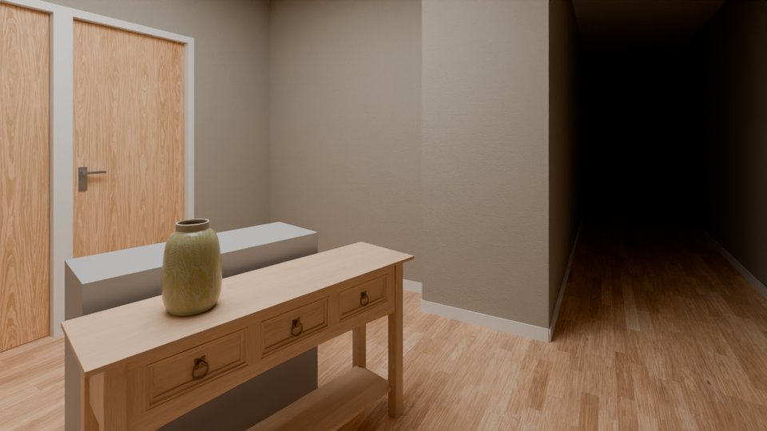 |  |
| 1 | cam_r_L0_kat_holu_2 | 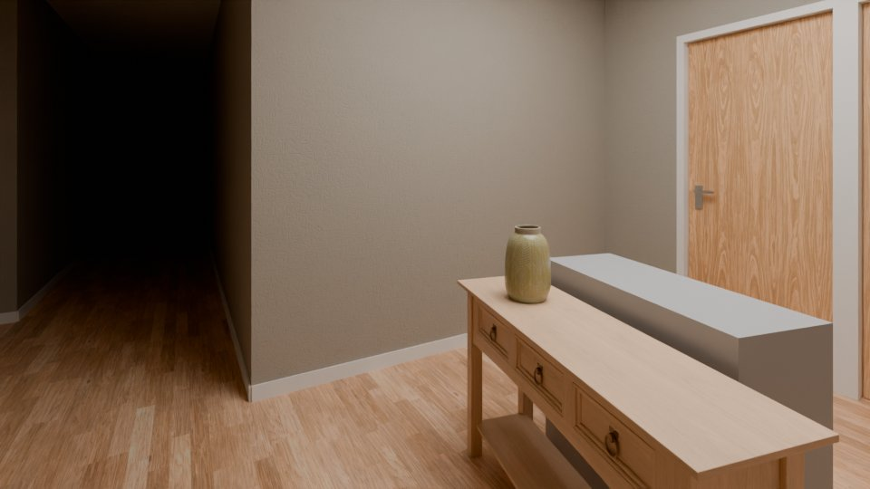 |  |
| 1 | cam_r_L0_kat_holu_3 | 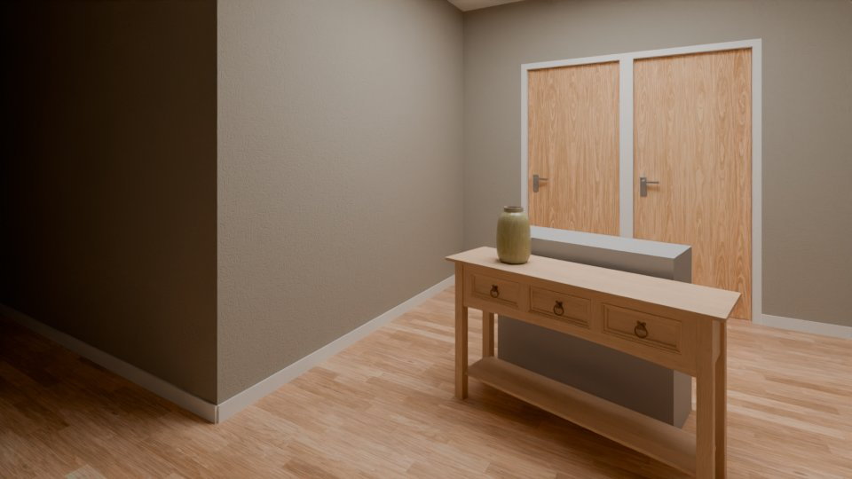 | 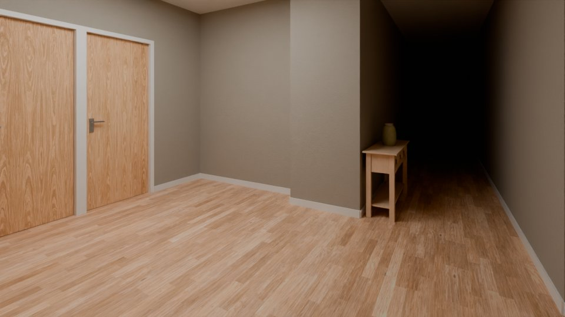 |
| 1 | cam_r_L0_kat_merdiveni_1 |  |  |
| 1 | cam_r_L0_kat_merdiveni_2 | 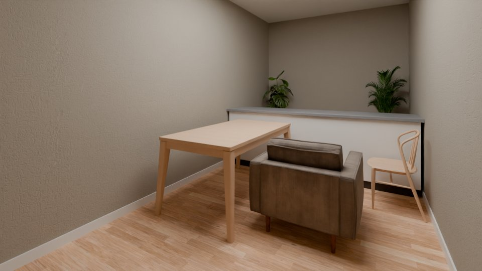 |  |
| 1 | cam_r_L0_kat_merdiveni_3 | 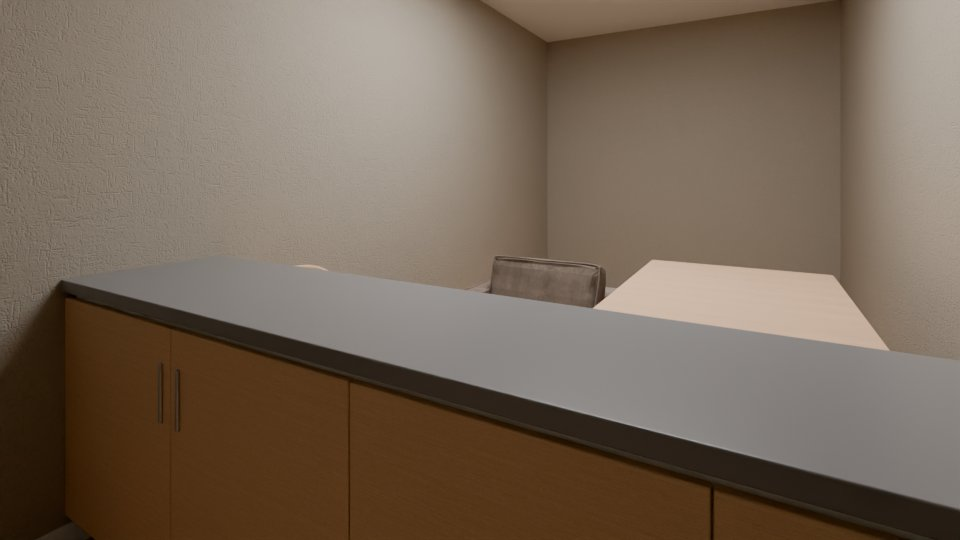 |  |
| 1 | cam_r_L0_yangin_merdiveni_1 | 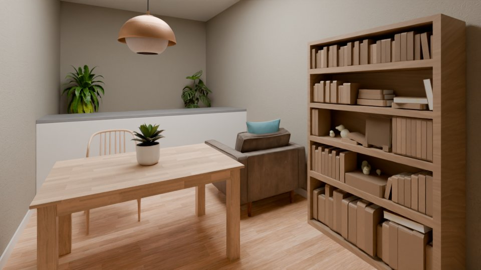 |  |
| 1 | cam_r_L0_yangin_merdiveni_2 | 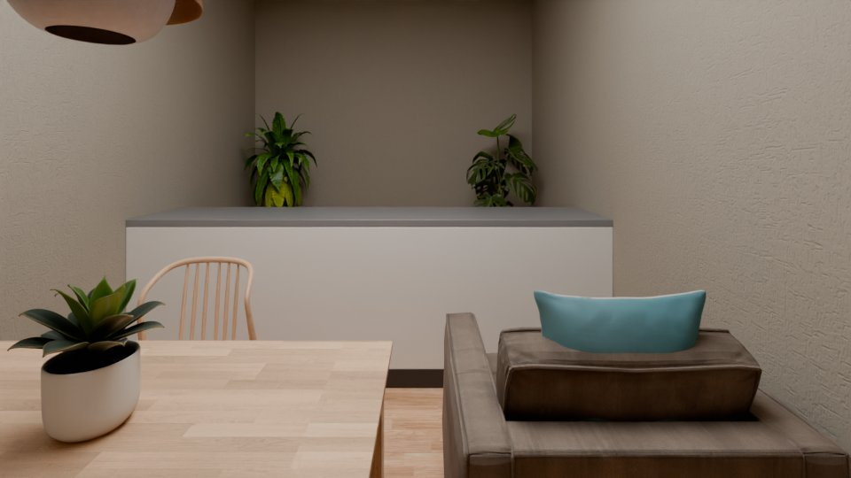 | 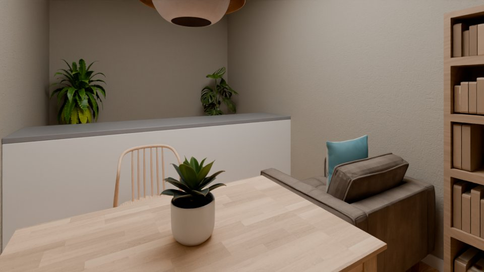 |
| 1 | cam_r_L0_yangin_merdiveni_3 |  |  |
| 2 | cam_r_L0_kat_merdiveni_1 | 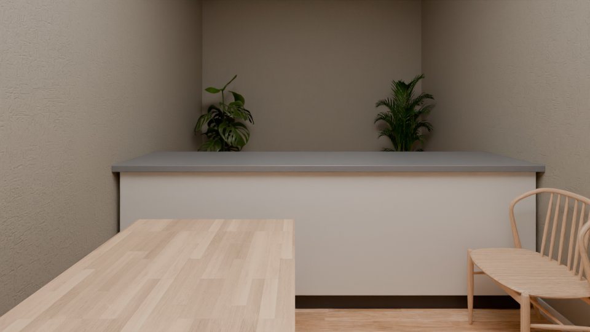 |  |
| 2 | cam_r_L0_kat_merdiveni_2 |  |  |
| 2 | cam_r_L0_kat_merdiveni_3 | 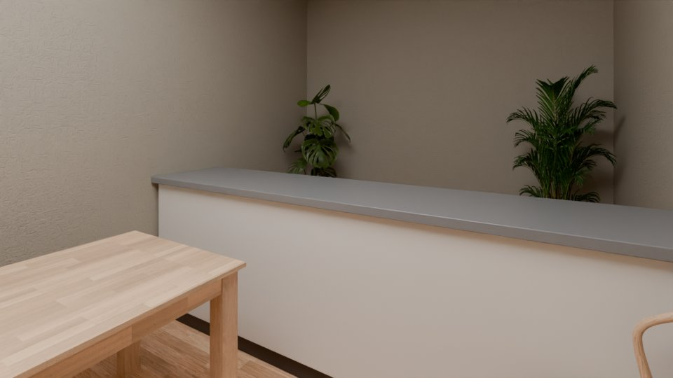 |  |
| 2 | cam_r_L0_yangin_merdiveni_1 | 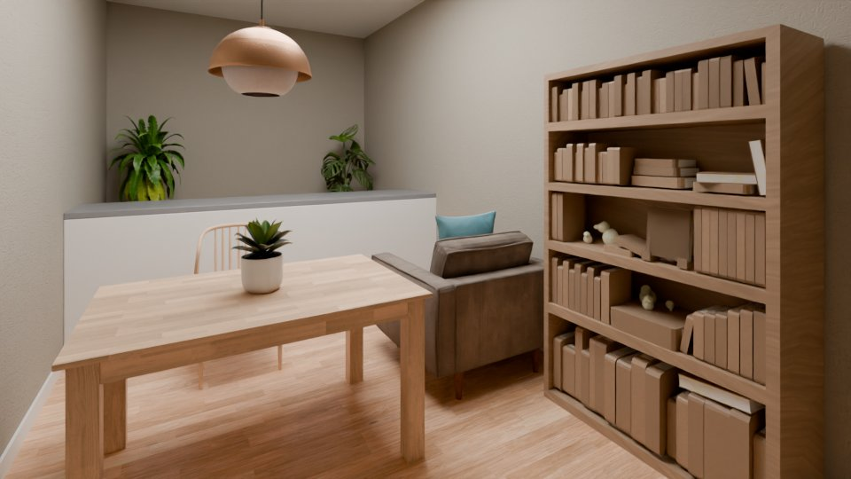 |  |
| 2 | cam_r_L0_yangin_merdiveni_2 |  | 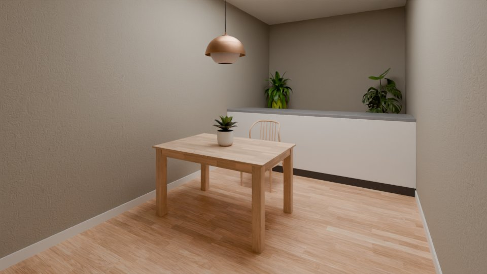 |
| 2 | cam_r_L0_yangin_merdiveni_3 |  |  |
| 3 | cam_r_L0_kat_merdiveni_1 |  |  |
| 3 | cam_r_L0_kat_merdiveni_2 |  | 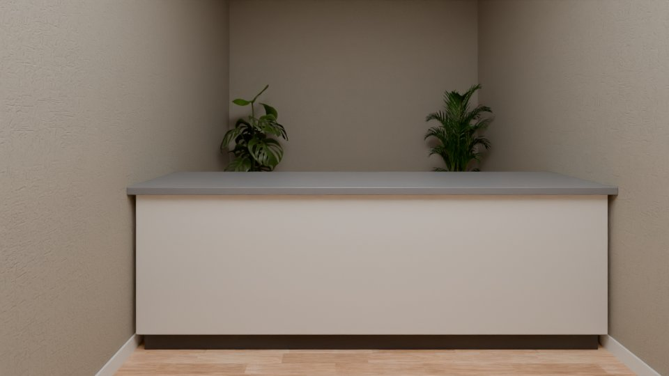 |
| 3 | cam_r_L0_kat_merdiveni_3 |  |  |
| 1 | cam_r_L0_banyo_5_1 | 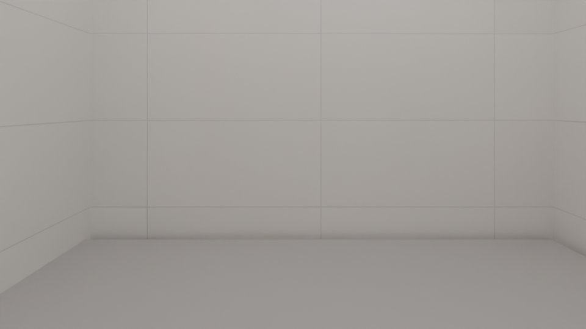 |  |
| 1 | cam_r_L0_giris_holu_3_1 |  | 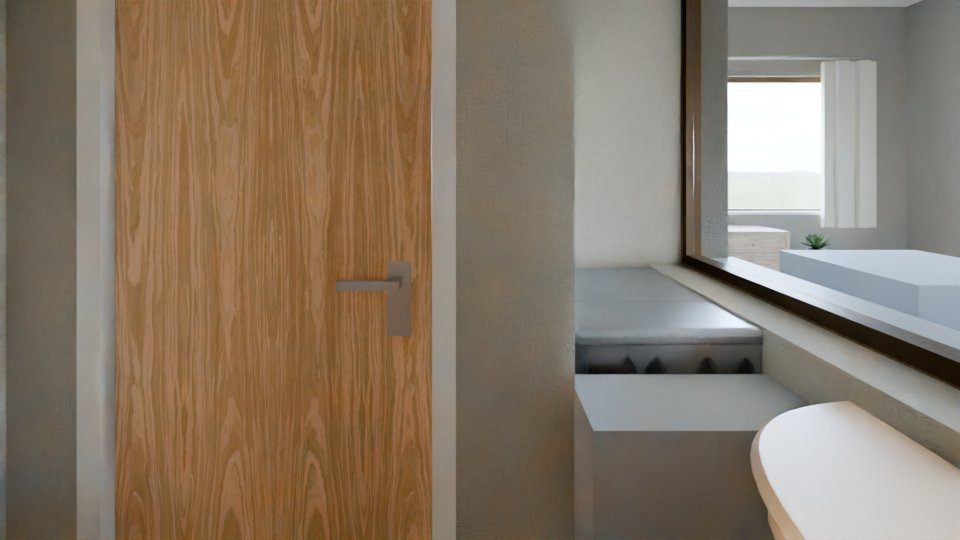 |
| 1 | cam_r_L0_yasama_2_1 | 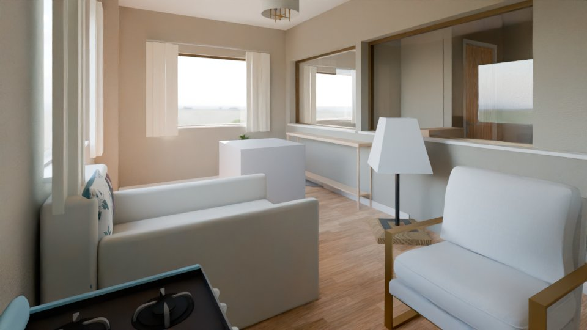 |  |
| 1 | cam_r_L0_yasama_2_2 |  | 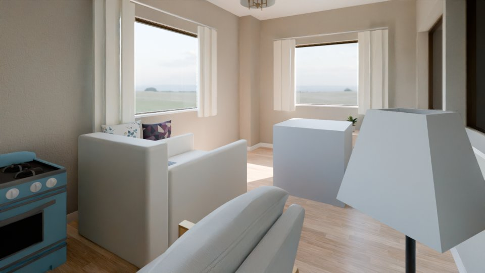 |
| 1 | cam_r_L0_yasama_2_3 | 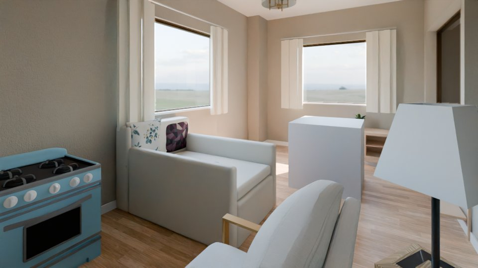 |  |

### Old pipeline vs orchestrator

Not made yet: the images of both runs come from the pods (`orchestrator/compare.json`).

## Warnings

- final/cam_r_L0_guvenlik_holu_1_final_preview.jpg is from an earlier run (not part of this report)
- final/cam_r_L0_guvenlik_holu_2_final_preview.jpg is from an earlier run (not part of this report)
- final/cam_r_L0_guvenlik_holu_1_plan.jpg is from an earlier run (not part of this report)
- final/cam_r_L0_guvenlik_holu_2_plan.jpg is from an earlier run (not part of this report)
