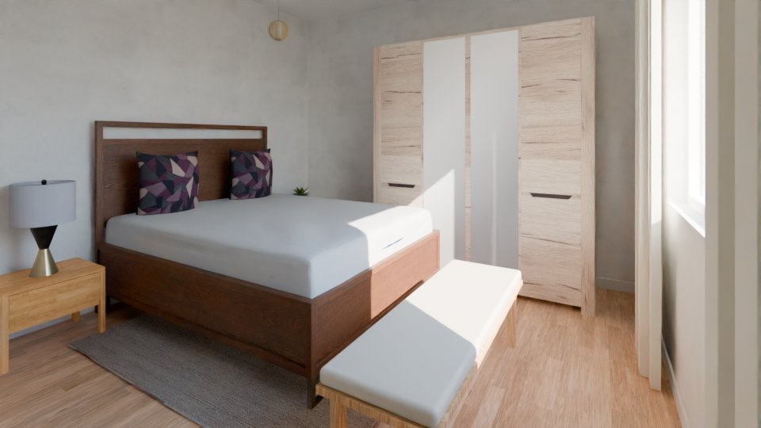

# Final report: synthetic-01

29 views: 0 polished, 29 Cycles (not_run 29). Stages: render run, gate validation not_run, polish not_run, vision check single_pass (calibration run). A polished image is final only when the gate accepted it and the vision check checked it without finding a lost or added element (§5.5). Mismatches are listed with their evidence and never auto-fixed.

## Summary

| item | value |
|---|---|
| views | 29 |
| interior / exterior views | 29 / 0 |
| variant | base |
| polished | 0 |
| Cycles | 29 (not_run 29) |
| confirmed mismatches on the final image | 0 in 0 view(s) |
| JSON cross-check findings (Cycles render) | 0 |
| needs_review views | 0 |
| unverified pieces in view (sum over views) | 0 |
| rooms mixing polished and Cycles | 0 |
| advisory | yes |
| advisory flags | 8 |
| exposure | -0.67 .. +7.33 EV (0 at a limit), modes auto |
| window pull | 21 view(s), -4 .. 0 EV |
| camera policy | search 29 |
| camera score (min / mean / max) | 1.99 / 3.08 / 4.02 |
| rooms by number of views | 1 with 2, 9 with 3 |
| gate validation | not recorded |
| seconds: build / render / metering | 119.2 s / 2.3 min / 17.3 s |
| seconds: polish / gate / check | - / - / 9.6 min |
| brief polish | yes (default, not in brief.yaml) |
| unit system | metric |
| side-by-side sheets | 0 |

## 3D files

Open in Blender: the `.blend` directly (textures packed, cameras with their metered exposure in the custom property `wenart_exposure_ev`, render settings as these images); the `.glb` with File > Import > glTF 2.0 (also other 3D tools). In the results: `final/<project>/3d/`.

| file | size |
|---|---|
| [synthetic-01.blend](3d/synthetic-01.blend) | 186.4 MB |
| [synthetic-01.glb](3d/synthetic-01.glb) | 442.4 MB |

29 cameras; textures scaled to at most 1024 px (149 scaled) for the download.

## AI decor

59 decor items chosen by the AI (Qwen/Qwen3-VL-8B-Instruct; both passes agreeing) in 10 rooms; 0 items by the rules. The decor stage places decor only: it moves, adds and removes no furniture (the AI completion of furnished rooms has its own section, `AI completion of furnished rooms`; `furniture/<project>/decor_report.md` has every room).

## Advisory flags and open items

- polish not run (every view is the Cycles render)
- vision check single pass: every result unverified (advisory)
- vision check advisory: single pass: no two-model agreement; fa_missing None misses <= 0.05 (single pass); fa_extra None misses <= 0.1 (single pass); removal_flagged None misses >= 0.8 (single pass); removal_confirmed None misses >= 0.6 (single pass); insertion None misses >= 0.6 (single pass)
- check target missed: fa_missing - (needs <= 0.05), single pass
- check target missed: fa_extra - (needs <= 0.1), single pass
- check target missed: removal_flagged - (needs >= 0.8), single pass
- check target missed: removal_confirmed - (needs >= 0.6), single pass
- check target missed: insertion - (needs >= 0.6), single pass

## Gate validation

Not recorded: the gate calibration and validation did not run.

## Contact sheets

Tiles: camera, `P` polished / `C` Cycles, `U<n>` unverified pieces in view.

Level L0: [contact_L0.jpg](contact_L0.jpg)

Level L1: [contact_L1.jpg](contact_L1.jpg)

## Side-by-side sheets (Cycles | polished)

None: the polish did not run in this run.

## Views

| view | room | level | final | reason | polish attempt | gate | check Cycles | check polished | preference | EV | pull EV | camera | ids D/A/R | U | review | files |
|---|---|---|---|---|---|---|---|---|---|---|---|---|---|---|---|---|
| cam_r_L0_banyo_1 | r_L0_banyo | L0 | cycles | not_run | - | - | info | - | - | +6.50 | -2 | search 2.64 | D4 A1 | 0 | no | [preview](cam_r_L0_banyo_1_final_preview.jpg) [plan](cam_r_L0_banyo_1_plan.jpg) |
| cam_r_L0_banyo_2 | r_L0_banyo | L0 | cycles | not_run | - | - | info | - | - | +6.67 | -3 | search 2.53 | D5 A2 | 0 | no | [preview](cam_r_L0_banyo_2_final_preview.jpg) [plan](cam_r_L0_banyo_2_plan.jpg) |
| cam_r_L0_banyo_3 | r_L0_banyo | L0 | cycles | not_run | - | - | info | - | - | +6.50 | - | search 2.37 | D2 | 0 | no | [preview](cam_r_L0_banyo_3_final_preview.jpg) [plan](cam_r_L0_banyo_3_plan.jpg) |
| cam_r_L0_hol_1 | r_L0_hol | L0 | cycles | not_run | - | - | info | - | - | -0.50 | - | search 2.33 | D2 A2 | 0 | no | [preview](cam_r_L0_hol_1_final_preview.jpg) [plan](cam_r_L0_hol_1_plan.jpg) |
| cam_r_L0_hol_2 | r_L0_hol | L0 | cycles | not_run | - | - | info | - | - | -0.67 | - | search 1.99 | D2 A2 | 0 | no | [preview](cam_r_L0_hol_2_final_preview.jpg) [plan](cam_r_L0_hol_2_plan.jpg) |
| cam_r_L0_mutfak_1 | r_L0_mutfak | L0 | cycles | not_run | - | - | info | - | - | +7.33 | -4 | search 3.45 | D1 A5 | 0 | no | [preview](cam_r_L0_mutfak_1_final_preview.jpg) [plan](cam_r_L0_mutfak_1_plan.jpg) |
| cam_r_L0_mutfak_2 | r_L0_mutfak | L0 | cycles | not_run | - | - | info | - | - | +7.33 | -3 | search 2.95 | D2 A1 | 0 | no | [preview](cam_r_L0_mutfak_2_final_preview.jpg) [plan](cam_r_L0_mutfak_2_plan.jpg) |
| cam_r_L0_mutfak_3 | r_L0_mutfak | L0 | cycles | not_run | - | - | info | - | - | +7.33 | -4 | search 2.85 | D1 A5 | 0 | no | [preview](cam_r_L0_mutfak_3_final_preview.jpg) [plan](cam_r_L0_mutfak_3_plan.jpg) |
| cam_r_L0_salon_1 | r_L0_salon | L0 | cycles | not_run | - | - | info | - | - | +3.83 | -1 | search 3.54 | D4 A3 | 0 | no | [preview](cam_r_L0_salon_1_final_preview.jpg) [plan](cam_r_L0_salon_1_plan.jpg) |
| cam_r_L0_salon_2 | r_L0_salon | L0 | cycles | not_run | - | - | info | - | - | +3.67 | -1 | search 3.53 | D6 A3 | 0 | no | [preview](cam_r_L0_salon_2_final_preview.jpg) [plan](cam_r_L0_salon_2_plan.jpg) |
| cam_r_L0_salon_3 | r_L0_salon | L0 | cycles | not_run | - | - | info | - | - | +3.67 | -2 | search 3.42 | D6 A6 | 0 | no | [preview](cam_r_L0_salon_3_final_preview.jpg) [plan](cam_r_L0_salon_3_plan.jpg) |
| cam_r_L0_yatak_odasi_1 | r_L0_yatak_odasi | L0 | cycles | not_run | - | - | info | - | - | +4.67 | -1 | search 4.02 | D4 A3 | 0 | no | [preview](cam_r_L0_yatak_odasi_1_final_preview.jpg) [plan](cam_r_L0_yatak_odasi_1_plan.jpg) |
| cam_r_L0_yatak_odasi_2 | r_L0_yatak_odasi | L0 | cycles | not_run | - | - | info | - | - | +4.67 | -1 | search 3.57 | D3 A3 | 0 | no | [preview](cam_r_L0_yatak_odasi_2_final_preview.jpg) [plan](cam_r_L0_yatak_odasi_2_plan.jpg) |
| cam_r_L0_yatak_odasi_3 | r_L0_yatak_odasi | L0 | cycles | not_run | - | - | info | - | - | +4.50 | -1 | search 3.55 | D3 A3 | 0 | no | [preview](cam_r_L0_yatak_odasi_3_final_preview.jpg) [plan](cam_r_L0_yatak_odasi_3_plan.jpg) |
| cam_r_L1_banyo_1 | r_L1_banyo | L1 | cycles | not_run | - | - | info | - | - | -0.33 | 0 | search 3.11 | D2 A4 | 0 | no | [preview](cam_r_L1_banyo_1_final_preview.jpg) [plan](cam_r_L1_banyo_1_plan.jpg) |
| cam_r_L1_banyo_2 | r_L1_banyo | L1 | cycles | not_run | - | - | info | - | - | -0.50 | - | search 2.75 | D1 A3 | 0 | no | [preview](cam_r_L1_banyo_2_final_preview.jpg) [plan](cam_r_L1_banyo_2_plan.jpg) |
| cam_r_L1_banyo_3 | r_L1_banyo | L1 | cycles | not_run | - | - | info | - | - | -0.33 | - | search 2.63 | D1 A3 | 0 | no | [preview](cam_r_L1_banyo_3_final_preview.jpg) [plan](cam_r_L1_banyo_3_plan.jpg) |
| cam_r_L1_cocuk_odasi_1 | r_L1_cocuk_odasi | L1 | cycles | not_run | - | - | info | - | - | +5.83 | -2 | search 3.32 | D2 A6 | 0 | no | [preview](cam_r_L1_cocuk_odasi_1_final_preview.jpg) [plan](cam_r_L1_cocuk_odasi_1_plan.jpg) |
| cam_r_L1_cocuk_odasi_2 | r_L1_cocuk_odasi | L1 | cycles | not_run | - | - | info | - | - | +5.83 | -3 | search 3.15 | D1 A6 | 0 | no | [preview](cam_r_L1_cocuk_odasi_2_final_preview.jpg) [plan](cam_r_L1_cocuk_odasi_2_plan.jpg) |
| cam_r_L1_cocuk_odasi_3 | r_L1_cocuk_odasi | L1 | cycles | not_run | - | - | info | - | - | +5.83 | -3 | search 2.74 | D1 A4 | 0 | no | [preview](cam_r_L1_cocuk_odasi_3_final_preview.jpg) [plan](cam_r_L1_cocuk_odasi_3_plan.jpg) |
| cam_r_L1_ebeveyn_yatak_odasi_1 | r_L1_ebeveyn_yatak_odasi | L1 | cycles | not_run | - | - | info | - | - | +3.50 | -1 | search 3.70 | D2 A5 | 0 | no | [preview](cam_r_L1_ebeveyn_yatak_odasi_1_final_preview.jpg) [plan](cam_r_L1_ebeveyn_yatak_odasi_1_plan.jpg) |
| cam_r_L1_ebeveyn_yatak_odasi_2 | r_L1_ebeveyn_yatak_odasi | L1 | cycles | not_run | - | - | info | - | - | +3.67 | -2 | search 3.39 | D2 A7 | 0 | no | [preview](cam_r_L1_ebeveyn_yatak_odasi_2_final_preview.jpg) [plan](cam_r_L1_ebeveyn_yatak_odasi_2_plan.jpg) |
| cam_r_L1_ebeveyn_yatak_odasi_3 | r_L1_ebeveyn_yatak_odasi | L1 | cycles | not_run | - | - | info | - | - | +3.33 | -1 | search 3.37 | D2 A7 | 0 | no | [preview](cam_r_L1_ebeveyn_yatak_odasi_3_final_preview.jpg) [plan](cam_r_L1_ebeveyn_yatak_odasi_3_plan.jpg) |
| cam_r_L1_hol_1 | r_L1_hol | L1 | cycles | not_run | - | - | info | - | - | +0.33 | - | search 2.62 | D4 A5 | 0 | no | [preview](cam_r_L1_hol_1_final_preview.jpg) [plan](cam_r_L1_hol_1_plan.jpg) |
| cam_r_L1_hol_2 | r_L1_hol | L1 | cycles | not_run | - | - | info | - | - | +0.17 | 0 | search 2.48 | D5 A4 | 0 | no | [preview](cam_r_L1_hol_2_final_preview.jpg) [plan](cam_r_L1_hol_2_plan.jpg) |
| cam_r_L1_hol_3 | r_L1_hol | L1 | cycles | not_run | - | - | info | - | - | +0.00 | - | search 2.18 | D2 A4 | 0 | no | [preview](cam_r_L1_hol_3_final_preview.jpg) [plan](cam_r_L1_hol_3_plan.jpg) |
| cam_r_L1_yatak_odasi_1 | r_L1_yatak_odasi | L1 | cycles | not_run | - | - | info | - | - | +4.17 | - | search 3.90 | D1 A4 | 0 | no | [preview](cam_r_L1_yatak_odasi_1_final_preview.jpg) [plan](cam_r_L1_yatak_odasi_1_plan.jpg) |
| cam_r_L1_yatak_odasi_2 | r_L1_yatak_odasi | L1 | cycles | not_run | - | - | info | - | - | +4.33 | -1 | search 3.75 | D2 A6 | 0 | no | [preview](cam_r_L1_yatak_odasi_2_final_preview.jpg) [plan](cam_r_L1_yatak_odasi_2_plan.jpg) |
| cam_r_L1_yatak_odasi_3 | r_L1_yatak_odasi | L1 | cycles | not_run | - | - | info | - | - | +4.50 | -1 | search 3.63 | D2 A3 | 0 | no | [preview](cam_r_L1_yatak_odasi_3_final_preview.jpg) [plan](cam_r_L1_yatak_odasi_3_plan.jpg) |

polish attempt: the polish candidate (used only when final is polished). pull EV: the window pull of the render (window panes darkened by that many EV, §5). camera: policy (`search` = ray-cast camera search, `m5` = the fixed rules) and score. ids: D from_documents, A added_by_ai, R rule (elements in view). check: verdict (confirmed mismatches). U: unverified pieces in view.

## Views per room

| room | type | level | views | polished | Cycles | cameras |
|---|---|---|---|---|---|---|
| r_L0_banyo | bathroom | L0 | 3 | 0 | 3 | cam_r_L0_banyo_1, cam_r_L0_banyo_2, cam_r_L0_banyo_3 |
| r_L0_hol | hall | L0 | 2 | 0 | 2 | cam_r_L0_hol_1, cam_r_L0_hol_2 |
| r_L0_mutfak | kitchen | L0 | 3 | 0 | 3 | cam_r_L0_mutfak_1, cam_r_L0_mutfak_2, cam_r_L0_mutfak_3 |
| r_L0_salon | living | L0 | 3 | 0 | 3 | cam_r_L0_salon_1, cam_r_L0_salon_2, cam_r_L0_salon_3 |
| r_L0_yatak_odasi | bedroom | L0 | 3 | 0 | 3 | cam_r_L0_yatak_odasi_1, cam_r_L0_yatak_odasi_2, cam_r_L0_yatak_odasi_3 |
| r_L1_banyo | bathroom | L1 | 3 | 0 | 3 | cam_r_L1_banyo_1, cam_r_L1_banyo_2, cam_r_L1_banyo_3 |
| r_L1_cocuk_odasi | bedroom | L1 | 3 | 0 | 3 | cam_r_L1_cocuk_odasi_1, cam_r_L1_cocuk_odasi_2, cam_r_L1_cocuk_odasi_3 |
| r_L1_ebeveyn_yatak_odasi | bedroom | L1 | 3 | 0 | 3 | cam_r_L1_ebeveyn_yatak_odasi_1, cam_r_L1_ebeveyn_yatak_odasi_2, cam_r_L1_ebeveyn_yatak_odasi_3 |
| r_L1_hol | hall | L1 | 3 | 0 | 3 | cam_r_L1_hol_1, cam_r_L1_hol_2, cam_r_L1_hol_3 |
| r_L1_yatak_odasi | bedroom | L1 | 3 | 0 | 3 | cam_r_L1_yatak_odasi_1, cam_r_L1_yatak_odasi_2, cam_r_L1_yatak_odasi_3 |

### Why Cycles

- cam_r_L0_banyo_1: not_run: polish not run
- cam_r_L0_banyo_2: not_run: polish not run
- cam_r_L0_banyo_3: not_run: polish not run
- cam_r_L0_hol_1: not_run: polish not run
- cam_r_L0_hol_2: not_run: polish not run
- cam_r_L0_mutfak_1: not_run: polish not run
- cam_r_L0_mutfak_2: not_run: polish not run
- cam_r_L0_mutfak_3: not_run: polish not run
- cam_r_L0_salon_1: not_run: polish not run
- cam_r_L0_salon_2: not_run: polish not run
- cam_r_L0_salon_3: not_run: polish not run
- cam_r_L0_yatak_odasi_1: not_run: polish not run
- cam_r_L0_yatak_odasi_2: not_run: polish not run
- cam_r_L0_yatak_odasi_3: not_run: polish not run
- cam_r_L1_banyo_1: not_run: polish not run
- cam_r_L1_banyo_2: not_run: polish not run
- cam_r_L1_banyo_3: not_run: polish not run
- cam_r_L1_cocuk_odasi_1: not_run: polish not run
- cam_r_L1_cocuk_odasi_2: not_run: polish not run
- cam_r_L1_cocuk_odasi_3: not_run: polish not run
- cam_r_L1_ebeveyn_yatak_odasi_1: not_run: polish not run
- cam_r_L1_ebeveyn_yatak_odasi_2: not_run: polish not run
- cam_r_L1_ebeveyn_yatak_odasi_3: not_run: polish not run
- cam_r_L1_hol_1: not_run: polish not run
- cam_r_L1_hol_2: not_run: polish not run
- cam_r_L1_hol_3: not_run: polish not run
- cam_r_L1_yatak_odasi_1: not_run: polish not run
- cam_r_L1_yatak_odasi_2: not_run: polish not run
- cam_r_L1_yatak_odasi_3: not_run: polish not run

## Mismatches (never auto-fixed)

None.

## Needs review

None.

## Building JSON: unverified items and conflicts

Status: ok.

Unverified items:

None.

Conflicts:

None.

## Sheets

The sheets stage split every sheet into drawing regions and classified them before any wall was read. 3 regions (use: ignored 1, read 2). A region is read only when its class says it is a plan; everything else is ignored with its reason, never guessed.

Full analysis: [sheets_report.md](sheets_report.md).

Regions:

| region | file | class | decided by | status | level | variant | use |
|---|---|---|---|---|---|---|---|
| r1 | 1_kat.pdf | floor_plan | title (0.99) | verified | L1 | base | read |
| r2 | 1_kat_scan.png | other | none (0.00) | unverified | - | - | ignored (raster page: classified and read by the pipeline's OCR path) |
| r3 | zemin_kat.dxf | floor_plan | title (0.99) | verified | L0 | base | read |

Levels and their alternative plans (a variant group):

| level | label | kind | base region | alternatives |
|---|---|---|---|---|
| L0 | Zemin Kat | floor | r3 | - |
| L1 | 1. Kat | floor | r1 | - |

Variants (the base building and one per alternative plan):

| variant | label | levels | regions |
|---|---|---|---|
| base | Base | L0, L1 | r3, r1 |

Strays (entities far from every drawing, ignored): 0.

Unit check (the drawing unit against the room-area labels, the level marks and the door widths):

| file | format | metres per unit | method | checks | conflict |
|---|---|---|---|---|---|
| 1_kat.pdf | pdf | 0.04 | pdf_scale_text | - | - |
| 1_kat_scan.png | image | - | raster | - | - |
| zemin_kat.dxf | dxf | 0.00 | dxf_insunits | area_labels None - (0); level_marks None - (0); door_widths mm 1.00 (5); wall_thickness None 0.55 (67); text_height mm 1.00 (6); dimensions None - (0) | - |

Debug images (every region boxed and labelled with class, level and variant):

- [debug/1_kat_pdf_s1.jpg](debug/1_kat_pdf_s1.jpg)
- [debug/zemin_kat_dxf_s1.jpg](debug/zemin_kat_dxf_s1.jpg)

## AI completion of furnished rooms (Feature 1)

Mode `furnished_rooms: complete` (assumed: furnished_rooms, furnished_rooms_keep, furnished_rooms_keep_size, render.twin_rooms). Drawn pieces keep their anchor (+-5 cm) and front (+-1 deg); the AI may change a piece's type (within the room type's types), size, height and look (it stays `from_documents`, `modified_by_ai`, with the drawn type and size recorded) and add the pieces the room type misses (`added_by_ai`, never a second main piece). Fixed equipment never changes. A change needs both AI passes.

0 change(s) applied, 3 piece(s) added, 0 wall cabinet run(s).

### Salon (r_L0_salon, living): completed

- added f_L0_019: armchair 0.90 x 0.90 (confidence 0.60, ai)
- added f_L0_020: console_table 1.20 x 0.35 (confidence 0.60, ai)
- drawn pieces that already fail a placer check as drawn (kept, never moved): f_L0_001, f_L0_003, f_L0_004, f_L0_005

### Yatak Odası (r_L0_yatak_odasi, bedroom): completed

- added f_L0_021: bench 1.40 x 0.45 (confidence 0.90, ai)
- drawn pieces that already fail a placer check as drawn (kept, never moved): f_L0_007, f_L0_009

### Banyo (r_L0_banyo, bathroom): completed (nothing to ask: no changeable drawn piece and nothing the room may get)

- drawn pieces that already fail a placer check as drawn (kept, never moved): f_L0_010, f_L0_011, f_L0_012

### Drawn pieces against the source plan

Reference: source building.json; mode `complete`. 13 of 13 drawn piece(s) checked: anchor within 0.05 m, front within 1.0 deg, the same wall; 13 ok, 0 failed; 0 changed by the AI.

## Units

Project unit system: **metric** (not recorded in the building JSON: metric).

| document | unit system | source kind |
|---|---|---|
| 1_kat.pdf | metric | cad_pdf |
| 1_kat_scan.png | metric | raster_scan |
| zemin_kat.dxf | metric | dxf |

## Recognition (AI typing and raster labels)

Furniture type methods: -. Recognition questions: -; answer files: none. A type counts only when both passes agree and the drawn footprint fits the type's size range; otherwise the piece stays `unknown` and `unverified` with both answers.

Raster pages (scans and photos):

| file | page | kind | class | level | rectified image | skip reason |
|---|---|---|---|---|---|---|
| 1_kat_scan.png | 1 | scan | floor_plan | L1 | rectified/1_kat_scan_png_p1.png | - |

## Site

Recorded, not built.

None.

## Separators

None.

## Assumed values

- style exterior facade render in white, roof concrete_tiles in anthracite, window_frame as inside (painted_metal_white), door as inside (wood_oak_light), paving paving in grey, garden grass from style.exterior_fallback of wenart/defaults.yaml (no word for them in the brief)
- brief empty_rooms: ai (default, not in brief.yaml)
- brief decor: True (default, not in brief.yaml)
- brief polish: True (default, not in brief.yaml)
- brief style_photos: [] (default, not in brief.yaml)
- brief ceiling_height: 2.7 (default, not in brief.yaml)
- brief slab_thickness: 0.2 (default, not in brief.yaml)
- brief furnished_rooms: complete (default, not in brief.yaml)
- brief furnished_rooms_keep: [] (default, not in brief.yaml)
- brief furnished_rooms_keep_size: False (default, not in brief.yaml)
- brief variants: all (default, not in brief.yaml)
- brief failed_levels: leave_out (default, not in brief.yaml)
- brief site: full (default, not in brief.yaml)
- brief exterior.facade:  (default, not in brief.yaml)
- brief exterior.roof:  (default, not in brief.yaml)
- brief exterior.window_frame:  (default, not in brief.yaml)
- brief exterior.door:  (default, not in brief.yaml)
- brief exterior.paving:  (default, not in brief.yaml)
- brief exterior.garden:  (default, not in brief.yaml)
- brief render.views_per_room: 3 (default, not in brief.yaml)
- brief render.resolution: [1920, 1080] (default, not in brief.yaml)
- brief render.samples: 256 (default, not in brief.yaml)
- brief render.lens_mm: auto (default, not in brief.yaml)
- brief render.exterior_views: True (default, not in brief.yaml)
- brief render.twin_rooms: one (default, not in brief.yaml)
- brief markers_in_final: False (default, not in brief.yaml)
- brief roof_terraces: auto (default, not in brief.yaml)
- brief site_options.front_court: auto (default, not in brief.yaml)
- L0: ceiling height 2,70 m (assumed_default)
- L1: ceiling height 2,70 m (assumed_default)

Scene (build) assumptions:

| field | objects | reason | e.g. |
|---|---|---|---|
| area_light | 1 | r_L0_hol: room has no window; soft ceiling light added (lighting mood, invisible to the camera) | light_r_L0_hol |
| area_light | 1 | r_L1_banyo: room has little daylight (window/floor 0.075 < 0.08); soft ceiling light added (lighting mood, invisible to the camera) | light_r_L1_banyo |
| area_light | 1 | r_L1_hol: room has little daylight (window/floor 0.067 < 0.08); soft ceiling light added (lighting mood, invisible to the camera) | light_r_L1_hol |
| bedding | 2 | design detail of the bed (soft bedding inside the bed's own box); the documents show only the footprint | furn_f_L1_001, furn_f_L1_010 |
| ceiling_height | 2 | building JSON: assumed_default | level_L0, level_L1 |
| counter_fronts | 1 | design detail of the counter (fronts and handles inside its own box); the documents show only the footprint | furn_f_L0_015 |
| door_handles | 9 | design detail of the documented door (lever handles on both faces); not in the documents | d_L0_001_handle, d_L0_002_handle, d_L0_003_handle |
| fabric | 2 | style profile has no textiles slot; default fabric for sofas and chairs | furniture, furniture |
| height | 9 | door height not in the JSON; default | d_L0_001, d_L0_002, d_L0_003 |
| height | 1 | no height in the JSON; type height for armchair | furn_f_L0_004 |
| height | 1 | no height in the JSON; type height for bed_double | furn_f_L0_006 |
| height | 1 | no height in the JSON; type height for bookshelf | furn_f_L0_005 |
| height | 2 | no height in the JSON; type height for nightstand | furn_f_L0_007, furn_f_L0_008 |
| height | 1 | no height in the JSON; type height for shower | furn_f_L0_012 |
| height | 1 | no height in the JSON; type height for sofa | furn_f_L0_001 |
| height | 1 | no height in the JSON; type height for table_coffee | furn_f_L0_002 |
| height | 1 | no height in the JSON; type height for toilet | furn_f_L0_010 |
| height | 1 | no height in the JSON; type height for tv_unit | furn_f_L0_003 |
| height | 1 | no height in the JSON; type height for wardrobe | furn_f_L0_009 |
| height | 1 | no height in the JSON; type height for washbasin | furn_f_L0_011 |
| height | 1 | no height in the JSON; type height for washing_machine | furn_f_L0_013 |
| height | 12 | window height not in the JSON; default | win_L0_001, win_L0_002, win_L0_003 |
| sill_height | 12 | window sill_height not in the JSON; default | win_L0_001, win_L0_002, win_L0_003 |
| skirting | 8 | design detail of the room's documented walls (painted skirting board); not in the documents | skirting_r_L0_salon, skirting_r_L0_yatak_odasi, skirting_r_L0_hol |
| slab_thickness | 8 | slab between levels | w_L0_001, w_L0_002, w_L0_003 |
| splashback | 1 | kitchen splashback: tiles 0.6 m high from the counter top behind f_L0_015, f_L0_016 (docs/milestone11.md §1.3 M2; not drawn) | splashback_r_L0_mutfak |

## Rooms mixing polished and Cycles views

None.

## Models and licences

| role | model | revision | licence | from |
|---|---|---|---|---|
| check agent | Qwen/Qwen3.8-27B-FP8 | 017b9c7af6b5689d5dd426a76e0bc077eb5ca20a | Apache-2.0 | check_manifest.json |

Assets: textures CC0 x 7; furniture/decor models CC-BY-4.0 x 63, CC0 x 2, generated (TRELLIS.2-4B, MIT) x 15 (parametric meshes need no licence).

## Attribution

3D models from Objaverse 1.0 used in these images (§7.3):

- "Comfy kitty" by scubadiverchick (https://sketchfab.com/3d-models/68ba20aeb8fe4a03befaa2db5b429758), CC BY 4.0 (https://creativecommons.org/licenses/by/4.0/), via Objaverse (allenai/objaverse, ODC-By 1.0); changes: scaled to the drawn footprint, re-oriented, rendered, AI-retouched (used for dec_L0_003, dec_L0_009, dec_L0_011)
- "JuiceMachine" by voxelpoint (https://sketchfab.com/3d-models/6b46b33bdff44269bf9391774bb8dd63), CC BY 4.0 (https://creativecommons.org/licenses/by/4.0/), via Objaverse (allenai/objaverse, ODC-By 1.0); changes: scaled to the drawn footprint, re-oriented, rendered, AI-retouched (used for dec_L0_017, dec_L1_003)
- "Lowpoly Bed" by Mohamed199 (https://sketchfab.com/3d-models/6eb4212e70b941a3bd2db196a47828b9), CC BY 4.0 (https://creativecommons.org/licenses/by/4.0/), via Objaverse (allenai/objaverse, ODC-By 1.0); changes: scaled to the drawn footprint, re-oriented, rendered, AI-retouched (used for f_L1_017)
- "Simple Tall Shelf" by Blender3D (https://sketchfab.com/3d-models/b46803ba0bc64e12b31f832fb761c4e0), CC BY 4.0 (https://creativecommons.org/licenses/by/4.0/), via Objaverse (allenai/objaverse, ODC-By 1.0); changes: scaled to the drawn footprint, re-oriented, rendered, AI-retouched (used for f_L1_004, f_L1_019)
- "Candle light" by al0sral0 (https://sketchfab.com/3d-models/d9d5ed5de83b4d899ab93f55bdc3d0bc), CC BY 4.0 (https://creativecommons.org/licenses/by/4.0/), via Objaverse (allenai/objaverse, ODC-By 1.0); changes: scaled to the drawn footprint, re-oriented, rendered, AI-retouched (used for dec_L0_006)
- "Bench with Cloth" by finemods (https://sketchfab.com/3d-models/eee70cb7980a4ca7aa0a2f86c492283e), CC BY 4.0 (https://creativecommons.org/licenses/by/4.0/), via Objaverse (allenai/objaverse, ODC-By 1.0); changes: scaled to the drawn footprint, re-oriented, rendered, AI-retouched (used for dec_L1_025)

Contains information from Objaverse 1.0 (https://huggingface.co/datasets/allenai/objaverse, revision 21e4e14), which is made available under the ODC Attribution License (ODC-By 1.0, https://opendatacommons.org/licenses/by/1-0/). Every object keeps its own licence, as declared by its uploader and not verified by WenArt_RUN (CC0 1.0 and CC BY 4.0 unflagged, every other licence flagged: docs/milestone8.md §2): check it before commercial use. This file is licensed ODC-By 1.0, not MIT.

## Added-object detector

Not run for this project (no `detect/` results in the check manifest).

## Stages

This run (`20261010-000113-full-20261010T000613Z`):

| stage | status | seconds | note |
|---|---|---|---|
| intake | skipped | 0.0 s | private only |
| sheets | ok | 3.4 s | - |
| pipeline | ok | 28.4 s | - |
| pipeline_final | skipped | 0.0 s | no questions |
| recognize | skipped | 0.0 s | no questions |
| fit | ok | 1.7 s | - |
| photos | skipped | 0.0 s | no style photos |
| style | ok | 0.2 s | - |
| layout | ok | 71.8 s | - |
| decor_ask | ok | 83.7 s | - |
| assets | ok | 0.7 s | - |
| decor | ok | 3.4 s | - |
| refit | ok | 8.5 s | - |
| build | ok | 4.2 min | - |
| agent_previews | ok | 97.9 s | 3 view(s) |
| agent_apply | ok | 2.1 s | - |
| agent | ok | 6.0 min | 2 round(s), 1 edit(s) accepted, 30 rejected; stop: no edit accepted in this round |
| render | ok | 3.7 min | - |
| export | ok | 57.9 s | - |
| controls | ok | 70.9 s | - |
| detect | skipped | 0.0 s | polish off |
| gate | skipped | 0.0 s | polish off |
| polish | skipped | 0.0 s | polish off |
| expected | ok | 15.7 s | - |
| check | ok | 2.8 min | - |
| combine | ok | 18.3 s | - |

The report stage itself is recorded after this report.

## AI orchestrator

Model `Qwen/Qwen3.8-27B-FP8` @ `017b9c7af6b5689d5dd426a76e0bc077eb5ca20a`: 3 round(s), 1 edit(s) accepted, 30 rejected, 71 model calls (532294 tokens), 7.7 min. Stop: final round for critical findings done. Every edit was checked by code before it was accepted; the full log is `orchestrator/log.md` on the volume.

### Rounds

| round | critical | major | minor | dropped (vision) | accepted | rejected | re-run from | views |
|---|---|---|---|---|---|---|---|---|
| 1 | 0 | 11 | 6 | 16 | 1 | 15 | refit | 3 |
| 2 | 0 | 11 | 6 | 4 | 0 | 15 | - | 0 |
| 3 | 0 | 12 | 6 | 1 | 0 | 0 | - | 0 |

### Findings by check

| check | critical | major | minor | dropped |
|---|---|---|---|---|
| F3 | 0 | 3 | 0 | 9 |
| F4 | 0 | 3 | 0 | 0 |
| F5 | 0 | 0 | 9 | 1 |
| F6 | 0 | 15 | 0 | 7 |
| F7 | 0 | 3 | 0 | 0 |
| F8 | 0 | 0 | 0 | 4 |
| F9 | 0 | 10 | 0 | 0 |
| R3 | 0 | 0 | 9 | 0 |

### Accepted edits

| # | round | tool | target | label | score | reason | before | after |
|---|---|---|---|---|---|---|---|---|
| 54 | 1 | move_piece | f_L0_021 | added_by_ai | 87.0 -> 87.0 | Move the AI bench down so the wardrobe's free zone in front of f_L0_009 is unblocked (F6). |  |  |

### Rejected edits

| # | round | tool | target | failed checks | reason |
|---|---|---|---|---|---|
| 47 | 1 | move_piece | f_L0_013 | drawn_lock: f_L0_013: drawn fixed equipment (washing_machine) is never moved | Snap washing machine back onto the west wall to clear the 0.10 m F3 gap. |
| 48 | 1 | move_piece | f_L0_012 | drawn_lock: f_L0_012: drawn fixed equipment (shower) is never moved | Shift shower 0.5 m south to clear the window win_L0_006 (F7) and open the door-to-window walkway (F6). |
| 49 | 1 | move_piece | f_L0_004 | drawn_lock: f_L0_004: a drawn piece moves at most 0.3 m, or 1.2 m when its back snaps onto a wall (this move: 0.90 m) | Move the armchair away from the door d_L0_002 swing and the walkways to the windows, keeping it in the open area of the salon. |
| 50 | 1 | move_piece | f_L0_004 | snap: f_L0_004: no free place on wall w_L0_004 (doors, windows, at most 1.2 m from the drawn place) | Snap the armchair's back to the west wall (w_L0_004) to clear the door d_L0_002 swing and the 0.9 m walkways to the windows. |
| 51 | 1 | move_piece | f_L0_004 | snap: f_L0_004: no free place on wall w_L0_006 (doors, windows, at most 1.2 m from the drawn place) | Snap the armchair's back to the south wall (w_L0_006) to clear the door d_L0_002 swing and the 0.9 m walkways to the windows. |
| 52 | 1 | move_piece | f_L0_004 | max_tries: f_L0_004 was edited 3 times in this round | Shift the armchair 0.3 m south to clear the door d_L0_002 swing and open the 0.9 m walkways to the windows. |
| 53 | 1 | move_piece | f_L0_021 | score: plausibility 87 -> 77 (F4 f_L0_021: bench faces a wall 0.28 m in front of it) | Move the AI bench away from the wardrobe's free zone so the front of f_L0_009 is unblocked (F6). |
| 55 | 1 | move_piece | f_L0_007 | score: plausibility 87 -> 84 (F3 f_L0_007: nightstand: its back is not on a wall (0.25 m off)) | Shift the nightstand away from the door swing arc so d_L0_004 no longer hits it (R3). |
| 56 | 1 | move_piece | f_L0_007 | snap: f_L0_007: no free place on wall w_L0_007 (doors, windows, at most 1.2 m from the drawn place) | Snap the nightstand back to the wall and shift it along the wall away from the door swing arc (R3). |
| 57 | 1 | move_piece | f_L0_007 | f_L0_007: inside_room | Nudge the nightstand 5 cm toward the wall so the door swing arc no longer overlaps it (R3). |
| 58 | 1 | move_piece | f_L0_007 | max_tries: f_L0_007 was edited 3 times in this round | Nudge the nightstand 2 cm toward the wall so the door swing arc no longer overlaps it (R3). |
| 59 | 1 | move_piece | f_L1_006 | f_L1_005: no_overlap, f_L1_006: no_overlap | Move the office chair away from the west wall (it faced a wall 0.03 m in front) and place it in front of the desk. |
| 60 | 1 | move_piece | f_L1_006 | f_L1_005: no_overlap, f_L1_006: no_overlap | Move the office chair away from the west wall (it faced a wall 0.03 m in front) and place it in front of the desk, clear of the desk footprint. |
| 61 | 1 | move_piece | f_L1_006 | f_L1_001: doors_free, f_L1_005: no_overlap, f_L1_006: doors_free, f_L1_006: no_overlap | Move the office chair away from the west wall (it faced a wall 0.03 m in front) and place it in front of the desk, clear of the desk footprint. |
| 62 | 1 | move_piece | f_L1_006 | max_tries: f_L1_006 was edited 3 times in this round | Move the office chair away from the west wall (it faced a wall 0.03 m in front) and place it in front of the desk, clear of the desk footprint. |
| 92 | 2 | move_piece | f_L0_013 | drawn_lock: f_L0_013: drawn fixed equipment (washing_machine) is never moved | Snap the washing machine's back edge onto the west wall to clear the 0.10 m F3 gap. |
| 93 | 2 | move_piece | f_L0_012 | drawn_lock: f_L0_012: drawn fixed equipment (shower) is never moved | Move the shower to the west wall below the door swing so it no longer stands in front of window win_L0_006 and frees the door-to-window walkway. |
| 94 | 2 | resize_piece | f_L0_012 | drawn_lock: f_L0_012: drawn fixed equipment keeps its drawn size | Set the shower to a real 0.9×0.9 m product size so its footprint matches the drawn box and the F7 window clearance is re-evaluated. |
| 95 | 2 | move_piece | f_L0_004 | f_L0_001: doors_free | Move the armchair out of the door d_L0_002 swing and clear the 0.9 m walkways from the door to the windows by snapping it against the east wall above the door. |
| 96 | 2 | move_piece | f_L0_004 | drawn_lock: f_L0_004: a drawn piece moves at most 0.3 m, or 1.2 m when its back snaps onto a wall (this move: 1.37 m) | Move the armchair to the top-right corner, clear of the door d_L0_002 swing and the walkways to the windows. |
| 97 | 2 | move_piece | f_L0_004 | f_L0_001: doors_free | Snap the armchair's back to the east wall above the door, out of the door swing and clear of the walkways to the windows. |
| 98 | 2 | move_piece | f_L0_004 | max_tries: f_L0_004 was edited 3 times in this round | Shift the armchair 0.3 m down along the east wall, out of the door d_L0_002 swing and clear of the walkways to the windows. |
| 99 | 2 | move_piece | f_L0_006 | score: plausibility 87 -> 57 (F3 f_L0_006: bed_double: the headboard stands in the room (0.30 m off)) | Shift the bed 0.25 m away from the wardrobe so the free zone in front of f_L0_009 is no longer blocked (F6). |
| 100 | 2 | move_piece | f_L0_006 | snap: f_L0_006: no free place on wall w_L0_005 (doors, windows, at most 1.2 m from the drawn place) | Snap the bed's headboard back to the west wall (w_L0_005) and shift it 1.2 m along the wall away from the wardrobe, clearing the free zone in front of f_L0_009 (F6). |
| 101 | 2 | move_piece | f_L0_006 | score: plausibility 87 -> 57 (F3 f_L0_006: bed_double: the headboard stands in the room (0.20 m off)) | Shift the bed 0.15 m away from the wardrobe (headboard stays on the west wall) so the free zone in front of f_L0_009 is no longer blocked (F6). |
| 102 | 2 | move_piece | f_L0_006 | max_tries: f_L0_006 was edited 3 times in this round | Shift the bed 0.10 m away from the wardrobe (headboard stays on the west wall) so the free zone in front of f_L0_009 is no longer blocked (F6). |
| 103 | 2 | move_piece | f_L1_006 | f_L1_005: no_overlap, f_L1_006: no_overlap | Move the office chair away from the west wall (it faced a wall 0.03 m in front) and place it in front of the desk. |
| 104 | 2 | move_piece | f_L1_006 | f_L1_005: no_overlap, f_L1_006: no_overlap | Move the office chair away from the west wall (it faced a wall 0.03 m in front) and place it in front of the desk, clear of the desk footprint. |
| 105 | 2 | move_piece | f_L1_006 | f_L1_001: doors_free, f_L1_005: no_overlap, f_L1_006: doors_free, f_L1_006: no_overlap | Move the office chair away from the west wall (it faced a wall 0.03 m in front) and place it in front of the desk, clear of the desk footprint. |
| 106 | 2 | move_piece | f_L1_006 | max_tries: f_L1_006 was edited 3 times in this round | Move the office chair away from the west wall (it faced a wall 0.03 m in front) and place it in front of the desk, clear of the desk footprint and door swing. |

### Inferred and AI-changed items

| id | kind | type | room | labels | reason |
|---|---|---|---|---|---|
| f_L0_021 | piece | bench | r_L0_yatak_odasi | adjusted_by_ai | Move the AI bench down so the wardrobe's free zone in front of f_L0_009 is unblocked (F6). |

### Before and after (previews of the re-rendered views)

| round | view | before | after |
|---|---|---|---|
| 1 | cam_r_L0_yatak_odasi_1 |  |  |
| 1 | cam_r_L0_yatak_odasi_2 |  |  |
| 1 | cam_r_L0_yatak_odasi_3 |  |  |

### Old pipeline vs orchestrator

Not made yet: the images of both runs come from the pods (`orchestrator/compare.json`).

## Warnings

None.
